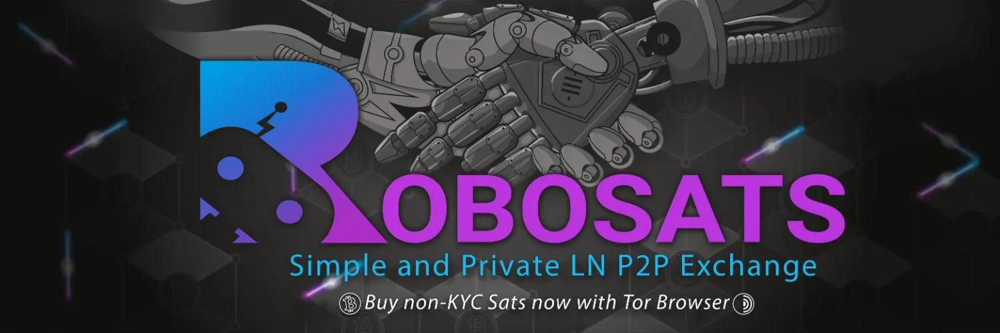
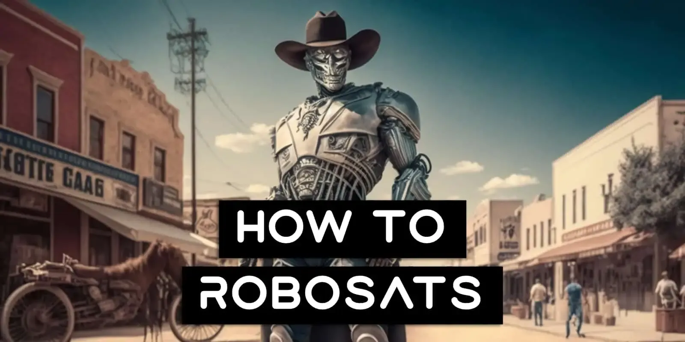
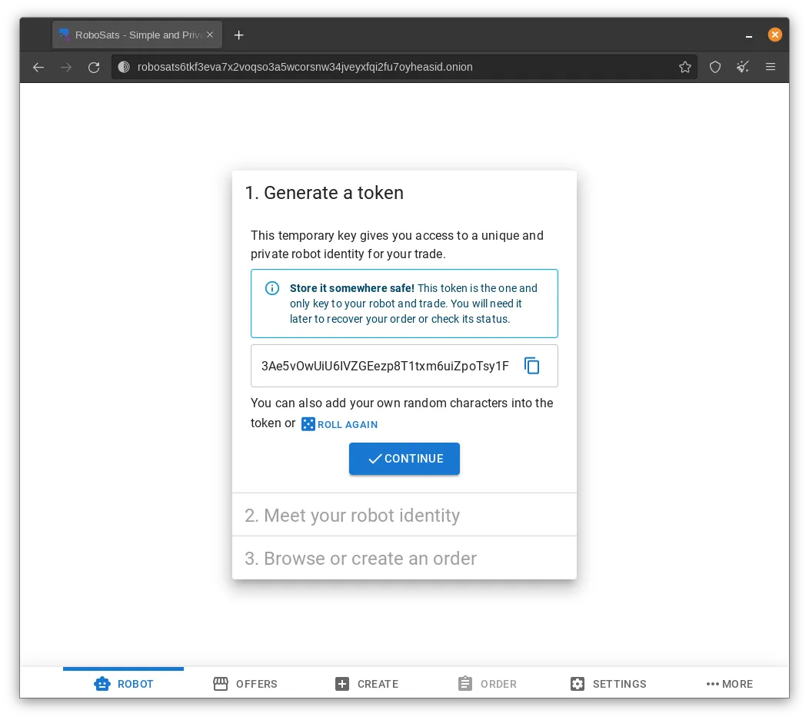
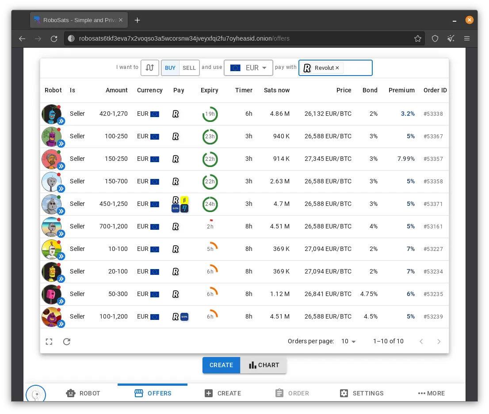
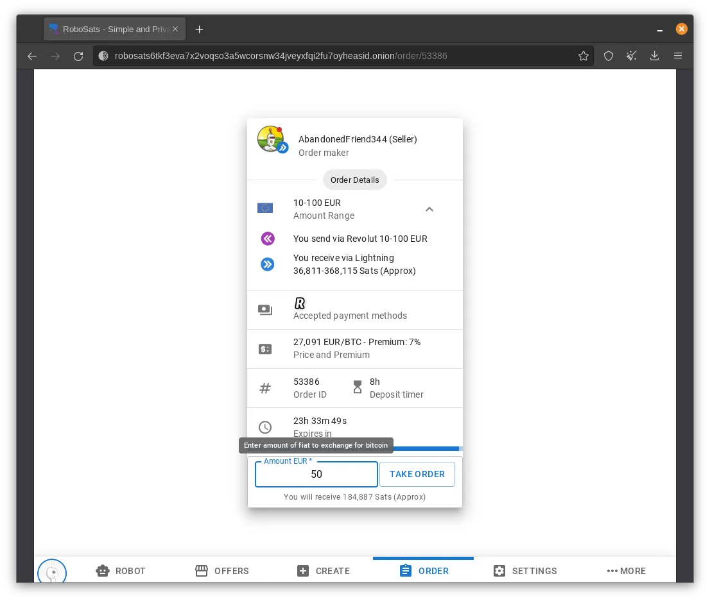
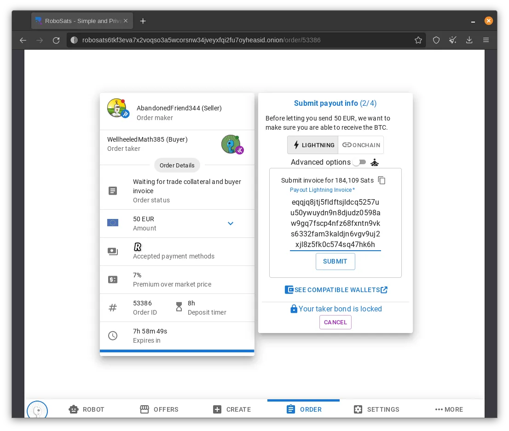
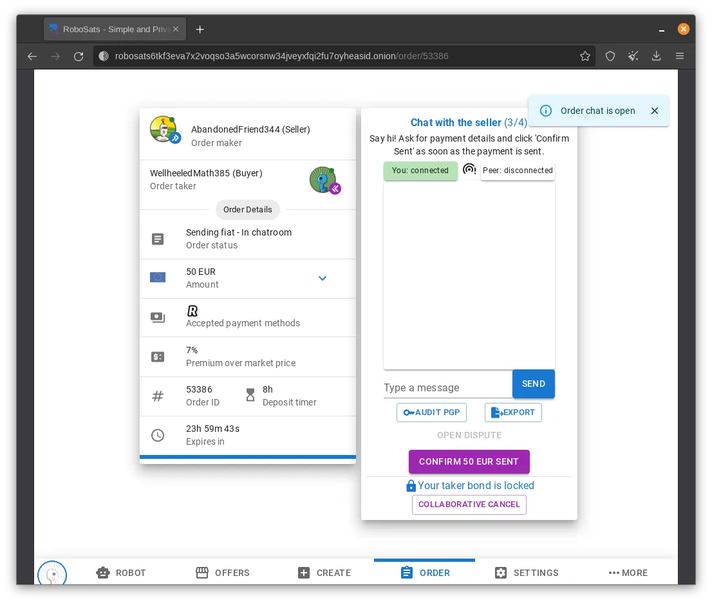
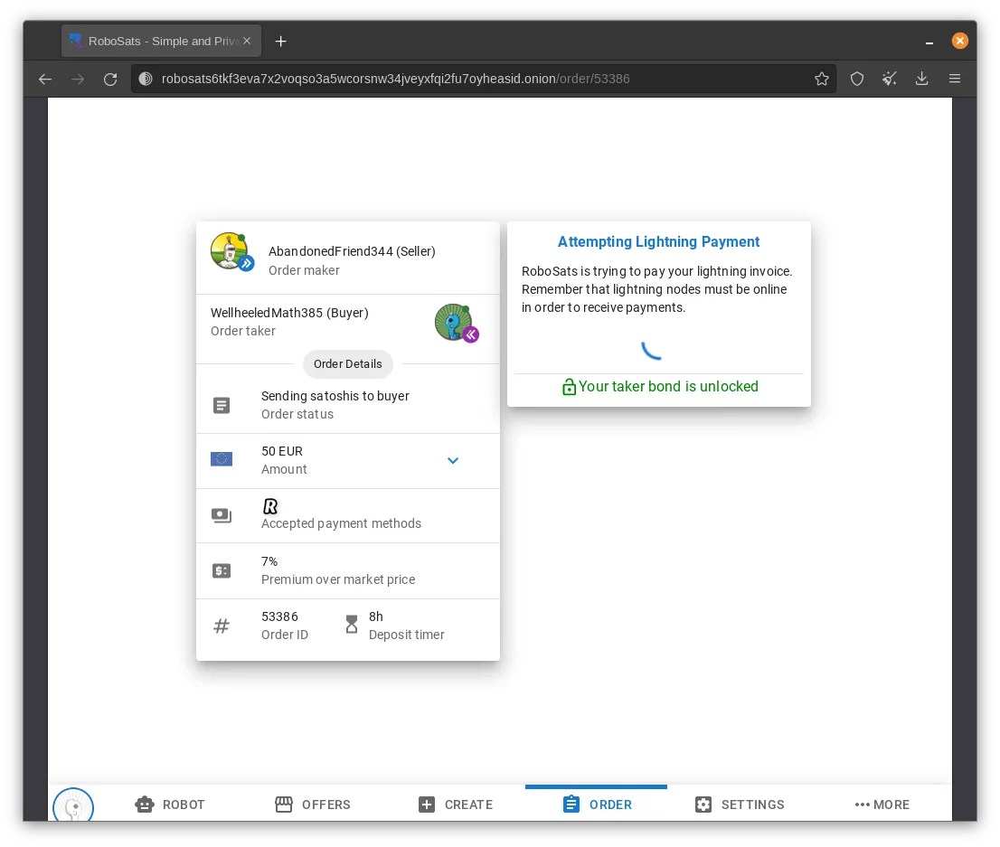
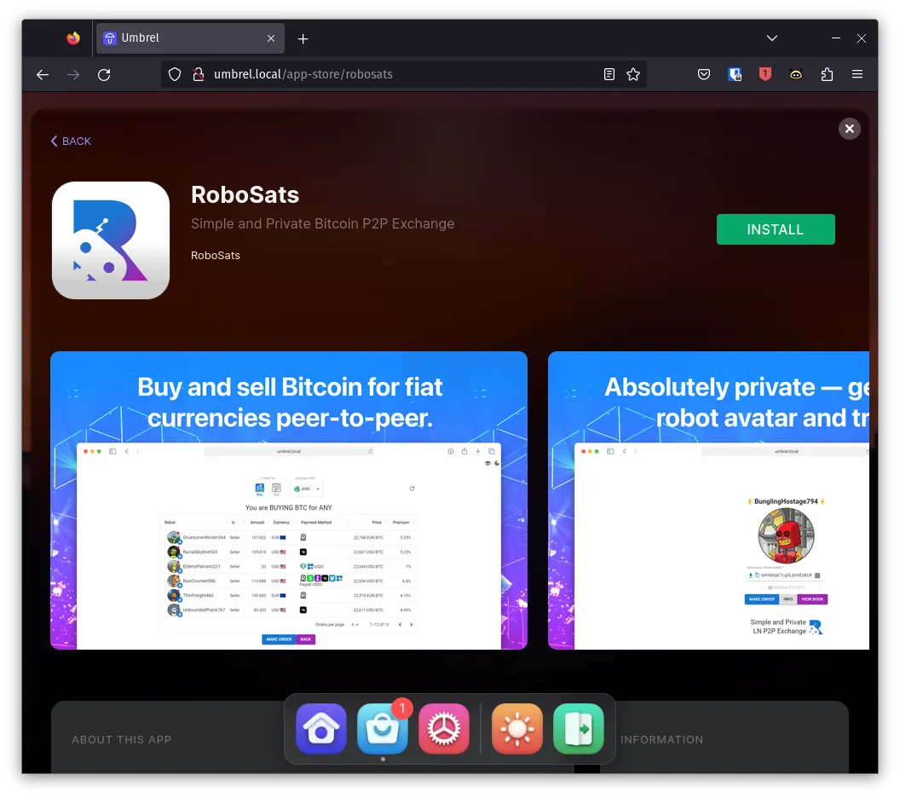

RoboSats (https://learn.robosats.com/) は、Bitcoinを国の通貨とプライベートに交換する簡単な方法です。ピアツーピアの経験を簡素化し、ライトニングホールドインボイスを使用して、保管と信頼の要件を最小限に抑えます。

## ガイド

> このガイドはBitocin Q&A ( https://bitcoiner.guide/robosats/) からのものです。彼に全てのクレジットがありますので、そちらで彼をサポートしてください (https://bitcoiner.guide/contribute)；BitcoinQ&Aはまた、ビットコインのメンターでもあります。メンタリングについては彼に連絡してください！

RoboSats - シンプルでプライベートなライトニングベースのP2P交換

## スタートする前に

### 知っておくべきこと

| 専門用語       | 定義                                                                                                                                                                                     |
| ------------ | -------------------------------------------------------------------------------------------------------------------------------------------------------------------------------------- |
| Robot        | 自動生成されるプライベートな取引アイデンティティ。同じロボットを複数回使用しないでください。これはプライバシーを低下させる可能性があります。                                                             |
| Token        | ユニークなロボットを生成するために使用されるランダムな文字列。                                                                                                                              |
| Maker        | Bitcoinの購入または販売のオファーを作成するユーザー。                                                                                                                                            |
| Taker        | 別のユーザーのBitcoinの購入または販売のオファーを受けるユーザー。                                                                                                                        |
| Bond         | 取引の公正な完了を約束するために両方のピアによってロックされるBitcoinの量。ボンドは通常、取引総額の3％で、Hodlインボイスによって供給されます。 |
| Trade Escrow | Hodlインボイスを使用して、売り手が取引額のBitcoinを保持する方法。                                                                                              |
| Fees         | RoboSatsは取引額の0.2％を課金し、これはメーカーとテイカーの間で分割されます。テイカーは0.175％を支払い、メーカーは0.025％を支払います。                                                       |

## 持っておくべきもの

### ライトニングウォレット

RoboSatsはライトニングネイティブなので、ボンドを資金提供し、購入者として購入したsatsを受け取るためにライトニングウォレットが必要になります。RoboSatsの機能を使うために使用される技術のため、すべてのウォレットが互換性を持っているわけではないので、ウォレット選びには注意してください。

ノードランナーの場合、Zeusが間違いなく最良の選択です。自分のノードを持っていない場合は、シンプルなセットアップとライトニングへのアクセスを提供するクロスプラットフォームのモバイルウォレットであるPhoenixを強くお勧めします。このガイドの制作にはPhoenixが使用されました。

### いくらかのBitcoin

取引が行われる前に、買い手と売り手はボンドを資金提供する必要があります。これは通常、非常に小さな額（取引額の約3％）ですが、それでも必要条件です。

RoboSatsを使用して最初のsatsを購入しますか？スタートするために必要なわずかな額を貸してくれる友人を探してみてはどうでしょうか！一人でやっている場合は、スタートするためにいくらかのnoKYC satsを入手するための他の素晴らしいオプションがあります。

### RoboSatsへのアクセス

当然ながら、RoboSatsにアクセスする必要があります！これを行う主な方法は4つあります：

1. Torブラウザ経由（推奨！）
2. 通常のウェブブラウザ経由（推奨されません！）
3. Android APK経由
4. 自分のクライアント

Torブラウザに慣れていない場合は、[こちら](https://www.torproject.org/download/)で詳細を学び、ダウンロードしてください。
iOSユーザーが自分の電話からTor経由でRoboSatsにアクセスするための簡単な注意点です。「Onion Browser」はTorブラウザーではありません。代わりにOrbot + SafariやOrbot + DuckDuckGoを使用してください。
## ビットコインの購入

以下の手順は、2023年5月にバージョン0.5.0を使用してTorブラウザー経由でアクセスし、実施されました。Android APK経由でRoboSatsにアクセスするユーザーにとっても、手順は同じであるはずです。

執筆時点でRoboSatsはまだ積極的な開発中であるため、インターフェースは将来少し変更される可能性がありますが、取引を完了するために必要な基本的な手順は大きく変わることはないでしょう。

> RoboSatsを初めて読み込むと、このランディングページが表示されます。Startをクリックしてください。

トークンを生成し、暗号化されたメモアプリやパスワードマネージャーのような安全な場所に保管してください。このトークンは、取引の途中でブラウザーやアプリが閉じた場合に、一時的なRobot IDを回復するために使用できます。

新しいRobotアイデンティティに会ったら、Continueをクリックしてください。

オファーを閲覧するためにOffersをクリックします。ページの上部で好みに合わせてフィルタリングできます。保証金のパーセンテージと平均為替レートに対するプレミアムに注意してください。

- Buyを選択
- 通貨を選択
- 支払い方法を選択

> 取引したいオファーをクリックします。売り手から購入したい金額（選択した法定通貨で）を入力し、最終的に詳細を確認してTake Orderをクリックしてください。

売り手がオンラインでない場合（プロフィール画像の赤い点で示されます）、取引に通常よりも時間がかかる可能性があるという警告が表示されます。続行して売り手が時間内に進行しない場合、無駄になった時間に対して彼らの保証金額の50％が補償されます。

次に、画面上の請求書を支払って取引保証金をロックする必要があります。これはあなたのウォレットで凍結される保留請求書です。取引の片方を完了できなかった場合にのみ請求されます。

Lightning WalletでQRコードをスキャンし、請求書を支払ってください。

次に、Lightning Walletで表示された金額の請求書を生成し、提供されたスペースに貼り付けてください。

売り手が取引金額をロックするのを待ちます。これが行われると、RoboSatsは自動的に次のステップに移動し、チャットウィンドウが開きます。こんにちはと言って、売り手に彼らの法定通貨の支払い情報を尋ねてください。提供されたら、選択した方法で支払いを行い、RoboSatsでこれを確認してください。RoboSats内のすべてのチャットはPGPで暗号化されており、あなたと取引相手のみがメッセージを読むことができます。

売り手が支払いの受領を確認すると、RoboSatsは自動的に以前に提供された請求書を使用して支払いを解放します。

請求書が支払われると、取引は完了し、あなたの保証金は解除されます。その後、取引の要約が表示されます。

Lightning Walletでsatsが到着したことを確認してください。

## 追加機能

ビットコインの購入と販売以外にも、RoboSatsには知っておくべきいくつかの機能があります。
Robot Garage
複数の取引を同時に行いたいが、同じアイデンティティを共有したくないですか？問題ありません！ロボットタブをクリックし、追加のロボットを生成して、次の注文を作成または受け取ってください。

### 注文の作成

他人のオファーを受けるだけでなく、自分のオファーを作成して、別のロボットがあなたに来るのを待つこともできます。

- 「Create」ページを開きます。
- 注文がBitcoinの購入か売却かを定義します。
- 購入/売却したい金額と通貨を入力します。
- 使用する意向のある支払い方法を入力します。
- 受け入れる意向のある「市場価格に対するプレミアム」%を入力します。現在の市場価格に対して割引で入札する場合、この数値はマイナスになることがあります。
- 「Create Order」をクリックします。
- Maker BondをロックするためにLightning請求書を支払います。
- 注文が現在有効になりました。誰かがそれを受け入れるのを待ってリラックスしてください。

### オンチェーン支払い

RoboSatsはLightningに焦点を当てていますが、購入者は自分のsatsをオンチェーンのBitcoinアドレスに受け取るオプションを選択できます。購入者は、自分のボンドをロックアップした後にこのオプションを選択できます。オンチェーンを選択した後、購入者は手数料の概要を確認できます。このサービスの追加手数料には以下が含まれます：

- RoboSatsによって収集されるスワップ手数料 - この手数料は動的で、Bitcoinネットワークの混雑具合に応じて変動します。
- 支払いトランザクションのためのマイニング手数料 - これは購入者によって設定可能です。

### P2Pスワップ

RoboSatsでは、ユーザーは自分のLightning Walletからsatsをスワップしたり、そのWalletにsatsをスワップしたりすることができます。オファーページの上部にあるスワップボタンをクリックして、現在のスワップオファーを表示します。

「Swap In」オファーの購入者としては、オンチェーンのBitcoinをピアに送り、広告された手数料および/またはプレミアムを差し引いた後、自分のLightning Walletにsatsを受け取ります。「Swap Out」オファーの購入者としては、Lightning経由でsatsを送り、任意の手数料および/またはプレミアムを差し引いた後、オンチェーンアドレスにBitcoinを受け取ります。SamouraiまたはSparrow Walletのユーザーは、スワップを完了するためにStowaway機能を利用することもできます。

RoboSatsのスワップオファーには、RBTC、LBTC、WBTCなどのBitcoinにペッグされた代替品も含まれることがあります。これらのトークンを扱う際には極度の注意が必要です。なぜなら、それぞれに様々なトレードオフが存在するからです。ペッグされたBitcoinはBitcoinではありません！

### 自分のRoboSatsクライアントを実行する

Umbrel、Citadel、Start9のノードランナーは、自分のノードに直接自分のRoboSatsクライアントをインストールできます。そうすることの利点は以下の通りです：

- 著しく速いロード時間。
- より安全：実行するRoboSatsクライアントアプリを自分で制御できます。
- 任意のブラウザー/デバイスから安全にRoboSatsにアクセスできます。ローカルネットワーク上にいる場合やVPNを使用している場合はTORを使用する必要はありません：匿名化に必要なtorificationはノードバックエンドが処理します。
- 接続するP2Pマーケットコーディネーターを制御できます（デフォルトはrobosats6tkf3eva7x2voqso3a5wcorsnw34jveyxfqi2fu7oyheasid.onion）

## FAQ

### 騙される可能性はありますか？
購入者として、取引の一環として必要な法定通貨を送金したが、売り手があなたにサトシを解放しない場合、紛争を申し立てることができます。この紛争プロセス中に、法定通貨を送金したことをRoboSatsの仲裁人に証明できれば、売り手のエスクロー資金とその取引ボンドがあなたに解放されます。取引をどのようにキャンセルしますか？

取引ボンドを投稿した後、取引メニュー内の「Collaborative Cancel」ボタンをクリックすることで取引をキャンセルできます。取引相手がキャンセルに同意していれば、手数料はかかりません。しかし、取引相手が取引を完了したいと思っていても、それでもキャンセルを進める場合、取引ボンドを失うことになります。

### RoboSatsは「X」支払い方法に対応していますか？

RoboSatsでは支払い方法に制限はありません。希望の方法でオファーが見つからない場合は、それを使用して自分のオファーを作成してください！

### RoboSatsを使用するとき、RoboSatsは私について何を知ることができますか？

TorまたはAndroidアプリを介してRoboSatsを使用する限り、何もありません！こちらで詳細をご覧ください。

- Torはネットワークのプライバシーを保護します。
- PGP暗号化は取引チャットをプライベートに保ちます。
- アカウントがないことは、取引ごとに1つのロボットを意味します。これは、RoboSatsが複数の取引を単一のエンティティに関連付けることができないことを意味します。

ただし、注意点がいくつかあります！ライトニングは送信者としてはかなりプライベートですが、受信者としてはそうではありません。自分のライトニングノードに受け取る場合、ノードIDが請求書で共有されます。このノードIDは、それを知っている人に、オンチェーン活動をリンクしようとする出発点を与えます。これは、ユーザーがオンチェーンでの支払いを受け取ることを選択した場合にも当てはまります。

これを軽減するために、ユーザーはライトニング用のプロキシウォレットやオンチェーン用のCoinjoinなどのソリューションを使用することを選択できます。

### フェデレーション

現在、RoboSats開発チームによって運営されている単一のRoboSatsコーディネーターがあります。Bitcoinでは、あらゆる形態の中央集権化は、特定のサービスを好ましく思わない政府や規制当局にとってより簡単な標的となります。

RoboSatsがオープンソースプロジェクトであるため、誰でもコードを取得して自分のコーディネーターを運営を開始することができます。これはある程度、リスクを単一の標的から分散させるものの、すでに希薄な流動性市場をさらに分断します。

RoboSatsチームはこれを認識しており、フェデレーテッドモデルの作業を開始しました。エンドユーザーとしては、上記の取引フローはあまり変わらないはずですが、新たに現れる異なるコーディネーターを追加または削除するための追加のビューや画面があります。

ガイドの終わり
https://bitcoiner.guide/robosats/