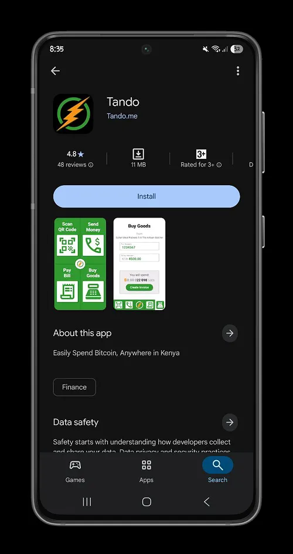
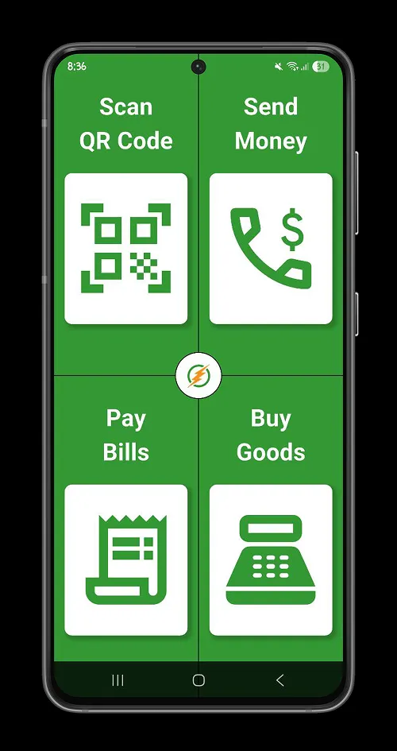
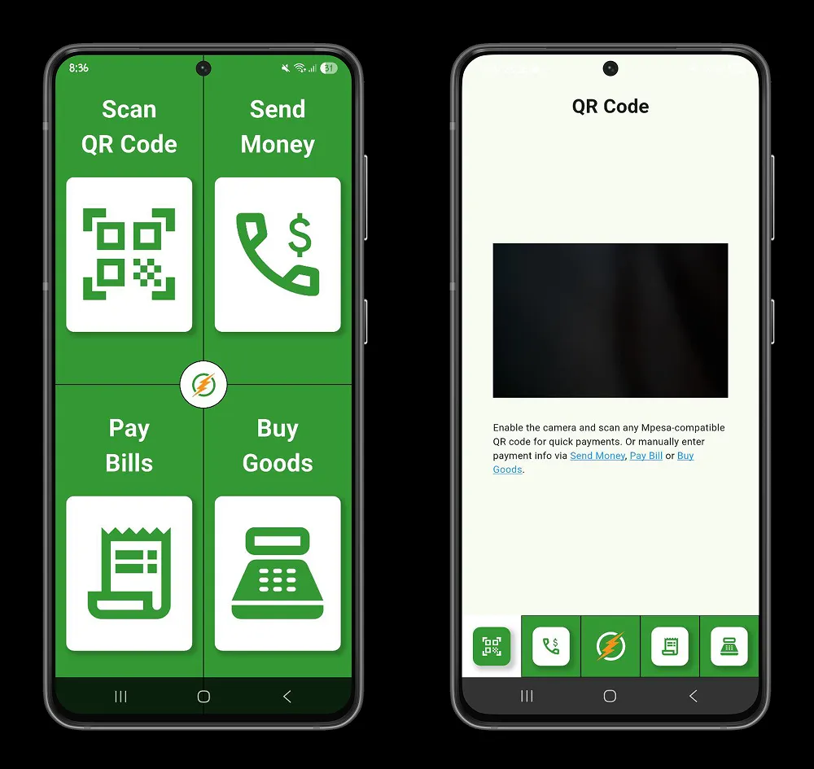
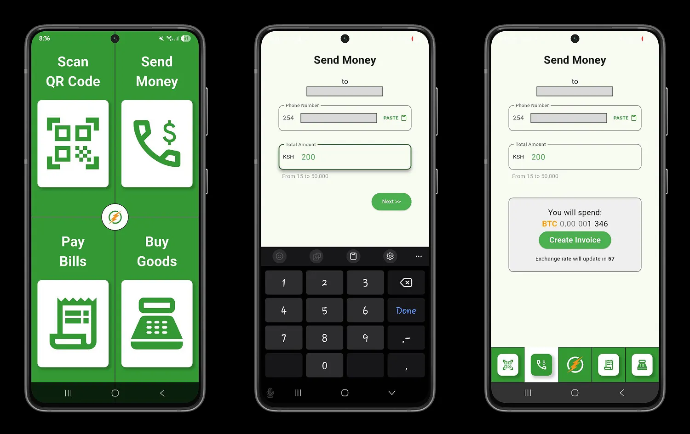
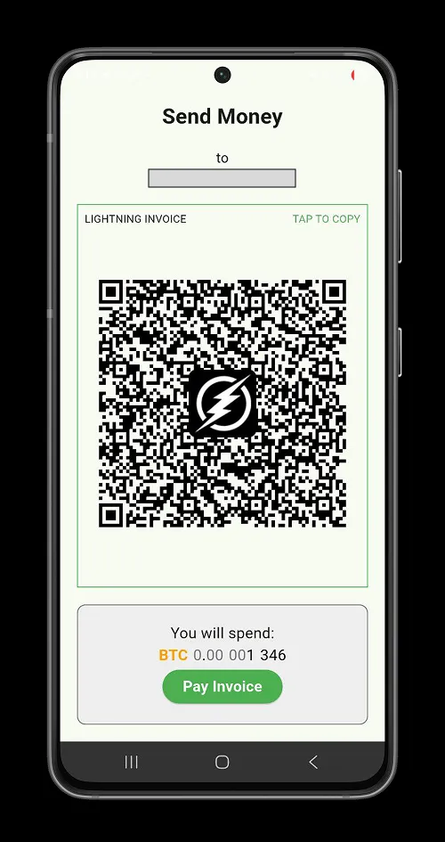
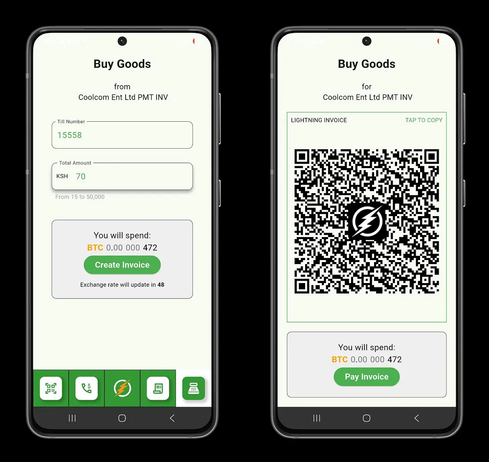
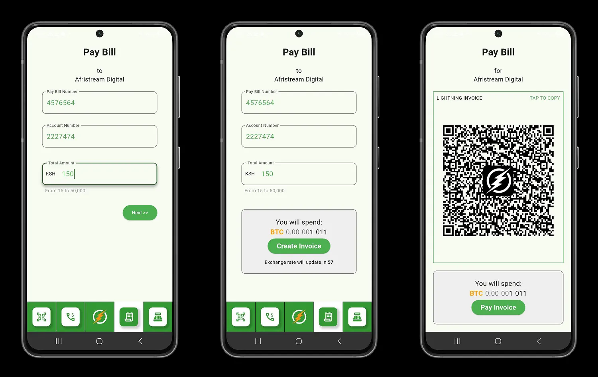
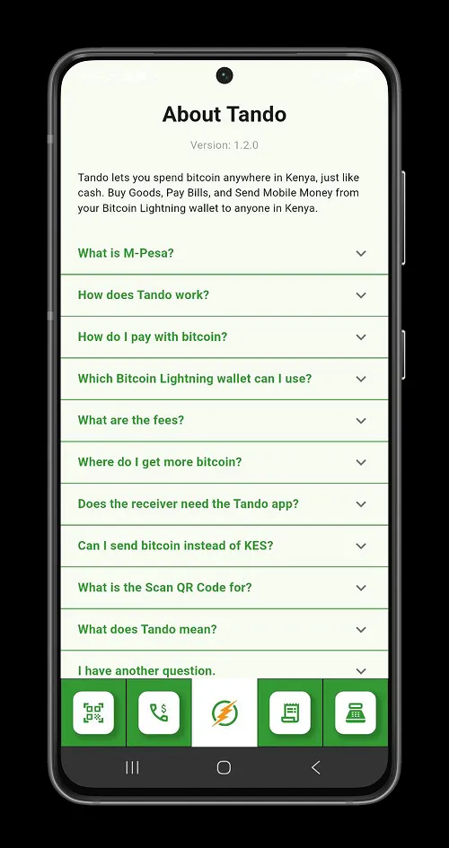

La tecnologia Bitcoin, rappresenta un'innovazione su cui sempre più comunità africane fanno affidamento per costruire e consolidare la propria sovranità e per migliorare la qualità del proprio commercio eliminando le barriere economiche e regionali.

L'avventura di Tando, la super-app keniota, inizia nel 2023 alla **Conferenza africana Bitcoin** sotto la spinta della presentazione di **Femi Longe**: *Gli africani devono creare soluzioni Bitcoin per gli africani*. Nel 2024, Tando viene distribuito in Kenya e continua a facilitare l'utilizzo quotidiano del Bitcoin attraverso il Lightning Network.

## Come iniziare con Tando

Tando è un’applicazione mobile disponibile su Android e iOS, che ti permette di utilizzare Bitcoin ovunque in Kenya. In questo tutorial ci concentreremo sulla piattaforma Android; tuttavia, i processi descritti di seguito sono validi anche per iOS.

Tando è un mezzo di scambio basato su due tecnologie:

- Lightning Network: il livello di Bitcoin per pagamenti istantanei e praticamente gratuiti.
- M-Pesa: il servizio di mobile money più popolare in Kenya.

Non richiede informazioni personali ai suoi utenti e non richiede la verifica dell'identità. Con Tando è possibile proteggere la propria privacy durante le transazioni.

In Kenya, la maggior parte dei commercianti, dei supermercati, dei fornitori di servizi e delle transazioni finanziarie può essere effettuata tramite M-Pesa. Colmando il divario tra Lightning Network e M-Pesa, Tando consente di utilizzare i bitcoin ovunque M-Pesa sia accettato e il destinatario riceva scellini kenioti (KES).

Con Tando, è possibile utilizzare Bitcoin per :

- Pagare beni e servizi
- Inviare denaro
- Pagare le bollette

Con la sua interfaccia intuitiva e minimalista, Tando permette di utilizzare qualsiasi wallet Lightning per effettuare pagamenti in scellini kenioti (KES). Questo offre ai visitatori stranieri l’opportunità di vivere in Kenya senza contanti, utilizzando normalmente il proprio wallet Lightning. Tando fornisce inoltre al Bitcoin un quadro pratico per l’utilizzo, promuovendone l’adozione nelle comunità keniote.

## Utilizzo di Tando

Tando consente di utilizzare i bitcoin per acquistare tutto ciò che M-Pesa può acquistare in Kenya. Inoltre, le commissioni di transazione sono praticamente nulle rispetto alle transazioni M-Pesa. Quando utilizzate Tando, pagate l'equivalente in KES con il vostro Lightning Wallet e, utilizzando la loro infrastruttura, Tando convertirà il vostro pagamento Lightning in scellini kenioti (KES) e poi invierà la somma al numero M-Pesa da voi specificato.

https://planb.network/tutorials/wallet/mobile/blitz-wallet-794bdac4-1af4-49d5-9ea5-abb8228ca196

https://planb.network/tutorials/wallet/mobile/phoenix-0f681345-abff-4bdc-819c-4ae800129cdf

https://planb.network/tutorials/wallet/mobile/wallet-of-satoshi-39149d86-e42b-4e8f-ae9f-7e061e7784f7

- **Scansione per pagare**:

Scan to pay è una delle opzioni di pagamento automatico dell'applicazione. Scansionate il codice M-Pesa disponibile presso l'esercente, quindi inserite l'importo da pagare e procedete al pagamento del Lightning Invoice che verrà generato per voi.

- **Invio di denaro in Kenya**:

L’opzione di trasferimento di denaro di Tando ti permette di inviare fondi in Kenya da qualsiasi parte del mondo. In questo modo, puoi effettuare transazioni transfrontaliere e intercontinentali verso il Kenya, senza commissioni eccessive, utilizzando il tuo wallet Lightning.

Seleziona l’opzione Invia denaro, quindi inserisci il numero del destinatario. Inserisci l’importo da inviare (tra 15 e 50.000 KES), quindi crea la fattura Lightning associata a questo pagamento.

Paga la fattura dal tuo wallet Lightning e Tando la convertirà in scellini kenioti (KES), inviandola al destinatario indicato.

- **Pagare le bollette**:

Inserire il numero del Invoice che si desidera pagare, quindi procedere al pagamento del Invoice Lightning associato.

- **Acquisto di merci**:

Fai acquisti direttamente con Tando. Inserisci il numero del commerciante e l’importo totale dei tuoi acquisti in scellini kenioti (KES), quindi genera la fattura Lightning per il pagamento.

Nel menu dell’applicazione troverai inoltre tutte le informazioni su Tando, così da comprendere meglio la loro visione e le tariffe.

Sempre più iniziative come Tando stanno nascendo nelle comunità africane. Scopri BitSpenda, un progetto ghanese che punta a utilizzare Bitcoin per effettuare pagamenti in Ghana, Nigeria e Kenya.

https://planb.network/tutorials/exchange/centralized/bitspenda-34cf6f5d-4464-4f26-809f-de4af3cec5fd

