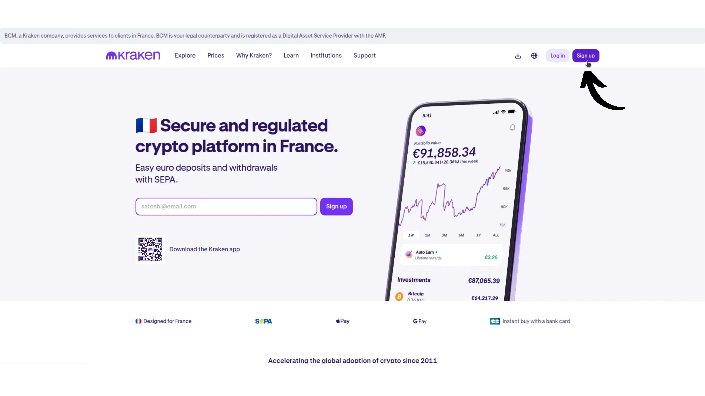
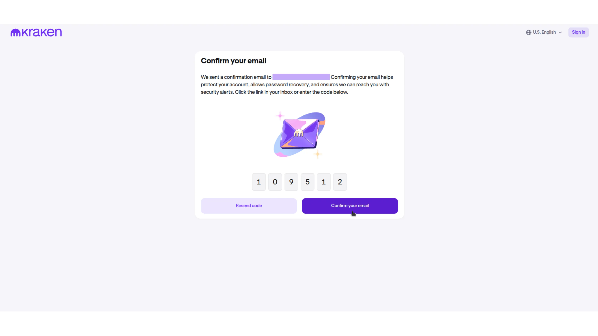
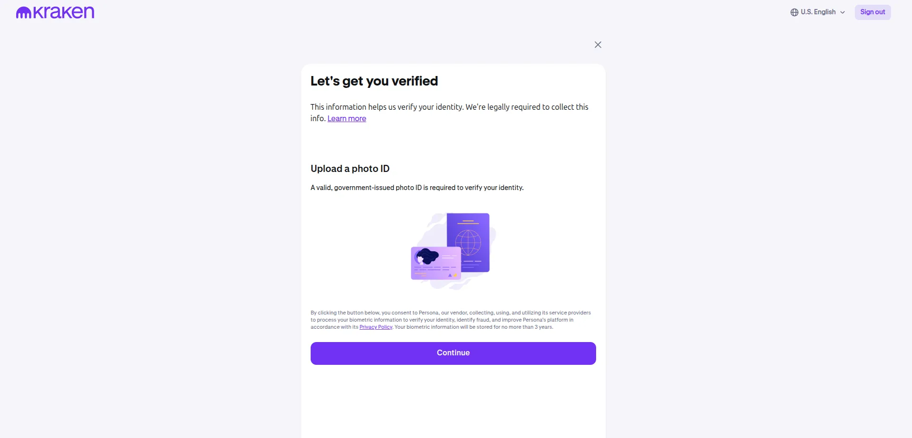
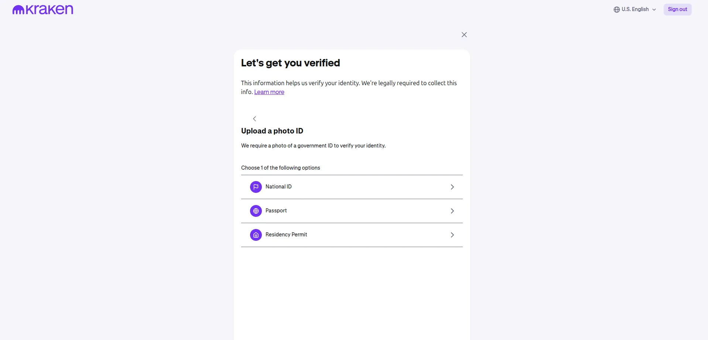
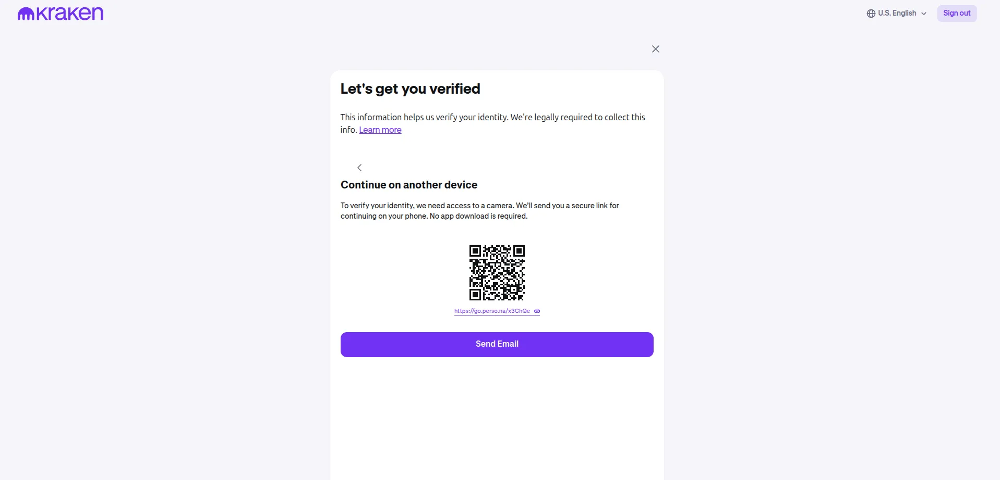
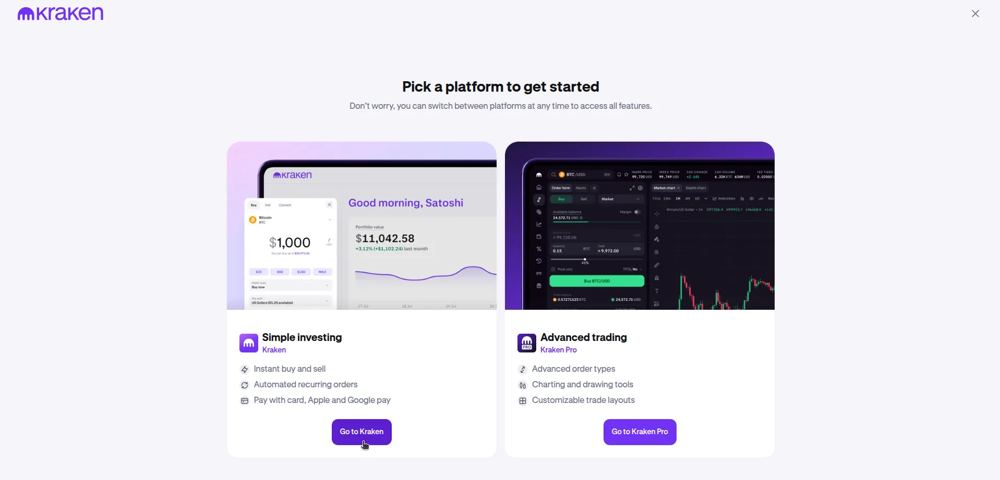
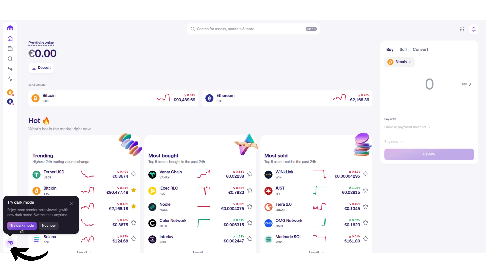
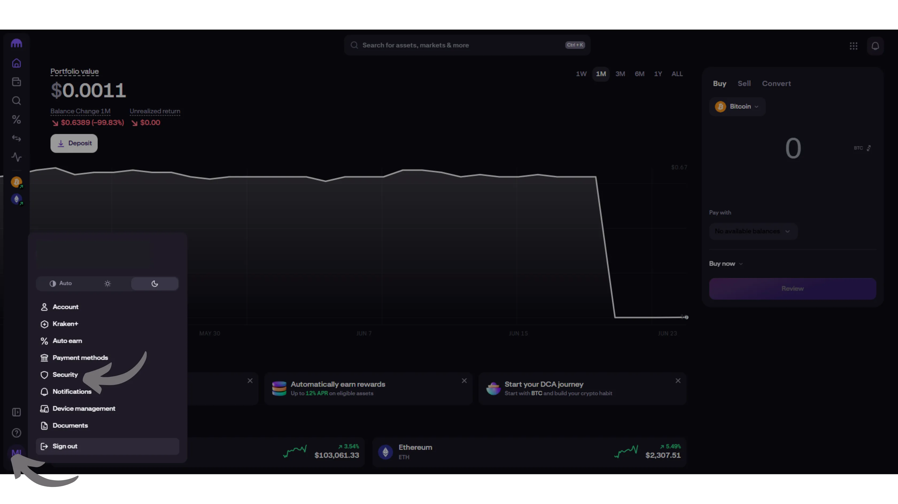
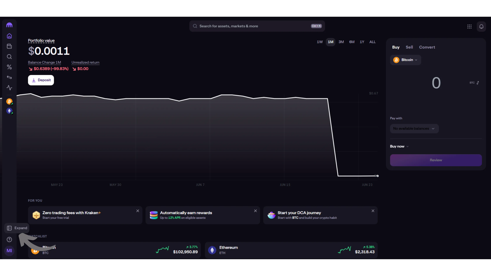
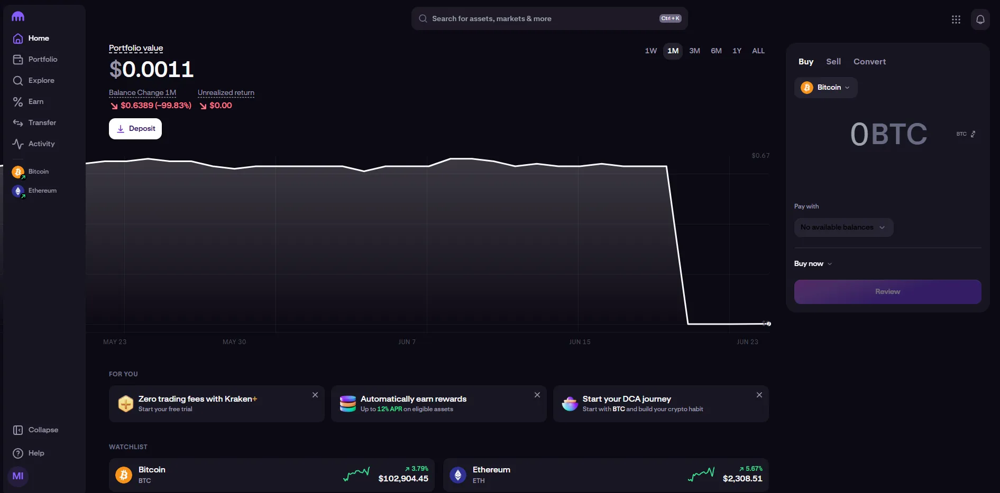

Kraken est une des plateformes d'échange de bitcoins et cryptomonnaies les plus anciennes du monde. L'entreprise a été créée dès 2011 par Jesse Powell et ses associés. Powell ayant été consultant pour MtGox alors plateforme leader du marché, et ayant anticipé sa chute, lance en 2013 Kraken avec pour objectif majeur de remplacer MtGox qu'il sait condamnée, et de ne pas répéter les mêmes erreurs. Cela en fait une des plus ancienne et réputée plateforme d'exchange du monde.

Aujourd'hui, Kraken est une plateforme complète, permettant aussi bien des achats simples de bitcoins que l'utilisation de fonctionnalités de trading avancées avec des outils de gestion de risque. Elle est accessible en version web, et pour des transactions simples, une application mobile facile à prendre en main est également disponible.

Au delà de toutes ces fonctionnalité qui en tant que Bitcoiner ne nous intéressent pas beaucoup, il est à noté que Kraken a été un des 1er échanges à supporter le Lightning Network sur sa plateforme, permettant le retrait **sans frais** des satoshis acquis, encouragent ainsi la self custody chez ses utilisateurs

## 1 - Création d’un compte sur Kraken

Rendez-vous sur [le site officiel de Kraken](https://www.kraken.com/). Sur la page d'accueil, trouvez et cliquez sur l'option "Sign Up" en haut à droite pour commencer la création de votre compte.

Choisissez ensuite de créer un compte personnel ou pour votre société. Ici on choisira **Personnel**, mais mis à part la procédure d'identification qui changera quelque peu, les fonctionnalités ne changent pas entre un compte pro et perso. Renseignez votre mail et mot de passe d'accès, puis cliquez sur "Create account".

Ensuite renseignez le code reçu par l'intermédiaire de l'adresse mail que vous venez de renseigner, puis cliquez sur "Confirm your email".

Entamez ensuite la procédure de vérification d'identité réglementaire imposée par les autorités...

Terminez de renseigner vos informations personnelles et cliquez sur "continue".

Sur l'écran suivant de nouvelles informations personnelles sont à renseigner, n'oubliez pas que vous êtes tous des criminels en puissance qu'il convient d'identifier impérativement. Renseignez les en fonction de votre cas puis cliquez sur "Continue"

Ensuite il conviendra de vérifier votre identité en fournissant des photos d'un document officiel d'identité de votre choix. Suivez les étapes nécessaires au scan de votre document.

Pour (presque) terminer, il vous sera demandé un accès à la webcam de votre ordinateur si vous en avez une (pour pendre en photo le document d'identité choisi), ou de scanner le QR code présenté à l'écran avec un appareil mobile disposant d'une caméra pour réaliser les prises de vue.

Une fois les photos recto/verso de votre pièce d'identité envoyées, dernière humiliation, on vous demandera de prendre une photo de votre visage pour confirmer que celle-ci match bien avec celle du document d'identité.... Enfin les choses sérieuses vont pouvoir débuter.

## 2 - Sécurisation de votre comte Kraken

Vous voilà désormais connecté à votre compte. Il vous sera ensuite demandé de chosir entre 2 type d'expérience. Une simple sur la gauche appelée "Kraken" avec une interface épurée, qui permet en synthèse simplement d'acheter et de vendre des bitcoins. Une autre sur la droite apelée "Kraken Pro" qui permet beaucoup plus d'optionnalité, avec une interface bien plus chargée et moins lisible destinée aux profils "traders".

Il est à noté que les frais d'achat diffèrent que l'ont choississe l'un ou l'autre, comme on le verra par la suite.

Commençons par choisir l'expérience simple en cliquant sur "Go to Kraken" en bas à gauche.

L'interface est un effet plutôt sobre et colorée. Avant même d'aller sécuriser notre compte en lui ajoutant une méthode d'authentification à 2 facteurs, allons cliquer en bas à gauche sur notre profil pour passer en mode nuit et éviter de nous faire trop mal aux yeux avec tout ce blanc.

Nos yeux maintenance à l'abris, cliquons à nouveau sur notre profil pour faire apparaitre le menu nous permettant d'ajouter un 2FA (2ème facteur d'authentification). Puis choisissez "Security".

Deux option de 2FA vous sont alors proposées, soit "passkey" qui vous permettra de vous authentifier via la biométrie de votre smartphone, soit "Authenticator App".

- Si vous chioississez l'option "passkey" laissez vous guider par les instruction qui vous seront donnée à l'écran. On vous demandera en synthèse de sélectionner l'appareil qui sera nécessaire pour donner l'accès à votre compte, soit le PC sur lequel vous êtes, soit un smartphone, soit une clé hardware d'identification type YubiKey.

- Si vous choisissez d'utilisez une application d'authentification sur votre smartphone, telle que Google Authenticator ou Authy par exemple, vous trouverez un tutoriel sur cet outil ici :

https://planb.network/tutorials/computer-security/authentication/authy-a76ab26b-71b0-473c-aa7c-c49153705eb7

 Après avoir choisis la méthode qui vous convient le mieux, nous sommes enfin prêt à déposer de l'argent pour acheter nos premiers satoshis.

## 3 - Découverte rapide de l'interface de Kraken

Revenez ensuite au menu principal en cliquant en haut à droite sur la petite maison comme indiqué ci-dessous :

Faisons un petit tour d'horizon rapide du menu principal, avant notre 1er achat.
En cliquant sur  " Expand" en bas à droite on peut étirer un peu la barre de menu latérale pour y voir les menus explicitement.

De haut en bas nous voyons l'onglet:
- "Portfolio", qui vous permettra d'avoir un aperçu de vos avoirs en bitcoins, crypto, et autres monnaies fiat  (euro, dollars etc), ainsi que leur répartition en pourcentage.
- "Explore" par forément utile pour nous autres bitcoiners vous permets d'aller explorer le monde des shitcoins qui vous permettra de découvrir la pépite qui vous rendra pauvre à coup sur.
- "Earn" on en parlera même pas car je n'encourage personne à l'utiliser (shitcoinery), et est hors sujet dans le cadre de ce tuto.
- "Transfer" vous permet comme on le verra plus en détail par la suite, d'alimenter votre compte Kraken en satoshis/euros/fiat, ou au contraire de les retirer de la plateforme.

## 4 - Dépôt et retrait d’euros (fiat)

Pour acquérir nos premiers "sats" il conviendra de déposer au préalable une monnaie fiat sur la plateforme , dans notre cas l'euro.
Pour ce faire, choisissez le menu "Transfer"