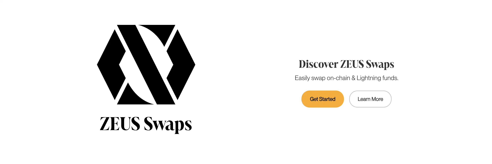
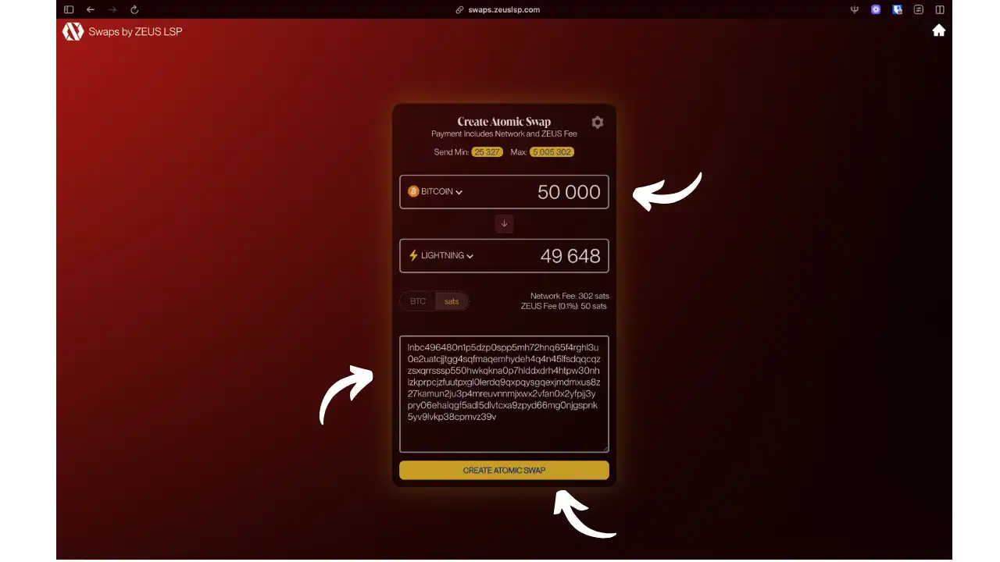
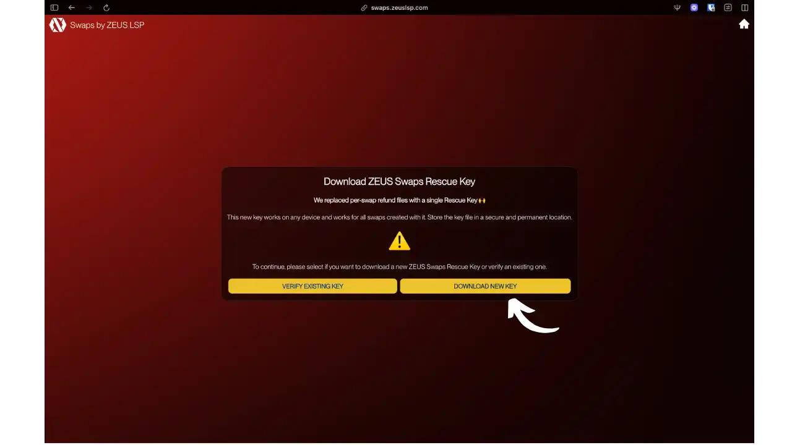
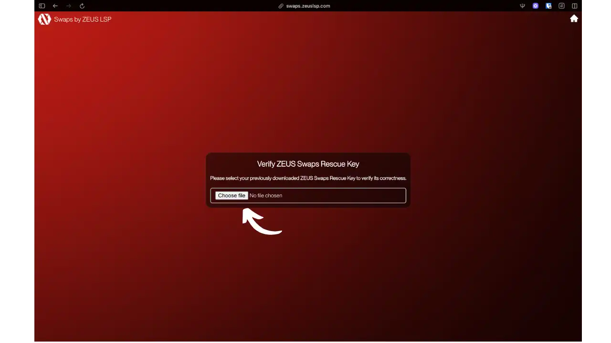
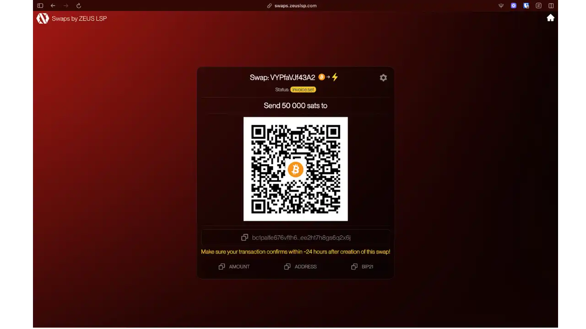
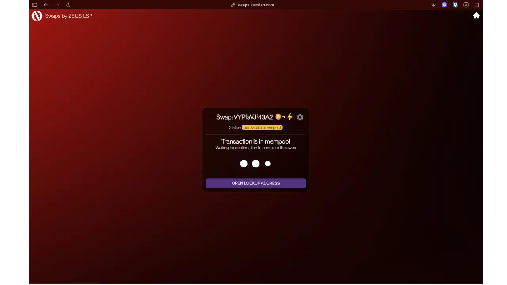
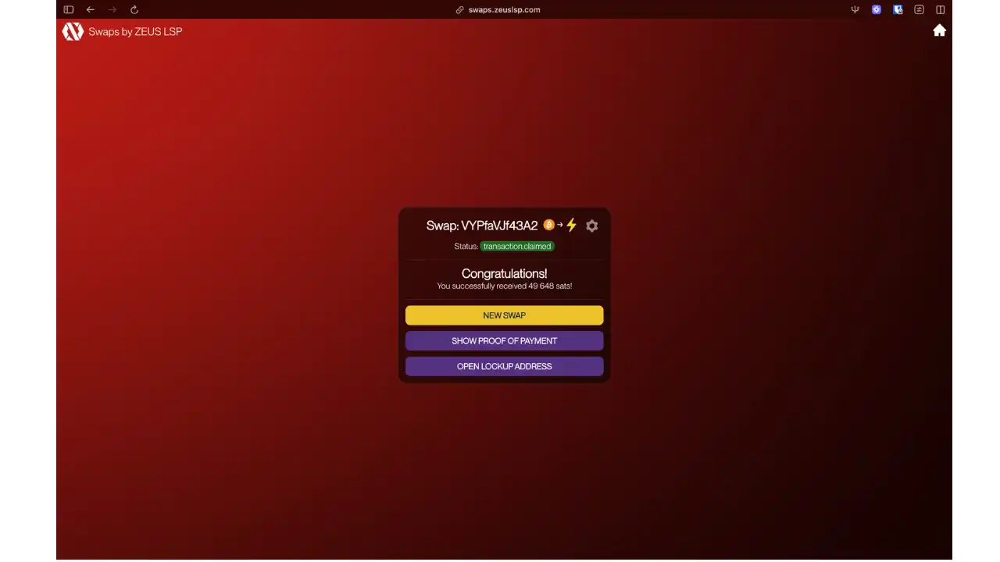
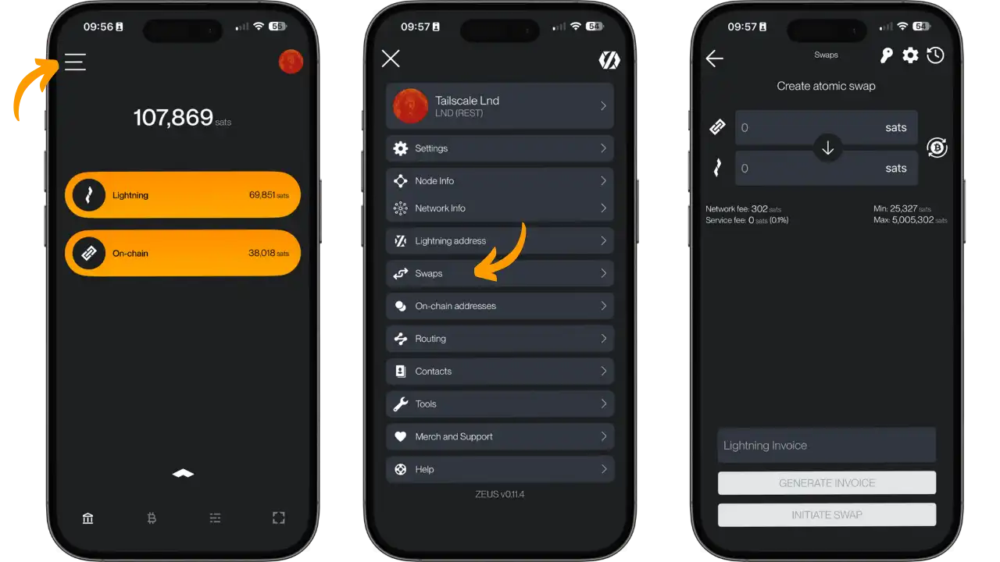
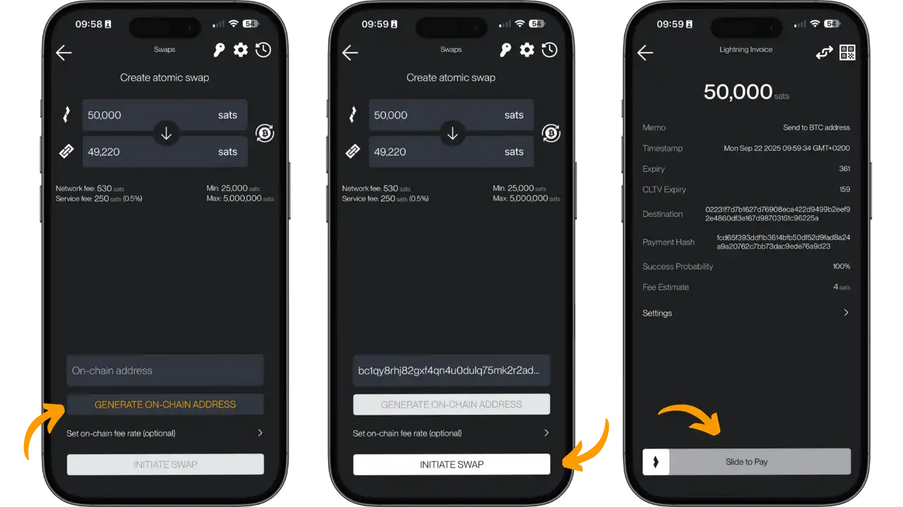
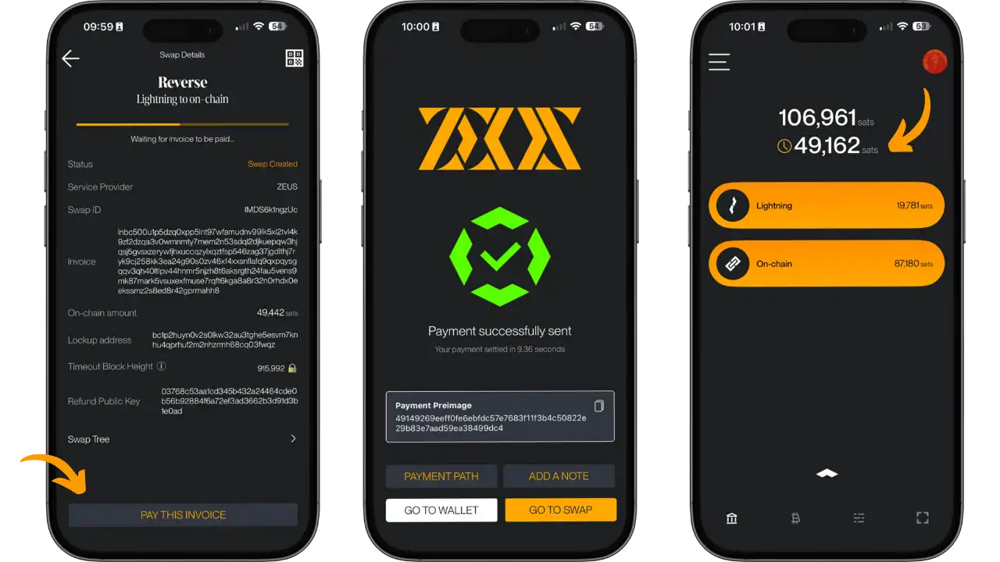

L'ecosistema Bitcoin presenta una dualità: la rete principale (On-Chain) offre la massima sicurezza, mentre la Lightning Network permette transazioni istantanee. Questa architettura a due livelli crea una sfida pratica: come trasferire fondi in modo efficiente tra questi due livelli senza intermediari centralizzati?

Il problema è concreto: ricevi un pagamento Lightning ma vuoi conservarlo in Cold storage, oppure hai bitcoin On-Chain ma ti serve liquidità Lightning. Le soluzioni tradizionali prevedono l’apertura/chiusura manuale dei canali Lightning (costosa e tecnica) o piattaforme centralizzate che richiedono KYC.

Zeus Swap risolve questo problema con un servizio di scambio automatico e non-custodial. Sviluppato da Zeus LSP, permette di convertire bitcoin On-Chain in satoshi Lightning in entrambe le direzioni, senza affidare i fondi a un intermediario. Il processo utilizza contratti atomici (HTLC) che garantiscono che lo scambio si completi o venga annullato.

L'innovazione sta nella semplicità: pochi click per uno scambio che preserva la tua sovranità finanziaria, senza registrazione o KYC.

## Cos'è Zeus Swap?

Zeus Swap è un servizio di scambio di liquidità sviluppato da Zeus LSP che consente atomic swap tra la rete Bitcoin principale e la Lightning Network. Si tratta di un'infrastruttura tecnica che usa submarine swap e reverse swap per facilitare la conversione bidirezionale tra BTC On-Chain e satoshi Lightning, mantenendo la natura non-custodial dell’operazione.

### Architettura tecnica

Zeus Swap utilizza la tecnologia open-source di atomic swap Bitcoin/Lightning di Boltz. Il protocollo sfrutta i contratti Hash Time Locked (HTLC): contratti che bloccano fondi con due condizioni di rilascio (rivelazione di un segreto crittografico o scadenza temporale).

Per un submarine swap (On-Chain → Lightning), l'utente invia bitcoin a un indirizzo che incorpora l'hash di una fattura Lightning. Zeus LSP sblocca i fondi solo pagando la fattura corrispondente, rivelando il pre-image che sblocca automaticamente i bitcoin. Questo meccanismo garantisce l’atomicità.

Per un reverse swap (Lightning → On-Chain), l'utente paga una fattura Lightning di Zeus LSP, rivelando un pre-image che permette il rilascio di una transazione Bitcoin preparata verso l’indirizzo di destinazione.

Per maggiori dettagli sul funzionamento della Lightning Network, consulta il nostro corso dedicato :

https://planb.network/courses/34bd43ef-6683-4a5c-b239-7cb1e40a4aeb

### Modello di business

Zeus LSP agisce come market maker, mantenendo liquidità On-Chain e Lightning per onorare gli swap. Per gli swap, Zeus applica una commissione variabile (tipicamente 0,1% - 0,5% a seconda della direzione e delle condizioni) più la commissione di mining di Bitcoin, mostrata chiaramente prima della conferma.

Come Lightning Service Provider, Zeus ottimizza i costi grazie alla sua esperienza in apertura canali on-demand, routing efficiente e soluzioni di liquidità personalizzate.

### Integrazione

Zeus Wallet integra nativamente il servizio, permettendo swap senza lasciare l’app Bitcoin/Lightning. Questo elimina il fastidio di copiare e incollare tra applicazioni.

L'interfaccia web indipendente resta accessibile a tutti i wallet, garantendo massima flessibilità.

## Funzionalità principali

### Swap bidirezionali

Zeus Swap offre due tipi di scambio:

**Submarine swap (On-Chain → Lightning)**: inietta liquidità Lightning dai tuoi bitcoin, utile per alimentare un Wallet mobile o un nodo Lightning senza aprire manualmente canali.

**Reverse swap (Lightning → On-Chain)**: trasforma satoshi Lightning in bitcoin On-Chain per conservazione a lungo termine, evitando chiusure costose di canali.

### Interfacce utente

**Interfaccia web** (swaps.zeuslsp.com): esperienza semplificata senza registrazione, processo guidato con visualizzazione in tempo reale di commissioni e stato.

**Integrazione Zeus Wallet**: swap diretti dall’app, gestione automatica di fatture e indirizzi, eliminando errori manuali.

### Sicurezza e recupero

Ogni swap genera un contratto unico con parametri immutabili: Hash Lightning, timeout, indirizzo di rimborso. In caso di fallimento, recupero automatico tramite l’indirizzo fornito, indipendentemente da Zeus LSP.

**Zeus Swaps Rescue Key**: durante uno swap On-Chain → Lightning, Zeus genera automaticamente una chiave universale di recupero che sostituisce i vecchi file di rimborso individuali. Questa chiave funziona su qualsiasi dispositivo e per tutti gli swap creati con essa. È fondamentale scaricarla e conservarla in un luogo sicuro per poter recuperare i fondi in caso di fallimento dello swap.

### Ottimizzazione della rete

Zeus Swap regola automaticamente tempi di scadenza e commissioni di mining secondo le condizioni della rete. Gli utenti Zeus beneficiano di opzioni avanzate: scelta del LSP, ritardi personalizzati, compatibilità con altri servizi (Boltz).

## Installazione e utilizzo

### Modi di accesso

**Interfaccia web** (swaps.zeuslsp.com): soluzione universale compatibile con tutti i wallet, senza installazione, ideale per uso occasionale.

**App Zeus** (iOS/Android): esperienza integrata combinando Wallet e swap, adatta a utenti regolari.

Consulta il tutorial Zeus per approfondire il Wallet completo :

https://planb.network/tutorials/wallet/mobile/zeus-embedded-c67fa8bb-9ff5-430d-beee-80919cac96b9

### Configurazione web

**On-Chain → Lightning**: il processo inizia configurando lo swap sull’Interfaccia web Zeus Swap. L'utente può usare la freccia tra i campi On-Chain e Lightning per invertire la direzione dello swap.

*Interfaccia Zeus Swap: selezione importo (Sats 50.000 → Sats 49.648 dopo commissioni) con visualizzazione trasparente di commissioni di rete (Sats 302) e servizio Zeus (Sats 50).*

Durante il processo, Zeus ti offre di scaricare la chiave universale di recupero :

*Finestra di download della Zeus Swaps Rescue Key - chiave universale che sostituisce i vecchi file di rimborso individuali*

Se possiedi già una chiave, Zeus permette di verificarla:

*Interfaccia per controllare la validità di una Zeus Swaps Rescue Key esistente*

Una volta configurato, Zeus genera l’indirizzo di deposito Bitcoin e mostra le istruzioni :

*Pagina completamento swap: QR code e indirizzo Bitcoin per invio 50.000 Sats, con promemoria scadenza 24 ore*

Lo swap attende quindi la conferma Bitcoin:

*Stato "Transazione in Mempool" - attesa conferma Bitcoin per completare lo swap*

Una volta confermato, lo swap si conclude automaticamente:

*Conferma successo: 49.648 Sats ricevuti su Lightning dopo detrazione commissioni di rete e servizio*

### Utilizzo App Zeus

**Lightning → On-Chain**: l’app Zeus offre esperienza integrata per reverse swap (Lightning → Bitcoin).

*Schermata principale Zeus con bilanci Lightning (69.851 Sats) e On-Chain (38.018 Sats), accesso agli swap dal menu laterale*

*Creazione reverse swap: 50.000 Sats Lightning → 49.220 Sats On-Chain, con commissioni di rete (530 Sats) e servizio (250 Sats) chiaramente visualizzate. L’utente può inserire manualmente un indirizzo Bitcoin ricevente o generarne uno automaticamente dall’app Zeus tramite "generate On-Chain Address"(“Genera indirizzo on-chain”).*

*Schermate finalizzazione: pagamento fattura Lightning con "PAY THIS Invoice", conferma pagamento Lightning riuscito in 9,96 secondi, e saldo con 49.162 Sats in attesa di conferma*

### Monitoraggio e sicurezza

Ogni swap ha un identificativo unico con tracciamento in tempo reale. Visualizzazione completa del progresso, avvisi automatici per scadenze, raccomandazioni automatiche su commissioni secondo condizioni di rete.

## Vantaggi e limiti

### Benefici

- **Semplicità**: swap con pochi click vs manipolazione manuale dei canali
- **Non-custodial**: niente KYC, nessun account, fondi sempre sotto tuo controllo
- **Trasparenza**: commissioni mostrate prima della conferma (0,1% - 0,5% + mining a seconda test utente - controlla sempre le tariffe attuali)
- **Integrazione mobile**: esperienza nativa in Zeus Wallet

### Limiti

- **Tempi di scadenza**: massimo 24-48h, fallimento se Bitcoin non confermato in tempo
- **Limiti importo**: minimo 25.000 Sats, liquidità Zeus LSP variabile secondo condizioni
- **Tracce On-Chain**: script HTLC potenzialmente identificabili da analisi Blockchain
- **Conferma richiesta**: minimo 10 minuti per validazione Bitcoin

## Best practices

### Tempistiche e costi

- Controlla Mempool.space per periodi di bassa congestione
- Preferisci weekend e orari fuori punta per ridurre commissioni mining
- Valuta la convenienza: piccoli importi vs apertura canale diretta

### Sicurezza

- Controlla attentamente indirizzi Bitcoin (consigliato copia-incolla)
- Backup Zeus Swaps Rescue Key**: scarica e conserva in luogo sicuro
- Documenta: ID contratto, indirizzo rimborso, data scadenza
- Usa commissioni di mining appropriate per conferma puntuale

### Strategia d'uso

- Bilancia liquidità On-Chain/Lightning secondo necessità
- Zeus Swap per aggiustamenti occasionali, canali diretti per esigenze permanenti

## Confronto con altri servizi di swap

### Zeus Swap vs Boltz Exchange

Zeus Swap usa il backend di Boltz, ma introduce miglioramenti chiave:

**Vantaggi Zeus Swap** :

- **Interfaccia unificata**: integrazione nativa in Zeus Wallet vs interfaccia web tecnica Boltz
- **API WebSocket**: aggiornamenti in tempo reale vs polling manuale
- **Gestione automatica**: fatturazione e indirizzi automatici
- **Supporto mobile**: smartphone vs ottimizzazione desktop solo
- **Documentazione Swagger**: REST API completa per sviluppatori

**Boltz resta vantaggioso** per indipendenza totale e uso con qualsiasi setup Bitcoin/Lightning.

Zeus Swap trasforma la tecnologia Boltz collaudata in un'esperienza utente mainstream, come la differenza tra protocollo grezzo e applicazione user-friendly.

### Zeus Swap vs Phoenix/Breez (swap integrati)

Phoenix e Breez integrano swap trasparenti che nascondono la complessità tecnica all’utente finale. Phoenix usa un sistema automatico swap-in/swap-out dove l’utente non distingue tra layer Bitcoin: “invia a un indirizzo Bitcoin” e l’app gestisce lo swap in background.

Questo approccio ultra-semplificato è perfetto per principianti, ma limita comprensione e controllo. Zeus Swap adotta filosofia più educativa: l’utente sa che sta scambiando tra due layer distinti, sviluppando gradualmente la comprensione dell’ecosistema Bitcoin a due livelli.

## Confronto dettagliato di tariffe e limiti (2024)

⚠️ **Attenzione**: le commissioni possono variare nel tempo secondo condizioni di mercato e aggiornamenti del servizio. Controlla sempre le tariffe mostrate prima di confermare uno swap.

| Servizio | Submarine Swap (BTC→LN) | Reverse Swap (LN→BTC) | Importo minimo |
|---------|-------------------------|----------------------|-----------------|
| **Zeus Swap** | ~0,1% + mining | 0,5% + mining | 25.000 sats |
| **Boltz** | 0,2% + mining | 0,5% + mining | 50.000 sats |
| **Phoenix** | solo mining | 0,4% fisso | 10.000 sats |
| **Breez** | 0,25% + commissione rete | 0,5% + mining | 50.000 sats |

Zeus Swap bilancia facilità d’uso e controllo tecnico: più accessibile di Boltz, più flessibile di Phoenix/Breez, con approccio rigorosamente non-custodial.

## Conclusione

Zeus Swap rappresenta un'innovazione significativa nell’ecosistema Bitcoin, risolvendo elegantemente l’interoperabilità tra rete principale e Lightning Network. Combinando robustezza crittografica degli atomic swap con un’esperienza utente accessibile, democratizza la gestione a due livelli senza compromettere la sovranità finanziaria.

L’architettura non-custodial di Zeus Swap, ereditata dalla tecnologia Boltz, garantisce che i fondi restino sotto tuo controllo esclusivo durante tutto il processo. Questo approccio rispetta lo spirito di Bitcoin offrendo la comodità necessaria per l’adozione mainstream. Trasparenza dei costi e assenza di KYC rafforzano il valore unico del servizio.

Per l’utente Bitcoin moderno, Zeus Swap è uno strumento strategico per ottimizzare la distribuzione della liquidità secondo le necessità: conservazione sicura On-Chain per risparmi a lungo termine, disponibilità Lightning per spese quotidiane e microtransazioni. Questa flessibilità trasforma la gestione di Bitcoin da vincolo tecnico a vantaggio competitivo.

L’evoluzione futura di Zeus Swap, supportata dal team esperto Zeus LSP e dalla community open-source Boltz, promette continui miglioramenti in termini di costi, tempi di elaborazione ed esperienza utente. Il servizio fa parte del più ampio trend di maturazione dell’infrastruttura Bitcoin, dove la complessità tecnica diventa trasparente per l’utente finale.

## Risorse

### Documentazione ufficiale

- [Zeus Swap - Portale web](https://swaps.zeuslsp.com)
- [Zeus Wallet - App mobile](https://zeusln.app)
- [Blog Zeus - Annunci e tutorial](https://blog.zeusln.com)
- [Documentazione tecnica Zeus](https://docs.zeusln.app)

### Community e supporto

- [Twitter Zeus (@zeusln)](https://twitter.com/zeusln)
- [Telegram Zeus](https://t.me/ZeusLN)
- [GitHub Zeus](https://github.com/ZeusLN)
