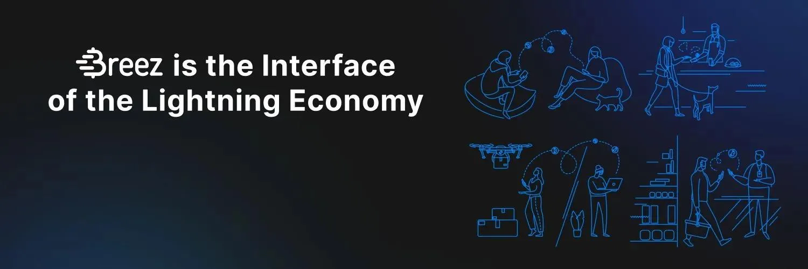

_Tämä teksti on peräisin Breezin dokumentaation verkkosivustolta: https://doc.breez.technology/How-to-Get-Started-with-Breez-POS.html_

## Mikä on Breez POS?

**Breez** on täyden palvelun, ei-holhottava Lightning-sovellus. Puretaanpa tämä auki:

- **Lightning** on bitcoin-maksuverkko, joka vähentää transaktioaikoja minuuteista millisekunteihin ja transaktiomaksuja useista dollareista muutamiin sentteihin tai vähemmän. Lightning muuttaa bitcoinin digitaalisesta kullasta digitaaliseksi valuutaksi säilyttäen samalla kaikki edut, jotka tekevät bitcoinista erinomaisen.
- **Ei-holhottava** tarkoittaa, että Breez ei ota haltuunsa käyttäjien rahoja. Monet Lightning-sovellukset ottavat haltuunsa käyttäjiensä rahat. Ne ovat käytännössä bitcoin-pankkeja. Ei-holhottavan sovelluksen, kuten Breezin, kanssa kaikki käyttäjät ovat omia pankkejaan.
- **Täyden palvelun** tarkoittaa, että Breez hoitaa lähes kaikki tekniset toiminnot automaattisesti ja taustalla. Asiat kuten kanavien luonti, sisääntuleva likviditeetti ja reititys pysyvät piilossa. (Mutta Breez on myös avoimen lähdekoodin, joten ne, jotka ovat kiinnostuneita teknologian tarkastelusta, ovat tervetulleita tekemään niin!)

**Breez POS** on lyhenne myyntipistetilastamme. Toisin sanoen, Breez toimii digitaalisena kassakoneena yrityksille ja kauppiaille, jotka haluavat hyväksyä Lightning-maksuja (lisäksi sen "standardi" tila, joka on kuin bitcoinin digitaalinen versio nahkalompakosta, ja seuraavan sukupolven podcast-soitin). Katsotaanpa nyt, miten Breez asetetaan Lightning-kassakoneeksi yrityksellesi.

## Kuinka aloittaa Breezin käyttö?

1. Ensimmäinen askel on sovelluksen lataaminen. Se on saatavilla Androidille ja iOS:lle (asenna TestFlight ja klikkaa linkkiä laitteeltasi).
2. Breez voi varmuuskopioida itsensä automaattisesti Google Driveen, iCloudiin tai mihin tahansa WebDav-palvelimeen.
   > Huomaa, että jokainen laite käyttää omaa Lightning-solmuaan. Voit käyttää POS-tilaa niin monella laitteella kuin haluat, mutta saldot pysyvät erillisinä.
3. Sovelluksen ollessa auki, klikkaa vasemmassa yläkulmassa olevaa kuvaketta löytääksesi Myyntipiste-tilan.

## POS:n asettaminen

1. Klikkaa tuota kuvaketta vasemmassa yläkulmassa ja klikkaa Myyntipiste > POS Asetukset.

### Managerin Salasana

POS Asetuksissa sinulla on mahdollisuus luoda managerin salasana. Managerin salasana tekee mahdottomaksi lähettää lähteviä maksuja Breez-sovelluksesta ilman valtuutusta. Myyntihenkilöstö voi vain vastaanottaa maksuja laitteella. Huomaa, että jos käytät tätä vaihtoehtoa, saatat myös haluta estää pääsyn Breezin varmuuskopioon, joten ulkoisen WebDav-tilin käyttö (esim. Nextcloud) on suositeltavaa tässä tapauksessa.

### Tuotelista

Tuotelista on myytävien tuotteiden ja niiden hintojen luettelo. On kaksi tapaa lisätä tuotteita listaan:

- Syöttääksesi tuotteita yksi kerrallaan, klikkaa Items lähellä pää-POS-näkymän yläosaa, sitten "+" merkkiä alhaalla oikealla. Täällä voit syöttää yhden tyyppisen tuotteen nimen, hinnan (näytetään valitsemasi valuutan vasta-arvona) ja SKU:n (valinnainen ainutlaatuinen sisäinen tunniste tuotetyypille).
- Useiden tuotteiden samanaikaiseen syöttämiseen, klikkaa laskinikonia ylävasemmalla, sitten Valitse Kassapiste > Asetukset > POS-asetukset, ja klikkaa sen jälkeen kolmea pistettä Tuotelistan oikealla puolella, ja sitten Tuo CSV:stä. Tämä mahdollistaa CSV-tiedoston tuonnin, jonka olet valmistellut etukäteen sisältäen tuotteidesi nimet, hinnat ja SKU:t.
### Fiat-näyttö

Breez lähettää ja vastaanottaa vain bitcoinia, ja useimmissa Lightning-verkon transaktioissa, jotka yleensä ovat pienempiä summia, summa näytetään yleensä Satosheina, eli satseina (1 BTC = 100,000,000 sats). Kuitenkin monet kauppiaat pitävät käytännöllisenä nähdä (ja kertoa asiakkaille) ostoksen arvon paikallisessa fiat-valuutassa.

Pääkassanäkymässä näkyvä valuutta on nähtävissä oikealla puolella (oletus on SAT). Siellä on myös pudotusvalikko, josta voi valita muita valuuttoja näytettäväksi. Valuuttojen lisäämiseksi tai poistamiseksi tästä pudotusvalikosta, klikkaa Kassapiste > Asetukset > Fiat-valuutat. Merkitse sen jälkeen rastilla ne valuutat, jotka haluat pudotusvalikkoosi ja poista rasti niistä, jotka haluat jättää pois.

Näytetyt arvot ovat peräisin yadiosta, arvostetusta valuuttakurssidatan lähteestä, ja ne päivittyvät lähes reaaliajassa. Mutta muista: riippumatta siitä, mikä valuutta-arvo on näytössä, maksu itsessään on bitcoinissa.

### Tilauksen veloitus

Tilauksen kokoamiseksi, lisää tuotteita tuotelistasta tai syötä summa näppäimistöllä. Klikkaa sen jälkeen Veloita pääkassanäkymän yläosassa. Näet sitten QR-koodin, jonka asiakas voi skannata Lightning-sovelluksellaan, jonka voit jakaa suoraan toisesta sovelluksesta laitteellasi, tai jonka voit kopioida ja liittää tarvittaessa.

Skannatessaan koodin tai klikatessaan jaetussa/liitetyssä laskussa, asiakas näkee laskun Lightning-sovelluksessaan ja voi maksaa sen ja suorittaa transaktion välittömästi.

Kun näet Maksu hyväksytty! -animaation Breez-sovelluksessa kauppiaan laitteella, voit klikata tulostinkuvaketta luodaksesi kuitin asiakkaalle. Kuittitulostimen käyttämiseen Androidissa, kokeile tätä ajuria. Huomaa, että voit myös tulostaa aiemmat transaktiot Transaktiot-näytöltä.

### Myyntiraportti

Nähdäksesi päivittäisen/viikoittaisen/kuukausittaisen raportin myynneistäsi (kirjanpitoa tai muita tarkoituksia varten), klikkaa kuvaketta ylävasemmalla, ja sitten klikkaa Transaktiot. Klikkaa Raportti-kuvaketta näyttääksesi raportin ja Kalenteri-kuvaketta vaihtaaksesi valitun aikavälin.

### Transaktioiden vienti

Nähdäksesi listan Breezissa vastaanotetuista maksuista, klikkaa kuvaketta ylävasemmalla, ja sitten klikkaa Transaktiot. Klikkaa kolmea pistettä yläoikealla, sitten Vie viedäksesi listan saapuneista maksuista CSV-muodossa. Rajataksesi listan tiettyyn ajanjaksoon, klikkaa kalenterikuvaketta asettaaksesi päivämäärävälin.

### Kuittien tulostus

Myyntikuitin tulostamiseksi, klikkaa tulostinkuvaketta maksuvahvistusdialogin yläoikealla. Vaihtoehtoisesti, klikkaa kuvaketta ylävasemmalla, ja sitten klikkaa Transaktiot. Etsi tulostettava myynti, avaa se, ja klikkaa yläoikean tulostinkuvaketta.

> Huom: käytä tätä ajuria tulostaaksesi kannettavalle 58mm/80mm Bluetooth/USB-lämpötulostimelle.

## Haluan oppia lisää

- Lisätietoja Lightningista ja Breezista, tutustu meidän [blogiimme](https://breez.technology/blog).
- Jos haluat lisää teknisiä vinkkejä sovelluksen tehokkaaseen käyttöön ja yleisten toimintojen suorittamiseen, tutustu [dokumentaatioomme](https://breez.technology/documentation).
- Jos jumitut etkä löydä vastausta mistään tukikirjallisuudestamme, voit löytää meidät [Telegramista](https://t.me/breez_labs) tai lähettää meille [sähköpostia](mailto:support@breez.technology).
- Jos haluat nähdä joitakin demonstraatiovideoita Breez POS -tilan käytöstä, jonka fanimme ja käyttäjämme ovat tehneet, [tässä](https://www.youtube.com/watch?v=xxxx) on mahtava lyhyt video, ja [tässä](https://www.youtube.com/watch?v=xxxx) on pidempi, yksityiskohtaisempi video.