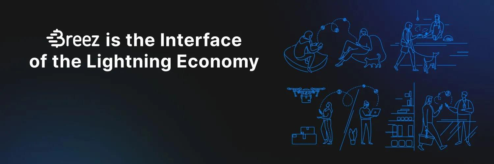

_このテキストはBreezのドキュメントウェブサイトからのものです：https://doc.breez.technology/How-to-Get-Started-with-Breez-POS.html_

## Breez POSとは何ですか？

**Breez**は、フルサービスの非預託型ライトニングアプリです。これを詳しく見てみましょう：

- **ライトニング**は、ビットコインの支払いネットワークで、取引時間を数分から数ミリ秒に、取引手数料を数ドルから数セント以下に削減します。ライトニングは、ビットコインをデジタルゴールドからデジタル通貨に変えつつ、ビットコインを素晴らしいものにしているすべての利点を保持します。
- **非預託型**とは、Breezがユーザーのお金を保有しないことを意味します。多くのライトニングアプリは、ユーザーのお金を保有します。基本的にはビットコイン銀行です。非預託型アプリのBreezのように、すべてのユーザーが自分自身の銀行になります。
- **フルサービス**とは、Breezがほぼすべての技術的操作を自動的に、そしてバックグラウンドで処理することを意味します。チャネル作成、インバウンドリクイディティ、ルーティングなどは裏側で行われます。（しかし、Breezはオープンソースでもあるので、技術を監査したい人は歓迎されます！）

**Breez POS**は、私たちのポイントオブセールモードの略です。言い換えれば、Breezは、ライトニング支払いを受け入れたいビジネスや商人のためのデジタルレジスターのように機能します（その"標準"モードに加えて、ビットコイン用のデジタルバージョンの革財布、そして次世代のポッドキャストプレイヤーのように）。では、あなたのビジネスのためのライトニングレジスターとしてBreezを設定する方法を見てみましょう。

## Breezを始める方法は？

1. 最初のステップは、アプリをダウンロードすることです。AndroidとiOSで利用可能です（TestFlightをインストールし、デバイスからリンクをクリックしてください）。
2. Breezは、Google Drive、iCloud、または任意のWebDavサーバーに自動的にバックアップできます。
   > 各デバイスが独自のライトニングノードを実行していることに注意してください。POSモードを好きなだけ多くのデバイスで実行できますが、残高は別々に保持されます。
3. アプリを開いて、左上のアイコンをクリックすると、ポイントオブセールモードを見つけることができます。

## POSの設定

1. 左上のそのアイコンをクリックし、Point of Sale > POS Settingsをクリックします。

### マネージャーパスワード

POS設定では、マネージャーパスワードを作成するオプションがあります。マネージャーパスワードは、承認なしにBreezアプリからの送金を不可能にします。販売スタッフは、デバイスからの支払いの受け取りのみが可能になります。このオプションを使用する場合は、Breezのバックアップへのアクセスも防ぎたいかもしれないので、この用途には外部のWebDavアカウント（例：Nextcloud）の使用が推奨されます。

### 商品リスト

商品リストは、販売される商品とその価格のカタログです。リストに商品を追加する方法は2つあります：

- 一度に1つの商品を入力するには、メインのPOSビューの上部近くにあるItemsをクリックし、その後右下の"+"サインをクリックします。ここで、単一の商品の名前、価格（選択した通貨の等価値で表示）、SKU（その種類の商品のためのユニークな内部識別子；任意）を入力できます。
- 一度に多くのアイテムを入力するには、左上の電卓アイコンをクリックし、次に「Point of Sale > Preferences > POS Settings」へ進み、アイテムリストの右にある三つの点をクリックしてから、「Import from CSV」を選択します。これにより、事前に準備したアイテムの名前、価格、SKUを含むCSVファイルをインポートできます。
### フィアット表示

Breezはビットコインの送受信のみを行い、Lightning上のほとんどの取引は小額であるため、通常はサトシ（1 BTC = 100,000,000サトシ）、通称satsで表示されます。しかし、多くの商人は、購入の価値を現地のフィアット通貨で表示（および顧客に伝える）ことができると便利だと考えています。

メインのPOSビューでは、現在表示されている通貨が右側に表示されます（デフォルトはSAT）。表示可能な他の通貨のドロップダウンリストもあります。このドロップダウンリストから通貨を追加または削除するには、「Point of Sale > Preferences > Fiat Currencies」をクリックします。次に、ドロップダウンメニューに含めたい通貨をチェックし、省略したい通貨のチェックを外します。

表示される値は、為替レートデータの尊敬されるアウトレットであるyadioからのもので、ほぼリアルタイムで更新されます。しかし、現在表示されている通貨の価値が何であれ、支払い自体はビットコインで行われることを覚えておいてください。

### 注文の請求

注文を作成するには、アイテムリストからアイテムを追加するか、キーパッドに金額を直接入力します。次に、メインのPOSビューの上部にある「Charge」をクリックします。すると、顧客がLightningアプリでスキャンできるQRコードが表示され、あなたのデバイスの別のアプリから直接共有するか、必要に応じてコピー＆ペーストできます。

そのコードをスキャンするか、共有/貼り付けた請求書をクリックすると、顧客は自分のLightningアプリで請求書を見て、直ちに支払いを行い取引を決済するオプションが表示されます。

商人のデバイス上のBreezアプリで「Payment approved!」アニメーションが表示されたら、プリンターアイコンをクリックして顧客に領収書を生成できます。Androidで領収書プリンターを使用するには、このドライバーを試してください。過去の取引も「Transactions」画面から印刷できることに注意してください。

### 売上報告

日次/週次/月次の売上報告（会計目的など）を表示するには、左上のアイコンをクリックし、次に「Transactions」をクリックします。「Report」アイコンをクリックして報告書を表示し、「Calendar」アイコンをクリックして選択した日付範囲を変更します。

### 取引のエクスポート

Breezで受け取った支払いのリストを表示するには、左上のアイコンをクリックし、次に「Transactions」をクリックします。右上の三つの点をクリックし、「Export」を選択して、CSV形式で受信した支払いのリストをエクスポートします。特定の期間のリストに制限するには、カレンダーアイコンをクリックして日付範囲を設定します。

### 領収書の印刷

販売領収書を印刷するには、支払い確認ダイアログの右上にあるプリントアイコンをクリックします。または、左上のアイコンをクリックし、「Transactions」をクリックします。印刷する販売を見つけて開き、右上のプリントアイコンをクリックします。

> 注意：ポータブル58mm/80mm Bluetooth/USBサーマルプリンターで印刷するには、このドライバーを使用してください。

## もっと知りたい

- LightningとBreezについての詳細は、私たちの[ブログ](https://breez.technology/blog)をチェックしてください。
- アプリを最大限に活用し、一般的な操作を行うための技術的なヒントについては、私たちの[ドキュメント](https://breez.technology/documentation)をご覧ください。
- もし行き詰まってしまい、どのヘルプ文献を見ても答えが見つからない場合は、[Telegram](https://t.me/breez_labs)で私たちを見つけるか、[メール](mailto:support@breez.technology)でお問い合わせください。
- Breez POSモードの実演ビデオを見たい場合、こちらの[短いビデオ](https://www.youtube.com/watch?v=xxxx)や、もっと長く詳細な[ビデオ](https://www.youtube.com/watch?v=xxxx)が、私たちのファンやユーザーによって作成されました。