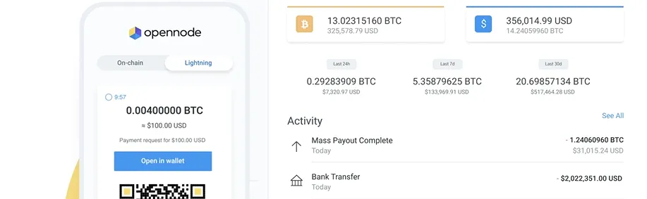

OpenNode (https://www.opennode.com/) là một giải pháp thanh toán Bitcoin dễ dàng. Nhận thanh toán và chi trả bitcoin nhanh chóng, chi phí thấp cho doanh nghiệp của bạn với API mạnh mẽ, plugin thương mại điện tử, hoặc trang thanh toán được lưu trữ của chúng tôi.

## video hướng dẫn:

Tài liệu này khá rõ ràng và chúng tôi vẫn cần phải sản xuất hướng dẫn viết cho những người mới bắt đầu thực sự

https://developers.opennode.com/docs/getting-started