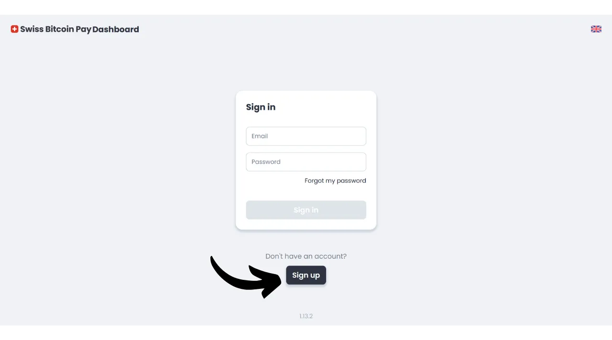
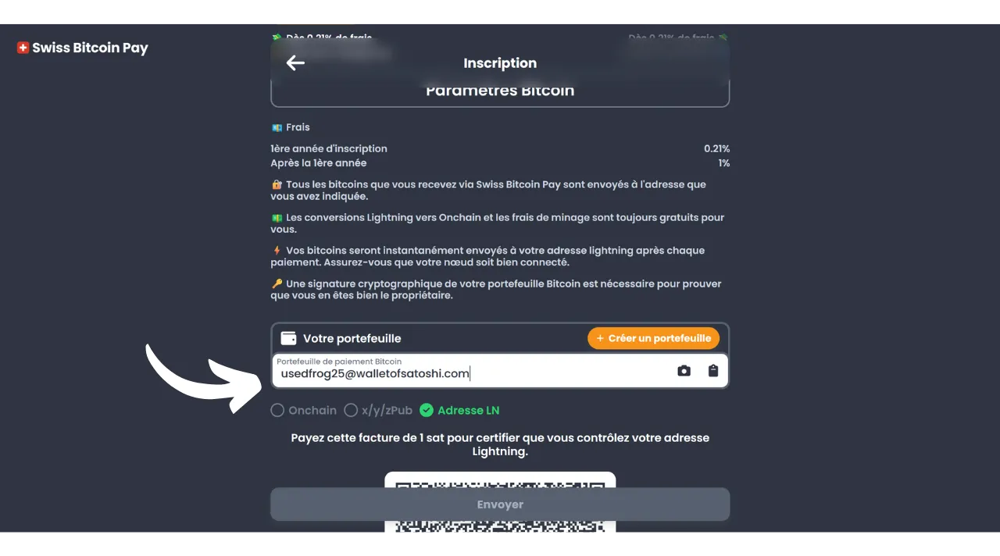
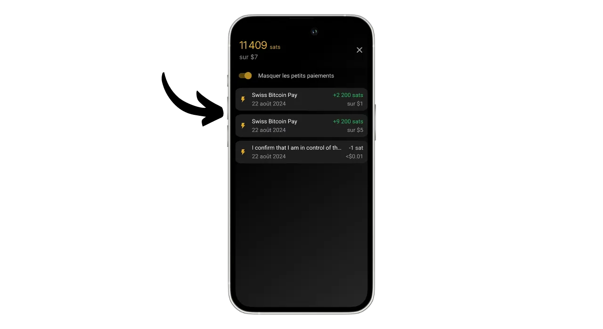
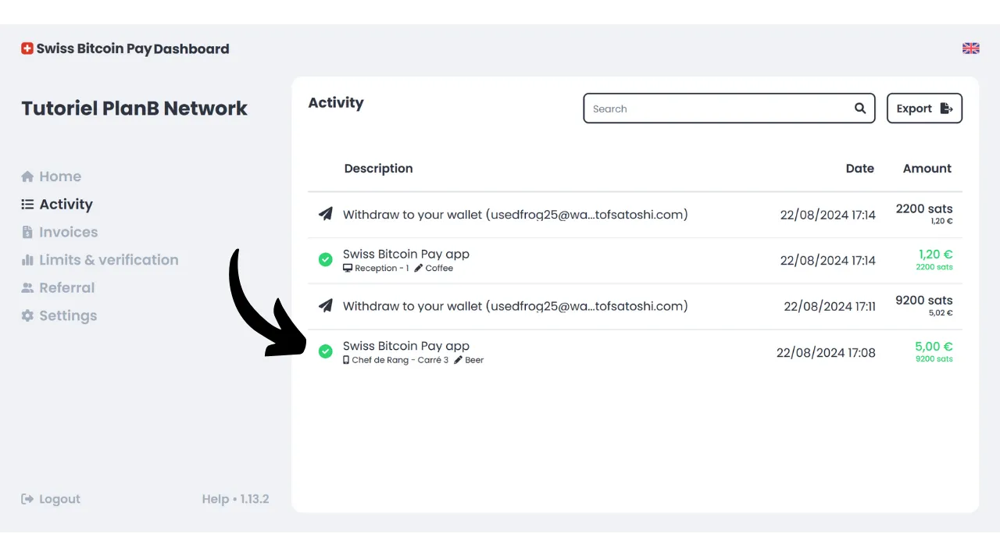

Heutzutage existieren zahlreiche Lösungen für Händler, die Bitcoin als Zahlungsmethode akzeptieren möchten. Für kleinere Einheiten, die eine informelle Einrichtung suchen, reicht die Installation einer Hot Wallet oder sogar einer Lightning Wallet, um Zahlungen direkt darin zu empfangen. Größere Unternehmen, die Buchhaltungsunterlagen führen müssen, sollten eher ein spezialisiertes Zahlungsabwicklungssystem wählen. Auch in diesem Bereich gibt es mehrere Optionen.

Für diejenigen, die sich nicht darum kümmern möchten und Gelder direkt in Fiat-Währung auf ihr Bankkonto erhalten möchten, stehen treuhänderische Lösungen wie Open Node zur Verfügung:

https://planb.network/tutorials/merchant/open-node

Für Händler, die bereit sind, sich die Hände schmutzig zu machen und den Prozess vollständig kontrollieren wollen, ist die BTCPay Server-Software eine ausgezeichnete Option. Der größte Nachteil des BTCPay Servers besteht jedoch darin, dass seine Einrichtung und Verwaltung Zeit beansprucht und einige technische Kenntnisse erfordert:

https://planb.network/tutorials/merchant/btcpay-server

Unter all diesen Lösungen scheint Swiss Bitcoin Pay ein sehr interessanter Kompromiss zu sein, der Benutzerfreundlichkeit, Funktionen und Sicherheit kombiniert. Diese Lösung eignet sich sowohl für sehr kleine Unternehmen als auch für größere Strukturen. In diesem Tutorial werden Sie entdecken, wie Sie Swiss Bitcoin Pay einfach nutzen können, um Bitcoin in Ihrem Geschäft zu akzeptieren.

## Warum Bitcoin in Ihrem Geschäft akzeptieren?

Die Akzeptanz von Bitcoin als Zahlungsmethode bietet zahlreiche Vorteile für Ihr Geschäft. Erstens funktioniert Bitcoin in gewisser Weise wie Bargeld, jedoch ohne die Nachteile physischen Geldes. Wie Bargeld müssen die als Zahlung erhaltenen Bitcoins nicht durch den traditionellen Bankkreislauf gehen. Es handelt sich um eine direkte Peer-to-Peer-Transaktion von Ihrem Kunden zu Ihnen, es sei denn, Sie verwenden einen Zahlungsvermittler.

Darüber hinaus bietet eine Bitcoin-Zahlung sofortige Endgültigkeit mit Lightning und dauert nur wenige Minuten im Falle einer Onchain-Zahlung. Einmal bestätigt, ist es nicht möglich, eine Bitcoin-Zahlung zu stornieren. Wenn Sie sich für die Selbstverwahrung entscheiden, kontrollieren Sie Ihre Bitcoins direkt, was die finanzielle Autonomie Ihres Geschäfts weiter erhöht.

Mit Bitcoin werden Sie auch erhebliche Einsparungen bei Provisionen und Bankgebühren realisieren. Die Verwendung von Bitcoin eliminiert die Notwendigkeit, ein Zahlungsterminal zu kaufen oder zu mieten; ein Computer oder ein einfaches Smartphone reicht aus. Darüber hinaus vermeiden Sie durch die Annahme direkter Bitcoin-Zahlungen die üblicherweise auf Transaktionen erhobenen Provisionen. Selbst wenn Sie einen Vermittler für die Zahlungsabwicklung nutzen, sind die mit Bitcoin-Transaktionen verbundenen Gebühren im Allgemeinen viel niedriger als die traditioneller Banken.
Bitcoin teilt viele Vorteile mit Bargeld, bietet aber noch mehr Vorteile als Vermögenswert. Zum Beispiel ist die Gesamtzahl der BTC durch Konsens auf 21 Millionen Einheiten festgelegt, was es zu einem seltenen Vermögenswert und resistent gegen monetäre Inflation macht, im Gegensatz zu Staatswährungen. Durch die Akzeptanz von Bitcoin in Ihrem Geschäft haben Sie die Möglichkeit, den Wert Ihrer Schatzkammer langfristig zu bewahren und die Vermögenswerte Ihres Unternehmens zu diversifizieren.

Im täglichen Betrieb bieten Bitcoin-Zahlungen mehr Bequemlichkeit und Flexibilität als Bargeld. Ein bedeutender Vorteil ist, dass Sie für eine Bitcoin-Zahlung kein Wechselgeld geben müssen, was die Notwendigkeit, eine physische Kasse zu verwalten, eliminiert. Darüber hinaus reduzieren Sie durch die Annahme von Bitcoins Ihre Exposition gegenüber den Risiken von Diebstählen, Einbrüchen und Raubüberfällen. Außerdem ist es eine Währung, die nicht gefälscht werden kann, im Gegensatz zu Banknoten.

Wenn Sie eine internationale Kundschaft haben, hat Bitcoin den Vorteil, eine globale Währung zu sein, wodurch die Notwendigkeit für Ihre Kunden, Währungen zu tauschen, entfällt.

Für Online-Geschäfte ist Bitcoin auch eine effektive Methode, um Fernzahlungen sicher zu akzeptieren, ohne traditionelle Bankensysteme durchlaufen zu müssen. Diese Nutzung war tatsächlich eine der ursprünglichen Absichten von Satoshi Nakamoto, dem Erfinder von Bitcoin, der es als "*Ein Peer-to-Peer-Elektronisches Bargeldsystem*" beschrieb.
Schließlich kann die Integration von Bitcoin in Ihr Geschäft auch Teil einer Marketingstrategie sein. Die Akzeptanz von BTC kann Ihr Unternehmen als innovativ, flexibel und an technologische Entwicklungen angepasst positionieren, während Sie sich einem neuen Markt öffnen. Laut [einer Studie von KPMG](https://kpmg.com/fr/fr/home/media/press-releases/2024/03/web3-crypto-actifs-adan.html) besitzen 12% der Franzosen Kryptowährungen, und eine große Mehrheit von ihnen hält Bitcoin. Indem Sie dieses Zahlungsmittel akzeptieren, können Sie diese Klientel anziehen, die ihre Sats ausgeben möchte und die sonst vielleicht nie Ihr Geschäft frequentiert hätte. Es ist auch eine gute Möglichkeit, sich bei der Generation Z bekannt zu machen.
Meiner Meinung nach sollte die Akzeptanz von Bitcoin als eine risikoarme Gelegenheit angesehen werden, die einen signifikanten positiven Einfluss auf Ihr Geschäft haben kann. Sollte die Erfahrung nicht erfolgreich sein, bleiben die entstandenen Kosten minimal. Die Hauptkosten liegen in der Zeit, die benötigt wird, um eine Lösung zur Akzeptanz von BTC einzurichten, aber wie Sie in diesem Tutorial entdecken werden, ist es jetzt sehr einfach und schnell zu erreichen.

## Vorstellung von Swiss Bitcoin Pay
Swiss Bitcoin Pay ist eine Lösung, die es Händlern ermöglicht, Bitcoin-Zahlungen auf unkomplizierte Weise zu akzeptieren. Sie integriert eine PoS (*Point of Sale*)-Anwendung mit einer intuitiven Benutzeroberfläche, die leicht von Ihren Mitarbeitern ohne tiefgreifendes technisches Wissen genutzt werden kann. Im Gegensatz zu einer traditionellen Bitcoin-Wallet ist die Swiss Bitcoin Pay-Anwendung ausschließlich für den Empfang von Bitcoin-Zahlungen vorgesehen, was es Ihnen ermöglicht, das Gerät Mitarbeitern ohne Risiken anzuvertrauen. Sie haben die Möglichkeit, mehrere PoS-Anwendungen mit demselben Swiss Bitcoin Pay-Konto zu verwenden, was deren Einsatz erleichtert, egal ob auf einem Tablet, an der Kasse oder auf den Smartphones Ihrer Mitarbeiter. Die Swiss Bitcoin Pay-Anwendung kann auf Android- und iOS-Geräten installiert werden und ist auch in einer Webversion für Computer verfügbar.

Swiss Bitcoin Pay bietet zwei Optionen für die Verwaltung von Zahlungen: Die Gelder können entweder direkt in Bitcoin an eine spezifische Adresse abgehoben oder in Fiatwährung umgewandelt und auf ein Bankkonto eingezahlt werden. Diese Operation wird automatisiert und erfolgt täglich alle 24 Stunden. Somit müssen Sie Bitcoin-Zahlungen oder solche über das Lightning Network nicht manuell verwalten; Swiss Bitcoin Pay kümmert sich um alles für Sie. Jeden Tag erhalten Sie den Saldo der Zahlungen in Ihrer persönlichen Wallet oder auf Ihrem Bankkonto, je nach Ihrer Präferenz. Obwohl es keine 100% nicht-verwahrende Lösung wie die von BTCPay Server angebotene ist, stellt Swiss Bitcoin Pay einen interessanten Kompromiss zwischen Bequemlichkeit und Sicherheit dar, da der Zwischenhändler Ihre Einnahmen nur 24 Stunden lang hält, bevor die Gelder an Sie überwiesen werden. Im Gegensatz zu anderen verwahrenden Lösungen erfordert Swiss Bitcoin Pay keine Identitätsüberprüfung (KYC) für Ihr Geschäft.

Die mit der Nutzung von Swiss Bitcoin Pay verbundenen Gebühren sind sehr wettbewerbsfähig: Im ersten Jahr wird eine Provision von 0,21% auf Transaktionen angewendet. Anschließend betragen die Gebühren 1% für in Bitcoin gehaltene Zahlungen und 1,5% für solche, die in Fiatwährung umgewandelt werden. Es ist jedoch zu beachten, dass sie im Gegenzug 100% der Bitcoin-Transaktionsgebühren für alle Ihre Abhebungen übernehmen.

Swiss Bitcoin Pay präsentiert sich somit als eine interessante Alternative zwischen vollständig verwahrenden Lösungen und komplexeren selbst gehosteten Systemen wie dem BTCPay Server. Es ist ein guter Kompromiss zwischen Einfachheit, Sicherheit und finanzieller Autonomie für den Händler.

## Wie erstellt man ein Swiss Bitcoin Pay-Konto?

Besuchen Sie [die offizielle Swiss Bitcoin Pay-Website](https://swiss-bitcoin-pay.ch/).

Klicken Sie auf den Button "*Dashboard*".

Klicken Sie auf den Button "*Registrieren*". 
Wählen Sie einen Namen für Ihr Konto. Dies kann der Handelsname Ihres Unternehmens sein (dies ist der Name, der im Transaktionsverlauf Ihrer Kunden in deren Portfolio erscheinen wird).

Geben Sie eine E-Mail-Adresse an.

Wählen Sie ein starkes Passwort, um Ihr Konto zu sichern.

Legen Sie Ihre lokale Währung fest.

Wählen Sie dann, wie Sie Ihre Gelder erhalten möchten, indem Sie den Schieberegler anpassen: entweder 100% in Bitcoins, 100% in lokaler Währung oder jede beliebige Verteilung Ihrer Wahl zwischen den beiden.

Wenn Sie sich entscheiden, Ihre Gelder über das Bankensystem in lokaler Währung zu erhalten, müssen Sie Ihre Bankkontodetails angeben. Wenn Sie es vorziehen, Ihre Gelder in Bitcoins zu erhalten, stehen Ihnen mehrere Empfangsoptionen zur Verfügung.

Die Option "*onchain*" ermöglicht es Ihnen, alle Ihre Zahlungen an eine einzige Bitcoin-Adresse zu erhalten. Ich rate jedoch von dieser Option ab, da sie zur Wiederverwendung derselben Adresse führt, was Ihre Privatsphäre stark beeinträchtigen kann.

Wenn Sie sich entscheiden, Ihre Zahlungen in Bitcoins onchain zu erhalten, ist es vorzuziehen, einen erweiterten öffentlichen Schlüssel mit der Option "*x/y/zpub*" zu verwenden. Auf diese Weise kann Swiss Bitcoin Pay für jede Abhebung eine neue, unbenutzte Adresse ableiten.

Wenn Sie ein relativ geringes Volumen an Bitcoin-Zahlungen erwarten, können Sie auch wählen, Zahlungen direkt über das Lightning-Netzwerk zu erhalten. Dazu müssen Sie eine Lightning-Adresse angeben. Ihre Gelder werden unmittelbar nach jeder Zahlung übertragen, im Gegensatz zu den Onchain-Optionen, die alle Eingänge in eine einzige tägliche Zahlung zusammenfassen.

Natürlich betrifft diese Wahl nur die Zahlungsmethode von Swiss Bitcoin Pay an Ihr Unternehmen. Ihre Kunden können Sie trotz der hier gewählten Option weiterhin über das Lightning-Netzwerk oder onchain bezahlen.

Für dieses Tutorial werde ich wählen, meine Zahlungen über Lightning zu erhalten. Zu Lehrzwecken und um die Vertraulichkeit meines echten Lightning-Knotens zu wahren, werde ich für Abhebungen ein gefälschtes Wallet of Satoshi verwenden. Ich rate jedoch dringend davon ab, ein treuhänderisches Bitcoin-Wallet zu verwenden, egal ob für Abhebungen über LN oder onchain.

Anschließend müssen Sie 1 Sat bezahlen, um Ihre Lightning-Adresse zu verifizieren. Im Falle einer Bitcoin-Adresse müssen Sie eine Signatur mit dem privaten Schlüssel bereitstellen, der zu dieser Adresse gehört.

Zuletzt haben Sie die Möglichkeit, einen Empfehlungscode hinzuzufügen. Wenn Sie uns unterstützen möchten, können Sie den Code "*DiscoverBitcoin*" verwenden, sodass ein Teil Ihrer Provisionen mit uns geteilt wird. Vielen Dank! :) 
Sobald alle Informationen eingegeben sind, klicken Sie auf den Button "*Senden*".

Und voilà! Ihr Swiss Bitcoin Pay-Konto ist jetzt einsatzbereit. Sie können nun anfangen, Bitcoin-Zahlungen für Ihr Unternehmen zu erhalten!

Wenn Sie möchten, können Sie Ihr Unternehmen bewerben, indem Sie auf den Link klicken, den Sie per E-Mail erhalten haben.

## Wie installiert man Swiss Bitcoin Pay PoS?
Sie können bereits auf die Zahlungsprozessor-Webversion auf der folgenden Seite zugreifen: https://app.swiss-bitcoin-pay.ch/

Wenn Sie das PoS auf einem Smartphone oder Tablet nutzen möchten, haben Sie zwei Möglichkeiten: Installieren Sie die App oder nutzen Sie direkt über Ihren Browser die Webversion. Für die letztere Option, greifen Sie auf Ihr Dashboard zu, indem Sie sich auf [der Swiss Bitcoin Pay Seite](https://dashboard.swiss-bitcoin-pay.ch/signin) einloggen.

Scannen Sie dann einfach den QR-Code, der auf Ihrer Schnittstelle angezeigt wird, mit dem Gerät Ihrer Wahl.

Wenn Sie es bevorzugen, das PoS in Form einer Anwendung zu haben, gehen Sie zu Ihrem App Store [Google Play Store](https://play.google.com/store/apps/details?id=ch.swissbitcoinpay.checkout) oder [App Store](https://apps.apple.com/us/app/swiss-bitcoin-pay/id6444370155) und installieren Sie Swiss Bitcoin Pay. Die Anwendung ist auch direkt im `.apk`-Format auf ihrer Website oder im [F-Droid Store](https://f-droid.org/packages/ch.swissbitcoinpay.checkout/) verfügbar.

Beim ersten Öffnen klicken Sie auf den Button "*Scan the activation QR code*".

Scannen Sie den QR-Code, der auf Ihrem Dashboard angezeigt wird.

Sie sind nun als Mitarbeiter mit dem PoS-System verbunden, was bedeutet, dass diese Maschine nur berechtigt ist, Zahlungen zu verarbeiten, ohne die Einstellungen Ihres Geschäftskontos ändern zu können.

Wenn Sie möchten, können Sie den Namen des PoS, der während der Kassenvorgänge angezeigt wird, in Ihrem Admin-Konto ändern. Sie können das Terminal nach seinem spezifischen Standort benennen (zum Beispiel "*Bar Mezzanine*", "*Service Drive*", "*Oberkellner Platz Nr. 3*", "*Zimmerassistent Nr. 2*", "*Kasse Nr. 7*", "*Terrasse*", "*Expresskasse*", "*Empfang*", "*Concierge*", "*Spa/Wellness*...") oder nach dem Namen des Mitarbeiters, der es benutzt. Dazu klicken Sie auf den aktuellen Namen des PoS, der unter dem Firmennamen oben auf dem Bildschirm angezeigt wird. 
Notieren Sie den neuen Namen dieses Zahlungsprozessors und klicken Sie dann auf den "*Senden*" Button.

## Wie kassiert man mit Swiss Bitcoin Pay?

Um zu kassieren, ist es ganz einfach, einmal an einem PoS, geben Sie den zu kassierenden Betrag ein.

Im Feld "*Notiz*" können Sie Informationen notieren, die der Zahlung beigefügt werden, insbesondere in Ihren Berichten. Zum Beispiel können Sie das verkaufte Gut oder die Dienstleistung notieren.

Dann klicken Sie auf den "*OK*" Button.

Warten Sie einige Sekunden, bis Swiss Bitcoin Pay die Lightning-Rechnung und die Empfangsadresse erstellt hat.

Das PoS-System zeigt dann einen einheitlichen QR-Code an, der es Ihren Kunden ermöglicht, ihre Zahlung entweder über das Lightning-Netzwerk oder onchain zu tätigen (es ist derselbe QR-Code für beide Methoden). Wenn Ihr Gerät dies zulässt, kann die Zahlung auch über eine Lightning-Karte mittels NFC-Technologie erfolgen.

Sobald die Rechnung bezahlt ist, bestätigt das PoS den Erfolg der Zahlung.

Sie können auch die Zahlung und die gesamte Transaktionshistorie dieses spezifischen PoS finden, indem Sie auf das Symbol oben links auf dem Bildschirm klicken.

Sie können die Zahlung finden, die Sie gerade kassiert haben.

Da ich die Option gewählt hatte, Zahlungen über eine Lightning-Adresse abzuheben, kann ich sehen, dass die Zahlungen am PoS meines Geschäfts bereits in meinem LN-Wallet angekommen sind.

## Wie man sein Geschäft mit Swiss Bitcoin Pay verwaltet?

Um Ihr Geschäft präziser zu verwalten, geschieht alles auf Ihrem Dashboard. Besuchen Sie [die offizielle Swiss Bitcoin Pay Webseite](https://swiss-bitcoin-pay.ch/).

Klicken Sie oben rechts auf dem Bildschirm auf den Button "*Dashboard*", dann geben Sie Ihre E-Mail-Adresse und Ihr Passwort ein.  Sie gelangen dann zu dieser Oberfläche.  Im Tab "*Home*" können Sie den Saldo der ausstehenden Zahlungen sowie die neuesten Aktivitäten Ihres Kontos einsehen.  Im Tab "*Activity*" können Sie die Details aller Ihrer Transaktionen einsehen.  Zum Beispiel kann ich auf meinem Dashboard sehen, dass der PoS "*Chef de Rang - Carré 3*" am 22.08.2024 um 17:08 ein Bier für 5 € kassiert hat.  Ich kann auch sehen, dass die Rezeption einen Kaffee kassiert hat.  Schließlich kann ich alle Abhebungstransaktionen zu meinem persönlichen Lightning-Wallet sehen.  Um den Export von Berichten einzurichten, klicken Sie auf den Button "*Export*".  Im Tab "*Manual*" können Sie einen einmaligen Export Ihrer Transaktionen durchführen. Wählen Sie einfach einen Zeitraum und dann die Informationen, die Sie in Ihrem Bericht enthalten möchten.  Klicken Sie dann auf den Button "*Export*", um eine `.csv`-Datei Ihrer Transaktionen herunterzuladen.  Im Tab "*Recurring*" können Sie automatische wiederkehrende Exports planen. Wählen Sie die Häufigkeit der Exporterstellung und wählen Sie die Informationen, die Sie im Bericht enthalten möchten.  Geben Sie schließlich die E-Mail-Adresse ein, an die der Bericht gesendet werden soll. Zum Beispiel können Sie direkt die E-Mail-Adresse Ihres Buchhalters eingeben. Klicken Sie auf den Button "*Save*", um diesen geplanten Export zu speichern.  Der Reiter "Invoice" ermöglicht es Ihnen, eine Rechnung für eine einmalige Zahlung zu erstellen.  Im Tab "*Limits & verification*" können Sie Ihre täglichen und jährlichen Sammellimits einsehen. Sie haben auch die Möglichkeit, eine Identitätsverifizierung durchzuführen, um höhere Limits freizuschalten.  Der Tab "*Referral*" ermöglicht es Ihnen, alles im Zusammenhang mit Sponsoring zu verwalten.  Schließlich haben Sie im Tab "*Settings*" die Möglichkeit, die Informationen, die Sie bei der Registrierung angegeben haben, einschließlich der Abhebungsmethoden und der Verteilung zwischen Bitcoin und Fiat, zu ändern. 
Herzlichen Glückwunsch! Sie haben nun ein Zahlungsabwicklungssystem eingerichtet, um Bitcoin in Ihrem Geschäft zu akzeptieren. Wenn Sie auch BTCPay Server, eine fortgeschrittenere und komplexere Lösung, erkunden möchten, empfehle ich Ihnen, unserem vollständigen Training speziell zu dieser Software zu folgen: [BTC305](https://planb.network/courses/btc305).