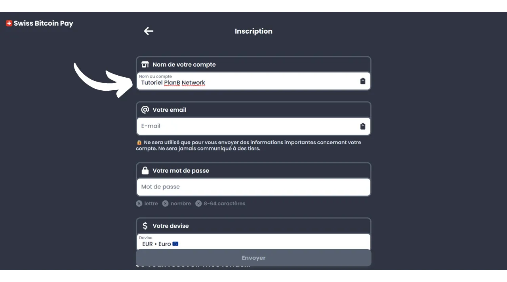
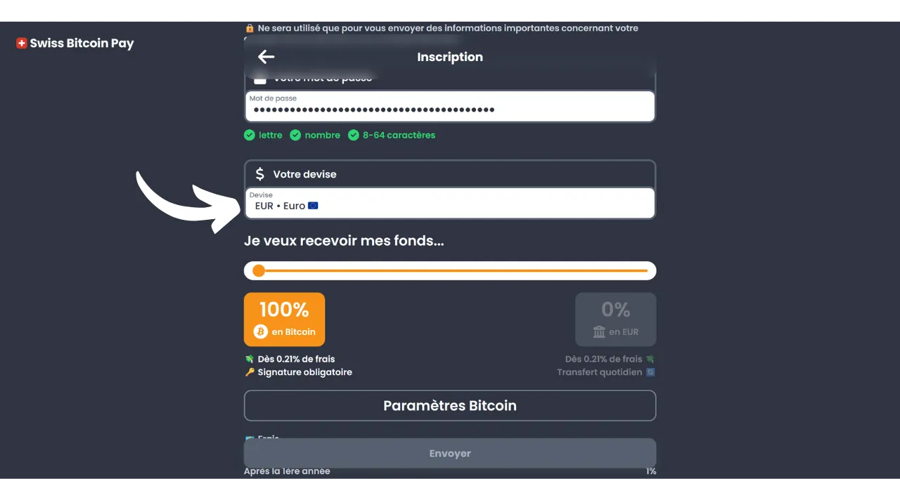
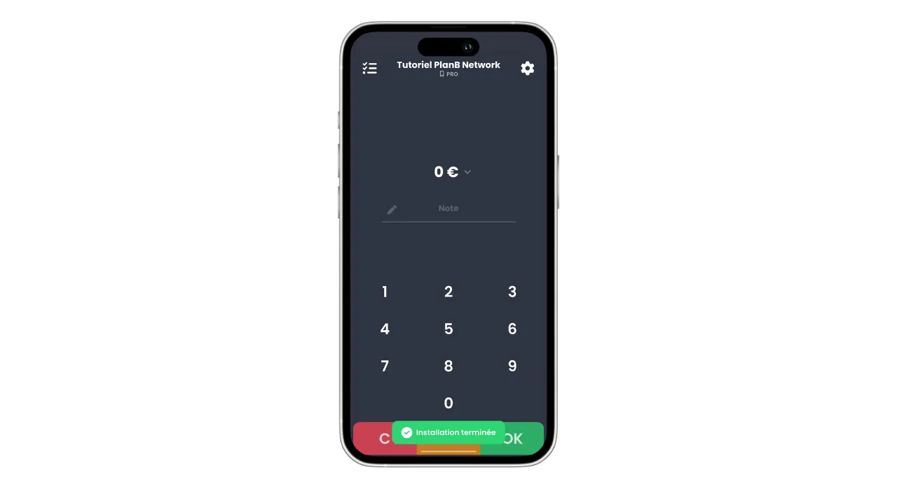
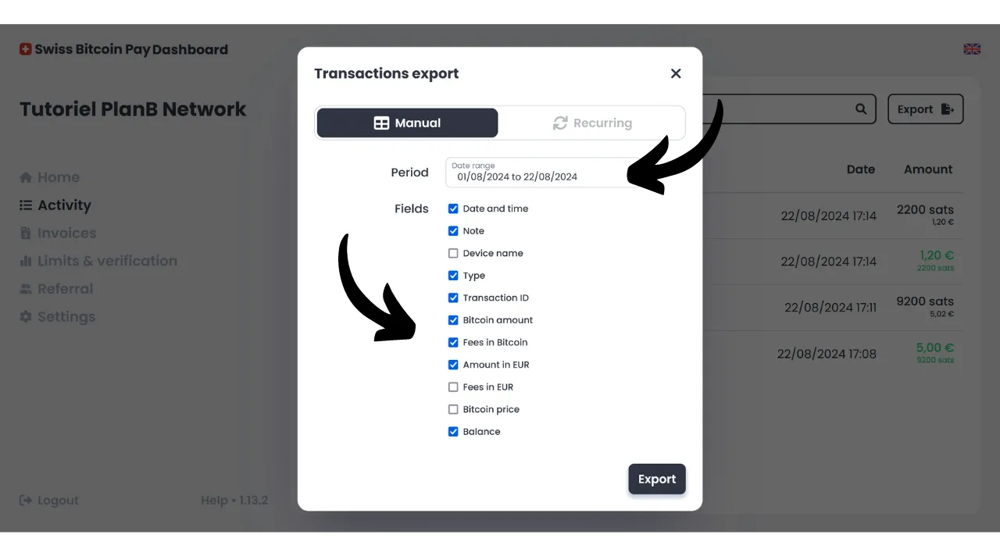

Today, numerous solutions exist for merchants who wish to accept Bitcoin as a payment method. For small entities looking for an informal setup, installing a hot wallet, or even a Lightning wallet, suffices to receive payments directly into it. Larger businesses, needing to maintain accounting records, should rather opt for a specialized payment processing system. Several options are also available in this area.

For those who prefer not to bother and receive funds in fiat currency directly into their bank account, custodial solutions like Open Node are available:

https://planb.network/tutorials/merchant/open-node

For merchants ready to get their hands dirty and who want to fully control the process, BTCPay Server software is an excellent option. However, the major downside of BTCPay Server is that its setup and management take time and require some technical expertise:

https://planb.network/tutorials/merchant/btcpay-server

Among all these solutions, Swiss Bitcoin Pay seems to be a very interesting compromise combining ease of use, features, and security. This solution is suitable for both very small businesses and larger structures. In this tutorial, you will discover how to easily use Swiss Bitcoin Pay to accept Bitcoin in your business.

## Why accept Bitcoin in your business?

Accepting Bitcoin as a payment method offers numerous advantages for your business. Firstly, Bitcoin functions somewhat like cash, but without the disadvantages of physical money. Like cash, the Bitcoins received as payment do not need to go through the traditional banking circuit. It is a direct peer-to-peer transaction from your client to yourself, unless you use a payment intermediary.

Moreover, a Bitcoin payment offers instant finality with Lightning and takes only a few minutes in the case of an onchain payment. Once confirmed, it is not possible to cancel a Bitcoin payment. If you opt for self-custody, you directly control your Bitcoins, which further enhances the financial autonomy of your business.

With Bitcoin, you will also realize significant savings on commissions and banking fees. Using Bitcoin eliminates the need to purchase or rent a payment terminal; a computer or a simple smartphone suffices. Moreover, by accepting direct Bitcoin payments, you avoid the commissions usually charged on transactions. Even if you go through an intermediary for payment processing, the fees associated with Bitcoin transactions are generally much lower than those of traditional banks.
Bitcoin shares many advantages with cash, but it offers even more benefits as an asset. For example, the total number of BTC is fixed by consensus at 21 million units, making it a rare asset and resistant to monetary inflation, unlike state currencies. By accepting bitcoin in your business, you have the opportunity to preserve the value of your treasury in the long term and diversify your company's assets.

On a daily basis, bitcoin payments offer more convenience and flexibility than cash. A significant advantage is that you do not need to give change for a bitcoin payment, which eliminates the need to manage a physical cash register. Moreover, accepting bitcoins reduces your exposure to the risks of thefts, burglaries, and robberies. Also, it is a currency that cannot be counterfeited, unlike banknotes.

If you have an international clientele, bitcoin has the advantage of being a global currency, thereby eliminating the need for your customers to exchange currencies.

For online businesses, Bitcoin is also an effective method for accepting remote payments securely, without having to go through traditional banking systems. This use was indeed one of the original intentions of Satoshi Nakamoto, the inventor of Bitcoin, who described it as "*A peer-to-peer electronic cash system*".

Finally, integrating Bitcoin into your business can also be part of a marketing strategy. Accepting BTC can position your company as innovative, flexible, and adapted to technological evolutions, while opening you up to a new market. According to [a study by KPMG](https://kpmg.com/fr/fr/home/media/press-releases/2024/03/web3-crypto-actifs-adan.html), 12% of French people own cryptocurrencies, and a large majority of them hold bitcoin. By accepting this means of payment, you can attract this clientele who wishes to spend their sats, who otherwise might never have frequented your business. It is also a good way to make yourself known to Generation Z.

In my opinion, accepting bitcoin should be seen as a low-risk opportunity that can have a significant positive impact on your business. If the experience proves unsuccessful, the incurred costs will remain minimal. The main cost lies in the time needed to set up a solution to accept BTC, but as you will discover in this tutorial, it is now very simple and quick to achieve.

## Presentation of Swiss Bitcoin Pay
Swiss Bitcoin Pay is a solution that allows merchants to accept Bitcoin payments in a straightforward manner. It integrates a PoS (*Point of Sale*) application with an intuitive user interface, easy for your employees to use without requiring in-depth technical knowledge. Unlike a traditional Bitcoin wallet, the Swiss Bitcoin Pay application is solely intended for receiving Bitcoin payments, which allows you to entrust the device to employees without risks. You have the option to use multiple PoS applications connected to the same Swiss Bitcoin Pay account, facilitating their deployment whether on a tablet, at the register, or on your employees' smartphones. The Swiss Bitcoin Pay application can be installed on Android and iOS devices, and it is also available in a web version for computers.

Swiss Bitcoin Pay offers two options for managing payments: funds can either be withdrawn directly in Bitcoin to a specific address or converted into fiat currency and deposited into a bank account. This operation is automated and occurs daily every 24 hours. Thus, you do not have to manually manage Bitcoin payments or those via the Lightning Network; Swiss Bitcoin Pay takes care of everything for you. Every day, you will receive the balance of payments in your personal wallet or bank account, according to your preference. Although it is not a 100% non-custodial solution like that offered by BTCPay Server, for example, Swiss Bitcoin Pay represents an interesting compromise between convenience and security, as the intermediary only holds your receipts for 24 hours before transferring the funds to you. Moreover, unlike other custodial solutions, Swiss Bitcoin Pay does not require any identity verification (KYC) for your business.

The fees associated with using Swiss Bitcoin Pay are very competitive: the first year, a commission of 0.21% is applied to transactions. Subsequently, the fees are 1% for payments kept in Bitcoin and 1.5% for those converted into fiat currency. However, it is worth noting that in return, they cover 100% of the Bitcoin transaction fees for all your withdrawals.

Swiss Bitcoin Pay thus presents itself as an interesting alternative between fully custodial solutions and more complex self-hosted systems such as BTCPay Server. It is a good compromise between simplicity, security, and financial autonomy for the merchant.

## How to create a Swiss Bitcoin Pay account?

Visit [the official Swiss Bitcoin Pay website](https://swiss-bitcoin-pay.ch/).

Click on the "*Dashboard*" button.

Click on the "*Sign up*" button.

Choose a name for your account. This can be the trade name of your business (this is the name that will appear on your clients' portfolio in their transaction history).

Provide an email address.

Choose a strong password to secure your account.

Set your local currency.

Then choose how you would like to receive your funds by adjusting the slider: either 100% in bitcoins, 100% in local currency, or any distribution of your choice between the two.

If you choose to receive your funds via the banking system in local currency, you will need to provide your bank account details. If you prefer to receive your funds in bitcoins, several reception options are available to you.

The "*onchain*" option allows you to receive all your payments to a single Bitcoin address. However, I advise against this option, as it leads to the reuse of the same address, which can greatly harm your privacy.

If you choose to receive your payments in bitcoins onchain, it is preferable to use an extended public key with the "*x/y/zpub*" option. This way, Swiss Bitcoin Pay can derive a new, unused address for each withdrawal.

If you anticipate a relatively low volume of bitcoin payments, you can also choose to receive payments directly via the Lightning Network. To do this, you will need to provide a Lightning address. Your funds will be transferred immediately after each payment, unlike the onchain options that group all receipts into a single daily payment.

Obviously, this choice only affects the payment method of Swiss Bitcoin Pay to your business. Your customers can still pay you via the Lightning Network or onchain, regardless of the option you select here.

For this tutorial, I will choose to receive my payments via Lightning. For educational purposes and to preserve the confidentiality of my real Lightning node, I will use a fake Wallet of Satoshi for withdrawals. However, I strongly advise against using a custodial Bitcoin wallet, whether for withdrawals on LN or onchain.

You will then need to pay 1 sat to verify your Lightning address. In the case of a bitcoin address, you will need to provide a signature with the private key corresponding to that address.

Finally, you have the option to add a referral code. If you wish to support us, you can use the code "*DiscoverBitcoin*" so that a portion of your commissions is shared with us. Thank you! :)
Once all the information is filled in, click on the "*Send*" button.

And there you have it! Your Swiss Bitcoin Pay account is now ready. You can now start receiving Bitcoin payments for your business!

If you wish, you can promote your business by clicking on the link received by email.

## How to install Swiss Bitcoin Pay PoS?

You can already access the payment processor in web version on the following site: https://app.swiss-bitcoin-pay.ch/

If you want to use the PoS on a smartphone or tablet, you have two options: install the app or use the web version directly from your browser. For the latter option, access your dashboard by logging in at [the Swiss Bitcoin Pay site](https://dashboard.swiss-bitcoin-pay.ch/signin).

Then simply scan the QR code present on your interface with the device of your choice.

If you prefer to have the PoS in the form of an application, go to your app store [Google Play Store](https://play.google.com/store/apps/details?id=ch.swissbitcoinpay.checkout) or [App Store](https://apps.apple.com/us/app/swiss-bitcoin-pay/id6444370155) and install Swiss Bitcoin Pay. The application is also available directly in `.apk` format on their website, or on [the F-Droid store](https://f-droid.org/packages/ch.swissbitcoinpay.checkout/).

Upon first opening, click on the "*Scan the activation QR code*" button.

Scan the QR code present on your dashboard.

You are now connected to the PoS system as an employee, which means that this machine is only authorized to process payments without having the ability to modify the settings of your business account.

If you wish, you can change the name of the PoS that appears during checkouts in your admin account. You can name the terminal according to its specific location (for example, "*Bar Mezzanine*", "*Service Drive*", "*Head Waiter Square No. 3*", "*Room Assistant No. 2*", "*Cash Register No. 7*", "*Terrace*", "*Express Checkout*", "*Reception*", "*Concierge*", "*Spa/Wellness*...") or by the name of the employee using it. To do this, click on the current name of the PoS located under the company name at the top of the screen. 
Note the new name of this payment processor, then click on the "*Send*" button.

## How to checkout with Swiss Bitcoin Pay?

To checkout, it's very simple, once on a PoS, enter the amount to be cashed.

In the "*Note*" box, you can note information that will be attached to the payment, especially in your reports. For example, you can note the good or service sold.

Then click on the "*OK*" button.

Wait a few seconds for Swiss Bitcoin Pay to create the Lightning invoice and the receiving address.

The PoS system will then display a unified QR code that allows your customers to make their payment either via the Lightning Network or onchain (it's the same QR code for both methods). If your device allows it, the payment can also be made via a Lightning card using NFC technology.

Once the invoice is paid, the PoS confirms the success of the payment.

You can also find the payment and the entire transaction history of this specific PoS by clicking on the icon at the top left of the screen.

You can find the payment you just cashed.

Since I had chosen the option of withdrawing payments via a Lightning address, I can see that the payments at the PoS of my business have already arrived in my LN wallet.

## How to manage your business with Swiss Bitcoin Pay?

To manage your business more precisely, everything happens on your dashboard. Visit [the official Swiss Bitcoin Pay website](https://swiss-bitcoin-pay.ch/).

Click on the top right of the screen on the "*Dashboard*" button, then enter your email address and your password.  You will then arrive at this interface.  In the "*Home*" tab, you can see the balance of payments pending withdrawal as well as the latest activities of your account.  In the "*Activity*" tab, you can consult the details of all your transactions.  For example, on my dashboard, I can see that the PoS "*Chef de Rang - Carré 3*" collected a beer for €5 on 22/08/2024 at 17:08.  I can also see that the reception collected a coffee.  Finally, I can see all the withdrawal transactions to my personal Lightning wallet.  To set up the export of reports, click on the "*Export*" button.  In the "*Manual*" tab, you can do a one-time export of your transactions. Simply choose a period, then select the information you want to include in your report.  Then click on the "*Export*" button to download a `.csv` file of your transactions.  In the "*Recurring*" tab, you can schedule automatic recurring exports. Select the frequency of export generation, and select the information you want to include in the report.  Finally, enter the email address where the report will be sent. For example, you can directly enter the email address of your accountant. Click on the "*Save*" button to save this scheduled export.  The invoice tab allows you to generate an invoice for a one-time payment.  In the "*Limits & verification*" tab, you can consult your daily and annual collection limits. You also have the option to perform an identity verification to unlock higher limits.  The "*Referral*" tab allows you to manage everything related to sponsorship. 
Finally, in the "*Settings*" tab, you have the option to modify the information you provided during registration, including withdrawal methods and the distribution between bitcoin and fiat. 
Congratulations! You have now set up a payment processor system to accept bitcoin in your business. If you also want to explore BTCPay Server, a more advanced and complex solution, I recommend you follow our complete training specifically dedicated to this software: [BTC305](https://planb.network/courses/btc305).