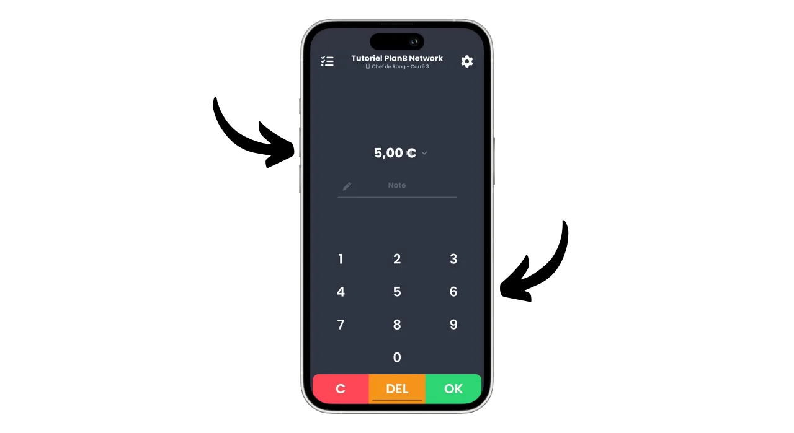
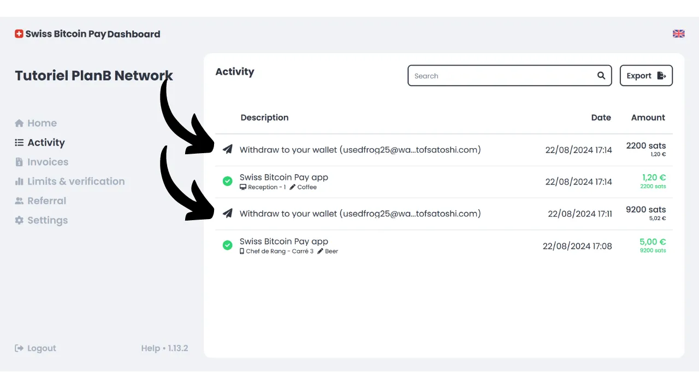

Hoy en día, existen numerosas soluciones para los comerciantes que desean aceptar Bitcoin como método de pago. Para las pequeñas entidades que buscan una configuración informal, instalar una hot wallet o incluso una Lightning wallet, es suficiente para recibir pagos directamente en ella. Las empresas más grandes, que necesitan mantener registros contables, deberían optar por un sistema de procesamiento de pagos especializado. También hay varias opciones disponibles en esta área.

Para aquellos que prefieren no complicarse y recibir fondos en moneda fiat directamente en su cuenta bancaria, existen soluciones de custodia como Open Node:

https://planb.network/tutorials/merchant/open-node

Para los comerciantes dispuestos a involucrarse más y que quieren controlar completamente el proceso, el software BTCPay Server es una excelente opción. Sin embargo, el principal inconveniente de BTCPay Server es que su configuración y gestión requieren tiempo y cierta experiencia técnica:

https://planb.network/tutorials/merchant/btcpay-server

Entre todas estas soluciones, Swiss Bitcoin Pay parece ser un compromiso muy interesante que combina facilidad de uso, características y seguridad. Esta solución es adecuada tanto para negocios muy pequeños como para estructuras más grandes. En este tutorial, descubrirás cómo usar fácilmente Swiss Bitcoin Pay para aceptar Bitcoin en tu negocio.

## ¿Por qué aceptar Bitcoin en tu negocio?

Aceptar Bitcoin como método de pago ofrece numerosas ventajas para tu negocio. En primer lugar, Bitcoin funciona de alguna manera como el efectivo, pero sin las desventajas del dinero físico. Al igual que el efectivo, los Bitcoins recibidos como pago no necesitan pasar por el circuito bancario tradicional. Es una transacción directa de igual a igual de tu cliente a ti mismo, a menos que uses un intermediario de pago.

Además, un pago con Bitcoin ofrece una finalidad instantánea con Lightning y solo toma unos minutos en el caso de un pago onchain. Una vez confirmado, no es posible cancelar un pago con Bitcoin. Si optas por la auto-custodia, controlas directamente tus Bitcoins, lo que aumenta aún más la autonomía financiera de tu negocio.

Con Bitcoin, también te darás cuenta de un ahorro significativo en comisiones y tarifas bancarias. Usar Bitcoin elimina la necesidad de comprar o alquilar un terminal de pago; un ordenador o un simple smartphone son suficientes. Además, al aceptar pagos directos con Bitcoin, evitas las comisiones que usualmente se cobran en las transacciones. Incluso si pasas por un intermediario para el procesamiento de pagos, las tarifas asociadas con las transacciones de Bitcoin generalmente son mucho más bajas que las de los bancos tradicionales.
Bitcoin comparte muchas ventajas con el efectivo, pero ofrece aún más beneficios como activo. Por ejemplo, el número total de BTC está fijado por consenso en 21 millones de unidades, lo que lo convierte en un activo raro y resistente a la inflación monetaria, a diferencia de las monedas estatales. Al aceptar bitcoin en tu negocio, tienes la oportunidad de preservar el valor de tu tesorería a largo plazo y diversificar los activos de tu empresa.

En el día a día, los pagos con bitcoin ofrecen más comodidad y flexibilidad que el efectivo. Una ventaja significativa es que no necesitas dar cambio por un pago con bitcoin, lo que elimina la necesidad de gestionar una caja registradora física. Además, aceptar bitcoins reduce tu exposición a los riesgos de robos, allanamientos y asaltos. También, es una moneda que no puede ser falsificada, a diferencia de los billetes.

Si tienes una clientela internacional, bitcoin tiene la ventaja de ser una moneda global, eliminando así la necesidad de que tus clientes cambien de moneda.

Para los negocios en línea, Bitcoin también es un método efectivo para aceptar pagos remotos de manera segura, sin tener que pasar por los sistemas bancarios tradicionales. Este uso fue de hecho una de las intenciones originales de Satoshi Nakamoto, el inventor de Bitcoin, quien lo describió como "*Un sistema de efectivo electrónico de igual a igual*".
Finalmente, integrar Bitcoin en tu negocio también puede ser parte de una estrategia de marketing. Aceptar BTC puede posicionar a tu empresa como innovadora, flexible y adaptada a las evoluciones tecnológicas, al mismo tiempo que te abre a un nuevo mercado. Según [un estudio de KPMG](https://kpmg.com/fr/fr/home/media/press-releases/2024/03/web3-crypto-actifs-adan.html), el 12% de los franceses poseen criptomonedas, y una gran mayoría de ellos tiene bitcoin. Al aceptar este medio de pago, puedes atraer a esta clientela que desea gastar sus sats, quienes de otro modo quizás nunca hubieran frecuentado tu negocio. También es una buena manera de darte a conocer a la Generación Z.
En mi opinión, aceptar bitcoin debería verse como una oportunidad de bajo riesgo que puede tener un impacto positivo significativo en tu negocio. Si la experiencia resulta infructuosa, los costos incurridos permanecerán mínimos. El principal costo radica en el tiempo necesario para configurar una solución para aceptar BTC, pero como descubrirás en este tutorial, ahora es muy simple y rápido de lograr.

## Presentación de Swiss Bitcoin Pay
Swiss Bitcoin Pay es una solución que permite a los comerciantes aceptar pagos en Bitcoin de manera sencilla. Integra una aplicación PoS (*Punto de Venta*) con una interfaz de usuario intuitiva, fácil de usar para tus empleados sin requerir conocimientos técnicos profundos. A diferencia de una billetera Bitcoin tradicional, la aplicación Swiss Bitcoin Pay está destinada únicamente para recibir pagos en Bitcoin, lo que te permite confiar el dispositivo a los empleados sin riesgos. Tienes la opción de usar múltiples aplicaciones PoS conectadas a la misma cuenta de Swiss Bitcoin Pay, facilitando su implementación ya sea en una tableta, en la caja registradora o en los smartphones de tus empleados. La aplicación Swiss Bitcoin Pay se puede instalar en dispositivos Android e iOS, y también está disponible en una versión web para computadoras.

Swiss Bitcoin Pay ofrece dos opciones para gestionar los pagos: los fondos pueden retirarse directamente en Bitcoin a una dirección específica o convertirse en moneda fiduciaria y depositarse en una cuenta bancaria. Esta operación es automatizada y ocurre diariamente cada 24 horas. Así, no tienes que gestionar manualmente los pagos en Bitcoin o aquellos a través de la Red Lightning; Swiss Bitcoin Pay se encarga de todo por ti. Todos los días, recibirás el saldo de los pagos en tu billetera personal o cuenta bancaria, según tu preferencia. Aunque no es una solución 100% sin custodia como la que ofrece, por ejemplo, BTCPay Server, Swiss Bitcoin Pay representa un compromiso interesante entre comodidad y seguridad, ya que el intermediario solo mantiene tus recibos durante 24 horas antes de transferirte los fondos. Además, a diferencia de otras soluciones de custodia, Swiss Bitcoin Pay no requiere ninguna verificación de identidad (KYC) para tu negocio.

Las tarifas asociadas con el uso de Swiss Bitcoin Pay son muy competitivas: el primer año, se aplica una comisión del 0.21% a las transacciones. Posteriormente, las tarifas son del 1% para los pagos mantenidos en Bitcoin y del 1.5% para aquellos convertidos en moneda fiduciaria. Sin embargo, vale la pena señalar que, a cambio, cubren el 100% de las tarifas de transacción de Bitcoin para todos tus retiros.

Swiss Bitcoin Pay se presenta así como una alternativa interesante entre soluciones completamente custodiadas y sistemas autoalojados más complejos como BTCPay Server. Es un buen compromiso entre simplicidad, seguridad y autonomía financiera para el comerciante.

## ¿Cómo crear una cuenta de Swiss Bitcoin Pay?

Visita [el sitio web oficial de Swiss Bitcoin Pay](https://swiss-bitcoin-pay.ch/).

Haz clic en el botón "*Dashboard*".

Haz clic en el botón de "*Sign up*". 
Elige un nombre para tu cuenta. Este puede ser el nombre comercial de tu negocio (este es el nombre que aparecerá en el portafolio de tus clientes en su historial de transacciones).

Proporciona una dirección de correo electrónico.

Elige una contraseña fuerte para asegurar tu cuenta.

Establece tu moneda local.

Luego elige cómo te gustaría recibir tus fondos ajustando el deslizador: ya sea 100% en bitcoins, 100% en moneda local, o cualquier distribución de tu elección entre las dos.

Si eliges recibir tus fondos a través del sistema bancario en moneda local, necesitarás proporcionar los detalles de tu cuenta bancaria. Si prefieres recibir tus fondos en bitcoins, varias opciones de recepción están disponibles para ti.

La opción "*onchain*" te permite recibir todos tus pagos en una única dirección de Bitcoin. Sin embargo, aconsejo en contra de esta opción, ya que conlleva a la reutilización de la misma dirección, lo que puede perjudicar gravemente tu privacidad.

Si eliges recibir tus pagos en bitcoins onchain, es preferible usar una clave pública extendida con la opción "*x/y/zpub*". De esta manera, Swiss Bitcoin Pay puede derivar una nueva dirección sin usar para cada retiro.

Si anticipas un volumen relativamente bajo de pagos en bitcoin, también puedes optar por recibir pagos directamente a través de la Lightning Network. Para hacer esto, necesitarás proporcionar una dirección Lightning. Tus fondos serán transferidos inmediatamente después de cada pago, a diferencia de las opciones onchain que agrupan todos los recibos en un único pago diario.

Obviamente, esta elección solo afecta el método de pago de Swiss Bitcoin Pay a tu negocio. Tus clientes aún pueden pagarte a través de la Lightning Network o onchain, independientemente de la opción que selecciones aquí.

Para este tutorial, elegiré recibir mis pagos a través de Lightning. Por motivos educativos y para preservar la confidencialidad de mi verdadero nodo Lightning, usaré una falsa Wallet of Satoshi para los retiros. Sin embargo, aconsejo fuertemente en contra de usar una cartera de Bitcoin custodiada, ya sea para retiros en LN o onchain.

Luego necesitarás pagar 1 sat para verificar tu dirección Lightning. En el caso de una dirección de bitcoin, necesitarás proporcionar una firma con la clave privada correspondiente a esa dirección.

Finalmente, tienes la opción de añadir un código de referido. Si deseas apoyarnos, puedes usar el código "*DiscoverBitcoin*" para que una porción de tus comisiones se comparta con nosotros. ¡Gracias! :)
Una vez que toda la información esté completada, haz clic en el botón de "*Send*".

¡Y eso es todo! Tu cuenta de Swiss Bitcoin Pay está ahora lista. ¡Ahora puedes comenzar a recibir pagos en Bitcoin para tu negocio!

Si lo deseas, puedes promocionar tu negocio haciendo clic en el enlace recibido por correo electrónico.

## Cómo instalar Swiss Bitcoin Pay PoS?
Ya puedes acceder al procesador de pagos en versión web en el siguiente sitio: https://app.swiss-bitcoin-pay.ch/

Si deseas usar el PoS en un smartphone o tablet, tienes dos opciones: instalar la app o usar la versión web directamente desde tu navegador. Para esta última opción, accede a tu panel de control iniciando sesión en [el sitio de Swiss Bitcoin Pay](https://dashboard.swiss-bitcoin-pay.ch/signin).

Luego simplemente escanea el código QR presente en tu interfaz con el dispositivo de tu elección.

Si prefieres tener el PoS en forma de aplicación, ve a tu tienda de aplicaciones [Google Play Store](https://play.google.com/store/apps/details?id=ch.swissbitcoinpay.checkout) o [App Store](https://apps.apple.com/us/app/swiss-bitcoin-pay/id6444370155) e instala Swiss Bitcoin Pay. La aplicación también está disponible directamente en formato `.apk` en su sitio web, o en [la tienda F-Droid](https://f-droid.org/packages/ch.swissbitcoinpay.checkout/).

Al abrir por primera vez, haz clic en el botón "*Escanear el código QR de activación*".

Escanea el código QR presente en tu panel de control.

Ahora estás conectado al sistema PoS como empleado, lo que significa que esta máquina solo está autorizada para procesar pagos sin tener la capacidad de modificar los ajustes de tu cuenta empresarial.

Si lo deseas, puedes cambiar el nombre del PoS que aparece durante los cobros en tu cuenta de administrador. Puedes nombrar el terminal según su ubicación específica (por ejemplo, "*Bar Mezzanine*", "*Servicio Drive*", "*Jefe de Meseros Cuadrado No. 3*", "*Asistente de Sala No. 2*", "*Caja No. 7*", "*Terraza*", "*Cobro Exprés*", "*Recepción*", "*Conserjería*", "*Spa/Bienestar*...") o por el nombre del empleado que lo utiliza. Para hacer esto, haz clic en el nombre actual del PoS ubicado debajo del nombre de la empresa en la parte superior de la pantalla. 
Nota el nuevo nombre de este procesador de pagos, luego haz clic en el botón "*Enviar*".

## Cómo cobrar con Swiss Bitcoin Pay?

Para cobrar, es muy simple, una vez en un PoS, ingresa el monto a cobrar.

En el cuadro "*Nota*", puedes anotar información que se adjuntará al pago, especialmente en tus informes. Por ejemplo, puedes anotar el bien o servicio vendido.

Luego haz clic en el botón "*OK*".

Espera unos segundos para que Swiss Bitcoin Pay cree la factura Lightning y la dirección de recepción.

El sistema PoS mostrará entonces un código QR unificado que permite a tus clientes realizar su pago ya sea a través de la Lightning Network o en cadena (es el mismo código QR para ambos métodos). Si tu dispositivo lo permite, el pago también se puede realizar mediante una tarjeta Lightning usando tecnología NFC.

Una vez que se paga la factura, el PoS confirma el éxito del pago.

También puedes encontrar el pago y todo el historial de transacciones de este PoS específico haciendo clic en el icono en la parte superior izquierda de la pantalla.

Puedes encontrar el pago que acabas de cobrar.

Dado que había elegido la opción de retirar pagos a través de una dirección Lightning, puedo ver que los pagos en el PoS de mi negocio ya han llegado a mi billetera LN.

## ¿Cómo gestionar tu negocio con Swiss Bitcoin Pay?

Para gestionar tu negocio con mayor precisión, todo sucede en tu panel de control. Visita [el sitio oficial de Swiss Bitcoin Pay](https://swiss-bitcoin-pay.ch/).

Haz clic en la parte superior derecha de la pantalla en el botón "*Dashboard*", luego ingresa tu dirección de correo electrónico y tu contraseña.  Luego llegarás a esta interfaz.  En la pestaña "*Home*", puedes ver el balance de pagos pendientes de retiro así como las últimas actividades de tu cuenta.  En la pestaña "*Activity*", puedes consultar los detalles de todas tus transacciones.  Por ejemplo, en mi dashboard, puedo ver que el PoS "*Chef de Rang - Carré 3*" cobró una cerveza por €5 el 22/08/2024 a las 17:08.  También puedo ver que la recepción cobró un café.  Finalmente, puedo ver todas las transacciones de retiro a mi billetera Lightning personal.  Para configurar la exportación de informes, haz clic en el botón "*Export*".  En la pestaña "*Manual*", puedes hacer una exportación única de tus transacciones. Simplemente elige un período, luego selecciona la información que quieres incluir en tu informe.  Luego haz clic en el botón "*Export*" para descargar un archivo `.csv` de tus transacciones.  En la pestaña "*Recurring*", puedes programar exportaciones automáticas recurrentes. Selecciona la frecuencia de generación de exportación y selecciona la información que quieres incluir en el informe.  Finalmente, ingresa la dirección de correo electrónico donde se enviará el informe. Por ejemplo, puedes ingresar directamente la dirección de correo electrónico de tu contador. Haz clic en el botón "*Save*" para guardar esta exportación programada.  La pestaña de factura te permite generar una factura por un pago único.  En la pestaña "*Limits & verification*", puedes consultar tus límites de cobro diarios y anuales. También tienes la opción de realizar una verificación de identidad para desbloquear límites más altos.  La pestaña "*Referral*" te permite gestionar todo lo relacionado con el patrocinio. Finalmente, en la pestaña "*Settings*", tienes la opción de modificar la información que proporcionaste durante el registro, incluyendo métodos de retiro y la distribución entre bitcoin y fiat. 
¡Felicidades! Ahora has configurado un sistema procesador de pagos para aceptar bitcoin en tu negocio. Si también quieres explorar BTCPay Server, una solución más avanzada y compleja, te recomiendo seguir nuestro entrenamiento completo específicamente dedicado a este software: [BTC305](https://planb.network/courses/btc305).