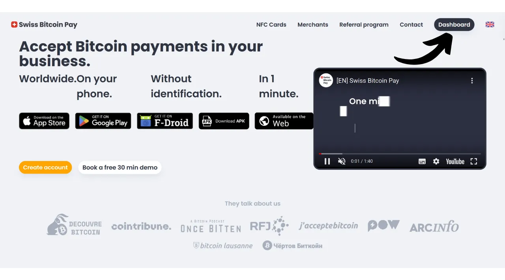
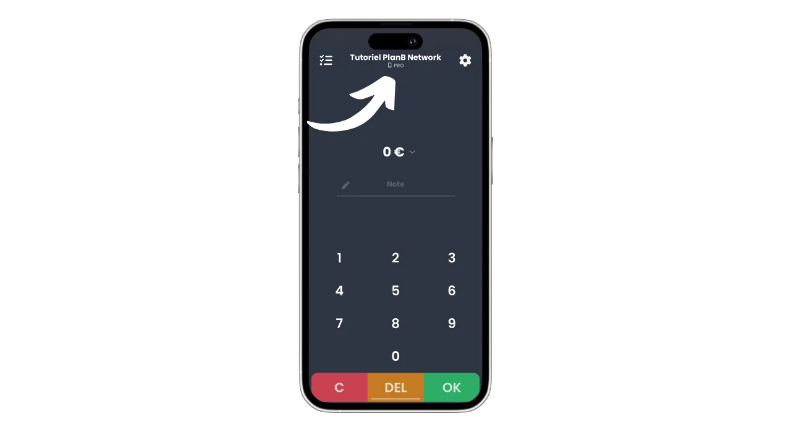

Nykyään on olemassa lukuisia ratkaisuja kauppiaille, jotka haluavat hyväksyä Bitcoinin maksutapana. Pienille toimijoille, jotka etsivät epämuodollista asetelmaa, riittää hot walletin tai jopa Lightning walletin asentaminen maksujen suoraan vastaanottamiseen. Suuremmat yritykset, jotka tarvitsevat pitää kirjanpitoa, tulisi sen sijaan valita erikoistunut maksujenkäsittelyjärjestelmä. Tällä alueella on myös useita vaihtoehtoja saatavilla.

Niille, jotka mieluummin eivät vaivaudu ja haluavat vastaanottaa varat fiat-valuuttana suoraan pankkitililleen, ovat saatavilla holhousratkaisut kuten Open Node:

https://planb.network/tutorials/merchant/open-node

Kauppiaat, jotka ovat valmiita tekemään työtä ja haluavat hallita prosessia täysin, BTCPay Server -ohjelmisto on erinomainen vaihtoehto. BTCPay Serverin suurin haittapuoli on kuitenkin se, että sen asettaminen ja hallinta vie aikaa ja vaatii jonkin verran teknistä osaamista:

https://planb.network/tutorials/merchant/btcpay-server

Kaikkien näiden ratkaisujen joukossa Swiss Bitcoin Pay vaikuttaa olevan erittäin mielenkiintoinen kompromissi käytön helppouden, ominaisuuksien ja turvallisuuden yhdistämisessä. Tämä ratkaisu soveltuu sekä hyvin pienille yrityksille että suuremmille rakenteille. Tässä oppaassa saat selville, kuinka voit helposti käyttää Swiss Bitcoin Payta hyväksyäksesi Bitcoinin yrityksessäsi.

## Miksi hyväksyä Bitcoin yrityksessäsi?

Bitcoinin hyväksyminen maksutapana tarjoaa lukuisia etuja yrityksellesi. Ensinnäkin, Bitcoin toimii jossain määrin kuin käteinen, mutta ilman fyysisen rahan haittoja. Kuten käteisen, Bitcoin-maksut eivät tarvitse kulkea perinteisen pankkikierroksen kautta. Se on suora vertaisverkkotransaktio asiakkaaltasi sinulle, ellet käytä maksuvälittäjää.

Lisäksi Bitcoin-maksu tarjoaa välittömän lopullisuuden Lightningin kanssa ja kestää vain muutaman minuutin tapauksessa onchain-maksussa. Kun maksu on vahvistettu, Bitcoin-maksua ei ole mahdollista peruuttaa. Jos valitset itsehoitoisen säilytyksen, hallitset suoraan Bitcoinejasi, mikä lisää entisestään yrityksesi taloudellista autonomiaa.

Bitcoinin avulla voit myös saavuttaa merkittäviä säästöjä komissioissa ja pankkimaksuissa. Bitcoinin käyttö poistaa tarpeen ostaa tai vuokrata maksupäätettä; tietokone tai yksinkertainen älypuhelin riittää. Lisäksi suorien Bitcoin-maksujen hyväksymällä vältät yleensä transaktioista perittävät komissiot. Vaikka käyttäisitkin välittäjää maksujen käsittelyyn, Bitcoin-transaktioiden liittyvät maksut ovat yleensä paljon alhaisemmat kuin perinteisten pankkien.

Bitcoin jakaa monia etuja käteisen kanssa, mutta tarjoaa vielä enemmän hyötyjä omaisuutena. Esimerkiksi BTC:n kokonaismäärä on konsensuksen mukaan kiinteä 21 miljoonassa yksikössä, mikä tekee siitä harvinaisen omaisuuden ja vastustuskykyisen rahapoliittiselle inflaatiolle, toisin kuin valtioiden valuutat. Hyväksymällä bitcoinin yrityksessäsi sinulla on mahdollisuus säilyttää yrityksesi kassan arvo pitkällä aikavälillä ja monipuolistaa yrityksesi varoja.

Arkipäiväisessä käytössä bitcoin-maksut tarjoavat enemmän mukavuutta ja joustavuutta kuin käteinen. Merkittävä etu on, että sinun ei tarvitse antaa vaihtorahaa bitcoin-maksusta, mikä poistaa tarpeen hallita fyysistä kassakonetta. Lisäksi bitcoinien hyväksyminen vähentää altistumistasi varkauksien, murtojen ja ryöstöjen riskeille. Lisäksi se on valuutta, jota ei voida väärentää, toisin kuin setelit.

Jos sinulla on kansainvälinen asiakaskunta, bitcoinilla on etu olla globaali valuutta, mikä eliminoi tarpeen asiakkaillesi vaihtaa valuuttoja.

Verkkoliiketoiminnalle Bitcoin on myös tehokas menetelmä turvallisten etämaksujen hyväksymiseen ilman, että on tarpeen käyttää perinteisiä pankkijärjestelmiä. Tämä käyttö oli itse asiassa yksi Bitcoinin keksijän, Satoshi Nakamoton, alkuperäisistä tarkoituksista, joka kuvasi sitä "*vertaisverkkoon perustuvaksi elektroniseksi käteisjärjestelmäksi*".
Lopulta Bitcoinin integroiminen yritykseesi voi olla myös osa markkinointistrategiaa. BTC:n hyväksyminen voi asettaa yrityksesi innovatiiviseksi, joustavaksi ja teknologisen kehityksen mukaiseksi, samalla avaten sinut uudelle markkinalle. [KPMG:n tutkimuksen](https://kpmg.com/fr/fr/home/media/press-releases/2024/03/web3-crypto-actifs-adan.html) mukaan 12% ranskalaisista omistaa kryptovaluuttoja, ja suurin osa heistä omistaa bitcoinia. Hyväksymällä tämän maksutavan voit houkutella asiakkaita, jotka haluavat käyttää satsinsa, jotka muuten eivät ehkä koskaan olisi asiakkaasi. Se on myös hyvä tapa tulla tunnetuksi Z-sukupolven keskuudessa.
Mielestäni bitcoinin hyväksymistä tulisi pitää vähäriskisenä mahdollisuutena, jolla voi olla merkittävä positiivinen vaikutus yritykseesi. Jos kokemus osoittautuu epäonnistuneeksi, aiheutuneet kustannukset pysyvät minimaalisina. Pääkustannus on aika, joka tarvitaan ratkaisun perustamiseen BTC:n hyväksymiseksi, mutta kuten tässä oppaassa huomaat, se on nyt hyvin yksinkertaista ja nopeaa saavuttaa.

## Swiss Bitcoin Payn esittely
Swiss Bitcoin Pay on ratkaisu, joka mahdollistaa kauppiaiden hyväksyä Bitcoin-maksuja suoraviivaisesti. Se integroi PoS (*Point of Sale*) -sovelluksen intuitiivisella käyttöliittymällä, joka on helppokäyttöinen työntekijöillesi vaatimatta syvällistä teknistä tietämystä. Toisin kuin perinteinen Bitcoin-lompakko, Swiss Bitcoin Pay -sovellus on tarkoitettu ainoastaan Bitcoin-maksujen vastaanottamiseen, mikä mahdollistaa laitteen luovuttamisen työntekijöille ilman riskejä. Voit käyttää useita PoS-sovelluksia, jotka on yhdistetty samaan Swiss Bitcoin Pay -tiliin, helpottaen niiden käyttöönottoa joko tabletilla, kassalla tai työntekijöidesi älypuhelimilla. Swiss Bitcoin Pay -sovellus voidaan asentaa Android- ja iOS-laitteisiin, ja se on saatavilla myös verkkoversiona tietokoneille.

Swiss Bitcoin Pay tarjoaa kaksi vaihtoehtoa maksujen hallintaan: varat voidaan joko nostaa suoraan Bitcoinina tiettyyn osoitteeseen tai muuntaa fiat-valuutaksi ja tallettaa pankkitilille. Tämä toiminto on automatisoitu ja tapahtuu päivittäin joka 24. tunti. Näin ollen sinun ei tarvitse manuaalisesti hallita Bitcoin-maksuja tai niitä Lightning Networkin kautta; Swiss Bitcoin Pay huolehtii kaikesta puolestasi. Joka päivä saat maksujen saldon henkilökohtaiseen lompakkoosi tai pankkitilillesi, riippuen mieltymyksestäsi. Vaikka se ei olekaan 100% ei-huoltaja ratkaisu, kuten esimerkiksi BTCPay Server tarjoaa, Swiss Bitcoin Pay edustaa mielenkiintoista kompromissia mukavuuden ja turvallisuuden välillä, koska välittäjä pitää vastaanottosi vain 24 tuntia ennen varojen siirtämistä sinulle. Lisäksi, toisin kuin muut huoltajaratkaisut, Swiss Bitcoin Pay ei vaadi yritykseltäsi minkäänlaista henkilöllisyyden varmentamista (KYC).

Swiss Bitcoin Payn käyttöön liittyvät maksut ovat erittäin kilpailukykyisiä: ensimmäisenä vuonna transaktioihin sovelletaan 0,21%:n komissiota. Myöhemmin maksut ovat 1% Bitcoinina pidetyistä maksuista ja 1,5% fiat-valuutaksi muunnetuista maksuista. On kuitenkin huomionarvoista, että vastineeksi he kattavat 100% Bitcoin-siirtomaksuista kaikista nostoistasi.

Swiss Bitcoin Pay esittäytyy siten mielenkiintoisena vaihtoehtona täysin huoltajapohjaisten ratkaisujen ja monimutkaisempien itseisännöityjen järjestelmien, kuten BTCPay Serverin, välillä. Se on hyvä kompromissi yksinkertaisuuden, turvallisuuden ja kauppiaan taloudellisen autonomian välillä.

## Kuinka luoda Swiss Bitcoin Pay -tili?

Vieraile [virallisella Swiss Bitcoin Pay -verkkosivustolla](https://swiss-bitcoin-pay.ch/).

Napsauta "*Dashboard*" -painiketta.

Napsauta "*Rekisteröidy*" -painiketta.

Valitse nimi tilillesi. Tämä voi olla yrityksesi kauppanimi (tämä nimi näkyy asiakkaidesi salkussa heidän tapahtumahistoriassaan).

Anna sähköpostiosoite.

Valitse vahva salasana tilisi suojaamiseksi.

Aseta paikallinen valuuttasi.

Valitse sitten, miten haluaisit vastaanottaa varasi säätämällä liukusäädintä: joko 100% bitcoineina, 100% paikallisessa valuutassa tai haluamasi jakautuminen näiden kahden välillä.

Jos valitset varojen vastaanottamisen pankkijärjestelmän kautta paikallisessa valuutassa, sinun on annettava pankkitilisi tiedot. Jos haluat vastaanottaa varasi bitcoineina, useita vastaanottovaihtoehtoja on käytettävissäsi.

"*Onchain*" -vaihtoehto mahdollistaa kaikkien maksujesi vastaanottamisen yhteen Bitcoin-osoitteeseen. Kuitenkin neuvon välttämään tätä vaihtoehtoa, koska saman osoitteen uudelleenkäyttö voi suuresti haitata yksityisyyttäsi.

Jos valitset maksujen vastaanottamisen bitcoineina onchain, on suositeltavaa käyttää laajennettua julkista avainta "*x/y/zpub*" -vaihtoehdon kanssa. Näin Swiss Bitcoin Pay voi johtaa uuden, käyttämättömän osoitteen jokaiseen nostoon.

Jos odotat suhteellisen pientä määrää bitcoin-maksuja, voit myös valita maksujen vastaanottamisen suoraan Lightning Networkin kautta. Tätä varten sinun on annettava Lightning-osoite. Varasi siirretään välittömästi jokaisen maksun jälkeen, toisin kuin onchain-vaihtoehdot, jotka ryhmittävät kaikki kuitit yhteen päivittäiseen maksuun.

Ilmeisesti tämä valinta vaikuttaa vain Swiss Bitcoin Payn maksutapaan yrityksellesi. Asiakkaasi voivat silti maksaa sinulle Lightning Networkin tai onchainin kautta, riippumatta tässä valitsemastasi vaihtoehdosta.

Tässä oppaassa valitsen maksujen vastaanottamisen Lightningin kautta. Koulutustarkoituksessa ja todellisen Lightning-nodeni luottamuksellisuuden säilyttämiseksi käytän väärennettyä Wallet of Satoshi -lompakkoa nostoissa. Kuitenkin neuvon vahvasti välttämään holhouspalvelun Bitcoin-lompakon käyttöä, olipa kyseessä sitten nostot LN:ssä tai onchainissa.

Sinun on sitten maksettava 1 sat Lightning-osoitteesi vahvistamiseksi. Bitcoin-osoitteen tapauksessa sinun on annettava allekirjoitus yksityisellä avaimella, joka vastaa kyseistä osoitetta.

Lopuksi sinulla on mahdollisuus lisätä suosittelukoodi. Jos haluat tukea meitä, voit käyttää koodia "*DiscoverBitcoin*", jotta osa komissioistasi jaetaan kanssamme. Kiitos! :)

Kun kaikki tiedot on täytetty, napsauta "*Lähetä*" -painiketta.

Ja siinä se on! Swiss Bitcoin Pay -tilisi on nyt valmis. Voit nyt alkaa vastaanottaa Bitcoin-maksuja yrityksellesi!

Jos haluat, voit edistää yritystäsi napsauttamalla sähköpostitse saamaasi linkkiä.

## Kuinka asentaa Swiss Bitcoin Pay PoS?
Voit jo käyttää maksuprosessoria web-versiossa seuraavalla sivustolla: https://app.swiss-bitcoin-pay.ch/

Jos haluat käyttää PoS:ää älypuhelimella tai tabletilla, sinulla on kaksi vaihtoehtoa: asenna sovellus tai käytä web-versiota suoraan selaimestasi. Jälkimmäistä vaihtoehtoa varten, pääse käsiksi hallintapaneeliisi kirjautumalla sisään [Swiss Bitcoin Pay -sivustolla](https://dashboard.swiss-bitcoin-pay.ch/signin).

Skannaa sitten yksinkertaisesti QR-koodi, joka näkyy käyttöliittymässäsi valitsemallasi laitteella.

Jos haluat mieluummin PoS:n sovelluksen muodossa, mene sovelluskauppaasi [Google Play Store](https://play.google.com/store/apps/details?id=ch.swissbitcoinpay.checkout) tai [App Store](https://apps.apple.com/us/app/swiss-bitcoin-pay/id6444370155) ja asenna Swiss Bitcoin Pay. Sovellus on saatavilla myös suoraan `.apk`-muodossa heidän verkkosivustollaan tai [F-Droid-kaupassa](https://f-droid.org/packages/ch.swissbitcoinpay.checkout/).

Ensimmäisellä avauskerralla, klikkaa "*Skannaa aktivointi-QR-koodi*" -painiketta.

Skannaa QR-koodi, joka on näkyvissä hallintapaneelissasi.

Olet nyt yhdistetty PoS-järjestelmään työntekijänä, mikä tarkoittaa, että tällä koneella on oikeus käsitellä maksuja muuttamatta yritystilisi asetuksia.

Jos haluat, voit muuttaa PoS:n nimeä, joka näkyy kassoilla admin-tililläsi. Voit nimetä terminaalin sen tietyn sijainnin mukaan (esimerkiksi "*Baari Mezzanine*", "*Palvelu Drive*", "*Päätarjoilija Neliö Nro 3*", "*Huoneapulainen Nro 2*", "*Kassakone Nro 7*", "*Terassi*", "*Pikakassa*", "*Vastaanotto*", "*Concierge*", "*Spa/Wellness*...") tai työntekijän nimen mukaan, joka sitä käyttää. Tee tämä klikkaamalla nykyistä PoS:n nimeä, joka sijaitsee yrityksen nimen alla näytön yläosassa. 
Merkitse uusi nimi tälle maksuprosessorille, sitten klikkaa "*Lähetä*" -painiketta.

## Kuinka suorittaa maksu Swiss Bitcoin Paylla?

Maksun suorittaminen on hyvin yksinkertaista, kun olet PoS:lla, syötä kassattava summa.

"*Huomautus*" -kentässä voit merkitä tietoja, jotka liitetään maksuun, erityisesti raporteissasi. Esimerkiksi voit merkitä myydyn hyödykkeen tai palvelun.

Klikkaa sitten "*OK*" -painiketta.

Odota muutama sekunti, että Swiss Bitcoin Pay luo Lightning-laskun ja vastaanotto-osoitteen.

PoS-järjestelmä näyttää yhtenäisen QR-koodin, jonka avulla asiakkaasi voivat suorittaa maksun joko Lightning Networkin kautta tai onchain (se on sama QR-koodi molemmille menetelmille). Jos laitteesi sen sallii, maksu voidaan suorittaa myös Lightning-kortilla käyttäen NFC-teknologiaa.

Kun lasku on maksettu, PoS vahvistaa maksun onnistumisen.

Voit myös löytää maksun ja koko tämän tietyn PoS:n tapahtumahistorian napsauttamalla näytön vasemmassa yläkulmassa olevaa kuvaketta.

Löydät juuri vastaanotetun maksun.

Koska olin valinnut vaihtoehdon nostaa maksut Lightning-osoitteen kautta, näen, että PoS:ni liiketoiminnassa tehdyt maksut ovat jo saapuneet LN-lompakkooni.

## Kuinka hallita liiketoimintaasi Swiss Bitcoin Payn avulla?

Liiketoimintasi tarkemman hallinnan vuoksi kaikki tapahtuu hallintapaneelissasi. Vieraile [virallisella Swiss Bitcoin Pay -verkkosivustolla](https://swiss-bitcoin-pay.ch/).

Napsauta näytön oikeassa yläkulmassa olevaa "*Dashboard*" -painiketta, syötä sitten sähköpostiosoitteesi ja salasanasi.  Tämän jälkeen saavut tähän käyttöliittymään.  "*Home*" -välilehdessä voit nähdä maksujen saldon, jotka odottavat nostoa sekä tilisi viimeisimmät toiminnot.  "*Activity*" -välilehdessä voit tarkastella kaikkien tapahtumiesi yksityiskohtia.  Esimerkiksi omalla hallintapaneelillani näen, että PoS "*Chef de Rang - Carré 3*" keräsi oluen 5 eurolla 22.08.2024 kello 17:08.  Näen myös, että vastaanotto keräsi kahvin.  Lopuksi voin nähdä kaikki nostotapahtumat henkilökohtaiseen Lightning-lompakkooni.  Raporttien viennin asettamiseksi napsauta "*Export*" -painiketta.  "*Manual*" -välilehdessä voit tehdä kertaluonteisen viennin tapahtumistasi. Valitse vain ajanjakso, sitten valitse tiedot, jotka haluat sisällyttää raporttiisi.  Napsauta sitten "*Export*" -painiketta ladataksesi `.csv` tiedoston tapahtumistasi.  "*Recurring*" -välilehdessä voit ajoittaa automaattiset toistuvat viennit. Valitse viennin luontitiheys ja valitse tiedot, jotka haluat sisällyttää raporttiin.  Lopuksi, syötä sähköpostiosoite, johon raportti lähetetään. Esimerkiksi voit suoraan syöttää kirjanpitäjäsi sähköpostiosoitteen. Napsauta "*Save*" -painiketta tallentaaksesi tämän ajoitetun viennin.  Laskuvälilehti mahdollistaa laskun luomisen kertamaksulle.  "*Limits & verification*" -välilehdessä voit tarkastella päivittäisiä ja vuosittaisia keräysrajojasi. Sinulla on myös mahdollisuus suorittaa henkilöllisyyden varmistaminen korkeampien rajojen avaamiseksi.  "*Referral*" -välilehti mahdollistaa kaiken sponsorointiin liittyvän hallinnan. Lopuksi, "*Settings*" -välilehdessä voit muokata rekisteröinnin aikana antamiasi tietoja, mukaan lukien nostotavat ja jaon bitcoinin ja fiat-valuutan välillä. 
Onneksi olkoon! Olet nyt asettanut maksunvälitysjärjestelmän hyväksymään bitcoineja liiketoiminnassasi. Jos haluat myös tutustua BTCPay Serveriin, joka on kehittyneempi ja monimutkaisempi ratkaisu, suosittelen, että seuraat kattavaa koulutustamme, joka on erityisesti omistettu tälle ohjelmistolle: [BTC305](https://planb.network/courses/btc305).