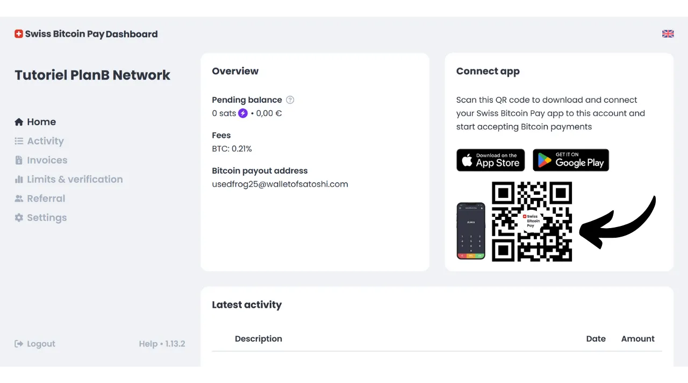
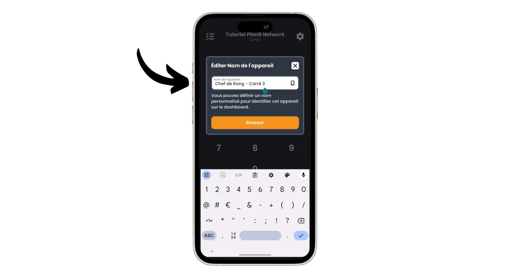
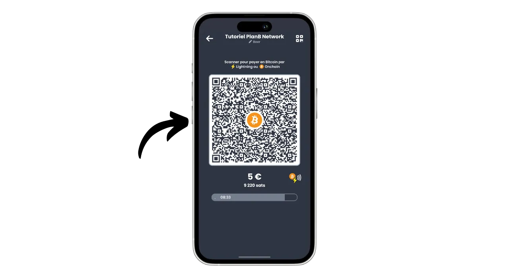
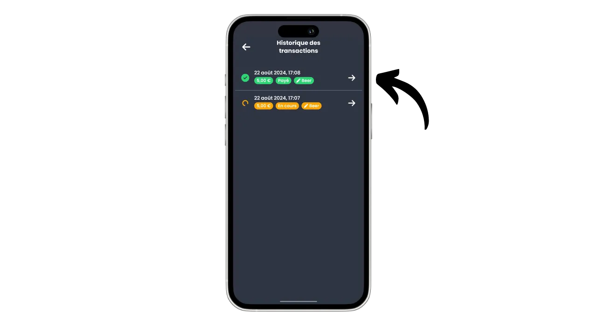

Aujourd'hui, de nombreuses solutions existent pour les commerçants qui souhaitent accepter le bitcoin comme moyen de paiement. Pour les petites structures qui souhaitent une mise en place informelle, il suffit d'installer un portefeuille chaud, voire un portefeuille Lightning, pour recevoir des paiements directement sur celui-ci. Les entreprises plus importantes, qui ont besoin de tenir une comptabilité, devront plutôt opter pour un système spécialisé de traitement des paiements. Plusieurs options sont disponibles également dans ce domaine.

Pour ceux qui préfèrent ne pas s'embêter et recevoir des fonds en monnaie fiat directement sur leur compte bancaire, il existe des solutions custodiales comme Open Node :

https://planb.network/tutorials/merchant/open-node

Pour les commerçants prêts à mettre les mains dans le cambouis et qui veulent contrôler entièrement le processus, le logiciel BTCPay Server est une excellente option. Cependant, l'inconvénient majeur de BTCPay Server est que sa mise en place et sa gestion prennent du temps, et nécessitent une certaine expertise technique :

https://planb.network/tutorials/merchant/btcpay-server

Au milieu de toutes ces solutions, il y a Swiss Bitcoin Pay qui semble être un compromis très intéressant alliant facilité d'utilisation, fonctionnalités et sécurité. Cette solution convient aussi bien aux très petits commerces qu'aux plus grandes structures. Dans ce tutoriel, vous allez découvrir comment utiliser facilement Swiss Bitcoin Pay pour accepter le bitcoin dans votre commerce.

## Pourquoi accepter le bitcoin dans son commerce ?

Accepter le bitcoin comme moyen de paiement offre de nombreux avantages pour votre entreprise. Premièrement, le bitcoin fonctionne un peu comme de l'argent liquide, mais sans les inconvénients de l'argent liquide. Comme pour le cash, les bitcoins reçus en paiement ne nécessitent pas de passer par le circuit bancaire traditionnel. Il s'agit d'une transaction peer-to-peer directe de votre client à vous-même, à moins que vous n'utilisiez un intermédiaire de paiement.

De plus, un paiement en bitcoin offre une finalité instantanée avec Lightning et prend seulement quelques minutes dans le cas d'un paiement onchain. Une fois confirmé, il n'est pas possible d'annuler un paiement en bitcoins. Si vous optez pour la self custody, vous contrôlez directement vos bitcoins, ce qui renforce encore l'autonomie financière de votre commerce.

Avec le bitcoin, vous réaliserez également des économies significatives sur les commissions et les frais bancaires. Utiliser Bitcoin élimine le besoin d'acheter ou de louer un terminal de paiement ; un ordinateur ou un simple smartphone suffit. De plus, en acceptant directement les paiements en bitcoins, vous éviterez les commissions habituellement prélevées sur les transactions. Même si vous passez par un intermédiaire pour le traitement des paiements, les frais associés aux transactions en bitcoins sont généralement bien inférieurs à ceux des banques traditionnelles.

Le bitcoin partage de nombreux avantages avec le cash, mais il offre encore plus de bénéfices en tant qu'actif. Par exemple, le nombre total de BTC est fixé par consensus à 21 millions d'unités, ce qui en fait un actif rare et résistant à l'inflation monétaire, contrairement aux monnaies étatiques. En acceptant le bitcoin dans votre commerce, vous avez donc l'opportunité de préserver la valeur de votre trésorerie sur le long terme et de diversifier les actifs de votre entreprise.

Au quotidien, les paiements en bitcoins offrent plus de praticité et de flexibilité que le cash. Un avantage important est que vous n'avez pas besoin de rendre la monnaie sur un paiement en bitcoins, ce qui élimine le besoin de gérer une caisse physique. De plus, accepter des bitcoins réduit votre exposition aux risques de vols, cambriolages et braquages. Aussi, c'est une monnaie qui ne peut pas être falsifiée, contrairement aux billets de banque. 

Si vous avez une clientèle internationale, le bitcoin présente l'avantage d'être une monnaie mondiale, ce qui élimine ainsi le besoin pour vos clients de faire du change.

Pour les commerces en ligne, Bitcoin est également une méthode efficace pour accepter des paiements à distance de manière sécurisée, sans avoir à passer par les systèmes bancaires traditionnels. Cette utilisation était d'ailleurs l'une des intentions originelles de Satoshi Nakamoto, l'inventeur de Bitcoin, qui le décrivait comme "*Un système de cash électronique pair-à-pair*".

Enfin, intégrer Bitcoin à votre commerce peut aussi faire partie d'une stratégie marketing. Accepter le BTC peut positionner votre entreprise comme innovante, flexible et adaptée aux évolutions technologiques, tout en vous ouvrant à un nouveau marché. Selon [une étude de KPMG](https://kpmg.com/fr/fr/home/media/press-releases/2024/03/web3-crypto-actifs-adan.html), 12 % des Français possèdent des cryptomonnaies, et une grande majorité d'entre eux détiennent du bitcoin. En acceptant ce moyen de paiement, vous pouvez attirer cette clientèle qui souhaite dépenser ses sats, qui autrement n'aurait peut-être jamais fréquenté votre commerce. C'est également une bonne manière de vous faire connaître auprès de la génération Z.

À mon avis, accepter le bitcoin devrait être vu comme une opportunité à faible risque pouvant avoir un impact positif significatif sur votre entreprise. Si l'expérience s'avère infructueuse, les coûts engagés resteront minimes. Le principal coût réside dans le temps nécessaire à la mise en place d'une solution pour accepter le BTC, mais comme vous allez le découvrir dans ce tutoriel, c'est désormais très simple et rapide à réaliser.

## Présentation de Swiss Bitcoin Pay

Swiss Bitcoin Pay est une solution permettant aux commerçants d'accepter des paiements en bitcoins de manière simple. Elle intègre une application PoS (*Point of Sale*) avec une interface utilisateur intuitive, facile à prendre en mains pour vos employés sans nécessiter de connaissances techniques approfondies. Contrairement à un portefeuille Bitcoin classique, l'application Swiss Bitcoin Pay est uniquement destinée à l'encaissement de bitcoins, ce qui permet de confier l'appareil aux employés sans risques. Vous avez la possibilité d'utiliser plusieurs applications de PoS connectées au même compte Swiss Bitcoin Pay, ce qui facilite leur déploiement que ce soit sur une tablette, en caisse ou sur les smartphones de vos employés. L'application Swiss Bitcoin Pay peut être installée sur des appareils sous Android et iOS, et elle est également disponible en version web pour les ordinateurs.

Swiss Bitcoin Pay offre deux options pour la gestion des paiements : les fonds peuvent être soit retirés directement en bitcoins sur une adresse spécifique, soit convertis en monnaie étatique et déposés sur un compte bancaire. Cette opération est automatisée et s'effectue quotidiennement toutes les 24 heures. Ainsi, vous n'avez pas à gérer manuellement les paiements en bitcoins ou via le Lightning Network ; Swiss Bitcoin Pay s'occupe de tout pour vous. Chaque jour, vous recevrez le solde des paiements sur votre portefeuille personnel ou votre compte bancaire, selon votre préférence. Bien que ce ne soit pas une solution 100 % non-custodiale comme celle offerte par BTCPay Server par exemple, Swiss Bitcoin Pay représente un compromis intéressant entre praticité et sécurité, car l'intermédiaire ne conserve vos recettes que pendant 24 heures avant de vous transférer les fonds. De plus, à la différence d'autres solutions custodiales, Swiss Bitcoin Pay ne requiert aucune vérification d'identité (KYC) pour votre commerce.

Les frais associés à l'utilisation de Swiss Bitcoin Pay sont très compétitifs : la première année, une commission de 0,21 % est appliquée sur les transactions. Par la suite, les frais s'élèvent à 1 % pour les paiements conservés en bitcoins et à 1,5 % pour ceux convertis en monnaie fiat. Mais il faut noter qu'en contrepartie, ils prennent en charge à 100 % les frais de transaction sur Bitcoin pour tous vos retraits.

Swiss Bitcoin Pay se présente donc comme une alternative intéressante entre les solutions entièrement custodiales et les systèmes autohébergés plus complexes tels que BTCPay Server. C'est un bon compromis entre simplicité, sécurité et autonomie financière pour le commerçant.

## Comment créer un compte Swiss Bitcoin Pay ?

Rendez-vous sur [le site officiel de Swiss Bitcoin Pay](https://swiss-bitcoin-pay.ch/).

Cliquez sur le bouton "*Dashboard*".

Cliquez sur le bouton "*Sign up*".

Choisissez un nom pour votre compte. Cela peut être le nom commercial de votre entreprise (c'est ce nom qui apparaitra sur le portefeuille de vos clients dans leur historique de transactions).

Renseignez une adresse email.

Choisissez un mot de passe fort pour sécuriser votre compte.

Définissez votre devise locale.

Choisissez ensuite la manière dont vous souhaitez recevoir vos fonds en ajustant le curseur : soit 100 % en bitcoins, soit 100 % en devise locale, ou bien la répartition de votre choix entre les deux.

Si vous choisissez de recevoir vos fonds via le système bancaire en devise locale, vous devrez fournir les identifiants de votre compte bancaire. Si vous préférez recevoir vos fonds en bitcoins, plusieurs options de réception s'offrent à vous.

L'option "*onchain*" permet de recevoir tous vos paiements sur une unique adresse Bitcoin. Cependant, je vous déconseille cette option, car elle entraîne la réutilisation d'une même adresse, ce qui peut nuire fortement à votre confidentialité.

Si vous choisissez de recevoir vos paiements en bitcoins onchain, il est préférable d'utiliser une clé publique étendue avec l'option "*x/y/zpub*". Ainsi, Swiss Bitcoin Pay pourra dériver une nouvelle adresse vierge pour chaque retrait.

Si vous anticipez un volume de paiements en bitcoins relativement faible, vous pouvez également choisir de recevoir les paiements directement via le Lightning Network. Pour ce faire, vous devrez fournir une adresse Lightning. Vos fonds seront transférés immédiatement après chaque paiement, contrairement aux options onchain qui regroupent tous les encaissements en un seul paiement journalier.

Évidemment, ce choix affecte uniquement le mode de paiement de Swiss Bitcoin Pay à votre entreprise. Vos clients pourront toujours vous payer via le Lightning Network ou onchain, indépendamment de l'option que vous sélectionnez ici.

Pour ce tutoriel, je vais choisir de recevoir mes paiements via Lightning. À des fins pédagogiques et pour préserver la confidentialité de mon véritable nœud Lightning, je vais utiliser un faux portefeuille Wallet of Satoshi pour les retraits. Cependant, je vous déconseille fortement d'utiliser un portefeuille Bitcoin custodial, que ce soit pour des retraits sur LN ou onchain.

Vous devrez ensuite payer 1 sat pour vérifier votre adresse Lightning. Dans le cas d'une adresse bitcoin, vous devrez fournir une signature avec la clé privée correspondant à cette adresse.

Enfin, vous avez la possibilité d'ajouter un code de parrainage. Si vous souhaitez nous soutenir, vous pouvez utiliser le code "*DecouvreBitcoin*" afin qu'une partie de vos commissions nous soient reversées. Merci ! :)

Une fois toutes les informations remplies, cliquez sur le bouton "*Envoyer*".

Et voilà ! Votre compte Swiss Bitcoin Pay est déjà prêt. Vous pouvez dorénavant recevoir des paiements en bitcoins pour votre commerce !

Si vous le souhaitez, vous pouvez mettre en avant votre commerce en cliquant sur le lien reçu par email.

## Comment installer le PoS Swiss Bitcoin Pay ?

Vous pouvez déjà accéder au processeur de paiement en version web sur le site suivant : https://app.swiss-bitcoin-pay.ch/

Si vous souhaitez utiliser le PoS sur un smartphone ou une tablette, vous avez deux options : installer l'application ou utiliser la version web directement depuis votre navigateur. Pour cette dernière option, accédez à votre tableau de bord en vous connectant sur [le site de Swiss Bitcoin Pay](https://dashboard.swiss-bitcoin-pay.ch/signin).

Puis scannez simplement le QR code présent sur votre interface avec l'appareil de votre choix.

Si vous préférez avoir le PoS sous forme d'application, rendez-vous sur votre magasin d'application [Google Play Store](https://play.google.com/store/apps/details?id=ch.swissbitcoinpay.checkout) ou [App Store](https://apps.apple.com/us/app/swiss-bitcoin-pay/id6444370155) et installez Swiss Bitcoin Pay. L'application est également disponible directement au format `.apk` sur leur site web, ou sur [le store F-Droid](https://f-droid.org/packages/ch.swissbitcoinpay.checkout/).

Lors de la première ouverture, cliquez sur le bouton "*Scanner le code QR d'activation*".

Scannez le QR code présent sur votre dashboard.

Vous êtes maintenant connecté au système PoS en tant qu'employé, ce qui signifie que cette machine est uniquement autorisée à encaisser les paiements sans avoir la capacité de modifier les paramètres de votre compte d'entreprise.

Si vous le souhaitez, vous pouvez modifier le nom du PoS qui apparaît lors des encaissements dans votre compte administrateur. Vous pouvez nommer le terminal selon son emplacement spécifique (par exemple, "*Bar Mezzanine*", "*Service Drive*", "*Chef de Rang Carré n°3*", "*Commis de Salle n°2*", "*Caisse n°7*", "*Terrasse*", "*Caisse Express*", "*Réception*", "*Conciergerie*", "*Spa/Bien-être*"...) ou selon le nom de l'employé qui l'utilise. Pour ce faire, cliquez sur le nom actuel du PoS situé sous le nom de l'entreprise en haut de l'écran.

Notez le nouveau nom de ce processeur d'encaissement, puis cliquez sur le bouton "*Send*".

## Comment encaisser sur Swiss Bitcoin Pay ?

Pour encaisser c'est très simple, une fois sur un PoS, renseignez le montant à encaisser.

Dans la case "*Note*", vous pouvez noter une information qui sera attachée au paiement, notamment dans vos rapports. Vous pouvez par exemple noter le bien ou le service vendu.

Puis cliquez sur le bouton "*OK*".

Patientez quelques secondes le temps que Swiss Bitcoin Pay crée l'invoice Lightning et l'adresse de réception.

Le système PoS affichera ensuite un QR code unifié qui permet à vos clients de réaliser leur paiement soit via le Lightning Network, soit onchain (c'est le même QR code pour les deux méthodes). Si votre appareil le permet, le paiement peut également être effectué via une carte Lightning en utilisant la technologie NFC.

Une fois la facture payée, le PoS vous confirme la réussite du paiement.

Vous pouvez également retrouver le paiement et tout l'historique des transactions de ce PoS spécifique en cliquant sur l'icône en haut à gauche de l'écran.

On peut retrouver le paiement que l'on vient d'encaisser.

Puisque j'avais choisi l'option de retrait des paiements via une adresse Lightning, je peux voir que les paiements sur les PoS de mon commerce sont déjà arrivés sur mon portefeuille LN.

## Comment gérer son commerce avec Swiss Bitcoin Pay ?

Pour gérer plus précisément votre commerce, tout se passe sur votre dashboard. Rendez-vous sur [le site officiel de Swiss Bitcoin Pay](https://swiss-bitcoin-pay.ch/).

Cliquez en haut à droite de l'écran sur le bouton "*Dashboard*", puis renseignez votre adresse mail ainsi que votre mot de passe.

Vous arriverez ensuite sur cette interface.

Dans l'onglet "*Home*", vous pouvez voir le solde des paiements en attente de retrait ainsi que les dernières activités de votre compte.

Dans l'onglet "*Activity*", vous pouvez consulter le détail de toutes vos transactions.

Par exemple, sur mon tableau de bord, je peux voir que le PoS "*Chef de Rang - Carré 3*" a encaissé une bière à 5 € le 22/08/2024 à 17:08.

Je peux également voir que la réception a encaissé un café.

Et enfin, je peux voir toutes les transactions de retrait vers mon portefeuille Lightning personnel.

Pour paramétrer l'export de rapports, cliquez sur le bouton "*Export*".

Dans l'onglet "*Manual*", vous pouvez faire un export ponctuel de vos transactions. Choisissez simplement une période, puis sélectionnez les informations que vous souhaitez inclure dans votre rapport.

Puis cliquez sur le bouton "*Export*" pour télécharger un fichier `.csv` de vos transactions.

Dans l'onglet "*Recurring*", vous pouvez planifier des exports automatiques récurrents. Sélectionnez la fréquence de génération des exports, et sélectionnez les informations que vous souhaitez inclure dans le rapport.

Enfin, renseignez l'adresse email où sera envoyé le rapport. Vous pouvez par exemple renseigner directement l'adresse email de votre comptable. Cliquez sur le bouton "*Save*" pour enregistrer cet export programmé.

L'onglet invoice vous permet de générer une facture pour un paiement ponctuel.

Dans l'onglet "*Limits & verification*", vous pouvez consulter vos limites d'encaissement quotidiennes et annuelles. Vous avez également la possibilité de réaliser une vérification d'identité afin de débloquer des limites plus élevées.

L'onglet "*Referral*" vous permet de gérer tout ce qui est relatif au parrainage.

Enfin, dans l'onglet "*Settings*", vous avez la possibilité de modifier les informations que vous avez fournies lors de l'inscription, notamment les méthodes de retrait et la répartition entre bitcoin et fiat.

Félicitations ! Vous avez désormais mis en place un système de processeur de paiement pour accepter le bitcoin dans votre commerce. Si vous souhaitez également découvrir BTCPay Server, une solution plus avancée et plus complexe, je vous recommande de suivre notre formation complète spécifiquement consacrée à ce logiciel : [BTC305](https://planb.network/courses/btc305).
