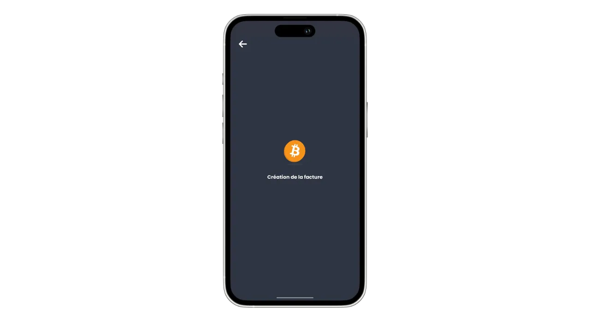
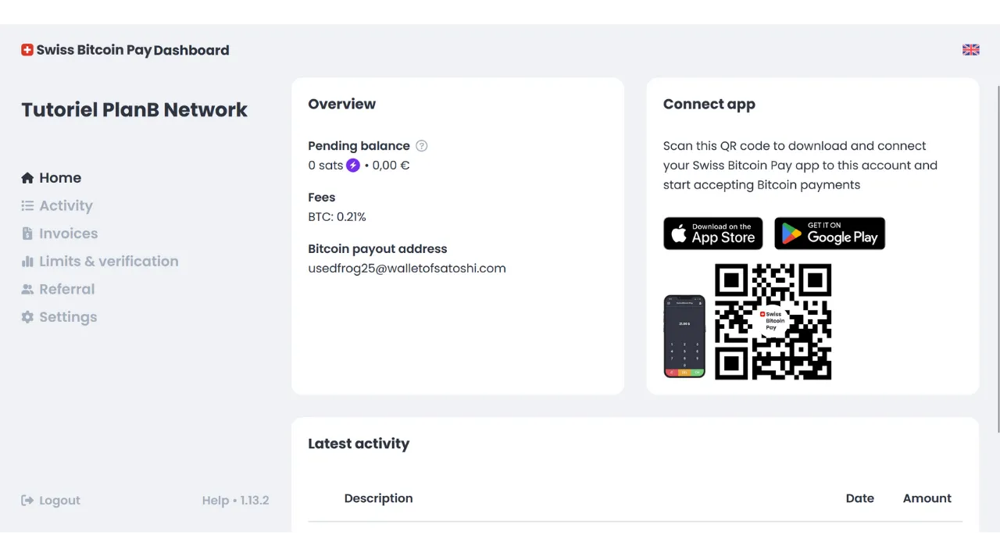

Hari ini, banyak solusi tersedia bagi pedagang yang ingin menerima Bitcoin sebagai metode pembayaran. Untuk entitas kecil yang mencari pengaturan informal, memasang dompet panas (hot wallet), atau bahkan dompet Lightning, cukup untuk menerima pembayaran langsung ke dalamnya. Bisnis yang lebih besar, yang perlu memelihara catatan akuntansi, sebaiknya memilih sistem pemrosesan pembayaran yang khusus. Beberapa opsi juga tersedia di area ini.

Bagi mereka yang lebih memilih untuk tidak repot dan menerima dana dalam mata uang fiat langsung ke rekening bank mereka, solusi kustodian seperti Open Node tersedia:

https://planb.network/tutorials/merchant/open-node

Untuk pedagang yang siap 'mengotori tangan' dan ingin mengontrol proses sepenuhnya, perangkat lunak BTCPay Server adalah pilihan yang sangat baik. Namun, kelemahan utama dari BTCPay Server adalah bahwa pengaturan dan pengelolaannya membutuhkan waktu dan memerlukan beberapa keahlian teknis:

https://planb.network/tutorials/merchant/btcpay-server

Dari semua solusi ini, Swiss Bitcoin Pay tampaknya menjadi kompromi yang sangat menarik yang menggabungkan kemudahan penggunaan, fitur, dan keamanan. Solusi ini cocok untuk bisnis yang sangat kecil maupun struktur yang lebih besar. Dalam tutorial ini, Anda akan menemukan cara mudah menggunakan Swiss Bitcoin Pay untuk menerima Bitcoin dalam bisnis Anda.

## Mengapa menerima Bitcoin dalam bisnis Anda?

Menerima Bitcoin sebagai metode pembayaran menawarkan banyak keuntungan bagi bisnis Anda. Pertama-tama, Bitcoin berfungsi agak mirip dengan uang tunai, tetapi tanpa kelemahan uang fisik. Seperti uang tunai, Bitcoin yang diterima sebagai pembayaran tidak perlu melalui sirkuit perbankan tradisional. Ini adalah transaksi peer-to-peer langsung dari klien Anda kepada Anda, kecuali Anda menggunakan perantara pembayaran.

Selain itu, pembayaran Bitcoin menawarkan kepastian instan dengan Lightning dan hanya membutuhkan beberapa menit dalam kasus pembayaran onchain. Setelah dikonfirmasi, tidak mungkin untuk membatalkan pembayaran Bitcoin. Jika Anda memilih penyimpanan sendiri, Anda secara langsung mengontrol Bitcoin Anda, yang lebih meningkatkan otonomi keuangan bisnis Anda.

Dengan Bitcoin, Anda juga akan menyadari penghematan yang signifikan pada komisi dan biaya perbankan. Menggunakan Bitcoin menghilangkan kebutuhan untuk membeli atau menyewa terminal pembayaran; komputer atau smartphone sederhana sudah cukup. Selain itu, dengan menerima pembayaran Bitcoin langsung, Anda menghindari komisi yang biasanya dikenakan pada transaksi. Bahkan jika Anda melalui perantara untuk pemrosesan pembayaran, biaya yang terkait dengan transaksi Bitcoin umumnya jauh lebih rendah daripada yang dari bank tradisional.
Bitcoin memiliki banyak keuntungan dengan uang tunai, tetapi menawarkan lebih banyak manfaat sebagai aset. Misalnya, jumlah total BTC ditetapkan oleh konsensus pada 21 juta unit, menjadikannya aset langka dan tahan terhadap inflasi moneter, tidak seperti mata uang negara. Dengan menerima bitcoin dalam bisnis Anda, Anda memiliki kesempatan untuk menjaga nilai kas Anda dalam jangka panjang dan mendiversifikasi aset perusahaan Anda.

Dalam kehidupan sehari-hari, pembayaran bitcoin menawarkan lebih banyak kenyamanan dan fleksibilitas daripada uang tunai. Keuntungan yang signifikan adalah Anda tidak perlu memberikan kembalian untuk pembayaran bitcoin, yang menghilangkan kebutuhan untuk mengelola kas fisik. Selain itu, menerima bitcoin mengurangi paparan Anda terhadap risiko pencurian, perampokan, dan perampokan. Juga, ini adalah mata uang yang tidak dapat dipalsukan, tidak seperti uang kertas.

Jika Anda memiliki klien internasional, bitcoin memiliki keuntungan menjadi mata uang global, sehingga menghilangkan kebutuhan bagi pelanggan Anda untuk menukar mata uang.

Untuk bisnis online, Bitcoin juga merupakan metode efektif untuk menerima pembayaran jarak jauh secara aman, tanpa harus melalui sistem perbankan tradisional. Penggunaan ini memang salah satu niat asli dari Satoshi Nakamoto, penemu Bitcoin, yang mendeskripsikannya sebagai "*A peer-to-peer electronic cash system*".
Akhirnya, mengintegrasikan Bitcoin ke dalam bisnis Anda juga bisa menjadi bagian dari strategi pemasaran. Menerima BTC dapat menempatkan perusahaan Anda sebagai inovatif, fleksibel, dan adaptif terhadap evolusi teknologi, sekaligus membuka Anda ke pasar baru. Menurut [sebuah studi oleh KPMG](https://kpmg.com/fr/fr/home/media/press-releases/2024/03/web3-crypto-actifs-adan.html), 12% orang Prancis memiliki mata uang kripto, dan mayoritas besar di antara mereka memegang bitcoin. Dengan menerima alat pembayaran ini, Anda dapat menarik klien yang ingin menghabiskan satoshi mereka, yang mungkin tidak pernah mengunjungi bisnis Anda sebelumnya. Ini juga cara yang baik untuk membuat diri Anda dikenal oleh Generasi Z.
Menurut saya, menerima bitcoin harus dilihat sebagai peluang risiko rendah yang dapat memiliki dampak positif signifikan pada bisnis Anda. Jika pengalaman tersebut terbukti tidak berhasil, biaya yang dikeluarkan akan tetap minimal. Biaya utama terletak pada waktu yang dibutuhkan untuk menyiapkan solusi untuk menerima BTC, tetapi seperti yang akan Anda temukan dalam tutorial ini, sekarang sangat sederhana dan cepat untuk dicapai.

## Presentasi Swiss Bitcoin Pay
Swiss Bitcoin Pay adalah solusi yang memungkinkan pedagang untuk menerima pembayaran Bitcoin dengan cara yang mudah. Ini mengintegrasikan aplikasi PoS (*Point of Sale*) dengan antarmuka pengguna yang intuitif, mudah digunakan oleh karyawan Anda tanpa memerlukan pengetahuan teknis mendalam. Tidak seperti dompet Bitcoin tradisional, aplikasi Swiss Bitcoin Pay hanya ditujukan untuk menerima pembayaran Bitcoin, yang memungkinkan Anda untuk mempercayakan perangkat kepada karyawan tanpa risiko. Anda memiliki opsi untuk menggunakan beberapa aplikasi PoS yang terhubung ke akun Swiss Bitcoin Pay yang sama, memudahkan penyebarannya baik pada tablet, di kasir, atau di smartphone karyawan Anda. Aplikasi Swiss Bitcoin Pay dapat diinstal di perangkat Android dan iOS, dan juga tersedia dalam versi web untuk komputer.

Swiss Bitcoin Pay menawarkan dua opsi untuk mengelola pembayaran: dana dapat ditarik langsung dalam Bitcoin ke alamat tertentu atau dikonversi menjadi mata uang fiat dan disetorkan ke rekening bank. Operasi ini otomatis dan terjadi setiap 24 jam. Dengan demikian, Anda tidak perlu mengelola pembayaran Bitcoin atau melalui Lightning Network secara manual; Swiss Bitcoin Pay mengurus semuanya untuk Anda. Setiap hari, Anda akan menerima saldo pembayaran di dompet pribadi atau rekening bank Anda, sesuai dengan preferensi Anda. Meskipun bukan solusi non-custodial 100% seperti yang ditawarkan oleh BTCPay Server, misalnya, Swiss Bitcoin Pay mewakili kompromi yang menarik antara kenyamanan dan keamanan, karena perantara hanya menyimpan penerimaan Anda selama 24 jam sebelum mentransfer dana kepada Anda. Selain itu, tidak seperti solusi custodial lainnya, Swiss Bitcoin Pay tidak memerlukan verifikasi identitas (KYC) untuk bisnis Anda.

Biaya yang terkait dengan penggunaan Swiss Bitcoin Pay sangat kompetitif: tahun pertama, komisi sebesar 0,21% diterapkan pada transaksi. Selanjutnya, biayanya adalah 1% untuk pembayaran yang disimpan dalam Bitcoin dan 1,5% untuk yang dikonversi ke mata uang fiat. Namun, patut dicatat bahwa sebagai gantinya, mereka menanggung 100% biaya transaksi Bitcoin untuk semua penarikan Anda.

Swiss Bitcoin Pay dengan demikian menyajikan dirinya sebagai alternatif yang menarik antara solusi custodial penuh dan sistem self-hosted yang lebih kompleks seperti BTCPay Server. Ini adalah kompromi yang baik antara kesederhanaan, keamanan, dan otonomi finansial bagi pedagang.

## Bagaimana cara membuat akun Swiss Bitcoin Pay?

Kunjungi [situs web resmi Swiss Bitcoin Pay](https://swiss-bitcoin-pay.ch/).

Klik tombol "*Dashboard*".

Klik tombol "*Daftar*".

Pilih nama untuk akun Anda. Ini bisa jadi nama dagang dari bisnis Anda (nama ini yang akan muncul di portofolio klien Anda dalam riwayat transaksi mereka).

Berikan alamat email.

Pilih kata sandi yang kuat untuk mengamankan akun Anda.

Tetapkan mata uang lokal Anda.

Kemudian pilih bagaimana Anda ingin menerima dana Anda dengan mengatur slider: baik 100% dalam bitcoin, 100% dalam mata uang lokal, atau distribusi pilihan Anda antara keduanya.

Jika Anda memilih untuk menerima dana Anda melalui sistem perbankan dalam mata uang lokal, Anda perlu menyediakan detail rekening bank Anda. Jika Anda lebih suka menerima dana Anda dalam bitcoin, beberapa opsi penerimaan tersedia untuk Anda.

Opsi "*onchain*" memungkinkan Anda menerima semua pembayaran Anda ke satu alamat Bitcoin. Namun, saya menyarankan melawan opsi ini, karena mengarah pada penggunaan kembali alamat yang sama, yang dapat sangat merugikan privasi Anda.

Jika Anda memilih untuk menerima pembayaran Anda dalam bitcoin onchain, lebih baik menggunakan kunci publik yang diperluas dengan opsi "*x/y/zpub*". Dengan cara ini, Swiss Bitcoin Pay dapat menurunkan alamat baru yang belum digunakan untuk setiap penarikan.

Jika Anda mengantisipasi volume pembayaran bitcoin yang relatif rendah, Anda juga dapat memilih untuk menerima pembayaran langsung melalui Lightning Network. Untuk melakukan ini, Anda perlu menyediakan alamat Lightning. Dana Anda akan ditransfer segera setelah setiap pembayaran, tidak seperti opsi onchain yang mengelompokkan semua penerimaan ke dalam satu pembayaran harian.

Tentu saja, pilihan ini hanya mempengaruhi metode pembayaran Swiss Bitcoin Pay ke bisnis Anda. Pelanggan Anda masih dapat membayar Anda melalui Lightning Network atau onchain, terlepas dari opsi yang Anda pilih di sini.

Untuk tutorial ini, saya akan memilih untuk menerima pembayaran saya melalui Lightning. Untuk tujuan edukasi dan untuk menjaga kerahasiaan node Lightning nyata saya, saya akan menggunakan Wallet of Satoshi palsu untuk penarikan. Namun, saya sangat menyarankan melawan menggunakan dompet Bitcoin kustodian, baik untuk penarikan di LN atau onchain.

Anda kemudian perlu membayar 1 sat untuk memverifikasi alamat Lightning Anda. Dalam kasus alamat bitcoin, Anda perlu menyediakan tanda tangan dengan kunci pribadi yang sesuai dengan alamat tersebut.

Akhirnya, Anda memiliki opsi untuk menambahkan kode referal. Jika Anda ingin mendukung kami, Anda dapat menggunakan kode "*DiscoverBitcoin*" sehingga sebagian dari komisi Anda dibagi dengan kami. Terima kasih! :)

Setelah semua informasi diisi, klik tombol "*Kirim*".

Dan selesai! Akun Swiss Bitcoin Pay Anda sekarang siap. Anda sekarang dapat mulai menerima pembayaran Bitcoin untuk bisnis Anda!

Jika Anda mau, Anda dapat mempromosikan bisnis Anda dengan mengklik tautan yang diterima melalui email.

## Cara Menginstal Swiss Bitcoin Pay PoS?
Anda sudah bisa mengakses prosesor pembayaran dalam versi web di situs berikut: https://app.swiss-bitcoin-pay.ch/

Jika Anda ingin menggunakan PoS di smartphone atau tablet, Anda memiliki dua pilihan: menginstal aplikasi atau menggunakan versi web langsung dari browser Anda. Untuk opsi yang terakhir, akses dashboard Anda dengan login di [situs Swiss Bitcoin Pay](https://dashboard.swiss-bitcoin-pay.ch/signin).

Kemudian cukup pindai kode QR yang ada pada antarmuka Anda dengan perangkat pilihan Anda.

Jika Anda lebih suka memiliki PoS dalam bentuk aplikasi, buka toko aplikasi Anda [Google Play Store](https://play.google.com/store/apps/details?id=ch.swissbitcoinpay.checkout) atau [App Store](https://apps.apple.com/us/app/swiss-bitcoin-pay/id6444370155) dan instal Swiss Bitcoin Pay. Aplikasi juga tersedia langsung dalam format `.apk` di situs web mereka, atau di [toko F-Droid](https://f-droid.org/packages/ch.swissbitcoinpay.checkout/).

Pada pembukaan pertama, klik tombol "*Scan the activation QR code*".

Pindai kode QR yang ada di dashboard Anda.

Anda sekarang terhubung ke sistem PoS sebagai seorang karyawan, yang berarti mesin ini hanya berwenang untuk memproses pembayaran tanpa memiliki kemampuan untuk memodifikasi pengaturan akun bisnis Anda.

Jika Anda ingin, Anda dapat mengubah nama PoS yang muncul selama checkout di akun admin Anda. Anda dapat menamai terminal sesuai dengan lokasi spesifiknya (misalnya, "*Bar Mezzanine*", "*Service Drive*", "*Head Waiter Square No. 3*", "*Room Assistant No. 2*", "*Cash Register No. 7*", "*Terrace*", "*Express Checkout*", "*Reception*", "*Concierge*", "*Spa/Wellness*...") atau dengan nama karyawan yang menggunakannya. Untuk melakukan ini, klik pada nama PoS saat ini yang terletak di bawah nama perusahaan di bagian atas layar. 
Catat nama baru prosesor pembayaran ini, kemudian klik tombol "*Send*".

## Bagaimana Cara Checkout dengan Swiss Bitcoin Pay?

Untuk checkout, sangatlah mudah, sekali berada di PoS, masukkan jumlah yang akan ditarik.

Di kotak "*Note*", Anda dapat mencatat informasi yang akan dilampirkan pada pembayaran, terutama dalam laporan Anda. Misalnya, Anda dapat mencatat barang atau layanan yang dijual.

Kemudian klik tombol "*OK*".

Tunggu beberapa detik agar Swiss Bitcoin Pay membuat faktur Lightning dan alamat penerimaan.

Sistem PoS kemudian akan menampilkan kode QR terpadu yang memungkinkan pelanggan Anda untuk melakukan pembayaran baik melalui Jaringan Kilat (Lightning Network) atau onchain (kode QR yang sama untuk kedua metode). Jika perangkat Anda mendukung, pembayaran juga dapat dilakukan melalui kartu Kilat (Lightning card) menggunakan teknologi NFC. 
Setelah faktur dibayar, PoS mengonfirmasi keberhasilan pembayaran.

Anda juga dapat menemukan pembayaran dan seluruh riwayat transaksi dari PoS spesifik ini dengan mengklik ikon di pojok kiri atas layar.

Anda dapat menemukan pembayaran yang baru saja Anda terima.

Karena saya telah memilih opsi penarikan pembayaran melalui alamat Kilat (Lightning address), saya dapat melihat bahwa pembayaran di PoS bisnis saya sudah tiba di dompet LN saya.

## Bagaimana cara mengelola bisnis Anda dengan Swiss Bitcoin Pay?

Untuk mengelola bisnis Anda dengan lebih tepat, semuanya terjadi di dashboard Anda. Kunjungi [situs resmi Swiss Bitcoin Pay](https://swiss-bitcoin-pay.ch/).

Klik di pojok kanan atas layar pada tombol "*Dashboard*", kemudian masukkan alamat email dan kata sandi Anda.  Anda akan tiba di antarmuka ini.  Di tab "*Home*", Anda dapat melihat saldo pembayaran yang tertunda penarikan serta aktivitas terbaru dari akun Anda.  Di tab "*Activity*", Anda dapat melihat detail dari semua transaksi Anda.  Sebagai contoh, di dashboard saya, saya dapat melihat bahwa PoS "*Chef de Rang - Carré 3*" mengumpulkan bir seharga €5 pada 22/08/2024 pukul 17:08.  Saya juga dapat melihat bahwa resepsionis mengumpulkan sebuah kopi.  Akhirnya, saya dapat melihat semua transaksi penarikan ke dompet Lightning pribadi saya.  Untuk mengatur ekspor laporan, klik pada tombol "*Export*".  Di tab "*Manual*", Anda dapat melakukan ekspor transaksi Anda sekali waktu. Cukup pilih periode, kemudian pilih informasi yang ingin Anda sertakan dalam laporan Anda.  Kemudian klik pada tombol "*Export*" untuk mengunduh file `.csv` dari transaksi Anda.  Di tab "*Recurring*", Anda dapat menjadwalkan ekspor berulang secara otomatis. Pilih frekuensi pembuatan ekspor, dan pilih informasi yang ingin Anda sertakan dalam laporan.  Akhirnya, masukkan alamat email tempat laporan akan dikirim. Sebagai contoh, Anda dapat langsung memasukkan alamat email akuntan Anda. Klik pada tombol "*Save*" untuk menyimpan ekspor terjadwal ini.  Tab faktur memungkinkan Anda untuk menghasilkan faktur untuk pembayaran satu kali.  Di tab "*Limits & verification*", Anda dapat melihat batas pengumpulan harian dan tahunan Anda. Anda juga memiliki opsi untuk melakukan verifikasi identitas untuk membuka batas yang lebih tinggi.  Tab "*Referral*" memungkinkan Anda untuk mengelola segala sesuatu yang terkait dengan sponsor. Akhirnya, di tab "*Settings*", Anda memiliki opsi untuk memodifikasi informasi yang Anda berikan saat pendaftaran, termasuk metode penarikan dan distribusi antara bitcoin dan fiat. 
Selamat! Anda sekarang telah mengatur sistem prosesor pembayaran untuk menerima bitcoin di bisnis Anda. Jika Anda juga ingin menjelajahi BTCPay Server, solusi yang lebih lanjut dan kompleks, saya merekomendasikan Anda mengikuti pelatihan lengkap kami yang khusus didedikasikan untuk perangkat lunak ini: [BTC305](https://planb.network/courses/btc305).