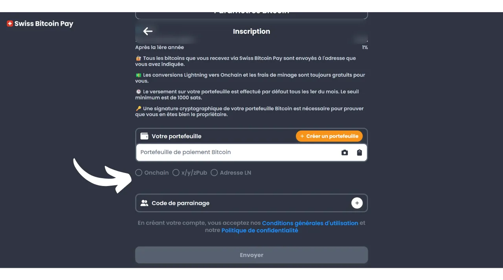
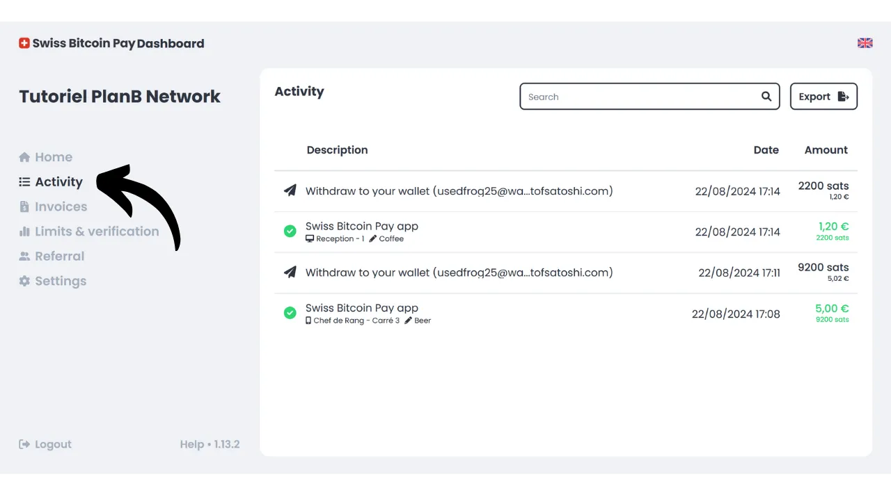
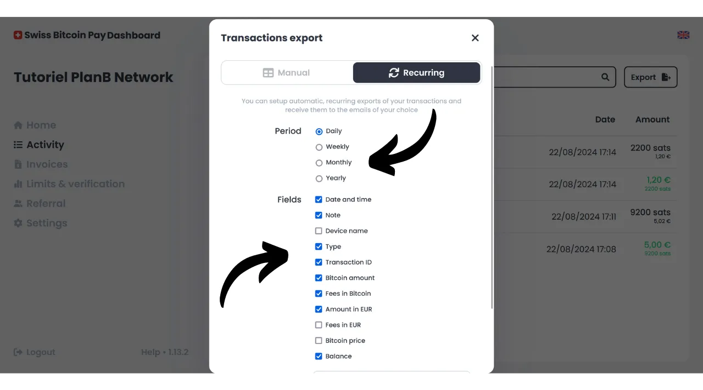

Oggi, esistono numerose soluzioni per i commercianti che desiderano accettare Bitcoin come metodo di pagamento. Per le piccole entità alla ricerca di una configurazione informale, installare un hot wallet, o addirittura un Lightning wallet, è sufficiente per ricevere pagamenti direttamente su di esso. Le aziende più grandi, che necessitano di mantenere registrazioni contabili, dovrebbero invece optare per un sistema di elaborazione dei pagamenti specializzato. Anche in questo ambito sono disponibili diverse opzioni.

Per coloro che preferiscono non avere pensieri e ricevere fondi in valuta fiat direttamente sul proprio conto bancario, sono disponibili soluzioni custodial come Open Node:

https://planb.network/tutorials/merchant/open-node

Per i commercianti pronti a sporcarsi le mani e che vogliono controllare completamente il processo, il software BTCPay Server rappresenta un'ottima opzione. Tuttavia, il principale svantaggio di BTCPay Server è che la sua configurazione e gestione richiedono tempo e necessitano di una certa competenza tecnica:

https://planb.network/tutorials/merchant/btcpay-server

Tra tutte queste soluzioni, Swiss Bitcoin Pay sembra essere un compromesso molto interessante che combina facilità d'uso, funzionalità e sicurezza. Questa soluzione è adatta sia per le piccolissime imprese che per le strutture più grandi. In questo tutorial, scoprirai come utilizzare facilmente Swiss Bitcoin Pay per accettare Bitcoin nella tua attività.

## Perché accettare Bitcoin nella tua attività?

Accettare Bitcoin come metodo di pagamento offre numerosi vantaggi per la tua attività. In primo luogo, Bitcoin funziona in qualche modo come il contante, ma senza gli svantaggi del denaro fisico. Come il contante, i Bitcoin ricevuti come pagamento non devono passare attraverso il circuito bancario tradizionale. Si tratta di una transazione diretta peer-to-peer dal tuo cliente a te stesso, a meno che tu non utilizzi un intermediario per il pagamento.

Inoltre, un pagamento in Bitcoin offre una finalità istantanea con Lightning e richiede solo pochi minuti nel caso di un pagamento onchain. Una volta confermato, non è possibile annullare un pagamento in Bitcoin. Se opti per l'autocustodia, controlli direttamente i tuoi Bitcoin, il che aumenta ulteriormente l'autonomia finanziaria della tua attività.

Con Bitcoin, realizzerai anche significativi risparmi su commissioni e spese bancarie. Utilizzare Bitcoin elimina la necessità di acquistare o noleggiare un terminale di pagamento; un computer o un semplice smartphone sono sufficienti. Inoltre, accettando pagamenti diretti in Bitcoin, eviti le commissioni solitamente addebitate sulle transazioni. Anche se passi attraverso un intermediario per l'elaborazione dei pagamenti, le commissioni associate alle transazioni Bitcoin sono generalmente molto più basse di quelle delle banche tradizionali.

Bitcoin condivide molti vantaggi con il contante, ma offre ancora più benefici come asset. Ad esempio, il numero totale di BTC è fissato per consenso a 21 milioni di unità, rendendolo un asset raro e resistente all'inflazione monetaria, a differenza delle valute statali. Accettando bitcoin nella tua attività, hai l'opportunità di preservare il valore della tua tesoreria a lungo termine e di diversificare gli asset della tua azienda.

Nella vita quotidiana, i pagamenti in bitcoin offrono più comodità e flessibilità rispetto al contante. Un vantaggio significativo è che non hai bisogno di dare il resto per un pagamento in bitcoin, il che elimina la necessità di gestire una cassa fisica. Inoltre, accettando bitcoin riduci la tua esposizione ai rischi di furti, scassinature e rapine. Inoltre, è una valuta che non può essere contraffatta, a differenza delle banconote.

Se hai una clientela internazionale, bitcoin ha il vantaggio di essere una valuta globale, eliminando così la necessità per i tuoi clienti di cambiare valuta.

Per le attività online, Bitcoin è anche un metodo efficace per accettare pagamenti a distanza in modo sicuro, senza dover passare attraverso i sistemi bancari tradizionali. Questo uso era infatti una delle intenzioni originali di Satoshi Nakamoto, l'inventore di Bitcoin, che lo descrisse come "*Un sistema di contante elettronico peer-to-peer*".
Infine, integrare Bitcoin nella propria attività può essere anche parte di una strategia di marketing. Accettare BTC può posizionare la tua azienda come innovativa, flessibile e adattata alle evoluzioni tecnologiche, aprendoti a un nuovo mercato. Secondo [uno studio di KPMG](https://kpmg.com/fr/fr/home/media/press-releases/2024/03/web3-crypto-actifs-adan.html), il 12% dei francesi possiede criptovalute, e la grande maggioranza di loro detiene bitcoin. Accettando questo mezzo di pagamento, puoi attrarre questa clientela che desidera spendere i suoi sats, che altrimenti potrebbe non aver mai frequentato la tua attività. È anche un buon modo per farsi conoscere dalla Generazione Z.
A mio parere, accettare bitcoin dovrebbe essere visto come un'opportunità a basso rischio che può avere un impatto positivo significativo sulla tua attività. Se l'esperienza si rivela infruttuosa, i costi sostenuti rimarranno minimi. Il costo principale risiede nel tempo necessario per configurare una soluzione per accettare BTC, ma come scoprirai in questo tutorial, è ora molto semplice e veloce da realizzare.

## Presentazione di Swiss Bitcoin Pay
Swiss Bitcoin Pay è una soluzione che consente ai commercianti di accettare pagamenti in Bitcoin in modo semplice. Integra un'applicazione PoS (*Point of Sale*) con un'interfaccia utente intuitiva, facile da usare per i tuoi dipendenti senza richiedere conoscenze tecniche approfondite. A differenza di un tradizionale portafoglio Bitcoin, l'applicazione Swiss Bitcoin Pay è destinata esclusivamente alla ricezione di pagamenti in Bitcoin, il che ti permette di affidare il dispositivo ai dipendenti senza rischi. Hai l'opzione di utilizzare più applicazioni PoS collegate allo stesso account Swiss Bitcoin Pay, facilitandone il dispiegamento sia su tablet, alla cassa, sia sugli smartphone dei tuoi dipendenti. L'applicazione Swiss Bitcoin Pay può essere installata su dispositivi Android e iOS, ed è disponibile anche in una versione web per computer.

Swiss Bitcoin Pay offre due opzioni per la gestione dei pagamenti: i fondi possono essere ritirati direttamente in Bitcoin a un indirizzo specifico o convertiti in valuta fiat e depositati su un conto bancario. Questa operazione è automatizzata e avviene ogni 24 ore. Così, non devi gestire manualmente i pagamenti in Bitcoin o quelli tramite la Lightning Network; Swiss Bitcoin Pay si occupa di tutto per te. Ogni giorno, riceverai il saldo dei pagamenti nel tuo portafoglio personale o conto bancario, secondo la tua preferenza. Sebbene non sia una soluzione completamente non custodial come quella offerta da BTCPay Server, per esempio, Swiss Bitcoin Pay rappresenta un interessante compromesso tra comodità e sicurezza, poiché l'intermediario detiene i tuoi incassi solo per 24 ore prima di trasferire i fondi a te. Inoltre, a differenza di altre soluzioni custodial, Swiss Bitcoin Pay non richiede alcuna verifica dell'identità (KYC) per la tua attività.

Le commissioni associate all'uso di Swiss Bitcoin Pay sono molto competitive: il primo anno, viene applicata una commissione dello 0,21% sulle transazioni. Successivamente, le commissioni sono dell'1% per i pagamenti mantenuti in Bitcoin e dell'1,5% per quelli convertiti in valuta fiat. Tuttavia, vale la pena notare che, in cambio, coprono il 100% delle commissioni di transazione Bitcoin per tutti i tuoi prelievi.

Swiss Bitcoin Pay si presenta quindi come un'interessante alternativa tra soluzioni completamente custodial e sistemi auto-ospitati più complessi come BTCPay Server. È un buon compromesso tra semplicità, sicurezza e autonomia finanziaria per il commerciante.

## Come creare un account Swiss Bitcoin Pay?

Visita [il sito ufficiale di Swiss Bitcoin Pay](https://swiss-bitcoin-pay.ch/).

Clicca sul pulsante "*Dashboard*".

Clicca sul pulsante "*Iscriviti*". 
Scegli un nome per il tuo account. Questo può essere il nome commerciale della tua attività (questo è il nome che apparirà nel portafoglio dei tuoi clienti nella loro cronologia delle transazioni).

Fornisci un indirizzo email.

Scegli una password forte per proteggere il tuo account.

Imposta la tua valuta locale.

Poi scegli come desideri ricevere i tuoi fondi regolando il cursore: 100% in bitcoin, 100% in valuta locale, o qualsiasi distribuzione di tua scelta tra i due.

Se scegli di ricevere i tuoi fondi tramite il sistema bancario in valuta locale, dovrai fornire i dettagli del tuo conto bancario. Se preferisci ricevere i tuoi fondi in bitcoin, diverse opzioni di ricezione sono disponibili per te.

L'opzione "*onchain*" ti permette di ricevere tutti i tuoi pagamenti su un unico indirizzo Bitcoin. Tuttavia, sconsiglio questa opzione, poiché porta al riutilizzo dello stesso indirizzo, il che può danneggiare notevolmente la tua privacy.

Se scegli di ricevere i tuoi pagamenti in bitcoin onchain, è preferibile utilizzare una chiave pubblica estesa con l'opzione "*x/y/zpub*". In questo modo, Swiss Bitcoin Pay può derivare un nuovo indirizzo inutilizzato per ogni prelievo.

Se prevedi un volume relativamente basso di pagamenti in bitcoin, puoi anche scegliere di ricevere i pagamenti direttamente tramite la Lightning Network. Per fare ciò, dovrai fornire un indirizzo Lightning. I tuoi fondi saranno trasferiti immediatamente dopo ogni pagamento, a differenza delle opzioni onchain che raggruppano tutte le ricevute in un unico pagamento giornaliero.

Ovviamente, questa scelta influisce solo sul metodo di pagamento di Swiss Bitcoin Pay alla tua attività. I tuoi clienti possono comunque pagarti tramite la Lightning Network o onchain, indipendentemente dall'opzione che selezioni qui.

Per questo tutorial, sceglierò di ricevere i miei pagamenti tramite Lightning. A scopo didattico e per preservare la riservatezza del mio vero nodo Lightning, utilizzerò un falso Wallet of Satoshi per i prelievi. Tuttavia, sconsiglio vivamente l'uso di un portafoglio Bitcoin custodial, sia per prelievi su LN che onchain.

Dovrai quindi pagare 1 sat per verificare il tuo indirizzo Lightning. Nel caso di un indirizzo bitcoin, dovrai fornire una firma con la chiave privata corrispondente a quell'indirizzo.

Infine, hai l'opzione di aggiungere un codice di riferimento. Se desideri sostenerci, puoi usare il codice "*DiscoverBitcoin*" in modo che una parte delle tue commissioni sia condivisa con noi. Grazie! :) 
Una volta inserite tutte le informazioni, clicca sul pulsante "*Invia*".

Ed ecco fatto! Il tuo account Swiss Bitcoin Pay è ora pronto. Ora puoi iniziare a ricevere pagamenti in Bitcoin per la tua attività!

Se lo desideri, puoi promuovere la tua attività cliccando sul link ricevuto via email.

## Come installare Swiss Bitcoin Pay PoS?
È già possibile accedere al processore di pagamento nella versione web sul seguente sito: https://app.swiss-bitcoin-pay.ch/

Se desideri utilizzare il PoS su uno smartphone o un tablet, hai due opzioni: installare l'app o utilizzare direttamente la versione web dal tuo browser. Per quest'ultima opzione, accedi al tuo dashboard effettuando il login su [il sito di Swiss Bitcoin Pay](https://dashboard.swiss-bitcoin-pay.ch/signin).

Poi, basta scansionare il codice QR presente sulla tua interfaccia con il dispositivo di tua scelta.

Se preferisci avere il PoS sotto forma di applicazione, vai sul tuo app store [Google Play Store](https://play.google.com/store/apps/details?id=ch.swissbitcoinpay.checkout) o [App Store](https://apps.apple.com/us/app/swiss-bitcoin-pay/id6444370155) e installa Swiss Bitcoin Pay. L'applicazione è disponibile anche direttamente in formato `.apk` sul loro sito web, o su [il negozio F-Droid](https://f-droid.org/packages/ch.swissbitcoinpay.checkout/).

Alla prima apertura, clicca sul pulsante "*Scansiona il codice QR di attivazione*".

Scansiona il codice QR presente sul tuo dashboard.

Ora sei connesso al sistema PoS come dipendente, il che significa che questa macchina è autorizzata solo a elaborare i pagamenti senza avere la possibilità di modificare le impostazioni del tuo account aziendale.

Se lo desideri, puoi cambiare il nome del PoS che appare durante i pagamenti nel tuo account amministratore. Puoi nominare il terminale secondo la sua specifica ubicazione (ad esempio, "*Bar Mezzanino*", "*Servizio Drive*", "*Capo Cameriere Piazza N. 3*", "*Assistente Stanza N. 2*", "*Cassa N. 7*", "*Terrazza*", "*Cassa Veloce*", "*Reception*", "*Concierge*", "*Spa/Wellness*...") o con il nome del dipendente che lo utilizza. Per fare ciò, clicca sul nome attuale del PoS situato sotto il nome dell'azienda nella parte superiore dello schermo. 
Nota il nuovo nome di questo processore di pagamento, poi clicca sul pulsante "*Invia*".

## Come effettuare un pagamento con Swiss Bitcoin Pay?

Per effettuare un pagamento, è molto semplice, una volta su un PoS, inserisci l'importo da incassare.

Nella casella "*Nota*", puoi annotare informazioni che saranno allegate al pagamento, specialmente nei tuoi rapporti. Ad esempio, puoi annotare il bene o il servizio venduto.

Poi clicca sul pulsante "*OK*".

Attendi qualche secondo affinché Swiss Bitcoin Pay crei la fattura Lightning e l'indirizzo di ricezione.

Il sistema PoS mostrerà quindi un codice QR unificato che permette ai tuoi clienti di effettuare il pagamento sia tramite la Lightning Network che onchain (è lo stesso codice QR per entrambi i metodi). Se il tuo dispositivo lo consente, il pagamento può essere effettuato anche tramite una Lightning card utilizzando la tecnologia NFC.
Una volta che la fattura è pagata, il PoS conferma il successo del pagamento.
Puoi anche trovare il pagamento e l'intera cronologia delle transazioni di questo specifico PoS cliccando sull'icona in alto a sinistra dello schermo.
Puoi trovare il pagamento che hai appena incassato.
Dato che avevo scelto l'opzione di prelevare i pagamenti tramite un indirizzo Lightning, posso vedere che i pagamenti al PoS della mia attività sono già arrivati nel mio portafoglio LN.
## Come gestire la tua attività con Swiss Bitcoin Pay?

Per gestire la tua attività in modo più preciso, tutto avviene sul tuo cruscotto. Visita [il sito ufficiale di Swiss Bitcoin Pay](https://swiss-bitcoin-pay.ch/).
Clicca in alto a destra dello schermo sul pulsante "*Dashboard*", quindi inserisci il tuo indirizzo email e la tua password.  Arriverai quindi a questa interfaccia.  Nella scheda "*Home*", puoi vedere il saldo dei pagamenti in attesa di prelievo così come le ultime attività del tuo account.  Nella scheda "*Attività*", puoi consultare i dettagli di tutte le tue transazioni.  Ad esempio, sul mio dashboard, posso vedere che il PoS "*Chef de Rang - Carré 3*" ha incassato una birra per 5€ il 22/08/2024 alle 17:08.  Posso anche vedere che la reception ha incassato un caffè.  Infine, posso vedere tutte le transazioni di prelievo verso il mio personale wallet Lightning.  Per impostare l'esportazione dei rapporti, clicca sul pulsante "*Esporta*".  Nella scheda "*Manuale*", puoi fare un'esportazione una tantum delle tue transazioni. Scegli semplicemente un periodo, poi seleziona le informazioni che vuoi includere nel tuo rapporto.  Poi clicca sul pulsante "*Esporta*" per scaricare un file `.csv` delle tue transazioni.  Nella scheda "*Ricorrente*", puoi programmare esportazioni automatiche ricorrenti. Seleziona la frequenza di generazione dell'esportazione e seleziona le informazioni che vuoi includere nel rapporto.  Infine, inserisci l'indirizzo email dove verrà inviato il rapporto. Ad esempio, puoi inserire direttamente l'indirizzo email del tuo contabile. Clicca sul pulsante "*Salva*" per salvare questa esportazione programmata.  La scheda delle fatture ti permette di generare una fattura per un pagamento una tantum.  Nella scheda "*Limiti & verifica*", puoi consultare i tuoi limiti di incasso giornalieri e annuali. Hai anche l'opzione di effettuare una verifica dell'identità per sbloccare limiti più alti.  La scheda "*Referral*" ti permette di gestire tutto ciò che è relativo alla sponsorizzazione. Infine, nella scheda "*Impostazioni*", hai l'opzione di modificare le informazioni fornite durante la registrazione, inclusi i metodi di prelievo e la distribuzione tra bitcoin e valuta fiat. 
Congratulazioni! Hai ora impostato un sistema di processore di pagamento per accettare bitcoin nella tua attività. Se vuoi anche esplorare BTCPay Server, una soluzione più avanzata e complessa, ti consiglio di seguire il nostro corso completo specificamente dedicato a questo software: [BTC305](https://planb.network/courses/btc305).