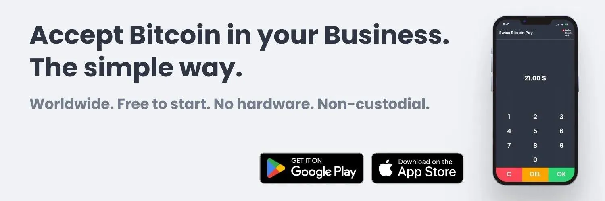
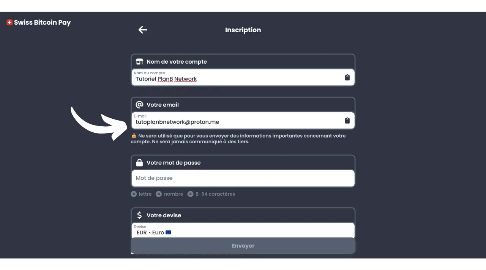
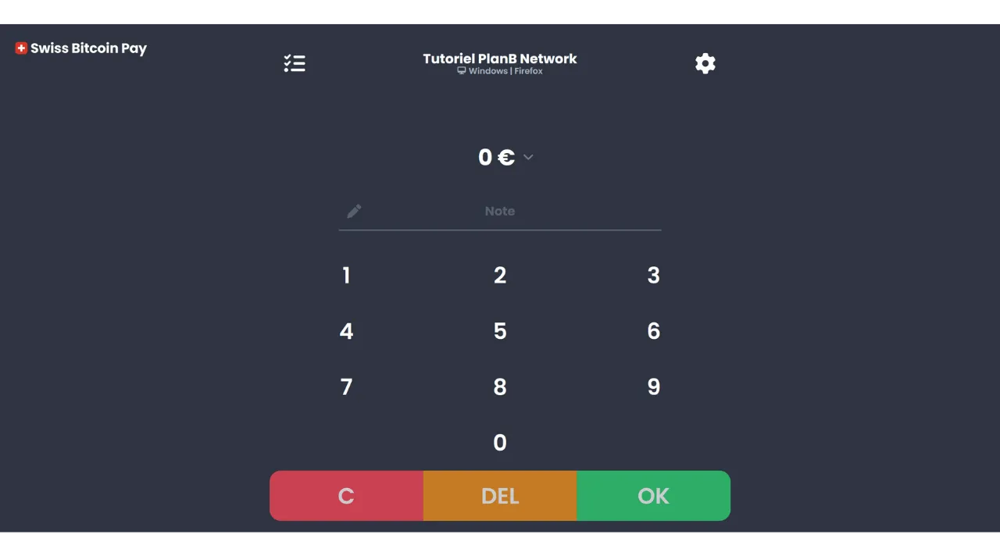
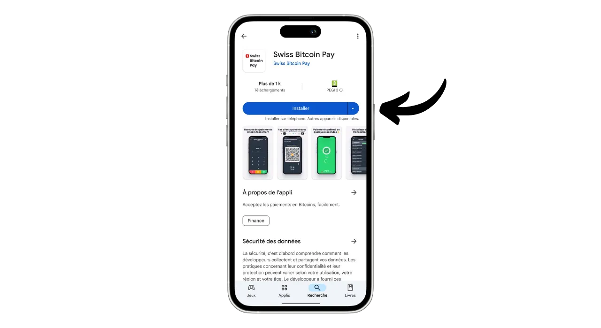
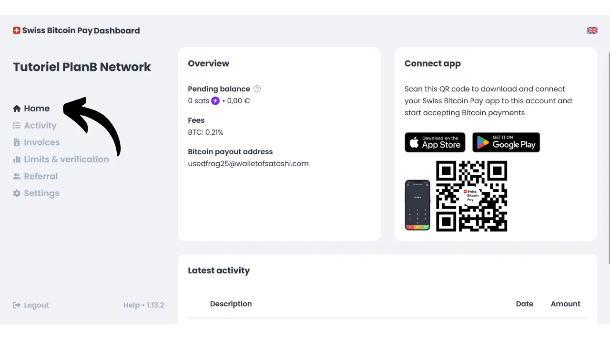
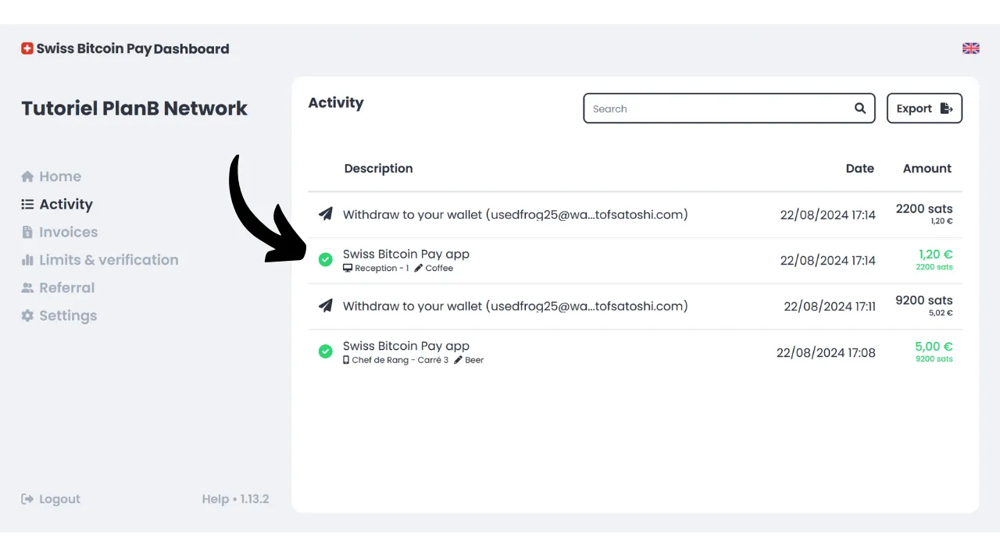
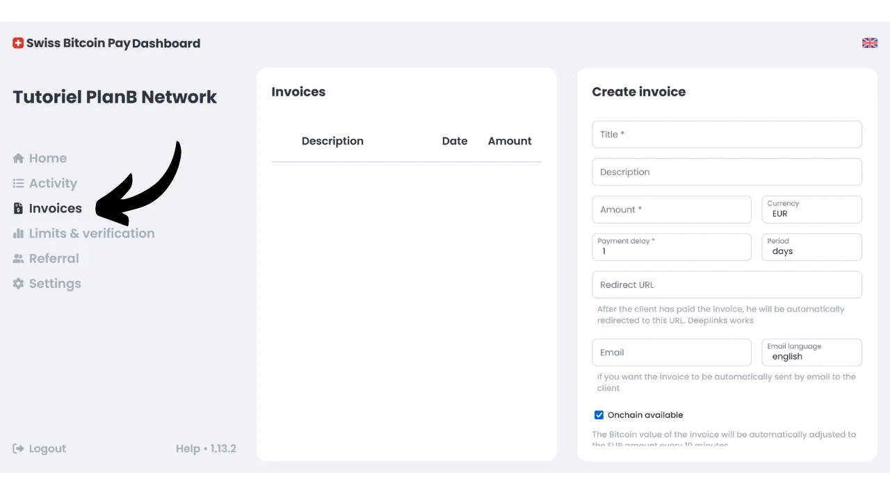

今日、ビットコインを支払い方法として受け入れたい商人には、数多くの解決策が存在します。非公式なセットアップを探している小規模な事業体にとっては、ホットウォレットやライトニングウォレットをインストールするだけで、直接それに支払いを受け取ることができます。会計記録を維持する必要がある大規模なビジネスは、専門の支払い処理システムを選択すべきです。この分野でもいくつかのオプションが利用可能です。

銀行口座に直接フィアット通貨で資金を受け取りたいと考える人々のために、Open Nodeのようなカストディアンソリューションが利用可能です：

https://planb.network/tutorials/merchant/open-node

プロセスを完全にコントロールしたいと考え、手を汚す準備ができている商人にとって、BTCPay Serverソフトウェアは優れた選択肢です。しかし、BTCPay Serverの主な欠点は、そのセットアップと管理に時間がかかり、ある程度の技術的専門知識が必要であることです：

https://planb.network/tutorials/merchant/btcpay-server

これらすべての解決策の中で、Swiss Bitcoin Payは、使いやすさ、機能、セキュリティを組み合わせた非常に興味深い妥協案のようです。このソリューションは、非常に小規模なビジネスから大規模な構造まで、どちらにも適しています。このチュートリアルでは、ビジネスでビットコインを簡単に受け入れるためにSwiss Bitcoin Payをどのように使用するかを発見します。

## なぜビジネスでビットコインを受け入れるのか？

ビットコインを支払い方法として受け入れることは、ビジネスに多くの利点をもたらします。まず、ビットコインは現金のように機能しますが、物理的なお金の不利な点はありません。現金のように、ビットコインでの支払いは従来の銀行回路を通過する必要がありません。これは、支払い仲介者を使用しない限り、クライアントからあなた自身への直接のピアツーピアトランザクションです。

さらに、ビットコイン支払いはLightningで即時の確定性を提供し、オンチェーン支払いの場合は数分しかかかりません。一度確認されると、ビットコイン支払いをキャンセルすることは不可能です。自己管理を選択した場合、直接ビットコインをコントロールすることで、ビジネスの財務自立性をさらに高めます。

ビットコインを使用すると、手数料や銀行手数料に関して大幅な節約が実現します。ビットコインを使用することで、支払い端末の購入やレンタルの必要がなくなります。コンピュータやシンプルなスマートフォンがあれば十分です。さらに、直接ビットコイン支払いを受け入れることで、通常トランザクションに課される手数料を避けることができます。支払い処理のために仲介者を通す場合でも、ビットコイントランザクションに関連する手数料は、通常の銀行のそれよりもはるかに低いことが一般的です。
ビットコインは現金と多くの利点を共有していますが、資産としてさらに多くの利点を提供します。たとえば、BTCの総数はコンセンサスによって2100万単位に固定されており、国家通貨とは異なり、通貨インフレに対して耐性がある希少資産です。ビジネスでビットコインを受け入れることで、長期的に財務の価値を保持し、会社の資産を多様化する機会を得ることができます。

日常的には、ビットコイン支払いは現金よりも便利で柔軟性があります。ビットコイン支払いにはお釣りを渡す必要がないという大きな利点があり、物理的なレジを管理する必要がなくなります。さらに、ビットコインを受け入れることで、盗難、強盗、強奪のリスクへの露出を減らします。また、銀行券とは異なり、偽造することができない通貨です。

国際的な顧客層を持つ場合、ビットコインはグローバル通貨であるため、顧客が通貨を交換する必要がないという利点があります。

オンラインビジネスの場合、ビットコインは、従来の銀行システムを介さずに、遠隔地から安全に支払いを受け入れる効果的な方法です。この使用は、ビットコインの発明者であるサトシ・ナカモトが「*ピアツーピアの電子現金システム*」として記述した、ビットコインの元々の意図の一つでした。
ビジネスにビットコインを統合することは、マーケティング戦略の一部としても有効です。BTCを受け入れることで、企業を革新的で柔軟、技術進化に適応したものとして位置づけることができ、新しい市場への扉を開きます。[KPMGの研究](https://kpmg.com/fr/fr/home/media/press-releases/2024/03/web3-crypto-actifs-adan.html)によると、フランス人の12%が暗号通貨を所有しており、その大多数がビットコインを保有しています。この支払い手段を受け入れることで、そうでなければあなたのビジネスを利用することがなかったかもしれない、彼らのサトシを使いたいと願う顧客層を引き付けることができます。また、Z世代に自社を知ってもらう良い方法でもあります。
私の意見では、ビットコインを受け入れることは、ビジネスに大きなプラスの影響を与える可能性のある低リスクの機会と見なすべきです。もし経験が成功しなかったとしても、発生するコストは最小限に留まります。主なコストはBTCを受け入れるためのソリューションを設定するのに必要な時間にありますが、このチュートリアルで発見するように、それは今や非常にシンプルで迅速に達成できます。

## Swiss Bitcoin Payの紹介
Swiss Bitcoin Payは、商人がビットコイン支払いを直接受け入れることを可能にするソリューションです。直感的なユーザーインターフェースを備えたPoS（*Point of Sale*）アプリケーションを統合し、従業員が深い技術知識を必要とせずに使用できます。従来のビットコインウォレットとは異なり、Swiss Bitcoin Payアプリケーションはビットコイン支払いを受け取るためだけに意図されており、従業員にデバイスをリスクなしで委託することができます。同じSwiss Bitcoin Payアカウントに接続された複数のPoSアプリケーションを使用するオプションがあり、タブレット、レジスター、または従業員のスマートフォンでの展開を容易にします。Swiss Bitcoin PayアプリケーションはAndroidおよびiOSデバイスにインストールでき、コンピューター用のウェブバージョンも利用可能です。

Swiss Bitcoin Payは支払いの管理に2つのオプションを提供します：資金は特定のアドレスに直接ビットコインで引き出すか、法定通貨に変換して銀行口座に預け入れることができます。この操作は自動化され、24時間ごとに毎日行われます。したがって、ビットコイン支払いやライトニングネットワーク経由の支払いを手動で管理する必要はありません。Swiss Bitcoin Payがすべてを代行します。毎日、個人のウォレットまたは銀行口座に支払いの残高が送られます。BTCPay Serverなどが提供する100%非カストディアルソリューションではありませんが、Swiss Bitcoin Payは、中間者が資金を24時間保持した後にあなたに資金を転送するため、利便性とセキュリティの間の興味深い妥協点を表しています。さらに、他のカストディアルソリューションとは異なり、Swiss Bitcoin Payはビジネスのための身元確認（KYC）を必要としません。

Swiss Bitcoin Payを使用する際の手数料は非常に競争力があります：最初の年は、取引に対して0.21%の手数料が適用されます。その後、ビットコインで保持される支払いには1%、法定通貨に変換される支払いには1.5%の手数料がかかります。しかし、引き出しにかかるすべてのビットコイン取引手数料を100%カバーするという点で、それは価値があると言えます。

Swiss Bitcoin Payは、完全にカストディアルなソリューションとBTCPay Serverのようなより複雑な自己ホストシステムの間の興味深い代替案として提示されます。商人にとって、シンプルさ、セキュリティ、および財務的自立の良い妥協点です。

## Swiss Bitcoin Payアカウントの作成方法？

[公式Swiss Bitcoin Payウェブサイト](https://swiss-bitcoin-pay.ch/)を訪問してください。

"*Dashboard*"ボタンをクリックします。

"*サインアップ*" ボタンをクリックしてください。
アカウントに名前を選んでください。これはあなたのビジネスの商標名にすることができます（これは、取引履歴の中でお客様のポートフォリオに表示される名前になります）。

メールアドレスを提供してください。

アカウントを保護するための強力なパスワードを選んでください。

ローカル通貨を設定してください。

次に、スライダーを調整して資金の受け取り方を選択してください：ビットコインで100%、ローカル通貨で100%、またはその二つの間でお好みの分配。

ローカル通貨で銀行システムを通じて資金を受け取る場合は、銀行口座の詳細を提供する必要があります。ビットコインで資金を受け取りたい場合は、いくつかの受け取りオプションがあります。

"*onchain*" オプションを選択すると、すべての支払いを単一のビットコインアドレスで受け取ることができます。しかし、同じアドレスの再利用につながるため、このオプションはプライバシーに大きな害を及ぼす可能性があるため、お勧めしません。

ビットコインの支払いをonchainで受け取る場合は、"*x/y/zpub*" オプションを使用して拡張公開キーを使用することが望ましいです。この方法では、Swiss Bitcoin Payは引き出しのたびに新しい、未使用のアドレスを導出することができます。

ビットコイン支払いのボリュームが比較的低いと予想される場合は、Lightning Networkを直接通じて支払いを受け取ることも選択できます。これを行うには、Lightningアドレスを提供する必要があります。資金は各支払いの直後に転送され、onchainオプションがすべての領収書を単一の日次支払いにまとめるのとは異なります。

もちろん、この選択はSwiss Bitcoin Payによるあなたのビジネスへの支払い方法にのみ影響します。お客様は、ここで選択したオプションに関係なく、Lightning Networkまたはonchainを通じてあなたに支払うことができます。

このチュートリアルでは、私の支払いをLightning経由で受け取ることを選択します。教育目的と私の実際のLightningノードの機密性を保持するために、引き出しに偽のWallet of Satoshiを使用します。しかし、LN上またはonchainでの引き出しにかかわらず、カストディアンのビットコインウォレットの使用は強くお勧めしません。

次に、Lightningアドレスを検証するために1 satを支払う必要があります。ビットコインアドレスの場合は、そのアドレスに対応する秘密キーで署名を提供する必要があります。

最後に、紹介コードを追加するオプションがあります。私たちをサポートしたい場合は、"*DiscoverBitcoin*" コードを使用してください。そうすることで、あなたの手数料の一部が私たちと共有されます。ありがとうございます！:)
すべての情報を入力したら、"*送信*" ボタンをクリックしてください。

これで完了です！あなたのSwiss Bitcoin Payアカウントは今、準備ができています。これで、ビジネスのためにビットコインの支払いを受け取り始めることができます！

ご希望であれば、メールで受け取ったリンクをクリックして、ビジネスを宣伝することができます。

## Swiss Bitcoin Pay PoSのインストール方法は？
すでに以下のサイトでウェブバージョンの支払いプロセッサにアクセスできます：https://app.swiss-bitcoin-pay.ch/

スマートフォンやタブレットでPoSを使用したい場合は、アプリをインストールするか、ブラウザから直接ウェブバージョンを使用するかの2つのオプションがあります。後者のオプションについては、[Swiss Bitcoin Payサイト](https://dashboard.swiss-bitcoin-pay.ch/signin)でログインしてダッシュボードにアクセスします。

その後、選択したデバイスでインターフェース上に表示されるQRコードをスキャンするだけです。

アプリケーションの形式でPoSを持ちたい場合は、アプリストア[Google Play Store](https://play.google.com/store/apps/details?id=ch.swissbitcoinpay.checkout)または[App Store](https://apps.apple.com/us/app/swiss-bitcoin-pay/id6444370155)にアクセスしてSwiss Bitcoin Payをインストールします。アプリケーションは、彼らのウェブサイト上で直接`.apk`形式でも、または[F-Droidストア](https://f-droid.org/packages/ch.swissbitcoinpay.checkout/)で入手可能です。

初めて開いたときには、"*Scan the activation QR code*"ボタンをクリックします。

ダッシュボードに表示されるQRコードをスキャンします。

これで、従業員としてPoSシステムに接続されました。これは、この機械がビジネスアカウントの設定を変更する権限なく支払いを処理することのみを許可されていることを意味します。

希望があれば、チェックアウト時に表示されるPoSの名前を管理アカウントで変更できます。端末を特定の場所（例えば、"*バーメザニン*"、"*サービスドライブ*"、"*ヘッドウェイタースクエアNo. 3*"、"*ルームアシスタントNo. 2*"、"*キャッシュレジスターNo. 7*"、"*テラス*"、"*エクスプレスチェックアウト*"、"*レセプション*"、"*コンシェルジュ*"、"*スパ/ウェルネス*...）や、それを使用する従業員の名前で命名できます。これを行うには、画面上部の会社名の下にあるPoSの現在の名前をクリックします。 
この支払いプロセッサの新しい名前をメモして、"*Send*"ボタンをクリックします。

## Swiss Bitcoin Payでのチェックアウト方法は？

チェックアウトは非常に簡単です。PoSにいるときに、現金化する金額を入力します。

"*Note*"ボックスには、特にレポートに添付される支払いに関する情報をメモできます。例えば、販売された商品やサービスをメモできます。

その後、"*OK*"ボタンをクリックします。

Swiss Bitcoin PayがLightning請求書と受信アドレスを作成するのを数秒待ちます。

PoSシステムは、お客様がLightning Networkまたはオンチェーン（どちらの方法でも同じQRコード）を通じて支払いを行うことができる統一されたQRコードを表示します。お使いのデバイスが対応していれば、NFC技術を使用したLightningカードを介して支払いを行うことも可能です。

請求書が支払われると、PoSは支払いの成功を確認します。

画面の左上にあるアイコンをクリックすることで、この特定のPoSの支払いと全ての取引履歴を確認することができます。

先ほど受け取った支払いを確認できます。

私がLightningアドレスを介して支払いを引き出すオプションを選択していたので、私のビジネスのPoSでの支払いがすでに私のLNウォレットに到着していることがわかります。

## Swiss Bitcoin Payでビジネスを管理する方法は？

ビジネスをより正確に管理するためには、すべてがダッシュボード上で行われます。[公式Swiss Bitcoin Payウェブサイト](https://swiss-bitcoin-pay.ch/)を訪れてください。

画面の右上にある「*Dashboard*」ボタンをクリックし、メールアドレスとパスワードを入力してください。 すると、このインターフェースに到着します。 「*Home*」タブでは、引き出し保留中の支払い残高とアカウントの最新活動を確認できます。 「*Activity*」タブでは、すべての取引の詳細を確認できます。 例えば、私のダッシュボードでは、PoS「*Chef de Rang - Carré 3*」が2024年8月22日17:08に5ユーロでビールを収集したことがわかります。 また、フロントがコーヒーを収集したこともわかります。 最後に、個人のLightningウォレットへのすべての引き出し取引を確認できます。 レポートのエクスポートを設定するには、「*Export*」ボタンをクリックします。 「*Manual*」タブでは、取引を一度だけエクスポートできます。期間を選択し、レポートに含めたい情報を選択してください。 次に、「*Export*」ボタンをクリックして、取引の`.csv`ファイルをダウンロードします。 「*Recurring*」タブでは、自動的に繰り返しエクスポートをスケジュールできます。エクスポート生成の頻度を選択し、レポートに含めたい情報を選択してください。 最後に、レポートが送信されるメールアドレスを入力します。例えば、直接会計士のメールアドレスを入力できます。「*Save*」ボタンをクリックして、このスケジュールされたエクスポートを保存します。 請求書タブでは、一回限りの支払いのための請求書を生成できます。 「*Limits & verification*」タブでは、日次および年間の収集限度額を確認できます。また、より高い限度額を解除するために身元確認を行うオプションもあります。 「*Referral*」タブでは、スポンサーシップに関連するすべてを管理できます。最後に、「*Settings*」タブでは、登録時に提供した情報、引き出し方法、ビットコインと法定通貨の分配を変更するオプションがあります。
おめでとうございます！これで、ビジネスでビットコインを受け入れるための支払いプロセッサーシステムの設定が完了しました。もしBTCPay Serverのような、より高度で複雑なソリューションを探求したい場合は、このソフトウェアに特化した完全なトレーニングを受講することをお勧めします：[BTC305](https://planb.network/courses/btc305).