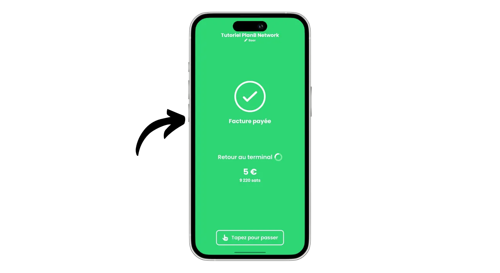
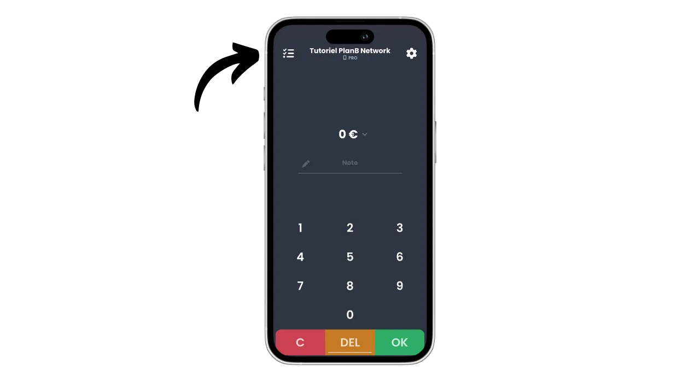
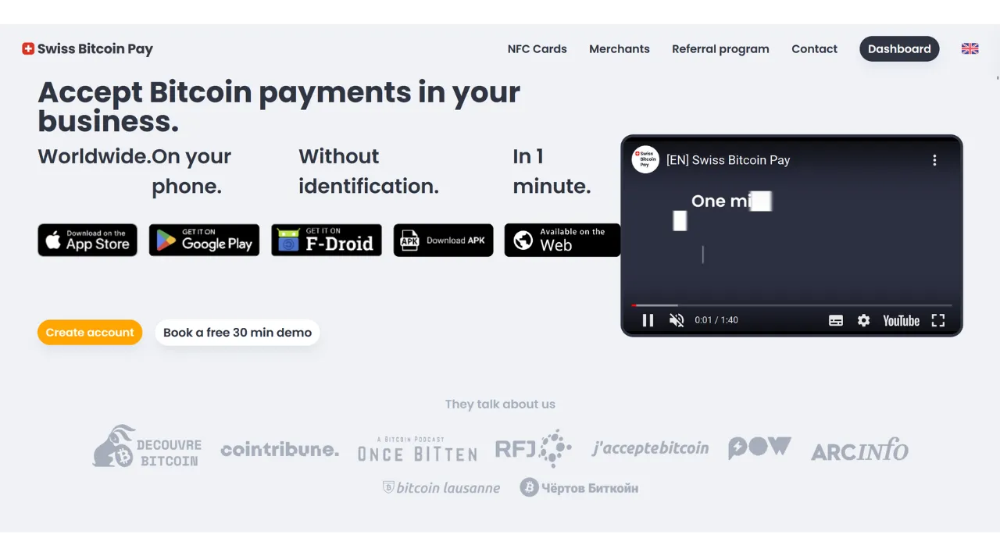
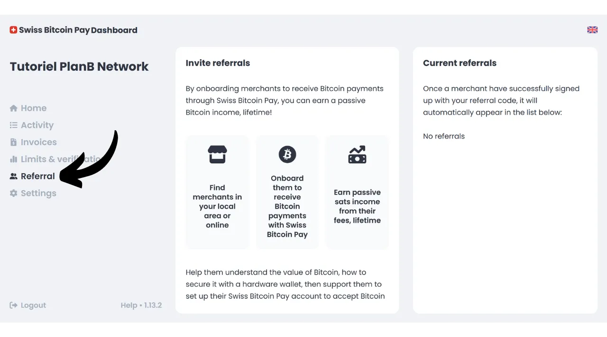

Hoje, existem inúmeras soluções para comerciantes que desejam aceitar Bitcoin como método de pagamento. Para pequenas entidades que procuram uma configuração informal, instalar uma carteira quente (hot wallet) ou até mesmo uma carteira Lightning é suficiente para receber pagamentos diretamente nela. Empresas maiores, que precisam manter registros contábeis, devem optar por um sistema de processamento de pagamentos especializado. Várias opções também estão disponíveis nesta área.

Para aqueles que preferem não se incomodar e receber fundos em moeda fiduciária diretamente em sua conta bancária, soluções de custódia como Open Node estão disponíveis:

https://planb.network/tutorials/merchant/open-node

Para comerciantes prontos para se envolverem diretamente e que querem controlar totalmente o processo, o software BTCPay Server é uma excelente opção. No entanto, a principal desvantagem do BTCPay Server é que sua configuração e gestão demandam tempo e requerem algum conhecimento técnico:

https://planb.network/tutorials/merchant/btcpay-server

Entre todas essas soluções, o Swiss Bitcoin Pay parece ser um compromisso muito interessante que combina facilidade de uso, recursos e segurança. Esta solução é adequada tanto para empresas muito pequenas quanto para estruturas maiores. Neste tutorial, você descobrirá como usar facilmente o Swiss Bitcoin Pay para aceitar Bitcoin em seu negócio.

## Por que aceitar Bitcoin em seu negócio?

Aceitar Bitcoin como método de pagamento oferece inúmeras vantagens para o seu negócio. Primeiramente, o Bitcoin funciona de forma semelhante ao dinheiro em espécie, mas sem as desvantagens do dinheiro físico. Como o dinheiro em espécie, os Bitcoins recebidos como pagamento não precisam passar pelo circuito bancário tradicional. É uma transação direta de peer-to-peer do seu cliente para você, a menos que você use um intermediário de pagamento.

Além disso, um pagamento em Bitcoin oferece finalidade instantânea com Lightning e leva apenas alguns minutos no caso de um pagamento onchain. Uma vez confirmado, não é possível cancelar um pagamento em Bitcoin. Se você optar pela auto-custódia, você controla diretamente seus Bitcoins, o que aumenta ainda mais a autonomia financeira do seu negócio.

Com o Bitcoin, você também realizará economias significativas em comissões e taxas bancárias. Usar Bitcoin elimina a necessidade de comprar ou alugar um terminal de pagamento; um computador ou um simples smartphone são suficientes. Além disso, ao aceitar pagamentos diretos em Bitcoin, você evita as comissões geralmente cobradas em transações. Mesmo que você passe por um intermediário para o processamento de pagamentos, as taxas associadas às transações em Bitcoin são geralmente muito mais baixas do que as dos bancos tradicionais.
O Bitcoin compartilha muitas vantagens com o dinheiro em espécie, mas oferece ainda mais benefícios como um ativo. Por exemplo, o número total de BTC é fixado por consenso em 21 milhões de unidades, tornando-o um ativo raro e resistente à inflação monetária, ao contrário das moedas estatais. Ao aceitar bitcoin em seu negócio, você tem a oportunidade de preservar o valor do seu tesouro a longo prazo e diversificar os ativos da sua empresa.

No dia a dia, os pagamentos em bitcoin oferecem mais conveniência e flexibilidade do que o dinheiro em espécie. Uma vantagem significativa é que você não precisa dar troco para um pagamento em bitcoin, o que elimina a necessidade de gerenciar um caixa físico. Além disso, aceitar bitcoins reduz sua exposição aos riscos de furtos, arrombamentos e roubos. Também é uma moeda que não pode ser falsificada, ao contrário das cédulas.

Se você tem uma clientela internacional, o bitcoin tem a vantagem de ser uma moeda global, eliminando a necessidade de seus clientes trocarem moedas.

Para negócios online, o Bitcoin também é um método eficaz para aceitar pagamentos remotos de forma segura, sem ter que passar pelos sistemas bancários tradicionais. Este uso foi de fato uma das intenções originais de Satoshi Nakamoto, o inventor do Bitcoin, que o descreveu como "*Um sistema de dinheiro eletrônico peer-to-peer*".
Finalmente, integrar o Bitcoin ao seu negócio também pode ser parte de uma estratégia de marketing. Aceitar BTC pode posicionar sua empresa como inovadora, flexível e adaptada às evoluções tecnológicas, ao mesmo tempo que abre portas para um novo mercado. De acordo com [um estudo da KPMG](https://kpmg.com/fr/fr/home/media/press-releases/2024/03/web3-crypto-actifs-adan.html), 12% dos franceses possuem criptomoedas, e a grande maioria delas possui bitcoin. Ao aceitar este meio de pagamento, você pode atrair essa clientela que deseja gastar seus sats, que de outra forma talvez nunca frequentasse o seu negócio. Também é uma boa maneira de se tornar conhecido pela Geração Z.
Na minha opinião, aceitar bitcoin deve ser visto como uma oportunidade de baixo risco que pode ter um impacto positivo significativo no seu negócio. Se a experiência provar ser malsucedida, os custos incorridos permanecerão mínimos. O principal custo reside no tempo necessário para configurar uma solução para aceitar BTC, mas como você descobrirá neste tutorial, agora é muito simples e rápido de realizar.

## Apresentação do Swiss Bitcoin Pay
Swiss Bitcoin Pay é uma solução que permite aos comerciantes aceitar pagamentos em Bitcoin de maneira direta. Integra um aplicativo PoS (*Ponto de Venda*) com uma interface de usuário intuitiva, fácil para seus funcionários usarem sem necessitar de conhecimento técnico aprofundado. Diferente de uma carteira Bitcoin tradicional, o aplicativo Swiss Bitcoin Pay é destinado exclusivamente para receber pagamentos em Bitcoin, o que permite que você confie o dispositivo aos funcionários sem riscos. Você tem a opção de usar múltiplos aplicativos PoS conectados à mesma conta Swiss Bitcoin Pay, facilitando sua implantação seja em um tablet, no caixa ou nos smartphones de seus funcionários. O aplicativo Swiss Bitcoin Pay pode ser instalado em dispositivos Android e iOS, e também está disponível em uma versão web para computadores.

Swiss Bitcoin Pay oferece duas opções para gerenciar pagamentos: os fundos podem ser retirados diretamente em Bitcoin para um endereço específico ou convertidos em moeda fiduciária e depositados em uma conta bancária. Esta operação é automatizada e ocorre diariamente a cada 24 horas. Assim, você não precisa gerenciar manualmente os pagamentos em Bitcoin ou aqueles via Lightning Network; Swiss Bitcoin Pay cuida de tudo para você. Todos os dias, você receberá o saldo dos pagamentos em sua carteira pessoal ou conta bancária, conforme sua preferência. Embora não seja uma solução 100% não custodial como a oferecida pelo BTCPay Server, por exemplo, Swiss Bitcoin Pay representa um compromisso interessante entre conveniência e segurança, já que o intermediário só mantém seus recebimentos por 24 horas antes de transferir os fundos para você. Além disso, diferente de outras soluções custodiais, Swiss Bitcoin Pay não exige qualquer verificação de identidade (KYC) para o seu negócio.

As taxas associadas ao uso do Swiss Bitcoin Pay são muito competitivas: no primeiro ano, uma comissão de 0,21% é aplicada às transações. Posteriormente, as taxas são de 1% para pagamentos mantidos em Bitcoin e 1,5% para aqueles convertidos em moeda fiduciária. No entanto, vale ressaltar que, em troca, eles cobrem 100% das taxas de transação Bitcoin para todos os seus saques.

Swiss Bitcoin Pay apresenta-se assim como uma alternativa interessante entre soluções totalmente custodiais e sistemas auto-hospedados mais complexos como o BTCPay Server. É um bom compromisso entre simplicidade, segurança e autonomia financeira para o comerciante.

## Como criar uma conta Swiss Bitcoin Pay?

Visite [o site oficial do Swiss Bitcoin Pay](https://swiss-bitcoin-pay.ch/).

Clique no botão "*Dashboard*".

Clique no botão "*Sign up*". 
Escolha um nome para a sua conta. Este pode ser o nome comercial do seu negócio (este é o nome que aparecerá no portfólio dos seus clientes no histórico de transações deles).

Forneça um endereço de email.

Escolha uma senha forte para proteger sua conta.

Defina a sua moeda local.

Em seguida, escolha como gostaria de receber seus fundos ajustando o controle deslizante: seja 100% em bitcoins, 100% em moeda local, ou qualquer distribuição de sua escolha entre os dois.

Se você escolher receber seus fundos através do sistema bancário em moeda local, precisará fornecer os detalhes da sua conta bancária. Se preferir receber seus fundos em bitcoins, várias opções de recebimento estão disponíveis para você.

A opção "*onchain*" permite que você receba todos os seus pagamentos em um único endereço Bitcoin. No entanto, aconselho contra esta opção, pois leva ao reuso do mesmo endereço, o que pode prejudicar muito a sua privacidade.

Se você escolher receber seus pagamentos em bitcoins onchain, é preferível usar uma chave pública estendida com a opção "*x/y/zpub*". Dessa forma, o Swiss Bitcoin Pay pode derivar um novo endereço não utilizado para cada retirada.

Se você antecipa um volume relativamente baixo de pagamentos em bitcoin, também pode optar por receber pagamentos diretamente via Lightning Network. Para fazer isso, você precisará fornecer um endereço Lightning. Seus fundos serão transferidos imediatamente após cada pagamento, ao contrário das opções onchain que agrupam todos os recibos em um único pagamento diário.

Obviamente, esta escolha afeta apenas o método de pagamento do Swiss Bitcoin Pay para o seu negócio. Seus clientes ainda podem pagar a você via Lightning Network ou onchain, independentemente da opção que você selecionar aqui.

Para este tutorial, escolherei receber meus pagamentos via Lightning. Para fins educacionais e para preservar a confidencialidade do meu verdadeiro nó Lightning, usarei uma falsa Wallet of Satoshi para retiradas. No entanto, aconselho fortemente contra o uso de uma carteira Bitcoin custodial, seja para retiradas no LN ou onchain.

Você precisará então pagar 1 sat para verificar seu endereço Lightning. No caso de um endereço bitcoin, você precisará fornecer uma assinatura com a chave privada correspondente a esse endereço.

Finalmente, você tem a opção de adicionar um código de referência. Se desejar nos apoiar, você pode usar o código "*DiscoverBitcoin*" para que uma parte das suas comissões seja compartilhada conosco. Obrigado! :)
Uma vez que todas as informações estejam preenchidas, clique no botão "*Send*".

E é isso! Sua conta no Swiss Bitcoin Pay está agora pronta. Você já pode começar a receber pagamentos em Bitcoin para o seu negócio!

Se desejar, você pode promover o seu negócio clicando no link recebido por email.

## Como instalar o Swiss Bitcoin Pay PoS?
Você já pode acessar o processador de pagamentos na versão web no seguinte site: https://app.swiss-bitcoin-pay.ch/

Se você deseja usar o PoS em um smartphone ou tablet, tem duas opções: instalar o aplicativo ou usar a versão web diretamente do seu navegador. Para a última opção, acesse seu painel de controle fazendo login em [o site do Swiss Bitcoin Pay](https://dashboard.swiss-bitcoin-pay.ch/signin).

Em seguida, basta escanear o código QR presente na sua interface com o dispositivo de sua escolha.

Se preferir ter o PoS em forma de aplicativo, vá até a sua loja de aplicativos [Google Play Store](https://play.google.com/store/apps/details?id=ch.swissbitcoinpay.checkout) ou [App Store](https://apps.apple.com/us/app/swiss-bitcoin-pay/id6444370155) e instale o Swiss Bitcoin Pay. O aplicativo também está disponível diretamente em formato `.apk` no site deles, ou na [loja F-Droid](https://f-droid.org/packages/ch.swissbitcoinpay.checkout/).

Ao abrir pela primeira vez, clique no botão "*Scan the activation QR code*".

Escanee o código QR presente no seu painel de controle.

Agora você está conectado ao sistema PoS como um funcionário, o que significa que esta máquina está autorizada apenas a processar pagamentos sem ter a capacidade de modificar as configurações da sua conta empresarial.

Se desejar, você pode alterar o nome do PoS que aparece durante os checkouts na sua conta administrativa. Você pode nomear o terminal de acordo com sua localização específica (por exemplo, "*Bar Mezzanine*", "*Service Drive*", "*Head Waiter Square No. 3*", "*Room Assistant No. 2*", "*Cash Register No. 7*", "*Terrace*", "*Express Checkout*", "*Reception*", "*Concierge*", "*Spa/Wellness*...") ou pelo nome do funcionário que o utiliza. Para fazer isso, clique no nome atual do PoS localizado abaixo do nome da empresa no topo da tela. 
Anote o novo nome deste processador de pagamentos, em seguida, clique no botão "*Send*".

## Como fazer checkout com o Swiss Bitcoin Pay?

Para fazer o checkout, é muito simples, uma vez em um PoS, insira o valor a ser recebido.

Na caixa "*Note*", você pode anotar informações que serão anexadas ao pagamento, especialmente nos seus relatórios. Por exemplo, você pode anotar o bem ou serviço vendido.

Em seguida, clique no botão "*OK*".

Aguarde alguns segundos para que o Swiss Bitcoin Pay crie a fatura Lightning e o endereço de recebimento.

O sistema PoS exibirá então um código QR unificado que permite aos seus clientes realizar o pagamento tanto via Rede Lightning quanto onchain (é o mesmo código QR para ambos os métodos). Se o seu dispositivo permitir, o pagamento também pode ser feito via um cartão Lightning usando a tecnologia NFC.

Uma vez que a fatura é paga, o PoS confirma o sucesso do pagamento.

Você também pode encontrar o pagamento e todo o histórico de transações deste PoS específico clicando no ícone no canto superior esquerdo da tela.

Você pode encontrar o pagamento que acabou de receber.

Como eu havia escolhido a opção de retirar pagamentos via um endereço Lightning, posso ver que os pagamentos no PoS do meu negócio já chegaram na minha carteira LN.

## Como gerenciar seu negócio com o Swiss Bitcoin Pay?

Para gerenciar seu negócio de forma mais precisa, tudo acontece no seu painel de controle. Visite [o site oficial do Swiss Bitcoin Pay](https://swiss-bitcoin-pay.ch/).

Clique no canto superior direito da tela no botão "*Dashboard*", em seguida, insira seu endereço de email e sua senha.  Você chegará então a esta interface.  Na aba "*Home*", você pode ver o saldo de pagamentos pendentes de retirada, bem como as últimas atividades da sua conta.  Na aba "*Activity*", você pode consultar os detalhes de todas as suas transações.  Por exemplo, no meu painel, posso ver que o PoS "*Chef de Rang - Carré 3*" coletou uma cerveja por €5 em 22/08/2024 às 17:08.  Também posso ver que a recepção coletou um café.  Finalmente, posso ver todas as transações de retirada para minha carteira Lightning pessoal.  Para configurar a exportação de relatórios, clique no botão "*Export*".  Na aba "*Manual*", você pode fazer uma exportação única das suas transações. Simplesmente escolha um período, e então selecione as informações que deseja incluir no seu relatório.  Depois clique no botão "*Export*" para baixar um arquivo `.csv` das suas transações.  Na aba "*Recurring*", você pode programar exportações automáticas recorrentes. Selecione a frequência de geração da exportação, e selecione as informações que deseja incluir no relatório.  Finalmente, insira o endereço de email para onde o relatório será enviado. Por exemplo, você pode inserir diretamente o endereço de email do seu contador. Clique no botão "*Save*" para salvar esta exportação programada.  A aba de faturas permite que você gere uma fatura para um pagamento único.  Na aba "*Limits & verification*", você pode consultar seus limites diários e anuais de coleta. Você também tem a opção de realizar uma verificação de identidade para desbloquear limites mais altos.  A aba "*Referral*" permite que você gerencie tudo relacionado a patrocínio.  Finalmente, na aba "*Settings*", você tem a opção de modificar as informações que forneceu durante o registro, incluindo métodos de retirada e a distribuição entre bitcoin e fiat. 
Parabéns! Você agora configurou um sistema de processamento de pagamentos para aceitar bitcoin no seu negócio. Se você também quiser explorar o BTCPay Server, uma solução mais avançada e complexa, recomendo que siga nosso treinamento completo especificamente dedicado a este software: [BTC305](https://planb.network/courses/btc305).