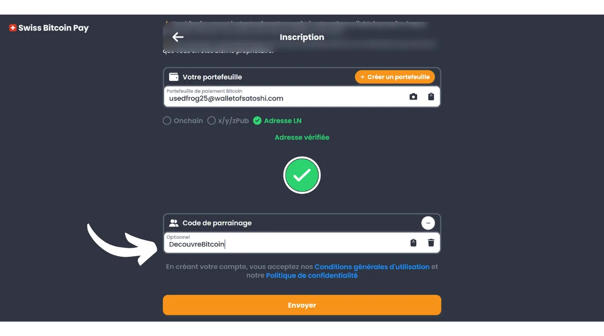
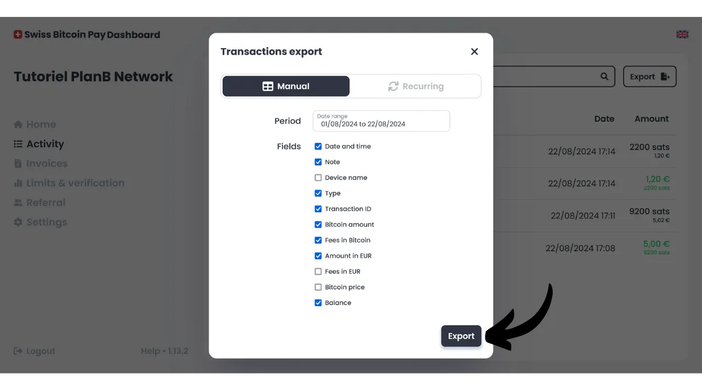

Сегодня существует множество решений для торговцев, желающих принимать Bitcoin в качестве способа оплаты. Для небольших субъектов, ищущих неформальную настройку, достаточно установить горячий кошелек или даже кошелек Lightning, чтобы прямо получать в него платежи. Большим бизнесам, которым необходимо вести бухгалтерский учет, следует выбрать специализированную систему обработки платежей. В этой области также доступно несколько вариантов.

Для тех, кто предпочитает не заморачиваться и получать средства в фиатной валюте прямо на свой банковский счет, доступны хранительские решения, такие как Open Node:

https://planb.network/tutorials/merchant/open-node

Для торговцев, готовых погрузиться в процесс и желающих полностью контролировать его, программное обеспечение BTCPay Server является отличным вариантом. Однако основным недостатком BTCPay Server является то, что его настройка и управление требуют времени и некоторых технических знаний:

https://planb.network/tutorials/merchant/btcpay-server

Среди всех этих решений Swiss Bitcoin Pay кажется очень интересным компромиссом, сочетающим простоту использования, функциональность и безопасность. Это решение подходит как для очень маленьких бизнесов, так и для крупных структур. В этом руководстве вы узнаете, как легко использовать Swiss Bitcoin Pay для приема Bitcoin в вашем бизнесе.

## Почему стоит принимать Bitcoin в вашем бизнесе?

Принятие Bitcoin в качестве способа оплаты предлагает множество преимуществ для вашего бизнеса. Во-первых, Bitcoin функционирует в некотором роде как наличные, но без недостатков физических денег. Как и наличные, полученные в качестве оплаты Bitcoin не нужно проходить через традиционный банковский круг. Это прямая транзакция между вами и вашим клиентом, если вы не используете платежного посредника.

Более того, платеж в Bitcoin предлагает мгновенную окончательность с Lightning и занимает всего несколько минут в случае onchain платежа. После подтверждения невозможно отменить платеж в Bitcoin. Если вы выбираете самохранение, вы напрямую контролируете свои Bitcoin, что дополнительно усиливает финансовую автономию вашего бизнеса.

С Bitcoin вы также сможете существенно сэкономить на комиссиях и банковских сборах. Использование Bitcoin исключает необходимость покупки или аренды платежного терминала; достаточно компьютера или простого смартфона. Кроме того, принимая прямые платежи в Bitcoin, вы избегаете комиссий, обычно взимаемых с транзакций. Даже если вы используете посредника для обработки платежей, сборы, связанные с транзакциями Bitcoin, обычно намного ниже, чем в традиционных банках.
Bitcoin имеет много преимуществ перед наличными, но предлагает еще больше выгод как актив. Например, общее количество BTC фиксировано консенсусом в 21 миллион единиц, что делает его редким активом и устойчивым к монетарной инфляции, в отличие от государственных валют. Принимая bitcoin в вашем бизнесе, вы имеете возможность сохранить ценность вашей казны в долгосрочной перспективе и диверсифицировать активы вашей компании.

В повседневной жизни платежи в bitcoin предлагают больше удобства и гибкости, чем наличные. Значительным преимуществом является то, что вам не нужно давать сдачу при платеже в bitcoin, что исключает необходимость управления физическим кассовым аппаратом. Кроме того, принимая bitcoin, вы снижаете свою подверженность рискам краж, взломов и ограблений. Также это валюта, которую нельзя подделать, в отличие от банкнот.

Если у вас есть международные клиенты, bitcoin имеет преимущество быть глобальной валютой, тем самым исключая необходимость для ваших клиентов обменивать валюты.

Для онлайн-бизнесов Bitcoin также является эффективным методом для безопасного приема удаленных платежей, без необходимости проходить через традиционные банковские системы. Это использование действительно было одним из первоначальных намерений Сатоши Накамото, изобретателя Bitcoin, который описал его как "*Систему электронных денег от одного лица к другому*".
Наконец, интеграция Bitcoin в ваш бизнес также может быть частью маркетинговой стратегии. Принятие BTC может позиционировать вашу компанию как инновационную, гибкую и адаптированную к технологическим эволюциям, одновременно открывая вас для нового рынка. Согласно [исследованию KPMG](https://kpmg.com/fr/fr/home/media/press-releases/2024/03/web3-crypto-actifs-adan.html), 12% французов владеют криптовалютами, и большинство из них держат биткойн. Принимая это средство платежа, вы можете привлечь эту клиентуру, которая желает тратить свои сатоши, которые иначе могли бы никогда не посетить ваш бизнес. Это также хороший способ заявить о себе для поколения Z.
На мой взгляд, принятие биткойна следует рассматривать как возможность с низким риском, которая может оказать значительное положительное влияние на ваш бизнес. Если опыт окажется неудачным, понесенные затраты останутся минимальными. Основная стоимость заключается во времени, необходимом для настройки решения для приема BTC, но, как вы увидите в этом руководстве, теперь это очень просто и быстро.

## Представление Swiss Bitcoin Pay
Swiss Bitcoin Pay - это решение, которое позволяет торговцам принимать платежи в Bitcoin простым способом. Оно интегрирует приложение PoS (*Точка продаж*) с интуитивно понятным пользовательским интерфейсом, легким в использовании для ваших сотрудников без необходимости глубоких технических знаний. В отличие от традиционного биткойн-кошелька, приложение Swiss Bitcoin Pay предназначено исключительно для приема платежей в биткойнах, что позволяет вам доверять устройство сотрудникам без рисков. У вас есть возможность использовать несколько приложений PoS, подключенных к одному аккаунту Swiss Bitcoin Pay, облегчая их развертывание, будь то на планшете, на кассе или на смартфонах ваших сотрудников. Приложение Swiss Bitcoin Pay можно установить на устройства Android и iOS, а также доступно в веб-версии для компьютеров.

Swiss Bitcoin Pay предлагает два варианта управления платежами: средства могут быть либо сняты напрямую в Bitcoin на конкретный адрес, либо конвертированы в фиатную валюту и внесены на банковский счет. Эта операция автоматизирована и происходит ежедневно каждые 24 часа. Таким образом, вам не нужно вручную управлять платежами в биткойнах или через Lightning Network; Swiss Bitcoin Pay заботится обо всем за вас. Каждый день вы будете получать баланс платежей на ваш личный кошелек или банковский счет, в зависимости от вашего предпочтения. Хотя это не 100% некастодиальное решение, как то, которое предлагает, например, BTCPay Server, Swiss Bitcoin Pay представляет собой интересный компромисс между удобством и безопасностью, поскольку посредник удерживает ваши квитанции только 24 часа перед переводом средств вам. Более того, в отличие от других кастодиальных решений, Swiss Bitcoin Pay не требует верификации личности (KYC) для вашего бизнеса.

Сборы, связанные с использованием Swiss Bitcoin Pay, очень конкурентоспособны: первый год применяется комиссия в размере 0.21% за транзакции. В последующем, сборы составляют 1% за платежи, сохраненные в Bitcoin, и 1.5% за те, которые конвертированы в фиатную валюту. Однако стоит отметить, что взамен они покрывают 100% комиссий за биткойн-транзакции за все ваши выводы.

Таким образом, Swiss Bitcoin Pay представляет собой интересную альтернативу между полностью кастодиальными решениями и более сложными самостоятельно размещаемыми системами, такими как BTCPay Server. Это хороший компромисс между простотой, безопасностью и финансовой автономией для торговца.

## Как создать аккаунт Swiss Bitcoin Pay?

Посетите [официальный сайт Swiss Bitcoin Pay](https://swiss-bitcoin-pay.ch/).

Нажмите на кнопку "*Dashboard*".

Нажмите на кнопку "*Зарегистрироваться*". 
Выберите имя для вашего аккаунта. Это может быть торговое название вашего бизнеса (именно это имя будет отображаться в портфеле ваших клиентов в их истории транзакций).

Укажите адрес электронной почты.

Выберите надежный пароль для защиты вашего аккаунта.

Установите вашу местную валюту.

Затем выберите, как вы хотели бы получать свои средства, регулируя ползунок: либо 100% в биткоинах, либо 100% в местной валюте, либо любое другое распределение между этими двумя вариантами по вашему выбору.

Если вы выберете получение средств через банковскую систему в местной валюте, вам нужно будет предоставить данные вашего банковского счета. Если вы предпочитаете получать средства в биткоинах, вам доступно несколько вариантов приема.

Вариант "*onchain*" позволяет получать все ваши платежи на один адрес биткоина. Однако, я не рекомендую этот вариант, так как это приводит к повторному использованию одного и того же адреса, что может сильно навредить вашей конфиденциальности.

Если вы выберете получение ваших платежей в биткоинах через onchain, предпочтительнее использовать расширенный публичный ключ с опцией "*x/y/zpub*". Таким образом, Swiss Bitcoin Pay сможет генерировать новый, неиспользованный адрес для каждого вывода средств.

Если вы ожидаете относительно небольшой объем платежей в биткоинах, вы также можете выбрать получение платежей напрямую через Lightning Network. Для этого вам нужно будет предоставить адрес Lightning. Ваши средства будут переведены немедленно после каждого платежа, в отличие от вариантов onchain, которые группируют все поступления в один ежедневный платеж.

Очевидно, что этот выбор влияет только на метод оплаты Swiss Bitcoin Pay вашему бизнесу. Ваши клиенты по-прежнему могут платить вам через Lightning Network или onchain, независимо от выбранного вами варианта.

Для этого учебного пособия я выберу получение моих платежей через Lightning. В учебных целях и для сохранения конфиденциальности моего реального узла Lightning, я буду использовать фиктивный кошелек Wallet of Satoshi для вывода средств. Однако, я настоятельно не рекомендую использовать хостинговый биткоин-кошелек, будь то для вывода средств через LN или onchain.

Затем вам нужно будет заплатить 1 сатоши для проверки вашего адреса Lightning. В случае биткоин-адреса, вам нужно будет предоставить подпись с приватным ключом, соответствующим этому адресу.

Наконец, у вас есть возможность добавить реферальный код. Если вы хотите поддержать нас, вы можете использовать код "*DiscoverBitcoin*", чтобы часть ваших комиссий делилась с нами. Спасибо! :) 
После заполнения всей информации нажмите на кнопку "*Отправить*".

Вот и все! Ваш аккаунт в Swiss Bitcoin Pay теперь готов. Теперь вы можете начать принимать платежи в биткоинах за ваш бизнес!

Если вы хотите, вы можете продвигать свой бизнес, нажав на ссылку, полученную по электронной почте.

## Как установить Swiss Bitcoin Pay PoS?
Вы уже можете получить доступ к платежному процессору в веб-версии на следующем сайте: https://app.swiss-bitcoin-pay.ch/

Если вы хотите использовать PoS на смартфоне или планшете, у вас есть два варианта: установить приложение или использовать веб-версию напрямую через ваш браузер. Для последнего варианта, войдите в свою панель управления, зайдя на [сайт Swiss Bitcoin Pay](https://dashboard.swiss-bitcoin-pay.ch/signin).

Затем просто отсканируйте QR-код, присутствующий на вашем интерфейсе, с помощью выбранного устройства.

Если вы предпочитаете иметь PoS в виде приложения, перейдите в магазин приложений [Google Play Store](https://play.google.com/store/apps/details?id=ch.swissbitcoinpay.checkout) или [App Store](https://apps.apple.com/us/app/swiss-bitcoin-pay/id6444370155) и установите Swiss Bitcoin Pay. Приложение также доступно напрямую в формате `.apk` на их веб-сайте или в [магазине F-Droid](https://f-droid.org/packages/ch.swissbitcoinpay.checkout/).

При первом открытии нажмите на кнопку "*Сканировать активационный QR-код*".

Отсканируйте QR-код, присутствующий на вашей панели управления.

Теперь вы подключены к системе PoS как сотрудник, что означает, что это устройство авторизовано только для обработки платежей без возможности изменения настроек вашего бизнес-аккаунта.

Если вы хотите, вы можете изменить название PoS, которое отображается во время оплаты в вашем административном аккаунте. Вы можете назвать терминал в соответствии с его конкретным местоположением (например, "*Бар Меццанин*", "*Сервисный Драйв*", "*Площадь Главного Официанта № 3*", "*Помощник в Комнате № 2*", "*Касса № 7*", "*Терраса*", "*Экспресс-Касса*", "*Рецепция*", "*Консьерж*", "*Спа/Велнес*...") или по имени сотрудника, который его использует. Для этого нажмите на текущее название PoS, расположенное под названием компании в верхней части экрана. 
Запишите новое название этого платежного процессора, затем нажмите на кнопку "*Отправить*".

## Как совершить оплату с помощью Swiss Bitcoin Pay?

Для совершения оплаты все очень просто, находясь на PoS, введите сумму к оплате.

В поле "*Примечание*" вы можете указать информацию, которая будет прикреплена к платежу, особенно в ваших отчетах. Например, вы можете указать проданный товар или услугу.

Затем нажмите на кнопку "*ОК*".

Подождите несколько секунд, пока Swiss Bitcoin Pay создаст счет Lightning и адрес получения.

Система PoS затем отобразит единый QR-код, который позволяет вашим клиентам совершать платежи как через Lightning Network, так и через блокчейн (это один и тот же QR-код для обоих методов). Если ваше устройство позволяет, платеж также может быть совершен с использованием карты Lightning по технологии NFC. 
После оплаты счета система PoS подтверждает успешность платежа.

Вы также можете найти платеж и всю историю транзакций этого конкретного PoS, нажав на иконку в верхнем левом углу экрана.

Вы можете найти только что проведенный вами платеж.

Поскольку я выбрал опцию вывода платежей через Lightning адрес, я вижу, что платежи в PoS моего бизнеса уже поступили в мой LN кошелек.

## Как управлять вашим бизнесом с Swiss Bitcoin Pay?

Для более точного управления вашим бизнесом все происходит в вашей панели управления. Посетите [официальный сайт Swiss Bitcoin Pay](https://swiss-bitcoin-pay.ch/).

Нажмите в верхнем правом углу экрана на кнопку "*Dashboard*", затем введите свой адрес электронной почты и пароль.  После этого вы попадете на этот интерфейс.  Во вкладке "*Home*" вы можете видеть баланс платежей, ожидающих вывода, а также последние активности вашего аккаунта.  Во вкладке "*Activity*" вы можете просмотреть детали всех ваших транзакций.  Например, на моей панели управления я вижу, что PoS "*Chef de Rang - Carré 3*" принял плату за пиво в размере 5 евро 22/08/2024 в 17:08.  Также я вижу, что на ресепшн был оплачен кофе.  Наконец, я могу видеть все транзакции по выводу средств на мой личный кошелек Lightning.  Чтобы настроить экспорт отчетов, нажмите на кнопку "*Export*".  Во вкладке "*Manual*" вы можете выполнить однократный экспорт ваших транзакций. Просто выберите период, затем выберите информацию, которую вы хотите включить в ваш отчет.  Затем нажмите на кнопку "*Export*", чтобы скачать файл `.csv` с вашими транзакциями.  Во вкладке "*Recurring*" вы можете настроить автоматический периодический экспорт. Выберите частоту создания экспорта и выберите информацию, которую вы хотите включить в отчет.  Наконец, введите адрес электронной почты, на который будет отправлен отчет. Например, вы можете напрямую ввести адрес электронной почты вашего бухгалтера. Нажмите на кнопку "*Save*", чтобы сохранить этот запланированный экспорт.  Вкладка счетов позволяет генерировать счет на одноразовый платеж.  Во вкладке "*Limits & verification*" вы можете просмотреть свои дневные и годовые лимиты сбора. У вас также есть возможность провести верификацию личности для повышения лимитов.  Вкладка "*Referral*" позволяет управлять всем, что связано с партнерством.  Наконец, во вкладке "*Settings*" у вас есть возможность изменить информацию, предоставленную при регистрации, включая методы вывода средств и распределение между биткойном и фиатом. 
Поздравляем! Теперь вы настроили систему обработки платежей для приема биткойнов в вашем бизнесе. Если вы также хотите изучить BTCPay Server, более продвинутое и сложное решение, я рекомендую вам пройти наш полный курс, специально посвященный этому программному обеспечению: [BTC305](https://planb.network/courses/btc305).