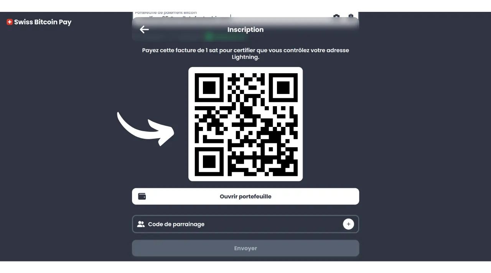
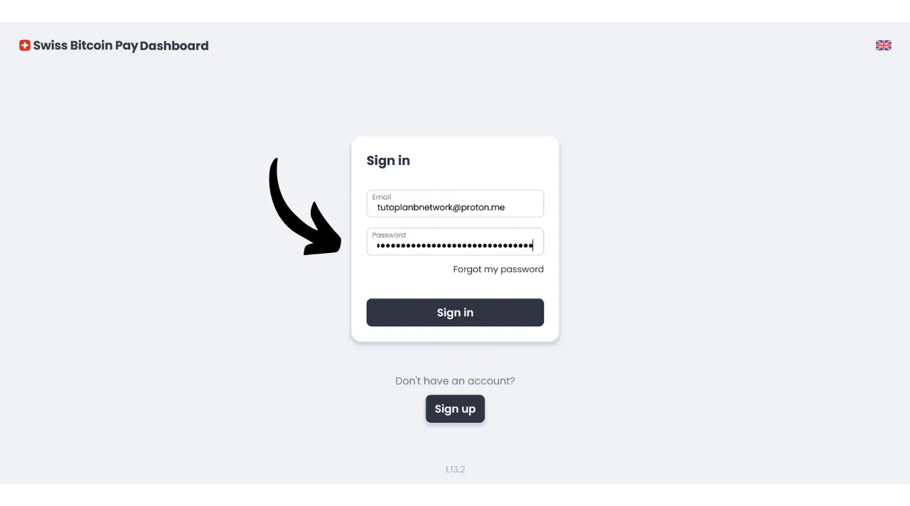
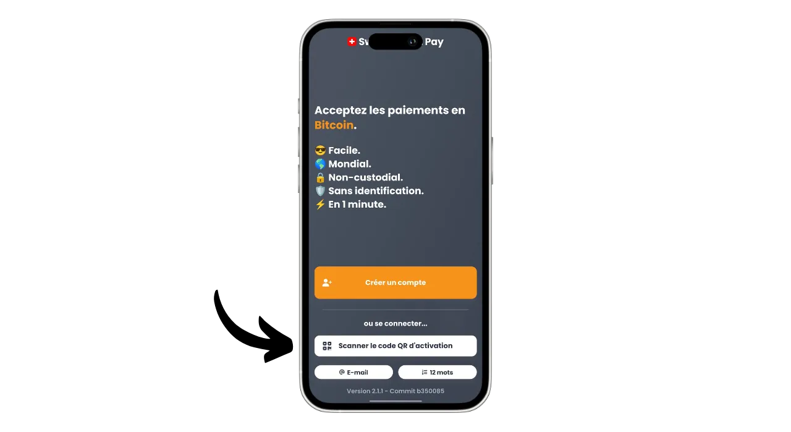
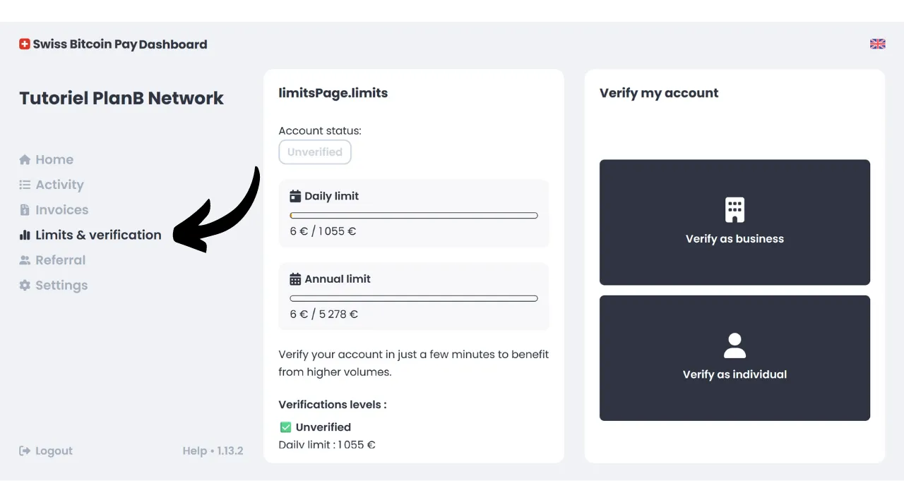

如今，对于希望接受比特币作为支付方式的商家来说，存在许多解决方案。对于寻求非正式设置的小实体，安装一个热钱包或甚至一个闪电钱包，就足以直接接收支付。而需要维护会计记录的大型企业，则应选择专门的支付处理系统。在这一领域也有几个选项可供选择。

对于那些不想麻烦，希望直接在银行账户中接收法币资金的人，像Open Node这样的托管解决方案是可用的：

https://planb.network/tutorials/merchant/open-node

对于准备亲自动手并希望完全控制过程的商家来说，BTCPay Server软件是一个极好的选择。然而，BTCPay Server的主要缺点是其设置和管理需要时间，并且需要一些技术专长：

https://planb.network/tutorials/merchant/btcpay-server

在所有这些解决方案中，瑞士比特币支付似乎是一个非常有趣的折衷方案，结合了易用性、功能和安全性。这个解决方案适用于从非常小的企业到更大的结构。在本教程中，您将发现如何轻松使用瑞士比特币支付在您的企业中接受比特币。

## 为什么在您的企业中接受比特币？

接受比特币作为支付方式为您的企业提供了众多优势。首先，比特币在某种程度上像现金，但没有实体货币的缺点。像现金一样，作为支付收到的比特币不需要经过传统的银行流程。这是一种从您的客户直接到您自己的点对点交易，除非您使用支付中介。

此外，比特币支付提供了闪电般的即时性，并且在链上支付的情况下只需要几分钟。一旦确认，就不可能取消比特币支付。如果您选择自我保管，您将直接控制您的比特币，这进一步增强了您企业的财务自主权。

通过使用比特币，您还将在佣金和银行费用上实现显著节省。使用比特币消除了购买或租赁支付终端的需要；一台电脑或一个简单的智能手机就足够了。此外，通过接受直接的比特币支付，您避免了通常在交易上收取的佣金。即使您通过中介进行支付处理，与比特币交易相关的费用通常也比传统银行的费用要低得多。
比特币与现金分享许多优点，但作为一种资产，它提供了更多的好处。例如，BTC的总数量通过共识固定在2100万单位，使其成为一种稀有资产，抵抗货币通胀，不像国家货币那样。通过在您的企业中接受比特币，您有机会长期保持财库的价值并多样化您公司的资产。

在日常生活中，比特币支付提供了比现金更多的便利和灵活性。一个显著的优势是您不需要为比特币支付找零，这消除了管理实体现金注册机的需要。此外，接受比特币减少了您暴露于盗窃、入室抢劫和抢劫风险的程度。同样，它是一种不能被伪造的货币，不像纸币那样。

如果您有国际客户，比特币具有全球货币的优势，从而消除了您的客户需要兑换货币的需求。

对于在线业务来说，比特币也是一种安全接受远程支付的有效方法，无需通过传统银行系统。这种用途确实是比特币发明者中本聪的最初意图之一，他将其描述为“*一种点对点的电子现金系统*”。
最终，将比特币整合到您的业务中也可以是营销策略的一部分。接受BTC可以将您的公司定位为创新的、灵活的，并适应技术演变，同时为您打开一个新市场。根据[KPMG的一项研究](https://kpmg.com/fr/fr/home/media/press-releases/2024/03/web3-crypto-actifs-adan.html)，12%的法国人拥有加密货币，其中大多数人持有比特币。通过接受这种支付方式，您可以吸引那些希望花费他们的sats的客户，这些客户否则可能永远不会光顾您的业务。这也是让您为Z世代所知的一个好方法。
在我看来，接受比特币应该被视为一个低风险的机会，它可以对您的业务产生重大的积极影响。如果经验证明不成功，所承担的成本将保持最小。主要成本在于设置接受BTC的解决方案所需的时间，但正如您将在本教程中发现的，现在非常简单和快速就能实现。

## 瑞士比特币支付介绍
瑞士比特币支付是一个允许商家以直接的方式接受比特币支付的解决方案。它整合了一个具有直观用户界面的销售点（PoS）应用程序，易于您的员工使用，无需深入的技术知识。与传统的比特币钱包不同，瑞士比特币支付应用程序专门用于接收比特币支付，这允许您将设备无风险地委托给员工。您可以选择使用多个连接到同一个瑞士比特币支付账户的PoS应用程序，无论是在平板电脑上、收银台上，还是在员工的智能手机上，都便于部署。瑞士比特币支付应用程序可以安装在Android和iOS设备上，也提供了计算机的网络版本。

瑞士比特币支付提供了两种管理支付的选项：资金可以直接以比特币形式提取到特定地址，或转换成法定货币并存入银行账户。这个操作是自动化的，每24小时发生一次。因此，您不必手动管理比特币支付或通过闪电网络的支付；瑞士比特币支付为您处理一切。每天，您将根据您的偏好，收到个人钱包或银行账户中的支付余额。虽然它不是像BTCPay Server那样提供的100%非托管解决方案，但瑞士比特币支付在便利性和安全性之间代表了一个有趣的折衷，因为中介只会持有您的收据24小时，然后将资金转给您。此外，与其他托管解决方案不同，瑞士比特币支付不要求您的业务进行任何身份验证（KYC）。

使用瑞士比特币支付的费用非常有竞争力：第一年，交易收取0.21%的佣金。随后，保留为比特币的支付费用为1%，转换为法定货币的为1.5%。然而，值得注意的是，作为回报，他们为您的所有提款覆盖了100%的比特币交易费用。

因此，瑞士比特币支付呈现为完全托管解决方案和更复杂的自托管系统（如BTCPay Server）之间的有趣替代品。它是商家在简单性、安全性和财务自主性之间的一个好折衷。

## 如何创建瑞士比特币支付账户？

访问[官方瑞士比特币支付网站](https://swiss-bitcoin-pay.ch/)。

点击"*Dashboard*"按钮。

点击“*注册*”按钮。
为您的账户选择一个名称。这可以是您业务的贸易名称（这将是在客户的交易历史中出现的名称）。

提供一个电子邮件地址。

选择一个强密码来保护您的账户。

设置您的本地货币。

然后通过调整滑块选择您希望如何接收资金：100%以比特币形式、100%以本地货币形式，或者在两者之间任意分配您选择的比例。

如果您选择通过银行系统以本地货币接收资金，您将需要提供您的银行账户详情。如果您更愿意以比特币形式接收资金，有几种接收选项可供选择。

“*onchain*”选项允许您将所有支付接收到单一的比特币地址。然而，我不建议使用这个选项，因为它会导致同一个地址的重复使用，这可能会极大地损害您的隐私。

如果您选择通过onchain以比特币形式接收您的支付，最好使用带有“*x/y/zpub*”选项的扩展公钥。这样，Swiss Bitcoin Pay可以为每次提款派生一个新的未使用过的地址。

如果您预计比特币支付的量相对较低，您也可以选择直接通过闪电网络接收支付。为此，您将需要提供一个闪电地址。您的资金将在每次支付后立即转账，与onchain选项不同，后者将所有收据汇总为单日一次性支付。

显然，这个选择只影响Swiss Bitcoin Pay向您的业务支付的方式。无论您在这里选择哪个选项，您的客户仍然可以通过闪电网络或onchain支付给您。

对于本教程，我将选择通过闪电网络接收我的支付。出于教育目的并保护我真实闪电节点的隐私，我将使用一个假的Wallet of Satoshi进行提款。然而，我强烈建议不要使用托管比特币钱包，无论是LN上的提款还是onchain上的提款。

然后，您需要支付1 sat来验证您的闪电地址。对于比特币地址，您将需要提供与该地址对应的私钥的签名。

最后，您有选项可以添加推荐码。如果您希望支持我们，您可以使用代码“*DiscoverBitcoin*”，这样您的佣金中的一部分就会与我们共享。谢谢！:)
填写完所有信息后，点击“*发送*”按钮。

就这样！您的Swiss Bitcoin Pay账户现在已经准备好了。您现在可以开始为您的业务接收比特币支付了！

如果您愿意，您可以通过电子邮件收到的链接来推广您的业务。

## 如何安装瑞士比特币支付PoS？

您现在可以通过以下网站访问该支付处理器的网络版本：https://app.swiss-bitcoin-pay.ch/

如果您想在智能手机或平板电脑上使用PoS，有两种选择：安装应用程序或直接通过浏览器使用网络版本。对于后一种选项，通过在[瑞士比特币支付网站](https://dashboard.swiss-bitcoin-pay.ch/signin)登录来访问您的仪表板。

然后只需用您选择的设备扫描界面上出现的二维码即可。

如果您更喜欢以应用程序的形式拥有PoS，请前往您的应用商店[Google Play商店](https://play.google.com/store/apps/details?id=ch.swissbitcoinpay.checkout)或[App Store](https://apps.apple.com/us/app/swiss-bitcoin-pay/id6444370155)并安装瑞士比特币支付。该应用程序也可以直接以`.apk`格式在他们的网站上，或在[F-Droid商店](https://f-droid.org/packages/ch.swissbitcoinpay.checkout/)上获得。

首次打开时，点击“*扫描激活二维码*”按钮。

扫描您仪表板上出现的二维码。

您现在已连接到PoS系统作为一名员工，这意味着这台机器只被授权处理支付，而没有权限修改您的商业账户设置。

如果您愿意，您可以在管理员账户中更改结账时显示的PoS名称。您可以根据其具体位置（例如，“*酒吧夹层*”，“*服务驱动*”，“*头服务员广场3号*”，“*房间助理2号*”，“*收银台7号*”，“*露台*”，“*快速结账*”，“*接待处*”，“*礼宾部*”，“*水疗/健康中心*...”）或使用它的员工的名字来命名终端。要做到这一点，请点击屏幕顶部公司名称下方当前PoS的名称。
注意这个支付处理器的新名称，然后点击“*发送*”按钮。

## 如何使用瑞士比特币支付进行结账？

结账非常简单，一旦在PoS上，输入要收取的金额。

在“*备注*”框中，您可以记录将附加到支付中的信息，特别是在您的报告中。例如，您可以记录销售的商品或服务。

然后点击“*确定*”按钮。

等待几秒钟，以便瑞士比特币支付创建Lightning发票和接收地址。

PoS系统随后会显示一个统一的二维码，允许您的客户通过闪电网络或链上支付（两种方法使用相同的二维码）。如果您的设备支持，也可以通过使用NFC技术的闪电卡进行支付。
一旦发票支付成功，PoS将确认支付成功。

您还可以通过点击屏幕左上角的图标，找到这个特定PoS的支付和全部交易历史。

您可以找到您刚刚收到的支付。

由于我选择了通过一个闪电地址提取支付的选项，我可以看到我的商业PoS的支付已经到达了我的LN钱包。

## 如何使用Swiss Bitcoin Pay管理您的业务？

为了更精确地管理您的业务，一切操作都在您的仪表板上进行。访问[官方Swiss Bitcoin Pay网站](https://swiss-bitcoin-pay.ch/)。

点击屏幕右上角的“*仪表板*”按钮，然后输入您的电子邮件地址和密码。 接下来，您将看到这个界面。 在“*首页*”标签页中，您可以看到待提现的支付余额以及您账户的最新活动。 在“*活动*”标签页中，您可以查看所有交易的详细信息。 例如，在我的仪表板上，我可以看到PoS “*Chef de Rang - Carré 3*”在2024年8月22日17:08收取了一杯5欧元的啤酒。 我还可以看到接待处收取了一杯咖啡。 最后，我可以看到所有提现到我个人Lightning钱包的交易。 要设置报告的导出，请点击“*导出*”按钮。 在“*手动*”标签页中，您可以一次性导出您的交易。只需选择一个期间，然后选择您想要包含在报告中的信息。 然后点击“*导出*”按钮下载您交易的`.csv`文件。 在“*定期*”标签页中，您可以安排自动定期导出。选择导出生成的频率，并选择您想要包含在报告中的信息。 最后，输入将发送报告的电子邮件地址。例如，您可以直接输入您会计师的电子邮件地址。点击“*保存*”按钮以保存此定期导出。 发票标签页允许您为一次性支付生成发票。 在“*限额与验证*”标签页中，您可以查看您的日常和年度收款限额。您还可以选择进行身份验证以解锁更高的限额。 “*推荐*”标签页允许您管理与赞助相关的一切。最后，在“*设置*”标签页中，您可以修改注册时提供的信息，包括提现方法和比特币与法币之间的分配。
恭喜您！您现在已经设置了一个支付处理系统，以接受您的业务中的比特币支付。如果您还想探索BTCPay Server，一个更高级和复杂的解决方案，我建议您跟随我们专门针对这个软件的完整培训：[BTC305](https://planb.network/courses/btc305)。