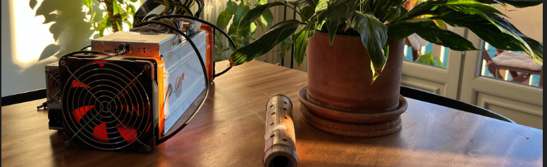

# Attakai - ホームマイニングを可能にし、アクセスしやすくする！

「Attakaï」イニシアチブは、生成された熱を利用したビットコインマイニングを探求します。このガイドは、マイナーを家庭でラジエーターとして使用できるようにする解決策を提供し、より快適でエネルギーを節約します。ビットコインは自動的にマイニングの難易度を調整し、マイナーにその作業に対する報酬を与えます。しかし、ハッシュレートの集中はネットワークの中立性にリスクをもたらす可能性があります。「Attakaï」は、参加者が電気代を削減し、KYCなしでsatsを報酬として得られるように、経済的にマイナーを改造するための実用的なガイドを提供します。

## はじめに

「Attakaï」とは日本語で「理想的な温度」を意味し、@ajelexBTCと@BlobOnChainがDécouvre Bitcoinと共に開始した、発生した熱の再利用を通じてビットコインマイニングを発見することを目的としたイニシアチブの名前です。このASIC改造ガイドは、マイニング、その運用、最近の歴史、およびその背景にある経済についてもっと学ぶための基礎となります。

### ASICからの熱を再利用する理由は？

電気システムにおけるエネルギーと熱生成の関係を理解することが重要です。

1 kWの電気エネルギーの投資で、電気ラジエーターは1 kWの熱を生産します。これ以上でも以下でもありません。新しいラジエーターは従来のラジエーターよりも効率的ではありません。その利点は、部屋内で熱を連続的かつ均等に分配する能力にあり、高い加熱力と加熱なしを交互にする従来のラジエーターと比較して、定期的な温度変動と不快感を生じさせることなく、より快適さを提供します。

コンピューター、またはより広義には電子ボードは、計算を実行するためにエネルギーを消費するわけではありません。単にそのコンポーネントを通じてエネルギーが流れる必要があります。エネルギー消費は、コンポーネントの電気抵抗によって生じ、これが損失を生じさせ、ジュール効果として知られる熱を生成します。
いくつかの企業は、コンピューティングパワーの必要性と暖房の必要性をプールするというアイデアを思いつきました。このアイデアは、企業のサーバーを家庭やオフィスに配置できる小さなユニットに分散させることです。しかし、このアイデアはいくつかの問題に遭遇します。サーバーの必要性は暖房の必要性とは関連しておらず、企業はサーバーのコンピューティング能力を柔軟に使用することができません。個人が持つことができる帯域幅にも限界があります。これらの制約は、企業がこれらの高価な設備を利益をもたらすものにすること、または暖房が必要ないときに引き継ぐことができるデータセンターなしに安定したオンラインサーバーの提供を防ぎます。

> 「もしあなたが家を暖める必要があるなら、あなたのコンピューターからの熱は無駄ではありません。もしあなたが住んでいる場所で電気暖房を使用しているなら、あなたのコンピューターから生成される熱は無駄ではありません。この熱をあなたのコンピューターで生成する場合と同じコストです。もし電気よりも安価な暖房システムを持っているなら、無駄はコストの差にのみあります。もし夏でエアコンを使用しているなら、それは二重の無駄です。
> ビットコインマイニングは、それが安価な場所で行われるべきです。おそらくそれは気候が寒く、暖房が電気である場所で、マイニングが無料になるでしょう。」
> サトシ・ナカモト - 2010年8月8日
ビットコインとそのプルーフ・オブ・ワークは、ネットワーク全体で行われる計算量に基づいて自動的にマイニングの難易度を調整する点で際立っています。この計算量はハッシュレートと呼ばれ、秒間ハッシュ数で表されます。現在、280エクサハッシュ毎秒、つまり秒間280京ハッシュと推定されています。このハッシュレートは作業量を表し、したがって消費されたエネルギー量を意味します。ハッシュレートが高いほど、難易度は上昇し、その逆もまた然りです。したがって、ビットコインマイナーは、ネットワークに影響を与えることなく、いつでも活動を開始または停止することができます。これは、サービスを提供するために安定して稼働し続ける必要があるラジエーター/サーバーとは異なります。マイナーは、たとえその参加が微小であっても、他の作業に対する相対的な作業量に対して報酬を受け取ります。
要約すると、電気ラジエーターとビットコインマイナーの両方が、消費した1kWの電気に対して1kWの熱を生産します。しかし、マイナーは報酬としてビットコインも受け取ります。電気の価格、ビットコインの価格、またはビットコインネットワーク上のマイニング活動の競争に関係なく、電気ラジエーターよりもマイナーで暖を取る方が経済的に有利です。

### ビットコインにおける付加価値

ここではマイニング操作の詳細には触れません（必要に応じてアカデミーで資料を入手できます）。理解することが重要なのは、マイニングがビットコインの分散化にどのように貢献しているかです。複数の既存技術が巧みに組み合わされ、中本聡のコンセンサスを実現しています。このコンセンサスは、ビットコインネットワークの運用に参加する正直なアクターに経済的な報酬を与え、不正直なアクターを抑止します。これは、ネットワークが持続可能に存在できるようにするための鍵となるポイントの一つです。

ルールに従ってマイニングする正直なアクターは、新しいブロックを生成する報酬の最大のシェアを得るために互いに競争しています。この経済的インセンティブは自然と一種の中央集権化を促し、企業はこの有利な活動に特化し、規模の経済を通じてコストを削減することを選択します。これらの産業アクターは、機械の購入と維持、および大量の電力料金の交渉において有利な立場を持っています。

> 「最初は、ほとんどのユーザーがネットワークノードを実行しますが、ネットワークがある程度を超えて成長するにつれて、専門のハードウェアを備えたサーバーファームを持つ専門家にますます任されることになります。サーバーファームはネットワーク上で1つのノードのみを実行する必要があり、LANの残りはその1つのノードに接続します。」- 中本聡 - 2008年11月2日

特定のエンティティは、大規模なマイニングファームで総ハッシュレートのかなりの割合を保持しています。最近のアメリカでの寒波では、電気の特別な需要がある家庭にエネルギーを再配分するために、ハッシュレートのかなりの部分がオフラインにされました。数日間、マイナーはファームをオフにする経済的インセンティブを受け取り、その結果、ビットコインのハッシュレート曲線にこの例外的な天候が見られます。

この問題は問題となり、ネットワークの中立性に対する重大なリスクをもたらす可能性があります。51％以上のハッシュレートを持つアクターは、望む場合にはトランザクションをより簡単に検閲できるでしょう。そのため、ハッシュレートを中央集権的なエンティティではなく、複数のアクター間で分散させることが重要です。これらのエンティティは、たとえば政府によってより簡単に押収される可能性があります。

**もしマイナーが世界中の数千、あるいは数百万の家庭に分散していれば、国家がそれらを掌握することは非常に複雑になります。**
工場では、マイナーを住宅用のラジエーターとして使用することは適していません。これは主に過度の騒音と調整の不足という2つの問題が原因です。しかし、これらの問題はハードウェアとソフトウェアに簡単な変更を加えることで容易に解決でき、現代の電気ヒーターのように設定や自動化が可能なはるかに静かなマイナーを実現できます。
**Attakaïは、最もコスト効率の良い方法でAntminer S9を改造する方法を教える教育イニシアチブです。**

これは実践しながら学ぶ絶好の機会です。電気代を削減するだけでなく、参加によって無料のKYC satsが報酬として与えられます。

## 第1章：中古ASICの購入ガイド

このセクションでは、このラジエーター改造チュートリアルのベースとなるBitmain Antminer S9の中古品を購入する際のベストプラクティスについて議論します。このガイドは他のASICモデルにも適用されますが、中古のマイニングハードウェアを購入するための一般的なガイドです。

Antminer S9は、2016年5月からBitmainによって提供されているデバイスです。1323Wの電力を消費し、13.5 TH/sを生産します。古いと考えられていますが、マイニングを始めるには優れたオプションです。大量生産されているため、世界中の多くの地域で豊富に予備部品を簡単に見つけることができます。EbayやLeBonCoinなどのサイトで個人間で一般的に購入できますが、新しいマシンと比べて競争力が低いため、専門のリセラーはもはや提供していません。2020年3月以降に導入されたAntminer S19のようなASICよりも効率が低いですが、これにより手頃な価格の中古ハードウェアとなり、私たちが行う改造に適しています。

Antminer S9には、初代ハードウェアに小さな変更を加えたいくつかのバリエーション（i、j）があります。これが購入決定に影響を与えるとは考えていませんが、このガイドはこれらのバリエーションすべてに適用されます。

ASICの価格は、ビットコインの価格、ネットワークの難易度、マシンの効率、電気のコストなど、多くの要因によって変動します。そのため、中古マシンを購入するための正確な見積もりを出すことは困難です。2023年2月のフランスでの予想価格は一般的に€100から€200の範囲ですが、これらの価格は急速に変動する可能性があります。

Antminer S9は以下の部品で構成されています：

- ハッシュパワーを生産するチップが配置されている3つのハッシュボード

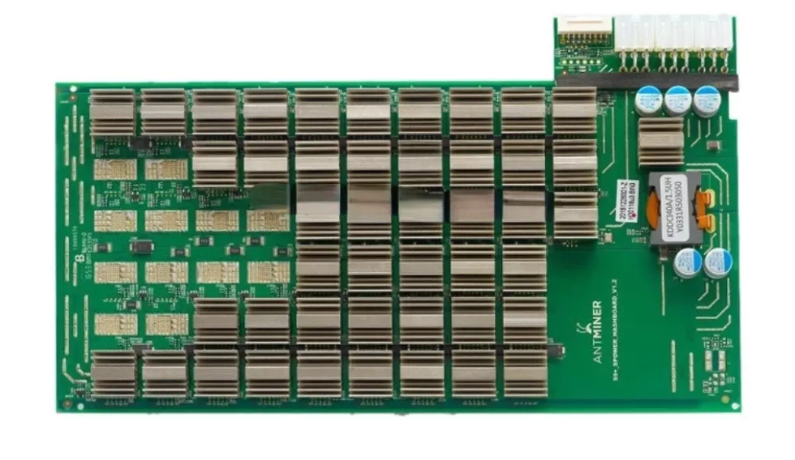

- SDカードのスロット、イーサネットポート、ハッシュボードとファンのコネクターが含まれるコントロールボード。これがASICの脳です。
  

- ハッシュボードをコントロールボードに接続する3つのデータケーブル。

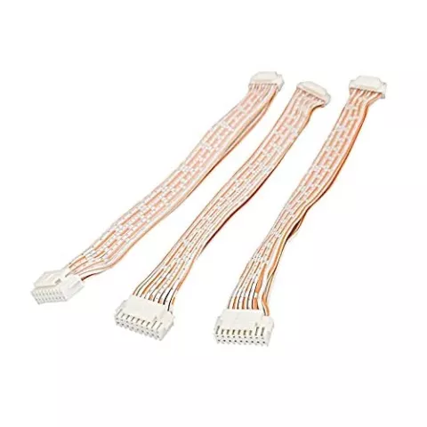

- 220Vで動作し、通常の家庭用電化製品のようにプラグインできる電源。

- 2つの120mmファン。

- 男性用C13ケーブル。

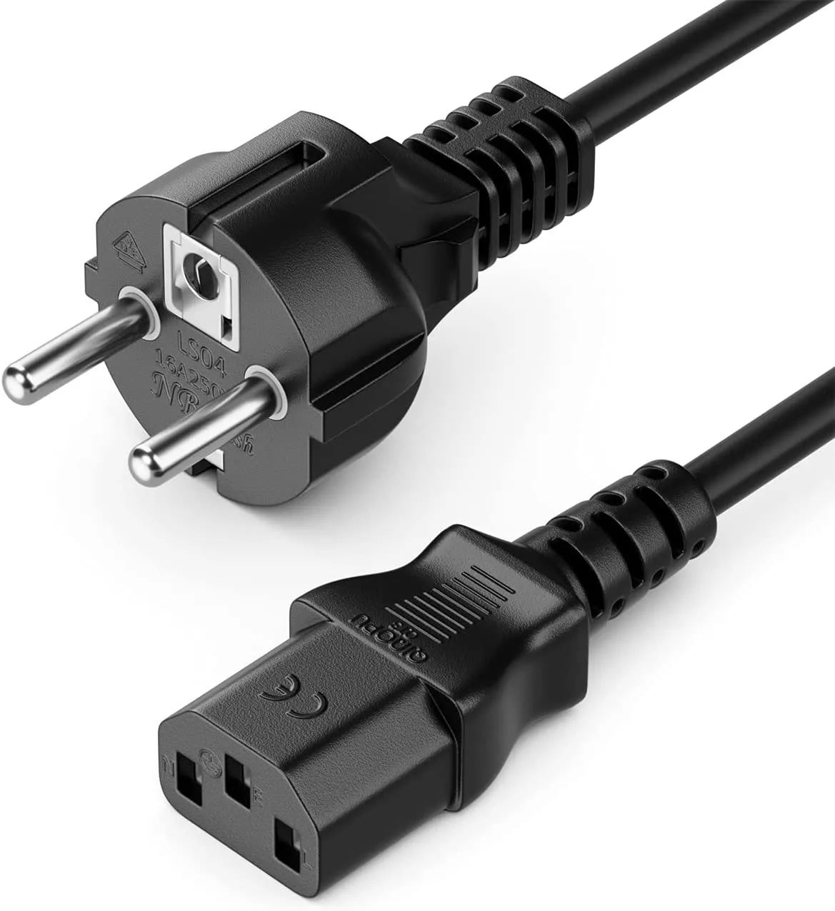
中古の機械を購入する際には、すべての部品が含まれていて機能していることを確認することが重要です。取引の際には、売り手に機械を起動してもらい、その正常な動作を確認するべきです。デバイスが正しく起動するか、そしてイーサネットケーブルを接続して同じローカルネットワーク上のウェブブラウザからBitmain接続インターフェースにアクセスすることでインターネット接続を確認することが重要です。このIPアドレスは、インターネットルーターインターフェースに接続して接続されているデバイスを探すことで見つけることができます。このアドレスは次の形式であるべきです：192.168.x.x

また、デフォルトの認証情報が機能するか確認してください（ユーザー名：root、パスワード：root）。デフォルトの認証情報が機能しない場合は、機械のリセットを行う必要があります。

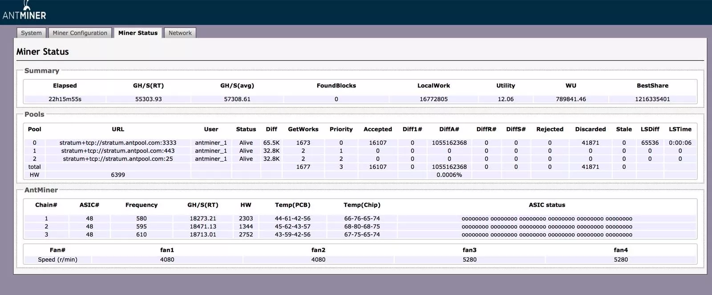

接続されたら、ダッシュボード上で各ハッシュボードの状態を確認できるはずです。マイナーがプールに接続されている場合は、すべてのハッシュボードが機能しているのを見ることができるはずです。マイナーは多くの騒音を発生させることが普通であることに注意してください。また、ファンが適切に機能していることも確認してください。

その後、以前の所有者のマイニングプールを削除して、後で自分のものを設定できます。希望があれば、機械を分解してハッシュボードを検査することもできます。ただし、このステップはより複雑で、より多くの時間と特定のツールを必要とします。この分解を進めたい場合は、それをどのように行うかを詳しく説明するこのチュートリアルの次の部分を参照できます。マイナーは多くのほこりを集め、定期的なメンテナンスが必要であることに注意してください。機械を分解することで、このほこりの蓄積とメンテナンスの質を観察できます。
これらの点をすべて確認した後、高い自信を持って機械を購入できます。疑問がある場合は、コミュニティに連絡し、このチュートリアルを完了するために必要な機器が必要な場合は、お気軽にメッセージを送ってください。
このガイドを一文で要約すると：**「信じるな、確認せよ。」**

## 第2章：改造部品の購入ガイド

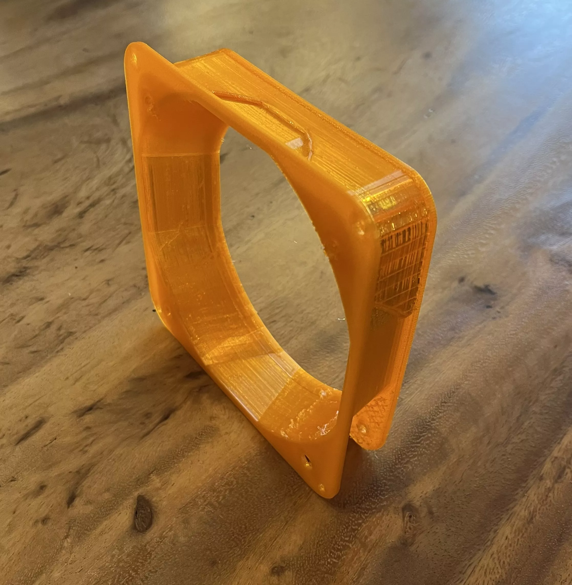

### あなたのAntminer S9を静かで接続されたヒーターに変える方法は？

Antminer S9を所有している場合、その騒々しさとかさばることはよく知られています。しかし、いくつかの簡単なステップに従うことで、それを静かで接続されたヒーターに変えることが可能です。この記事では、変更を行うために必要な機器を紹介し、後の記事でこれらの変更を行うために従うべきステップを詳しく説明します。

### 1. ファンの交換

Antminer S9のオリジナルファンは、ヒーターとして使用するにはあまりにもうるさいです。解決策は、より静かなファンに交換することです。私たちのチームはNoctuaブランドのいくつかのモデルをテストし、Noctua NF-A14 iPPC-2000 PWMを最良の妥協点として選びました。ファンを選ぶ際には、12Vバージョンを選択してください。この140mmファンは、理論上の騒音レベルが31dBである間に最大1300Wの熱を生産することができます。これらの140mmファンを取り付けるためには、140mmから120mmへのアダプターが必要になります。これはDécouvreBitcoinストアで見つけることができます。また、140mmの保護グリルを追加します。

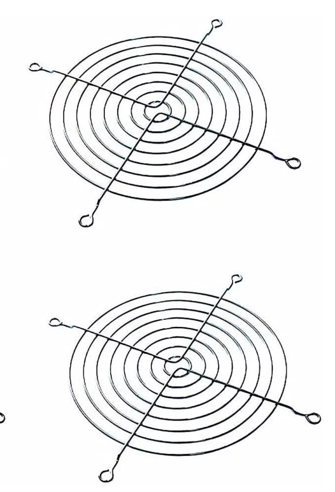
電源ユニットのファンもかなりうるさいので、交換が必要です。Noctua NF-A6x25 PWMをお勧めします。ただし、Noctuaファンのコネクタは元のものとは異なるため、接続するにはコネクタアダプタが必要になります。2つあれば十分です。再度、ファンの12Vバージョンを選択するようにしてください。

### 2. WIFI/Ethernetブリッジの追加

Ethernetケーブルを使用する代わりに、WIFI/Ethernetブリッジを追加することで、AntminerをWIFIに接続できます。私たちはvonets vap11g-300を選びました。これは、インターネットボックスからWIFI信号を簡単に取得し、サブネットを作成することなくEthernet経由でAntminerに伝送できるためです。電気に関するスキルがあれば、USBチャージャを追加することなく、直接Antminerの電源で動作させることができます。そのためには、メス型の5.5mmx2.1mmジャックが必要になります。

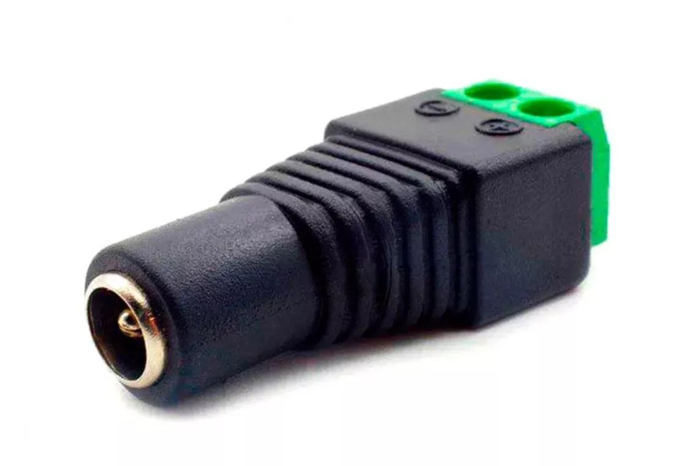

### 3. オプション：スマートプラグの追加

スマートフォンからAntminerの電源をオン/オフしたい、またはその電力消費を監視したい場合は、スマートプラグを追加できます。私たちは、smartlifeアプリケーションと互換性のある16AバージョンのANTELAプラグをテストしました。このスマートプラグは、日々と月々の電力消費をチェックでき、WIFI経由で直接インターネットボックスに接続します。

> 装備とリンクのリスト
>
> - 2X 3Dアダプターピース 140mmから120mmへ
> - 2X NF-A14 iPPC-2000 PWM [リンク](https://www.amazon.fr/Noctua-nf-polarized-A14-industrialppc-PWM-2000/dp/B00KESSUDW/ref=sr_1_2?__mk_fr_FR=ÅMÅŽÕÑ&crid=JCNLC31F3ECM&keywords=NF-A14+iPPC-2000+PWM&qid=1676819936&sprefix=nf-a14+ippc-2000+pwm%2Caps%2C114&sr=8-2)
> - 2X 140mmファングリル [リンク](https://www.amazon.fr/dp/B06XD4FTSQ?psc=1&ref=ppx_yo2ov_dt_b_product_details)
> - Noctua NF-A6x25 PWM [リンク](https://www.amazon.fr/Noctua-nf-a6-25-PWM-Ventilateur-Marron/dp/B00VXTANZ4/ref=sr_1_1_sspa?__mk_fr_FR=ÅMÅŽÕÑ&crid=3T313ABZA5EDE&keywords=Noctua+NF-A6x25+PWM&qid=1676819329&sprefix=noctua+nf-a6x25+pwm%2Caps%2C71&sr=8-1-spons&sp_csd=d2lkZ2V0TmFtZT1zcF9hdGY&psc=1&smid=A38F5RZ72I2JQ)
## 第3章 - チュートリアル：マイナーをヒーターに変える方法は？

DIYが得意で、マイナーをヒーターに変えたいと考えている方のためのチュートリアルです。電子機器を改造することは、電気的および火災のリスクを伴う可能性があるため、警告しておきます。損害や怪我を避けるために、必要な予防措置を講じることが重要です。
工場出荷時のマイナーは、騒音が大きすぎ、調整可能でないため、家庭でラジエーターとして実際に使用することはできません。しかし、これらの問題を解決するために、簡単な改造を行うことが可能です。

> 警告：マシンの性能を下げることができるBraiins OS+またはその他のソフトウェアを、マイナーに事前にインストールしておくことが重要です。この措置は、騒音を減らすために、熱を少なく放散できるより低出力のファンを設置するため、重要です。

### 必要な材料

- 3Dアダプター 140mmから120mmへの2個
- Noctua NF-A14 iPPC-2000 PWMファン2個
- 140mmファングリル2個
- Noctua NF-A6x25 PWMファン1個
- 2.5mm2の電気工事用スグ
- Vonets VAP11G-300
- オプション：ANTELAスマートプラグ

### ファンの交換

まず、電源ユニットのファンを交換することから始めます。

> 警告：何よりもまず、感電のリスクを避けるために、作業を始める前にマイナーのプラグを抜いておくことを確認してください。

電源ユニットのファンの交換から始めます。

まず、ケースを閉じている側面の6本のネジを外します。ネジを外したら、ケースを優しく開けて、コンポーネントを保護しているプラスチックカバーを取り外します。

次に、他のコンポーネントを損傷しないように注意しながら、元のファンを取り外す時が来ました。これを行うには、それを固定しているネジを取り外し、コネクタ周辺の白い接着剤を慎重に剥がします。配線やコネクタを損傷しないように、繊細に進めることが重要です。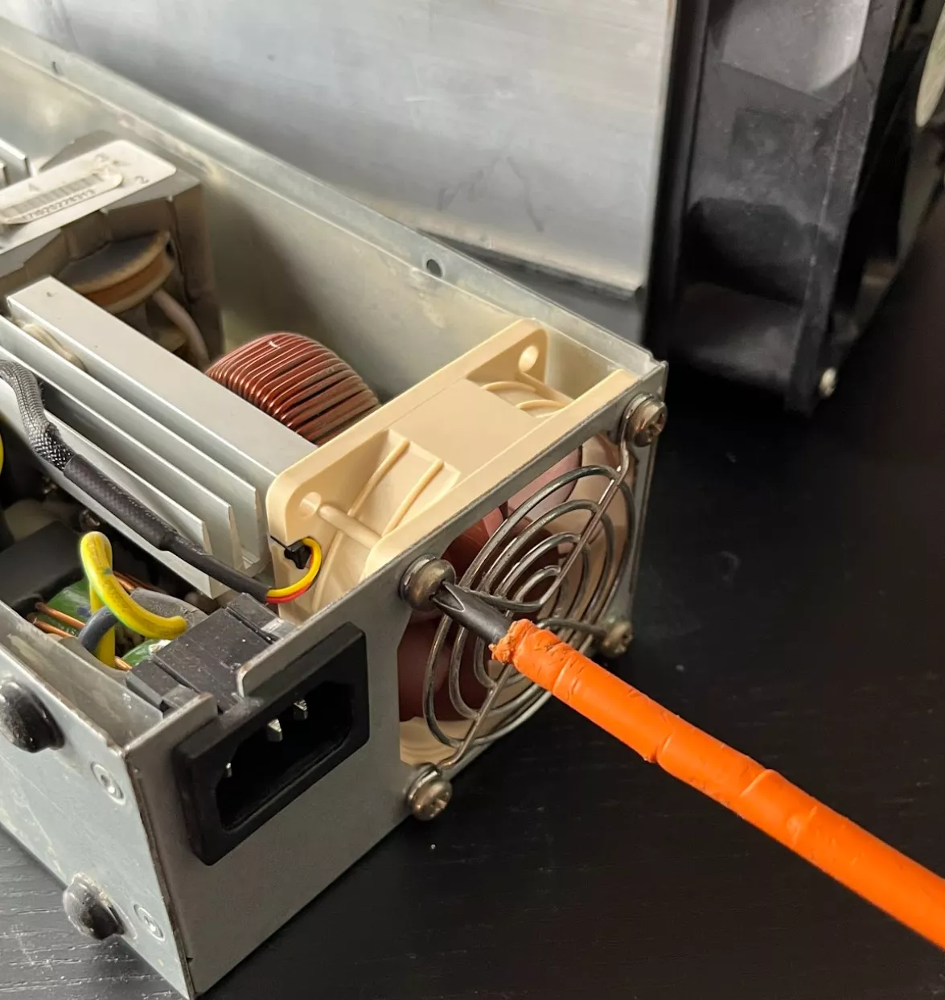

元のファンを取り外すと、新しいNoctuaファンのコネクタが元のファンのものと一致しないことに気づくでしょう。実際、新しいファンには3本の配線があり、そのうち黄色い配線は速度制御に使用されます。しかし、この配線はこの特定のケースでは使用されません。新しいファンを接続するには、特別なアダプタの使用が推奨されます。ただし、このアダプタは時に入手困難であることに注意が必要です。

このアダプタを持っていない場合でも、ワイヤーナットを使用して新しいファンを接続することができます。これを行うには、古いファンと新しいファンのケーブルを切断する必要があります。

新しいファンでは、カッターを使用して、メインシースの輪郭を下のケーブルのシースを切らないように注意しながら1cmで慎重に切ります。

次に、メインシースを下に引っ張りながら、以前と同じ方法で赤と黒のケーブルのシースを切り、黄色いケーブルをフラッシュカットします。

古いファンでは、赤と黒の配線のシースを損傷しないように、メインシースを切るのがより繊細です。これを行うために、メインシースと赤及び黒の配線の間に針を滑り込ませて使用しました。

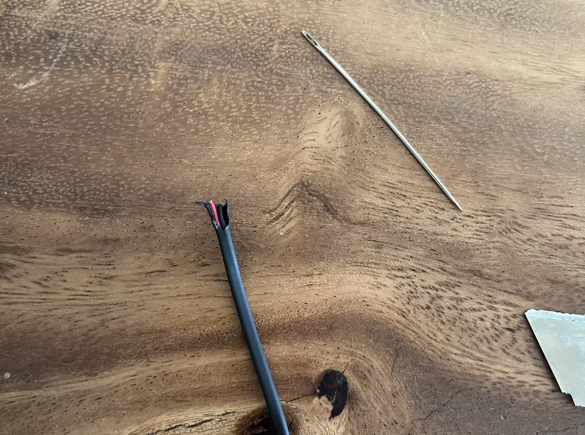
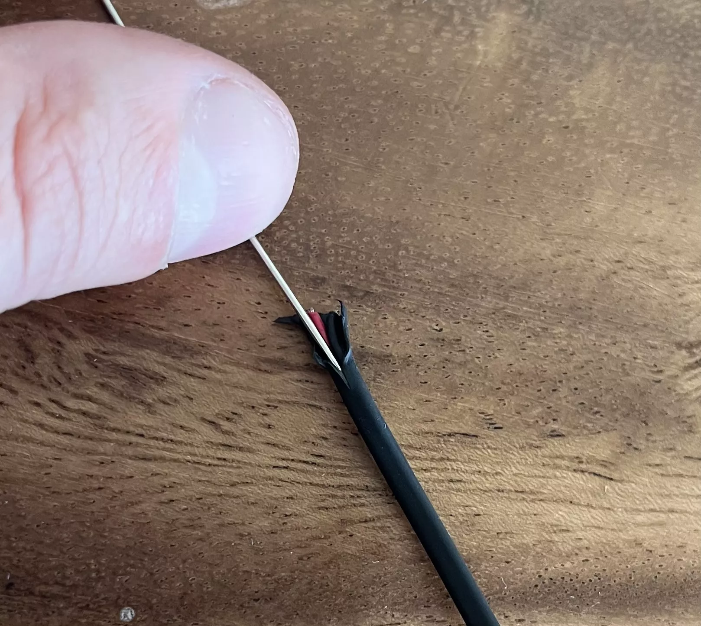

赤と黒の配線が露出したら、電気配線を損傷しないように慎重にシースを切ります。

その後、ワイヤーナットでケーブルを接続します。黒い配線は黒と、赤い配線は赤と接続します。電気テープを追加することもできます。

接続が完了したら、新しいNoctuaファンをグリルと古いネジで取り付け、箱に入っている新しいネジは後で再利用します。正しい向きで配置することを確認してください。ファンの一方の側には、エアフローの方向を示す矢印があります。この矢印がケースの内側を指すようにファンを配置することが重要です。その後、ファンを再接続します。

> オプション：電気に精通している場合は、12V電源出力に直接女性用5.5mmジャックコネクタを追加することができます。これにより、Vonet Wi-Fiブリッジを直接電源供給することができます。ただし、電気技術に自信がない場合は、ショートサーキットや電気的損傷のリスクを避けるために、スマートフォンの充電器を使用したUSBコネクタを使用することが最善です。

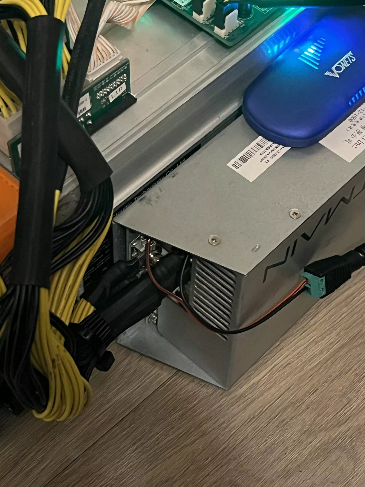

接続が完了したら、プラスチックカバーをプラスチックケーシングの上に配置し、内側には入れないようにしてください。

最後に、ケーシングカバーを元の位置に戻し、側面の6本のネジを締めて、すべてがしっかりと固定されるようにします。これで、電源ケースに新しいファンが装備されました。

### 2つの主要ファンの交換

1. まず、ファンのプラグを抜いて、ネジを外します。
   

2. 新しいNoctuaファンのコネクタは元のものと一致しませんが、慌てないでください！カッターを取り出して、小さなプラスチックのタブを慎重にカットし、コネクタがマイナーに完璧にフィットするようにします。

3. 3Dパーツの取り付けの時間です！
   ファンから外したネジを使って、マイナーの両側にそれらを取り付けます。ネジ頭が3Dパーツに入り、しっかりと固定されるまでネジを締めます。あまり強く締めすぎないように注意してください。そうするとパーツが変形したり、ネジがコンデンサーに触れる可能性があります！その後、コネクタがマイナーに完璧にフィットするように、小さなプラスチックのタブを慎重にカットします。

4. さあ、ファンの取り付けに移りましょう。
   箱に入っているネジを使用して、3Dパーツにそれらを取り付けます。空気の流れの方向に注意してください。ファンの側面の矢印が、従うべき方向を示します。イーサネットポート側から反対側へ進みます。下の写真を参照してください。

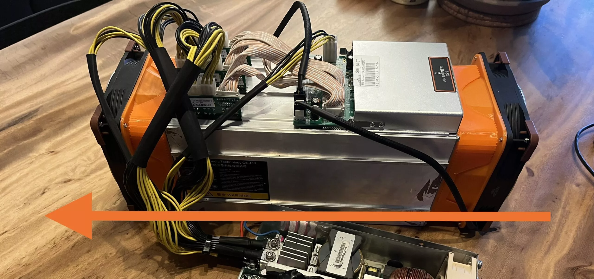

5. 最後のステップ：ファンを接続し、ファンボックスから未使用のネジを使って上部にグリルを取り付けます。4本しかありませんが、対角線上の2つのコーナーに2本ずつあれば十分です。必要であれば、ホームセンターで他の類似のネジを探すこともできます。

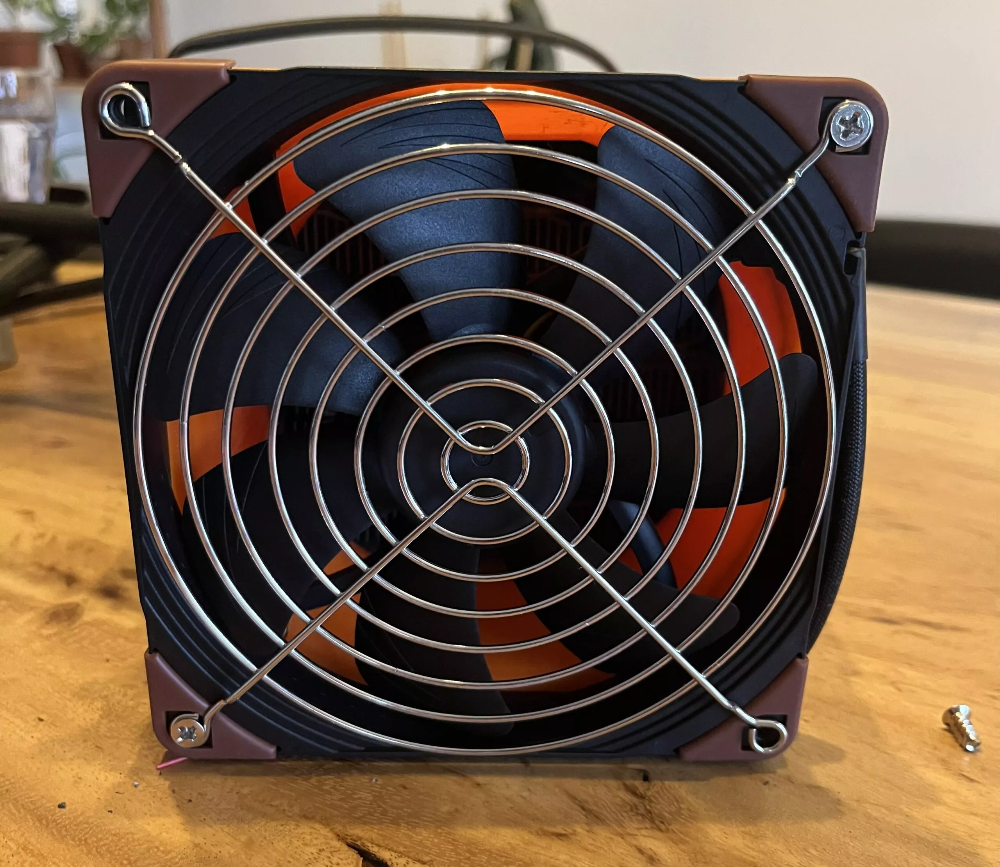
'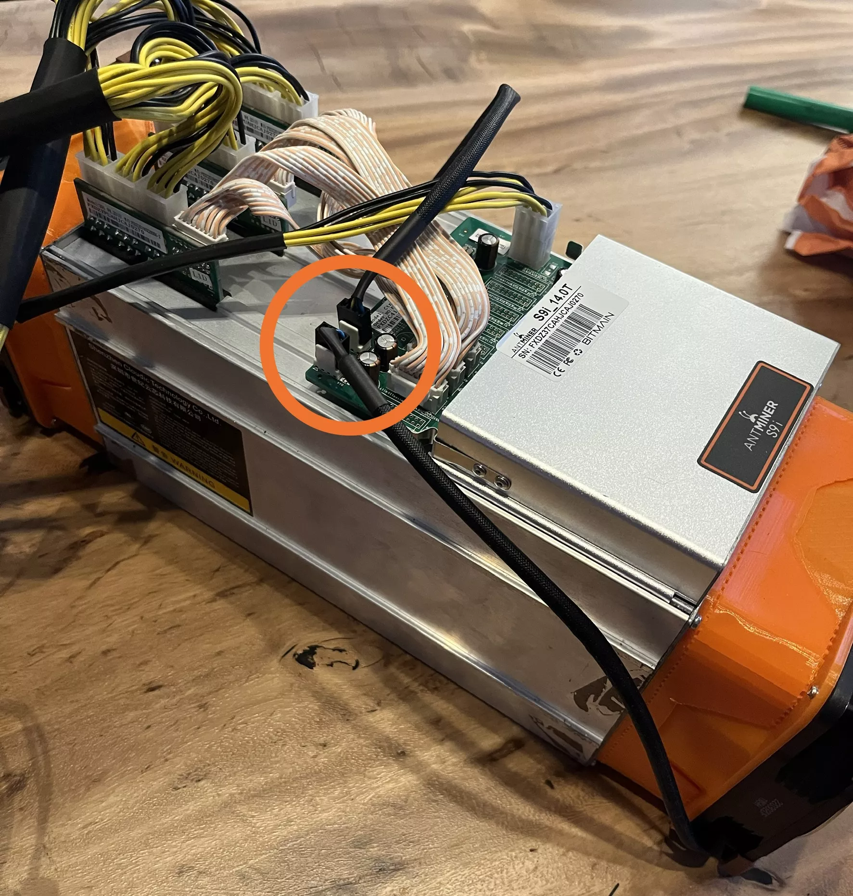

新しいヒーターのより魅力的なケーシングを提供できるようになるまで、電気技師のケーブルタイでケースと電源を一緒に固定できます。

そして、仕上げとして、Vonetブリッジを電源のイーサネットポートに接続します。まだ行っていない場合は、このチュートリアルに従ってブリッジを設定できます。

これで完了です、おめでとうございます！マイナーの全ての機械部分を交換しました。これで、かなり騒音が少なくなるはずです。

## 第4章 - ソフトウェアの変更 - Antminer S9のリセット

**BlobOnChain & Ajelexによる記事シリーズ - 2023年2月15日**

### 「Reset」ボタンを使ったリセット

この方法は、マイナーを起動してから10分以内に適用できます。

マイナーを起動して2分後、「Reset」ボタンを5秒間押してから離してください。マイナーは4分以内に工場出荷時の設定に復元され、自動的に再起動します（オフにする必要はありません）。

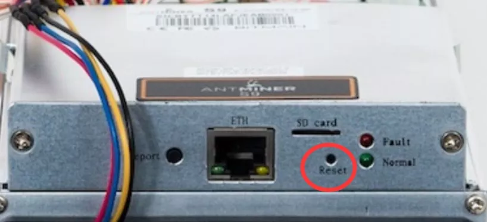

ウェブサイドからの復元

マイナーのユーザーインターフェースにログインし、「Upgrade」>>「Perform a reset」をクリックし、ポップアップウィンドウで「OK」をクリックします。

### オリジナルのオペレーティングシステム
この部分では、マシンが動作し、実行中であり、元のオペレーティングシステムがインストールされていると仮定します。Bitmainが提供する元のオペレーティングシステムのインターフェースを簡単に見ていきます。
まず、ローカルネットワークを通じてマシンに接続します：

ログインページに到達したら、デフォルトの認証情報を使用してASICにログインする必要があります：

- ユーザー名：root
- パスワード：root

(デフォルトのパスワードが機能しない場合のリセット方法は？)

メインのオペレーティングシステムは比較的基本的です。4つのタブがあります：System、Miner Configuration、Miner Status、Network。Miner Configurationタブでは、最大3つのマイニングプールを設定できます。

Miner Statusタブでは、ASICのライブ運用に関する様々な情報を確認できます。GH/sで表されるハッシュレート、プールに関するより詳細な情報、各ハッシュボードの状態とファン速度（回転/分）の詳細が表示されます。

### Braiins OS+

次に、ASIC用のソフトウェアであるBraiins OS+ (https://braiins.com/os/plus) について学びます。このソフトウェアは、マイニングプールBraiins Pool (https://braiins.com/pool) の親会社であるBraiins (https://braiins.com/) によって開発されました。このマイニングプールは、現在、執筆時点で全世界のハッシュレートの4.39%を持っています (https://mempool.space/fr/mining/pool/slushpool)。プラハに拠点を置くこの会社は、以前はSlushpoolとして知られており、2010年11月に始まった最初のマイニングプールです。今日、この会社は、プール活動と並行して、マイニングの収益性研究ツール (https://insights.braiins.com/en)、マイニングファーム管理ソリューション、ASIC向けの最適化ソフトウェアを提供しています。また、新しいStratum V2プロトコルを使用したマイニングも提供しています (https://braiins.com/bitcoin-mining-stack-upgrade)。

したがって、現在唯一互換性のあるモデルであるBitmainデバイスの操作について、より詳細に学びます：

- S19, S19 Pro, S19j, S19j Pro, T19,
- 17, S17 Pro, S17+, S17e, T17, T17+, T17e & S9 [i, j]

Braiins OSソフトウェアは、上記のすべてのマシンに簡単にインストールできます。これにより、オーバークロックやアンダークロックを可能にすることで、マシンのより正確な制御を可能にします。また、autotuningと呼ばれる自動最適化機能を通じて、各チップの周波数を微調整することもできます。製造プロセスの違いにより、各ハッシングチップはわずかに異なるため、ソフトウェアは最大効率（W/THs）を達成するために各チップの最適な周波数をテストします。このソフトウェアは、元のものよりも25%高い性能を達成できると主張しています。私たちの測定によると、これらの数値を達成することが可能です。

## Braiins OS+ のインストール

ASICにBraiins OS+をインストールする方法はいくつかあります。このガイドとBraiinsの公式ドキュメント、ビデオチュートリアルを参照してください。
Antminerのメモリに直接Braiins OS+をインストールする方法

BOSツールボックスを使用して、Antminerのメモリに直接Braiins OS+をインストールする方法を学びます。これにより、元のオペレーティングシステムが置き換えられます。以下の詳細な手順を通じて、元のOSを並行して保持したい場合は、SDカードにBraiins OS+をインストールできます。
1. Antminerを電源に接続し、インターネットボックスに接続します。
2. BOSツールボックス Windows / Linuxをダウンロードします。
3. ダウンロードしたファイルを解凍し、bos-toolbox.batファイルを開き、言語を選択した後、しばらくするとこのウィンドウが表示されます：
   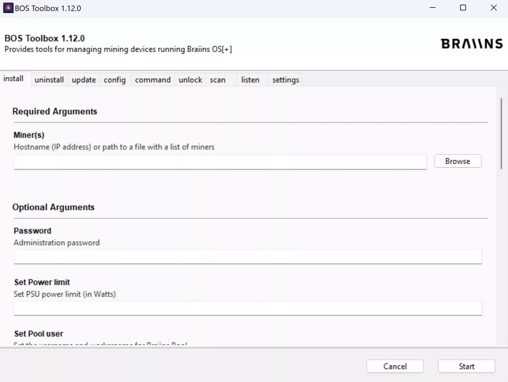

4. Bosツールボックスを使用すると、AntminerのIPアドレスを簡単に見つけ、Braiins OS+をインストールすることができます。既にマシンのIPアドレスを知っている場合は、ステップ8に進んでください。そうでない場合は、スキャンタブに進んでください。

5. 通常、家庭用ネットワークでは、IPアドレスの範囲は192.168.1.1から192.168.1.255までなので、IP範囲フィールドに「192.168.1.0/24」と入力します。ネットワークが異なる場合は、これらのアドレスを変更してください。その後、「Start」をクリックします。

6. 注意、Antminerにパスワードが設定されている場合、検出は機能しません。その場合、最も簡単な解決策は工場出荷時のリセットを実行することです。

7. ネットワーク上のすべてのAntminerが表示されるはずで、ここではIPアドレスは192.168.1.37です。

8. 「Back」をクリックし、次にインストールタブに進み、以前に見つかったIPアドレスをMiner(s)フィールドに、「admin」（または「root」）をパスワードフィールドに入力します。これはデフォルトのパスワードです。その後、「Start」をクリックします。
   パスワードが「admin」または「root」でインストールが機能しない場合は、工場出荷時のリセットを実行し、再試行する必要があるかもしれません。

9. 数分後、Antminerが再起動し、問題のIPアドレスでブラウザのアドレスバーに直接Braiins OS+インターフェースにアクセスできるようになります。ここでは192.168.1.37です。デフォルトのユーザー名は「root」で、デフォルトのパスワードはありません。
   Braiins OS+をSDカードにインストールする

この第二の方法は、Antminerのオリジナルインターフェースを使用します。この方法は、2019年以前のオペレーティングシステムを搭載したマシンで機能します。

### Antminerインターフェース

1. ここでインストールする新しいオペレーティングシステムをダウンロードします。
2. 前のセクションと同様に、ローカルネットワークを介してマシンに接続します。
3. システムタブに移動し、次にアップグレードに進みます。
4. ダウンロードしたファイルをロードし、イメージをフラッシュします。

### マイクロSDカード

第二の方法では、マイクロSDカードを使用できます。この方法は、2019年以降のオペレーティングシステムを搭載したマシンでのみ機能します。

1. ここでインストールする新しいオペレーティングシステムをダウンロードします。

2. ダウンロードしたイメージをマイクロSDカードにフラッシュします。これには、Etcherを使用できます。ファイルをマイクロSDカードに単純にコピーするだけでは機能しません。
3. Antminer S9やそのバリエーション（S9i、S9j）を所有している場合、NANDではなくmicro SDカード上のファイルからASICがブートするようにジャンパーを調整する必要があります。異なるモデルを持っている場合は、パート4に進んでください。ジャンパーはASICの上部、Ethernetポートの近くにある制御ボード上に位置しています。後ろにスライドさせて取り外す必要があります。ジャンパーの位置を下の画像に示されているように「BOOT FROM SD」に変更したら、制御ボードを再挿入し、S9を再接続できます。

4. micro SDカードをASICに挿入します。
5. ASICを起動します。自動インストールバージョンを使用した場合、新しいオペレーティングシステムは自動的にインストールされます。両方のLEDが同時に点灯したときにインストールが完了します。ASICを再起動し、micro SDカードを取り外すことができます。他のバージョンをダウンロードした場合は、micro SDカードをASIC内に残しておく必要があります。

インストールに関する詳細情報は、Braiinsウェブサイトのこのセクションを訪れてください。

## インターフェース

ASICに同様の方法で接続する必要があります。ブラウザを通じてネットワーク上のデバイスのローカルIPアドレスを使用します。

デフォルトの認証情報は元のオペレーティングシステムと同じです。

- ユーザー名: root
- パスワード: root

そうすると、Brains OS+ ダッシュボードが表示されます。

### ダッシュボード

この最初のページでは、マシンのリアルタイムパフォーマンスを観察できます。

- 温度、ハッシュレート、マシンの全体的な状態を示す3つのリアルタイムグラフ。
- 右側には、実際のハッシュレート、チップの平均温度、W/THsでの推定効率、および消費電力が表示されます。
- 下には、最大速度のパーセンテージと回転数/分でのファン速度が表示されます。

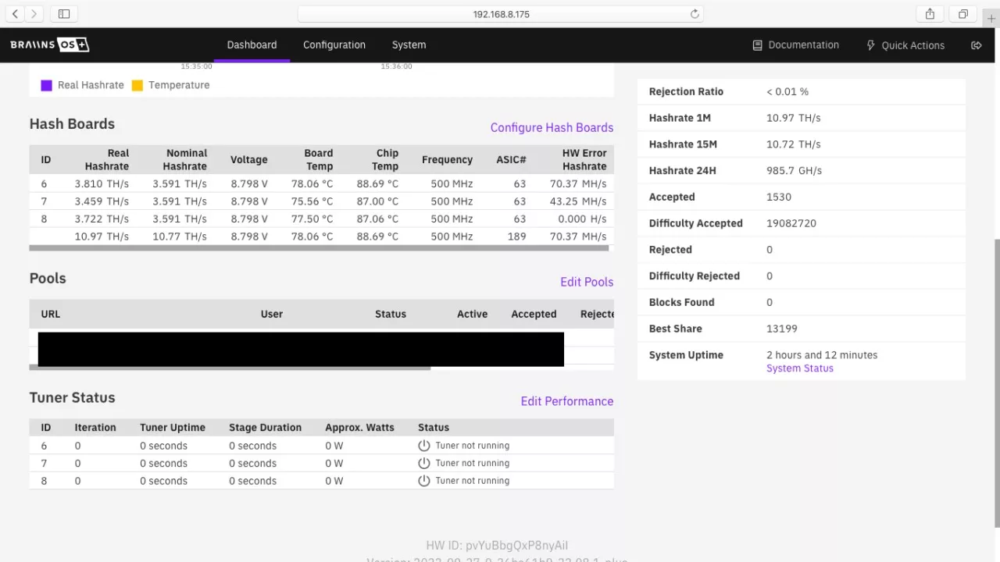

- さらに下には、各ハッシュボードの詳細ビューがあります。ボードとその中に含まれるチップの平均温度、電圧、および周波数。
- Poolsにおけるアクティブなマイニングプールの詳細。
- Tuner Statusにおけるオートチューニングの状態。
- 右側には、プールに送信されたシェアの詳細があります。

### 設定

### システム

### クイックアクション

プールの設定
マイニングプールを農業協同組合に例えることができます。農家が生産物を共同でプールすることで、供給と需要の変動を減らし、その結果、運営のためのより安定した収入を得ることができます。マイニングプールも同じように機能し、共同でプールされる原材料はハッシュです。実際に、単一の有効なハッシュの発見はブロックの作成を可能にし、現在6.25BTCプラスブロックに含まれる取引手数料の報酬、つまりコインベースの獲得を意味します。単独でマイニングする場合、ブロックを見つけたときにのみ報酬が与えられます。地球上の他のすべてのマイナーと競争しているため、この大きな宝くじに勝つチャンスは非常に少なく、成功の保証なしにマイナーの使用に関連する費用を支払う必要があります。マイニングプールは、複数（数千）のマイナーの計算能力をプールし、ブロックが見つかったときにプールのハッシュレートへの参加割合に基づいて報酬を分配することで、この問題に対処します。単独でブロックをマイニングするチャンスを視覚化するために、このツールを使用できます。Antminer S9の情報を入力すると、ブロックの作成を可能にするハッシュを見つけるチャンスは、各ブロックにつき24,777,849分の1、1日につき172,068分の1であることがわかります。平均して（ハッシュレートと難易度が一定の場合）、ブロックを見つけるのに471年かかります。
しかし、ビットコインのすべてが確率に関係しているため、時にはリスクを冒したソロマイナーが報酬を得ることがあります：ソロビットコインマイナーがわずか10TH/sのハッシュレートでブロックを解決し、非常にありそうもないオッズに勝利 - Decrypt

ギャンブルが好きなら試してみることもできますが、私たちのガイドはその方向には焦点を当てません。代わりに、暖房システムを作成するために私たちのニーズに最も適したマイニングプールに集中します。
マイニングプールを選択する際に考慮すべき点は、プールの報酬の仕組み（異なる場合があります）と、報酬をアドレスに引き出す前の最小額です。例えば、ここで話題にしているソフトウェアを提供しているBraiinsは、プールも提供しています。このプールには「Score」と呼ばれる報酬システムがあり、長期間マイニングするマイナーを奨励します。参加には活動時間要素が含まれ、「スコアリングハッシュレート」と表現されます。私たちの場合、数分間だけオンにできる暖房システムを求めているので、これは理想的な報酬システムではありません。私たちは、各参加に対して等しい報酬を与える報酬システムを好みます。さらに、Braiins Poolの最小引き出し額は100,000サトシで、オンチェーンです。したがって、取引手数料でいくつかのサトシを失い、冬の間に十分にマイニングしない場合、報酬の一部がロックされる可能性があります。

私たちが興味を持っている報酬モデルはPPSで、これは「ペイ・パー・シェア」を意味します。これは、マイナーが有効なシェアごとに報酬を受け取ることを意味します。このシステムにはFPPS（フルペイパーシェア）という変種もあり、コインベース報酬だけでなく、ブロックに含まれる取引手数料も分割します。マイニング/暖房を接続するために推奨するマイニングプールは、Linecoin Pool（FPPS）とNicehash（PPS）です。

- Nicehash: Nicehashの利点は、最小限の手数料でLightningを使用して引き出しができることです。さらに、最小引き出し額は2000サトシです。欠点は、Nicehashが最も利益の高いブロックチェーンのためにハッシュレートを使用し、ユーザーに実際の制御を与えないため、必ずしもビットコインのハッシュレートに参加するとは限らないことです。
- Linecoin：Linecoinの利点は、詳細なダッシュボード、より高いプライバシー保護のためのPaynym（BIP 47）を使用した引き出し機能、Telegramボットの統合、モバイルアプリケーションで直接設定可能な自動化の提供など、提供される機能の数です。このプールはBitcoinブロックのみをマイニングしますが、引き出しの最小額は100,000 satsと高めです。将来の記事でこれらのプールのインターフェースをより詳しく検討します。

Braiins OS+でプールを設定するには、選択したプールのいずれかでアカウントを作成する必要があります。ここではLinecoinの例を取り上げます：

アカウントを作成したら、「Connect To Pool」をクリックします。

次に、Stratumアドレスとユーザー名をコピーします：

これで、Braiins OS+インターフェースに戻ってこれらの認証情報を入力できます。パスワードについては、フィールドを空白のままにしておいても構いません。

### オーバークロックとアンダークロック

オーバークロックとオートチューニングは、ASICの性能を向上させるためにハッシュカードの周波数を調整することを含みます。両者の違いは、これらの周波数設定の複雑さにあります。

**オーバークロック**は、マシンのハッシュレートを増加させるためにハッシュカードの周波数を増加させる単純な調整です。一方、アンダークロックは、統合回路のクロック周波数をその公称周波数よりも低下させることを含みます。ASICのクロック周波数をアンダークロックによって減少させることで、ハードウェアによって生成される熱も減少します。これにより、ASICを適切な温度に保つために必要なファンの速度を減少させることができます。ファンの速度を減少させることで、ASICによって生成される騒音も減少します。これは、自宅でASICを使用し、マイニングハードウェアによって引き起こされる騒音の乱れを最小限に抑えたいと考えているユーザーにとって特に有用です。

アンダークロックがASICの性能の低下を招く可能性があるため、性能と騒音の良いバランスを見つけることが重要です。

Braiins OS+は、ASICのオーバークロック、アンダークロック、オートチューニングをサポートしています。これにより、ユーザーは自分の好みに応じて性能を最大化するか、エネルギーを節約するためにハードウェアのクロック周波数を柔軟に調整できます。

### オートチューニング

2018年以前、マイナーは活動で優位に立つために2つの方法を持っていました：合理的なコストで電力を見つけることと、より効率的なハードウェアを購入することです。しかし、2018年にマイニングソフトウェアおよびファームウェアの分野で新たな進歩が発見されました。それはAsicBoostと呼ばれる技術です。この技術により、マイナーはデバイスで実行されているファームウェアを変更することによって、約13％のコストを削減できます。
今日では、AsicBoostよりもさらに大きな利点を提供するソフトウェアおよびファームウェアマイニングセクターの新たな進歩であるオートチューニングがあります。ASICは、ハッシングを行う多くの小さなコンピュータチップで構成されています。これらのチップはシリコンで作られており、半導体やその他のマイクロエレクトロニクスコンポーネントに広く使用されている同じ元素です。ここでの重要な理解は、すべてのシリコンチップが同一ではないということです - 各チップはその電気的特性においてわずかに異なることがあります。ハードウェアメーカーはこれを知っており、その許容範囲の下限に基づいてマイニングマシンの性能仕様を公開しています。つまり、メーカーは平均的なチップに最適な周波数を知っており、この周波数をマシン内のすべてのチップに均一に使用します。
これは、マシンが持つことができるハッシュレートの上限を設定します。オートチューニングは、マシン全体を単一のユニットとして扱うのではなく、チップごとに最適な周波数を評価するアルゴリズムのプロセスです。これは、秒間により多くのハッシュを実行できる高品質のチップはより高い周波数を得られ、比較的少ないハッシュを実行できる低品質のチップはより低い周波数を得ることを意味します。チップレベルのオートチューニングは、基本的にASICのパフォーマンスを、それに搭載されているソフトウェアやファームウェアを通じて最適化する方法です。

その結果、電力1ワットあたりのハッシュレートが高くなり、これはマイナーにとってより大きな利益率を意味します。このタイプのソフトウェアがマシンに搭載されていない理由は、マシンのバリアンスが望ましくないためであり、顧客は自分たちが何を得ているのかを正確に知りたいと考えており、一台から別の台まで一貫性と予測可能なパフォーマンスを持たない製品を販売することはメーカーにとって悪い考えだからです。さらに、チップレベルのオートチューニングは、実装が複雑であるため、かなりの開発リソースを必要とします。メーカーはすでに自社のファームウェアの開発に多くのリソースを費やしています。Braiins OS+のような、オートチューニングを可能にするソフトウェアソリューションがあります。これにより、ASICのパフォーマンスが最大20%向上します。

> DecouvreBitcoinによって作成されたガイド、MINAGE 201に関する詳細情報 - JimとAjelex'のクレジット