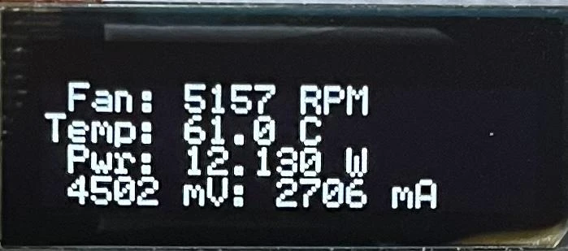

### Úvod

BitAxe je open-source projekt vytvořený Skotem a [dostupný na GitHubu](https://github.com/skot/bitaxe), který umožňuje cenově efektivní experimentování s těžbou.

Projekt reverse-engineeroval fungování slavného Antmineru S19 od společnosti Bitmain, tržního lídra v ASIC, specializovaných strojích pro těžbu bitcoinů. Nyní je možné tyto výkonné čipy použít v nových open-source projektech. Na rozdíl od Nerdmineru, BitAxe má dostatečný výpočetní výkon, aby bylo možné jej připojit k těžebnímu poolu, což vám umožní pravidelně vydělávat nějaké satoshi. Nerdminer na druhou stranu může být připojen pouze k tzv. solopoolu, který funguje jako los v loterii: máte malou šanci vyhrát celou odměnu za blok.

Existuje několik verzí BitAxe, s různými čipy a výkony:

| Série modelu Bitaxe      | ASIC čip | Použitý na                  | Očekávaný hash rate         | Ideální pro                                                                                                 |
| ------------------------ | --------- | --------------------------- | --------------------------- | ---------------------------------------------------------------------------------------------------------- |
| Bitaxe Max (série 100)   | 1 x BM1397| Antminer série 17           | 400 GH/s (až 450 GH/s)      | Začátečníky v těžbě bitcoinů, nabízí solidní hash rate s mírnou spotřebou energie.                         |
| Bitaxe Ultra (série 200) | 1 x BM1366| Antminer S19 XP a S19k Pro  | 500 GH/s (až 550 GH/s)      | Vážné těžaře, kteří chtějí vyvážit efektivitu a vyšší hash rate.                                           |
| Bitaxe Hex (série 300)   | 6 x BM1366| Antminer S19k Pro a S19 XP  | 3.0 TH/s (až 3.3 TH/s)      | Těžaře hledající škálovatelnost a vysoký výkon bez obětování efektivity.                                   |
| Bitaxe Supra (série 400) | 1 x BM1368| Antminer S21                | 600 GH/s (až 700 GH/s)      | Vášnivé nadšence hledající nejvyšší hash rate a efektivitu.                                               |

V tomto tutoriálu budeme používat BitAxe Ultra 204 vybavený čipem BM1366, používaný pro Antminer S19XP. Tento je již sestaven a nahrán firmwarem prodejcem.

### [Seznam prodejců je dostupný na této stránce](https://bitaxe.org/legit.html)

Obvykle je spolu s ním prodáván i zdroj napájení. Pokud ne, budete muset zakoupit napájecí zdroj s 5V jack kabelem a minimálně 4A.

### Konfigurace
Když poprvé zapojíte svůj BitAxe, pokusí se ve výchozím nastavení připojit k Wi-Fi síti. Po pěti pokusech zobrazí název vlastní Wi-Fi sítě, abyste se k ní mohli připojit a konfigurovat ji.
K tomu můžete použít jakýkoliv počítač nebo smartphone. Jděte do nastavení Wi-Fi, vyhledejte nové sítě a uvidíte Wi-Fi s názvem Bitaxe_XXXX. Zde je to `Bitaxe_A859`. Připojte se k této Wi-Fi síti a automaticky se otevře okno.

V tomto okně klikněte na tři malé vodorovné pruhy v levém horním rohu, poté na `Settings`.

Budete muset ručně zadat informace o své Wi-Fi síti, protože neexistuje systém automatického vyhledávání.

Uveďte proto SSID vaší Wi-Fi, tedy název vaší sítě, heslo, stejně jako informace o těžebním poolu, který jste si vybrali. Buďte opatrní, zde URL poolu není prezentována stejným způsobem. Například pro Braiins je poskytnutá URL poolu: `stratum+tcp://eu.stratum.braiins.com:3333`.

Jak můžete vidět na obrazovce, musíte odstranit části `stratum+tcp://` a `:3333`, necháte pouze `eu.stratum.braiins.com`. Poté do pole `Port` zadejte 4 číslice na konci URL poskytnuté poolem, ale bez `:`. Zde je to tedy `3333`.

V tomto tutoriálu používáme těžební pool Braiins, ale můžete si vybrat jiný. Naše tutoriály o těžebních poolech můžete najít [na webových stránkách PlanB Network](https://planb.network/en/tutorials/mining).

Dále do `User` zadejte svůj identifikátor a poté `Password`, obvykle je to `"x"` nebo `"Anything123"`.

Nastavení `Core Voltage` by mělo být ponecháno ve výchozím stavu `1200` a pro `Frequency` také ponechte původní hodnotu. Bude možné toto nastavení později upravit, aby se získal větší výpočetní výkon. Je však důležité zajistit, aby teplota čipu nepřekročila 65-70°C, protože BitAxe nemá systém pro snížení výkonu v případě přehřátí. Pokud teplota překročí 65°C příliš, mohlo by to poškodit váš BitAxe.

Jakmile správně zadáte všechna nastavení, klikněte na tlačítko `Save` dole, poté restartujte svůj BitAxe jednoduše tak, že ho odpojíte a znovu zapojíte.
Pokud jste své informace zadali správně, zařízení by se mělo rychle připojit k vaší Wi-Fi, poté k těžebnímu poolu a začít zobrazovat nějaké informace na svém malém displeji. Pravděpodobně to bude trvat několik minut, než se objeví na dashboardu těžebního poolu.
### Dashboard a Displej

Budou se střídat tři různé displeje. Na třetí stránce uvidíte informace `IP`, což je IP adresa, která vám umožní připojit se k dashboardu. Zde je adresa `192.168.1.19`.

  

Pro přístup k dashboardu jednoduše zadejte tuto adresu do vašeho internetového prohlížeče.

Na dashboardu najdete všechny informace zobrazené na malém displeji, které si nyní podrobně prohlédneme.

| Displej BitAxe | Dashboard                                   | Popis                                                                                                                                                                                                               |
| ------------- | ------------------------------------------- | ------------------------------------------------------------------------------------------------------------------------------------------------------------------------------------------------------------------------- |
| Gh            | Hashrate                                    | Aktuální výpočetní výkon, vyjádřený v GigaHash/s                                                                                                                                                                      |
| W/THs         | Účinnost                                    | To je účinnost vašeho BitAxe vyjádřená ve W/THs. Je to poměr mezi spotřebovanou elektrickou energií a vyrobeným výpočetním výkonem.                                                                          |
| A/R           | Shares                                      | Množství `Shares` odeslaných vaším BitAxe do poolu, reprezentující množství poskytnuté práce.                                                                                                                          |
| UT            | Uptime                                      | Čas, po který váš BitAxe pracuje bez přerušení (dostupné v levém menu pod `Logs`).                                                                                                                |
| BD            | Nejvyšší obtížnost                          | Maximální obtížnost dosažená od posledního restartu. Pro srovnání, aktuální obtížnost sítě je přibližně 85T.                                                                                                               |
| FAN           | Otáčky ventilátoru v boxu `Teplo`           | Rychlost otáčení ventilátoru, vyjádřená v otáčkách za minutu.                                                                                                                                                             |
| Temp          | Teplota ASIC v boxu `Teplo`                 | Teplota čipu, která by neměla překročit 65°C.                                                                                                                                                                             |
| Pwr           | Výkon                                        | Spotřeba energie ve wattech. Tato informace však nezahrnuje obrazovku, ventilátor ani zdroj napájení. Například když zobrazuje 11.7W, celková spotřeba je ve skutečnosti 15.8W.                                           |
| mV mA         | Vstupní napětí Vstupní proud                | Napětí a proud spotřebovaný strojem. Výkon ve wattech je roven napětí vynásobenému proudem.                                                                                                                               |
| FH            | Volná paměť Heap (levé menu -> `Logy`)      | Dostupná paměť.                                                                                                                                                                                                           |
| vCore         | Napětí ASIC (v boxu Výkon)                  | Napětí měřené na čipu ASIC.                                                                                                                                                                                               |
| IP            | NA                                           | IP adresa.                                                                                                                                                                                                                |
| V2.1.0        | Verze (levé menu -> `Logy`)                  | Verze firmware.                                                                                                                                                                                                           |
Můžete kdykoliv změnit nastavení Wi-Fi nebo těžebního poolu bez jakéhokoliv problému.
V závislosti na ventilaci a teplotě vašeho pokoje může být potřeba zvýšit nebo snížit výkon, aby teplota nepřekročila 65°C. Pokud zvýšíte výkon, vyděláte více satoshi, ale váš BitAxe také spotřebuje více elektřiny!