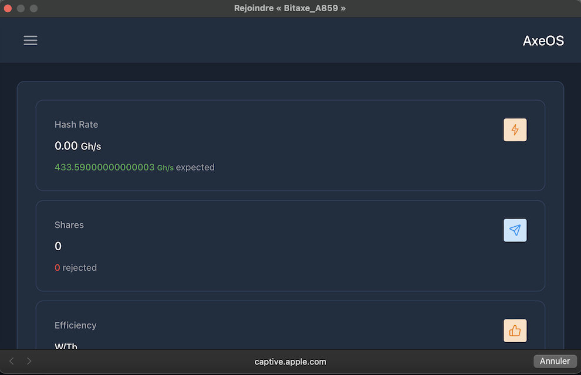
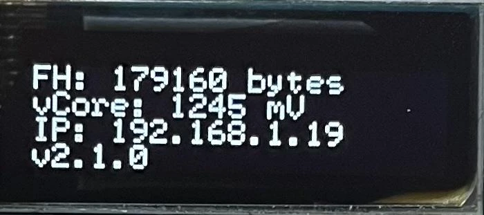
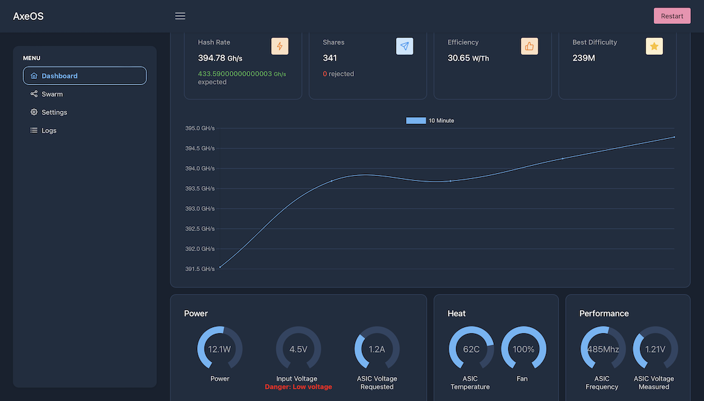

### Einführung

BitAxe ist ein Open-Source-Projekt, das von Skot erstellt und [auf GitHub verfügbar ist](https://github.com/skot/bitaxe), welches kosteneffektive Experimente im Mining ermöglicht.

Es hat die Funktionsweise des berühmten Antminer S19 von Bitmain, dem Marktführer bei ASICs, den spezialisierten Maschinen für das Bitcoin-Mining, reverse-engineered. Jetzt ist es möglich, diese leistungsstarken Chips in neuen Open-Source-Projekten zu verwenden. Im Gegensatz zum Nerdminer verfügt BitAxe über ausreichend Rechenleistung, um an einem Mining-Pool angeschlossen zu werden, was es Ihnen ermöglicht, regelmäßig einige Satoshis zu verdienen. Der Nerdminer hingegen kann nur an das sogenannte Solopool angeschlossen werden, das wie ein Lotterielos funktioniert: Sie haben eine geringe Chance, die volle Blockbelohnung zu gewinnen.

Es gibt mehrere Versionen von BitAxe, mit unterschiedlichen Chips und Leistungen:

| Bitaxe Modellreihe       | ASIC-Chip | Verwendet auf               | Erwartete Hashrate         | Ideal für                                                                                                 |
| ------------------------ | --------- | --------------------------- | -------------------------- | --------------------------------------------------------------------------------------------------------- |
| Bitaxe Max (Serie 100)   | 1 x BM1397| Antminer Serie 17           | 400 GH/s (bis zu 450 GH/s) | Bitcoin-Mining-Anfänger, bietet eine solide Hashrate mit moderatem Stromverbrauch.                        |
| Bitaxe Ultra (Serie 200) | 1 x BM1366| Antminer S19 XP und S19k Pro| 500 GH/s (bis zu 550 GH/s) | Ernstzunehmende Miner, die Effizienz und höhere Hashrate ausgleichen möchten.                             |
| Bitaxe Hex (Serie 300)   | 6 x BM1366| Antminer S19k Pro und S19 XP| 3,0 TH/s (bis zu 3,3 TH/s) | Miner, die Skalierbarkeit und hohe Leistung ohne Einbußen bei der Effizienz suchen.                       |
| Bitaxe Supra (Serie 400) | 1 x BM1368| Antminer S21                | 600 GH/s (bis zu 700 GH/s) | Begeisterte Enthusiasten, die die höchsten Hashraten und Effizienz suchen.                                |

In diesem Tutorial werden wir ein BitAxe Ultra 204 verwenden, das mit einem BM1366-Chip ausgestattet ist, der für den Antminer S19XP verwendet wird. Dieses ist bereits vom Händler montiert und geflasht.

### [Die Liste der Händler ist auf dieser Seite verfügbar](https://bitaxe.org/legit.html)

In der Regel wird es mit einem Netzteil verkauft. Wenn nicht, müssen Sie ein Netzteil mit einem 5V-Klinkenkabel und mindestens 4A kaufen.

### Konfiguration
Wenn Sie Ihr BitAxe zum ersten Mal anschließen, wird es standardmäßig versuchen, eine Verbindung zu einem Wi-Fi-Netzwerk herzustellen. Nach fünf Versuchen wird es den Namen seines eigenen Wi-Fi-Netzwerks anzeigen, sodass Sie sich damit verbinden und es konfigurieren können.
Dazu können Sie jeden Computer oder Smartphone verwenden. Gehen Sie zu Ihren Wi-Fi-Einstellungen, suchen Sie nach neuen Netzwerken, und Sie werden ein Wi-Fi namens Bitaxe_XXXX sehen. Hier ist es `Bitaxe_A859`. Verbinden Sie sich mit diesem Wi-Fi-Netzwerk, und ein Fenster wird sich automatisch öffnen.

In diesem Fenster klicken Sie auf die drei kleinen horizontalen Balken oben links, dann auf `Settings`.

Sie müssen Ihre Wi-Fi-Netzwerkinformationen manuell eingeben, da es kein automatisches Erkennungssystem gibt.

Geben Sie daher die SSID des WLANs an, also den Namen Ihres Netzwerks, das Passwort sowie die Informationen des Mining-Pools, den Sie gewählt haben. Achten Sie darauf, dass die URL des Pools hier nicht auf die gleiche Weise präsentiert wird. Zum Beispiel wird für Braiins die Pool-URL wie folgt angegeben: `stratum+tcp://eu.stratum.braiins.com:3333`.

Wie Sie auf dem Bildschirm sehen können, müssen Sie die Teile `stratum+tcp://` und `:3333` entfernen, sodass nur `eu.stratum.braiins.com` übrig bleibt. Geben Sie dann im Feld `Port` die 4 Ziffern am Ende der vom Pool gegebenen URL ein, aber ohne das `:`. Hier ist es also `3333`.

In diesem Tutorial verwenden wir den Braiins-Mining-Pool, aber Sie können gerne einen anderen wählen. Unsere Tutorials zu Mining-Pools finden Sie [auf der PlanB Network-Website](https://planb.network/en/tutorials/mining).

Geben Sie als Nächstes in `User` Ihren Identifikator ein und dann das `Password`, üblicherweise ist es `"x"` oder `"Anything123"`.

Die Einstellung `Core Voltage` sollte standardmäßig auf `1200` belassen werden, und für `Frequency` lassen Sie ebenfalls zunächst den Standardwert. Es wird möglich sein, diese Einstellung später anzupassen, um mehr Rechenleistung zu erhalten. Es ist jedoch wichtig sicherzustellen, dass die Temperatur des Chips 65-70°C nicht überschreitet, da der BitAxe kein System zur Leistungsreduzierung im Falle einer Überhitzung hat. Wenn die Temperatur 65°C zu stark überschreitet, könnte dies Ihren BitAxe beschädigen.

Sobald Sie alle Einstellungen korrekt eingegeben haben, klicken Sie unten auf den `Save`-Button und starten Sie Ihren BitAxe neu, indem Sie ihn einfach aus- und wieder einstecken.
Wenn Sie Ihre Informationen korrekt eingegeben haben, sollte das Gerät schnell eine Verbindung zu Ihrem WLAN und dann zum Mining-Pool herstellen und beginnen, einige Informationen auf seinem kleinen Bildschirm anzuzeigen. Es wird wahrscheinlich einige Minuten dauern, bis es auf dem Dashboard des Mining-Pools erscheint.
### Dashboard und Bildschirm

Drei verschiedene Anzeigen werden durchlaufen. Auf der dritten Seite sehen Sie die `IP`-Informationen, die die IP-Adresse ist, mit der Sie sich mit dem Dashboard verbinden können. Hier ist die Adresse `192.168.1.19`.

  

Um auf das Dashboard zuzugreifen, geben Sie einfach diese Adresse in Ihren Internetbrowser ein.

Auf dem Dashboard finden Sie alle Informationen, die auf dem kleinen Bildschirm angezeigt werden, die wir uns jetzt im Detail ansehen werden.

| BitAxe-Bildschirm | Dashboard                                   | Beschreibung                                                                                                                                                                                                               |
| ----------------- | ------------------------------------------- | ------------------------------------------------------------------------------------------------------------------------------------------------------------------------------------------------------------------------- |
| Gh                | Hashrate                                    | Die aktuelle Rechenleistung, ausgedrückt in GigaHash/s                                                                                                                                                                      |
| W/THs             | Effizienz                                   | Dies ist die Effizienz Ihres BitAxe, ausgedrückt in W/THs. Es ist das Verhältnis zwischen dem elektrischen Verbrauch und der erzeugten Rechenleistung.                                                                          |
| A/R               | Shares                                      | Menge der `Shares`, die Ihr BitAxe an den Pool gesendet hat, repräsentiert die Menge der geleisteten Arbeit.                                                                                                                          |
| UT                | Betriebszeit                                | Zeit, seit Ihr BitAxe ohne Unterbrechung betrieben wird (verfügbar im linken Menü unter `Logs`).                                                                                                                |
| BD            | Beste Schwierigkeit                         | Maximale Schwierigkeit, die seit dem letzten Neustart erreicht wurde. Zum Vergleich: Die aktuelle Netzwerkschwierigkeit liegt bei etwa 85T.                                                                                                          |
| FAN           | FAN im `Heat`-Feld                         | Drehgeschwindigkeit des Lüfters, ausgedrückt in Umdrehungen pro Minute.                                                                                                                                                   |
| Temp          | ASIC-Temperatur im `Heat`-Feld             | Chip-Temperatur, die 65°C nicht überschreiten sollte.                                                                                                                                                                     |
| Pwr           | Leistung                                   | Verbrauchte Leistung in Watt. Diese Information berücksichtigt jedoch nicht den Bildschirm, den Lüfter oder das Netzteil. Zum Beispiel, wenn es 11,7W anzeigt, beträgt der tatsächliche Gesamtverbrauch eigentlich 15,8W. |
| mV mA         | Eingangsspannung Eingangsstrom             | Spannung und Strom, die von der Maschine verbraucht werden. Die Leistung in Watt entspricht der Spannung multipliziert mit dem Strom.                                                                                     |
| FH            | Freier Heap-Speicher (linkes Menü -> `Logs`) | Der verfügbare Speicher.                                                                                                                                                                                                  |
| vCore         | ASIC-Spannung (im Performance-Feld)        | Am ASIC-Chip gemessene Spannung.                                                                                                                                                                                          |
| IP            | NA                                          | IP-Adresse.                                                                                                                                                                                                               |
| V2.1.0        | Version (linkes Menü -> `Logs`)             | Firmware-Version.                                                                                                                                                                                                         |
Sie können die Wi-Fi- oder Pool-Einstellungen jederzeit ohne Probleme ändern.
Abhängig von der Belüftung und der Temperatur Ihres Raums müssen Sie möglicherweise die Leistung erhöhen oder verringern, damit die Temperatur 65°C nicht überschreitet. Wenn Sie die Leistung erhöhen, werden Sie mehr Satoshis verdienen, aber Ihr BitAxe wird auch mehr Strom verbrauchen!