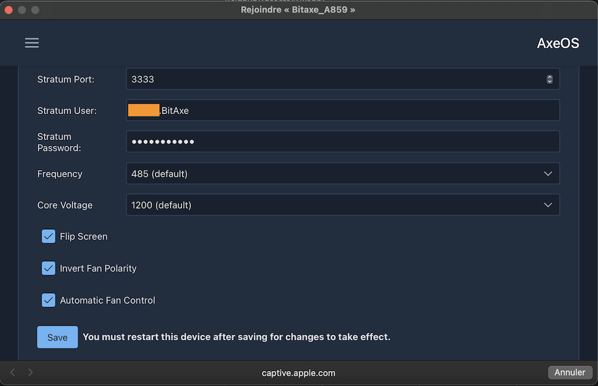
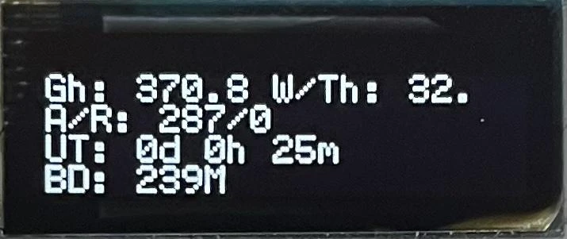

### Sissejuhatus

BitAxe on Skoti loodud avatud lähtekoodiga projekt, mis on [saadaval GitHubis](https://github.com/skot/bitaxe) ja võimaldab kuluefektiivset kaevandamise eksperimenteerimist.

See on tagurpidi insenereerinud kuulsa Bitmaini Antminer S19 tööpõhimõtted, turuliidri ASICutes, spetsialiseeritud masinates bitcoinide kaevandamiseks. Nüüd on võimalik neid võimsaid kiipe kasutada uutes avatud lähtekoodiga projektides. Erinevalt Nerdminerist, on BitAxel piisavalt arvutusvõimsust, et ühenduda kaevandusbasseiniga, mis võimaldab sul regulaarselt teenida mõningaid satoshi'sid. Nerdminer seevastu saab ühendada ainult nn solopooliga, mis toimib nagu loteriipilet: sul on väike võimalus võita kogu ploki auhind.

BitAxel on mitu versiooni, erinevate kiipide ja jõudlusega:

| Bitaxe mudeliseeria      | ASIC kiip | Kasutusel                     | Oodatav hashimise kiirus          | Ideaalne                                                                                                  |
| ------------------------ | --------- | --------------------------- | --------------------------- | ---------------------------------------------------------------------------------------------------------- |
| Bitaxe Max (seeria 100)  | 1 x BM1397| Antminer seeria 17          | 400 GH/s (kuni 450 GH/s)   | Bitcoinide kaevandamise algajad, pakkudes kindlat hashimise kiirust mõõduka energiatarbimisega.                      |
| Bitaxe Ultra (seeria 200)| 1 x BM1366| Antminer S19 XP ja S19k Pro| 500 GH/s (kuni 550 GH/s)   | Tõsised kaevurid, kes soovivad tasakaalustada efektiivsust ja kõrgemat hashimise kiirust.                                          |
| Bitaxe Hex (seeria 300)  | 6 x BM1366| Antminer S19k Pro ja S19 XP| 3.0 TH/s (kuni 3.3 TH/s)   | Kaevurid, kes otsivad skaleeritavust ja kõrget jõudlust ilma efektiivsust ohverdamata.                             |
| Bitaxe Supra (seeria 400)| 1 x BM1368| Antminer S21                | 600 GH/s (kuni 700 GH/s)   | Tõsised entusiastid, kes otsivad kõrgeimaid hashimise kiirusi ja efektiivsust.                                         |

Selles juhendis kasutame BitAxe Ultra 204, mis on varustatud BM1366 kiibiga, mida kasutatakse Antminer S19XP jaoks. See on juba kokku pandud ja jaemüüja poolt välklambiga varustatud.

### [Jaemüüjate nimekiri on saadaval sellel lehel](https://bitaxe.org/legit.html)

Üldiselt müüakse seda koos toiteallikaga. Kui mitte, peate ostma toiteallika, millel on 5V pistikukaabel ja vähemalt 4A.

### Konfiguratsioon
Kui ühendate oma BitAxe esimest korda, üritab see vaikimisi ühenduda Wi-Fi võrguga. Pärast viit katset kuvab see oma Wi-Fi võrgu nime, et saaksite sellega ühenduda ja seda seadistada.
Selleks võite kasutada mis tahes arvutit või nutitelefoni. Minge oma Wi-Fi seadetesse, otsige uusi võrke ja näete Wi-Fi võrku nimega Bitaxe_XXXX. Siin on see `Bitaxe_A859`. Ühendage see Wi-Fi võrguga ja automaatselt avaneb aken.

Selles aknas klõpsake üleval vasakul asuvatel kolmel väikesel horisontaalsel ribal, seejärel klõpsake `Settings`.

Peate käsitsi sisestama oma Wi-Fi võrgu teabe, kuna automaatset avastamissüsteemi ei ole.

Seega sisestage oma Wi-Fi SSID, ehk teie võrgu nimi, parool, samuti valitud kaevandusbasseini info. Olge ettevaatlik, siin ei esitata basseini URL-i samal viisil. Näiteks Braiinsi puhul on basseini antud URL: `stratum+tcp://eu.stratum.braiins.com:3333`.

Nagu ekraanil näha, peate eemaldama `stratum+tcp://` ja `:3333` osad, jättes alles ainult `eu.stratum.braiins.com`. Seejärel sisestage `Port` väljale URL-i lõpus olevad 4 numbrit, kuid ilma `:`. Siin on see seega `3333`.

Selles õpetuses kasutame Braiinsi kaevandusbasseini, kuid võite vabalt valida mõne teise. Meie õpetusi kaevandusbasseinide kohta leiate [PlanB Network veebisaidilt](https://planb.network/en/tutorials/mining).

Järgmisena sisestage `User` väljale teie identifikaator ja seejärel `Password`, tavaliselt on see `"x"` või `"Anything123"`.

`Core Voltage` seadistus tuleks jätta vaikimisi `1200` peale ja `Frequency` samuti algväärtusele. Seda seadistust on võimalik hiljem kohandada, et saada rohkem arvutusvõimsust. Siiski on oluline tagada, et kiibi temperatuur ei ületaks 65-70°C, kuna BitAxel ei ole süsteemi jõudluse vähendamiseks ülekuumenemise korral. Kui temperatuur ületab liiga palju 65°C, võib see teie BitAxe kahjustada.

Kui olete kõik seaded õigesti sisestanud, klõpsake allpool olevat `Save` nuppu, seejärel taaskäivitage oma BitAxe lihtsalt välja tõmmates ja tagasi ühendades.
Kui olete oma andmed õigesti sisestanud, peaks seade kiiresti ühenduma teie Wi-Fi'ga, seejärel kaevandusbasseiniga ja hakkama väikesel ekraanil kuvama teavet. Ilmselt kulub mõni minut, enne kui see kaevandusbasseini armatuurlaual kuvatakse.
### Armatuurlaud ja ekraan

Läbi keritakse kolm erinevat kuvamist. Kolmandal lehel näete `IP` teavet, mis on IP-aadress, mis võimaldab teil armatuurlauaga ühendust luua. Siin on aadress `192.168.1.19`.

  

Armatuurlauale pääsemiseks sisestage see aadress lihtsalt oma internetibrauserisse.

Armatuurlaual leiate kogu väikesel ekraanil kuvatava teabe, mida me nüüd üksikasjalikult vaatame.

| BitAxe ekraan | Armatuurlaud                                 | Kirjeldus                                                                                                                                                                                                               |
| ------------- | ------------------------------------------- | ------------------------------------------------------------------------------------------------------------------------------------------------------------------------------------------------------------------------- |
| Gh            | Hashrate                                    | Praegune arvutusvõimsus, väljendatuna GigaHash/s                                                                                                                                                                      |
| W/THs         | Efektiivsus                                 | See on teie BitAxe efektiivsus väljendatuna W/THs. See on suhe elektrienergia tarbimise ja toodetud arvutusvõimsuse vahel.                                                                          |
| A/R           | Osa                                        | `Osa` hulk, mille teie BitAxe on basseinile saatnud, esindades tehtud töö hulka.                                                                                                                          |
| UT            | Tööaeg                                      | Aeg, mille jooksul teie BitAxe on töötanud ilma katkestusteta (saadaval vasakus menüüs `Logid` all).                                                                                                                |
| BD            | Parim Raskusaste                             | Maksimaalne raskusaste alates viimasest taaskäivitusest. Võrdluseks, praegune võrgu raskusaste on umbes 85T.                                                                                                          |
| FAN           | Ventilaator `Kuumus` kastis                       | Ventilaatori pöörlemiskiirus, väljendatuna pööretes minutis.                                                                                                                                                                    |
| Temp          | ASIC temperatuur `Kuumus` kastis          | Kiibi temperatuur, mis ei tohiks ületada 65°C.                                                                                                                                                                           |
| Pwr           | Võimsus                                       | Tarbitud võimsus vattides. Siiski ei võeta seda teavet arvesse ekraani, ventilaatori või toiteallika puhul. Näiteks kui see näitab 11.7W, on tegelik kogutarbimine tegelikult 15.8W.                    |
| mV mA         | Sisendpinge Sisendvool                 | Masina tarbitud pinge ja vool. Võimsus vattides on võrdne pinge korrutatuna vooluga.                                                                                                        |
| FH            | Vaba Heap Mälu (vasak menüü -> `Logid`)      | Saadaval olev mälu.                                                                                                                                                                                                     |
| vCore         | ASIC Pinge (`Jõudlus` kastis)               | ASIC kiibil mõõdetud pinge.                                                                                                                                                                                        |
| IP            | NA                                          | IP Aadress.                                                                                                                                                                                                               |
| V2.1.0       | Versioon (vasak menüü -> `Logid`)               | Püsivara versioon.                                                                                                                                                                                                         |
Wi-Fi või basseini seadeid saab igal ajal probleemideta muuta.
Olenevalt ventilatsioonist ja teie toa temperatuurist võib teil olla vaja jõudlust suurendada või vähendada, et temperatuur ei ületaks 65°C. Kui suurendate jõudlust, teenite rohkem satoshi'sid, kuid teie BitAxe tarbib ka rohkem elektrit!