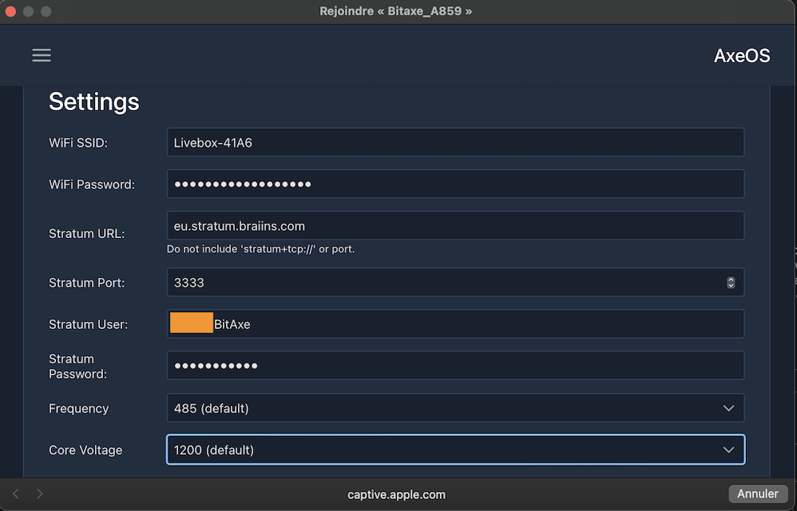

### Johdanto

BitAxe on Skotin luoma avoimen lähdekoodin projekti, joka on [saatavilla GitHubissa](https://github.com/skot/bitaxe) ja mahdollistaa kustannustehokkaan louhintaeksperimentoinnin.

Se on päätynyt purkamaan kuuluisan Bitmainin Antminer S19:n toimintaperiaatteet, joka on markkinajohtaja ASIC-laitteissa, erikoistuneissa koneissa bitcoinien louhintaan. Nyt on mahdollista käyttää näitä tehokkaita piirejä uusissa avoimen lähdekoodin projekteissa. Toisin kuin Nerdminer, BitAxella on riittävästi laskentatehoa liittyäkseen louhintapooliin, mikä mahdollistaa säännöllisen satoshien ansaitsemisen. Nerdminer puolestaan voidaan liittää vain niin kutsuttuun solopooliin, joka toimii kuin arpajaislippu: sinulla on pieni mahdollisuus voittaa koko lohkopalkkio.

BitAxesta on useita versioita, joissa on erilaisia piirejä ja suorituskykyjä:

| Bitaxe-mallisto           | ASIC-piiri | Käytetty mallissa            | Odotettu louhintanopeus    | Ihanteellinen                                                                                              |
| ------------------------ | --------- | --------------------------- | --------------------------- | ---------------------------------------------------------------------------------------------------------- |
| Bitaxe Max (Sarja 100)   | 1 x BM1397| Antminer-sarja 17           | 400 GH/s (jopa 450 GH/s)   | Bitcoin-louhinnan aloittelijoille, tarjoaa vankan louhintanopeuden kohtuullisella tehonkulutuksella.       |
| Bitaxe Ultra (Sarja 200) | 1 x BM1366| Antminer S19 XP ja S19k Pro | 500 GH/s (jopa 550 GH/s)   | Vakavasti louhintaan suhtautuville, jotka pyrkivät tasapainottamaan tehokkuutta ja korkeampaa louhintanopeutta. |
| Bitaxe Hex (Sarja 300)   | 6 x BM1366| Antminer S19k Pro ja S19 XP | 3.0 TH/s (jopa 3.3 TH/s)   | Louhijat, jotka etsivät skaalautuvuutta ja korkeaa suorituskykyä tinkimättä tehokkuudesta.                 |
| Bitaxe Supra (Sarja 400) | 1 x BM1368| Antminer S21                | 600 GH/s (jopa 700 GH/s)   | Vakavat harrastajat, jotka etsivät korkeimpia louhintanopeuksia ja tehokkuutta.                            |

Tässä oppaassa käytämme BitAxe Ultra 204 -mallia, jossa on BM1366-piiri, käytössä Antminer S19XP:ssä. Tämä yksikkö on jo koottu ja ohjelmoitu myyjän toimesta.

### [Jälleenmyyjien lista on saatavilla tällä sivulla](https://bitaxe.org/legit.html)

Yleensä virtalähde myydään sen mukana. Jos ei, sinun on hankittava virtalähde, jossa on 5V jakkiliitäntä ja vähintään 4A.

### Konfigurointi
Kun kytket BitAxesi ensimmäisen kerran, se yrittää automaattisesti yhdistää Wi-Fi-verkkoon. Viiden yrityksen jälkeen se näyttää oman Wi-Fi-verkkonsa nimen, jotta voit yhdistää siihen ja konfiguroida sen.
Tähän voit käyttää mitä tahansa tietokonetta tai älypuhelinta. Siirry Wi-Fi-asetuksiisi, etsi uusia verkkoja, ja näet Wi-Fi-verkon nimeltä Bitaxe_XXXX. Tässä tapauksessa se on `Bitaxe_A859`. Yhdistä tähän Wi-Fi-verkkoon, ja ikkuna avautuu automaattisesti.

Tässä ikkunassa, klikkaa kolmea pientä vaakasuoraa viivaa vasemmassa yläkulmassa, sitten `Settings`.

Sinun on manuaalisesti syötettävä Wi-Fi-verkkosi tiedot, sillä automaattista löytöjärjestelmää ei ole.

Ilmoita siis Wi-Fi:n SSID eli verkkosi nimi, salasana sekä valitsemasi louhintapoolin tiedot. Ole varovainen, sillä tässä poolin URL ei esitetä samalla tavalla. Esimerkiksi Braiinsille annettu poolin URL on: `stratum+tcp://eu.stratum.braiins.com:3333`.

Kuten näytöllä näkyy, sinun täytyy poistaa `stratum+tcp://` ja `:3333` osat, jättäen vain `eu.stratum.braiins.com`. Sen jälkeen `Port`-kenttään syötetään poolin antaman URL:n lopussa olevat 4 numeroa, mutta ilman `:`-merkkiä. Tässä tapauksessa se on siis `3333`.

Tässä oppaassa käytämme Braiinsin louhintapoolia, mutta voit vapaasti valita toisen. Löydät oppaamme louhintapooleista [PlanB Network -verkkosivustolta](https://planb.network/en/tutorials/mining).

Seuraavaksi `User`-kenttään syötetään tunnisteesi ja sitten `Password`, yleensä se on `"x"` tai `"Anything123"`.

`Core Voltage`-asetuksen tulisi oletusarvoisesti olla `1200`, ja `Frequency`lle jätä myös aluksi oletusarvo. Tätä asetusta on mahdollista säätää myöhemmin saadaksesi enemmän laskentatehoa. On kuitenkin tärkeää varmistaa, että piirin lämpötila ei ylitä 65-70°C, koska BitAxella ei ole järjestelmää suorituskyvyn alentamiseksi ylikuumenemisen sattuessa. Jos lämpötila ylittää 65°C liikaa, se saattaa vahingoittaa BitAxeasi.

Kun olet syöttänyt kaikki asetukset oikein, napsauta alhaalla olevaa `Save`-painiketta, ja käynnistä BitAxesi uudelleen yksinkertaisesti irrottamalla se ja kytke se takaisin.
Jos olet syöttänyt tietosi oikein, laitteen pitäisi nopeasti yhdistää Wi-Fiisi, sitten louhintapooliin, ja alkaa näyttää tietoja pienellä näytöllään. Sen ilmestyminen louhintapoolin hallintapaneeliin saattaa kestää muutaman minuutin.
### Hallintapaneeli ja Näyttö

Näytöllä vierii kolme erilaista näkymää. Kolmannella sivulla näet `IP`-tiedot, jotka ovat IP-osoite, jonka avulla voit yhdistää hallintapaneeliin. Tässä tapauksessa osoite on `192.168.1.19`.

  

Hallintapaneeliin pääset syöttämällä tämän osoitteen internet-selaimeesi.

Hallintapaneelissa löydät kaikki tiedot, jotka näkyvät pienellä näytöllä, ja nyt käymme ne yksityiskohtaisesti läpi.

| BitAxe-näyttö | Hallintapaneeli                             | Kuvaus                                                                                                                                                                                                                   |
| ------------- | ------------------------------------------- | ------------------------------------------------------------------------------------------------------------------------------------------------------------------------------------------------------------------------- |
| Gh            | Hashrate                                    | Nykyinen laskentateho, ilmaistuna GigaHash/s                                                                                                                                                                             |
| W/THs         | Tehokkuus                                   | BitAxesi tehokkuus ilmaistuna W/THs. Se on sähkönkulutuksen ja tuotetun laskentatehon välinen suhde.                                                                                                                      |
| A/R           | Osuudet                                     | `Osuudet`, jotka BitAxesi on lähettänyt poolille, edustavat tarjottua työmäärää.                                                                                                                                         |
| UT            | Käyttöaika                                  | Aika, jonka BitAxesi on toiminut keskeytyksettä (saatavilla vasemmassa valikossa kohdassa `Logs`).                                                                                                                       |
| BD            | Paras Vaikeustaso                           | Suurin vaikeustaso saavutettu viimeisen uudelleenkäynnistyksen jälkeen. Vertailun vuoksi, nykyinen verkon vaikeustaso on noin 85T.                                                                                         |
| FAN           | Tuuletin `Lämpö`-laatikossa                | Tuulettimen pyörimisnopeus, ilmaistuna kierroksina minuutissa.                                                                                                                                                           |
| Temp          | ASIC-lämpötila `Lämpö`-laatikossa          | Piirin lämpötila, joka ei saisi ylittää 65°C.                                                                                                                                                                            |
| Pwr           | Teho                                        | Kulutettu teho watteina. Tämä tieto ei kuitenkaan ota huomioon näyttöä, tuuletinta tai virtalähdettä. Esimerkiksi kun se näyttää 11.7W, kokonaiskulutus on itse asiassa 15.8W.                                          |
| mV mA         | Syöttöjännite Syöttövirta                  | Koneen kuluttama jännite ja virta. Teho watteina on yhtä suuri kuin jännite kerrottuna virralla.                                                                                                                         |
| FH            | Vapaa Heap-muisti (vasen valikko -> `Lokit`) | Käytettävissä oleva muisti.                                                                                                                                                                                               |
| vCore         | ASIC-jännite (Suorituskyky-laatikossa)      | ASIC-piirillä mitattu jännite.                                                                                                                                                                                           |
| IP            | NA                                          | IP-osoite.                                                                                                                                                                                                                |
| V2.1.0        | Versio (vasen valikko -> `Lokit`)           | Firmwaren versio.                                                                                                                                                                                                        |
Voit milloin tahansa muuttaa Wi-Fi- tai allasasetuksia ilman ongelmia.  
Riippuen ilmanvaihdosta ja huoneesi lämpötilasta, saatat tarvita suorituskyvyn lisäämistä tai vähentämistä, jotta lämpötila ei ylitä 65°C. Jos lisäät suorituskykyä, tienaat enemmän satosheja, mutta BitAxe kuluttaa myös enemmän sähköä!