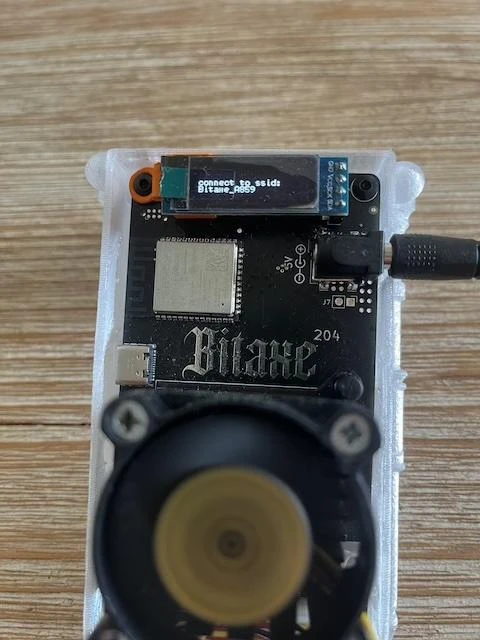
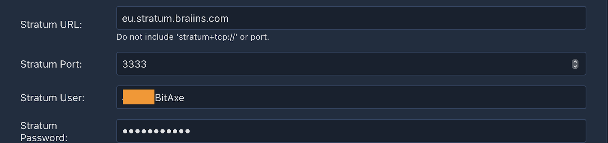

### Présentation

BitAxe est un projet open source créé par Skot et [disponible sur GitHub](https://github.com/skot/bitaxe) qui permet d'expérimenter le minage à moindre coût.

Il a rétro-ingénieré le fonctionnement des célèbres Antminer S19 de Bitmain, leader du marché des ASICs, les machines spécialisées pour le minage de bitcoins. Désormais, il est possible d'utiliser ces puces puissantes dans de nouveaux projets open source. Contrairement au Nerdminer, le BitAxe possède une puissance de calcul suffisante pour être connecté à une pool de minage, ce qui vous permettra de récupérer régulièrement quelques satoshis. Le Nerdminer lui ne peut être connecté qu'à ce qu’on appelle une solopool, qui fonctionne comme une sorte de ticket de loto : vous avez une chance infime de remporter la récompense complète d'un bloc.

Il existe plusieurs versions du BitAxe, avec différentes puces et performances :

| Série de Modèles Bitaxe  | Puce ASIC  | Utilisé Sur                 | Taux de Hachage Attendu     | Idéal Pour                                                                                                   |
| ------------------------ | ---------- | --------------------------- | --------------------------- | ------------------------------------------------------------------------------------------------------------ |
| Bitaxe Max (Série 100)   | 1 x BM1397 | Antminer Série 17           | 400 GH/s (jusqu'à 450 GH/s) | Débutants en minage de Bitcoin, offrant un taux de hachage solide avec une consommation énergétique modérée. |
| Bitaxe Ultra (Série 200) | 1 x BM1366 | Antminer S19 XP et S19k Pro | 500 GH/s (jusqu'à 550 GH/s) | Mineurs sérieux visant à équilibrer efficacité et taux de hachage plus élevé.                                |
| Bitaxe Hex (Série 300)   | 6 x BM1366 | Antminer S19k Pro et S19 XP | 3,0 TH/s (jusqu'à 3,3 TH/s) | Mineurs recherchant évolutivité et haute performance sans sacrifier l'efficacité.                            |
| Bitaxe Supra (Série 400) | 1 x BM1368 | Antminer S21                | 600 GH/s (jusqu'à 700 GH/s) | Enthousiastes sérieux cherchant les taux de hachage et l'efficacité les plus élevés.                         |

Dans ce tutoriel, nous utiliserons un BitAxe Ultra 204 équipé d'une puce BM1366, utilisée pour les Antminer S19XP. Celui-ci est déjà monté et flashé par le revendeur.

### [La liste des revendeurs est disponible sur cette page](https://bitaxe.org/legit.html)

Généralement, l'alimentation est vendue avec. Si ce n'est pas le cas, vous devrez acheter une alimentation avec un câble jack de 5 V et au moins 4A.

### Paramétrage

Lorsque vous branchez votre BitAxe pour la première fois, il essaiera de se connecter à un réseau Wi-Fi par défaut. Après cinq tentatives, il affichera le nom de son propre réseau Wi-Fi pour que vous puissiez vous y connecter et le paramétrer.

Pour cela, vous pouvez utiliser n'importe quel ordinateur ou smartphone. Allez dans vos paramètres Wi-Fi, explorez les nouveaux réseaux, et vous verrez un Wi-Fi appelé Bitaxe_XXXX. Ici, il s’agit de `Bitaxe_A859`. Connectez-vous à ce réseau Wi-Fi, et une fenêtre s'ouvrira automatiquement.

Dans cette fenêtre, cliquez sur les trois petites barres horizontales en haut à gauche, puis sur `Settings`.

Vous devrez renseigner manuellement les informations de votre réseau Wi-Fi, car il n'y a pas de système de découverte automatique.

Indiquez donc le SSID du Wi-Fi, c'est-à-dire le nom de votre réseau, le mot de passe, ainsi que les informations de la pool de minage que vous avez choisie. Attention, ici l'URL de la pool n'est pas tout à fait présentée de la même manière. Par exemple, pour Braiins, l’URL de la pool fournie est : `stratum+tcp://eu.stratum.braiins.com:3333`.

Comme vous pouvez le voir sur l’écran, il faut supprimer la partie `stratum+tcp://` et `:3333` pour ne laisser que `eu.stratum.braiins.com`. Ensuite, dans le champ `Port`, renseignez les 4 chiffres à la fin de l’URL donnée par la pool, mais sans les `:`. Ici, c’est donc `3333`.

Dans ce tutoriel, nous utilisons la pool de minage Braiins, mais vous êtes libre d'en choisir une autre. Vous pouvez retrouver nos tutoriels sur les pools de minage [sur le site de PlanB Network](https://planb.network/en/tutorials/mining).

Ensuite, dans `User`, renseignez votre identifiant puis le `Password`, généralement, il s'agit de `"x"` ou `"Anything123"`.

Le paramètre `Core Voltage` doit être laissé à `1200` par défaut, et pour `Frequency`, laissez également la valeur par défaut dans un premier temps. Il sera possible de modifier ce paramètre plus tard pour obtenir plus de puissance de calcul. Cependant, il faudra veiller à ce que la température de la puce ne dépasse pas 65-70°C, car le BitAxe n'a pas de système pour réduire les performances en cas de surchauffe. Si la température dépasse trop les 65°C, cela pourrait endommager votre BitAxe.

Une fois que vous avez bien renseigné tous les paramètres, cliquez sur le bouton `Save` en bas, puis redémarrez votre BitAxe simplement en le débranchant puis en le rebranchant.

Si vous avez correctement saisi vos informations, l'appareil devrait se connecter rapidement à votre Wi-Fi, puis à la pool de minage, et commencer à afficher certaines informations sur son petit écran. Il faudra probablement quelques minutes pour qu'il apparaisse sur le dashboard de la pool de minage.

### Dashboard et écran

Trois affichages différents vont défiler. Sur la troisième page, vous verrez l'information `IP`, qui est l'adresse IP vous permettant de vous connecter au dashboard. Ici, l’adresse est `192.168.1.19`.

  

Pour accéder au dashboard, il suffit de saisir cette adresse dans votre navigateur Internet.

Sur le dashboard, vous retrouverez l'ensemble des informations affichées sur le petit écran, que nous allons maintenant voir en détail.

| Écran BitAxe | Dashboard                                   | Description                                                                                                                                                                                                               |
| ------------ | ------------------------------------------- | ------------------------------------------------------------------------------------------------------------------------------------------------------------------------------------------------------------------------- |
| Gh           | Hashrate                                    | La puissance de calcul actuelle, exprimée en GigaHash/s                                                                                                                                                                   |
| W/THs        | Efficiency                                  | Ceci est l'efficience de votre BitAxe exprimée en W/THs. C'est le rapport entre la puissance électrique consommée et la puissance de calcul produite.                                                                     |
| A/R          | Shares                                      | Quantité de `Shares` envoyées par votre BitAxe à la pool, représentant la quantité de travail fournie.                                                                                                                    |
| UT           | Uptime                                      | Temps depuis lequel votre BitAxe fonctionne sans interruption (disponible dans le menu de gauche sous `Logs`).                                                                                                            |
| BD           | Best Difficulty                             | Difficulté maximale atteinte depuis le dernier redémarrage. À titre de comparaison, la difficulté actuelle du réseau est d'environ 85T.                                                                                   |
| FAN          | FAN dans l’encadré `Heat`                   | Vitesse de rotation du ventilateur, exprimée en rotations par minute.                                                                                                                                                     |
| Temp         | ASIC température dans l’encadré `Heat`      | Température de la puce, qui ne doit pas dépasser les 65°C.                                                                                                                                                                |
| Pwr          | Power                                       | Puissance en watts consommée. Cependant, cette information ne prend pas en compte ni l'écran, ni le ventilateur, ni l'alimentation. Par exemple, lorsqu'il affiche 11,7W, la consommation totale est en réalité de 15,8W. |
| mV mA        | Input Voltage Input Current                 | Voltage et courant consommés par la machine. La puissance en watts est égale au voltage multiplié par le courant.                                                                                                         |
| FH           | Free Heap Memory (menu de gauche -> `Logs`) | La mémoire disponible.                                                                                                                                                                                                    |
| vCore        | ASIC Voltage (dans l’encadré Performance)   | Tension mesurée sur la puce ASIC.                                                                                                                                                                                         |
| IP           | NA                                          | Adresse IP.                                                                                                                                                                                                               |
| V2.1.0       | Version (menu de gauche -> `Logs`)          | Version du firmware.                                                                                                                                                                                                      |

Vous pouvez à tout moment changer les paramètres Wi-Fi ou de pool sans problème.  
Selon la ventilation et la température de votre pièce, vous pourrez augmenter ou devrez peut-être diminuer les performances pour que la température ne dépasse pas 65°C. Si vous augmentez les performances, vous obtiendrez plus de satoshis, mais votre BitAxe consommera également plus d'électricité !
