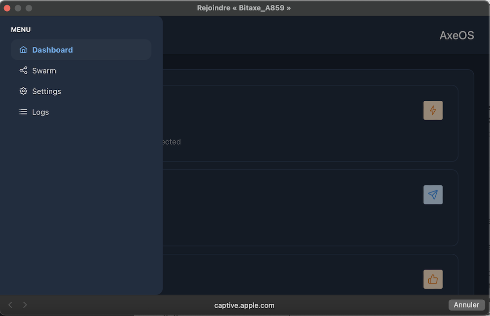

### Introduzione

BitAxe è un progetto open-source creato da Skot e [disponibile su GitHub](https://github.com/skot/bitaxe) che permette di sperimentare il mining in modo economico.

Ha decodificato il funzionamento del famoso Antminer S19 di Bitmain, leader di mercato negli ASIC, le macchine specializzate per il mining di bitcoin. Ora, è possibile utilizzare questi potenti chip in nuovi progetti open-source. A differenza del Nerdminer, BitAxe ha sufficiente potenza di calcolo per essere connesso a un mining pool, il che ti permetterà di guadagnare regolarmente alcuni satoshi. Il Nerdminer, d'altra parte, può essere connesso solo a quello che viene chiamato un solopool, che funziona come un biglietto della lotteria: hai una piccola possibilità di vincere l'intera ricompensa del blocco.

Ci sono diverse versioni di BitAxe, con diversi chip e prestazioni:

| Serie Modello Bitaxe     | Chip ASIC | Usato Su                    | Hash Rate Previsto         | Ideale Per                                                                                                 |
| ------------------------ | --------- | --------------------------- | --------------------------- | ---------------------------------------------------------------------------------------------------------- |
| Bitaxe Max (Serie 100)   | 1 x BM1397| Serie Antminer 17           | 400 GH/s (fino a 450 GH/s)  | Principianti del mining di Bitcoin, offre un solido hash rate con un consumo di energia moderato.         |
| Bitaxe Ultra (Serie 200) | 1 x BM1366| Antminer S19 XP e S19k Pro  | 500 GH/s (fino a 550 GH/s)  | Minatori seri che mirano a bilanciare efficienza e hash rate più elevato.                                  |
| Bitaxe Hex (Serie 300)   | 6 x BM1366| Antminer S19k Pro e S19 XP  | 3.0 TH/s (fino a 3.3 TH/s)  | Minatori che cercano scalabilità e alte prestazioni senza sacrificare l'efficienza.                        |
| Bitaxe Supra (Serie 400) | 1 x BM1368| Antminer S21                | 600 GH/s (fino a 700 GH/s)  | Appassionati seri che cercano gli hash rate più alti e l'efficienza.                                       |

In questo tutorial, utilizzeremo un BitAxe Ultra 204 equipaggiato con un chip BM1366, usato per l'Antminer S19XP. Questo è già assemblato e programmato dal rivenditore.

### [L'elenco dei rivenditori è disponibile su questa pagina](https://bitaxe.org/legit.html)

Generalmente, l'alimentatore è venduto insieme. Se non lo è, dovrai acquistare un alimentatore con un cavo jack da 5V e almeno 4A.

### Configurazione
Quando colleghi il tuo BitAxe per la prima volta, tenterà di connettersi a una rete Wi-Fi per impostazione predefinita. Dopo cinque tentativi, mostrerà il nome della sua propria rete Wi-Fi in modo che tu possa connetterti e configurarlo.
Per fare ciò, puoi usare qualsiasi computer o smartphone. Vai alle impostazioni Wi-Fi, cerca nuove reti e vedrai una Wi-Fi chiamata Bitaxe_XXXX. Qui, è `Bitaxe_A859`. Connettiti a questa rete Wi-Fi, e si aprirà automaticamente una finestra.

In questa finestra, clicca sulle tre piccole barre orizzontali in alto a sinistra, poi su `Settings`.

Dovrai inserire manualmente le informazioni della tua rete Wi-Fi, poiché non esiste un sistema di scoperta automatico.

Pertanto, indica l'SSID del Wi-Fi, ovvero il nome della tua rete, la password, così come le informazioni del mining pool che hai scelto. Attenzione, qui l'URL del pool non è presentato nello stesso modo. Ad esempio, per Braiins, l'URL del pool fornito è: `stratum+tcp://eu.stratum.braiins.com:3333`.

Come puoi vedere sullo schermo, devi rimuovere le parti `stratum+tcp://` e `:3333`, lasciando solo `eu.stratum.braiins.com`. Quindi, nel campo `Porta`, inserisci i 4 cifre alla fine dell'URL fornito dal pool, ma senza il `:`. Qui, è quindi `3333`.

In questo tutorial, stiamo utilizzando il mining pool Braiins, ma sei libero di sceglierne un altro. Puoi trovare i nostri tutorial sui mining pool [sul sito web di PlanB Network](https://planb.network/en/tutorials/mining).

Successivamente, in `Utente`, inserisci il tuo identificativo e poi la `Password`, di solito, è `"x"` o `"Anything123"`.

L'impostazione del `Voltaggio Core` dovrebbe essere lasciata di default a `1200`, e per la `Frequenza`, lascia anche il valore predefinito inizialmente. Sarà possibile regolare questa impostazione più tardi per ottenere più potenza di calcolo. Tuttavia, è importante assicurarsi che la temperatura del chip non superi i 65-70°C, poiché il BitAxe non dispone di un sistema per ridurre le prestazioni in caso di surriscaldamento. Se la temperatura supera troppo i 65°C, potrebbe danneggiare il tuo BitAxe.

Una volta che hai inserito correttamente tutte le impostazioni, clicca sul pulsante `Salva` in basso, poi riavvia il tuo BitAxe semplicemente scollegandolo e ricollegandolo.
Se hai inserito correttamente le tue informazioni, il dispositivo dovrebbe connettersi rapidamente al tuo Wi-Fi, poi al mining pool, e iniziare a visualizzare alcune informazioni sul suo piccolo schermo. Probabilmente ci vorranno alcuni minuti perché appaia sulla dashboard del mining pool.
### Dashboard e Schermo

Tre diverse visualizzazioni scorrono. Nella terza pagina, vedrai le informazioni `IP`, che è l'indirizzo IP che ti permette di connetterti alla dashboard. Qui, l'indirizzo è `192.168.1.19`.

  

Per accedere alla dashboard, inserisci semplicemente questo indirizzo nel tuo browser internet.

Sulla dashboard, troverai tutte le informazioni visualizzate sul piccolo schermo, che ora esamineremo in dettaglio.

| Schermo BitAxe | Dashboard                                   | Descrizione                                                                                                                                                                                                               |
| -------------- | ------------------------------------------- | ------------------------------------------------------------------------------------------------------------------------------------------------------------------------------------------------------------------------- |
| Gh             | Hashrate                                    | La potenza di calcolo attuale, espressa in GigaHash/s                                                                                                                                                                      |
| W/THs          | Efficienza                                  | Questa è l'efficienza del tuo BitAxe espressa in W/THs. È il rapporto tra la potenza elettrica consumata e la potenza di calcolo prodotta.                                                                          |
| A/R            | Shares                                      | Quantità di `Shares` inviate dal tuo BitAxe al pool, rappresentando la quantità di lavoro fornito.                                                                                                                          |
| UT             | Uptime                                      | Tempo da quando il tuo BitAxe è in funzionamento senza interruzioni (disponibile nel menu a sinistra sotto `Logs`).                                                                                                                |
| BD            | Difficoltà Massima                          | Massima difficoltà raggiunta dall'ultimo riavvio. Per confronto, l'attuale difficoltà della rete è di circa 85T.                                                                                                          |
| FAN           | FAN nella casella `Calore`                  | Velocità di rotazione della ventola, espressa in rotazioni al minuto.                                                                                                                                                     |
| Temp          | Temperatura ASIC nella casella `Calore`     | Temperatura del chip, che non dovrebbe superare i 65°C.                                                                                                                                                                   |
| Pwr           | Potenza                                     | Potenza in watt consumata. Tuttavia, queste informazioni non tengono conto dello schermo, della ventola o dell'alimentatore. Ad esempio, quando mostra 11.7W, il consumo totale è in realtà di 15.8W.                    |
| mV mA         | Tensione di Ingresso Corrente di Ingresso   | Tensione e corrente consumate dalla macchina. La potenza in watt è uguale alla tensione moltiplicata per la corrente.                                                                                                      |
| FH            | Memoria Libera (menu a sinistra -> `Log`)   | La memoria disponibile.                                                                                                                                                                                                   |
| vCore         | Tensione ASIC (nella casella Prestazioni)   | Tensione misurata sul chip ASIC.                                                                                                                                                                                          |
| IP            | NA                                          | Indirizzo IP.                                                                                                                                                                                                             |
| V2.1.0        | Versione (menu a sinistra -> `Log`)         | Versione del firmware.                                                                                                                                                                                                    |
Puoi cambiare le impostazioni del Wi-Fi o del pool in qualsiasi momento senza alcun problema.
A seconda della ventilazione e della temperatura della tua stanza, potrebbe essere necessario aumentare o diminuire le prestazioni affinché la temperatura non superi i 65°C. Se aumenti le prestazioni, guadagnerai più satoshi, ma il tuo BitAxe consumerà anche più elettricità!