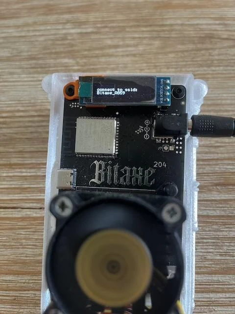
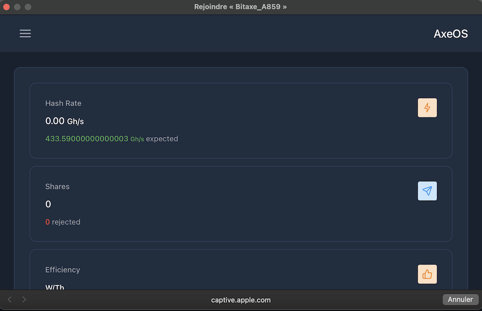
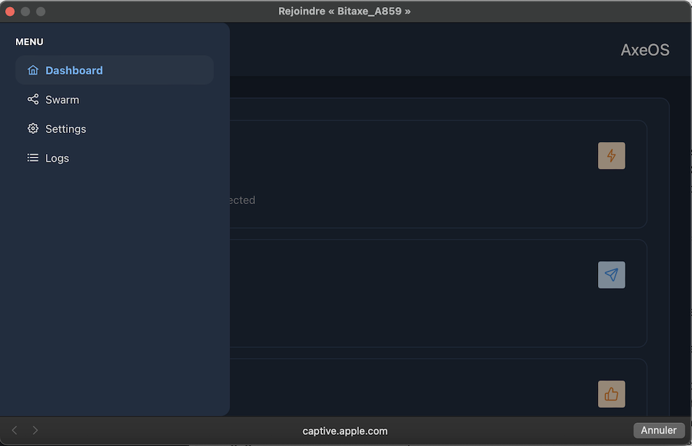
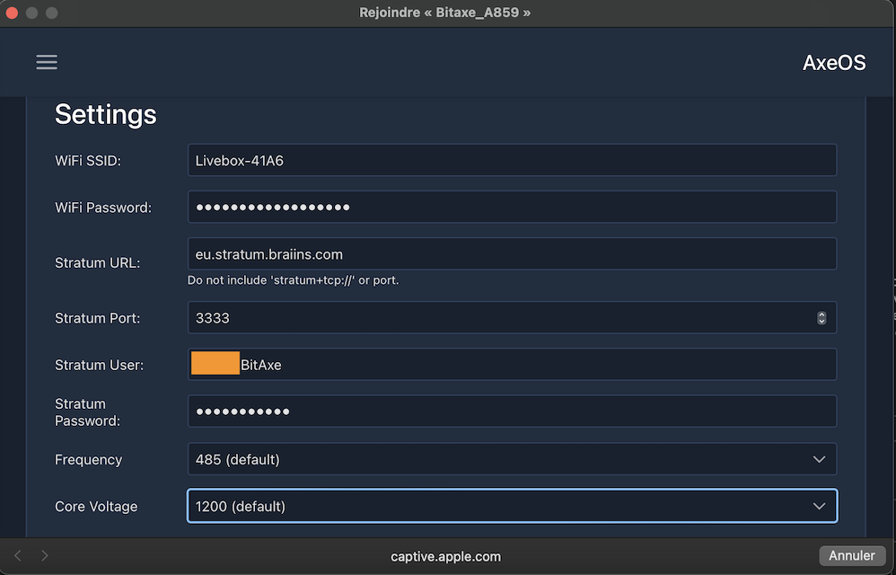
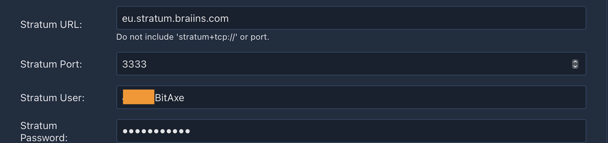
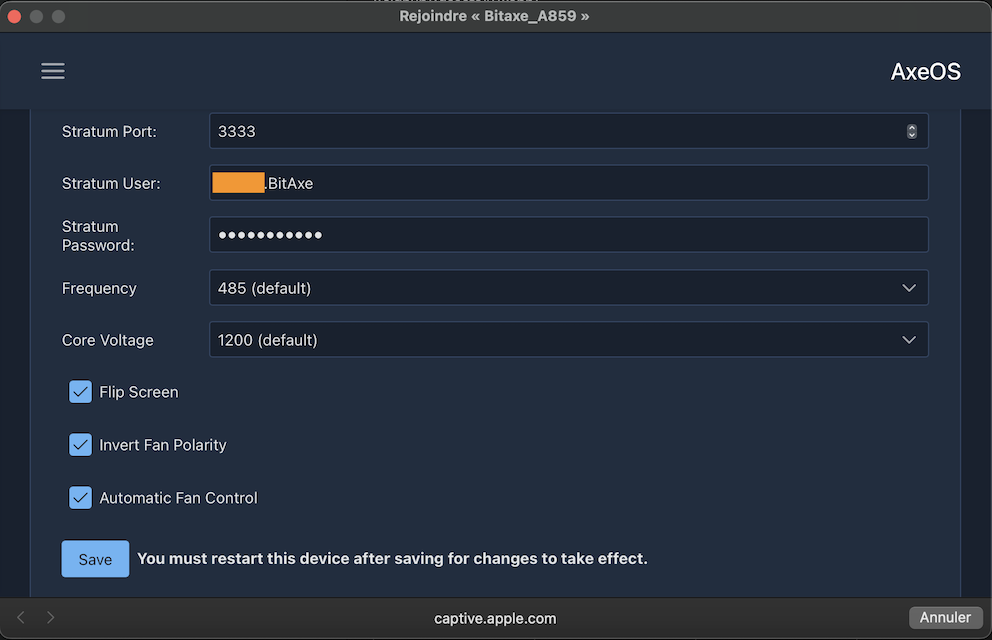
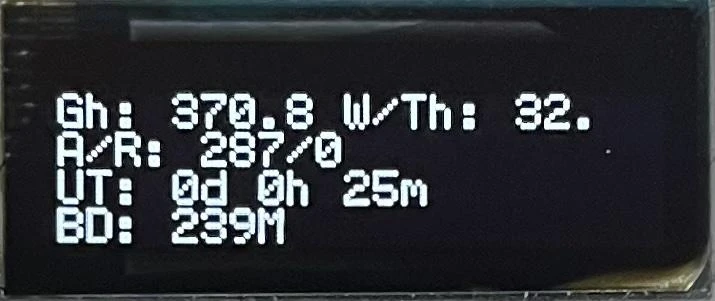
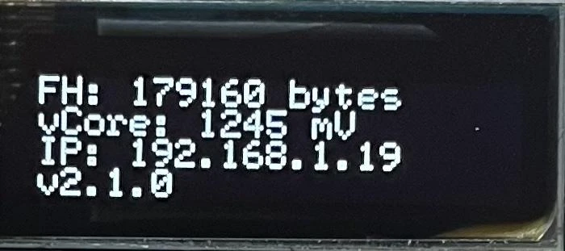
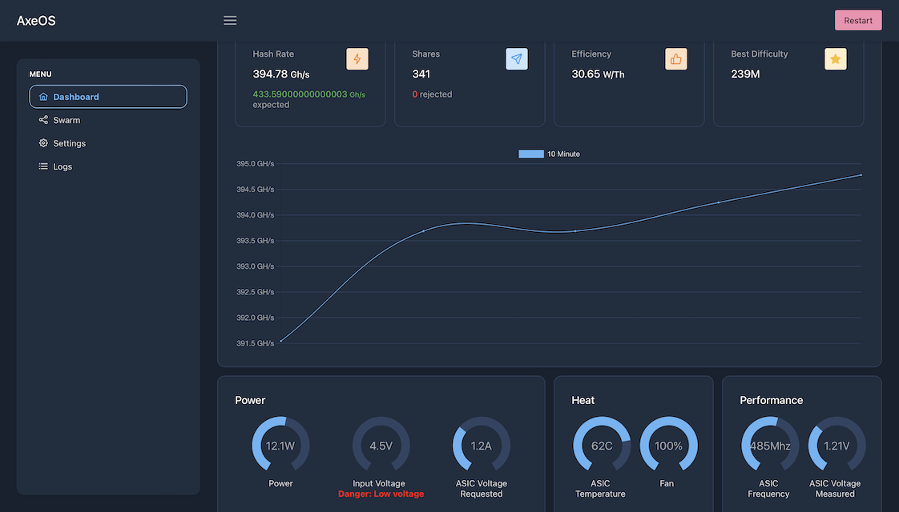

### Введение

BitAxe - это проект с открытым исходным кодом, созданный Skot и [доступный на GitHub](https://github.com/skot/bitaxe), который позволяет экспериментировать с майнингом с минимальными затратами.

Он раскрыл принцип работы известного Antminer S19 от Bitmain, лидера рынка ASIC, специализированных машин для майнинга биткоинов. Теперь стало возможным использовать эти мощные чипы в новых проектах с открытым исходным кодом. В отличие от Nerdminer, BitAxe обладает достаточной вычислительной мощностью для подключения к майнинговому пулу, что позволит вам регулярно зарабатывать некоторое количество сатоши. В то время как Nerdminer может быть подключен только к так называемому solopool, который работает как лотерейный билет: у вас есть небольшой шанс выиграть полное вознаграждение за блок.

Существует несколько версий BitAxe с различными чипами и производительностью:

| Серия моделей Bitaxe     | ASIC чип | Используется в              | Ожидаемая хеш-скорость      | Идеально подходит для                                                                                       |
| ------------------------ | --------- | --------------------------- | --------------------------- | ---------------------------------------------------------------------------------------------------------- |
| Bitaxe Max (Серия 100)   | 1 x BM1397| Серия Antminer 17           | 400 GH/s (до 450 GH/s)      | Начинающих майнеров биткоина, предлагая надежную хеш-скорость при умеренном потреблении энергии.            |
| Bitaxe Ultra (Серия 200) | 1 x BM1366| Antminer S19 XP и S19k Pro  | 500 GH/s (до 550 GH/s)      | Серьезных майнеров, стремящихся сбалансировать эффективность и более высокую хеш-скорость.                  |
| Bitaxe Hex (Серия 300)   | 6 x BM1366| Antminer S19k Pro и S19 XP  | 3.0 TH/s (до 3.3 TH/s)      | Майнеров, ищущих масштабируемость и высокую производительность без потери эффективности.                    |
| Bitaxe Supra (Серия 400) | 1 x BM1368| Antminer S21                | 600 GH/s (до 700 GH/s)      | Энтузиастов, ищущих самые высокие хеш-скорости и эффективность.                                             |

В этом руководстве мы будем использовать BitAxe Ultra 204 с чипом BM1366, используемым для Antminer S19XP. Этот уже собран и прошит продавцом.

### [Список ритейлеров доступен на этой странице](https://bitaxe.org/legit.html)

Как правило, в комплекте продается блок питания. Если нет, вам нужно будет приобрести блок питания с кабелем jack 5V и минимум 4A.

### Конфигурация
Когда вы впервые подключаете ваш BitAxe, он по умолчанию попытается подключиться к Wi-Fi сети. После пяти попыток он отобразит название своей собственной Wi-Fi сети, чтобы вы могли подключиться к ней и настроить ее.
Для этого вы можете использовать любой компьютер или смартфон. Перейдите в настройки Wi-Fi, поищите новые сети, и вы увидите Wi-Fi с названием Bitaxe_XXXX. Здесь это `Bitaxe_A859`. Подключитесь к этой Wi-Fi сети, и автоматически откроется окно.

В этом окне нажмите на три маленькие горизонтальные полоски в верхнем левом углу, затем на `Settings`.

Вам нужно будет вручную ввести информацию о вашей Wi-Fi сети, так как система автоматического обнаружения отсутствует.

Следовательно, укажите SSID Wi-Fi, то есть имя вашей сети, пароль, а также информацию о выбранном вами пуле для майнинга. Будьте внимательны, здесь URL пула представлен не так, как обычно. Например, для Braiins URL пула предоставляется в виде: `stratum+tcp://eu.stratum.braiins.com:3333`.

Как вы можете видеть на экране, вам нужно удалить части `stratum+tcp://` и `:3333`, оставив только `eu.stratum.braiins.com`. Затем в поле `Port` введите 4 цифры в конце URL, предоставленного пулом, но без `:`. Здесь это, следовательно, `3333`.

В этом учебнике мы используем майнинг-пул Braiins, но вы можете выбрать другой. Наши учебные материалы о майнинг-пулах вы можете найти [на веб-сайте PlanB Network](https://planb.network/en/tutorials/mining).

Далее, в `User` введите ваш идентификатор, а затем `Password`, обычно это `"x"` или `"Anything123"`.

Настройку `Core Voltage` следует оставить по умолчанию `1200`, а для `Frequency` также оставьте изначальное значение. Позже будет возможность отрегулировать эту настройку, чтобы получить больше вычислительной мощности. Однако важно убедиться, что температура чипа не превышает 65-70°C, поскольку BitAxe не имеет системы для снижения производительности в случае перегрева. Если температура превысит 65°C слишком сильно, это может повредить ваш BitAxe.

После того как вы правильно ввели все настройки, нажмите кнопку `Save` внизу, затем перезапустите ваш BitAxe, просто отключив его и снова подключив.
Если вы ввели свои данные правильно, устройство должно быстро подключиться к вашему Wi-Fi, затем к пулу для майнинга и начать отображать некоторую информацию на своем маленьком экране. Возможно, потребуется несколько минут, чтобы оно появилось на панели управления майнинг-пула.
### Панель управления и экран

Будут прокручиваться три разных дисплея. На третьей странице вы увидите информацию `IP`, которая является IP-адресом, позволяющим подключиться к панели управления. Здесь адрес `192.168.1.19`.

  

Чтобы получить доступ к панели управления, просто введите этот адрес в ваш интернет-браузер.

На панели управления вы найдете всю информацию, отображаемую на маленьком экране, которую мы теперь рассмотрим подробно.

| Экран BitAxe | Панель управления                           | Описание                                                                                                                                                                                                                   |
| ------------ | ------------------------------------------- | -------------------------------------------------------------------------------------------------------------------------------------------------------------------------------------------------------------------------- |
| Gh           | Хешрейт                                     | Текущая вычислительная мощность, выраженная в ГигаХеш/с                                                                                                                                                                     |
| W/THs        | Эффективность                               | Это эффективность вашего BitAxe, выраженная в Вт/ТХс. Это соотношение между потребляемой электроэнергией и производимой вычислительной мощностью.                                                                           |
| A/R          | Шары                                         | Количество `Шар`, отправленных вашим BitAxe в пул, представляющее объем выполненной работы.                                                                                                                                |
| UT           | Время работы                                | Время с момента, как ваш BitAxe работает без перерывов (доступно в левом меню под `Logs`).                                                                                                                                  |
| BD            | Максимальная сложность                      | Максимальная сложность, достигнутая с момента последнего перезапуска. Для сравнения, текущая сложность сети составляет около 85T.                                                                                         |
| FAN           | Скорость вращения вентилятора в блоке `Тепло` | Скорость вращения вентилятора, выраженная в оборотах в минуту.                                                                                                                                                           |
| Temp          | Температура ASIC в блоке `Тепло`            | Температура чипа, которая не должна превышать 65°C.                                                                                                                                                                      |
| Pwr           | Мощность                                    | Потребляемая мощность в ваттах. Однако эта информация не учитывает экран, вентилятор или блок питания. Например, когда отображается 11.7W, общее потребление на самом деле составляет 15.8W.                             |
| mV mA         | Входное напряжение Входной ток              | Напряжение и ток, потребляемые машиной. Мощность в ваттах равна произведению напряжения на ток.                                                                                                                          |
| FH            | Свободная память (левое меню -> `Логи`)     | Доступная память.                                                                                                                                                                                                        |
| vCore         | Напряжение ASIC (в блоке Производительность) | Напряжение, измеренное на чипе ASIC.                                                                                                                                                                                     |
| IP            | NA                                          | IP-адрес.                                                                                                                                                                                                                |
| V2.1.0        | Версия (левое меню -> `Логи`)               | Версия прошивки.                                                                                                                                                                                                         |
Вы можете в любое время изменить настройки Wi-Fi или пула без каких-либо проблем.
В зависимости от вентиляции и температуры вашего помещения, вам может потребоваться увеличить или, возможно, уменьшить производительность, чтобы температура не превышала 65°C. Если вы увеличите производительность, вы заработаете больше сатоши, но ваш BitAxe также будет потреблять больше электроэнергии!