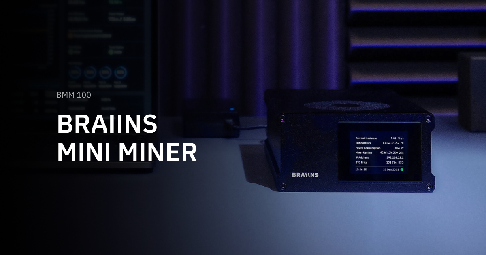

### Introduzione

Il Mini Miner braiins BMM 100 è un prodotto creato dalla mining pool Braiins. Questo dispositivo ha un design accattivante ed è silenziosissimo. Produce 1,1 Th/s di potenza di calcolo e consuma circa 40 watt. A differenza di altri dispositivi non è open source, ma è veramente facile da installare, bastano veramente pochi click! il Mini Miner BMM 100 è la prima versione uscita. Ora è in produzione la versione 2, chiamata BMM 101, che differisce dalla prima per il display puù grosso e la presenza del wifi, ma le procedure di installazione sono le stesse.

Potete anche trovare molte altre informazioni importanti consultando la guida completa direttamente sul sito del produttore: https://braiins.com/hardware/mini-miner-bmm-100

### Panoramica del BMM 100

il dispositivo si presenta come un parallelepipedo con un display sulla parte anteriore

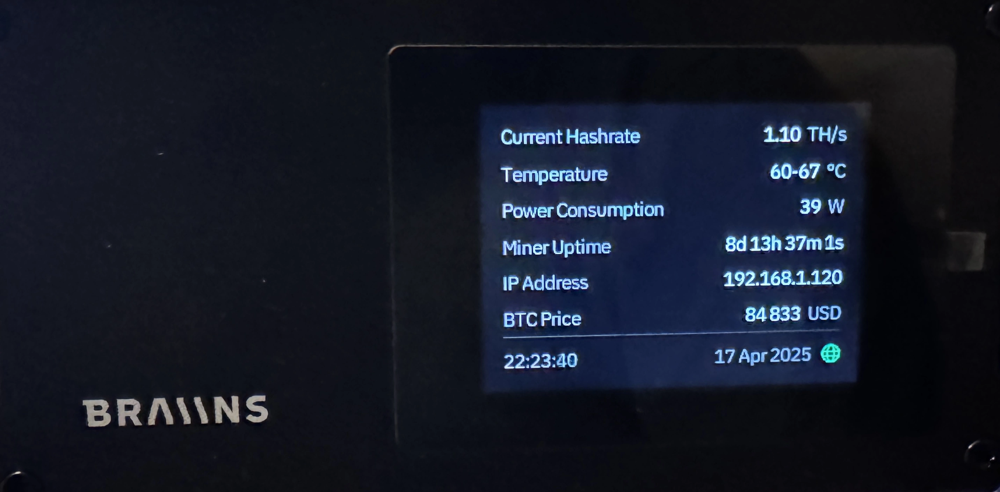

una ventola sul lato superiore

mentre sul lato posteriore abbiamo il foro per la corrente, lo spazio per una scheda sd che potrebbe servire per eventuali aggiornamenti, un tastino con scritto IP REPORT che ci servirà per sapere qual’ è l’ indirizzo ip del nostro mini miner che è necessario per poter accedere alla dashboard del dispositivo. Questo vi serve perché il vostro indirizzo IP viene visualizzato per circa 5 secondi, poi questo scompare e torna la schermata che avete impostato. Se però avete la necessità di cambiare delle impostazioni, basta che schiacciate questo tastino e l' indirizzo comparirà nuovamente a schermo. A seguire abbiamo l’ attacco per il cavo ethernet, poi un buchino per fare il reset del dispositivo. Sarà necessario prendere una spilletta e tenere premuto per 10 secondi per resettare tutte le impostazioni del miniminer. Poi alla fine abbiamo due spie, una verde e una rossa che ci indicano lo stato del miner.

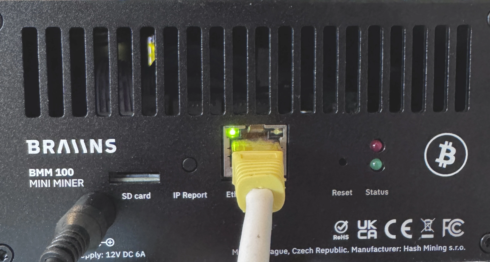

### Collegare il Mini Miner

Sarà necessario posizionare il dispositivo vicino ad una presa ethernet perchè abbiamo bisogno della connessione internet via cavo. Con la nuova versione (BMM 101) questo non è piu necessario. Una volta che abbiamo trovato la sua posizione dovremo collegarlo prima alla linea internet e poi alla corrente. Il dispositivo si accenderà automaticamente e comparirà a schermo il suo indirizzo IP.

### Configurazione

Noi dobbiamo aprire un browser e inserire l’ indirizzo ip che ci mostra il mini miner nella barra di ricerca. Vi ricordo che per trovare il dispositivo in rete dovrete essere in locale, quindi dovrete avere il computer che state utilizzando collegato alla stessa rete del mini miner. una volta inserito l’ indirizzo ip premiamo invio e ci comparirà a schermo la pagina del login al sistema operativo del mini miner, che è braiins os. 

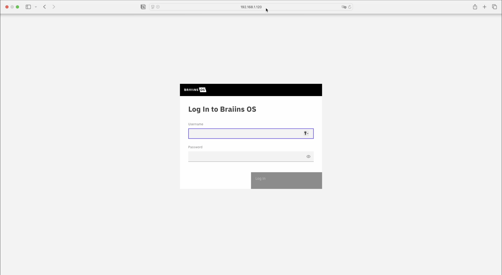

Per poter accedere dovrete inserire come username “root”, mentre la password potete lasciarla vuota. Cliccate su login e vi comparirà la dashboard del vostro mini miner.

### Impostazioni generali

Andiamo su System

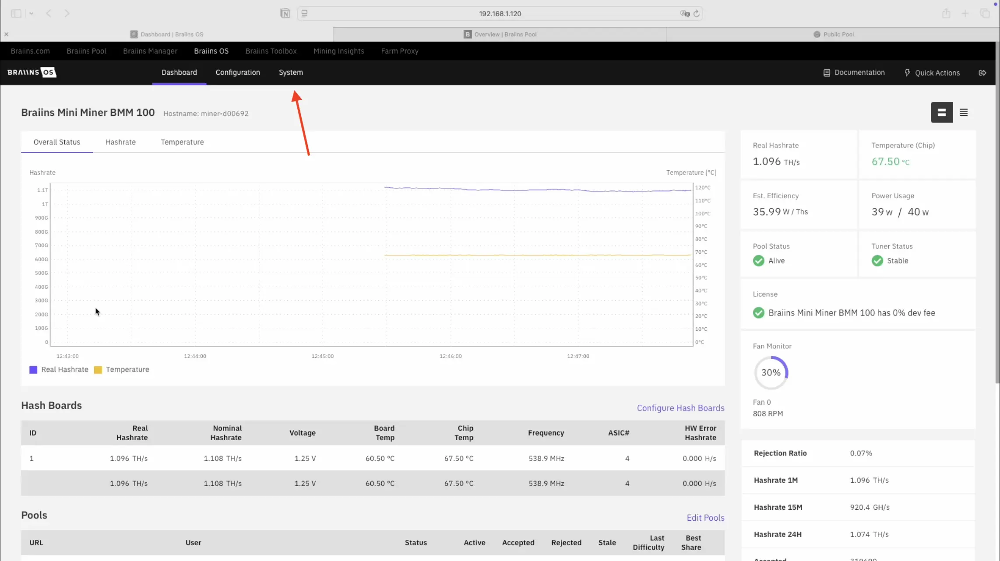

e nei settings troviamo alcune impostazioni generali come il tema (chiaro o scuro) la lingua, il fuso orario e il cambio della password. 

Se andiamo in mini miner screen invece abbiamo le impostazioni del nostro mini miner, come la visualizzazione dello schermo. Possiamo scegliere se mostrare l’ ora, oppure il prezzo di bitcoin, o la schermata con le informazioni sullo stato della macchina come hashrare prodotto, temperatura, watt consumati eccetera. Qui sta a voi scegliere cosa volete vedere a schermo. Poi possiamo anche modificare la luminosità dello schermo, impostare la modalità notte e scegliere se vedere l’ ora con il formato a 12 ore o a 24 ore. 

Una volta effettuati dei cambiamenti, cliccate su save changes e vedrete le modifiche sul vostro schermo del dispositivo

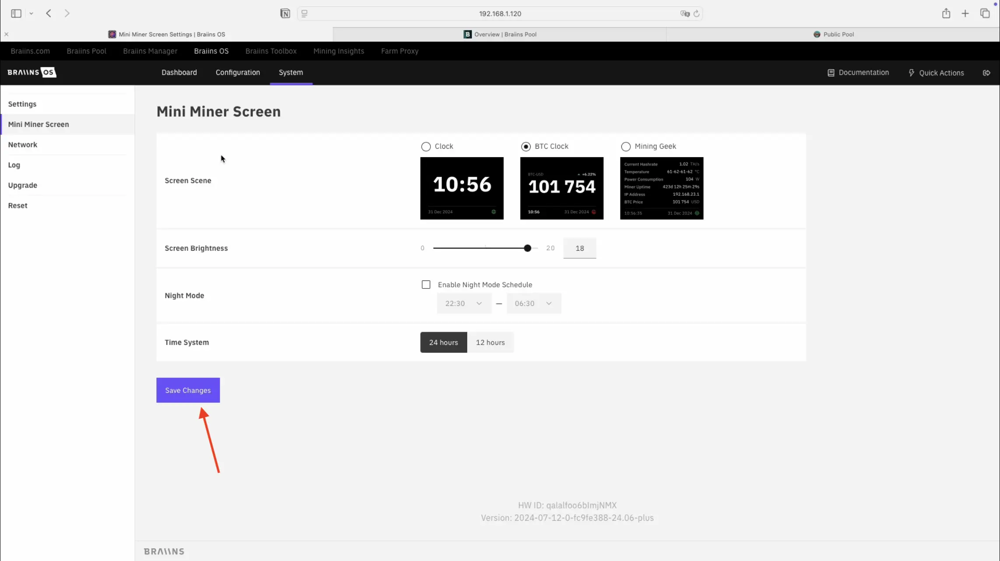

### Collegamento alla mining pool

Ora non siamo ancora operativi, perché dobbiamo collegarci ad una pool per poter iniziare a minare, quindi dobbiamo andare in “configuration”

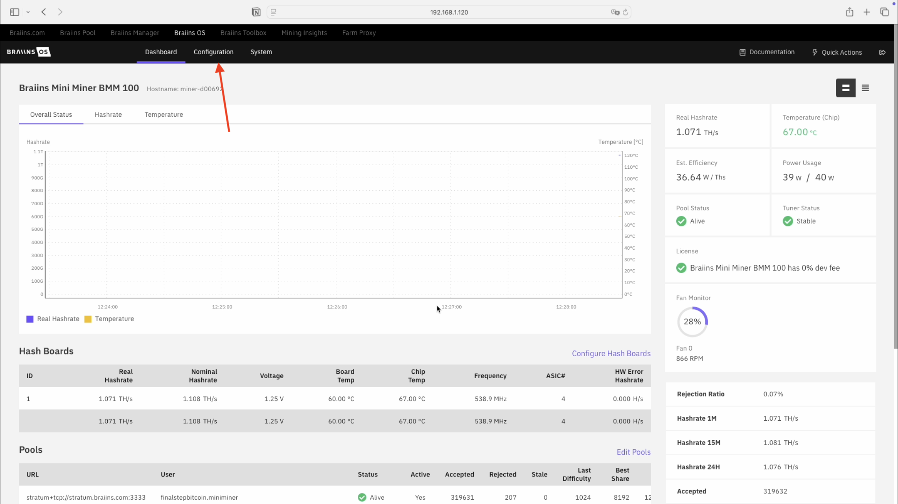

e la prima voce è proprio pools. 

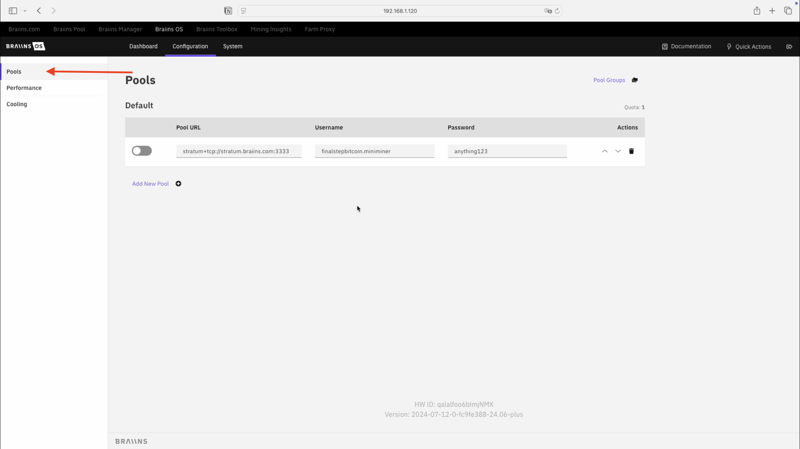

Qui dovremo decidere che pool utilizzare. In questo tutorial vi mostrerò due opzioni. La prima è collegarci alla [mining pool braiins](https://planb.network/it/tutorials/mining/pool/braiins-pool-557be706-35a9-4375-a563-d55ab5c69f55), che viene utilizzata anche dai miners professionali, mentre la seconda è collegarci ad una mining pool che mina in solo, come [Public Pool](https://planb.network/it/tutorials/mining/pool/public-pool-42b9e1b5-722d-471d-b1e3-9ca758065be1).

#### Braiins pool

Per collegarsi a questa pool è necessario creare un account. questa pool effettua anche pagamenti utilizzando lightning network, quindi potremo ricevere qualche sats al giorno. Per farlo dobbiamo impostare un lightning address sul quale ricevere le ricompense. Se non sai come creare un account su braiins pool o come impostare il tuo lightning address puoi seguire questo [tutorial](https://planb.network/it/tutorials/mining/pool/braiins-pool-557be706-35a9-4375-a563-d55ab5c69f55).

Una volta fatto ci troviamo nella dashboard di Braiins pool. Quello che dobbiamo fare noi e dire alla pool che ci vogliamo connettere con un nostro miner, quindi sulla sinistra dello schermo trovate una serie di voci. Noi dobbiamo andare su “workers”

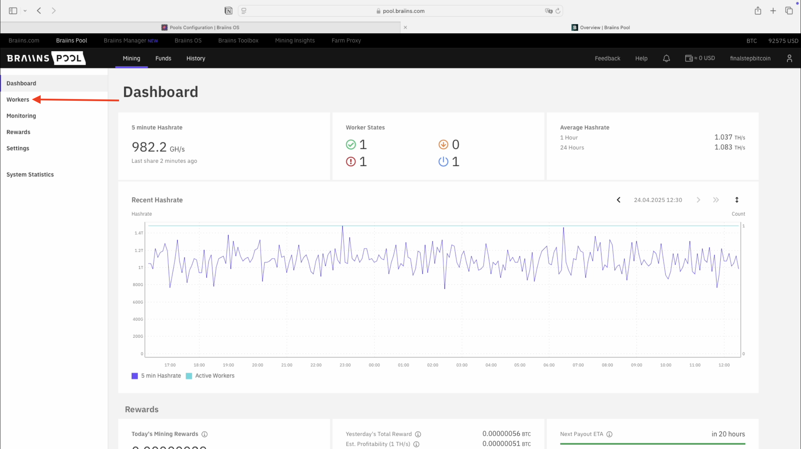

e dobbiamo cliccare sul bottone viola sulla destra con scritto “Connect workers”.

Ecco che si apre la finestra con le informazioni che ci servono per connettere il nostro mini miner alla pool. Qui l’ unica modifica che possiamo fare è quella di scegliere [stratum v2](https://planb.network/it/resources/glossary/stratum-v2).

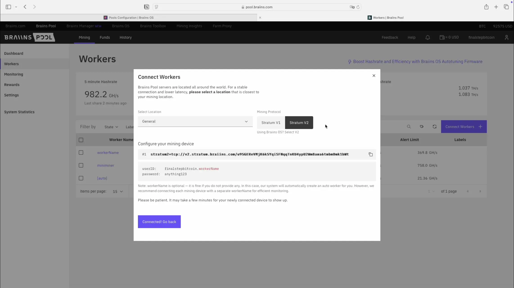

Ora noi dobbiamo copiare questa stringa che inizia per stratumv2. Clicchiamo quindi sul simbolino “copia”, poi andiamo sulla dashboard del nostro mini miner che avevamo lasciato in configurazione e pools. Clicchiamo su add new pool

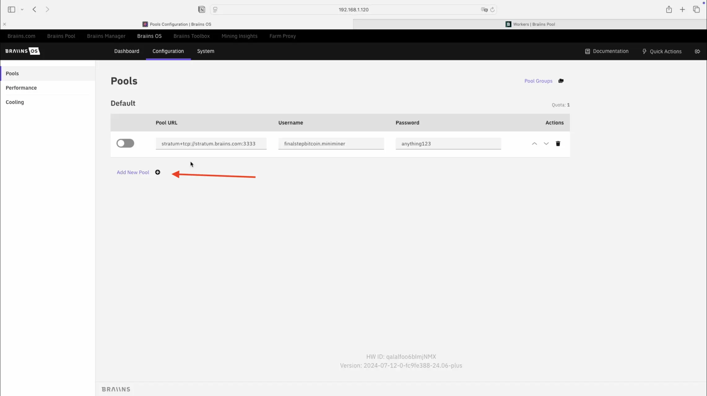

e incolliamo la stringa che abbiamo copiato nello spazio sotto a pool url.

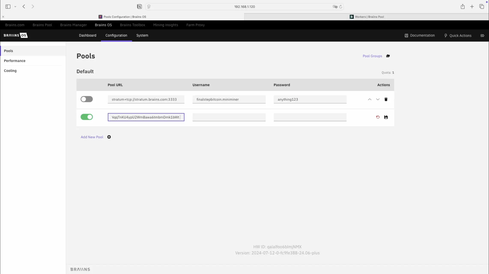

Ora dobbiamo aggiungere username e password. Torniamo nella dashboad della pool.
Sotto abbiamo anche un userid e una password. Lo userid e il nostro username, quello che abbiamo dato in fase di creazione dell’ account, più il nome del miner che vogliamo inserire. si può decidere se dare un nome oppure no al dispositivo che state collegando alla pool, è opzionale, ma è consigliabile metterlo, cosi se si collegano più dispositivi sarà più facile identificarli subito. Se invece non si vuole mettere niente si può lasciare workername. 

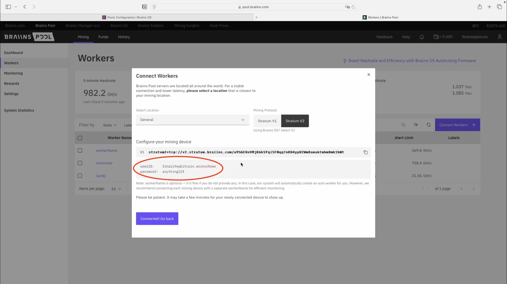

Andiamo quindi sul nostro mini miner e inseriamo lo username. Qui inseriremo nel mio caso “finalstepbitcoin” che è il mio userid, punto miniminer. Questo è il nome che ho deciso di dare al dispositivo. Se non lo si vuole nominare basta scrivere userid punto workername. Nel mio caso sarebbe stato finalstepbitcoin.workername. Una volta inserito lo username Si può scegliete una password e scriverla nel campo vuoto. Si può anche mettere anithing123, che è quella riportata anche nella schermata della pool, ma vuole semplicemente indicare che si può mettere la password che si vuole. 

Una volta inseriti tutti i dati bisogna premere sul tasto salva sulla destra ( quello a forma di floppy disk) e in questo modo sono stati configurati i dati della pool nel mini miner. 

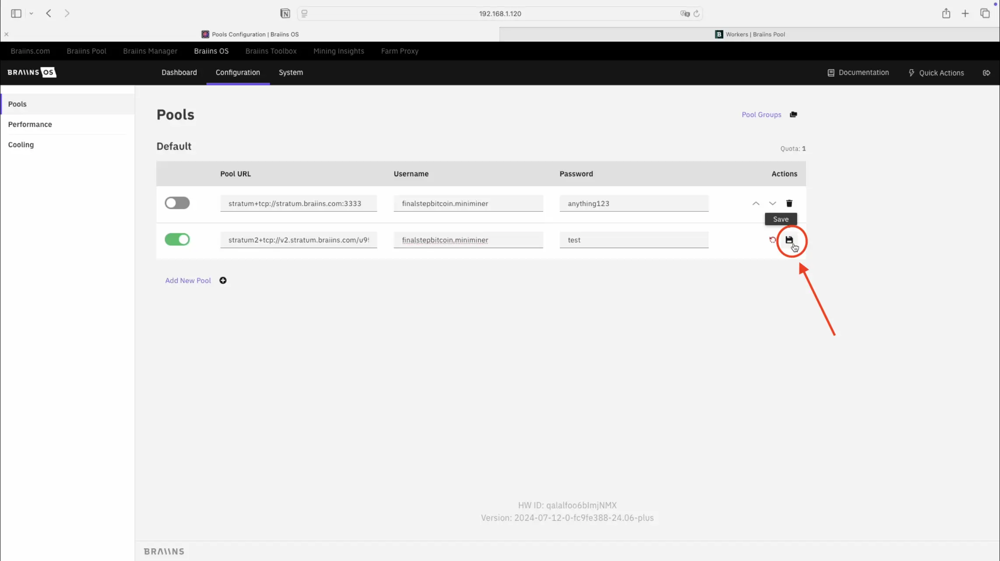

Ora bisogna tornare sulla dashboard della pool e cliccare su "Connected! Go back".

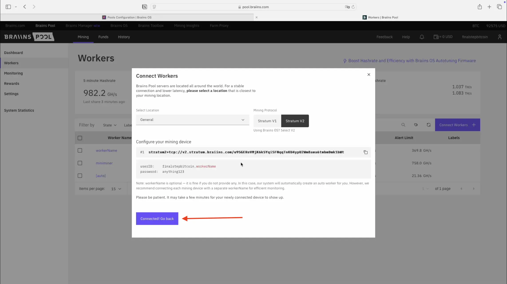

Abbiamo collegato il nostro mini miner alla pool di braiins! 
Ora è possibile vederlo nella lista dei workers. Se non si dovesse vedere basta fare un refresh e attendere qualche istante. Una volta comparso, verificare che abbia lo status ok con la spunta verde.

se si torna sulla dashboard si dovrebbe cominciare a vedere del movimento sul grafico e vedere l’ hashrate del nostro dispositivo. Questo significa che la pool sta ricevendo il nostro lavoro e quindi stiamo a tutti gli effetti minando.

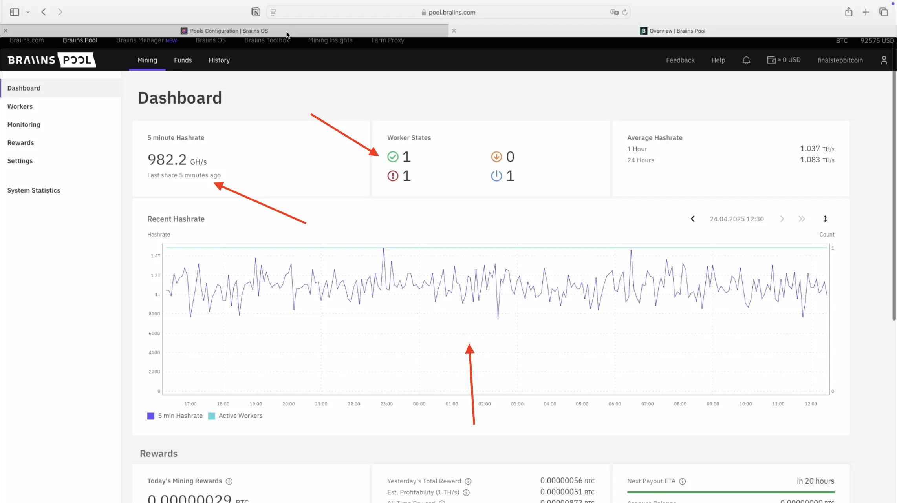

#### Public pool

Attraverso questa pool si può tentare la fortuna e minare in solo, appoggiandosi ad una pool. In questo caso non riceveremo reward, ma riceveremo l’ intera ricompensa se mai riusciremo a minare un blocco. Ci collegheremo quindi a public pool, una pool per solo mining completamente open source. Apriamo una nuova finestra sul browser e andiamo su [web.public-pool.io](https://web.public-pool.io/#/).

ecco che si apre una pagina con tutte le informazioni di cui abbiamo bisogno. Ci copiamo quindi l’ indirizzo stratum

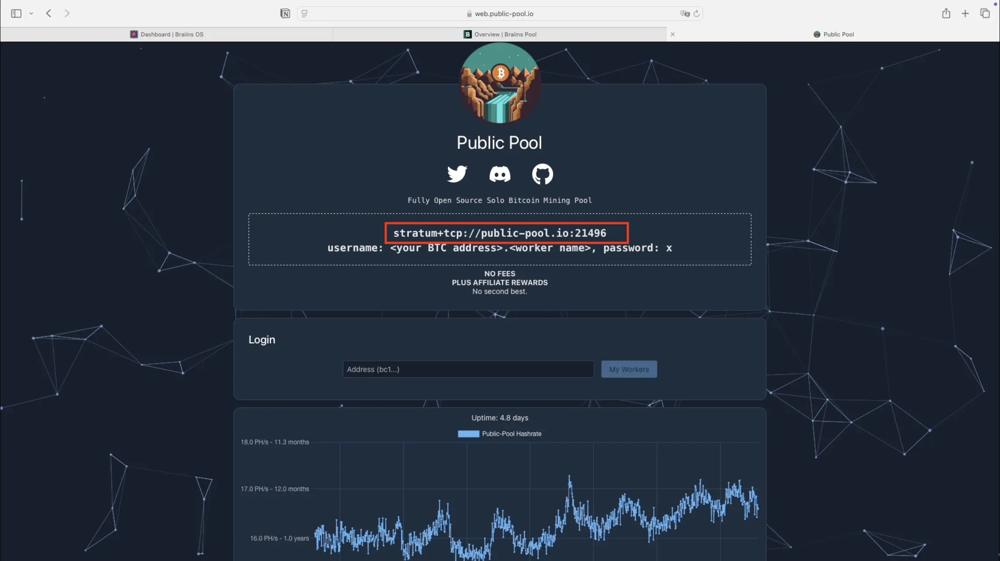

poi torniamo sulla dashboard del nostro mini miner, andiamo su configuration e su pools, clicchiamo su add new pool (stesso procedimento visto in precedenza) e incolliamo l’ indirizzo stratum sotto a pool url.

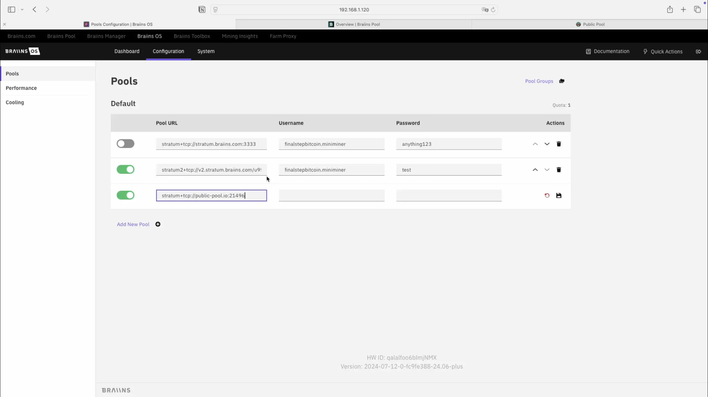

Ora torniamo sulla pagina della pool e vediamo che come username dobbiamo inserire un indirizzo bitcoin, che sarà quello sulla quale riceveremo la reward nel caso minassimo un blocco, poi un punto e poi il nome del nostro dispositivo, come abbiamo fatto in precedenza con braiins pool, mentre la password possiamo sceglierla noi.

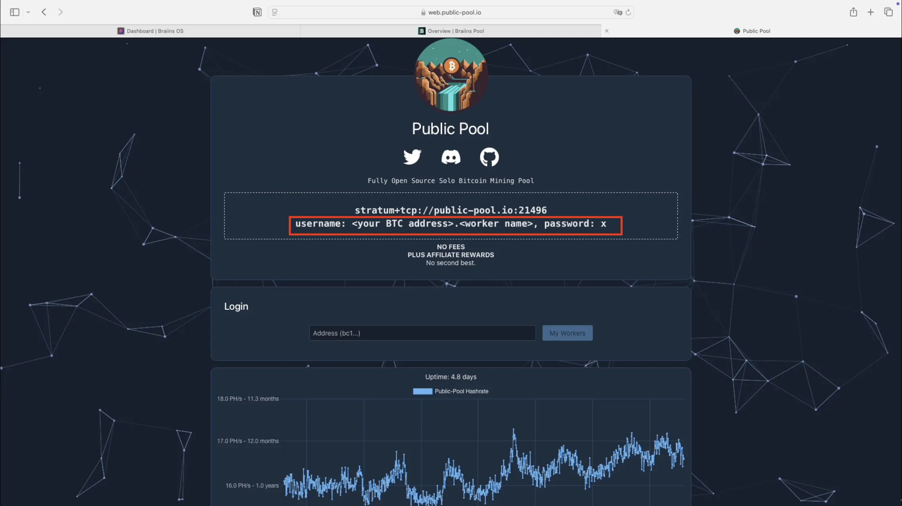

Torniamo sul mini miner e sotto username incolliamo un indirizzo bitcoin seguito da punto e il nome, io metto miniminer. Nella password invece io metterò test, voi inserite quella che volete. 

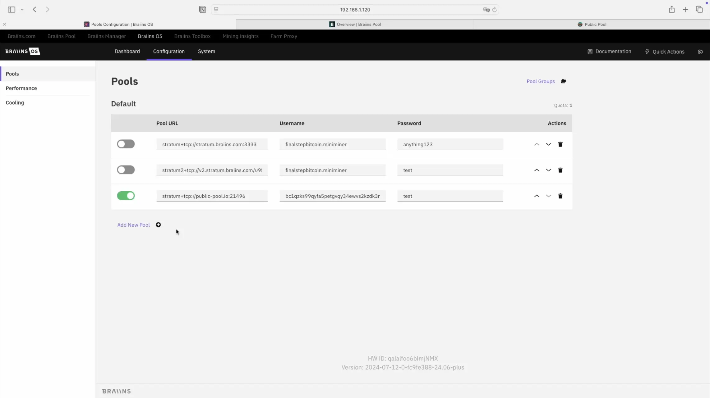

Ora salviamo le impostazioni e disabilitiamo la pool di braiins. 

Bene! Ora stiamo minando su public pool!

