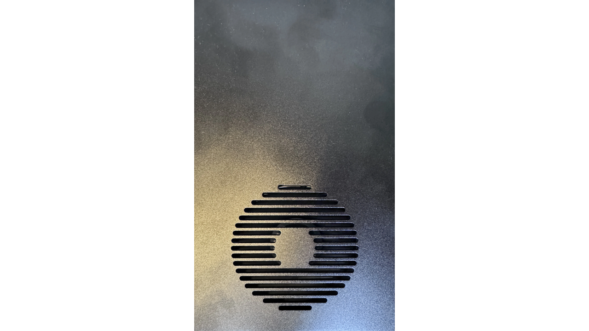
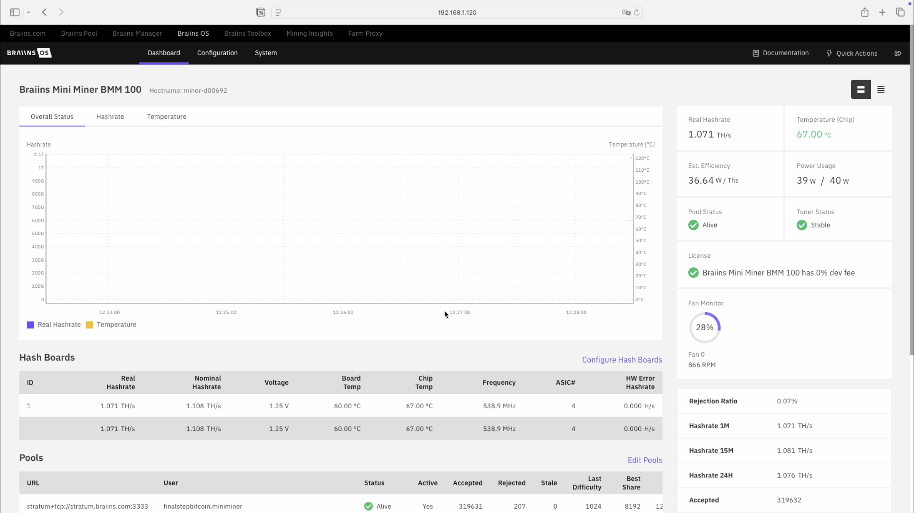
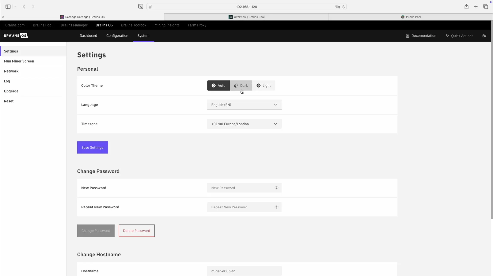
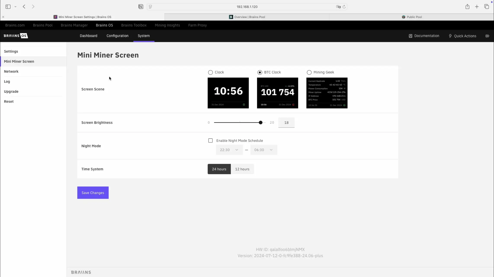
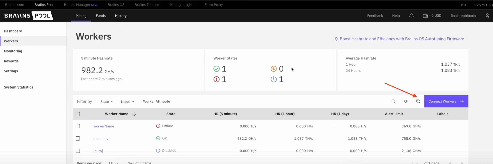
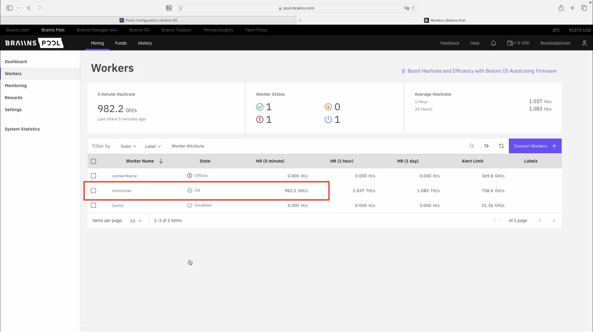
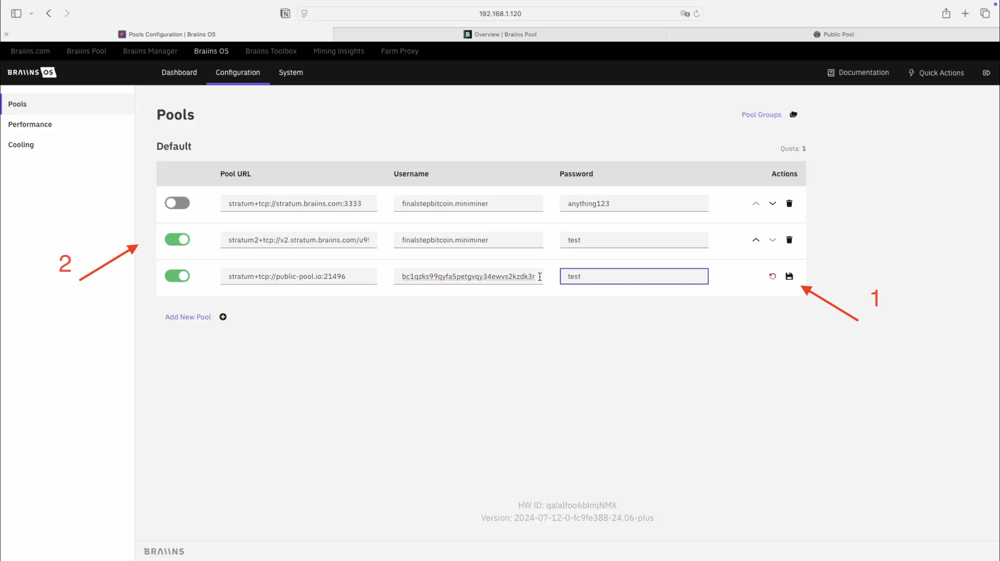

### Introduction

Le Mini Miner Braiins BMM 100 est un produit créé par le pool de minage Braiins. Cet appareil possède un design attrayant et se distingue par son extrême silence. Il délivre une puissance de calcul de 1,1 Th/s pour une consommation d’environ 40 watts. Contrairement à d’autres appareils, il n’est pas open source, mais il est très simple à installer : quelques clics suffisent ! Le Mini Miner BMM 100 correspond à la première version commercialisée. La version 2, baptisée BMM 101, est désormais en production. Elle se différencie de la précédente par un écran plus grand et l’ajout du Wi-Fi, mais les procédures d’installation restent identiques.

Vous trouverez également des informations complémentaires en consultant le guide complet disponible directement sur le [site du fabricant](https://braiins.com/hardware/mini-Miner-bmm-100).

---

### Vue d’ensemble du BMM 100

L’appareil se présente sous la forme d’un parallélépipède doté d’un écran en façade.  

Il possède un ventilateur sur la partie supérieure.  

À l’arrière, on distingue :  
- l’emplacement pour l’alimentation,  
- un logement pour carte SD (utile pour d’éventuelles mises à jour),  
- un petit bouton marqué `IP REPORT` qui permet d’afficher l’adresse IP du Mini Miner (indispensable pour accéder au tableau de bord de l’appareil). Lorsque l’on appuie sur ce bouton, l’adresse IP apparaît pendant environ 5 secondes, puis disparaît et l’écran d’accueil réapparaît. En cas de besoin, il suffit de presser à nouveau le bouton pour la faire réapparaître,  
- un port Ethernet,  
- un accès pour réinitialiser l’appareil : il faut insérer une épingle et maintenir la pression pendant 10 secondes afin de rétablir les paramètres d’usine,  
- enfin deux voyants lumineux, un vert et un rouge, qui indiquent l’état du mineur.  

---

### Connexion du Mini Miner

Le dispositif doit être connecté à Internet par câble Ethernet (notez qu’avec la nouvelle version BMM 101, cette étape n’est plus nécessaire). Pour le BMM 100, une fois son emplacement choisi, il faut le relier en premier lieu à la connexion Internet, puis à l’alimentation. L’appareil s’allume automatiquement et affiche son adresse IP à l’écran.

---

### Configuration

Il convient d’ouvrir un navigateur et de saisir dans la barre d’adresse l’IP affichée par le Mini Miner. Rappel : pour détecter l’appareil sur le réseau, il est impératif d’être en local, c’est-à-dire que l’ordinateur utilisé doit être connecté au même réseau que le Mini Miner. Une fois l’adresse IP saisie et validée, la page de connexion au système d’exploitation du Mini Miner (Braiins OS) apparaît.  

Pour vous connecter, entrez `root` comme identifiant et laissez le champ mot de passe vide. Cliquez sur « Login » et le tableau de bord de votre Mini Miner s’affichera.  

---

### Paramètres généraux

Accédez à la section « System ».  

Dans les paramètres, on retrouve des options générales : thème (clair ou sombre), langue, fuseau horaire et modification du mot de passe.  

Dans la section « Mini Miner Screen », on règle les paramètres liés à l’affichage de l’écran :  
- affichage de l’heure,  
- prix du Bitcoin,  
- ou encore informations sur l’état de la machine (taux de hachage, température, consommation en watts, etc.).  

Il est possible également de modifier la luminosité, d’activer le mode nuit, et de choisir un affichage en format 12h ou 24h.  

Après chaque modification, cliquez sur `Save Changes` pour appliquer les changements à l’écran du dispositif.  

---

### Connexion à un pool de minage

À ce stade, l’appareil n’est pas encore opérationnel : il doit être connecté à un pool de minage pour commencer à fonctionner. Rendez-vous dans « Configuration ».  

La première section est `Pools`.  

Il faut alors choisir le pool auquel se connecter. Ce tutoriel propose deux options :

1. Se connecter au pool Braiins, également utilisé par des mineurs professionnels, comme décrit dans ce tutoriel :  
   https://planb.network/it/tutorials/mining/pool/braiins-pool-557be706-35a9-4375-a563-d55ab5c69f55  

2. Se connecter à un pool de minage en solo, tel que Public Pool. Suivez ce guide pour cela :  
   https://planb.network/it/tutorials/mining/pool/public-pool-42b9e1b5-722d-471d-b1e3-9ca758065be1  

---

#### Braiins pool

Pour se connecter à ce pool, il est nécessaire de créer un compte. Celui-ci permet également de recevoir les paiements via le Lightning Network, ce qui autorise la perception quotidienne de quelques satoshis. Pour cela, il faut configurer une adresse Lightning où seront versées les récompenses. Si vous ne savez pas comment créer un compte sur le pool Braiins ou configurer une adresse Lightning, vous pouvez suivre ce guide :

https://planb.network/it/tutorials/mining/pool/braiins-pool-557be706-35a9-4375-a563-d55ab5c69f55

Une fois cette étape réalisée, nous nous trouvons dans le tableau de bord du pool Braiins. Il faut maintenant indiquer au pool que nous souhaitons connecter l’un de nos mineurs. Dans le menu à gauche de l’écran, sélectionnez l’onglet « Workers ».  

Cliquez ensuite sur le bouton violet à droite intitulé « Connect workers ».  

Une fenêtre s’ouvre avec les informations nécessaires pour relier notre Mini Miner au pool. La seule modification possible ici est de choisir Stratum V2. Pour comprendre ce qu’est Stratum V2, vous pouvez consulter cet [article du glossaire](https://planb.network/en/resources/glossary/stratum-v2).  

Il faut copier la chaîne qui commence par `stratumv2`. Cliquez sur l’icône de copie, puis retournez dans le tableau de bord du Mini Miner, dans la section *Configuration* → *Pools*. Cliquez sur « Add new pool ».  

Collez la chaîne copiée dans le champ « Pool URL ».  

Il faut maintenant ajouter un identifiant et un mot de passe. Revenons au tableau de bord du pool. On y trouve un *userID* et un mot de passe.  
- L’identifiant correspond à votre *userID* (celui choisi lors de la création de votre compte), suivi du nom du mineur que vous souhaitez connecter.  
- Donner un nom à l’appareil est facultatif, mais recommandé pour mieux distinguer vos différents dispositifs. Si vous ne voulez rien préciser, vous pouvez conserver `workerName`.  

Dans notre Mini Miner, on saisit donc l’identifiant. Par exemple, si mon *userID* est `finalstepbitcoin` et que j’ai choisi de nommer mon appareil `miniminer`, j’écrirai `finalstepbitcoin.miniminer`. Sans nom, ce serait `finalstepbitcoin.workername`. Ensuite, choisissez un mot de passe et inscrivez-le dans le champ prévu. Vous pouvez mettre n’importe quelle valeur (par exemple `anithing123`, comme indiqué à l’écran du pool).  

Une fois les données saisies, cliquez sur le bouton de sauvegarde situé à droite (icône de disquette). Les informations du pool sont ainsi enregistrées dans le Mini Miner.  

Retournez ensuite sur le tableau de bord du pool et cliquez sur « Connected! Go back. »  

Votre Mini Miner est désormais relié au pool Braiins ! Vous devriez le voir apparaître dans la liste des *workers*. Si ce n’est pas le cas, actualisez la page et patientez quelques instants. Vérifiez que son statut est bien « OK », accompagné d’une coche verte.  

En revenant au tableau de bord, vous devriez constater une activité sur le graphique et voir s’afficher le taux de hachage de votre appareil. Cela signifie que le pool reçoit bien vos calculs et que vous êtes effectivement en train de miner.  

---

#### Public Pool

Avec ce pool, vous pouvez tenter votre chance en minant en solo, tout en vous appuyant sur une infrastructure partagée. Dans ce cas, vous ne recevrez pas de récompenses régulières, mais l’intégralité de la récompense si vous parvenez à trouver un bloc. Public Pool est un pool de minage exclusivement dédié au solo, totalement open source. Ouvrez un nouvel onglet dans votre navigateur et allez sur [web.public-pool.io](https://web.public-pool.io/#/).  

Vous accéderez à une page contenant toutes les informations nécessaires. Copiez l’adresse Stratum indiquée.  

Retournez dans le tableau de bord du Mini Miner, section *Configuration* → *Pools*, cliquez sur « Add new pool » et collez l’adresse Stratum dans le champ « Pool URL ».  

De retour sur la page du pool, vous verrez que l’identifiant requis est une adresse Bitcoin. C’est sur cette adresse que vous recevrez la récompense si vous parvenez à miner un bloc. Ajoutez ensuite un point (`.`) et le nom de votre appareil, comme précédemment avec Braiins Pool. Pour le mot de passe, vous êtes libre d’en définir un.  

Dans le Mini Miner, renseignez comme identifiant une adresse Bitcoin suivie d’un point et du nom du dispositif. Par exemple : `adresseBitcoin.miniminer`. Pour le mot de passe, vous pouvez saisir n’importe quelle valeur, par exemple `test`.  

Enregistrez les paramètres et désactivez le pool Braiins.  

Parfait ! Vous êtes désormais en train de miner sur Public Pool.  

🎥 [MINI MINER BRAIINS | un objet de design qui mine du BITCOIN](https://www.youtube.com/watch?v=pzzWmM2tEAQ&t=284s)
