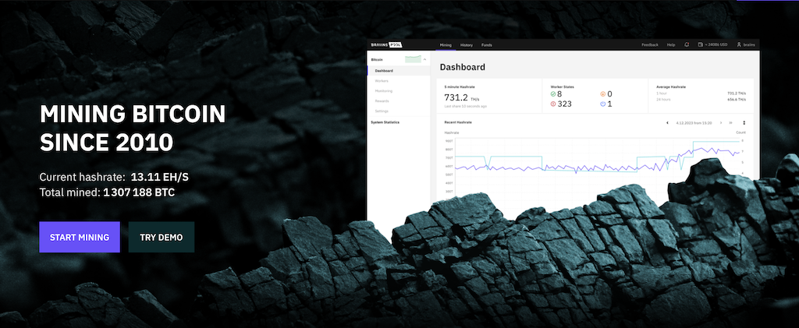
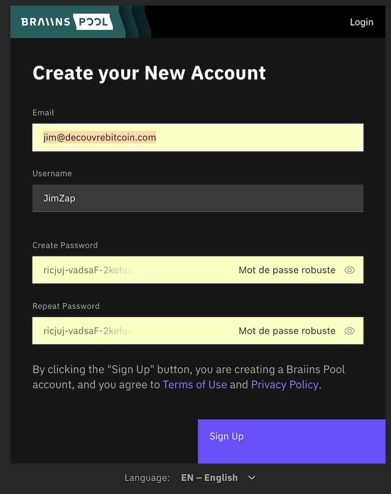
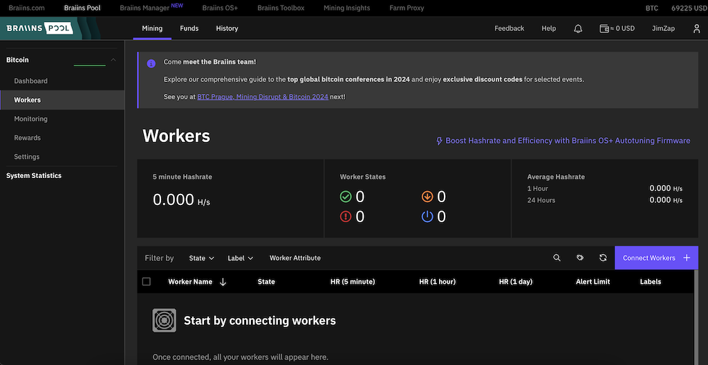
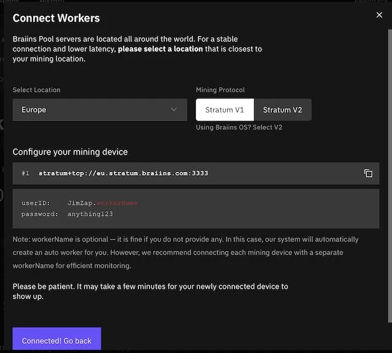
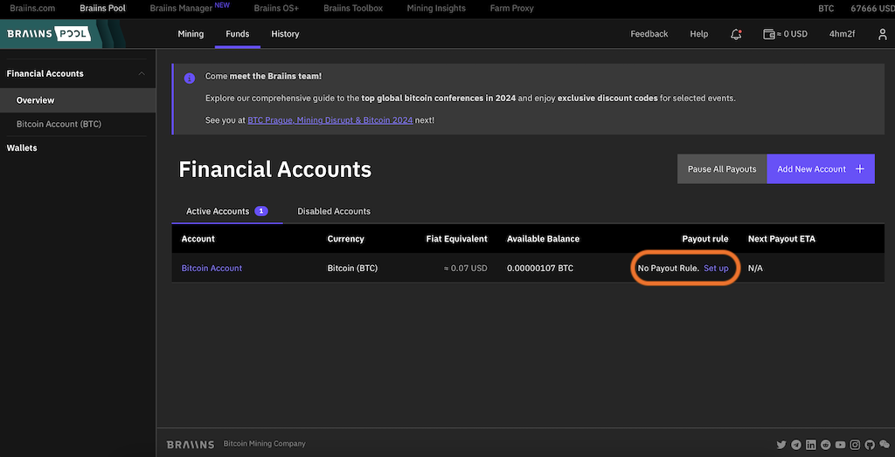
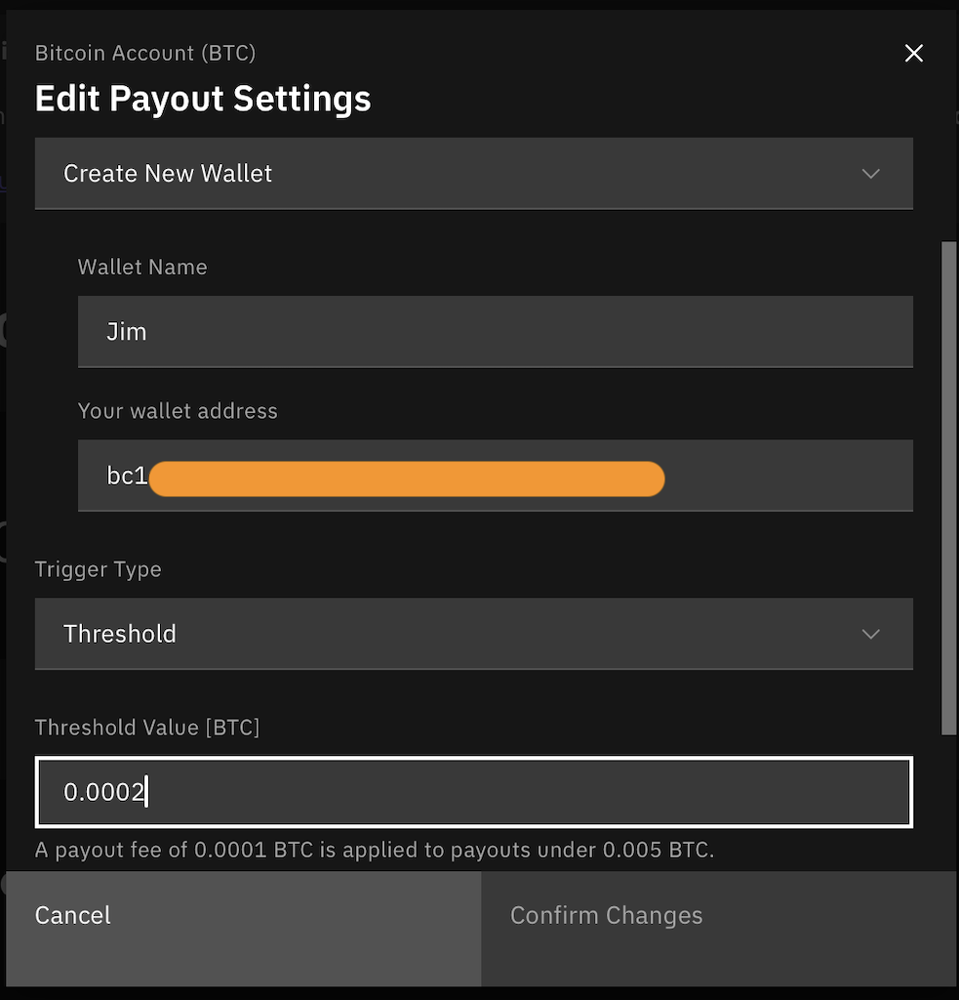
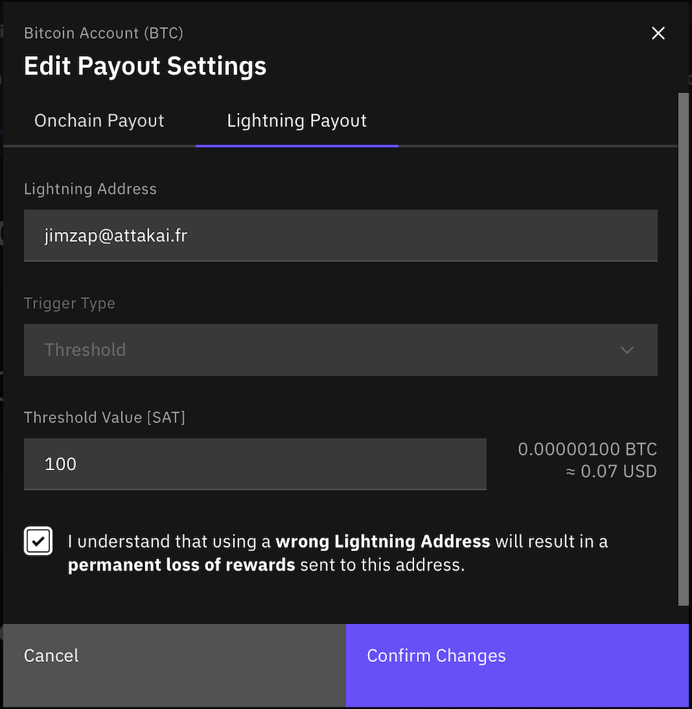
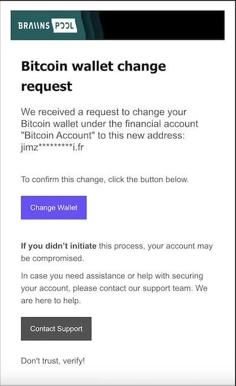
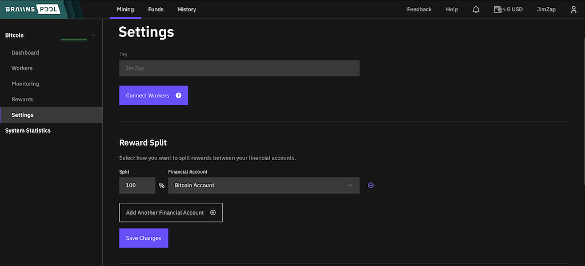

Braiins Pool, precedentemente conosciuto come Slush Pool, è il primo pool di mining di Bitcoin. Fondato nel novembre 2010, ha minato il suo primo blocco il 16 dicembre 2010, blocco 97834.

A maggio 2024, Braiins Pool ha una potenza di calcolo di 13 EH/s, rappresentando circa l'1,8% dell'hashrate totale di Bitcoin. Ha minato un totale di 1.307.188 bitcoin, che è approssimativamente il 6% dei massimi 21 milioni di bitcoin che esisteranno mai.

### Sistema di Compensazione

Dalla fine del 2023, Braiins Pool ha cambiato il suo sistema di compensazione adottando il sistema FPPS (Full Pay Per Share). Questo significa che i minatori ricevono ricompense ogni giorno per tutto il loro lavoro del giorno precedente, anche se il pool non ha trovato un blocco. Questo si differenzia dal vecchio sistema dove i minatori ricevevano una ricompensa solo quando il pool trovava un blocco.

**È importante notare, [secondo un tweet di Mononaut](https://x.com/mononautical/status/1777686545715089605) che analizza la TimeChain di Bitcoin, che molti pool di mining utilizzando il sistema FPPS invierebbero i bitcoin minati ad un indirizzo di AntPool, il che significherebbe che AntPool controlla l'hashrate di tutti questi pool, circa il 47% dell'hashrate globale di Bitcoin. Questa è una pessima notizia per la decentralizzazione della rete.**

### Tariffe del Pool

Le tariffe per Braiins Pool sono del 2,5%, tuttavia, se utilizzi BraiinsOS sulle tue macchine le tariffe saranno del 0%

### Prelievi

**Prelievi Lightning**
I prelievi Lightning ti permettono di ritirare le tue ricompense senza un importo minimo una volta al giorno tramite un indirizzo Lightning.
Per utilizzare questo metodo, devi avere un portafoglio compatibile con gli indirizzi Lightning.

**Prelievi On-Chain**
I prelievi On-Chain sono limitati a un importo minimo e possono essere soggetti a tariffe.
Importo minimo: 20.000 sats
Tariffe: 10.000 sats per importi inferiori a 500.000 sats
Gratuiti per importi superiori a 500.000 sats
I prelievi possono essere attivati ​​per intervallo di tempo o per importo.

## Creazione dell'Account

Per iniziare a utilizzare Braiins Pool [vai al loro sito web](https://braiins.com/pool) e clicca su "SIGN UP" in alto a destra

Inserisci le tue informazioni e convalida, riceverai quindi un'email che richiede la conferma del tuo indirizzo. Conferma con il link nell'email ricevuta e poi accedi alla piattaforma

## Aggiungere un "worker"
Un worker è il minatore che collegherai al pool. Per aggiungere un nuovo minatore, clicca su "Workers" nel menu laterale sinistro.

Poi clicca sul pulsante viola "Connect Workers +".

In questa finestra, seleziona la tua area geografica.

Se il minatore che vuoi collegare utilizza BraiinsOS, seleziona il protocollo "Stratum V2". Altrimenti, scegli "Stratum V1".

Avrai le informazioni da inserire nella pagina web del tuo minatore (consulta la documentazione del tuo minatore per sapere dove inserire queste informazioni).

Qui, **"stratum+tcp://eu.stratum.braiins.com:3333"** è l'URL del pool.
**JimZap.workerName** è il tuo identificativo e il nome del tuo miner, dove JimZap è l'identificativo e .workerName è il nome del miner. Se hai più miner, puoi dare loro lo stesso nome, in questo caso la loro potenza di calcolo verrà sommata sulla dashboard, oppure dar loro nomi diversi per monitorarli individualmente.
E la password è sempre la stessa **"anything123"**

Una volta inserite queste informazioni sulla pagina web del tuo miner e avviata l'attività di mining, vedrai apparire dopo qualche minuto il tutto sulla Dashboard di Braiins Pool.

## Panoramica della Dashboard

Nel banner superiore, puoi vedere la hashrate totale media di tutti i tuoi miner su periodi di 5 minuti, 1 ora e 24 ore. E un riassunto del numero di miner online o offline.
Sotto, un grafico ti permette di seguire l'evoluzione della tua potenza di calcolo.

Sotto questo grafico, hai diverse informazioni riguardanti le tue ricompense in sats.

**"Ricompense Minerarie di Oggi"** Indica il numero di sats che hai minato oggi. Alla fine della giornata, questo valore verrà azzerato e i sats verranno inviati al tuo account.

**"Ricompensa Totale di Ieri"** Il numero di sats che hai minato il giorno precedente

**"Profitto Stimato (1 TH/s)"** È una stima del numero di sats che guadagni in un giorno per una potenza di calcolo di 1 TH/s. Per esempio, se il valore è 77 sats, e hai una potenza di calcolo di 10 TH/s continuativamente per tutto il giorno, allora teoricamente guadagneresti 77 x 10 = 770 sats al giorno.

**"Ricompensa Totale"** I sats totali che hai minato con Braiins Pool

**"Schema di Ricompensa"** La tariffa applicata dalla pool

**"Prossimo Pagamento Stimato"** Stima del tempo necessario prima che tu possa prelevare i sats dalla piattaforma. Qui, la stima non mostra nulla perché l'attività di mining è iniziata solo da pochi minuti.

**"Saldo Account"** Il numero di sats disponibili nel tuo account, che poi puoi prelevare.
## Impostazione dei Prelievi
Puoi prelevare le tue ricompense sia on-chain che tramite lightning con un indirizzo.

In alto, clicca su "Fondi". Per default, hai un "Account Bitcoin". Puoi crearne altri per condividere le ricompense. Torneremo su questo nella prossima sezione.

Per ora, clicca su "Imposta".

In questa nuova finestra, puoi scegliere "Pagamento on-chain".

Nomina questo portafoglio, fornisci un indirizzo BTC e seleziona il tipo di trigger che desideri. "Soglia" significa che il pagamento verrà attivato quando hai accumulato una quantità definita di BTC, e con "Intervallo di tempo", il pagamento verrà attivato a intervalli regolari (giorno/settimane/mesi).

Nota che l'importo minimo è 0.0002 BTC e che al di sotto di 0.005 BTC, verrà applicata una commissione di 0.0001 BTC.

Se vuoi utilizzare i prelievi Lightning, avrai bisogno di un portafoglio che fornisca un indirizzo Lightning. Ad esempio, puoi usare getAlby.

Clicca in alto sulla finestra su "Pagamento Lightning".

Inserisci il tuo indirizzo Lightning e spunta la casella "Capisco..." poi convalida.

Con questo metodo di prelievo, le tue ricompense verranno inviate al tuo portafoglio ogni giorno.

Una volta che avrai validato le impostazioni dei tuoi pagamenti, riceverai un'email di conferma.

## Condivisione dei Premi

Braiins Pool consente anche di condividere i tuoi premi su più portafogli.

Per fare ciò, clicca in alto su "Mining" e poi a sinistra su "Impostazioni".

In questa pagina, potrai aggiungere un altro "Account Finanziario" cliccando su "Aggiungi un Altro Account Finanziario" e distribuire i tuoi premi in % tra questi diversi account ai quali devi associare un portafoglio. Per associare un nuovo portafoglio a un Account Finanziario, fai riferimento alla sezione precedente.