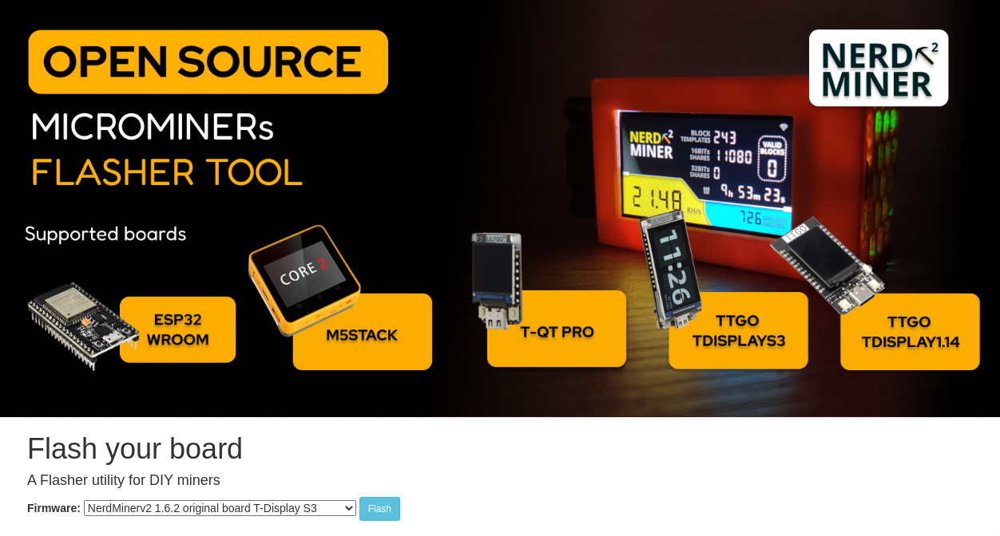
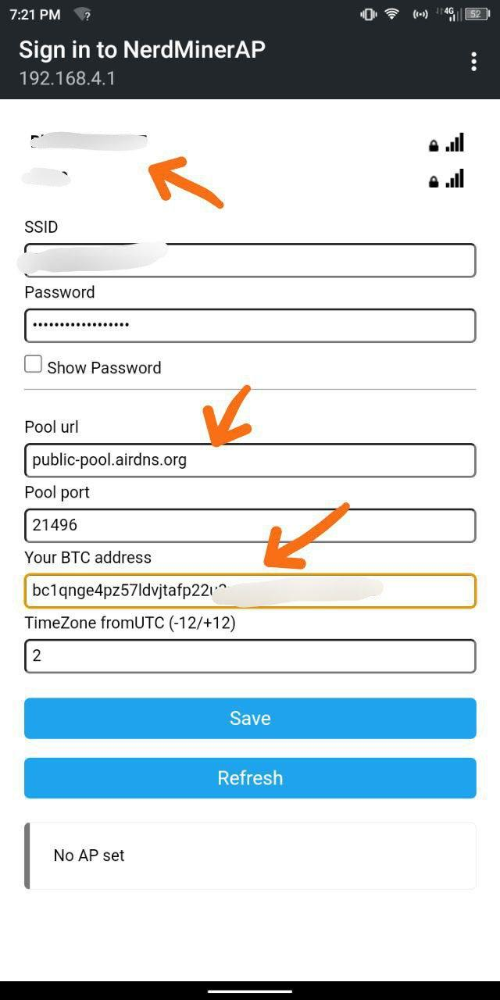
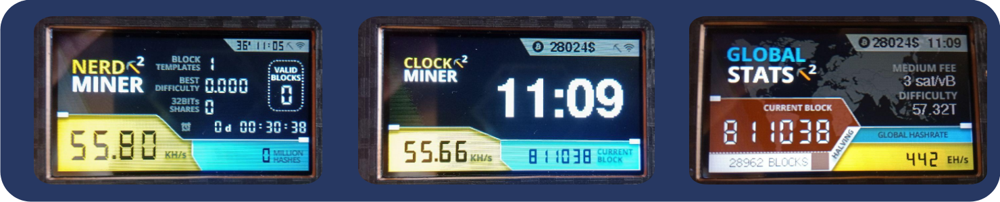

> Setting up your NerdMiner_v2

In this tutorial, we will guide you through the necessary steps to set up a NerdMiner_v2, which is a hardware device (an ESP-32 S3) dedicated to bitcoin mining.
Obviously, the computing power of such a device cannot compete with the ASICs of amateur or professional miners. Nevertheless, the NerdMiner is a perfect educational tool to make bitcoin mining tangible. And who knows, with (a lot of) luck, you might find a block and the reward that goes with it. For the curious, we will see in the [Estimation of the probability of winning](#estimation-de-la-probabilite-de-gain) section. In terms of power consumption, a NerdMiner consumes 0.5W; for comparison, an LED lamp consumes on average 20 times more.

Before going through the different steps, let's list the necessary equipment to make it:

- a [Lilygo T-display S3](https://lilygo.cc/products/t-display-s3)
- a [USB-C power supply](https://amzn.eu/d/gIOot90)
- a 3D case: if you have a 3D printer, you can download the [3D file](https://www.printables.com/model/501547-nerdminer-v2-click-case-w-buttons) otherwise you can buy one on the [Silexperience online store](https://silexperience.company.site/NerdMiner_V2-p544379757).
- a PC with Chrome Browser installed
- an internet connection
- a bitcoin address

You can also buy a pre-assembled NerdMiner kit from several resellers such as:

- [DécouvreBitcoin](https://shop.decouvrebitcoin.com/products/nerd-miner?_pos=1&_psq=nerd&_ss=e&_v=1.0)
- [BitMaker](https://bitronics.store/shop/)

First, we will see how to flash the software onto the ESP-32 S3, and then we will see how to reboot it to change the wifi network. These steps are for Windows users, if you are using a Linux OS, please perform the [preliminary steps](#etapes-preliminaires-pour-utilisateurs-linux) to allow recognition of the ESP-32 S3 by your system.

# Installation of NerdMiner_v2 software

The installation of the software is greatly simplified thanks to the use of the webflasher.

## Step 1: Preparation of the webflasher

First, you need to go to the [online NM2 flasher](https://bitmaker-hub.github.io/diyflasher/).

Then select the firmware corresponding to your ESP-32. Most of the time it is the default one: the T-Display S3. Then click on "Flash".

> ⚠️ It is important that you use the Chrome browser - as it allows, by default, the use of flash and access to your USB ports.

## Step 2: Connecting the ESP-32

Once the webflasher is launched, a pop-up window will open showing the different USB ports recognized by the browser.
You can then connect your ESP-32, and a new port will be displayed (in this case, it is the ttyACM0 port). You must then select it and click on "connect".

The software will then be downloaded to your ESP32 in a matter of seconds.

## Step 3: NerdMiner Configuration

The configuration of your NerdMiner will be done via a smartphone or a computer.
Enable WiFi and connect to the local NerdMinerAP network. If you are using a smartphone, the configuration portal will open automatically. Otherwise, type the address 192.168.4.1 in a browser.
Then select "Configure WiFi".

You can now configure your NerdMiner.
First, start by connecting to your WiFi network by selecting your network name and entering the associated password.

Then you can choose the mining pool you want to participate in. Indeed, it is common in the bitcoin mining industry to pool computing power to increase the chances of finding a block in exchange for sharing the reward proportionally to the provided hashrate.
For NerdMiners, you can choose to connect to one of these pools:

| Pool URL          | Port  | URL                        | Status                                   |
| ----------------- | ----- | -------------------------- | ---------------------------------------- |
| public-pool.io    | 21496 | https://web.public-pool.io | Default Solo and open-source mining pool |
| pool.nerdminer.io | 3333  | https://nerdminer.io       | Maintained by CHMEX                      |
| pool.vkbit.com    | 3333  | https://vkbit.com/         | Maintained by djerfy                     |

Once you have chosen your pool, you need to enter your bitcoin address to receive the reward in case (exceptionally) a block is found.

Also, choose your time zone so that the NerdMiner can display the time correctly.
You can now click on "save".

Congratulations, you are now part of the Bitcoin mining network!

## NerdMiner Operation

The NerdMinerv2 software has 3 different screens, which you can access by clicking on the top button on the right side of your screen:

- The main screen provides access to the statistics of your NerdMiner.
- The second screen provides access to the time, your hashrate, the price of bitcoin, and the block height.
- The third screen provides access to statistics on the global bitcoin mining network.
  

If you want to reboot your NerdMiner, for example to change the WiFi network, you need to press the top button for 5 seconds.

Pressing the bottom button once will turn off your NerdMiner. Clicking twice will rotate the screen orientation.

### Preliminary steps for Linux users

Here are the steps for Chrome to detect your serial port on Linux.

1. Identify the associated port:

- Connect your ESP-32 to your computer.
- Open a terminal.
- Enter the following command to list all ports:
  - `dmesg | grep tty`
  - or `ls /dev/tty*`
- To be certain of the port, you can proceed by elimination by repeating the command without the ESP-32 being connected.

2. Change the permission of the associated port:

- By default, access to serial ports may require root permissions, so we will make them available by adding your user to the `dialout` group.
  - `sudo usermod -a -G dialout YOUR_USERNAME`, replace `YOUR_USERNAME` with your username.
  - then log out and log back in as this user, or restart the system to ensure that the group changes take effect.

Now that your ESP-32 is recognized by your system, you can go back to the [first step](#etape-1-preparation-du-webflasher) for software installation.

## Conclusion

And there you have it! Your NerdMiner_v2 is now configured and ready to use.

Happy mining and may luck be on your side!

### Estimating the probability of winning

Let's have some fun estimating the probability of winning a block reward. This estimation will be rough and only seeks to obtain the order of magnitude of the probability.
Let's assume that our NerdMiner has a hashrate of about 50kH/s and is connected to the [default public pool](https://web.public-pool.io/#/) with a total hashrate of about 100 TH/s.

Knowing that the total hashrate is about 450 EH/s (or $4.5 x 10^20$ hashes per second), we can consider that the probability of the solo mining pool winning the next block is 2 in 10 million, or about once every 5 million blocks, which can happen approximately once per century. And in such an event, a NerdMiner will receive one five-billionth ($5 x 10^(-10)$) of the block reward, which is 31.25 Msats for a reward of 6.25btc.
Well, the chances of winning are more than insignificant, NerdMiner can serve you, in addition to being an educational tool and object of curiosity, as a lottery ticket in bitcoin mining at a marginal electrical cost of 0.5 W. So why not try your luck?

### Additional Information

Here are some links if you want to further read about the subject:

- [NerdMiner_v2 project page](http://github.com/BitMaker-hub/NerdMiner_v2)
- [Complete documentation of NerdMiners](https://docs.bitwater.ch/nerd-miner-v2/)
