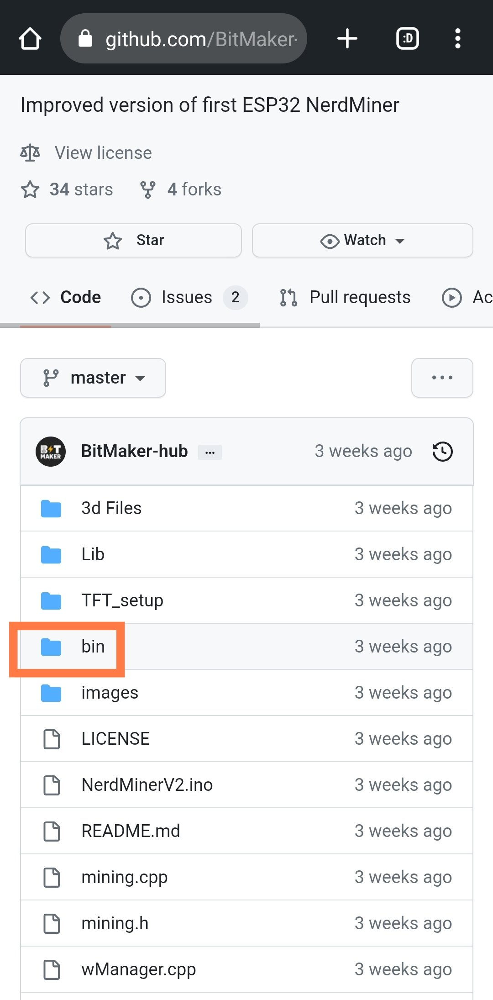
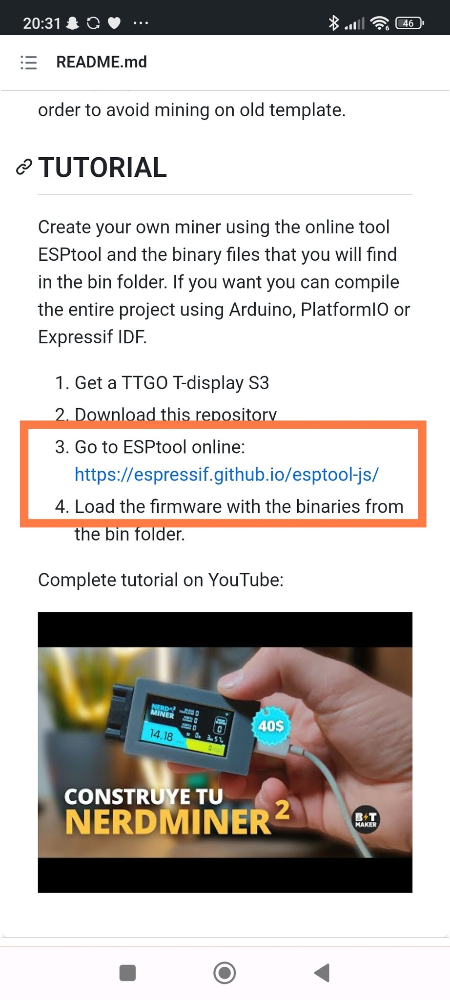
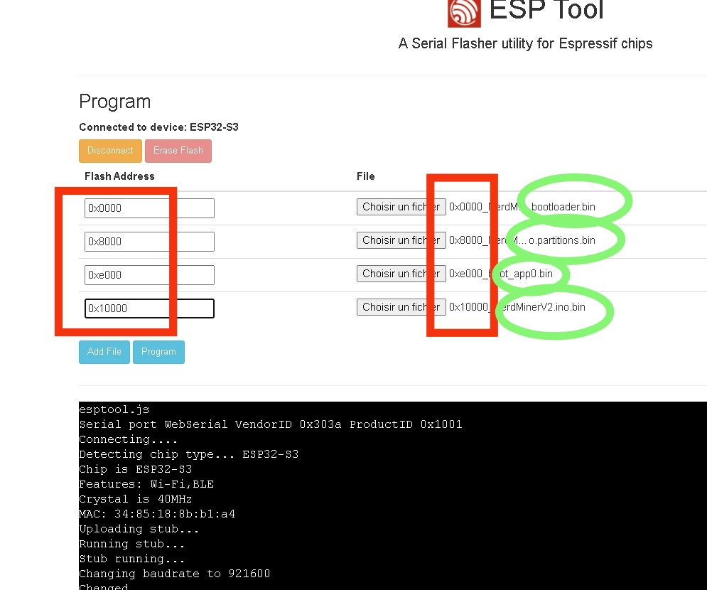

In this guide, we will walk you through the steps needed to set up your NerdMiner_v2. By following these steps, you'll be able to get your system up and running in no time.

## Step 1: Gather Materials

First, you'll need to acquire the necessary hardware. Here are the resources you'll need:

- Lilygo T-display S3: [Purchase here](https://lilygo.cc/products/t-display-s3)
- Power Supply: [Purchase here](https://amzn.eu/d/gIOot90)

You can also visit our project page for more details: [NerdMiner_v2 Project Page](http://github.com/BitMaker-hub/NerdMiner_v2)

## Step 2: Download Files

Download the four necessary files located in the `.bin` folder of our repository.

## Step 3: Navigate to ESPTool

Return to the main project page and click on the link to the ESPTool web flasher. (Tested with Chrome)

## Step 4: Connect your Device

Connect your Lilygo T-display S3 to your PC or Smartphone, then follow the steps below:

1. Click on "Connect."
2. Format by pressing "Erase."

Now, you can add the four previously downloaded files by clicking on the "ADD FILES" button.

## Step 5: Upload Files

Add the files in the order shown below, making sure to correctly input the corresponding addresses. 

Once done, click on "PROGRAM." 

That's it! You just need to reboot and flash the QR code displayed on your ESP and follow the steps! Don't forget to add your WIFI and #Bitcoin address.

## Step 6: Assemble the Casing

Now, it's time to integrate your device into its casing.

You can find the casing here: [Casing Link]

We also have a video guide on how to assemble your device: [[Video Guide Link]](https://twitter.com/i/status/1652260344176189440)

## Conclusion

And there you have it! Your NerdMiner_v2 is now set up and ready to go. 

This tutorial was written by SilexExperience. Many thanks to him!

Happy mining!
