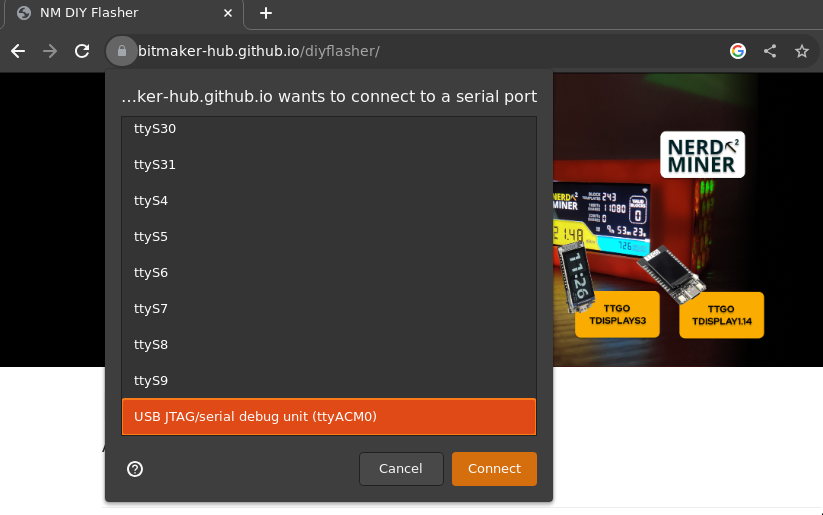
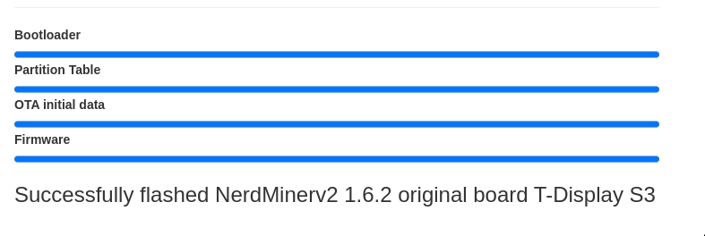

> Configuration de votre NerdMiner_v2

Dans ce tutoriel, nous vous guiderons à travers les étapes nécessaires pour configurer un NerdMiner_v2, qui est un matériel informatique (un ESP-32 S3) dédié au minage de bitcoin.
Évidemment la puissance de calcul d'un tel appareil ne peut rivaliser avec les ASICs des mineurs amateurs ou professionnels. Néanmoins, le NerdMiner est un parfait outil pédagogique pour rendre le minage de bitcoin concret. Et qui sait, avec (beaucoup beaucoup) de chance, vous trouverez peut être un bloc et la récompense qui va avec. Pour les curieux, nous verrons dans la section [Estimation de la probabilité de gain](#estimation-de-la-probabilite-de-gain). En terme de consommation électrique, un NerdMiner consomme 0.5W; à titre de comparaison, une lampe LED consomme en moyenne 20 fois plus.

Avant de passer en revue les différentes étapes, listons le matériel nécessaire pour le réaliser :

- un [Lilygo T-display S3](https://lilygo.cc/products/t-display-s3)
- une [alimentation USB-C](https://amzn.eu/d/gIOot90)
- un boitier 3D : si vous avez une imprimante 3D, vous pouvez télécharger le [ficher 3D](https://www.printables.com/model/501547-nerdminer-v2-click-case-w-buttons) sinon vous pouvez en acheter un sur la [boutique en ligne de Silexperience](https://silexperience.company.site/NerdMiner_V2-p544379757).
- un pc avec Chrome Browser installé
- une connexion internet
- une adresse bitcoin

Vous pouvez également acheter un kit NerdMiner déjà pré-assemblé chez plusieurs revendeurs comme :

- [DécouvreBitcoin](https://shop.decouvrebitcoin.com/products/nerd-miner?_pos=1&_psq=nerd&_ss=e&_v=1.0)
- [BitMaker](https://bitronics.store/shop/)

Dans un premier temps, nous allons voir comment flasher le logiciel sur le ESP-32 S3, puis nous verrons comment le rebooter pour changer de réseau wifi. Ces étapes sont faites pour des utilisateurs Windows, si vous utilisez un OS linux veuillez effecturer les [étapes préliminaires](#etapes-preliminaires-pour-utilisateurs-linux) pour permettre la reconnaissance du ESP-32 S3 par votre systmème.

# Installation du logiciel NerdMiner_v2

L'installation du logiciel est grandemment simplifier grâce à l'utilisation du webflasher.

## Étape 1 : Préparation du webflasher

Tout d'abord, il faut vous rendre sur le [flasher NM2 en ligne](https://bitmaker-hub.github.io/diyflasher/).

Puis sélectionnez le firmware correspondant à votre ESP-32. La plupart du temps c'est celui par défaut : le T-Display S3. Puis cliquer sur "Flash".

> ⚠️ Il est important que vous utilisiez le navigateur Chrome - celui-ci autorisant par défaut, l'utilisation de flasher et l'accès à vos port USB.

## Étape 2: Branchement du ESP-32

Une fois le webflasher lancer une fenêtre pop-up s'ouvre présentant les différents ports USB reconnu par le naviguateur.
Vous pouvez alors brancher votre ESP-32, et un nouveau port s'affichera (ici en l'occurence, c'est le port ttyACM0). Il vous faut alors le sélectionner et cliquez sur "connect".

Le logiciel va alors se télécharger sur votre ESP32, en une poignet de secondes.

## Étape 3: Configuration du NerdMiner

La configuration de votre NerdMiner va être effectuer via un smartphone ou un ordinateur.
Activez le WiFi et connectez vous au réseau local NerdMinerAP. Si vous utilisez un smartphone, le portail de configuration s'ouvrira automatiquement, sinon tapez dans un naviguateur l'adresse 192.168.4.1.
Puis sélectionnez "Configure WiFi".

Vous allez pouvoir maintenant paramétrer votre Nerdminer.
Tout d'abord commencez par vous connectez à votre réseau WiFi, en sélectionnant votre nom de réseau et en y ajoutant le mot de passe associé.

Ensuite vous pouvez choisir la pool de minage à laquelle vous souhaitez participer. En effet, il est commun dans l'industrie du minage de bitcoin de mutualiser la puissance de calcul pour augmenter ses chances de trouver un bloc en échange de partager la récompense au prorata du hashrate fourni.
Pour les NerdMiner, vous pouvez choisir de vous connectez à l'une de ces pools :

| Pool URL          | Port  | URL                        | Status                                        |
| ----------------- | ----- | -------------------------- | --------------------------------------------- |
| public-pool.io    | 21496 | https://web.public-pool.io | Pool par défaut de minage Solo et open-source |
| pool.nerdminer.io | 3333  | https://nerdminer.io       | Maintenu par CHMEX                            |
| pool.vkbit.com    | 3333  | https://vkbit.com/         | Maintenu par djerfy                           |

Une fois que vous avez choisi votre pool, il vous faut rentrer votre adresse bitcoin afin de récupérer la récompense en cas (exceptionnel) de bloc trouvé.

Choisissez également votre fuseau horaire pour que le NerdMiner puisse vous afficher correctement l'heure.
Vous pouvez à présent cliquer sur "save".

Félicitation vous faites à présent partie du réseau de minage Bitcoin !

## Manipulation du NerdMiner

Le logiciel NerdMinerv2 comprends 3 écrans différents, que vous pouvez accèser en cliquant sur le bouton du haut, à droite de votre écran :

- l'écran principal donne accès au statistique de votre NerdMiner
- l'écran secondaire donne accès à l'heure, votre hashrate, le prix du bitcoin et la hauteur de bloc
- l'écran tertiaire donne accès aux statistiques du réseau mondial de minage sur bitcoin

Si vous souhaitez rebooter votre NerdMiner, pour changez de réseau WiFi par exemple, il faut appuyez pendant 5 secondes le bouton du haut.

Si vous appuyer une fois sur le bouton en bas, cela éteint votre NerdMiner. Cliquer deux fois permet d'inverser l'orientation de l'écran.

### Étapes préliminaires pour utilisateurs linux

Voici les étapes pour que Chrome puisse détecter votre port sérial sur un linux.

1. Identifier le port associé :

- Branchez votre ESP-32 à votre ordianteur
- Ouvrez un terminal
- Entrez la commande suivante pour lister tous les ports :
  - ` dmesg | grep tty`
  - ou `ls /dev/tty*`
- Pour être certain du port vous pouvez procéder par élimination en recommençant la commande sans que l'ESP-32 soit branché

2. Changer la permission du port associé :

- Par défaut, l'accès aux ports série peut nécessiter des permissions root, on va donc les rendre disponibles en ajoutant votre utilisateur au groupe `dialout`
  - `sudo usermod -a -G dialout YOUR_USERNAME`, remplacer `YOUR_USERNAME` par votre nom d'utilisateur.
  - puis déconnectez-vous puis reconnectez-vous sous cet utilisateur, ou redémarrez le système pour vous assurer que les modifications de groupe prennent effet.

Maintenant que vous ESP-32 est reconnu par votre système vous pouvez retourner à la [première étape](#etape-1-preparation-du-webflasher) pour l'installation du logiciel.

## Conclusion

Et voilà ! Votre NerdMiner_v2 est maintenant configuré et prêt à être utilisé.

Bon minage et que la chance vous sourisse !

### Estimation de la probabilité de gain

Amussons-nous à estimer la probabilité que nous puissions gagner la récompense d'un bloc. Cette estimation sera grossière et cherche uniquement à obtenir l'ordre de grandeur de la probabilité.
Considérons que notre NerdMiner est un hashrate d'environ 50kH/s, et qu'il soit connecté à la [pool publique par défaut](https://web.public-pool.io/#/) qui a un hashrate total d'environ 100 TH/s.

Sachant que le Hashrate total est d'environ 450EH/s (soit $4.5 x 10^20$ hashs par seconde), on peut considérer que la probabilité que la pool de minage solo gagne le prochain bloc de 2 chances sur 10 millions, soit environ 1 fois tous les 5 millions de blocs c'est-à-dire que cela peut arriver à peu près une fois par siècle. Et dans une telle enventualité, un NerdMiner récupèrera un demie milliardième ($5 x 10^(-10)$) de la récompense du bloc; soit 31.25 Msats pour une récompense de 6.25btc.

Bien les chances de gagner sont plus qu'insignifiantes, vous NerdMiner peut vous servir, en plus d'outil pédagogique et object de curiosité, d'un ticket de loterie dans le minage de bitcoins à un coût électrique marginage de 0.5 W. Alors pourquoi pas tenter votre chance ?

### Informations complémentaires

Voici quelques liens si vous souhaitez compléter votre lecture sur le sujet :

- [Page du projet NerdMiner_v2](http://github.com/BitMaker-hub/NerdMiner_v2)
- [Documentation complète des NerdMiners](https://docs.bitwater.ch/nerd-miner-v2/)
