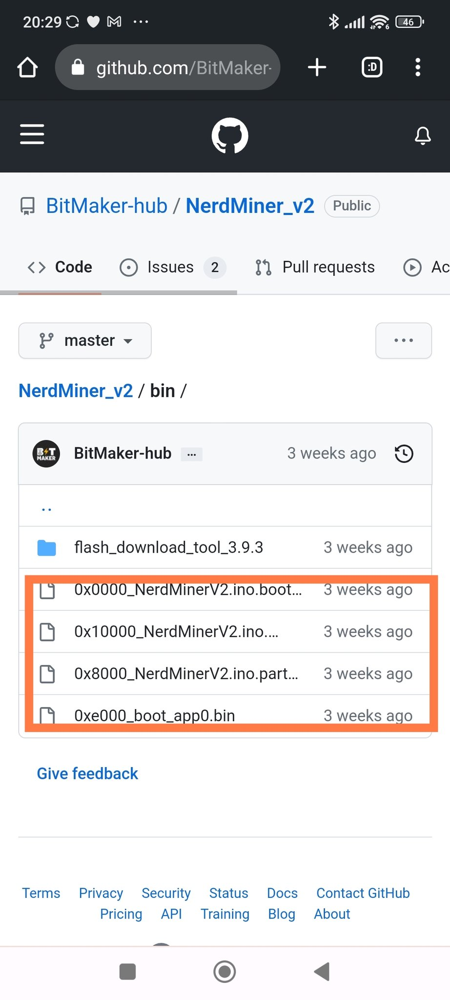
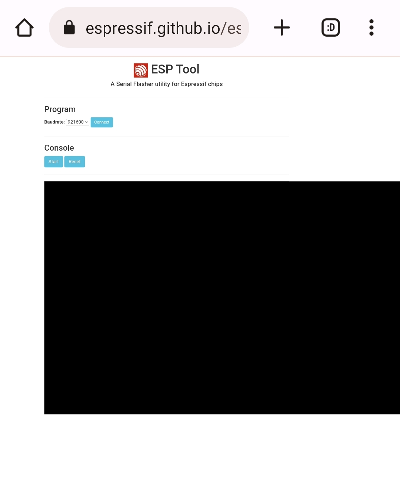
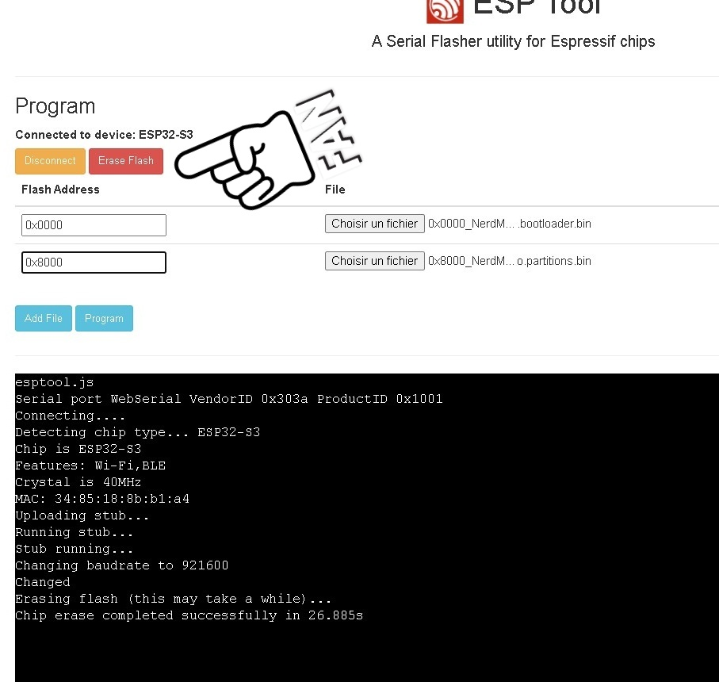
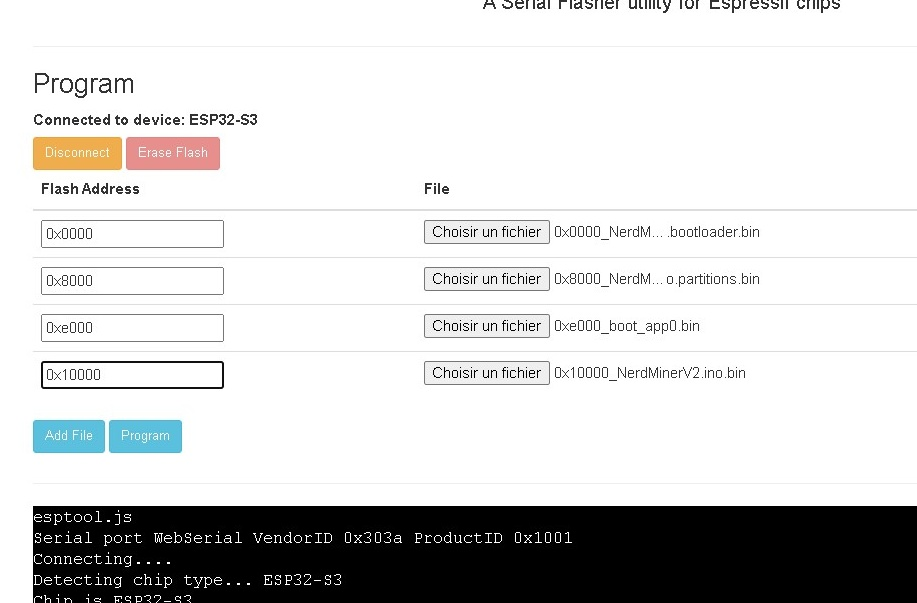

> Configurazione del tuo NerdMiner_v2

In questa guida, ti guideremo attraverso i passaggi necessari per configurare il tuo NerdMiner_v2. Seguendo questi passaggi, sarai in grado di far funzionare il tuo sistema in poco tempo.

## Passo 1: Raccogliere i materiali

Innanzitutto, dovrai procurarti l'hardware necessario. Ecco le risorse di cui avrai bisogno:

- Lilygo T-display S3: [Acquista qui](https://lilygo.cc/products/t-display-s3)
- Alimentatore: [Acquista qui](https://amzn.eu/d/gIOot90)

Puoi anche visitare la nostra pagina del progetto per ulteriori dettagli: [Pagina del progetto NerdMiner_v2](http://github.com/BitMaker-hub/NerdMiner_v2)

## Passo 2: Scaricare i file

Scarica i quattro file necessari situati nella cartella `.bin` del nostro repository.

## Passo 3: Navigare verso ESPTool

Torna alla pagina principale del progetto e clicca sul link per accedere a ESPTool web flasher. (Testato con Chrome)

## Passo 4: Collegare il tuo dispositivo

Collega il tuo Lilygo T-display S3 al tuo PC o smartphone, quindi segui i passaggi seguenti:

1. Clicca su "Connetti".
2. Formatta premendo "Cancella".

Ora puoi aggiungere i quattro file precedentemente scaricati cliccando sul pulsante "AGGIUNGI FILE".

## Passo 5: Caricare i file

Aggiungi i file nell'ordine mostrato di seguito, assicurandoti di inserire correttamente gli indirizzi corrispondenti.

Una volta fatto, clicca su "PROGRAMMA".

Ecco fatto! Devi solo riavviare e flashare il codice QR visualizzato sul tuo ESP e seguire i passaggi! Non dimenticare di aggiungere la tua rete WIFI e l'indirizzo #Bitcoin.

## Passo 6: Assemblare il case

Ora è il momento di integrare il tuo dispositivo nel suo case.

Puoi trovare il case qui: [Link al case]

Abbiamo anche una guida video su come assemblare il tuo dispositivo: [[Link alla guida video]](https://twitter.com/i/status/1652260344176189440)

## Conclusioni

Ecco fatto! Il tuo NerdMiner_v2 è ora configurato e pronto per essere utilizzato.

Questo tutorial è stato scritto da SilexExperience. Un grande ringraziamento a lui!

Buona estrazione!
