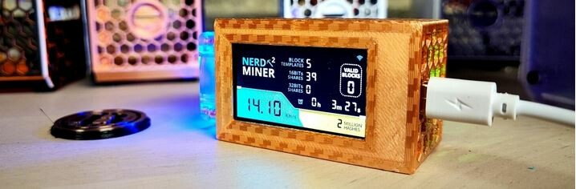
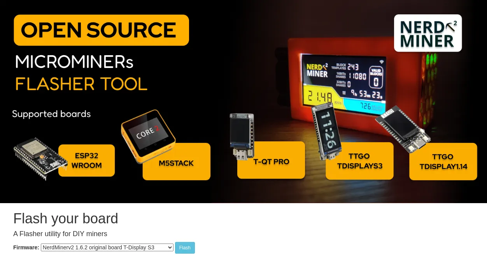
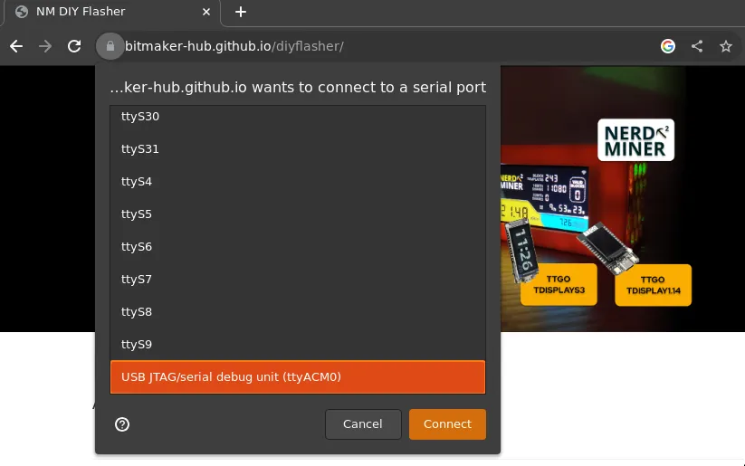
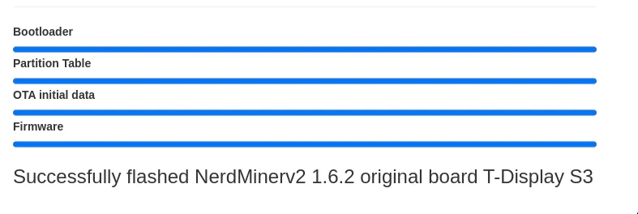
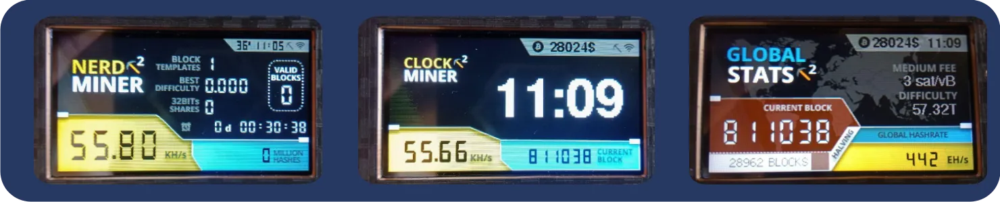

> Configuração do seu NerdMiner_v2

Neste tutorial, vamos guiá-lo através das etapas necessárias para configurar um NerdMiner_v2, que é um hardware (um ESP-32 S3) dedicado à mineração de bitcoin.
Obviamente, o poder de processamento de um dispositivo como esse não pode competir com os ASICs dos mineradores amadores ou profissionais. No entanto, o NerdMiner é uma ferramenta educacional perfeita para tornar a mineração de bitcoin concreta. E quem sabe, com (muita muita) sorte, você pode encontrar um bloco e a recompensa que vem com ele. Para os curiosos, veremos na seção [Estimativa da probabilidade de ganho](#estimativa-da-probabilidade-de-ganho). Em termos de consumo de energia, um NerdMiner consome 0,5W; para fins de comparação, uma lâmpada LED consome em média 20 vezes mais.

Antes de passarmos pelas diferentes etapas, vamos listar o hardware necessário para realizá-lo:

- um [Lilygo T-display S3](https://lilygo.cc/products/t-display-s3)
- uma [fonte de alimentação USB-C](https://amzn.eu/d/gIOot90)
- uma caixa 3D: se você tiver uma impressora 3D, pode baixar o [arquivo 3D](https://www.printables.com/model/501547-nerdminer-v2-click-case-w-buttons) caso contrário, você pode comprar um na [loja online da Silexperience](https://silexperience.company.site/NerdMiner_V2-p544379757).
- um PC com o navegador Chrome instalado
- uma conexão com a internet
- um endereço bitcoin

Você também pode comprar um kit NerdMiner já pré-montado em vários revendedores, como:

- [DécouvreBitcoin](https://shop.decouvrebitcoin.com/products/nerd-miner?_pos=1&_psq=nerd&_ss=e&_v=1.0)
- [BitMaker](https://bitronics.store/shop/)

Primeiro, vamos ver como gravar o software no ESP-32 S3 e depois veremos como reiniciá-lo para mudar a rede Wi-Fi. Essas etapas são para usuários do Windows, se você estiver usando um sistema operacional Linux, siga as [etapas preliminares](#etapas-preliminares-para-usuários-linux) para permitir o reconhecimento do ESP-32 S3 pelo seu sistema.

# Instalação do software NerdMiner_v2

A instalação do software é grandemente simplificada pelo uso do webflasher.

## Etapa 1: Preparação do webflasher

Primeiro, vá para o [flasher NM2 online](https://bitmaker-hub.github.io/diyflasher/).

Em seguida, selecione o firmware correspondente ao seu ESP-32. Na maioria das vezes, é o padrão: o T-Display S3. Em seguida, clique em "Flash".

> ⚠️ É importante que você use o navegador Chrome - ele permite, por padrão, o uso de flash e o acesso às suas portas USB.

## Etapa 2: Conexão do ESP-32

Depois de iniciar o webflasher, uma janela pop-up será aberta mostrando as diferentes portas USB reconhecidas pelo navegador.
Você pode então conectar o seu ESP-32 e uma nova porta será exibida (neste caso, é a porta ttyACM0). Você deve selecioná-la e clicar em "conectar".

O software será então baixado para o seu ESP32 em questão de segundos.

## Etapa 3: Configuração do NerdMiner

A configuração do seu NerdMiner será feita por meio de um smartphone ou computador.
Ative o Wi-Fi e conecte-se à rede local NerdMinerAP. Se estiver usando um smartphone, o portal de configuração será aberto automaticamente, caso contrário, digite o endereço 192.168.4.1 em um navegador.
Em seguida, selecione "Configurar Wi-Fi".

Agora você pode configurar o seu Nerdminer.
Primeiro, conecte-se à sua rede Wi-Fi, selecionando o nome da rede e inserindo a senha associada.

Em seguida, você pode escolher o pool de mineração ao qual deseja participar. Na indústria de mineração de bitcoin, é comum compartilhar o poder de processamento para aumentar as chances de encontrar um bloco em troca de compartilhar a recompensa proporcional ao hashrate fornecido.
Para o NerdMiner, você pode escolher se conectar a um desses pools:

| Pool URL          | Port  | URL                        | Status                                    |
| ----------------- | ----- | -------------------------- | ----------------------------------------- |
| public-pool.io    | 21496 | https://web.public-pool.io | Pool de mineração solo e de código aberto |
| pool.nerdminer.io | 3333  | https://nerdminer.io       | Mantido por CHMEX                         |
| pool.vkbit.com    | 3333  | https://vkbit.com/         | Mantido por djerfy                        |

Depois de escolher o seu pool, você precisa inserir o seu endereço bitcoin para receber a recompensa em caso (excepcional) de encontrar um bloco.

Também escolha o seu fuso horário para que o NerdMiner possa exibir corretamente a hora para você.
Agora você pode clicar em "salvar".

Parabéns, agora você faz parte da rede de mineração de Bitcoin!

## Operação do NerdMiner

O software NerdMinerv2 possui 3 telas diferentes, que você pode acessar clicando no botão no canto superior direito da sua tela:

- A tela principal fornece acesso às estatísticas do seu NerdMiner.
- A segunda tela fornece acesso à hora, ao seu hashrate, ao preço do bitcoin e à altura do bloco.
- A terceira tela fornece acesso às estatísticas da rede global de mineração de bitcoin.
  

Se você deseja reiniciar o NerdMiner, por exemplo, para trocar a rede WiFi, pressione o botão superior por 5 segundos.

Se você pressionar o botão inferior uma vez, o NerdMiner será desligado. Pressionar duas vezes inverte a orientação da tela.

### Etapas preliminares para usuários Linux

Aqui estão as etapas para que o Chrome possa detectar sua porta serial em um sistema Linux.

1. Identificar a porta associada:

- Conecte seu ESP-32 ao seu computador
- Abra um terminal
- Digite o seguinte comando para listar todas as portas:
  - `dmesg | grep tty`
  - ou `ls /dev/tty*`
- Para ter certeza da porta, você pode fazer uma eliminação, repetindo o comando sem o ESP-32 conectado.

2. Alterar a permissão da porta associada:

- Por padrão, o acesso às portas seriais pode exigir permissões de root, então vamos torná-las disponíveis adicionando seu usuário ao grupo `dialout`
  - `sudo usermod -a -G dialout SEU_NOME_DE_USUÁRIO`, substitua `SEU_NOME_DE_USUÁRIO` pelo seu nome de usuário.
  - em seguida, faça logout e login novamente com esse usuário, ou reinicie o sistema para garantir que as alterações de grupo tenham efeito.

Agora que seu ESP-32 é reconhecido pelo sistema, você pode voltar para a [primeira etapa](#etape-1-preparation-du-webflasher) para a instalação do software.

## Conclusão

E pronto! Seu NerdMiner_v2 está agora configurado e pronto para uso.

Boa mineração e que a sorte esteja ao seu lado!

### Estimando a probabilidade de ganhar

Vamos nos divertir estimando a probabilidade de ganhar uma recompensa de bloco. Essa estimativa será aproximada e busca apenas obter a ordem de grandeza da probabilidade.
As piscinas às quais um NerdMiner pode se conectar são apenas "piscinas de mineração solo", o que significa que a piscina não mutualiza a taxa de hash de todos os mineradores conectados, mas atua apenas como coordenadora.
Agora, vamos supor que nosso NerdMiner tenha uma taxa de hash de cerca de 45kH/s.

Sabendo que a taxa de hash total é de cerca de 450 EH/s (ou 4,5 x 10^20 hash por segundo), podemos considerar que a probabilidade de encontrar o próximo bloco é de 1 em 100 milhões de bilhões, o que é muito, muito, muito improvável de acontecer. Portanto, além de ser uma ferramenta educacional e objeto de curiosidade, um NerdMiner pode servir como um bilhete de loteria na mineração de bitcoin a um custo elétrico marginal de 0,5 W - embora, como acabamos de ver, a probabilidade de ganhar seja ridiculamente baixa. Ainda assim, por que não desafiar sua sorte?

### Informações adicionais

Aqui estão alguns links se você quiser ler mais sobre o assunto:

- [Página do projeto NerdMiner_v2](http://github.com/BitMaker-hub/NerdMiner_v2)
- [Documentação completa do NerdMiners](https://docs.bitwater.ch/nerd-miner-v2/
