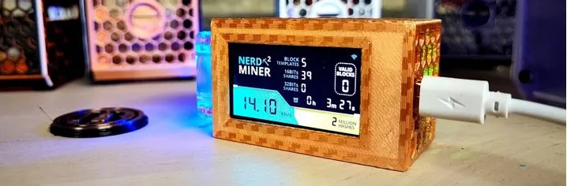

> Настройка вашего NerdMiner_v2

В этом руководстве мы проведем вас через необходимые шаги по настройке NerdMiner_v2, который является аппаратным устройством (ESP-32 S3), предназначенным для майнинга биткоинов.
Очевидно, что вычислительная мощность такого устройства не может конкурировать с ASIC-ами любительских или профессиональных майнеров. Тем не менее, NerdMiner является идеальным образовательным инструментом, делающим майнинг биткоинов осязаемым. И кто знает, с (большой) долей удачи, вы можете найти блок и получить за это вознаграждение. Для любопытных мы рассмотрим в разделе [Оценка вероятности выигрыша](#estimation-de-la-probabilite-de-gain). Что касается потребления энергии, NerdMiner потребляет 0,5 Вт; для сравнения, светодиодная лампа потребляет в среднем в 20 раз больше.

Прежде чем перейти к различным шагам, давайте перечислим необходимое оборудование для его создания:

- [Lilygo T-display S3](https://lilygo.cc/products/t-display-s3)
- [USB-C блок питания](https://amzn.eu/d/gIOot90)
- 3D корпус: если у вас есть 3D принтер, вы можете скачать [3D файл](https://www.printables.com/model/501547-nerdminer-v2-click-case-w-buttons), в противном случае вы можете купить его в [интернет-магазине Silexperience](https://silexperience.company.site/NerdMiner_V2-p544379757).
- ПК с установленным браузером Chrome
- Интернет-соединение
- Биткоин-адрес

Вы также можете купить предварительно собранный комплект NerdMiner у нескольких реселлеров, таких как:

- [DécouvreBitcoin](https://shop.decouvrebitcoin.com/products/nerd-miner?_pos=1&_psq=nerd&_ss=e&_v=1.0)
- [BitMaker](https://bitronics.store/shop/)

Сначала мы рассмотрим, как прошить программное обеспечение на ESP-32 S3, а затем мы увидим, как его перезагрузить для смены Wi-Fi сети. Эти шаги предназначены для пользователей Windows, если вы используете Linux OS, пожалуйста, выполните [предварительные шаги](#etapes-preliminaires-pour-utilisateurs-linux) для обеспечения распознавания ESP-32 S3 вашей системой.

# Установка программного обеспечения NerdMiner_v2

Установка программного обеспечения значительно упрощена благодаря использованию веб-флешера.

## Шаг 1: Подготовка веб-флешера

Сначала вам нужно перейти на [онлайн NM2 флешер](https://bitmaker-hub.github.io/diyflasher/).

Затем выберите прошивку, соответствующую вашему ESP-32. В большинстве случаев это стандартная: T-Display S3. Затем нажмите на "Flash".

> ⚠️ Важно использовать браузер Chrome - так как он по умолчанию позволяет использовать флеш и доступ к вашим USB-портам.

## Шаг 2: Подключение ESP-32

Как только веб-флешер будет запущен, откроется всплывающее окно, показывающее различные USB-порты, распознанные браузером.
Затем вы можете подключить ваш ESP-32, и новый порт будет отображаться (в данном случае это порт ttyACM0). Затем вам нужно выбрать его и нажать на "подключить".

После этого программное обеспечение будет загружено на ваш ESP32 за считанные секунды.

## Шаг 3: Конфигурация NerdMiner

Конфигурация вашего NerdMiner будет производиться через смартфон или компьютер.
Включите WiFi и подключитесь к локальной сети NerdMinerAP. Если вы используете смартфон, портал конфигурации откроется автоматически. В противном случае введите адрес 192.168.4.1 в браузере.
Затем выберите "Настроить WiFi".

Теперь вы можете настроить ваш NerdMiner.
Сначала начните с подключения к вашей WiFi-сети, выбрав имя вашей сети и введя соответствующий пароль.

Затем вы можете выбрать пул для майнинга, в котором хотите участвовать. Действительно, в индустрии майнинга биткоинов обычно объединяют вычислительную мощность для увеличения шансов на нахождение блока в обмен на пропорциональное деление награды в соответствии с предоставленным хешрейтом.
Для NerdMiner вы можете подключиться к одному из этих пулов:

| URL пула          | Порт  | URL                        | Статус                                   |
| ----------------- | ----- | -------------------------- | ---------------------------------------- |
| public-pool.io    | 21496 | https://web.public-pool.io | Стандартный Solo и открытый пул для майнинга |
| pool.nerdminer.io | 3333  | https://nerdminer.io       | Поддерживается CHMEX                      |
| pool.vkbit.com    | 3333  | https://vkbit.com/         | Поддерживается djerfy                     |

После выбора пула вам нужно ввести ваш биткоин-адрес для получения награды в случае (исключительно) нахождения блока.

Также выберите ваш часовой пояс, чтобы NerdMiner мог корректно отображать время.
Теперь вы можете нажать на "сохранить".

Поздравляем, теперь вы являетесь частью сети майнинга биткоинов!

## Работа NerdMiner

Программное обеспечение NerdMinerv2 имеет 3 различных экрана, к которым вы можете получить доступ, нажав на верхнюю кнопку с правой стороны экрана:

- Основной экран предоставляет доступ к статистике вашего NerdMiner.
- Второй экран предоставляет доступ к времени, вашему хешрейту, цене биткоина и высоте блока.
- Третий экран предоставляет доступ к статистике о глобальной сети майнинга биткоинов.
  

Если вы хотите перезагрузить ваш NerdMiner, например, чтобы изменить WiFi-сеть, вам нужно нажать на верхнюю кнопку на 5 секунд.

Нажатие на нижнюю кнопку один раз выключит ваш NerdMiner. Двойное нажатие изменит ориентацию экрана.

### Предварительные шаги для пользователей Linux

Вот шаги, чтобы Chrome обнаружил ваш серийный порт в Linux.

1. Определите ассоциированный порт:

- Подключите ваш ESP-32 к компьютеру.
- Откройте терминал.
- Введите следующую команду для отображения всех портов:
  - `dmesg | grep tty`
  - или `ls /dev/tty*`
- Чтобы быть уверенным в порте, вы можете произвести идентификацию методом исключения, повторив команду без подключенного ESP-32.

2. Измените разрешение ассоциированного порта:
- По умолчанию доступ к последовательным портам может требовать прав root, поэтому мы сделаем их доступными, добавив вашего пользователя в группу `dialout`. - `sudo usermod -a -G dialout YOUR_USERNAME`, замените `YOUR_USERNAME` на ваше имя пользователя.
  - затем выйдите из системы и войдите снова под этим пользователем или перезагрузите систему, чтобы убедиться, что изменения группы вступили в силу.

Теперь, когда ваш ESP-32 распознается системой, вы можете вернуться к [первому шагу](#etape-1-preparation-du-webflasher) для установки программного обеспечения.

## Заключение

Вот и все! Ваш NerdMiner_v2 теперь настроен и готов к использованию.

Счастливого майнинга и пусть удача будет на вашей стороне!

### Оценка вероятности выигрыша

Давайте немного повеселимся, оценив вероятность выигрыша блокового вознаграждения. Эта оценка будет приблизительной и направлена на получение порядка величины вероятности.
Пул, к которому может подключаться NerdMiner, является только "пулом для соло-майнинга", что означает, что пул не объединяет хешрейт всех подключенных майнеров, а просто действует как координатор.
Теперь предположим, что наш NerdMiner имеет хешрейт около 45kH/s.

Учитывая, что общий хешрейт составляет около 450 EH/s (или 4.5 x 10^20 хешей в секунду), мы можем считать, что вероятность найти следующий блок составляет 1 из 100 миллионов миллиардов, что очень, очень, очень маловероятно. Таким образом, помимо того, что является образовательным инструментом и объектом любопытства, NerdMiner может служить лотерейным билетом в майнинге биткоинов при маргинальной электрической стоимости 0.5 Вт, хотя, как мы только что видели, вероятность выигрыша невероятно низка. Но почему бы и не испытать свою удачу?

### Дополнительная информация

Вот некоторые ссылки, если вы хотите узнать больше о теме:

- [Страница проекта NerdMiner_v2](http://github.com/BitMaker-hub/NerdMiner_v2)
- [Полная документация NerdMiners](https://docs.bitwater.ch/nerd-miner-v2/)