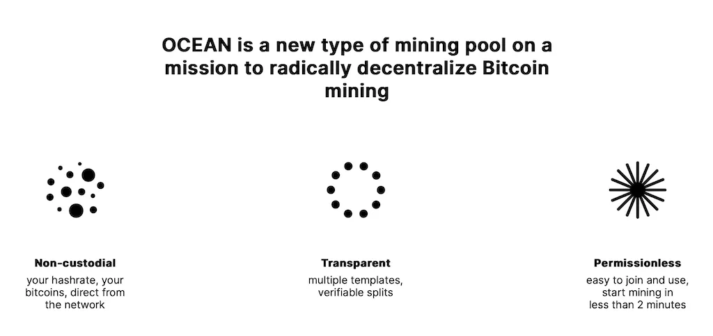

**Maggio 2024**

Ocean Mining è un pool di mining alquanto unico. Qui, non sono richiesti account, indirizzi email, né password. Proprio come per Bitcoin, tutto è trasparente, pseudonimo, e i contributori possono scegliere tra quattro diversi template di blocco.

### Sistema di Compensazione

Il sistema di compensazione di Ocean si chiama TIDES, "Transparent Index of Distinct Extended Shares" (Indice Trasparente di Quote Distinte Estese). Questo sistema registra il lavoro fornito dai minatori, noto come "quote". Il pool calcola la percentuale di "quote" per ogni contributore, poi aggiunge il loro indirizzo Bitcoin nel template di blocco del pool come beneficiario di questa percentuale della ricompensa del blocco.

Il template di blocco è aggiornato circa ogni 10 secondi per tenere conto delle nuove transazioni più lucrative e per cambiare la distribuzione della ricompensa del blocco se necessario.

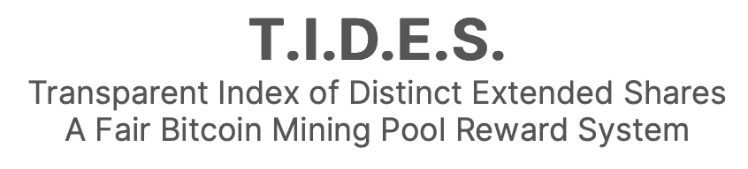

Non importa se le tue macchine sono collegate o meno al momento in cui il pool mina un nuovo blocco. Il lavoro già inviato viene conservato per i successivi otto blocchi trovati dal pool.

Conservare il lavoro per otto blocchi invece di azzerare i contatori con ogni nuovo blocco minato significa che la tua compensazione sarà del 100% solo una volta che il pool ha trovato otto blocchi dopo che hai iniziato a contribuire. Questo significa anche che continuerai a essere compensato per otto blocchi se smetti di contribuire al pool.

Questo meccanismo livella la compensazione e scoraggia il "pool hopping", che consiste nel cambiare pool regolarmente a seconda di quale si ritiene sia più probabile che trovi il prossimo blocco.

### Prelievi

L'operazione di Ocean Mining consente ai suoi contributori di recuperare bitcoin "puliti", ovvero bitcoin che sono emessi direttamente dalla ricompensa del blocco.

A differenza della maggior parte degli altri pool, Ocean non riceve i bitcoin appena minati; gli indirizzi dei contributori sono integrati direttamente nel template di blocco.

Per ora, la quantità minima per beneficiare realmente dei bitcoin puliti è di 1.048.576 sats. Con ogni blocco minato dal pool, la tua quota di "quote" deve darti diritto a più di 1.048.576 sats affinché questi ti vengano pagati direttamente dalla ricompensa del blocco.
Altrimenti, i tuoi sats verranno conservati da Ocean fino a quando le tue ricompense totali non supereranno questa quantità.

Tutti i bitcoin temporaneamente conservati da Ocean sono su questo indirizzo: [37dvwZZoT3D7RXpTCpN2yKzMmNs2i2Fd1n, tutto è verificabile sulla TimeChain.](https://mempool.space/address/37dvwZZoT3D7RXpTCpN2yKzMmNs2i2Fd1n)
È anche possibile prelevare i tuoi sats tramite Lightning usando BOLT12. Vedremo come configurarlo.

### Tariffe del Pool

Le tariffe variano dal 0% al 2% a seconda del template di blocco scelto.

## La Trasparenza di Ocean

### Dati dei Contributori

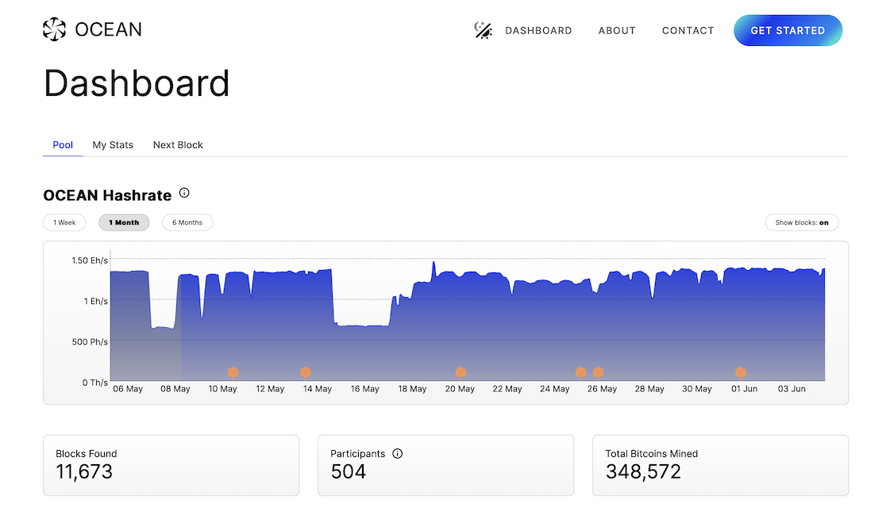

Tutte le informazioni riguardanti il pool sono trasparenti, inclusi tutti i dati degli utenti. Per comprendere questo punto, prendiamo un esempio:

[Nella dashboard di Ocean](https://ocean.xyz/dashboard), hai numerose informazioni come l'hashrate degli ultimi sei mesi, il numero di partecipanti nel pool, il numero totale di bitcoin minati, ecc.

Ci concentreremo sulla sezione "Contributori". Puoi vedere l'elenco di tutti i contributori con il loro hashrate medio nelle ultime tre ore così come la percentuale di **"quote"** e **"hash"** rispetto al resto del pool.
**"Percentuale di Azioni"** rappresenta la percentuale di lavoro fornita dal contributore nell'arco degli ultimi otto blocchi rispetto al resto del pool.
**"Percentuale di Hash"** è la percentuale della media del hashrate fornita dal contributore nelle ultime tre ore rispetto al resto del pool.

Noterai che i "Contributori" sono identificati da un indirizzo Bitcoin. Puoi cliccare su uno qualsiasi di questi indirizzi per maggiori dettagli.

Se prendiamo il primo, quello con il hashrate più alto [1GRfspGGx4Ne66YotWuosUc4WeJLfGE3dZ](https://ocean.xyz/stats/1GRfspGGx4Ne66YotWuosUc4WeJLfGE3dZ), puoi vedere tutti i dettagli su questo utente: hashrate, numero di bitcoin estratti, con quale blocco, e persino i dettagli di ciascuna delle loro macchine (ASIC). Tuttavia, rimangono anonimi, come su Bitcoin.

### Modello di Blocco

In alto a sinistra sulla dashboard, hai "Prossimo blocco". Su questa pagina ci sono quattro diversi modelli di blocchi. Ocean permette a ogni contributore di scegliere il modello di blocco che desidera supportare. Questo non ha un impatto diretto sulla tua compensazione. Quando il pool estrae un blocco, tutti i contributori sono compensati indipendentemente dal modello scelto. Questo semplicemente permette a tutti di "votare" per il modello di blocco che preferiscono.

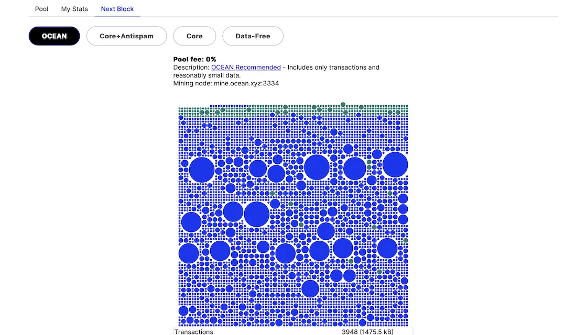

**CORE:** Commissione 2%, questo è il classico modello Bitcoin Core senza filtro, come scritto sulla loro pagina "Include transazioni e la maggior parte dello spam"

**CORE+ANTISPAM:** Commissione 0%, Bitcoin Core con un filtro contro certe transazioni come Ordinals "Include transazioni e limita lo spam"

**OCEAN:** Commissione 0%, Bitcoin Knot "Include solo transazioni e dati ragionevolmente piccoli"

**DATA-FREE:** Commissione 0%, Bitcoin Knot "Include solo transazioni senza dati arbitrari"

### Distinzione tra Bitcoin Core e Bitcoin Knot
Bitcoin Core è il software che permette a circa il 99% dei nodi Bitcoin in tutto il mondo di operare. Bitcoin è un protocollo, il che significa che, proprio come Internet, dove ci sono diversi browser, possono coesistere diversi programmi software sulla stessa TimeChain. Tuttavia, per preoccupazione di compatibilità e per limitare il rischio di bug che lascerebbero tracce indelebili sulla TimeChain, quasi tutti gli sviluppatori di Bitcoin lavorano su Bitcoin Core. Bitcoin Knots è un fork di Bitcoin Core, il che significa che condivide la maggior parte del loro codice, limitando notevolmente il rischio di bug. Questo fork è stato creato da Luke Dashjr, che voleva applicare regole più restrittive rispetto a Bitcoin Core senza creare un hard fork. Ora, Bitcoin Core e Bitcoin Knots coesistono grazie al consenso di Nakamoto.

## Aggiungere un Worker

Per aggiungere un worker, inizia scegliendo il tuo modello di blocco. Questa scelta determinerà l'URL del pool da inserire sul tuo miner (ASIC).

- **CORE**: `stratum+tcp://core.mine.ocean.xyz:3202`
- **CORE+ANTISPAM**: `stratum+tcp://ordis.mine.ocean.xyz:3303`
- **OCEAN**: `stratum+tcp://mine.ocean.xyz:3334`
- **DATA-FREE**: `stratum+tcp://datafree.mine.ocean.xyz:3404`

Successivamente, per il campo utente, inserisci un indirizzo Bitcoin di tua proprietà. Ecco l'elenco dei tipi di indirizzo compatibili:
- **P2PKH** (Tipo di indirizzo originale. Inizia con “1”)
- **P2SH** (Multisignatura o P2SH-Segwit. Inizia con "3")
- **Bech32** (Segwit. Inizia con "bc".)
- **Bech32m** (Taproot. Inizia con "bc". Più lungo di Bech32.)

Se hai più minatori, puoi inserire lo stesso indirizzo per tutti loro così che le loro potenze di calcolo si combinino e appaiano come un singolo minatore. Puoi anche distinguerli aggiungendo un nome distinto a ciascuno. Per fare ciò, aggiungi semplicemente ".nomeminatore" dopo l'indirizzo Bitcoin.

Infine, per il campo della password, usa `x`.

**Esempio:**
Se scegli il template **OCEAN**, il tuo indirizzo Bitcoin è `bc1q2ed8zxq8njqsznkp7gj84n0xwl9dp224uha2fv` e desideri nominare il tuo minatore "Brrrr", allora dovrai inserire le seguenti informazioni nell'interfaccia del tuo minatore:

- **URL**: `stratum+tcp://mine.ocean.xyz:3334`
- **UTENTE**: `bc1q2ed8zxq8njqsznkp7gj84n0xwl9dp224uha2fv.Brrrr`
- **PASSWORD**: `x`

Pochi minuti dopo aver avviato il mining, sarai in grado di vedere i tuoi dati sul sito Ocean cercando il tuo indirizzo.

### Panoramica del Dashboard
- **Quote nella Finestra di Ricompensa**: Questi dati indicano il numero di quote, il lavoro che hai inviato alla pool nella finestra degli ultimi 8 blocchi minati dalla pool.
- **Ricompense Stimati nella Finestra**: Stima del numero di satoshi che guadagnerai con il lavoro già svolto. Questo non tiene conto delle commissioni di transazione, ma solo del coinbase, i nuovi bitcoin emessi dalla rete.
- **Guadagni Stimati per il Prossimo Blocco**: Stima del numero di satoshi guadagnati se un blocco viene minato ora. Ricorda, se questo valore è inferiore a 1.048.576 satoshi, non riceverai direttamente i satoshi al tuo indirizzo. Saranno inviati all'indirizzo di Ocean fino a quando i tuoi guadagni non supereranno questa soglia.

Qui sotto, hai un grafico che mostra la storia della tua potenza di calcolo fino a 6 mesi.

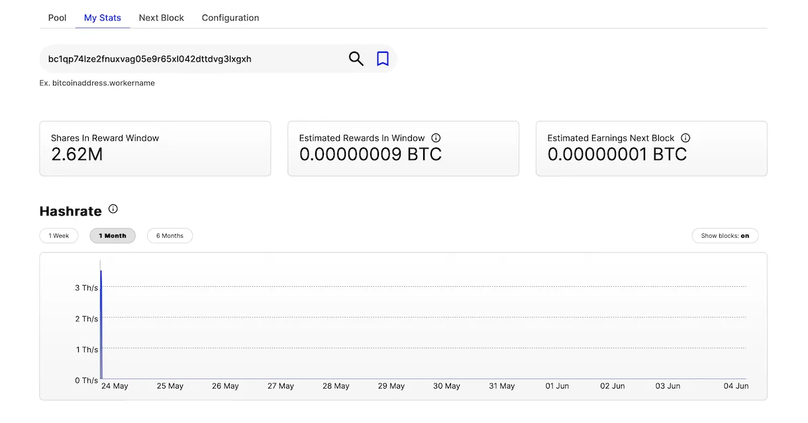

Qui, hai la tua potenza di calcolo media su diverse scale temporali, da 60s a 24h, così come la storia dei blocchi minati dalla pool per cui hai contribuito e ricevuto ricompense.

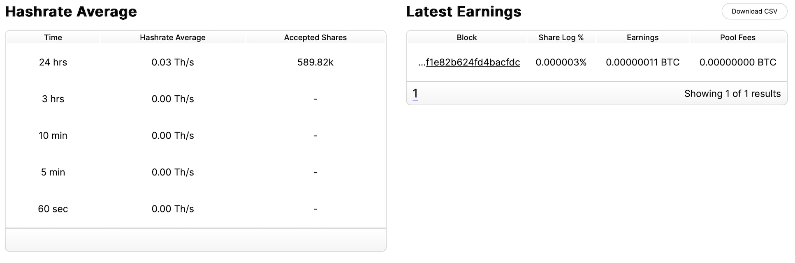

Hai l'opzione di esportare un file CSV di questa storia con il pulsante **Scarica CSV**.

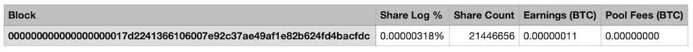

Nella sezione seguente, hai un elenco di tutti i minatori che hai collegato alla pool con questo indirizzo. Hai, ovviamente, la loro potenza di calcolo individuale, ma anche il numero di satoshi che hanno ricevuto individualmente per il loro lavoro.

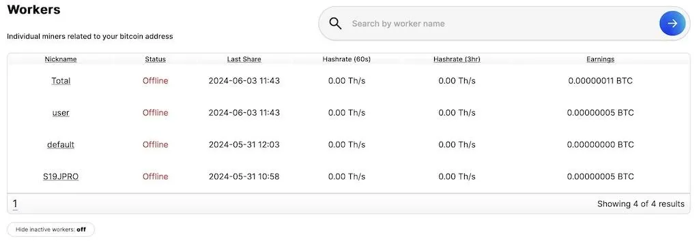

Puoi cliccare sul **Nickname** di qualsiasi minatore. Avrai quindi tutte le informazioni che abbiamo appena visto, ma specificamente per quel minatore.

E in fondo alla pagina, alcune informazioni aggiuntive dove puoi vedere la storia dei pagamenti sul tuo indirizzo, i satoshi che hai minato ma che non ti sono ancora stati pagati, e il totale dei satoshi che hai minato.

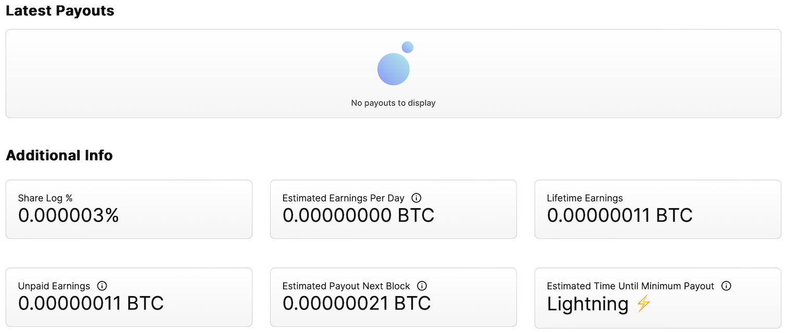

Qui, puoi vedere che nella casella **Tempo Stimato Fino al Pagamento Minimo**, è scritto Lightning perché abbiamo configurato un'offerta BOLT12.

### Configurazione dei Prelievi Lightning
Come avrete capito, Ocean mira a massimizzare la trasparenza e minimizzare la custodia (tenere i vostri satoshi per conto vostro). Ecco perché, per i prelievi Lightning, è necessario utilizzare le **offerte BOLT12**. Questo rappresenta un nuovo modo di effettuare un pagamento sulla rete Lightning che sta iniziando a emergere nel 2024 e consente diverse cose:
- È un link di pagamento riutilizzabile, che consente pagamenti automatici e, a differenza di un indirizzo Lightning, il BOLT12 è non custodial.
- È anche un metodo di pagamento che fornisce la prova che il pagamento è stato effettuato, cosa che non avviene con gli LNURL.
- Molto importante, può essere utilizzato in congiunzione con una firma Bitcoin per dimostrare che si è sia il titolare dell'indirizzo BTC sia dell'offerta BOLT12.
Ad oggi (maggio 2024), esistono poche soluzioni per utilizzare questo metodo. In questo esempio, utilizzeremo un server Start9 con Core Lightning. Quando altri strumenti, come ad esempio Phoenix Wallet, avranno integrato le offerte BOLT12, questo tutorial rimarrà applicabile. Assicuratevi di avere canali aperti con liquidità in entrata, altrimenti i pagamenti non funzioneranno.

Iniziate andando alla vostra dashboard sul sito Ocean inserendo il vostro indirizzo BTC, poi cliccate sulla scheda **Configurazione**.

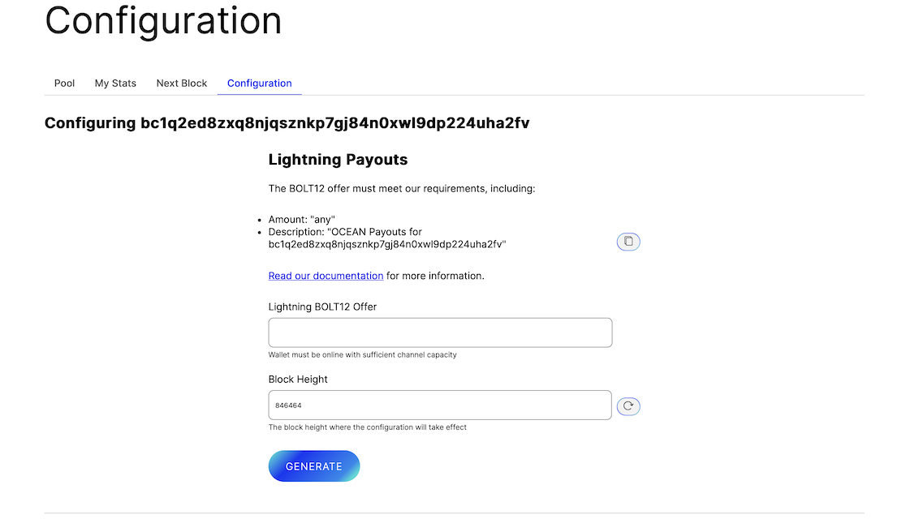

Copieremo il testo **Descrizione**, qui:
`Pagamenti OCEAN per bc1q2ed8zxq8njqsznkp7gj84n0xwl9dp224uha2fv`

Ora andate alla vostra interfaccia Core Lightning sul vostro server Start9 (o qualsiasi portafoglio in grado di fornire un'offerta BOLT12).

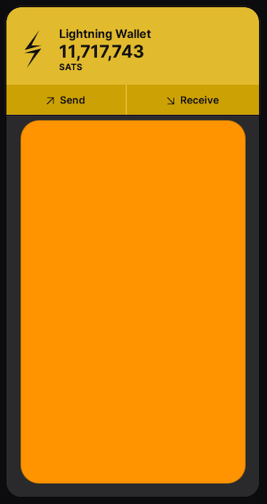

Cliccate su **Ricevi**.

Selezionate **Offerta**, poi incollate il testo precedentemente copiato nel campo **Descrizione** e lasciate vuoto il campo **Importo**.

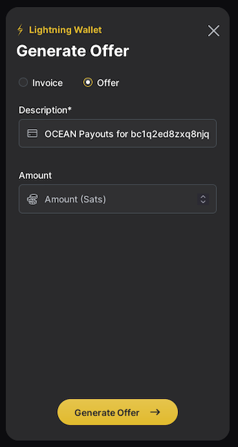

Cliccate su **Genera Offerta**.

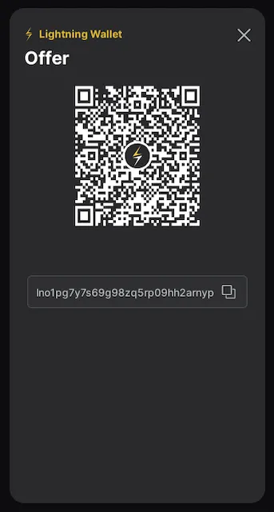

Avete generato un link di pagamento riutilizzabile e permanente che non richiede un server centrale come nel caso degli indirizzi Lightning. Copiate il link e poi ritornate alla pagina Ocean.

Nel campo **Offerta Lightning BOLT12**, incollate il link di pagamento e lasciate il campo **Altezza del Blocco** al suo valore predefinito. Cliccate su **GENERA**.

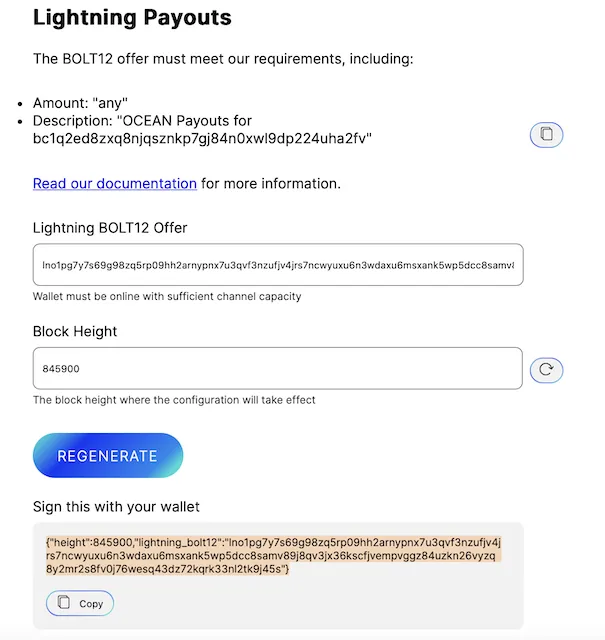

Perché Ocean possa assicurarsi che questo link di pagamento sia davvero vostro senza usare un sistema di account, dovrete firmare il messaggio che è appena stato generato con la vostra chiave privata corrispondente all'indirizzo Bitcoin che state utilizzando. Esistono molte soluzioni per firmare un messaggio con la vostra chiave privata. In questo tutorial, prenderemo l'esempio di BlueWallet, ma il metodo è lo stesso per tutti i portafogli.

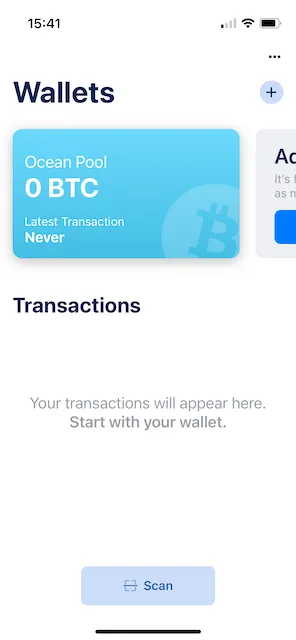

Supponendo che la vostra chiave privata sia in BlueWallet (potete fare lo stesso con un portafoglio hardware), cliccate sul portafoglio interessato.

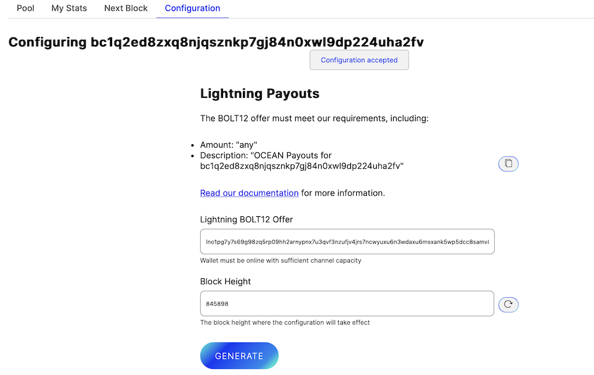

Poi sui **…** in alto a destra.

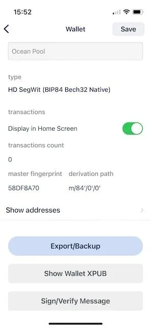

E su **Firma/Verifica Messaggio**.

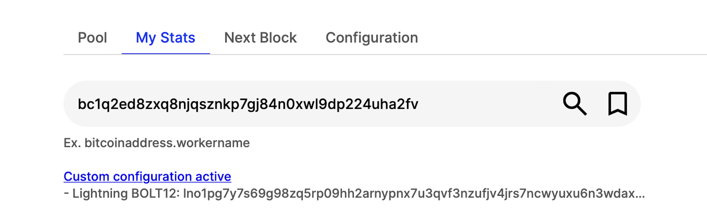

In questa finestra, avete tre campi: **Indirizzo**, **Firma**, e **Messaggio**.

Nel campo **Indirizzo**, inserite il vostro indirizzo Bitcoin. Se torniamo al nostro esempio, è l'indirizzo: `bc1q2ed8zxq8njqsznkp7gj84n0xwl9dp224uha2fv`.

Lasciate vuoto il campo **Firma**.
E incolla il messaggio generato nel campo **Messaggio** sulla pagina di Ocean: `{"height":845900,"lightning_bolt12":"lno1pg7y7s69g98zq5rp09hh2arnypnx7u3qvf3nzufjv4jrs7ncwyuxu6n3wdaxu6msxank5wp5dcc8samv89j8qv3jx36kscfjvempvggz84uzkn26vyzq8y2mr2s8fv0j76wesq43dz72kqrk33nl2tk9j45s"}`Clicca su **Firma**.

Questo genererà una firma crittografica che dimostra che sei il proprietario dell'indirizzo `bc1q2ed8zxq8njqsznkp7gj84n0xwl9dp224uha2fv`, e questa firma è unica grazie al messaggio fornito da Ocean, generato dal link di pagamento BOLT12.

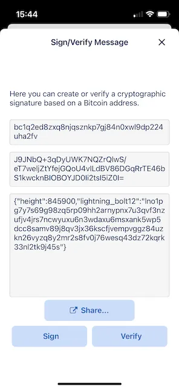

Copia la firma e incollala sulla pagina di Ocean, poi clicca su **CONFERMA**.

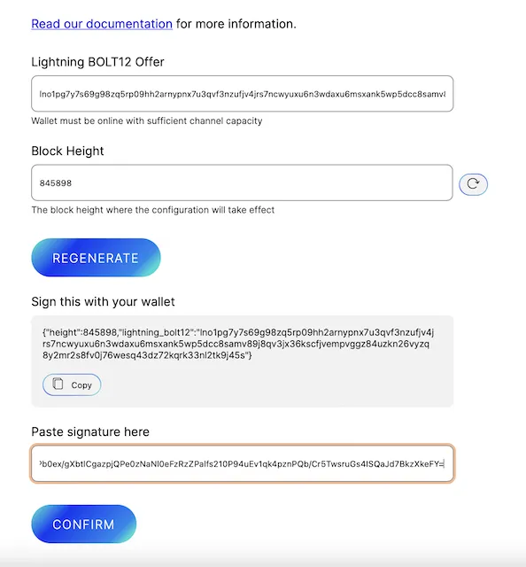

Dovresti vedere un messaggio di conferma.

Ora vai alla scheda **Le Mie Statistiche**. Informazioni aggiuntive sono visualizzate in alto con il link di pagamento BOLT12 che hai precedentemente generato con Core Lightning su Start9.

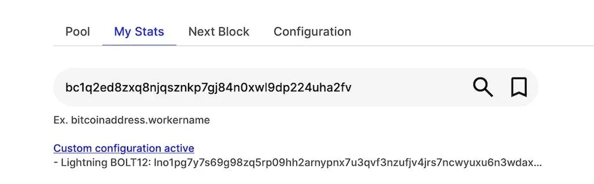