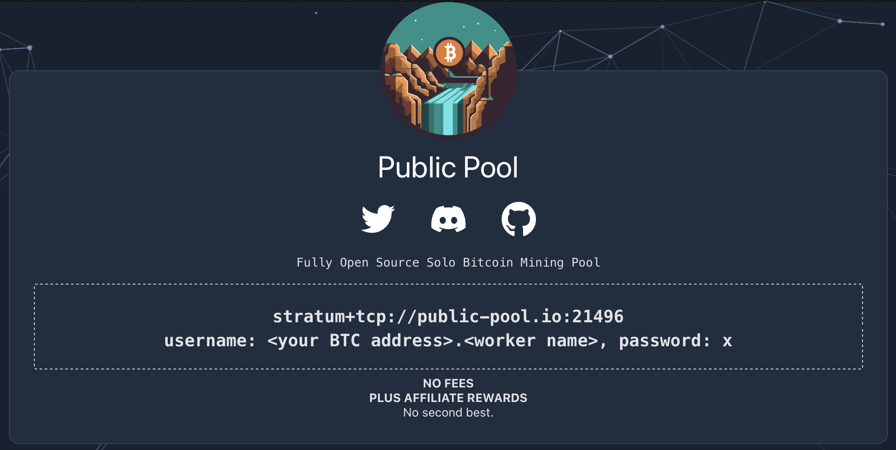
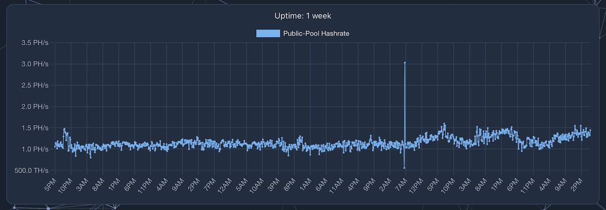
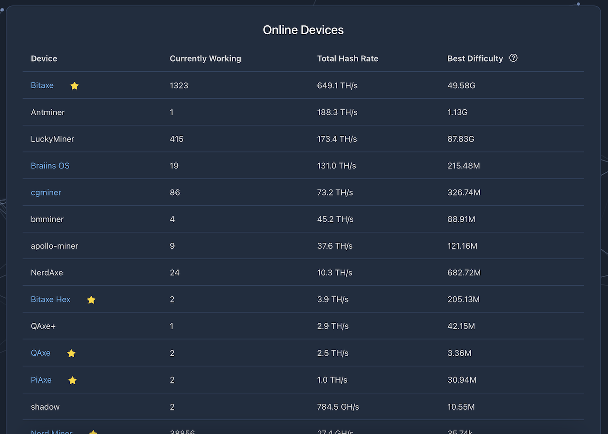
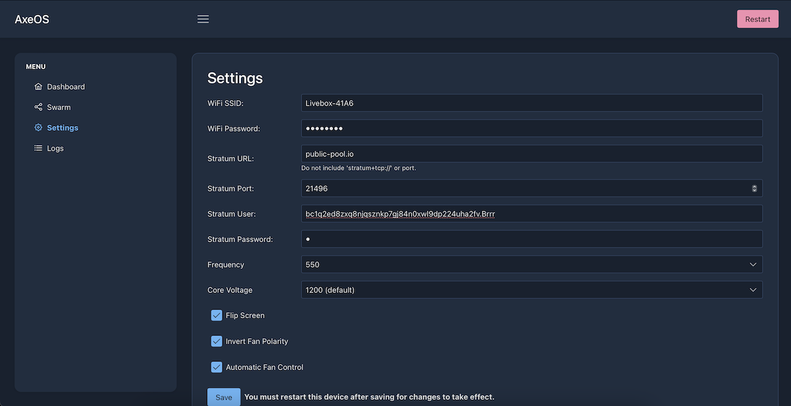
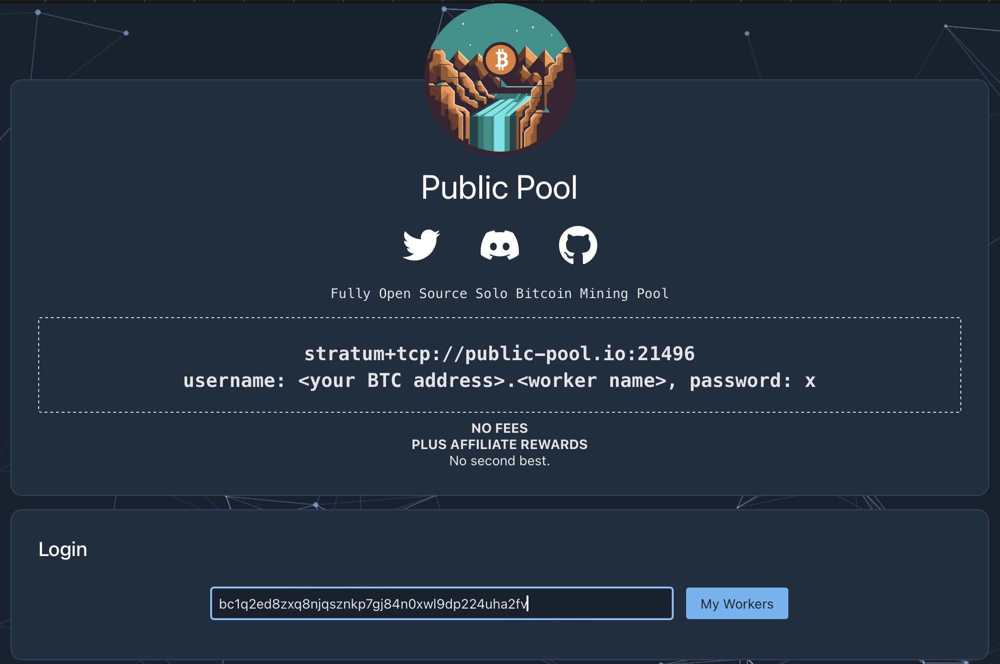
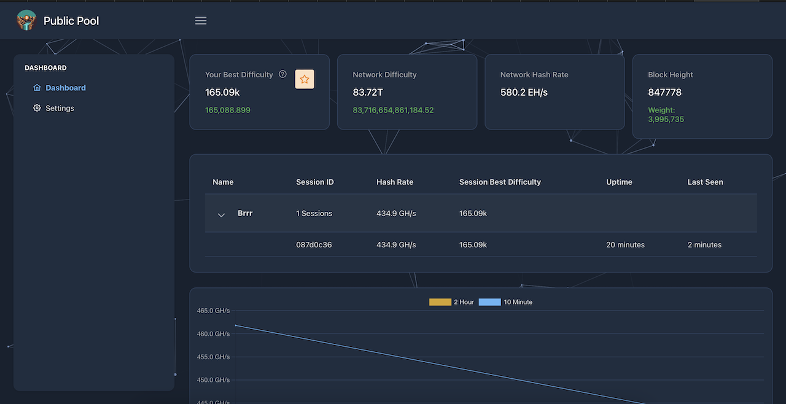

**Public Pool** ist nicht einfach irgendein Pool; es ist das, was auch als **Solo Pool** bekannt ist. Wenn es Ihrem [Miner](https://planb.academy/resources/glossary/miner) gelingt, einen Block zu minen, dann erhalten Sie die gesamte Blockbelohnung, die nicht mit anderen Teilnehmern des Pools oder mit dem Pool selbst geteilt wird.

**Public Pool** stellt lediglich eine **Blockvorlage** für Ihren Miner zur Verfügung, damit dieser seine Aufgabe erfüllen kann, ohne dass Sie einen **Bitcoin-Knoten** und die Software, die mit Ihrem Miner kommuniziert, haben müssen. Da Sie Ihre Rechenleistung nicht mit der anderer Teilnehmer bündeln, sind Ihre Chancen, erfolgreich einen Block zu minen, offensichtlich sehr gering und ähneln in gewisser Weise einem Lotteriesystem, bei dem manchmal ein glücklicher Einzelner den Jackpot gewinnt.

Auf dem **Dashboard** von **Public Pool** finden Sie dennoch einige Statistiken wie die **Gesamthashrate** des Pools sowie eine Verteilung der verschiedenen Miner-Typen, die mit dem Pool verbunden sind.

In den ersten Zeilen sehen wir **Bitaxe** mit 1323 **Bitaxe** verbunden für eine Gesamtleistung von 649TH/s. **Bitaxe** ist ein **Open-Source**-Projekt, das die einfache Wiederverwendung eines Chips von einem **[ASIC](https://planb.academy/resources/glossary/asic)** wie dem **Antminer S19** auf einer **Open-Source**-Elektronikplatine ermöglicht, um einen kleinen Miner von 0,5TH/s für 15W zu machen. Dies ist der Miner, den wir als Beispiel für dieses Tutorial verwenden werden.

## Einen **Worker** hinzufügen 👷‍♂️

Oben auf der Seite können Sie die Pool-Adresse **stratum+tcp://public-pool.io:21496** kopieren.

Als Nächstes geben Sie im Feld **user** eine **Bitcoin**-Adresse ein, die Ihnen gehört.

Wenn Sie mehrere Miner haben, können Sie die gleiche Adresse für alle eingeben, damit ihre **Hashraten** kombiniert werden und als ein einzelner Miner erscheinen. Sie können sie auch durch Hinzufügen eines eindeutigen Namens für jeden unterscheiden. Dazu fügen Sie einfach **.workername** nach der **Bitcoin**-Adresse hinzu.

Schließlich verwenden Sie für das Feld **password** **‘x’**.

Beispiel: Wenn Ihre **Bitcoin**-Adresse **‘bc1q2ed8zxq8njqsznkp7gj84n0xwl9dp224uha2fv’** ist und Sie Ihren Miner **« Brrrr »** nennen möchten, dann würden Sie die folgenden Informationen in der Schnittstelle Ihres Miners eingeben:

- **URL**: stratum+tcp://public-pool.io:21496
- **USER**: **‘bc1q2ed8zxq8njqsznkp7gj84n0xwl9dp224uha2fv.Brrrr’**
- **Passwort**: **‘x’**
Wenn Ihr Miner ein **Bitaxe** ist, sind die Felder etwas anders, aber die Informationen bleiben gleich:
- **URL**: public-pool.io (hier müssen Sie den Teil am Anfang **‘stratum+tcp://’** und den Teil am Ende **‘:21496’** entfernen, welcher im Portfeld angegeben wird)
- **Port**: 21496
- **User**: **‘bc1q2ed8zxq8njqsznkp7gj84n0xwl9dp224uha2fv.Brrrr’**
- **Passwort**: **‘x’**

Einige Minuten, nachdem Sie mit dem Mining begonnen haben, können Sie Ihre Daten auf der **Public Pool**-Website sehen, indem Sie nach Ihrer Adresse suchen.
## Dashboard

Sobald Sie mit **Public Pool** verbunden sind, können Sie auf Ihr **Dashboard** zugreifen, indem Sie mit Ihrer **Bitcoin**-Adresse suchen, die Sie im **Benutzer**-Feld eingegeben haben. In unserem Fall hier ist es **'bc1q2ed8zxq8njqsznkp7gj84n0xwl9dp224uha2fv'**.

Auf dem **Dashboard** werden verschiedene Informationen sowohl über Ihre Daten als auch über das Netzwerk angezeigt.

Sie haben die **Netzwerk-Hash-Rate**, die der gesamten Arbeitsleistung des **Bitcoin**-Netzwerks entspricht.

Die **Netzwerk-Schwierigkeit** gibt die Schwierigkeit an, die erreicht werden muss, um einen Block zu validieren.

Und **Ihre beste Schwierigkeit** ist die höchste Schwierigkeit, die Sie erreicht haben. Wenn Sie, durch Zufall 🍀, die Netzwerkschwierigkeit erreichen, dann gewinnen Sie die gesamte Blockbelohnung... nach 100 Blöcken. Sie müssten 100 Blöcke warten, bevor Sie sie ausgeben können.

Sie haben auch die **Blockhöhe**, die die Nummer des zuletzt abgebauten Blocks sowie sein Gewicht in WU angibt, wobei das Maximum 4.000.000 beträgt.

Unten können Sie alle Statistiken jedes Ihrer Geräte einzeln sehen, wenn Sie ihnen einen eigenen Namen gegeben haben, indem Sie **.name** hinter Ihre **Bitcoin**-Adresse im **Benutzer**-Feld hinzugefügt haben.