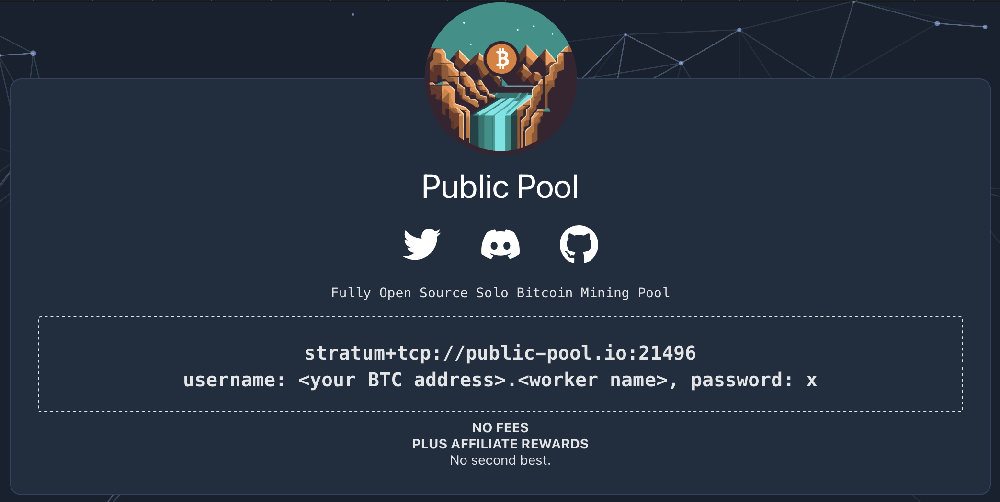
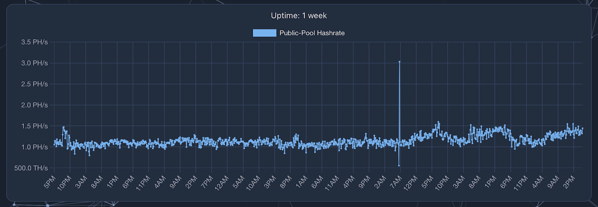
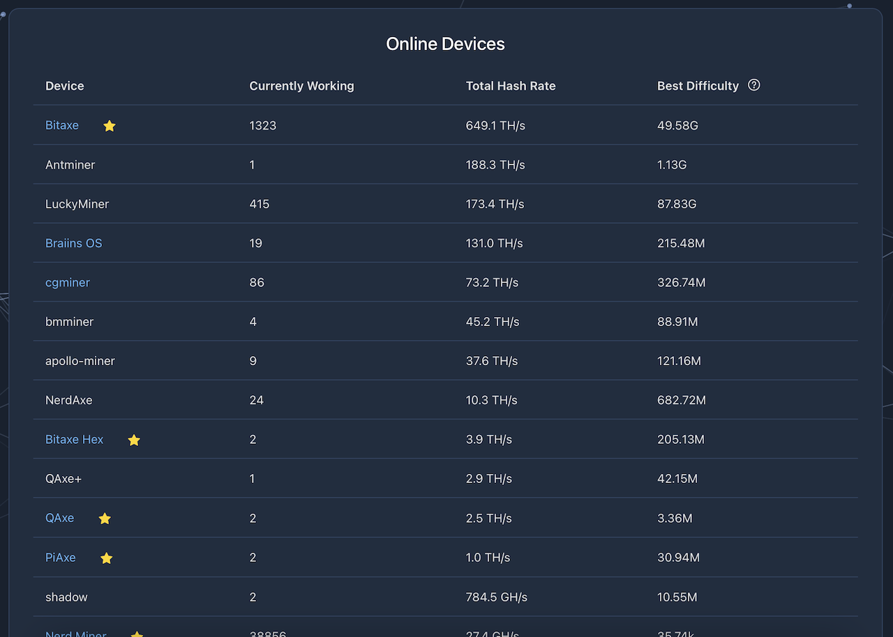
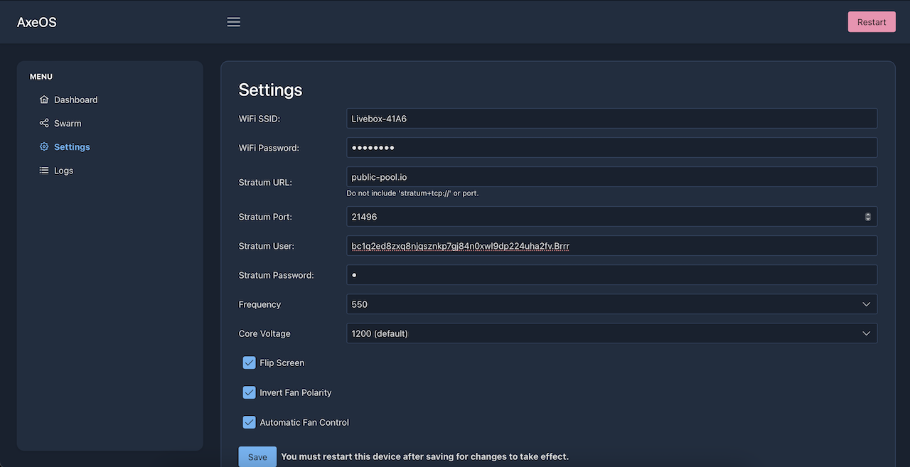
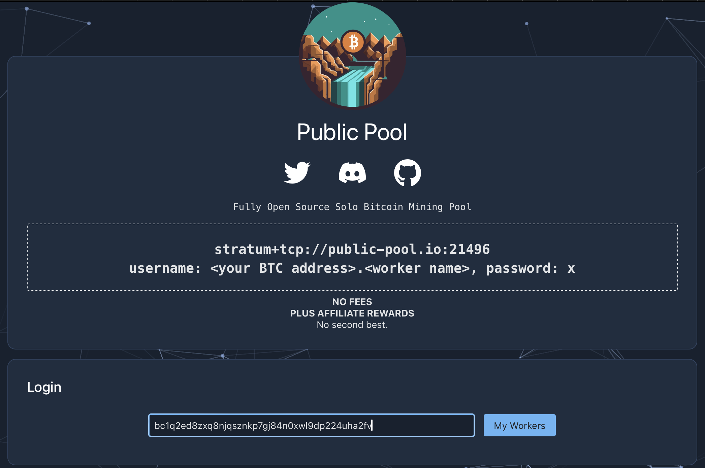
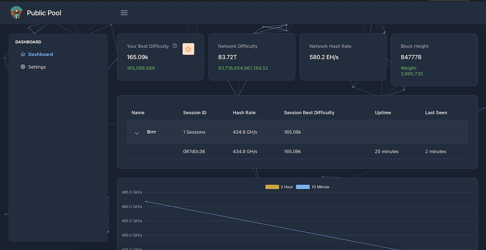

**Piscina Pública** não é apenas qualquer piscina; é o que também é conhecido como **Piscina Solo**. Se o seu minerador conseguir minerar um bloco, então você coleta toda a recompensa do bloco, que não é compartilhada com outros participantes da piscina ou com a própria piscina.

**Piscina Pública** apenas fornece um **modelo de bloco** para o seu minerador para que ele possa realizar sua tarefa sem que você precise ter um **nó Bitcoin** e o software que se comunica com o seu minerador. Como você não está agrupando seu poder de computação com o de outros participantes, suas chances de minerar com sucesso um bloco são obviamente muito baixas, assemelhando-se a um sistema de loteria, onde às vezes um indivíduo sortudo ganha o jackpot.

No **Painel** da **Piscina Pública**, você ainda tem algumas estatísticas como o **Hashrate Total** da piscina, bem como uma distribuição dos diferentes tipos de mineradores que estão conectados à piscina.

Nas primeiras linhas, podemos ver **Bitaxe** com 1323 **Bitaxe** conectados para um total de 649TH/s. **Bitaxe** é um projeto de **Código Aberto** que permite a reutilização simples de um chip de um **ASIC** como o **Antminer S19** em uma placa eletrônica de **código aberto** para fazer um minerador minúsculo de 0.5TH/s por 15W. Este é o minerador que usaremos como exemplo para este tutorial.

## Adicionando um **Trabalhador** 👷‍♂️

No topo da página, você pode copiar o endereço da piscina **stratum+tcp://public-pool.io:21496**.

Em seguida, para o campo **usuário**, insira um endereço **Bitcoin** que você possui.

Se você tem vários mineradores, pode inserir o mesmo endereço para todos eles para que seus **hashrates** sejam combinados e apareçam como um único minerador. Você também pode distingui-los adicionando um nome distinto para cada um. Para fazer isso, basta adicionar **.nomedotrabalhador** após o endereço **Bitcoin**.

Finalmente, para o campo **senha**, use **‘x’**.

Exemplo: Se o seu endereço **Bitcoin** é **‘bc1q2ed8zxq8njqsznkp7gj84n0xwl9dp224uha2fv’** e você deseja nomear seu minerador **« Brrrr »**, então você inseriria as seguintes informações na interface do seu minerador:

- **URL**: stratum+tcp://public-pool.io:21496
- **USUÁRIO**: **‘bc1q2ed8zxq8njqsznkp7gj84n0xwl9dp224uha2fv.Brrrr’**
- **Senha**: **‘x’**
Se o seu minerador é um **Bitaxe**, os campos são um pouco diferentes, mas a informação permanece a mesma:
- **URL**: public-pool.io (aqui, você precisa remover a parte no início **‘stratum+tcp://’** e a parte no final **‘:21496’** que será informada no campo de porta)
- **Porta**: 21496
- **Usuário**: **‘bc1q2ed8zxq8njqsznkp7gj84n0xwl9dp224uha2fv.Brrrr’**
- **Senha**: **‘x’**

Alguns minutos após iniciar a mineração, você poderá ver seus dados no site do **Public Pool** ao procurar pelo seu endereço.
## Painel de Controle

Uma vez conectado ao **Public Pool**, você pode acessar seu **Painel de Controle** procurando pelo seu endereço **Bitcoin** que você inseriu no campo **Usuário**. No nosso caso aqui, é **‘bc1q2ed8zxq8njqsznkp7gj84n0xwl9dp224uha2fv’**.

No **Painel de Controle**, diferentes informações são exibidas tanto sobre seus dados quanto sobre a rede.

Você tem a **Taxa de Hash da Rede** que corresponde à potência de trabalho total da rede **Bitcoin**.

A **Dificuldade da Rede** indica a dificuldade que deve ser alcançada para validar um bloco.

E **Sua Melhor Dificuldade** é a maior dificuldade que você alcançou. Se, por acaso 🍀, você atingir a dificuldade da rede, então você ganha a recompensa total do bloco... após 100 blocos. Você teria que esperar 100 blocos antes de poder gastá-los.

Você também tem a **Altura do Bloco** que é o número do último bloco que foi minerado, bem como seu peso expresso em WU, sendo o máximo 4.000.000.

Abaixo, você pode ver todas as estatísticas de cada um dos seus dispositivos individualmente, caso tenha dado a eles um nome distinto adicionando **.name** atrás do seu endereço **Bitcoin** no campo **Usuário**.