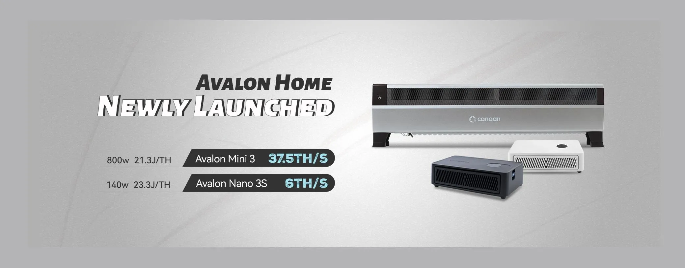

Dans ce tutoriel, nous allons passer en revue la mise en place de 2 appareils de la marque Canaan, permettant de facilement miner à la maison.

Jusque là les machines ASIC (Application Specific Integrated Circuit) spécifiquement conçues pour effectuer une tache donnée, en l'occurrence le calcul de hashs (SHA-256) pour miner du bitcoin, étaient particulièrement inadaptée à un usage domestique. Les nuisances en terme de bruit, chaleur générée à évacuer, voir la nécessité d'adapter son installation électrique pour supporter l'énorme puissance de ces appareils empêchaient la plupart d'entre nous de participer.

Aujourd'hui, Canaan un des principaux fabriquant de machines ASIC décide de s'attaquer au marché des particuliers qui veulent miner chez eux, en proposant une gamme de produit relativement silencieux et très simple à installer (plug & play).

Ces appareils sont marketés comme étant pour l'un un chauffage d'appoint pour le **Avalon Nano 3S (140W)**, ou carrément comme un mini radiateur d'une puissance de **800W** pour le **Avalon Mini 3**.

Attention, la différence de prix avec des chauffages traditionnels de puissance équivalente ne permet pas dans la grande majorité des cas, d'être gagnant financièrement.
Les satoshis générés par l'activité de mining ne compenseront jamais cet écart de prix, à moins d'avoir accès à de l'électricité gratuite (surplus), ou très bon marché.

Selon moi il faut d'avantage voir ces appareils comme une manière simple de miner à la maison pour ceux qui le désire pour des raison personnelles: *obtenir des sats non KYC / pour jouer à la "loterie" en solominant / participer à la décentralisation du hashrate etc..*., tout en bénéficiant **en bonus** de la chaleur générée pour chauffer sa pièce en hiver. Pas comme un moyen de faire des économies dans la plupart des cas du moins (pays occidentaux).

## Unboxing du Avalon Nano 3S

Dans un 1er temps voyons voir ce qui se cache à l'intérieur de la boite du Avalon Nano 3S.

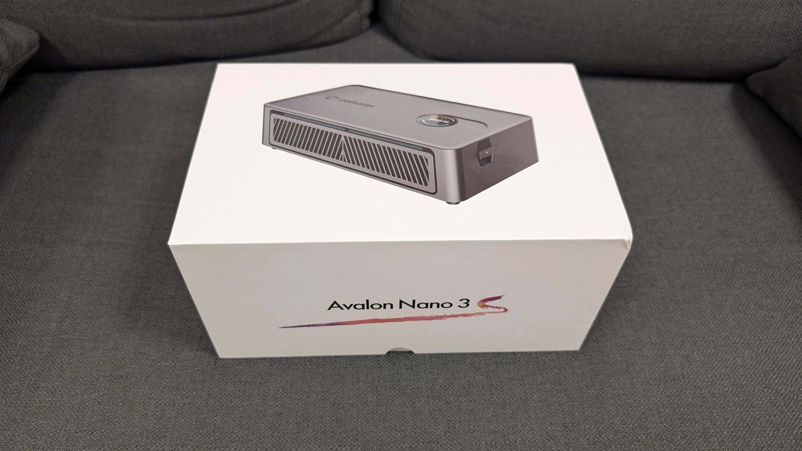
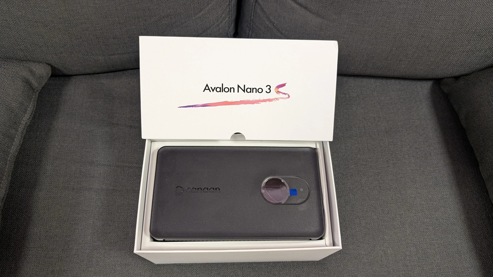

Une fois la boite ouverte on y trouve une pochette cartonnée contenant un dongle Wifi qu'il faudra comme on le verra par la suite, brancher sur le port USB de l'appareil pour que celui-ci soit en mesure de se connecter à votre réseau local. On y trouve également le manuel d'instruction ainsi qu'un tige métallique permettant de réinitialiser l'appareil au paramètres d'usine si nécessaire

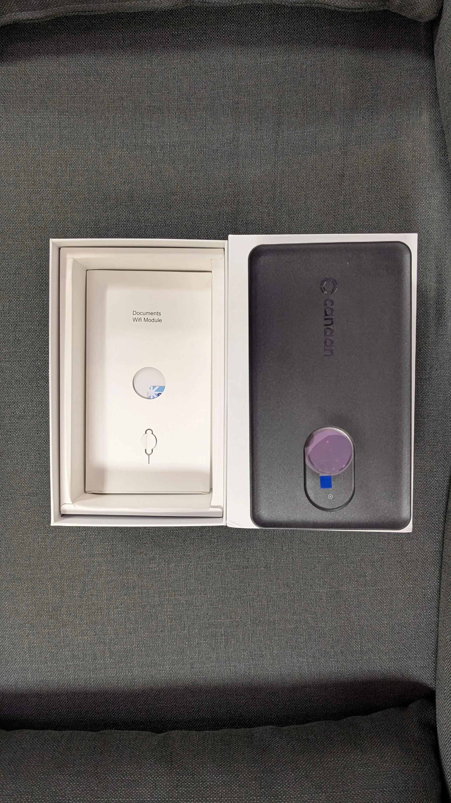

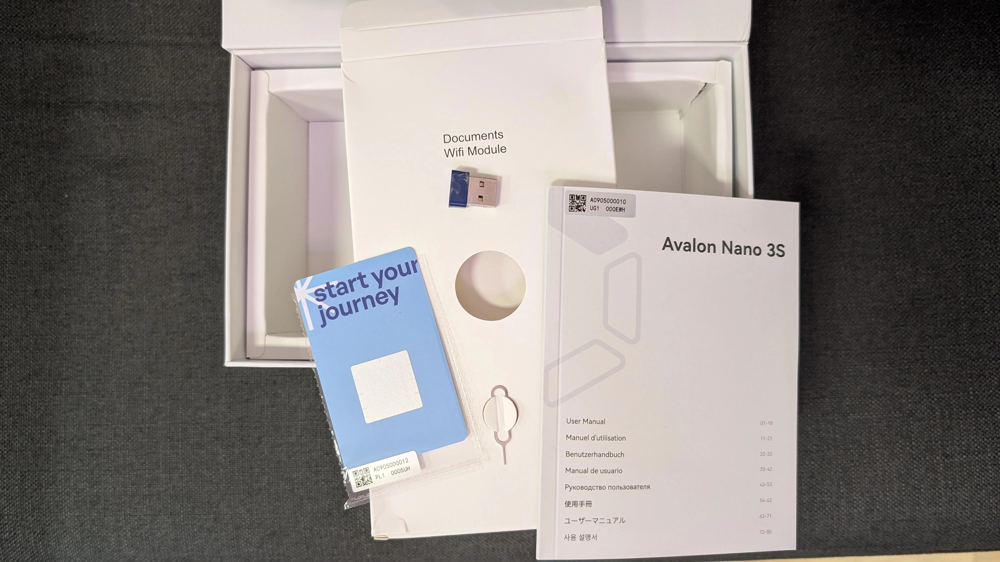

Au final une fois tout sorti du packaging voilà ce qu'on a sous la main: la machine elle-même bien sur, le manuel d'utilisation, le dongle wifi, la pointe metélique évoquée plus haut, et l'alimentation électrique de l'appareil.

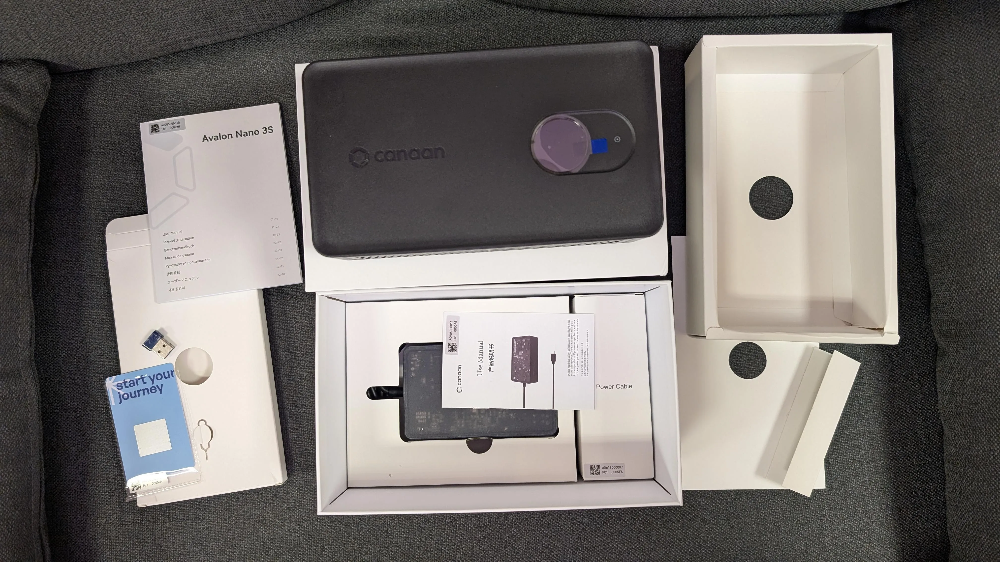

## Mise sous tension et connexion au réseau local

Une fois déballé, placer votre Avalon Mini 3 si possible à un endroit relativement dégagé pour permettre une bonne circulation de la chaleur. Ensuite commencez par insérer le petit module de réception Wifi comme montré ci-dessous:

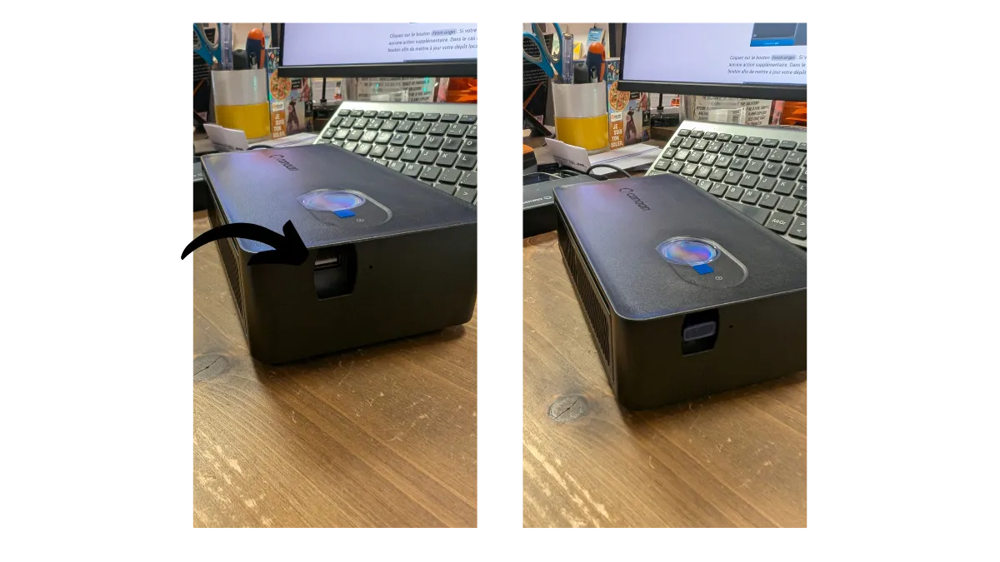
Ensuite branché la fiche USB-C de l'alimentation dans le port USB-C de l'appareil pour l'alimenter électriquement

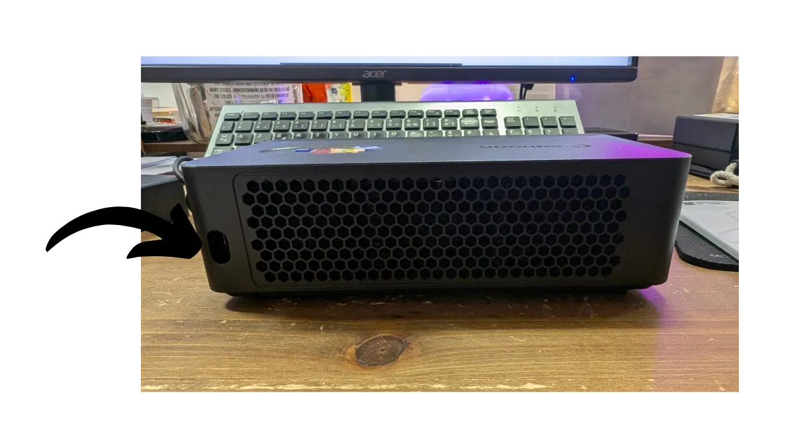
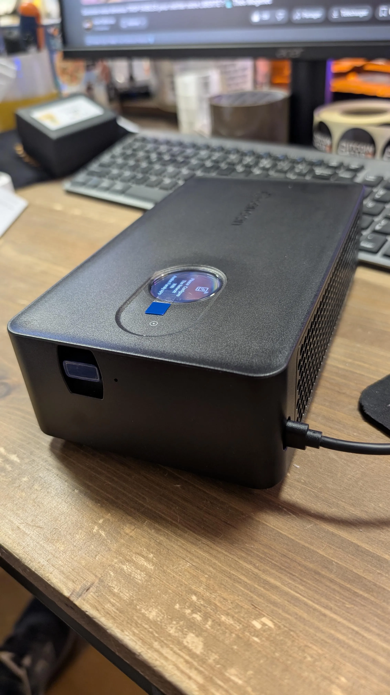

L'appareil va démarrer et le logo Avalon Nano s'affichera sur l'écran, suivi d'un logo de "téléphone portable" avec les mots "Veuillez configurer le réseau avec l'application Avalon Family", en anglais "Please Configure the Network With Avalon Family App"

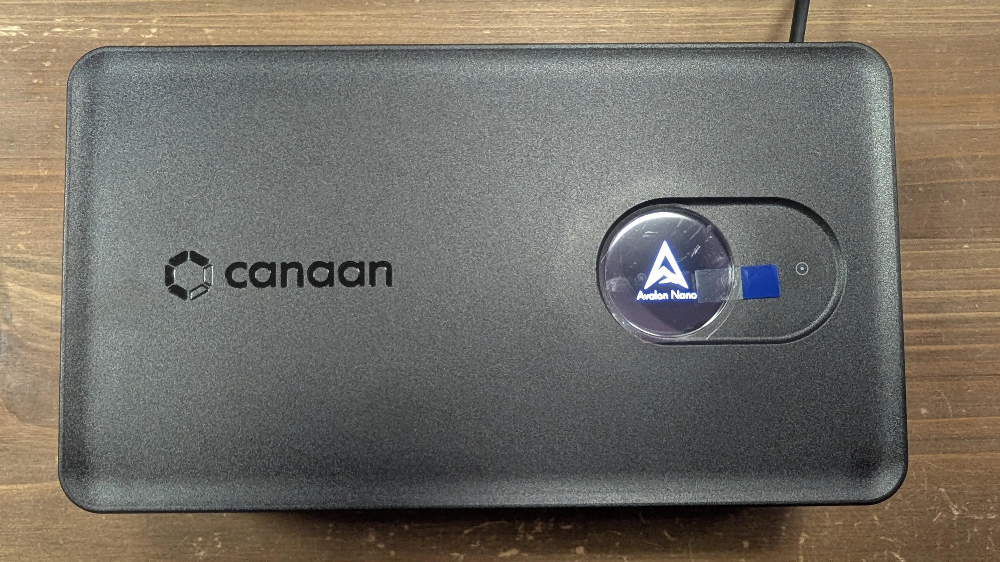
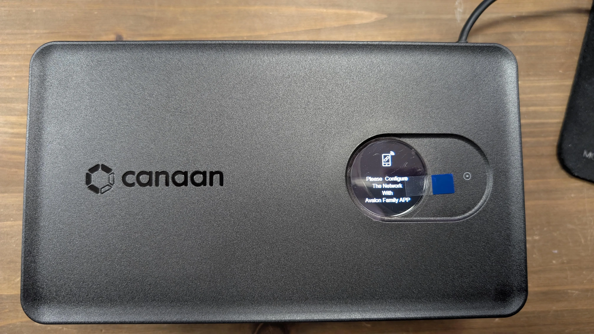

Pour ce faire rendez vous dans votre store d'application mobile, recherchez puis téléchargez l'application **Avalon Family**

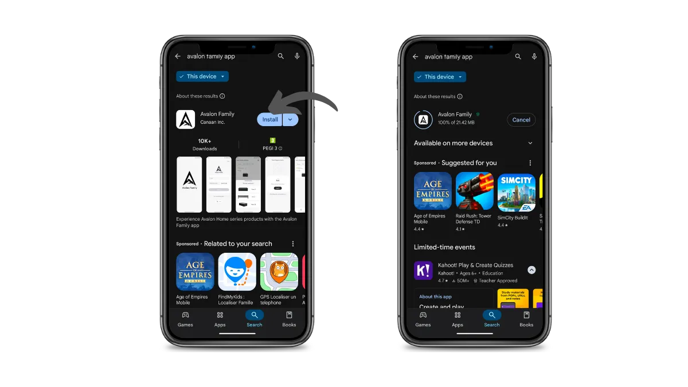
Une fois installée ouvrez là, cliquez sur "Skip" en haut à droite, puis sur le bouton "Add" et enfin sur "Search". Veillez à avoir le bluetooth activé sur votre smartphone, afin que la détetion de l'appareil' se fasse sans problème.

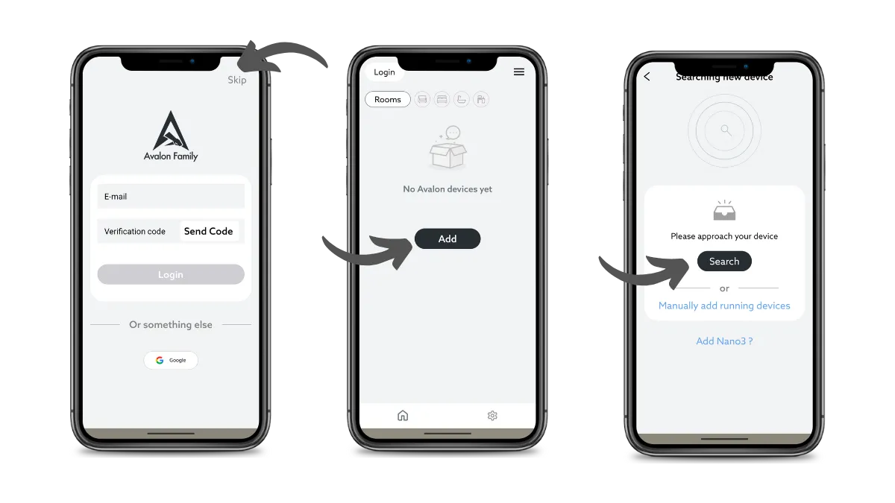
Une fois l'appareil détecté par l'application cliquez sur celui-ci, et choisissez "Connect". Vous arrivez enfin sur l'écran vous permettant de rentrer vos identifiants de connexion Wifi
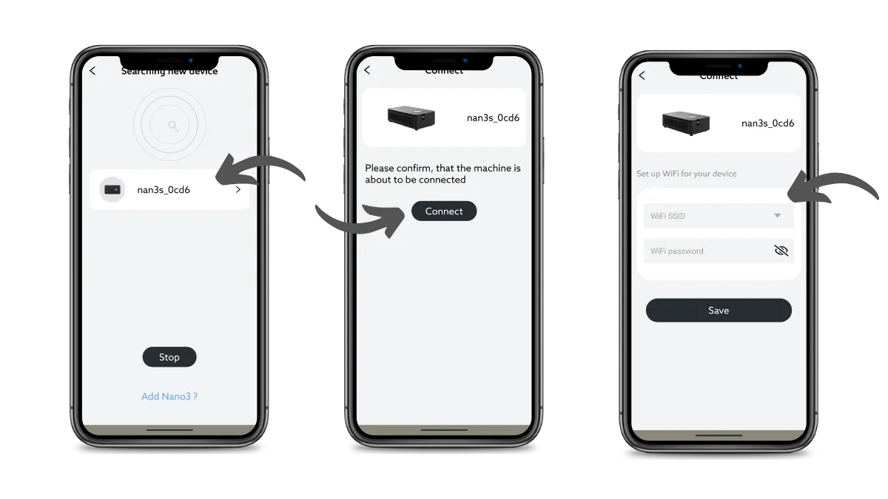
Une fois l'appareil connecté à votre réseau local, l'écran de celui-ci ressemblera désormais à ça:

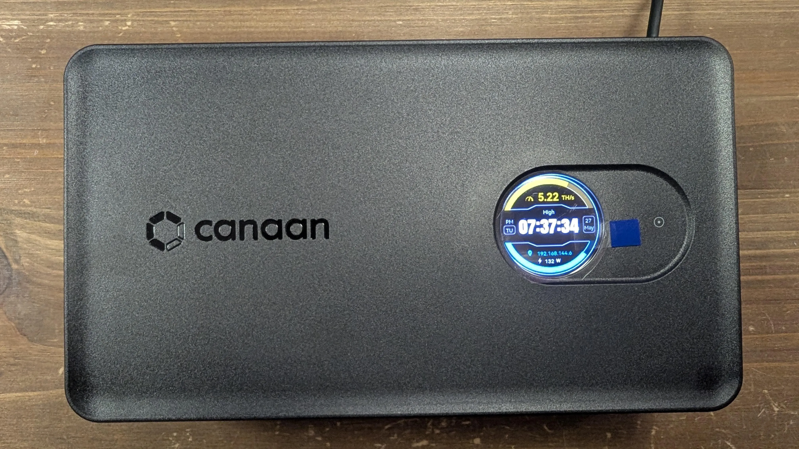

On y voit un hashrate "fictif" car aucune poo; n'a encore été configurée, l'heure, la date, la puissance et l'adresse IP de l'appareil, très utile si on veut avoir accès à l'interface de l'appareil via un PC et un navigateur.

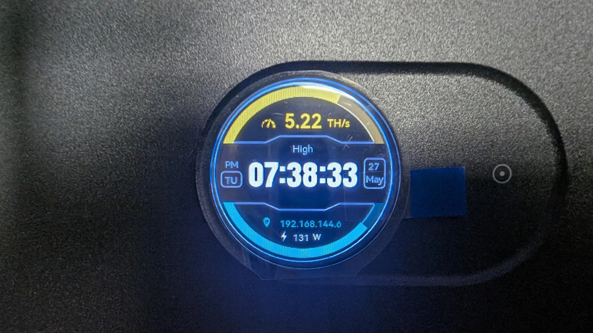

## Connexion  à une pool de minage

Que l'on veuille "solominer" ou bien miner "en pool" il va nous falloir nous connecter à une pool de minage. En effet notre appareil n'est qu'un vulgaire "hasheur" qui n'a aucune conscience du réseau Bitcoin. Le connecter à une pool lui permet d'avoir accès au réseau bitcoin via un noeud, et de recevoir des "template de blocks" sur lesquels travailler.

### Utilisation de l'application pour se connecter à une pool de minage

Sur l'application Avalon Family sélectionner l'appareil comme indiqué ci-dessous. Il vous sera alors automatiquement demandé de changer le mot de passe administrateur de la machine, cliquez sur "OK" si vous souhaitez le faire, ou sur cancel pour laisser le mot de passe d'accès par défaut "admin"
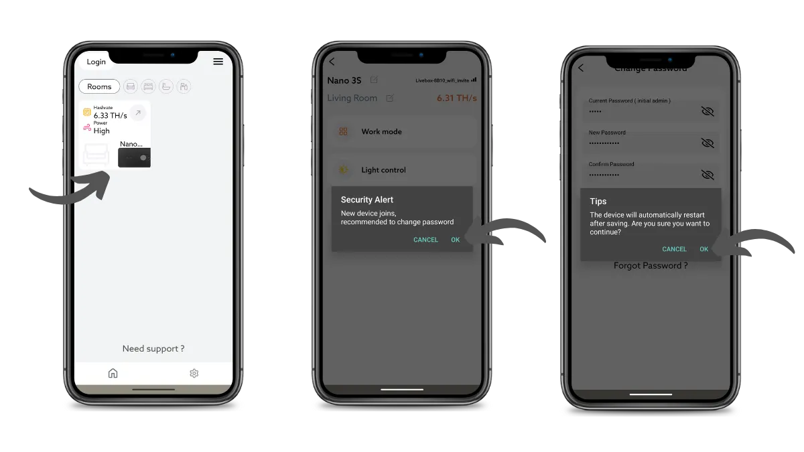
Ensuite sélectionnez "Settings", puis "Pool Config" et entrez les paramètres des 3 pools demandés.
Ces pools servirons de backup dans le cas ou les services de l'une d'elle venaient à faire défaut, pour éviter que votre mineur de travaille pour rien

Dans notre cas nous choisissons #1  Public Pool ([Plan ₿ Network - Public Pool](https://planb.network/fr/tutorials/mining/pool/public-pool-42b9e1b5-722d-471d-b1e3-9ca758065be1)) #2 CkPool et en choix numéro 3# Ocean ([Plan ₿ Network - Ocean Mining](https://planb.network/fr/tutorials/mining/pool/ocean-pool-30c9e2c9-2364-44a1-bae0-2afbdb8b1c9c))

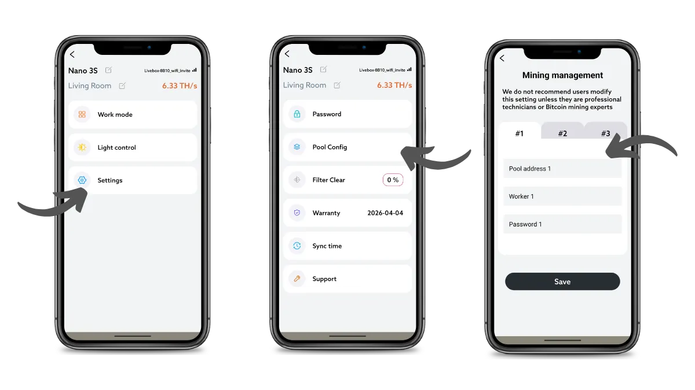
Pour plus de détails sur la manière de se connecter à une pool de minage, veuillez vous référer aux tutoriels indiqués ci-dessus.

En synthèse il nous faut:

- l'adresse de la pool choisie généralement **stratum+tcp://xxxxxxxx: port**.

- le nom du "worker" composé de votre adresse bitcoin et du pseudo que vous choisissez pour votre appareil, les 2 étant séparés par un point: **bc1qxxxxxxxxxxx.MonAvalonNano3S**, par exemple

- la mot de passe qui est généralement toujours "**x**"

Une fois les informations de pool renseignées, cliquez sur "Save"

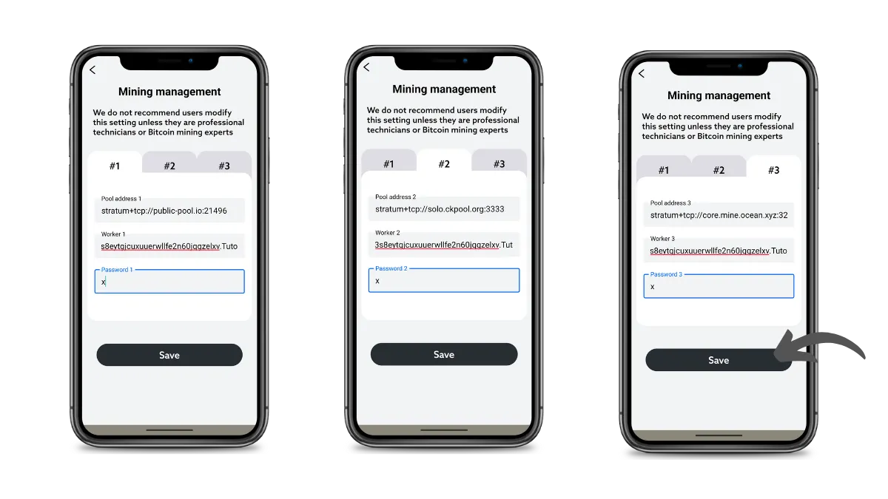
Redémarrez l'appareil comme demandé, et patientez quelques minutes que votre hashrate soit pointé vers votre pool de prédilection (#1)
### Utilisation du navigateur pour se connecter à une pool de minage