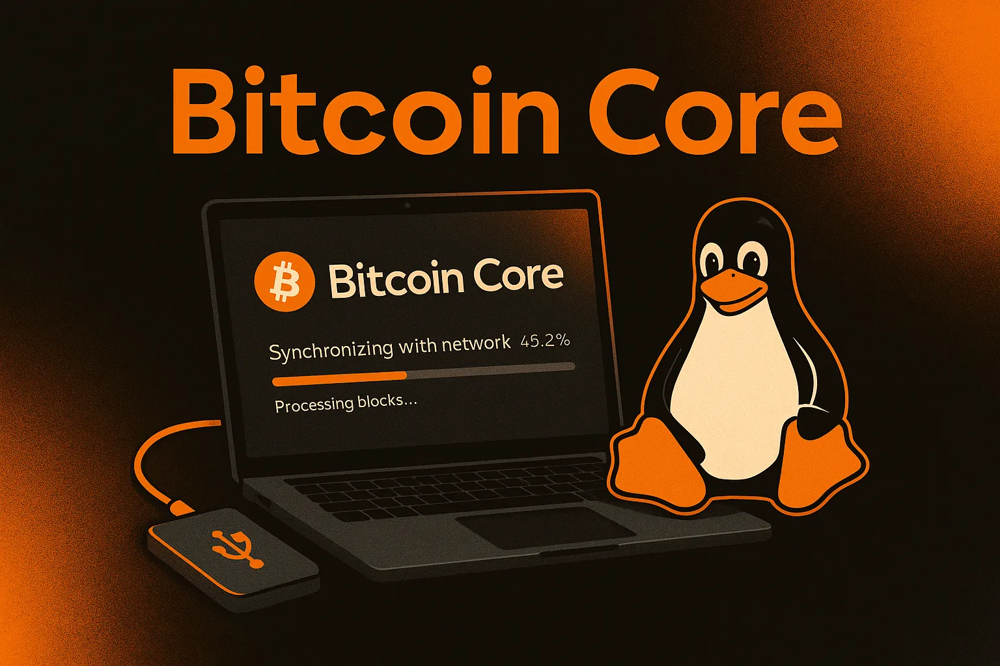
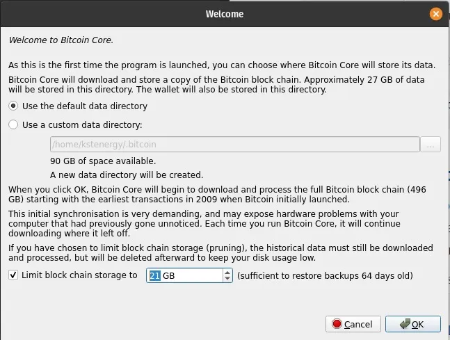
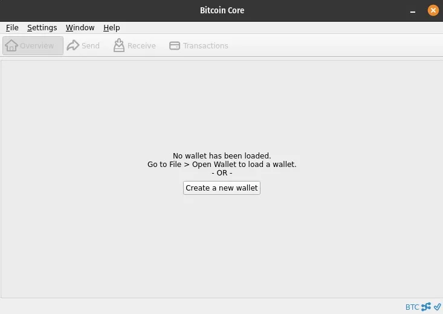
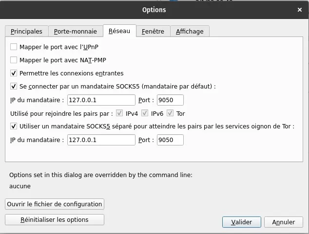
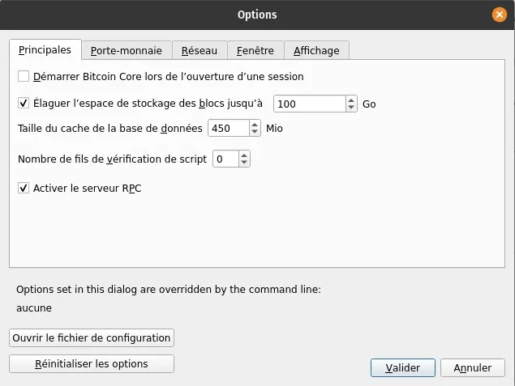
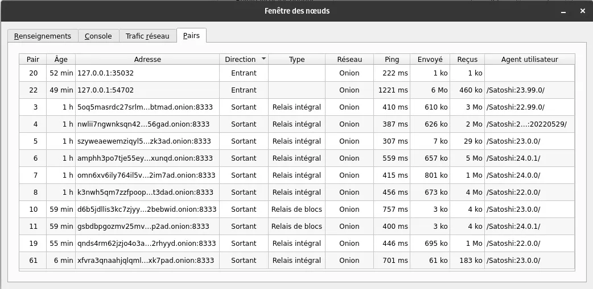

## Oman noden ajaminen Bitcoin Corella

Johdanto Bitcoiniin ja noden konseptiin, täydennettynä kattavalla asennusoppaalla Linuxille.

Yksi Bitcoinin jännittävimmistä ehdotuksista on kyky ajaa ohjelmaa itse ja siten osallistua hienojakoisella tasolla verkostoon ja julkisen tapahtumakirjan vahvistamiseen.

Bitcoin, avoimen lähdekoodin projekti, on ollut julkisesti jaettavissa ja saatavilla ilmaiseksi vuodesta 2009 lähtien. Lähes 15 vuotta sen perustamisen jälkeen Bitcoin on nyt vankka ja pysäyttämätön digitaalinen rahaverkosto, joka hyötyy voimakkaasta orgaanisesta verkostovaikutuksesta. Heidän ponnisteluistaan ja näkemyksestään Satoshi Nakamoto ansaitsee kiitoksemme. Muuten, me isännöimme Bitcoinin whitepaperia täällä Agora 256:ssa (huom: myös yliopistolla).

## Tulemaan omaksi pankiksesi

Oman noden pyörittäminen on tullut olennaiseksi Bitcoinin periaatteen kannattajille. Kysymättä kenenkään lupaa, on mahdollista ladata lohkoketju alusta alkaen ja siten vahvistaa kaikki tapahtumat A:sta Z:aan Bitcoin-protokollan mukaisesti.

Ohjelmaan sisältyy myös oma lompakko. Näin meillä on hallinta siitä, mitä tapahtumia lähetämme loppuverkostoon, ilman välikäsiä tai kolmansia osapuolia. Olet oma pankkisi.

Tämän artikkelin loppuosa on siis opas Bitcoin Coren asentamiseen — laajimmin käytetty Bitcoin-ohjelmistoversio — erityisesti Debian-yhteensopiville Linux-jakeluille, kuten Ubuntu ja Pop!_OS. Seuraa tätä opasta ottaaksesi askeleen lähemmäksi yksilöllistä suvereniteettiasi.

## Bitcoin Coren asennusopas Debian/Ubuntu

> Edellytykset
>
> - Vähintään 6GB tallennustilaa (karsittu node) — 1TB tallennustilaa (täysi node)
> - Varaa vähintään 24 tuntia Alkuperäisen Lohkon Latauksen (IBD) suorittamiseen. Tämä toimenpide on pakollinen jopa karsitulle nodelle.
> - Varaa ~600GB kaistanleveyttä IBD:lle, jopa karsitulle nodelle.

> 💡 Seuraavat komennot on määritelty Bitcoin Coren versiolle 24.1.

## Tiedostojen lataaminen ja tarkistaminen

1. Lataa bitcoin-24.1-x86_64-linux-gnu.tar.gz sekä SHA256SUMS ja SHA256SUMS.asc tiedostot. (https://bitcoincore.org/bin/bitcoin-core-24.1/bitcoin-24.1-x86_64-linux-gnu.tar.gz)

2. Avaa terminaali hakemistossa, jossa ladatut tiedostot sijaitsevat. Esim., cd ~/Lataukset/.
3. Varmista, että version tiedoston tarkistussumma on lueteltu tarkistussummatiedostossa komennolla sha256sum --ignore-missing --check SHA256SUMS.
4. Tämän komennon tuloksen pitäisi sisältää ladatun version tiedostonimi seurattuna "OK". Esimerkki: bitcoin-24.0.1-x86_64-linux-gnu.tar.gz: OK.

5. Asenna git käyttäen komentoa sudo install git. Sen jälkeen, kloonaa repositorio, joka sisältää Bitcoin Coren allekirjoittajien PGP-avaimet käyttäen komentoa git clone https://github.com/bitcoin-core/guix.sigs.
6. Tuo kaikkien allekirjoittajien PGP-avaimet käyttäen komentoa gpg --import guix.sigs/builder-keys/\*
7. Varmista, että tarkistussummatiedosto on allekirjoitettu allekirjoittajien PGP-avaimilla käyttäen komentoa gpg --verify SHA256SUMS.asc.
Jokainen allekirjoitus palauttaa rivin, joka alkaa: gpg: Hyvä allekirjoitus ja toisen rivin, joka päättyy Pääavaimen sormenjälkeen: 133E AC17 9436 F14A 5CF1 B794 860F EB80 4E66 9320 (esimerkki Pieter Wuillen PGP-avaimen sormenjäljestä).
> 💡 Kaikkien allekirjoittajien avainten ei tarvitse palauttaa "OK". Itse asiassa vain yksi voi olla tarpeellinen. Käyttäjän on itse määriteltävä oma validointikynnyksensä PGP-vahvistusta varten.
>
> Voit jättää huomiotta viestit VAROITUS: Tätä avainta ei ole varmennettu luotetulla allekirjoituksella!

> Ei ole merkkiä siitä, että allekirjoitus kuuluisi omistajalle.

## Bitcoin Coren graafisen käyttöliittymän asennus

1. Terminaalissa, edelleen hakemistossa, jossa Bitcoin Coren version tiedosto sijaitsee, käytä komentoa tar xzf bitcoin-24.1-x86_64-linux-gnu.tar.gz purkaaksesi arkistossa olevat tiedostot.

2. Asenna aiemmin puretut tiedostot käyttämällä komentoa sudo install -m 0755 -o root -g root -t /usr/local/bin bitcoin-24.1/bin//\*

3. Asenna tarvittavat riippuvuudet käyttämällä komentoa sudo apt-get install libqt5gui5 libqt5core5a libqt5dbus5 qttools5-dev qttools5-dev-tools qtwayland5 libqrencode-dev

4. Käynnistä bitcoin-qt (Bitcoin Coren graafinen käyttöliittymä) käyttämällä komentoa bitcoin-qt.

5. Valitaksesi karsitun solmun, valitse Rajoita lohkoketjun tallennustilaa ja määritä tallennettavan datan raja:



## Yhteenveto Osa 1: Asennusopas

Kun Bitcoin Core on asennettu, on suositeltavaa pitää se käynnissä mahdollisimman paljon osallistuaksesi Bitcoin-verkkoon vahvistamalla transaktioita ja lähettämällä uusia lohkoja muille vertaisille.

Kuitenkin, solmun ajoittainen käynnistäminen ja synkronointi, jopa vain vastaanotettujen ja lähetettyjen transaktioiden validointia varten, on hyvä käytäntö.



# Torin konfigurointi Bitcoin Core -solmulle

> 💡 Tämä opas on suunniteltu Bitcoin Core 24.0.1:lle Ubuntu/Debian-yhteensopivilla Linux-jakeluilla.

## Torin asentaminen ja konfigurointi Bitcoin Corelle

Ensimmäiseksi meidän on asennettava Tor-palvelu (The Onion Router), verkko anonyymiin kommunikaatioon, mikä mahdollistaa vuorovaikutuksemme anonymisoinnin Bitcoin-verkon kanssa. Online-yksityisyydensuojatyökalujen, mukaan lukien Tor, esittelyyn voit tutustua artikkelissamme aiheesta.

Torin asentamiseksi avaa terminaali ja syötä sudo apt -y install tor. Asennuksen valmistuttua palvelun pitäisi yleensä käynnistyä automaattisesti taustalla. Tarkista, että se toimii oikein komennolla sudo systemctl status tor. Vastauksen pitäisi näyttää Active: active (exited). Poistu tästä toiminnosta painamalla Ctrl+C.

> Tarvittaessa voit käyttää seuraavia komentoja terminaalissa Torin käynnistämiseen, pysäyttämiseen tai uudelleenkäynnistämiseen:

```
sudo systemctl start tor
sudo systemctl stop tor
sudo systemctl restart tor
```

Seuraavaksi käynnistetään Bitcoin Coren graafinen käyttöliittymä komennolla bitcoin-qt. Sen jälkeen otetaan käyttöön ohjelmiston automatisoitu toiminto reitittää yhteytemme Tor-välityspalvelimen kautta: Asetukset > Verkko, ja sieltä voimme valita Yhdistä SOCKS5-välityspalvelimen kautta (oletusvälityspalvelin) sekä Käytä erillistä SOCKS5-välityspalvelinta tavoittaaksesi vertaiset Tor-onion-palveluiden kautta.



Bitcoin Core automaattisesti havaitsee, jos Tor on asennettu ja, jos näin on, luo oletuksena ulospäin suuntautuvia yhteyksiä muihin myös Toria käyttäviin solmuihin, lisäksi yhteyksiin solmuihin käyttäen IPv4/IPv6-verkkoja (clearnet).
> 💡 Vaihtaaksesi näyttökielen ranskaksi, mene Näyttö-välilehteen Asetuksissa.
## Edistynyt Tor-konfiguraatio (valinnainen)

On mahdollista konfiguroida Bitcoin Core käyttämään ainoastaan Tor-verkkoa yhteyksien muodostamiseen vertaisten kanssa, näin optimoiden anonymiteettimme nodemme kautta. Koska graafisessa käyttöliittymässä ei ole sisäänrakennettua toiminnallisuutta tähän, meidän täytyy manuaalisesti luoda konfiguraatiotiedosto. Mene Asetuksiin, sitten Vaihtoehdot.



Täällä, klikkaa Avaa konfiguraatiotiedosto. Kun olet bitcoin.conf-tekstitiedostossa, lisää vain rivi onlynet=onion ja tallenna tiedosto. Sinun täytyy käynnistää Bitcoin Core uudelleen, jotta tämä komento tulee voimaan.
Konfiguroimme sitten Tor-palvelun niin, että Bitcoin Core voi vastaanottaa saapuvia yhteyksiä välityspalvelimen kautta, sallien muiden verkoston nodien käyttää nodettamme lohkoketjun datan lataamiseen vaarantamatta koneemme turvallisuutta.

Terminaalissa, syötä sudo nano /etc/tor/torrc päästäksesi Tor-palvelun konfiguraatiotiedostoon. Tässä tiedostossa, etsi rivi #ControlPort 9051 ja poista # ottaaksesi sen käyttöön. Lisää nyt kaksi uutta riviä tiedostoon: HiddenServiceDir /var/lib/tor/bitcoin-service/ ja HiddenServicePort 8333 127.0.0.1:8334. Poistuaksesi tiedostosta tallentaen sen, paina Ctrl+X > Y > Enter. Takaisin terminaalissa, käynnistä Tor uudelleen syöttämällä komento sudo systemctl restart tor.

Tällä konfiguraatiolla, Bitcoin Core pystyy muodostamaan saapuvia ja lähteviä yhteyksiä muiden verkoston nodien kanssa ainoastaan Tor-verkon (Onion) kautta. Vahvistaaksesi tämän, klikkaa Ikkuna-välilehteä, sitten Vertaiset.



## Lisäresurssit

Lopulta, käyttämällä ainoastaan Tor-verkkoa (onlynet=onion) saatat olla haavoittuvainen Sybil-hyökkäykselle. Siksi jotkut suosittelevat moniverkkokonfiguraation ylläpitämistä tällaisen riskin lieventämiseksi. Lisäksi, kaikki IPv4/IPv6-yhteydet reititetään Tor-välityspalvelimen kautta, kun se on konfiguroitu, kuten aiemmin mainittiin.

Vaihtoehtoisesti, pysyäksesi ainoastaan Tor-verkossa ja lieventääksesi Sybil-hyökkäyksen riskiä, voit lisätä toisen luotetun noden osoitteen bitcoin.conf-tiedostoosi lisäämällä rivin addnode=trusted_address.onion. Voit lisätä tämän rivin useita kertoja, jos haluat yhdistää useisiin luotettuihin nodeihin.

Nähdäksesi Bitcoin-nodesi lokit erityisesti sen vuorovaikutuksesta Torin kanssa, lisää debug=tor bitcoin.conf-tiedostoosi. Nyt sinulla on relevanttia Tor-tietoa debug-lokissasi, jonka voit tarkastella Tiedot-ikkunassa Debug File -painikkeella. On myös mahdollista tarkastella näitä lokeja suoraan terminaalissa komennolla bitcoind -debug=tor.

> 💡 Joitakin kiinnostavia linkkejä:
>
> - Wiki-sivu, joka selittää Torin ja sen suhteen Bitcoinin kanssa
> - Bitcoin Coren konfiguraatiotiedoston generaattori Jameson Loppilta
> - Torin konfiguraatio-opas Jon Atackilta

Kuten aina, jos sinulla on kysymyksiä, jaa ne vapaasti Agora256-yhteisön kanssa. Opimme yhdessä olemaan huomenna parempia kuin tänään!
