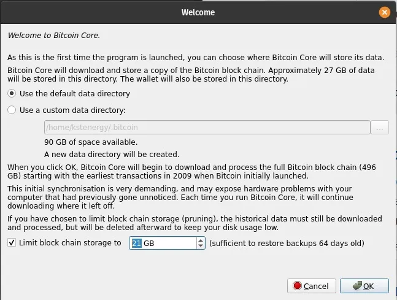
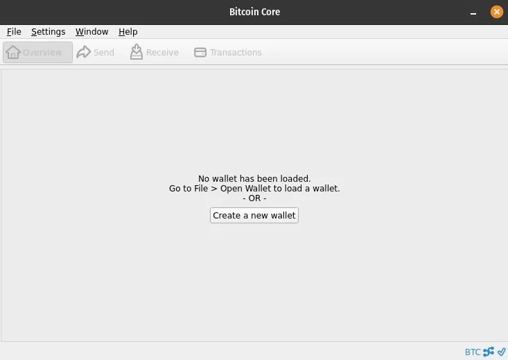

# Bitcoin Coreを使って自分自身のノードを運用する

Bitcoinとノードの概念の紹介、Linux上での包括的なインストールガイドを補完。

Bitcoinの最もエキサイティングな提案の一つは、プログラムを自分自身で実行し、ネットワークと公開トランザクション台帳の検証に細かいレベルで参加できる能力です。

Bitcoinはオープンソースプロジェクトであり、2009年以来、公開され無料で利用可能になっています。その創設からほぼ15年後、Bitcoinは今や強力な有機的ネットワーク効果から恩恵を受ける、停止不可能なデジタル通貨ネットワークとなりました。その努力とビジョンに対して、サトシ・ナカモトには私たちの感謝が当然です。ちなみに、私たちはAgora 256（注：大学でも）でBitcoinのホワイトペーパーをホストしています。

## 自分自身の銀行になる

自分自身のノードを運用することは、Bitcoinの信条を信じる人々にとって不可欠になっています。誰かの許可を求めることなく、ブロックチェーンを最初からダウンロードし、AからZまでのすべてのトランザクションをBitcoinプロトコルに従って検証することが可能です。

このプログラムには独自のウォレットも含まれています。したがって、私たちは中間者や第三者なしに、残りのネットワークに送信するトランザクションを制御できます。あなたは自分自身の銀行です。

この記事の残りの部分は、UbuntuやPop!_OSなどのDebian互換Linuxディストリビューションに特に焦点を当てた、最も広く使用されているBitcoinソフトウェアバージョンであるBitcoin Coreのインストールガイドです。このガイドに従って、個人の主権に一歩近づきましょう。

## Debian/Ubuntu用Bitcoin Coreインストールガイド

> 前提条件
>
> - 最小6GBのデータストレージ（プルーンドノード）— 1TBのデータストレージ（フルノード）
> - 初期ブロックダウンロード（IBD）の完了には少なくとも24時間を許可してください。この操作は、プルーンドノードであっても必須です。
> - プルーンドノードであっても、IBDには約600GBの帯域幅を許可してください。

> 💡 以下のコマンドはBitcoin Coreバージョン24.1用に事前定義されています。

## ファイルのダウンロードと検証

1. bitcoin-24.1-x86_64-linux-gnu.tar.gzおよびSHA256SUMSとSHA256SUMS.ascファイルをダウンロードします。(https://bitcoincore.org/bin/bitcoin-core-24.1/bitcoin-24.1-x86_64-linux-gnu.tar.gz)

2. ダウンロードしたファイルがあるディレクトリでターミナルを開きます。例えば、cd ~/Downloads/。
3. コマンドsha256sum --ignore-missing --check SHA256SUMSを使用して、バージョンファイルのチェックサムがチェックサムファイルにリストされていることを確認します。
4. このコマンドの出力には、ダウンロードしたバージョンファイルの名前に続いて「OK」と表示されるべきです。例：bitcoin-24.0.1-x86_64-linux-gnu.tar.gz: OK。

5. コマンドsudo install gitを使用してgitをインストールします。次に、コマンドgit clone https://github.com/bitcoin-core/guix.sigsを使用して、Bitcoin Core署名者のPGPキーを含むリポジトリをクローンします。
6. コマンドgpg --import guix.sigs/builder-keys/\*を使用して、すべての署名者のPGPキーをインポートします。
7. コマンドgpg --verify SHA256SUMS.ascを使用して、チェックサムファイルが署名者のPGPキーで署名されていることを確認します。
各署名は、次のように始まる行を返します：gpg: Good signature そしてもう一つの行は Primary key fingerprint: 133E AC17 9436 F14A 5CF1 B794 860F EB80 4E66 9320（Pieter WuilleのPGPキーのフィンガープリントの例）で終わります。
> 💡 すべての署名者のキーが「OK」と返す必要はありません。実際、1つだけが必要かもしれません。PGP検証のための自身の検証閾値をユーザーが決定することになります。
>
> このキーは信頼できる署名で認証されていないというWARNING:メッセージは無視してかまいません！

> 署名が所有者に属しているという証拠はありません。

## Bitcoin Core グラフィカルインターフェースのインストール

1. Bitcoin Coreバージョンファイルがあるディレクトリで、ターミナルを開き、コマンド tar xzf bitcoin-24.1-x86_64-linux-gnu.tar.gz を使用して、アーカイブに含まれるファイルを展開します。

2. 以前に展開したファイルをコマンド sudo install -m 0755 -o root -g root -t /usr/local/bin bitcoin-24.1/bin//\* を使用してインストールします。

3. 必要な依存関係をコマンド sudo apt-get install libqt5gui5 libqt5core5a libqt5dbus5 qttools5-dev qttools5-dev-tools qtwayland5 libqrencode-dev を使用してインストールします。

4. コマンド bitcoin-qt を使用して bitcoin-qt（Bitcoin Coreグラフィカルインターフェース）を起動します。

5. プルーニングノードを選択するには、Limit blockchain storage をチェックし、保存されるデータの制限を設定します：



## 第1部：インストールガイドの結論

Bitcoin Coreがインストールされたら、トランザクションを検証し、他のピアに新しいブロックを伝達することでBitcoinネットワークに貢献するために、できるだけ常に実行しておくことをお勧めします。

しかし、受信および送信されたトランザクションを検証するためだけであっても、ノードを断続的に実行および同期することは良い習慣です。



# Bitcoin CoreノードのためのTorの設定

> 💡 このガイドは、Ubuntu/Debian互換のLinuxディストリビューション上のBitcoin Core 24.0.1用に設計されています。

## Bitcoin CoreのためのTorのインストールと設定

まず、匿名通信に使用されるネットワークであるTorサービス（The Onion Router）をインストールする必要があります。これにより、Bitcoinネットワークとのやり取りを匿名化できます。オンラインプライバシー保護ツール、Torを含む、についての紹介は、このトピックに関する私たちの記事を参照してください。

Torをインストールするには、ターミナルを開き、sudo apt -y install tor を入力します。インストールが完了すると、サービスは通常、バックグラウンドで自動的に起動されます。コマンド sudo systemctl status tor を使用して、正しく実行されているかを確認します。応答は Active: active (exited) と表示されるべきです。この機能を終了するには、Ctrl+Cを押します。

> いずれにせよ、以下のコマンドをターミナルで使用して、Torを開始、停止、または再起動することができます：

```
sudo systemctl start tor
sudo systemctl stop tor
sudo systemctl restart tor
```

次に、コマンド bitcoin-qt を使用してBitcoin Coreグラフィカルインターフェースを起動しましょう。その後、Settings > Network から、私たちの接続をTorプロキシを通じてルーティングするソフトウェアの自動機能を有効にします：Connect through SOCKS5 proxy (default proxy) および Use a separate SOCKS5 proxy to reach peers via Tor onion services をチェックします。


Bitcoin Coreは自動的にTorがインストールされているかを検出し、もしそうであれば、デフォルトで他のTorを使用しているノードへのアウトバウンド接続を作成します。これは、IPv4/IPv6ネットワーク（クリアネット）を使用するノードへの接続に加えて行われます。
💡 ディスプレイ言語をフランス語に変更するには、設定のディスプレイタブに移動してください。

## 高度なTor設定（オプション）

Bitcoin CoreをTorネットワークのみを使用してピアと接続するように設定することが可能です。これにより、ノードを通じた匿名性を最適化できます。グラフィカルインターフェースにこの機能が組み込まれていないため、手動で設定ファイルを作成する必要があります。設定に移動し、オプションを選択してください。


ここで、設定ファイルを開くをクリックします。bitcoin.confテキストファイル内で、単にonlynet=onionという行を追加してファイルを保存します。このコマンドを有効にするには、Bitcoin Coreを再起動する必要があります。
次に、Bitcoin Coreがプロキシ経由で着信接続を受け取れるようにTorサービスを設定します。これにより、ネットワーク上の他のノードが私たちのノードを使用してブロックチェーンデータをダウンロードできるようになり、私たちのマシンのセキュリティを損なうことなく行えます。

ターミナルで、sudo nano /etc/tor/torrcを入力してTorサービス設定ファイルにアクセスします。このファイル内で、#ControlPort 9051という行を探し、#を削除して有効にします。次に、ファイルに2つの新しい行を追加します：HiddenServiceDir /var/lib/tor/bitcoin-service/ および HiddenServicePort 8333 127.0.0.1:8334。ファイルを保存して終了するには、Ctrl+X > Y > Enterを押します。ターミナルに戻り、sudo systemctl restart torコマンドを入力してTorを再起動します。

この設定により、Bitcoin CoreはTorネットワーク（Onion）を介してのみ他のノードとの着信および発信接続を確立できるようになります。これを確認するには、ウィンドウタブに移動し、ピアをクリックしてください。


## 追加リソース

最終的に、Torネットワークのみを使用する（onlynet=onion）ことは、シビル攻撃に対して脆弱になる可能性があります。そのため、この種のリスクを軽減するために、複数のネットワーク構成を維持することを推奨する人もいます。さらに、一度設定されると、すべてのIPv4/IPv6接続が以前に示されたようにTorプロキシを介してルーティングされます。

シビル攻撃のリスクを軽減し、Torネットワーク上にのみ留まるためには、信頼できる別のノードのアドレスをbitcoin.confファイルにaddnode=trusted_address.onionとして追加することができます。複数の信頼できるノードに接続したい場合は、この行を複数回追加できます。

BitcoinノードのTorとのやり取りに関連するログを表示するには、bitcoin.confファイルにdebug=torを追加します。これで、デバッグファイルボタンで情報ウィンドウに表示されるデバッグログに関連するTor情報が表示されるようになります。また、ターミナルでbitcoind -debug=torコマンドを使用してこれらのログを直接表示することも可能です。

> 💡 いくつかの興味深いリンク：
>
> - TorとBitcoinの関係を説明するWikiページ
> - Jameson LoppによるBitcoin Core設定ファイルジェネレーター
> - Jon AtackによるTor設定ガイド

いつものように、質問があればAgora256コミュニティで共有してください。私たちは一緒に学び、今日よりも明日より良くなります！