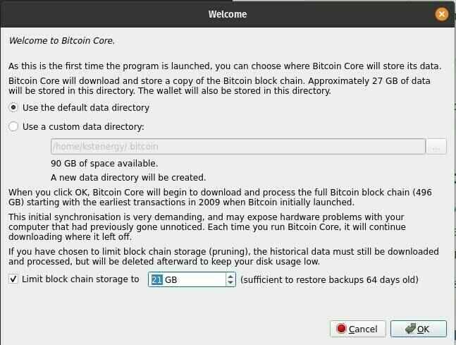
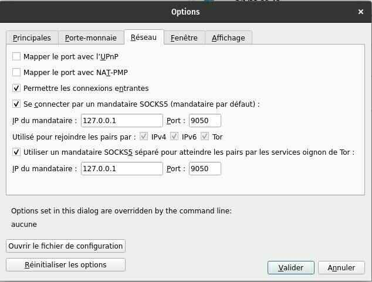
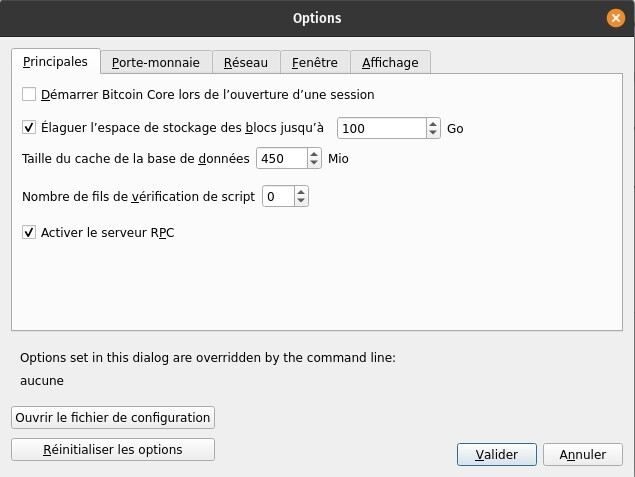
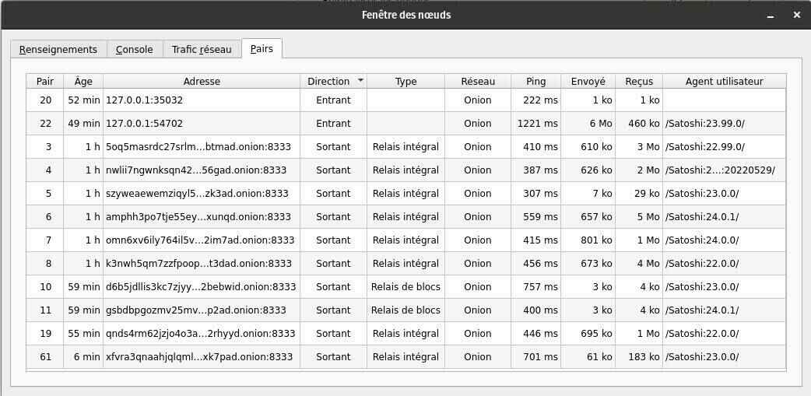

# Executando seu próprio nó com Bitcoin Core

Introdução ao Bitcoin e ao conceito de um nó, complementado por um guia de instalação abrangente no Linux.

Uma das propostas mais interessantes do Bitcoin é a capacidade de executar o programa você mesmo e, assim, participar a um nível granular na rede e na verificação do livro-razão de transações públicas.

O Bitcoin, um projeto de código aberto, tem sido distribuído publicamente e está disponível gratuitamente desde 2009. Quase 15 anos após a sua criação, a Bitcoin é atualmente uma rede monetária digital robusta e imparável, beneficiando de um poderoso efeito de rede orgânico. Pelos seus esforços e visão, Satoshi Nakamoto merece a nossa gratidão. A propósito, hospedamos o whitepaper sobre Bitcoin aqui na Agora 256 (nota: também na universidade).

## Tornando-se seu próprio banco

Executar o seu próprio nó torna-se essencial para os adeptos do axioma Bitcoin. Sem pedir autorização a ninguém, é possível descarregar a cadeia de blocos desde o início e, assim, verificar todas as transacções de A a Z de acordo com o protocolo Bitcoin.

O programa também inclui a sua própria carteira. Assim, temos controlo sobre as transacções que enviamos para o resto da rede, sem qualquer intermediário ou terceiro. Tu és o teu próprio banco.

O resto deste artigo é, portanto, um guia para instalar o Bitcoin Core - a versão mais usada do software Bitcoin - especificamente em distribuições Linux compatíveis com o Debian, como Ubuntu e Pop!/\_OS. Siga este guia para dar um passo mais perto da sua soberania individual.

## Guia de Instalação do Bitcoin Core para Debian/Ubuntu

> Pré-requisitos
>
> - Mínimo de 6GB de armazenamento de dados (nó podado) - 1TB de armazenamento de dados (nó completo)
> - Permitir pelo menos 24 horas para a conclusão do IBD (Initial Block Download). Esta operação é obrigatória mesmo para um nó podado.
> - Permitir ~600GB de largura de banda para o IBD, mesmo para um nó podado.

> 💡 Os seguintes comandos são predefinidos para a versão 24.1 do Bitcoin Core.

## Descarregar e verificar ficheiros

1. Download bitcoin-24.1-x86_64-linux-gnu.tar.gz, as well as the SHA256SUMS and SHA256SUMS.asc files. (https://bitcoincore.org/bin/bitcoin-core-24.1/bitcoin-24.1-x86_64-linux-gnu.tar.gz)

2. Open a terminal in the directory where the downloaded files are located. Ex.: cd ~/Downloads/.
3. Verifique se o checksum do arquivo de versão está listado corretamente no arquivo de checksum usando o comando sha256sum --ignore-missing --check SHA256SUMS.
4. A saída desse comando deve incluir o nome do arquivo de versão baixado e "OK". Ex: bitcoin-24.0.1-x86_64-linux-gnu.tar.gz: OK.

5. Instale o git usando o comando sudo install git. Em seguida, clone o repositório contendo as chaves PGP dos signatários do Bitcoin Core usando o comando git clone https://github.com/bitcoin-core/guix.sigs.
6. Importe as chaves PGP de todos os signatários usando o comando gpg --import guix.sigs/builder-keys//\*
7. Verifique se o arquivo de checksum está assinado corretamente com as chaves PGP dos signatários usando o comando gpg --verify SHA256SUMS.asc.

Cada assinatura retornará uma linha começando com: gpg: Good signature e outra terminando com Primary key fingerprint: 133E AC17 9436 F14A 5CF1 B794 860F EB80 4E66 9320 (exemplo da impressão digital da chave PGP de Pieter Wuille).

> 💡 Não é necessário que todas as chaves dos signatários retornem "OK". Na verdade, apenas uma pode ser necessária. É responsabilidade do usuário determinar seu próprio limite de validação em relação à verificação via PGP.
>
> Você pode ignorar as mensagens WARNING: This key is not certified with a trusted signature!

> Não há qualquer indicação de que a assinatura pertence ao proprietário.

## Instalação da interface gráfica do Bitcoin Core

1. No terminal, ainda no diretório onde o arquivo de versão do Bitcoin Core está localizado, use o comando tar xzf bitcoin-24.1-x86_64-linux-gnu.tar.gz para extrair os arquivos contidos no arquivo.

2. Instale os arquivos extraídos anteriormente usando o comando sudo install -m 0755 -o root -g root -t /usr/local/bin bitcoin-24.1/bin//\*

3. Instale as dependências necessárias usando o comando sudo apt-get install libqt5gui5 libqt5core5a libqt5dbus5 qttools5-dev qttools5-dev-tools qtwayland5 libqrencode-dev

4. Inicie o bitcoin-qt (interface gráfica do Bitcoin Core) usando o comando bitcoin-qt.

5. Para escolher um nó reduzido, marque a opção Limit blockchain storage e configure o limite de dados a ser armazenado:



## Conclusão da Parte 1: Guia de Instalação

Depois de instalar o Bitcoin Core, é recomendado deixá-lo em execução o máximo possível para contribuir com a verificação de transações e a transmissão de novos blocos para outros pares na rede Bitcoin.

No entanto, executar e sincronizar seu nó intermitentemente, mesmo que seja apenas para validar transações recebidas e emitidas, é uma boa prática.


# Configuração do Tor para um nó Bitcoin Core

> 💡 Este guia é projetado para o Bitcoin Core 24.0.1 em distribuições Linux compatíveis com Ubuntu/Debian.

## Instalação e configuração do Tor para o Bitcoin Core

Primeiro, precisamos instalar o serviço Tor (The Onion Router), uma rede usada para comunicação anônima, que nos permitirá anonimizar nossas interações com a rede Bitcoin. Para uma introdução às ferramentas de privacidade online, incluindo o Tor, consulte nosso artigo sobre o assunto.

Para instalar o Tor, abra um terminal e digite sudo apt -y install tor. Uma vez concluída a instalação, o serviço será normalmente iniciado automaticamente em segundo plano. Verifique se ele está em execução com o comando sudo systemctl status tor. Na resposta retornada, deve constar Active: active (exited). Pressione Ctrl+C para sair desta função.

> Em todos os casos, você pode usar os seguintes comandos no terminal para iniciar, parar ou reiniciar o Tor:

```
sudo systemctl start tor
sudo systemctl stop tor
sudo systemctl restart tor
```

Em seguida, vamos iniciar a interface gráfica do Bitcoin Core com o comando bitcoin-qt. Em seguida, ative a funcionalidade automatizada do software para direcionar nossas conexões por meio de um proxy Tor: Configurações > Rede e, a partir daí, podemos marcar a opção Conectar-se através de um proxy SOCKS5 (proxy padrão) e Usar um proxy SOCKS5 separado para alcançar os pares através dos serviços onion do Tor.



O Bitcoin Core detecta automaticamente se o Tor está instalado e, se for o caso, criará conexões de saída (Outbound) por padrão para outros nós que também usam o Tor, além das conexões para nós que usam as redes IPv4/IPv6 (clearnet).

> 💡 Para alterar o idioma para francês, vá para a guia Exibição nas Configurações.

## Configuração avançada do Tor (opcional)

É possível configurar o Bitcoin Core para usar apenas a rede Tor para se conectar com pares, otimizando assim nossa anonimidade por meio de nosso nó. Como não há uma funcionalidade para isso na interface gráfica, teremos que criar manualmente um arquivo de configuração. Vá para Configurações e depois Opções.



Aqui, clique em Abrir arquivo de configuração. Uma vez no arquivo de texto bitcoin.conf, adicione simplesmente uma linha onlynet=onion e salve o arquivo. Você precisa reiniciar o Bitcoin Core para que este comando tenha efeito.
Nós iremos então configurar o serviço Tor para que o Bitcoin Core possa receber conexões de entrada através de um proxy, permitindo que os pares da rede usem nosso nó para baixar dados do blockchain sem comprometer a segurança de nossa máquina.

No terminal, digite sudo nano /etc/tor/torrc para acessar o arquivo de configuração do serviço Tor. No arquivo, procure a linha #ControlPort 9051 e remova o # para ativá-la. Agora adicione duas novas linhas ao arquivo: HiddenServiceDir /var/lib/tor/bitcoin-service/ e HiddenServicePort 8333 127.0.0.1:8334. Para sair do arquivo e salvá-lo, pressione Ctrl+X > Y > Enter. De volta ao terminal, reinicie o Tor digitando o comando sudo systemctl restart tor.

Com essa configuração, o Bitcoin Core poderá estabelecer conexões de entrada e saída apenas com outros pares da rede na rede Tor (Onion). Para confirmar isso, clique na aba Janela e depois em Pares.



## Recursos adicionais

No final das contas, usar apenas a rede Tor (onlynet=onion) pode deixá-lo vulnerável a um ataque Sybil. Por isso, alguns recomendam manter uma configuração de rede múltipla para lidar com esse tipo de risco. Além disso, todas as conexões IPv4/IPv6 serão direcionadas pelo proxy Tor assim que ele for configurado, como mencionado anteriormente.

Alternativamente, para permanecer apenas na rede Tor e mitigar o risco de um ataque Sybil, você pode adicionar o endereço de outro nó confiável ao seu arquivo bitcoin.conf, adicionando a linha addnode=trusted_address.onion. É possível adicionar essa linha várias vezes se você quiser se conectar a vários nós confiáveis.

Para verificar os logs do seu nó Bitcoin em relação à sua interação com o Tor, adicione debug=tor ao seu arquivo bitcoin.conf. Agora você terá informações relevantes sobre o Tor no seu log de depuração, que você pode verificar na janela Informações, com o botão Arquivo de Log de Depuração. Também é possível verificar esses logs diretamente no terminal com o comando bitcoind -debug=tor.

> 💡 Alguns links interessantes:
>
> - Página wiki explicando o Tor e sua relação com o Bitcoin
> - Gerador de arquivo de configuração do Bitcoin Core por Jameson Lopp
> - Guia de configuração do Tor por Jon Atack

Como sempre, se você tiver alguma dúvida, não hesite em compartilhá-la com a comunidade Agora256, estamos aprendendo juntos para sermos melhores amanhã do que somos hoje!
