Bitcoin Core auf deinem regulären Computer zu installieren ist möglich, aber nicht ideal. Wenn es dir nichts ausmacht, deinen Computer rund um die Uhr eingeschaltet zu lassen, funktioniert das gut. Wenn du den Computer ausschalten musst, ist es lästig, jedes Mal auf die Synchronisierung der Software warten zu müssen, wenn du ihn wieder einschaltest.

Diese Anleitung gilt für Mac- oder Windows-Benutzer. Linux-Benutzer benötigen wahrscheinlich keine Hilfe, aber die Anweisungen für Linux sind sehr ähnlich wie für Mac.

## Beginne mit einem sauberen System

Idealerweise möchtest du einen sauberen Computer verwenden, der keine Malware enthält. Selbst wenn du eine Hardware-Wallet verwendest, kann Malware dich um deine Coins bringen.

Du kannst entweder einen alten Computer bereinigen und ihn als dedizierten Bitcoin-Computer verwenden oder einen dedizierten Computer/Laptop kaufen.

## Die Festplatte

Bitcoin Core benötigt etwa 400 Gigabyte an Speicherplatz auf deiner Festplatte und wird weiter wachsen. Du kannst deine interne Festplatte verwenden, aber du kannst auch eine externe Festplatte anschließen. Ich werde beide Optionen erklären. Idealerweise solltest du eine Solid-State-Festplatte verwenden. Wenn du einen alten Computer hast, hat dieser wahrscheinlich keine interne SSD. Kaufe einfach eine externe SSD mit 1 oder 2 Terabyte und verwende diese. Die normale Festplatte funktioniert wahrscheinlich, aber es können Probleme auftreten und sie wird viel langsamer sein.

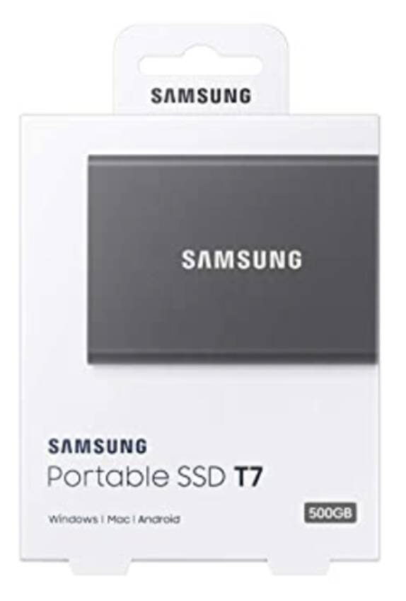

## Bitcoin Core herunterladen

Gehe zu bitcoin.org (stelle sicher, dass du nicht zu bitcoin.com gehst, das ist eine Shitcoin-Seite, die Roger Ver gehört und Leute dazu verleitet, Bitcoin Cash anstelle von Bitcoin zu kaufen).

Sobald du dort bist, ist es seltsamerweise nicht offensichtlich, wo du die Software herunterladen kannst. Gehe zum Ressourcen-Menü und klicke auf "Bitcoin Core", wie unten gezeigt:

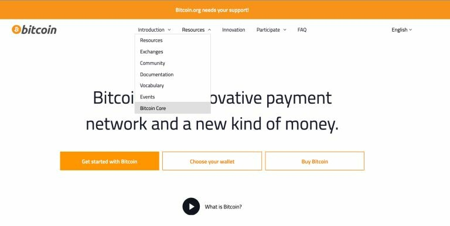

Das bringt dich zur Download-Seite:

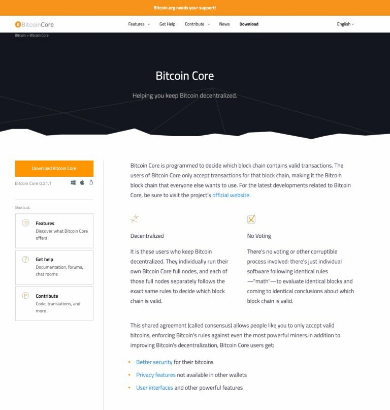

Klicke auf den orangefarbenen "Download Bitcoin Core"-Button:

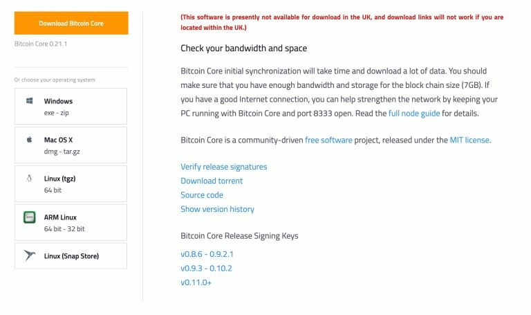

Es gibt mehrere Optionen zur Auswahl, abhängig von deinem Computer. Die ersten beiden sind für diese Anleitung relevant; wähle Windows oder Mac in der linken Leiste. Der Download beginnt, nachdem du darauf geklickt hast, wahrscheinlich in deinem Download-Verzeichnis.

## Überprüfe den Download (Teil 1)

Du benötigst die Datei, die die Hashes verschiedener Versionen enthält. Diese Datei befand sich früher auf der Download-Seite von bitcoin.org, ist aber jetzt unter bitcoincore.org/en/download zu finden:

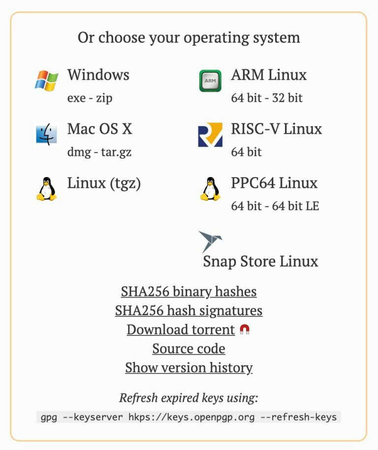

Du benötigst die Datei mit den SHA256-Binärhashes. Diese Datei enthält die SHA256-Hashes der verschiedenen Download-Pakete von Bitcoin Core.

Als nächstes müssen wir den Download von Bitcoin Core hashen und mit dem Hash in der Datei vergleichen. Dann wissen wir, dass der Download identisch ist mit dem, was von bitcoincore.org erwartet wird.

Navigiere erneut zum Download-Verzeichnis und führe diesen Befehl aus (ersetze die Xe durch den genauen Dateinamen des Bitcoin-Downloads für den Full Node):

```
FÜR MAC —–> shasum -a 256 XXXXXXXXXXXX
FÜR WINDOWS —–> certutil -hashfile XXXXXXXXXXX SHA256
```

Du erhältst eine Hash-Ausgabe. Notiere sie dir und vergleiche sie mit dem Hash in der Datei SHA256SUMS.
Wenn die Ausgaben identisch sind, haben Sie überprüft, dass keine Daten manipuliert wurden... fast. Wir müssen immer noch sicherstellen, dass die Datei SHA256SUMS nicht bösartig ist.
Um mit dem nächsten Schritt fortzufahren, müssen wir gpg auf unserem Computer installiert haben.

Um das zu tun, sehen Sie sich meinen SHA256/gpg-Leitfaden an und scrollen Sie etwa zur Hälfte zum Abschnitt "gpg herunterladen" und suchen Sie nach der Überschrift Ihres Betriebssystems. Kommen Sie dann hierher zurück.

## Holen Sie sich den öffentlichen Schlüssel

Gehen Sie zurück zur Download-Seite und holen Sie sich die Datei mit den SHA256-Hash-Signaturen


Klicken Sie darauf und speichern Sie die Datei auf der Festplatte, vorzugsweise im Verzeichnis "Downloads".

Diese Datei enthält Signaturen von verschiedenen Personen für die Datei SHA256SUMS.

Wir möchten den öffentlichen Schlüssel des Hauptentwicklers, Wladimir J. van der Laan, in den Schlüsselbund unseres Computers haben. Seine öffentliche Schlüssel-ID lautet:
1 - 01EA 5486 DE18 A882 D4C2 6845 90C8 019E 36C2 E964

Kopieren Sie diesen Text in den folgenden Befehl:

```
gpg --keyserver hkp://keyserver.ubuntu.com --recv-keys 01EA5486DE18A882D4C2684590C8019E36C2E964
```

Aus Interesse können Sie jederzeit mit diesem Befehl sehen, welche Schlüssel sich im Schlüsselbund des Computers befinden:

```
gpg --list-keys
```

## Überprüfen des Downloads (Teil 2)

Wir haben den öffentlichen Schlüssel, daher können wir jetzt die Datei SHA256SUMS überprüfen, die die Hashes des Bitcoin Core-Downloads und die Signatur für diese Hashes enthält.

Öffnen Sie erneut das Terminal oder CMD und stellen Sie sicher, dass Sie sich im Verzeichnis "Downloads" befinden. Führen Sie von dort aus diesen Befehl aus:

```
gpg –verify SHA256SUMS.asc SHA256SUMS
```

Die zuerst aufgeführte Datei ist die genaue Schreibweise der Signaturdatei. Die zweit aufgeführte Datei sollte die genaue Schreibweise der Textdatei sein, die die Hashes enthält. Beide Dateien sollten sich im selben Verzeichnis befinden und Sie müssen sich im Verzeichnis der Dateien befinden, sonst müssen Sie den vollständigen Pfad für jede Datei eingeben.

Dies ist die Ausgabe, die Sie erhalten sollten

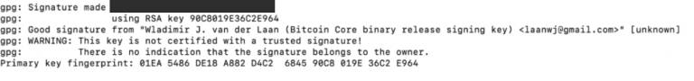

Sie können die WARNUNG ignorieren - das erinnert Sie nur daran, dass Sie Wladimir an einem wichtigen Punkt nicht persönlich getroffen und ihn nach seinem öffentlichen Schlüssel gefragt haben und dann Ihren Computer angewiesen haben, diesem Schlüssel vollständig zu vertrauen.

Wenn Sie diese Nachricht erhalten haben, wissen Sie nun, dass die Datei SHA256SUMS.asc nach der Signierung durch Wladimir nicht manipuliert wurde.

## Bitcoin Core installieren

Sie sollten keine detaillierten Anweisungen zur Installation des Programms benötigen.

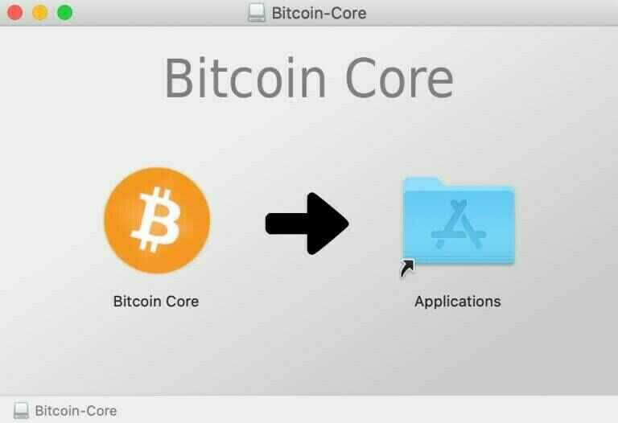

## Bitcoin Core ausführen

Auf einem Mac erhalten Sie möglicherweise eine Warnung (Apple ist immer noch gegen Bitcoin)

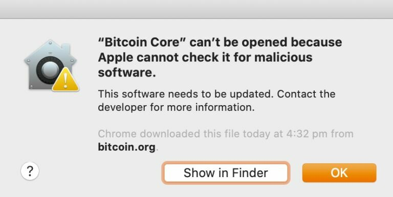

Klicken Sie auf OK und öffnen Sie dann Ihre Systemeinstellungen

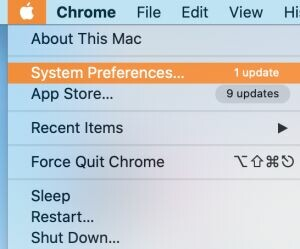

Klicken Sie auf das Symbol "Sicherheit und Datenschutz":

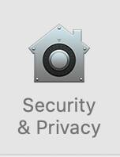

Klicken Sie dann auf "Trotzdem öffnen":

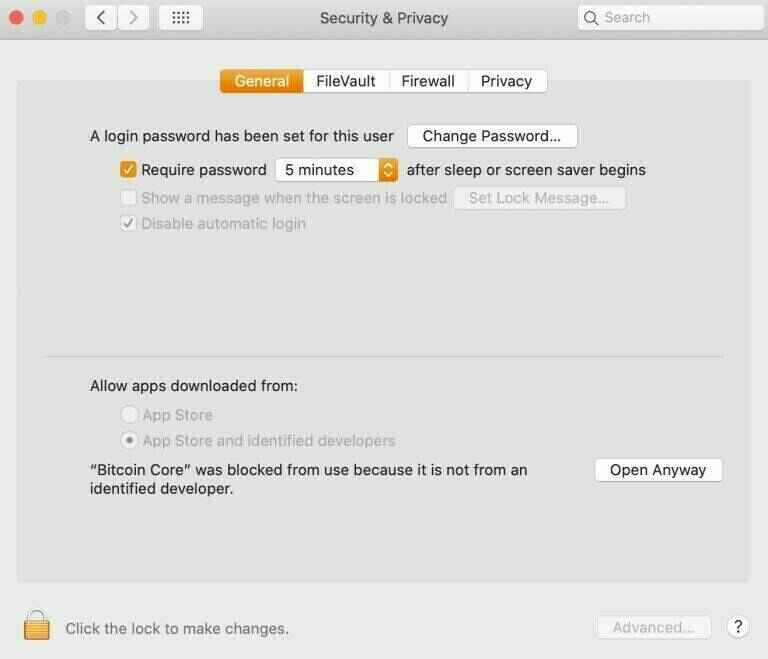

Die Fehlermeldung wird erneut angezeigt, aber diesmal steht Ihnen eine SCHALTFLÄCHE "Öffnen" zur Verfügung. Klicken Sie darauf.


Bitcoin Core sollte geladen werden und Sie werden einige Optionen angezeigt bekommen:

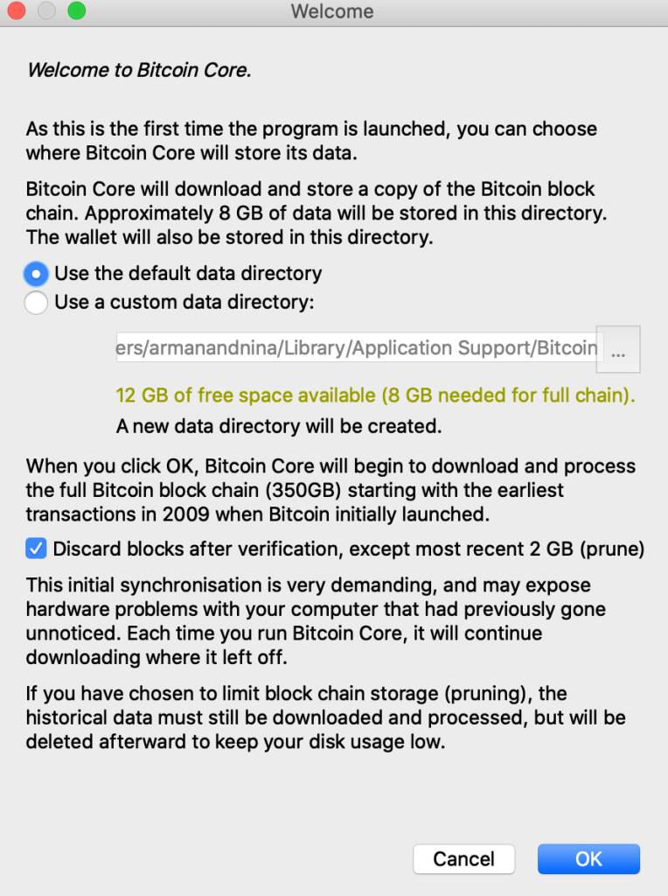

Hier können Sie wählen, ob Sie den Standardpfad für den Download der Blockchain verwenden möchten oder ob Sie Ihr externes Laufwerk auswählen möchten. Wenn Sie das interne Laufwerk verwenden möchten, empfehle ich, den Standardpfad nicht zu ändern, da es einfacher ist, andere Software zu installieren, um mit Bitcoin Core zu kommunizieren.

Sie können wählen, ob Sie einen beschnittenen Knoten ausführen möchten. Dadurch wird Speicherplatz gespart, aber es werden auch die Möglichkeiten Ihres Knotens eingeschränkt. In jedem Fall werden Sie die gesamte Blockchain herunterladen und überprüfen, daher sollten Sie, wenn Sie genügend Platz haben, das Heruntergeladene behalten und es nicht beschränken, wenn Sie es vermeiden können.

Sobald Sie bestätigt haben, beginnt der Download der Blockchain. Es wird mehrere Tage dauern.

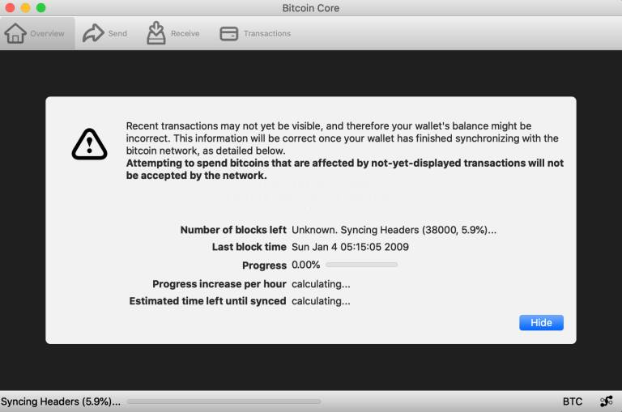

Sie können den Computer ausschalten und später mit dem Download fortfahren, es wird keinen Schaden verursachen.
