Installare Bitcoin Core sul tuo computer regolare è possibile, ma non è l'ideale. Se non ti dispiace lasciare il computer acceso 24/7, allora funzionerà bene. Se devi spegnere il computer, diventa fastidioso dover aspettare che il software si sincronizzi ogni volta che lo riaccendi.

Queste istruzioni sono per utenti Mac o Windows. Gli utenti Linux probabilmente non avranno bisogno del mio aiuto, ma le istruzioni per Linux sono molto simili a quelle per Mac.

## Inizia da zero

Idealmente, vorresti utilizzare un computer pulito, uno senza malware. Anche se utilizzi un portafoglio hardware, il malware può ingannarti e farti perdere le tue monete.

Puoi cancellare completamente un vecchio computer e utilizzarlo come computer Bitcoin dedicato, oppure acquistare un computer/portatile dedicato.

## L'Hard Drive

Bitcoin Core occuperà circa 400 gigabyte di dati sul tuo disco e continuerà a crescere. Puoi utilizzare il tuo disco interno, ma puoi anche collegare un hard disk esterno. Spiegherò entrambe le opzioni. Idealmente, dovresti utilizzare un'unità a stato solido. Se hai un vecchio computer, probabilmente non ne hai una internamente. Basta acquistare un SSD esterno da 1 o 2 terabyte e utilizzarlo. Il disco normale probabilmente funzionerà, ma potresti avere problemi e sarà molto più lento.

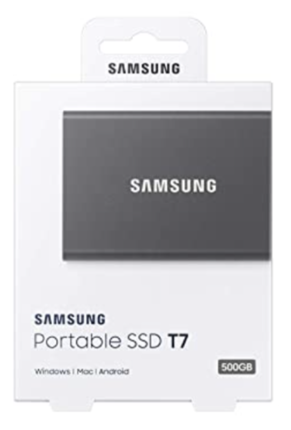

## Scarica Bitcoin Core

Vai su bitcoin.org (assicurati di non andare su bitcoin.com, che è un sito shitcoin di proprietà di Roger Ver, che inganna le persone a comprare Bitcoin Cash invece di Bitcoin)

Una volta lì, non è stranamente ovvio dove ottenere il software. Vai al menu delle risorse e clicca su "Bitcoin Core", come mostrato di seguito:

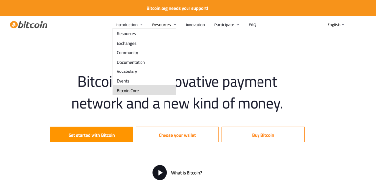

Questo ti porterà alla pagina di download:

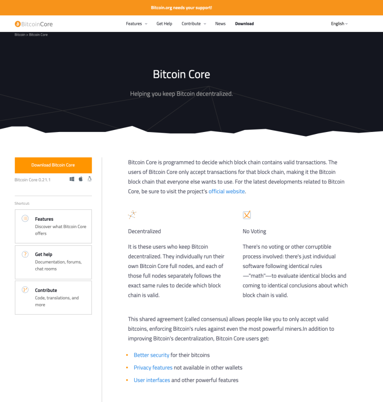

Clicca sul pulsante arancione "Download Bitcoin Core":


Ci sono diverse opzioni tra cui scegliere, a seconda del tuo computer. Le prime due sono rilevanti per questa guida; scegli Windows o Mac nella barra laterale sinistra. Inizierà il download dopo aver cliccato, molto probabilmente nella tua cartella Downloads.

## Verifica il download (parte 1)

Hai bisogno del file che contiene gli hash delle varie versioni. Questo file era solito essere nella pagina dei download di bitcoin.org, ma ora è stato spostato su bitcoincore.org/en/download:


Hai bisogno del file degli hash binari SHA256. Questo file contiene gli hash SHA256 dei vari pacchetti di download di Bitcoin Core.

Successivamente, dobbiamo calcolare l'hash del download di Bitcoin Core e confrontarlo con quello che il file dice che dovrebbe essere l'hash. In questo modo sappiamo che il download è identico a quello previsto, secondo bitcoincore.org.

Torna nella cartella Downloads e esegui questo comando (sostituisci le X con il nome completo del file di download del nodo completo di Bitcoin):

```
PER MAC —–> shasum -a 256 XXXXXXXXXXXX
PER WINDOWS —–> certutil -hashfile XXXXXXXXXXX SHA256
```

Otterrai un output di hash. Prendine nota e confrontalo con l'hash contenuto nel file SHA256SUMS.
Se gli output sono identici, allora hai verificato che nessun bit di dati sia stato manomesso... quasi. Dobbiamo ancora essere sicuri che il file SHA256SUMS non sia dannoso.
Per procedere con il passaggio successivo, dobbiamo avere gpg installato sul nostro computer.

Per farlo, consulta la mia guida su SHA256/gpg e scorri fino a metà della sezione "Download gpg", cercando il sottotitolo del tuo sistema operativo. Poi torna qui.

## Ottieni la chiave pubblica

Torna alla pagina di download e ottieni il file delle firme hash SHA256

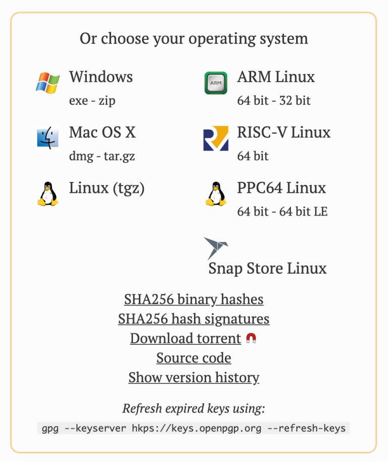

Clicca su di esso e salva il file sul disco, preferibilmente nella cartella Downloads.

Questo file contiene firme di varie persone, del file SHA256SUMS.

Vogliamo la chiave pubblica del lead developer, Wladimir J. van der Laan, nel nostro keyring del computer. Il suo ID di chiave pubblica è:
1 - 01EA 5486 DE18 A882 D4C2 6845 90C8 019E 36C2 E964

Copia quel testo nel seguente comando:

```
gpg --keyserver hkp://keyserver.ubuntu.com --recv-keys 01EA5486DE18A882D4C2684590C8019E36C2E964
```

Per interesse, in qualsiasi momento, puoi vedere quali chiavi sono nel keyring del computer con questo comando:

```
gpg --list-keys
```

## Verifica il download (parte 2)

Abbiamo la chiave pubblica, quindi possiamo ora verificare il file SHA256SUMS che contiene gli hash del download di Bitcoin Core e la firma per quegli hash.

Apri il Terminale o CMD di nuovo e assicurati di essere nella cartella Downloads. Da lì, esegui questo comando:

```
gpg –verify SHA256SUMS.asc SHA256SUMS
```

Il primo file elencato è l'esatta ortografia del file di firma. Il secondo file elencato dovrebbe essere l'esatta ortografia del file di testo contenente gli hash. Entrambi i file dovrebbero trovarsi nella stessa cartella e devi essere nella cartella dei file, altrimenti devi digitare il percorso completo per ogni file.

Questo è l'output che dovresti ottenere

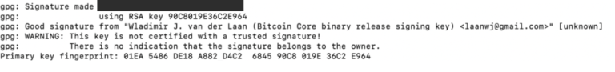

Puoi ignorare tranquillamente il messaggio di AVVERTIMENTO: ti sta solo ricordando che non hai incontrato Wladimir in una parte chiave e personalmente gli hai chiesto qual era la sua chiave pubblica, e poi hai detto al tuo computer di fidarsi completamente di questa chiave.

Se hai ricevuto questo messaggio, ora sai che il file SHA256SUMS.asc non è stato manomesso dopo che Wladimir l'ha firmato.

## Installa Bitcoin Core

Non dovresti avere bisogno di istruzioni dettagliate su come installare il programma.


## Esegui Bitcoin Core

Su un Mac, potresti ricevere un avviso (Apple è ancora anti-Bitcoin)

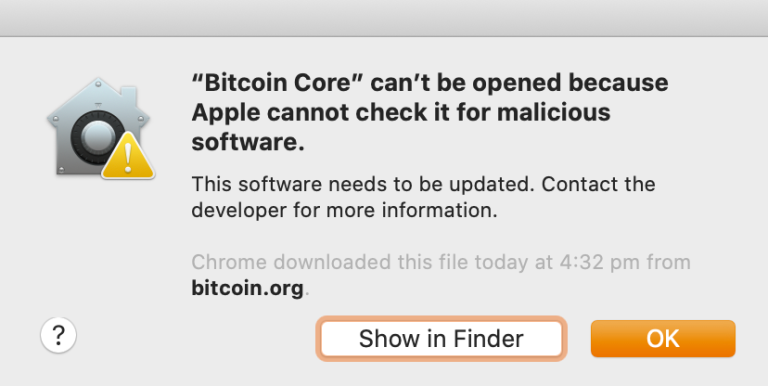

Clicca su OK, e poi apri le Preferenze di Sistema

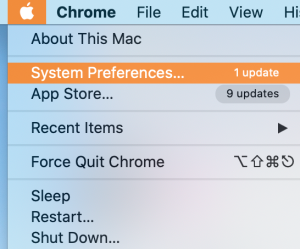

Clicca sull'icona Sicurezza e Privacy:

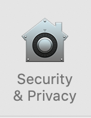

Poi clicca su "apri comunque":

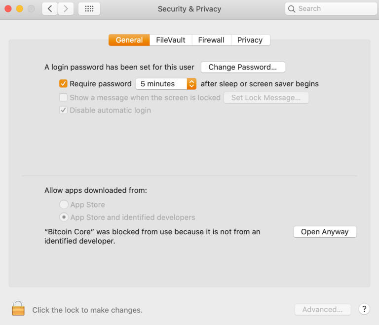

L'errore apparirà di nuovo, ma questa volta avrai a disposizione un pulsante APRI. Cliccaci sopra.

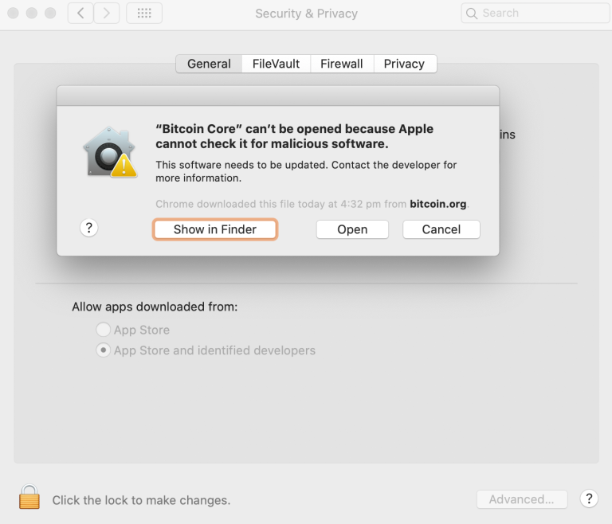

Bitcoin Core dovrebbe caricarsi e ti verranno presentate alcune opzioni:

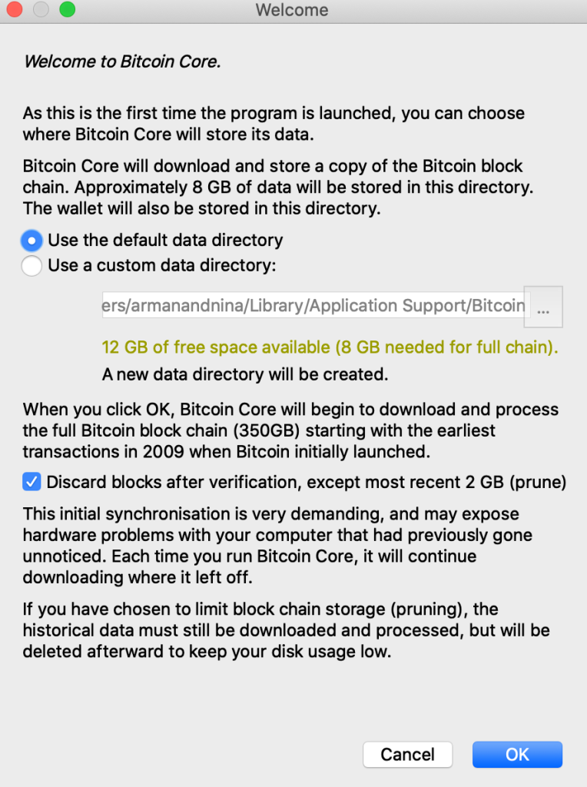

Qui puoi scegliere se utilizzare il percorso predefinito per il download della blockchain o se scegliere il tuo disco esterno. Consiglio di non modificare il percorso predefinito se utilizzi il disco interno, rende più facile configurare altre applicazioni per comunicare con Bitcoin Core.

Puoi scegliere di eseguire un nodo ridotto, che risparmia spazio ma limita le funzionalità del tuo nodo. In ogni caso, scaricherai l'intera blockchain e la verificherai comunque, quindi se hai spazio, conserva ciò che hai scaricato e non riduci se puoi evitarlo.

Una volta confermato, il download della blockchain inizierà. Ci vorranno molti giorni.


Puoi spegnere il computer e tornare per il download se vuoi, non causerà danni.
