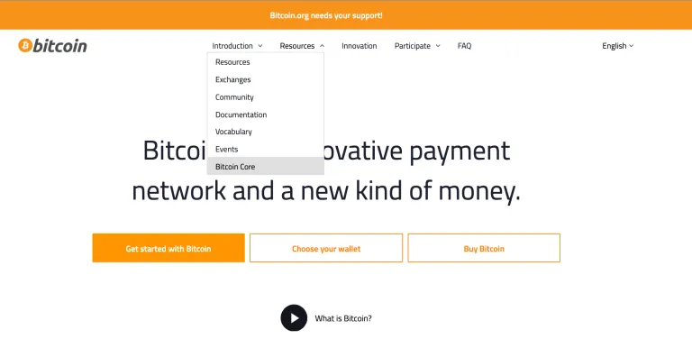
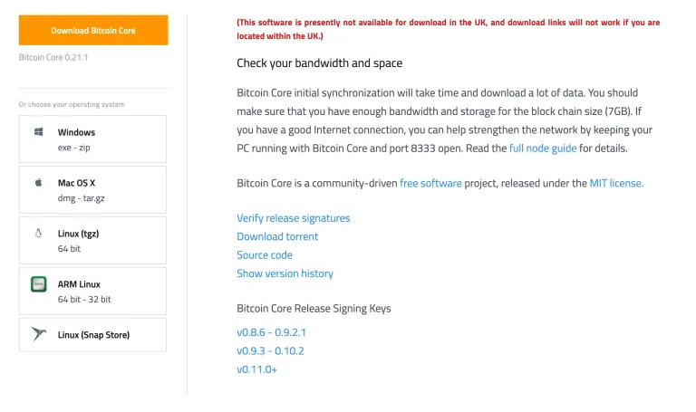
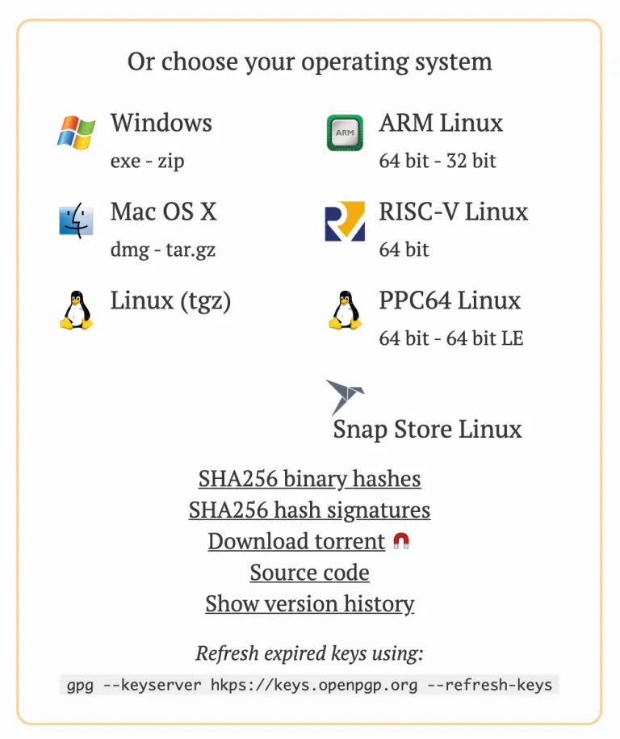
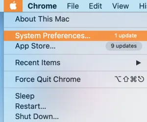
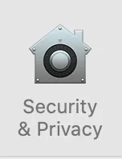
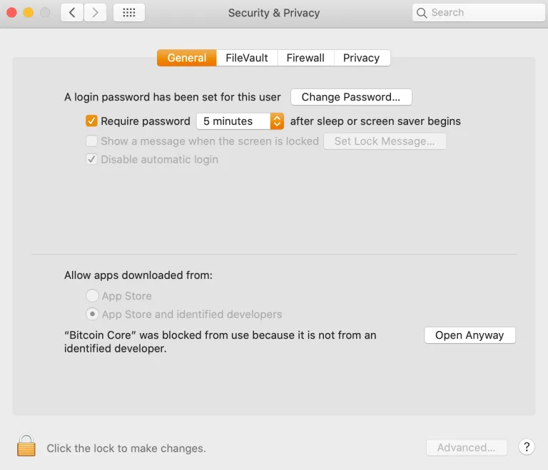
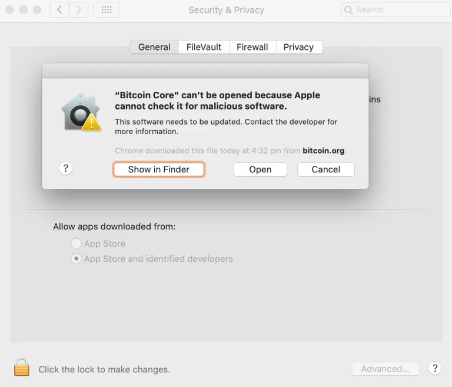
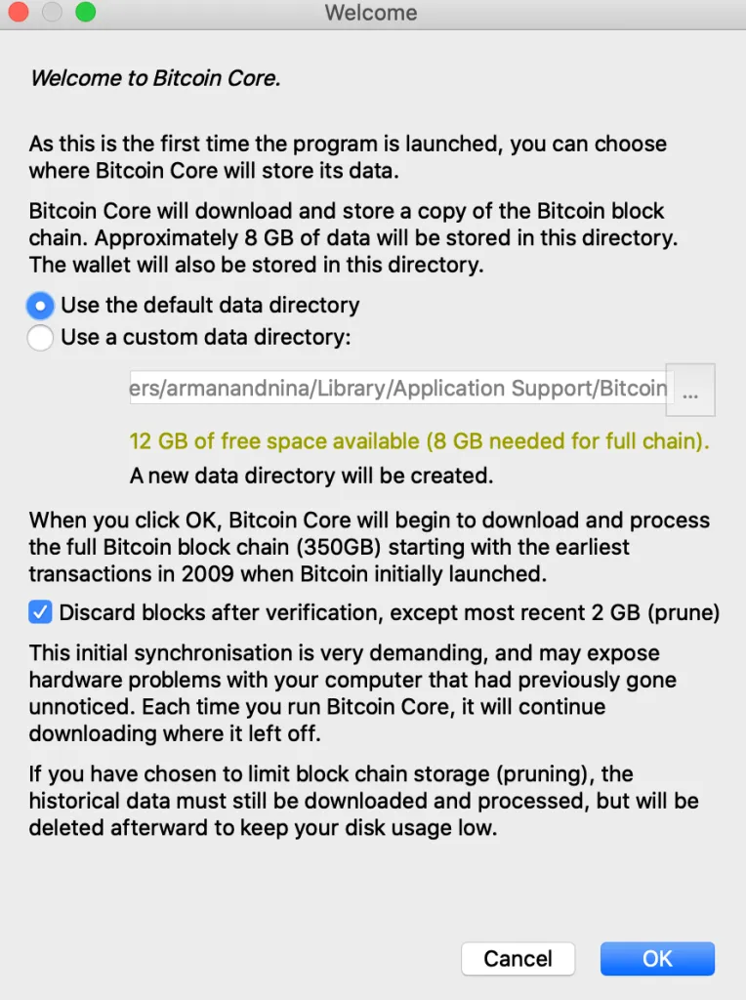

通常のコンピューターにBitcoin Coreをインストールすることは可能ですが、理想的ではありません。コンピューターを24/7稼働させることが気にならない場合は、問題なく機能します。コンピューターをオフにする必要がある場合、再度オンにするたびにソフトウェアが同期するのを待つのが面倒になります。

これらの指示は、MacまたはWindowsユーザー向けです。Linuxユーザーはおそらく私の助けを必要としないでしょうが、Linuxの指示はMacと非常に似ています。

## スタートクリーン

理想的には、マルウェアのないクリーンなコンピューターを使用したいところです。ハードウェアウォレットを使用していても、マルウェアによってコインを騙し取られる可能性があります。

古いコンピューターを完全にクリーンアップして、専用のBitcoinコンピューターとして使用するか、専用のコンピューター/ラップトップを購入することができます。

## ハードドライブ

Bitcoin Coreはドライブ上に約400ギガバイトのデータを占め、増え続けます。内蔵ドライブを使用することもできますが、外付けハードドライブを接続することもできます。両方のオプションについて説明します。理想的には、ソリッドステートドライブを使用するべきです。古いコンピューターを持っている場合、これらは内部にはない可能性が高いです。1または2テラバイトの外付けSSDを購入して使用してください。通常のドライブでも機能するかもしれませんが、問題が発生する可能性があり、はるかに遅くなるでしょう。


## Bitcoin Coreをダウンロードする

bitcoin.orgにアクセスしてください（bitcoin.comにアクセスしないでください。これはRoger Verが所有するshitcoinサイトで、人々にBitcoinではなくBitcoin Cashを購入させるために騙しています）

そこにいると、ソフトウェアをどこで入手するかは奇妙にも明白ではありません。リソースメニューに移動し、「Bitcoin Core」と表示されている以下のようにクリックします：



これにより、ダウンロードページに移動します：


Download Bitcoin Coreオレンジ色のボタンをクリックします：



コンピューターに応じていくつかのオプションがあります。このガイドに関連する最初の2つは、左バーでWindowsまたはMacを選択します。クリックすると、ほとんどの場合、ダウンロードディレクトリにダウンロードが開始されます。

## ダウンロードを検証する（パート1）

様々なリリースのハッシュが含まれているファイルが必要です。このファイルは以前はbitcoin.orgのダウンロードページにありましたが、現在はbitcoincore.org/en/downloadに移動しています：


SHA256バイナリハッシュファイルが必要です。このファイルには、Bitcoin CoreのさまざまなダウンロードパッケージのSHA256ハッシュが含まれています。

次に、Bitcoin Coreのダウンロードをハッシュ化し、ファイルが示すハッシュと比較する必要があります。そうすることで、ダウンロードがbitcoincore.orgによって期待されるものと同一であることを知ることができます。

再びダウンロードディレクトリに移動し、このコマンドを実行します（Xの部分を正確にノードビットコインダウンロードファイル名で置き換えてください）：

```bash
shasum -a 256 XXXXXXXXXXXX # <--- FOR MAC
certutil -hashfile XXXXXXXXXXX SHA256 # <--- FOR WINDOWS
```

ハッシュ出力が得られます。それをメモし、SHA256SUMSファイルに含まれるハッシュと比較します。

出力が同一であれば、データのビットが改ざんされていないことが検証されたことになります…ほぼ。SHA256SUMSファイルが悪意のあるものではないことを確認する必要があります。

次のステップに進むには、コンピューターにgpgがインストールされている必要があります。
それを行うには、私のSHA256/gpgガイドを参照し、約半分までスクロールして「Download gpg」セクションを探し、お使いのオペレーティングシステムの小見出しを探してください。それからここに戻ってきてください。
## 公開鍵を取得する

ダウンロードページに戻り、SHA256ハッシュ署名ファイルを取得します。



クリックしてファイルをディスクに保存します。できればDownloadsディレクトリに保存してください。

このファイルには、SHA256SUMSファイルのさまざまな人々による署名が含まれています。

私たちは、コンピュータのキーリングにリードデベロッパーのWladimir J. van der Laanの公開鍵を持ちたいと思っています。彼の公開鍵IDは以下の通りです：
1 - 01EA 5486 DE18 A882 D4C2 6845 90C8 019E 36C2 E964

そのテキストを次のコマンドにコピーします：

```bash
gpg --keyserver hkp://keyserver.ubuntu.com --recv-keys 01EA5486DE18A882D4C2684590C8019E36C2E964
```

興味がある場合は、いつでもこのコマンドでコンピュータのキーリングにどのような鍵があるかを確認できます：

```bash
gpg --list-keys
```

## ダウンロードを検証する（パート2）

公開鍵を取得したので、Bitcoin Coreのダウンロードのハッシュとそれらのハッシュの署名が含まれているSHA256SUMSファイルを検証することができます。

再びTerminalまたはCMDを開き、Downloadsディレクトリにいることを確認します。そこから、このコマンドを実行します：

```bash
gpg –verify SHA256SUMS.asc SHA256SUMS
```

最初にリストされたファイルは、署名ファイルの正確なスペルです。2番目にリストされたファイルは、ハッシュを含むテキストファイルの正確なスペルである必要があります。両方のファイルは同じディレクトリにあり、ファイルのディレクトリにいる必要があります。そうでない場合は、各ファイルの完全なパスを入力する必要があります。

これが得られるべき出力です


WARNINGメッセージは無視しても安全です - それはただ、あなたがWladimirに会って彼の公開鍵が何であるかを直接尋ね、その後あなたのコンピュータにこの鍵を完全に信頼するように伝えていないことを思い出させるものです。

このメッセージが表示された場合、SHA256SUMS.ascファイルがWladimirによって署名された後に改ざんされていないことがわかります。

## Bitcoin Coreをインストールする

プログラムのインストール方法について詳細な指示は必要ありません。


## Bitcoin Coreを実行する

Macを使用している場合、警告が表示されることがあります（AppleはまだBitcoinに反対しています）


OKをクリックし、次にシステム環境設定を開きます



セキュリティとプライバシーのアイコンをクリックします：



その後、「とにかく開く」をクリックします：



エラーが再び表示されますが、今回は「開く」ボタンが利用可能になります。それをクリックします。



Bitcoin Coreがロードされ、いくつかのオプションが表示されます：



ここでは、ブロックチェーンがダウンロードされる場所のデフォルトパスを使用するか、外部ドライブを選択するかを選ぶことができます。内部ドライブを使用する場合は、デフォルトパスを変更しないことをお勧めします。これにより、Bitcoin Coreと通信する他のソフトウェアをインストールする際に設定が簡単になります。
プルーニングされたノードを実行することを選択できます。これによりスペースを節約できますが、ノードで行えることが制限されます。いずれにせよ、ブロックチェーン全体をダウンロードして検証することになるので、スペースがあればダウンロードしたものを保持し、避けられるならプルーニングしないでください。
確認すると、ブロックチェーンのダウンロードが始まります。これには多くの日数がかかります。


ダウンロードを一時停止してコンピューターをシャットダウンし、後で戻ってダウンロードを続けたい場合は、それも可能です。何の損害もありません。