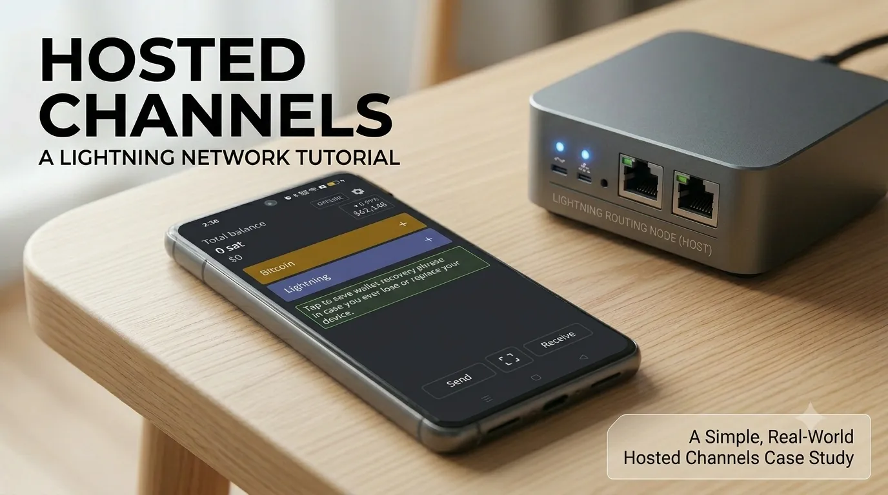

## Overview

> This tutorial contains a step by step description for the Host side setup, and mobile app client side build of the Hosted/Fiat Lightning channel protocol implementation.

This setup and build described below is primarily for the regtest testing environment, with key distinctive changes for testnet and mainnet builds highlighted accordingly. 

**What is Hosted/Fiat Channel?**

Hosted channel (HC) as the name implies is a Lightning protocol specification that describes one of many existing hosted channel types. This particular protocol specification describes a unique cost effective Lightning channel type that ensures seamless onboarding of end users onto the Lightning network.

Hosted channel (HC) are custodial Lightning channels, however, unlike several other hosted channel types, they are completely anonymous / private, ensuring that anyone can open and use them without any form of KYC, hence making them censorship resistance. 

The Hosted channel works as a Host - Client relationship, where the Host is a Lightning routing node (e.g eclair, LND) running the Hosted channel plugin (*add link to plugin*), while the Client is any Bitcoin wallet software application (e.g Valet) running the client side code according to the specification (*add immortan link*).

A Client initiates the channel creation by requesting for a channel from the Host via scanning the Host’s node QR. The node automatically responds and either accepts and opens a channel to the client or declines depending on set rules by the Host. 

Unlike in opening a normal Lightning channel, a Hosted channel opening is automatic, fast and simple, and requires no prior Liquidity commitment from neither the Host nor the client, making it largely cost effective for onboarding users to the Lightning network.

As earlier stated, Hosted channel is custodial because the client’s funds stay on the Host’s nodes, hence the Client’s in-app balances are IOU’s from the Host. The Host helps the client route payments over the network, however, the client is completely anonymous because the Host does not know who the Client is and has no metadata on Client's payments since route selection, onion formation as well as preimage generation for incoming payments all still happen on the Client side.

### **KEY**

- **Linux:** means, this command should be used in the Linux machine

- **Windows:** means, this command should be used in the windows machine

- Anywhere there’s no indication of either “Linux” or “Windows”, it means that the command can work in both machines.

- Always run open your **powershell** as **an administrator** except otherwise stated anywhere in the tutorial step.

- Image illustrations shown throughout the tutorial are only outputs from the **Linux** approach. A **Windows** approach may show something slightly different

- When you see this <VALUE> in a command, it means that you’re supposed to fill in an actual value in that space, and you must replace that whole line starting from “<” to this “>”.

Example: 

In this command: `curl -s -u :eclairapi -X POST http://127.0.0.1:15599/fc-findbyremoteid -d nodeId=<VALET_NODEID> | jq` , you are expected to replace <VALET_NODEID> with the actual node ID.

So in essence, this becomes:

`curl -s -u :eclairapi -X POST http://127.0.0.1:15599/fc-findbyremoteid -d nodeId=025d573a8022fc6ece8b6891c4a64 | jq`

## Requirements

Below are the required hardware and software dependencies needed to run and test the Hosted channel stack:

### Hardware Requirements

**A computer system**

- Linux / Windows   
- 8gb - 16gb RAM

**Android Mobile Device**

- Android V8+

### Software Dependencies

Majority of the steps in this tutorial will be done on your computer command line interface where we’ll be running several commands as required. We will also install most the required software dependencies via the command line.

This tutorial is very comprehensive, so even if you do not have a knowledge of the use of the command line interfaces, you can still get this setup done by just following the steps laid out in this tutorial.

To open the command line interface on your system, run the following command:

**Linux** = ***ctrl + Alt + T***

**Windows** = Press ***Win Key***, then type ***powershell*** and click ***Run as Administrator***

#### 1. Docker

Whether you're running on regtest or mainnet, the best environment is to run the stack as Docker containers, it makes troubleshooting and management much easier.

👉 Follow the steps below to set up Docker:

**Linux:**

Run the following commands in the order

- Installation:

`sudo apt update`

`sudo apt install -y docker.io docker-compose`

(Use arrow keys to select **YES** at the first on-screen prompt and tap **ENTER** in the second popup if any)

- Enable Docker to run automatically whenever your computer starts:

 `sudo systemctl enable --now docker`

- Fix permissions so you can run Docker easily

`sudo usermod -aG docker "$USER"`

- Apply the changes immediately

`newgrp docker`

- Verify

`docker --version && docker compose version && docker run hello-world` ✅

**Windows**

- Open Powershell as Administrator

Press ***Windows key***  
Search ***powershell***  
Click ***Run as Administrator***

- Confirm Virtualization is on

Press ***Ctrl + Shift + Esc***  
Select ***Performance***  
Look for ***Virtualization*** and confirm that it is marked ***Enabled***

- Install WSL2 first (Docker runs on this)

Run the command;

`wsl --install`

- Restart you computer  
- Run the commands below to update the WSL kernel and confirm it is v2 or above

`wsl --update`  
`wsl -l -v`

- Install Docker Desktop and accept the prompts with the command

`winget install -e --id Docker.DockerDesktop`

- Restart your computer  
- Launch the docker app

Open docker from your desktop  
Skip sign in  
Result - Engine running

- Verify the setup

Open powershell as administrator  
Run command

`docker run hello-world`  
It’d print a long string of result

### 2. Git

Git makes our work flow backward compatible, and allows for easy collaboration.

👉 Follow the steps below to set up Git

**Linux:**

- Run the command

`sudo apt install git`

(Tap **Enter** at the on-screen pop up)

- Verify installation with

`git -v`

The installed Git version will be printed on the screen as shown below

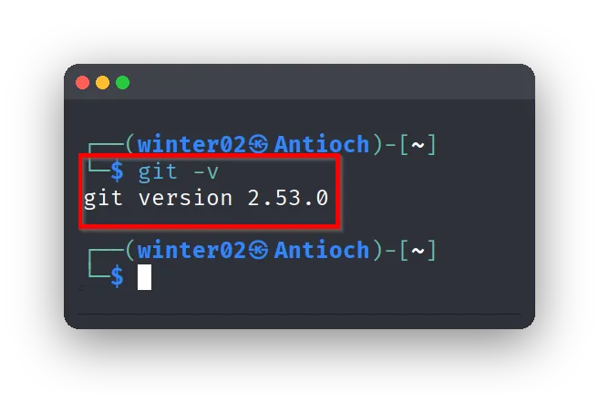

**Windows:**

- Run the command:

`winget install --id Git.Git -e --source winget`

- Close the powershell and re-open it as administrator

- Verify installation with:

`git --version`

### 3. Android SDK + adb and JDK 

These are the software dependencies that enable building and compilation of the mobile app we’ll be testing out.

👉 Follow the steps below to install and get them ready.

**Linux:**

- Run the command:

`sudo apt update && sudo apt install -y adb`

(Tap **Enter** at the on-screen pop up if any)

- Run the command:

`sudo apt install openjdk-11-jdk`

- Verify installation:

`ls /usr/lib/jvm/ | grep 11`

This will show that jdk-11 has been installed as shown below

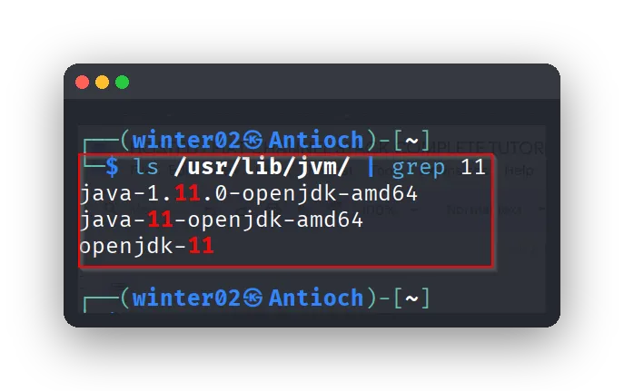

- Install Android Command Line Tools

We’ll need the Android SDK to build Valet later, so we install “only the command line tools” of the Android Studio. 

- Create a folder to download into

`mkdir -p ~/sdk-setup && cd ~/sdk-setup`

- Fetch the download link and verify it 

`url=$(curl -s https://developer.android.com/studio | grep -oE 'https://dl.google.com/android/repository/commandlinetools-linux-[0-9]+_latest.zip' | head -1)`

`echo "$url"`

- Download the tool

`wget "$url"`

- Set it up

`mkdir -p ~/android-sdk/cmdline-tools`

- Unzip and rename to latest

`cd ~/android-sdk/cmdline-tools && unzip ~/sdk-setup/commandlinetools-linux-*_latest.zip && mv cmdline-tools latest`

- Set the environment variables (add to ~/.bashrc or ~/.zshrc for persistence)

`echo 'export ANDROID_HOME=$HOME/android-sdk' >> ~/.zshrc`

`echo 'export PATH=$PATH:$ANDROID_HOME/cmdline-tools/latest/bin:$ANDROID_HOME/platform-tools' >> ~/.zshrc`

- Load them into your current shell

`source ~/.zshrc`

- Confirm sdkmanager is now on your PATH

`which sdkmanager`

You’ll see a similar print out as shown below

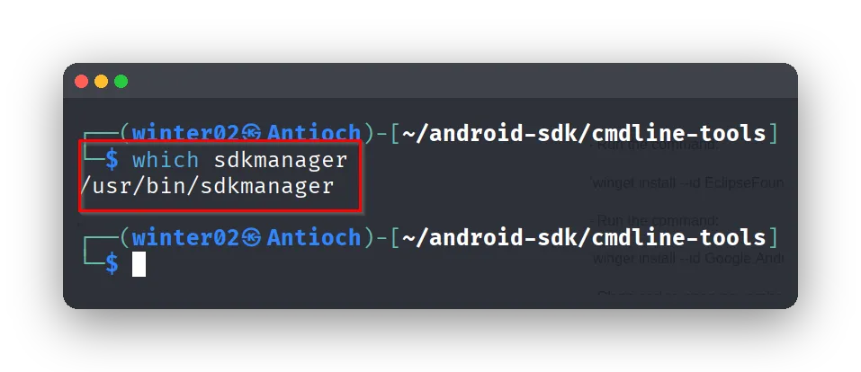

- Accept licenses and fetch the build components we’ll need later

`yes | sdkmanager --licenses`

If it reports **"licenses not accepted,"** simply run it one more time, the second run accepts them all automatically.

`sdkmanager "platform-tools" "platforms;android-33" "build-tools;30.0.3"` ✅

**Windows:**

For windows we use Temurin instead and run commands as follows.

- Run the command:

`winget install --id EclipseFoundation.Temurin.11.JDK -e --source winget`

- Run the command:

`winget install --id Google.AndroidStudio.CmdlineTools -e --source winget`

- Close and re-open powershell  as Administrator to apply changes.  
- Configure Environment Variables by running the following commands:

`$jdk = (Get-ChildItem "C:\Program Files\Eclipse Adoptium" -Directory | Where-Object Name -like "jdk-11*" | Select-Object -First 1).FullName`

`[Environment]::SetEnvironmentVariable("JAVA_HOME", $jdk, "Machine")`

`[Environment]::SetEnvironmentVariable("ANDROID_HOME", "$env:USERPROFILE\AppData\Local\Android\Sdk", "Machine")`

`[Environment]::SetEnvironmentVariable("Path", $env:Path + ";$env:USERPROFILE\AppData\Local\Android\Sdk\cmdline-tools\latest\bin;$env:USERPROFILE\AppData\Local\Android\Sdk\platform-tools", "Machine")`

- Close and re-open powershell as Administrator to apply changes.  
- Accept Licenses with the command:

`sdkmanager --licenses`

- Fetch SDK with the command:

`sdkmanager "platform-tools" "platforms;android-33" "build-tools;30.0.3"`

- Verify installation

`java -version`

### 4. QR Code Tool

We’ll need to convert some data to QR code images, so this tools helps with that.

👉 Follow the steps below to install the QR code tool

**Linux:**

- Run the command:

`sudo apt install qrencode -y`

Tap **Enter** for the on-screen pop up

- Verify installation:

`qrencode --version` ✅

The installed qrencode version will be displayed as shown below

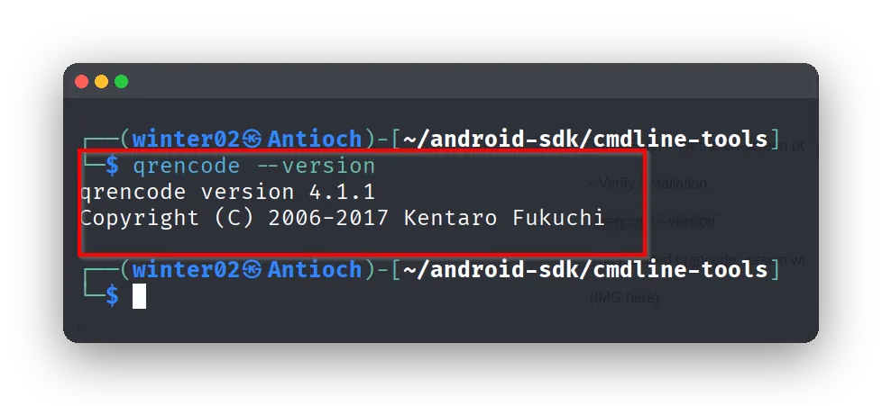

**Windows:**

- Open powershell as administrator  
- Run the command:

`winget install --id=PedroAlbanese.QREncode -e`

- Close and re-open powershell as admin to apply changes  
- Verify installation:

`qrencode --version`

### Jq

This is useful for several internal navigations.

👉 Follow the steps below

- Run command

**Linux:**

`sudo apt install -y jq qrencode`

Tap **Enter** for the on-screen pop up

**Windows:**

`winget install jqlang.jq` 

## 1. REGTEST BUILD

The instructions below should be followed strictly to build and run the Hosted/Fiat channel stack on the bitcoin **regtest** chain.

The **Regtest** chain is entirely local on your computer. No real Bitcoins are used and you have absolute control of everything.

We would create a dedicated folder / directory on our machine, where we will host and run this project from.

- Go back to your Terminal / powershell home page 

`cd ~/`

- Create a new directory / folder for the project. Run the command:

`mkdir ~/HC`

### Bring Up The Host Side

> In our description above, we mentioned that the Hosted/Fiat channel setup runs on a Host/Client relationship where the host is a Lightning routing node. This paragraph takes us through the process of editing our build configuration settings, compiling the backend engines and running them on our Host machine.

👉Follow the steps below to bring up the host side:

### Clone GitHub Repo

The complete configuration settings for this build has been assembled and placed on Standard Sats GitHub page. You’ll need to first clone it into your local repo.

- Navigate to the HC directory / folder

`cd HC`

- Clone the repo with the command

`git clone -b HC/FC-regtest-stack-fix https://github.com/0orion/deployment.git deployment`

- Verify clone was successful

`ls`

You should see something similar as below

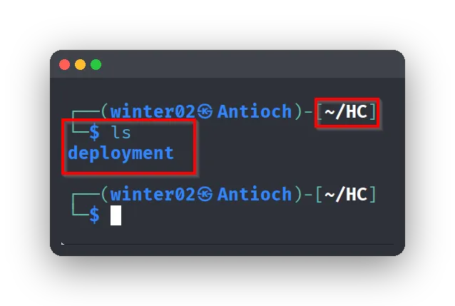

### Verify Repo and Create ‘’.env’’ file

👉 Follow the steps below

- Navigate to the cloned repository

`cd deployment`

- View the configuration files located in the repo

**Linux:**

`ls -la`

You should see the following files as shown below

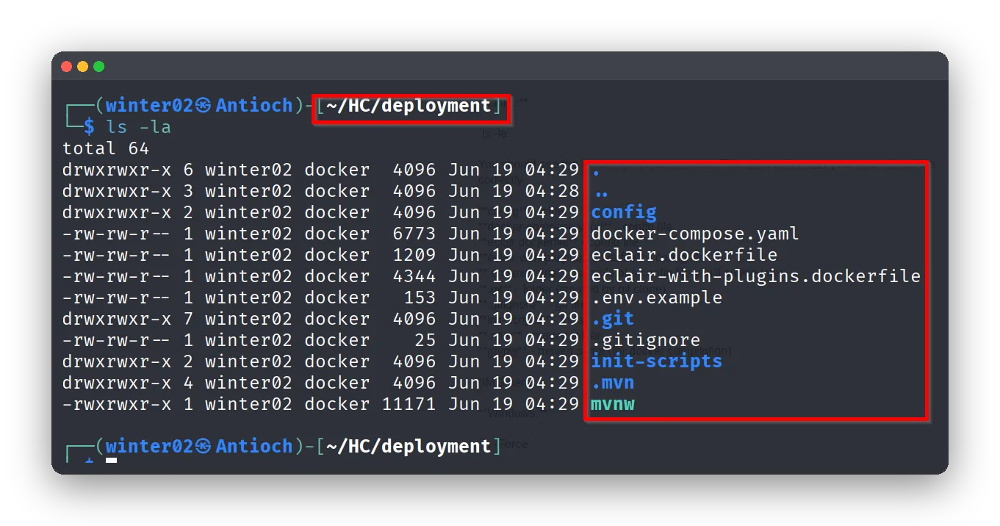

**Windows:**

`ls -Force`

- Create the `.env` file with the command

`cp .env.example .env`

- If you run the `ls -la` command again, you’ll now see the newly created `.env` file in the list of files and folders displayed ✅

### Start Host Engine

Now our configs are set and we are ready to build and run the Host backend engine.

**NB:** The engine must be started within the cloned repository root.i.e from the root directory / folder of the `deployment` repo.

👉 Follow the steps below

- If you’re following the tutorial step by step, you should still be in the root location of the ‘deployment` repository, if you’re not on the root location of the repository, navigate back there with:

`cd deployment`

- Run the command below to confirm you’re in the repo directory

`pwd`

You’ll see something similar as shown below

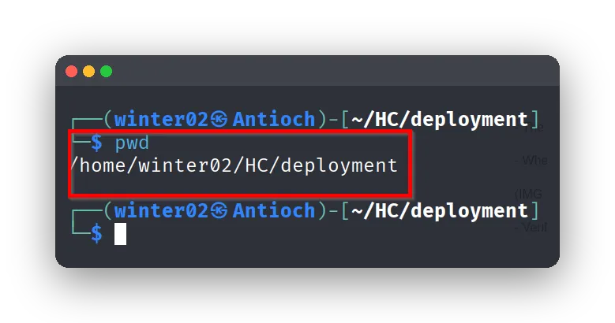

- Now, let us build the docker containers. Run command:

`docker compose up -d --build`

The build will start running on your screen. This will take sometime (5 to 30 minutes), so wait.  
When the build is complete, you should see a similar print out at the end:

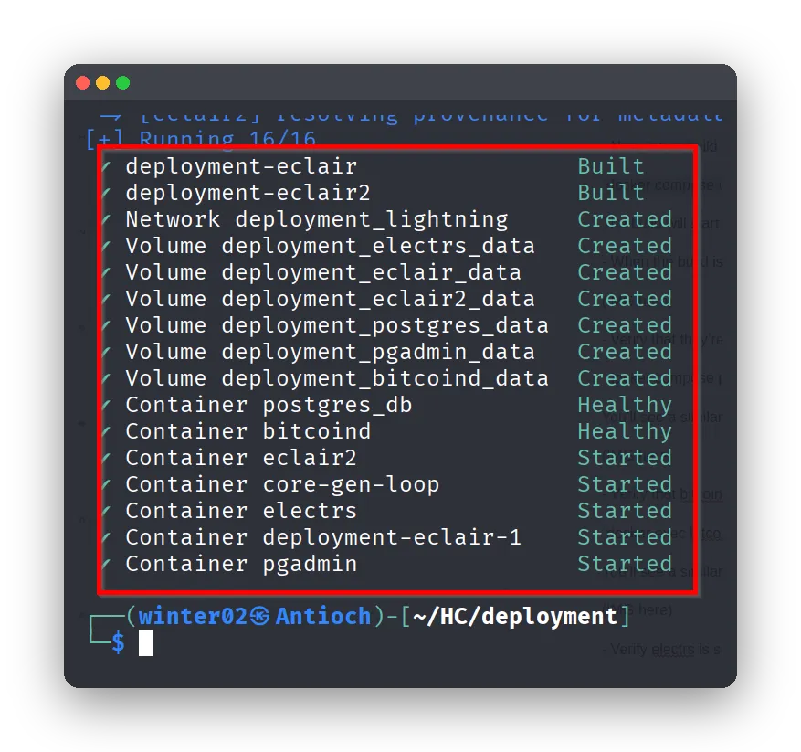

- Verify that they’re up and steady

`docker compose ps`

You’ll see a similar print out as shown below:

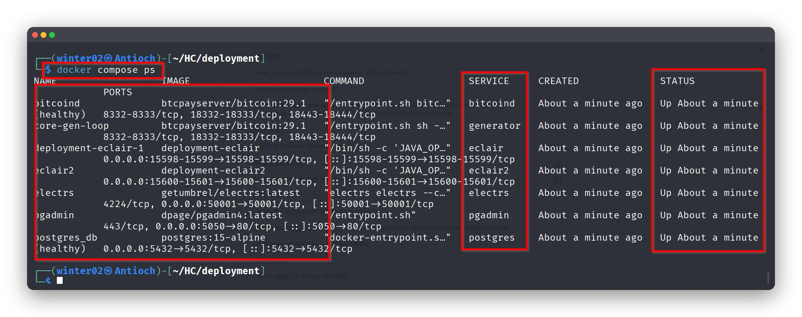

- Verify that bitcoind has blocks (> or = 101)

`docker exec bitcoind bitcoin-cli -regtest -rpcuser=bitcoin -rpcpassword=bitcoin getblockcount`

You’ll see a similar output as shown below

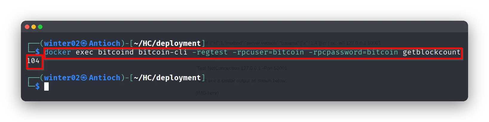

- Verify electrs is serving on 50001:

**Linux:**

`printf '{"id":1,"method":"server.version","params":["x","1.4"]}\n' | nc -w3 127.0.0.1 50001`

You’ll see a similar output as shown below:

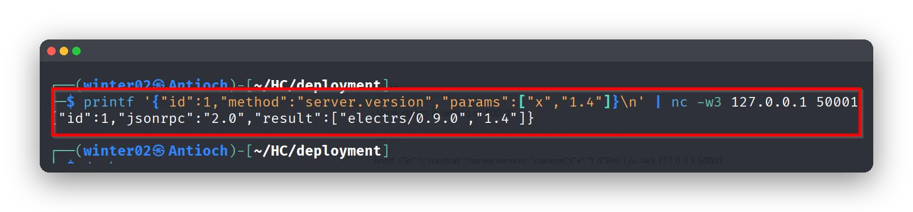

**Windows:**

`Test-NetConnection 127.0.0.1 -Port 50001`

- Verify that eclair is up and on regtest   
(take note the **nodeId**, you’ll need it in the coming steps)

**Linux:**

`curl -s -u "":"eclairapi" -X POST http://127.0.0.1:15599/getinfo`

You’ll see a similar printout as shown below

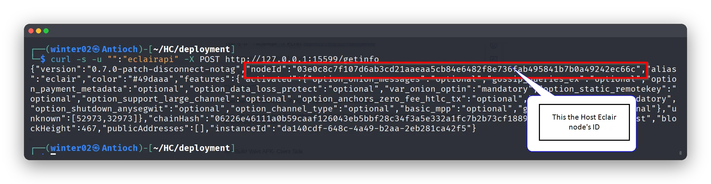

**Windows:** 

`curl.exe -s -u ":eclairapi" -X POST http://127.0.0.1:15599/getinfo`

Now, we have now built the Hosted/Fiat channel host engine, and it is running, ready to connect to Valet the client side. ✅

### Build Valet APK- Client Side

Now, we will compile and build Valet Bitcoin wallet regtest version, so that we can test our Hosted channel setup and confirm that it is working.

You should be in the **HC** root directory / folder when starting this step. Remember, **HC** is the first directory / folder we created for this project.

👉 Follow the steps below

- Navigate to the HC root folder (if you’re not there)

`cd ~/HC`

- Verify you’re in the HC root with

`pwd`

You should see a similar output as shown below:

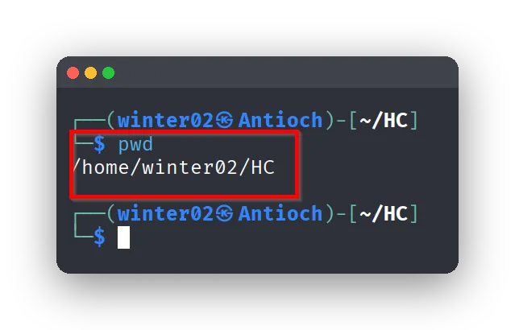

- Now, clone the valet repository from GitHub

`git clone --depth 1 --single-branch --branch mainnet https://github.com/standardsats/valet.git`

- Verify successful cloning

`ls`

You’ll see a similar output as shown below:

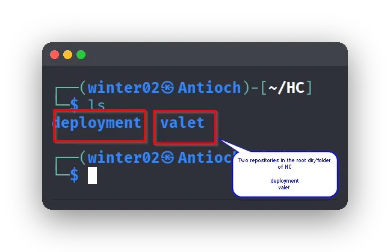

- Navigate into the cloned repository

`cd valet`

- Point to JDK-11 (This is only used in the current terminal / powershell session)

**Linux:**

`export JAVA_HOME=/usr/lib/jvm/java-11-openjdk-amd64`

**Windows:**

`$env:JAVA_HOME = (Get-ChildItem "C:\Program Files\Eclipse Adoptium\jdk-11*","C:\Program Files\Java\jdk-11*" -Directory -ErrorAction SilentlyContinue | Select-Object -First 1).FullName`

- Verify

`$JAVA_HOME/bin/java -version`

You should see the version showing JDK-11 as seen below

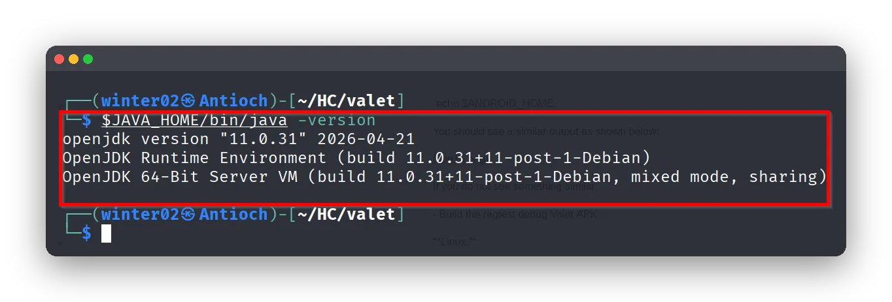

**Windows:**

`echo $env:JAVA_HOME`

`& "$env:JAVA_HOME\bin\java.exe" -version`

- Confirm ANDROID_HOME is set

**Linux:**

`echo $ANDROID_HOME`

You should see a similar output as shown below:

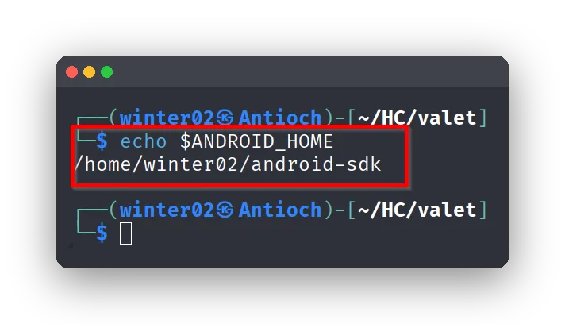

**Windows:**

`echo $env:ANDROID_HOME`

- Build the regtest debug Valet APK

**Linux:**

`chmod +x gradlew`

`./gradlew assembleRegtestDebug`

**Windows:**

`.\gradlew.bat assembleRegtestDebug`

**NB:** The build will take several minutes, based on your RAM capacity. So you’ll have to exercise a bit of patience here while the build completes.

- When the build is completed, it should print a “BUILD SUCCESSFUL” as shown below:

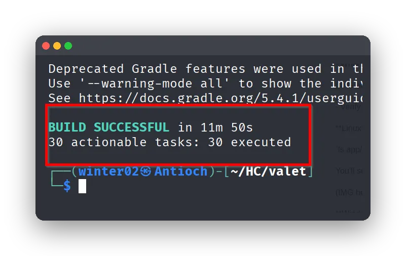

- Verify the build and locate the APK file

**Linux:**

`ls app/build/outputs/apk/regtest/debug/` ✅

You’ll see the apk file displayed as shown below

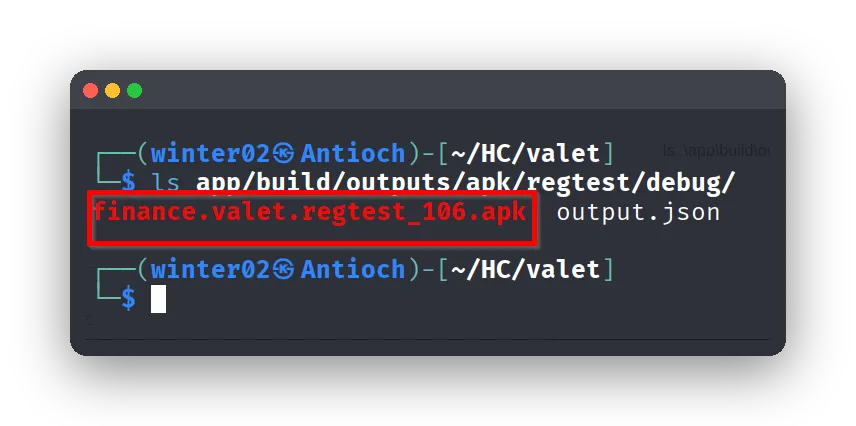

**Windows:**

`ls .\app\build\outputs\apk\regtest\debug\`

### Install Valet On Mobile Device And Setup Electrum Server Endpoint

Here, we’ll install the Valet APK to our Android mobile device, and then setup an electrum server to ensure a proper interaction between the wallet and our Host setup.

👉 Follow the steps below

Firstly, we’ll enable **Debugging** mode on the Android device

- Go to **Settings** > **About phone** > tap **Build number 7 consecutive  times until it says "You are now a developer."**

- Then go to phone **Settings** > **System Settings** > Toggle on **Developer Options** > Toggle on **“USB Debugging"**

The navigation to the Debug mode settings maybe vary slightly depending on the Android device brand, but it is ALWAYS located within the **Developer Options** in the Settings section for most Android phones.

- Connect your phone to the PC using a USB cable. Please ensure it is a data-cable (can be used for transferring files) because some cables are charge-only cables.

- Select **File transfer / MTP** at the pop up

As shown below:

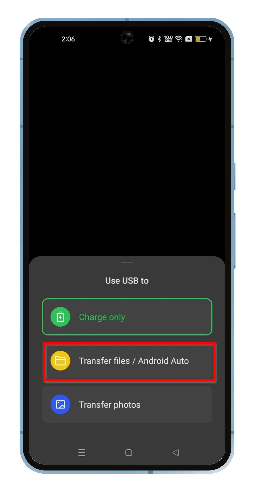

- Find the phone with the computer. Run command:

`adb devices`

A pop up will come out on the phone screen, click on **Allow** to *Authorize** access as shown below

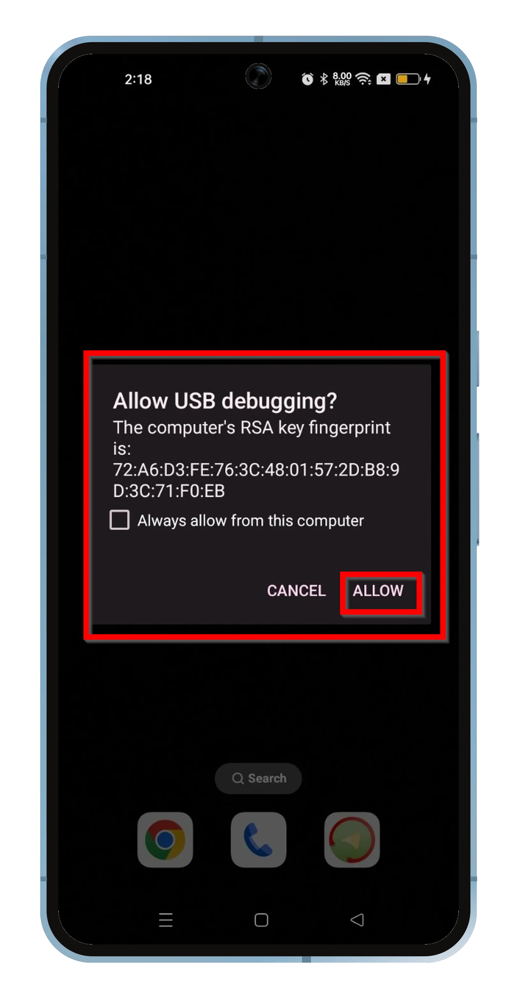

-Now, run the adb command again and you can see the device is authorized

You’ll see a similar output as shown below:

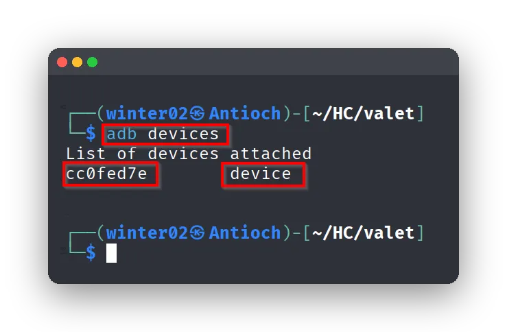

- Install Valet to mobile. From the valet directory / folder, run the command:

**Linux:**

`adb install -r app/build/outputs/apk/regtest/debug/finance.valet.regtest_106.apk`

This will automatically install valet on your phone, and you should see the Valet icon on your home page or app list, as shown below:

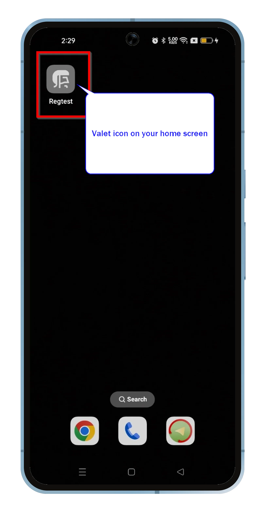

**Windows:**

`adb install -r app\build\outputs\apk\regtest\debug\finance.valet.regtest_106.apk`

**NB:** You may use other means to install Valet on your mobile device from your system, perhaps via sending the *.apk* file to your google drive, and then downloading it to your phone from the google drive, or via sending it through Telegram chat, as Telegram allows .apk file transfers.

Now that Valet has been installed on your mobile device, we’ll need to set up an Electrum server so that we can make connections to your Host node.

**NB:** Your phone and your Host PC must be on the same network. This means that they should be connected to the same WiFi or LAN.  
If the Host runs inside a Virtual Machine, the VM must use **Bridged** networking (not NAT) so it has a real LAN IP the phone can reach.

- To find out what your PC's IP address is, run the command:

**Linux:**

`hostname -I`

Your IP is the first address (e.g 192.168.0.149) as shown below

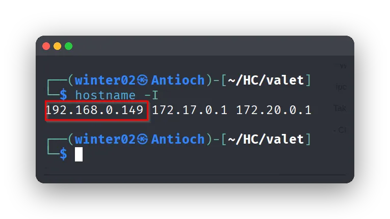

**Windows:**

`ipconfig`  (look at the IPv4 Address under your active Wi‑Fi/Ethernet adapter)

Take note of the IP address as you’ll be needing it in a couple next steps.

- Click on the Valet icon on your phone to launch the app

- Select **Create New Wallet**. You’ll automatically be taken to the wallet homepage.

Notice that at the top right corner of your wallet homepage, Valet is showing **OFFLINE**, this will change after the next step.

- Click on the **Settings** gear icon right beside the **OFFLINE** indication at the top right corner of the wallet, as shown below

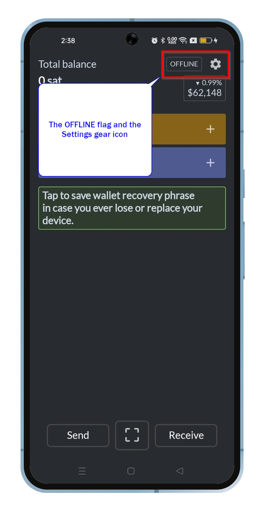

- Click on **Set Custom Electrum Node** as shown below

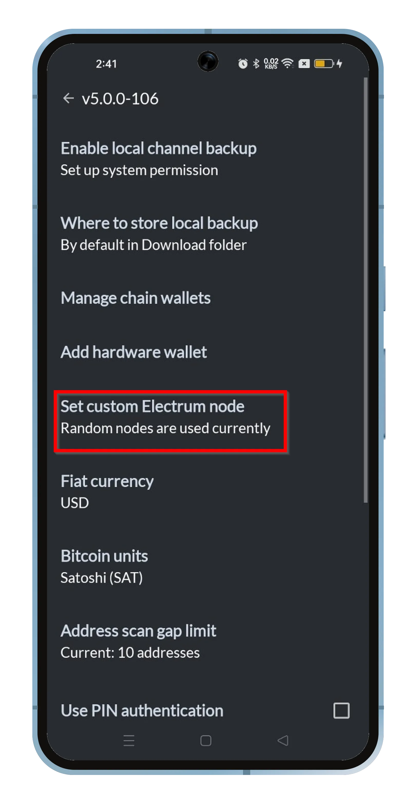

- Type in the following values in the provided space and click **OK**

`HOST_IP:50001` 

Replace **HOST_IP** with the actual **IP Address** of your PC where the Host stack is running. This is the same IP address you noted in the few steps above.

As shown below:

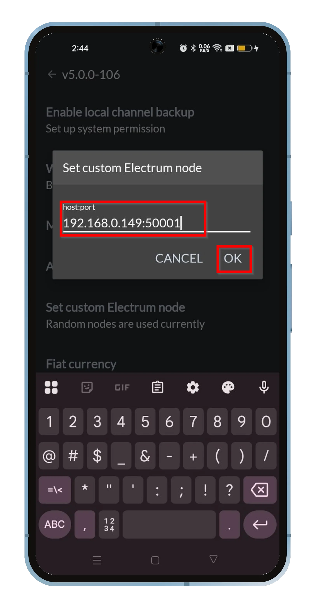

- Close out the app and open it again to apply the settings

Now, notice that the **OFFLINE** flag is no longer there, indicating that Valet is now online and synced to the chain. ✅

### Creating a Node QR

At this point, we now have our Host node up and running, and our Valet wallet built, so we proceed to opening a Fiat channel between Valet and our Host node. 

Right now, Valet is designed to open Fiat channels and not plain Hosted channels, but the process is exactly the same thing for opening plain Hosted channels.

Remember that Fiat channels are simply a tweaked version of Hosted channels that tracks the Fiat value of BTC received on the channel, which helps ensure users have a stable value at all times.

👉 Follow the steps below:

We’ll need to generate a QR code for the Host’s node (so that we can scan it with Valet to request for a channel)

- On the host PC, navigate to the root directory / folder of the deployment repo. Run command:

`cd ~/HC/deployment`

- Confirm that the docker containers we started earlier are still up and running. If they’re not, you’ll have to start them again. Run command:

`docker compose ps`

We want to see that *bitcoind, electrs, 2 eclair nodes, postgres db,** are still all up and running. If they’re not, bring them up again with the command:

`docker compose up -d`

- Do you remember the nodeID we noted down sometime ago, and the HOST_IP we recently just printed out in the previous steps, we’ll use those two info now. If you did not note them down earlier, simply run this command to print and note them down:

- For Node_ID, run command:

**Linux:**

`curl -s -u :eclairapi -X POST http://127.0.0.1:15599/getinfo | jq -r .nodeId`

**Windows:**

`curl.exe -s -u :eclairapi -X POST http://127.0.0.1:15599/getinfo | jq -r .nodeId`

- For HOST_IP, Run command:

**Linux:**

`hostname -I`

**Windows:**

`ipconfig | findstr /i "IPv4"`

- We’ll convert the node info into a QR code image by running the command:

**Linux:**

`qrencode -o node.png "<nodeId>@<HOST_IP>:15598"`

(Replace **nodeId** and **HOST_IP** with the actual values we noted earlier. The name “node.png” is a name I choose for this tutorial, you can name it whatever you want by replacing “node.png” with any name you like)

**Windows:**

Windows has no built-in QR generator, so copy the string <nodeId>@<HOST_IP>:15598 and paste it into an offline QR code generator to produce the image..

- Display the QR code image with command

**Linux:**

`xdg-open node.png` ✅

**Windows:**

Just view the downloaded qr code image with your media viewer on your pc.

### Opening a Fiat Channel

Once you’ve displayed the node QR image, you’ll need to scan it with Valet to open a channel.

👉 Follow the steps below

- On your Valet wallet home page, click on the purple card labeled **Lightning** as shown below

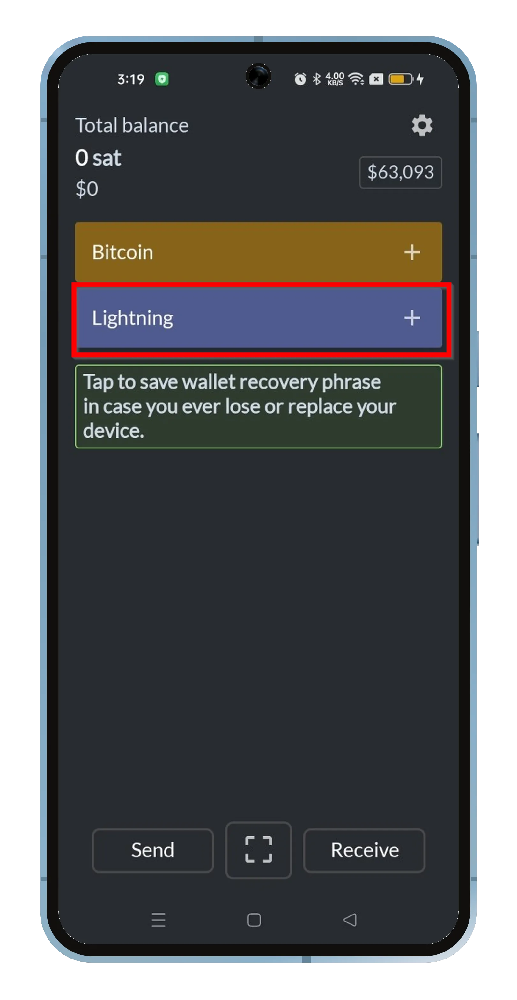

- Click on **Scan Node QR** as shown below:

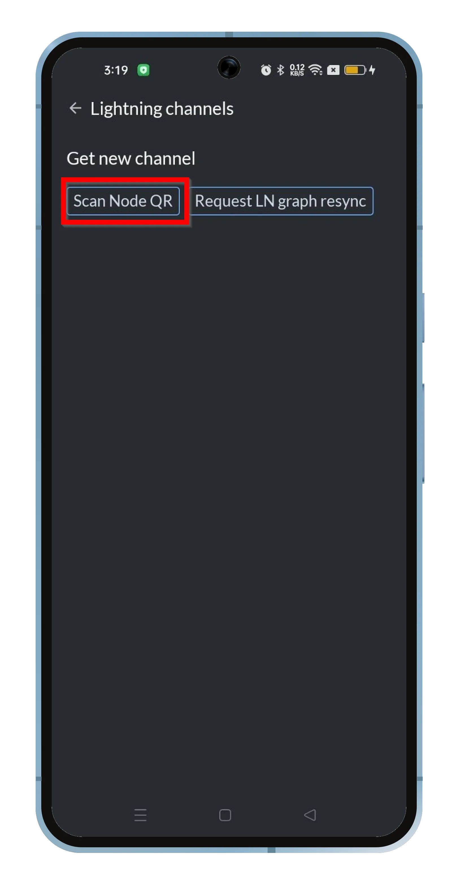

- Your phone camera will pop up (if it doesn’t pop up at the first try, tap on it again)

- Position the camera and scan the QR code image

- You’ll be taken to the next page with options to

**Request USD Fiat Channel**  
**Request Euro Fiat Channel**

As shown below

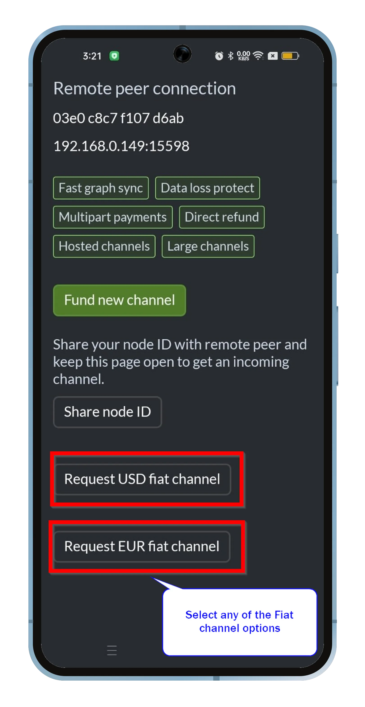

- Select any of the options above. A small info window will pop up informing you that this is a custodial solution, click **OK** to continue, as shown below

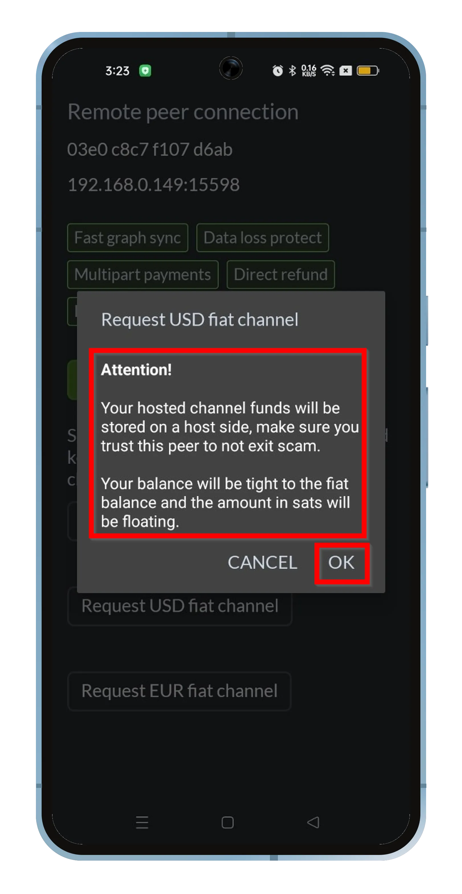

- The channel will automatically be opened and you’ll see a third light-green card on the home page labeled **USD** or **EURO** depending on the channel type you opened, that is the Fiat channel open right there, ready for you to start sending and receiving sats.

As shown below

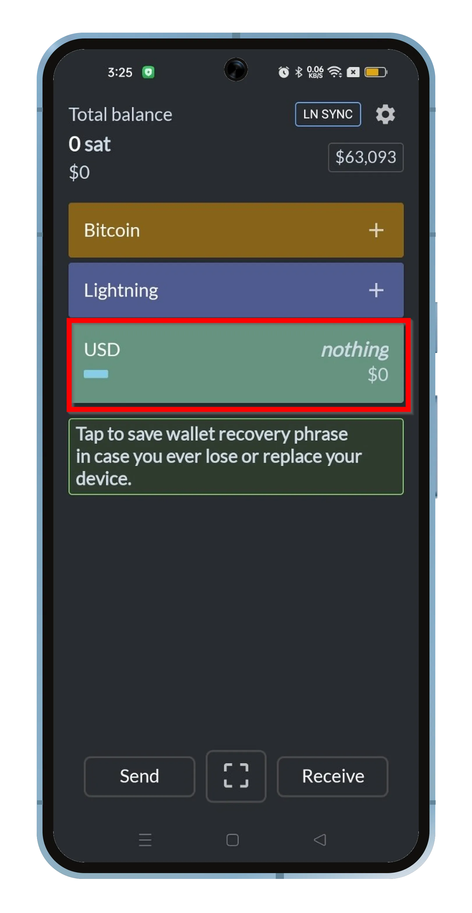

***- Click on that light-green card to view detailed information about the Fiat channel***

***- Here's detailed information about the Fiat channel. (attach link to previous tutorial)***

- On your Host machine, confirm that the peer (**Valet**) is connected, run the following command:

**Linux:**

`curl -s -u :eclairapi -X POST http://127.0.0.1:15599/peers | jq`

It should display Valet's nodeId with a "CONNECTED" status as shown below. Also take note of the “peer nodeId”: Valet must be open or at most minimized in order to see this result. If you close Valet, the command will return an empty field

Take note of the nodeId, we’ll be needing it in the next few steps for indepth inspection of the node / channel

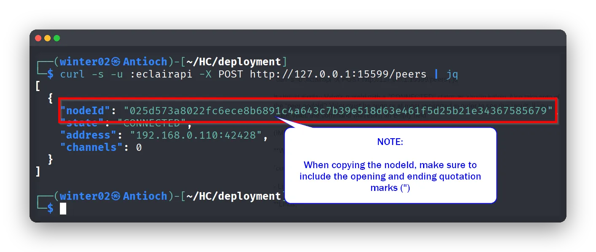

**Windows:**

`curl.exe -s -u :eclairapi -X POST http://127.0.0.1:15599/peers | jq`

- List the hosted / fiat channel and other channels connected to the Host node

**Linux:**

`curl -s -u :eclairapi -X POST http://127.0.0.1:15599/fc-all | jq`

This will print a long JSON list of all hosted channels and other channels connected to the host. This is where your fiat channel with Valet appears, showing the remote nodeId, balances and channel state as shown below.

Local nodeId = Host node ID  
Remote nodeId = Valet’s node ID

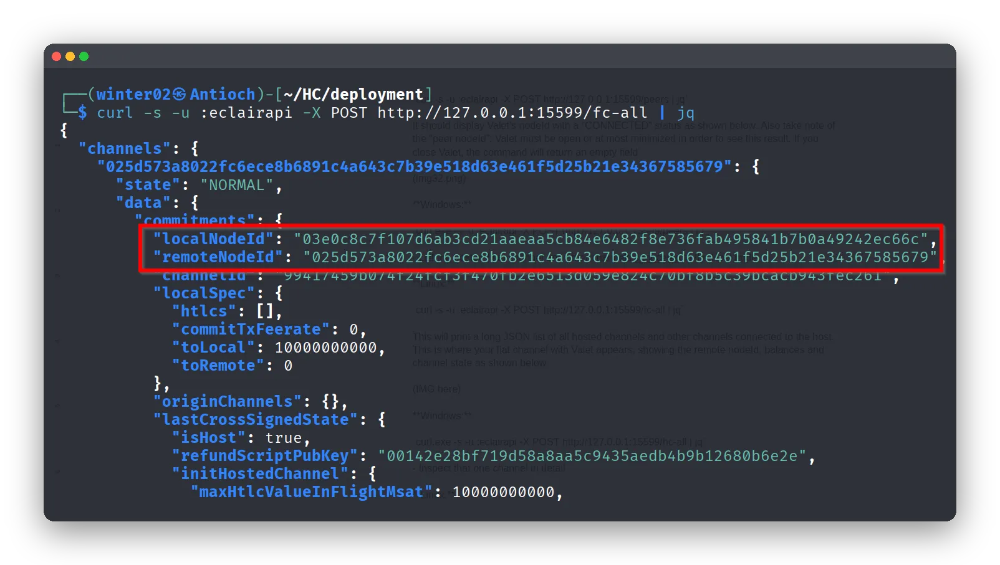

**Windows:**

`curl.exe -s -u :eclairapi -X POST http://127.0.0.1:15599/fc-all | jq`

- Further inspect that one channel in detail

**Linux:**

`curl -s -u :eclairapi -X POST http://127.0.0.1:15599/fc-findbyremoteid -d nodeId=<VALET_NODEID> -d ticker=USD | jq` ✅

This outputs: the full state of the single hosted channel with that peer, balances, capacity, and (for a fiat channel) the fiat-tracking fields. (Replace <VALET_NODEID> with the actual Valet nodeId you noted in the above step)

**Windows:**

`curl.exe -s -u :eclairapi -X POST http://127.0.0.1:15599/fc-findbyremoteid -d nodeId=<VALET_NODEID> -d ticker=USD | jq`

## Testing a Normal Lightning Channel (OPTIONAL)

This step is optional since we have completed the main goal of this tutorial, which is to “Set up and test out the Hosted / Fiat channel Host and Client Stack”

In this step, we’ll try to test out the actual functionality of Fiat channels by:

1. Opening normal eclair node (already running based on our settings above.  
2. Sending regtest bitcoins from this second node to our Fiat channel  
3. Verifying that we were able to receive Bitcoin on Fiat channels and seeing the actual behaviour of Fiat channels

### Opening Normal Eclair Node

A second, normal eclair node (`eclair2`, already in the compose) lets us prove real payments this setup.  
We’ll confirm that it is up and running and then fetch its ID and note it

👉 Follow the steps below

- In the root location of the `deployment` directory / folder, run command:

**Linux:**

`curl -s -u "":"eclairapi" -X POST http://127.0.0.1:15601/getinfo`

This would print a compacted JSON info bearing the nodeId and several other information about the node as shown below:

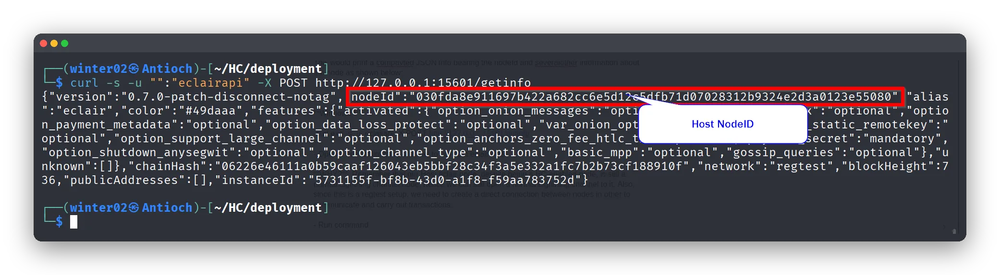

**Windows:**

`curl.exe -s -u :eclairapi -X POST http://127.0.0.1:15601/getinfo`

- Now, first we open a normal lightning channel to our Host eclair node:

**WHY?**: Remember that our Host eclair node, despite being a HC-enabled node, is still a normal Lightning channel node, hence we can still open a normal Lightning channel to it.  
Also, since this is a regtest setup, we need to create a direct connection between nodes in other to communicate and carry out transactions.

- Get the Host Node_Id and note it down

Run command:

**Linux:**

`curl -s -u :eclairapi -X POST http://127.0.0.1:15599/getinfo | jq -r .nodeId`

**Windows:**

`curl.exe -s -u :eclairapi -X POST http://127.0.0.1:15599/getinfo | jq -r .nodeId`

- Connect our second Eclair node to the Host eclair node

Run command

**Linux:**

`curl -s -u "":"eclairapi" -X POST http://127.0.0.1:15601/connect -d uri=<HOST_NODEID>@eclair:15598`

(Replace HOST_NODEID with the actual node ID of our host node which you printed above)

**Windows:**

`curl.exe -s -u :eclairapi -X POST http://127.0.0.1:15601/connect -d uri=<HOST_NODEID>@eclair:15598`

- Verify that the connection is up and running

**Linux:**

`curl -s -u :eclairapi -X POST http://127.0.0.1:15601/peers | jq`

When you run this, you should see two connected nodes, and this is because your Valet is also connected.

**Windows:**

`curl.exe -s -u :eclairapi -X POST http://127.0.0.1:15601/peers | jq`

- Open a 1,000,000 Sat channel between the second eclair node and the Host node

Run command:

**Linux:**

`curl -s -u "":"eclairapi" -X POST http://127.0.0.1:15601/open -d nodeId=<HOST_NODEID> -d fundingSatoshis=1000000`

Remember to replace <HOST_NODEID> with the actual node host node ID value

**Windows:**

`curl.exe -s -u :eclairapi -X POST http://127.0.0.1:15601/open -d nodeId=<HOST_NODEID> -d fundingSatoshis=1000000`

- Confirm the channel open

**Linux:**

`docker compose exec bitcoind bitcoin-cli -regtest -rpcuser=bitcoin -rpcpassword=bitcoin -generate 6`

`curl -s -u :eclairapi -X POST http://127.0.0.1:15601/channels | jq '.[].state'`

State output should show “NORMAL” as shown below

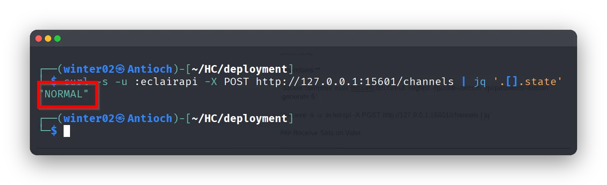

**Windows:**

`docker compose exec bitcoind bitcoin-cli -regtest -rpcuser=bitcoin -rpcpassword=bitcoin -generate 6`

`curl.exe -s -u :eclairapi -X POST http://127.0.0.1:15601/channels | jq`

### Receive Sats on Valet

Now let us receive Sats to Valet and confirm that this whole setup works just as intended.

👉 Follow the steps below

- In Valet homepage, click on the purple card labeled **Lightning** or the light-green card labeled **USD**, it’d take you to the next page as shown below

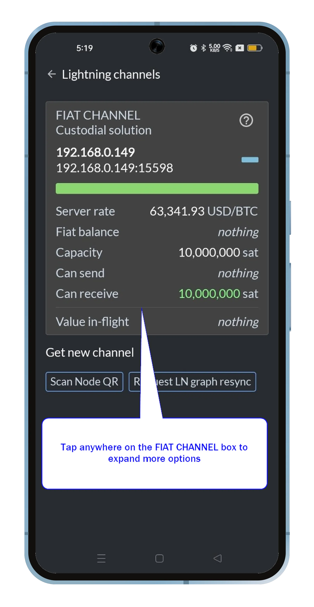

- Tap anywhere on the **Fiat Channel** box

- Select the **Receive to Channel** option as shown below

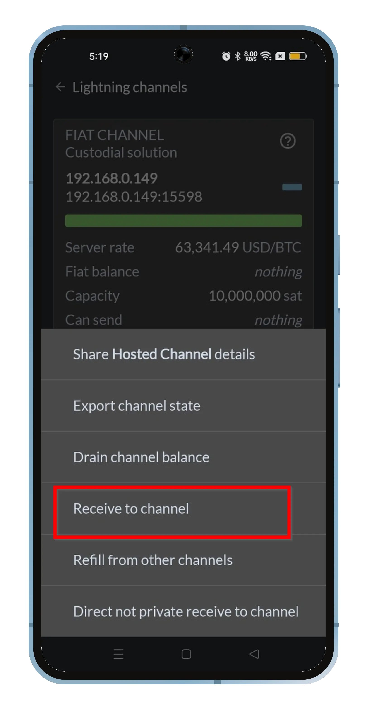

- Fill in the amount in the **USD** field (it'd be automatically pre-filled in Sats below it) and click **OK**, as shown below

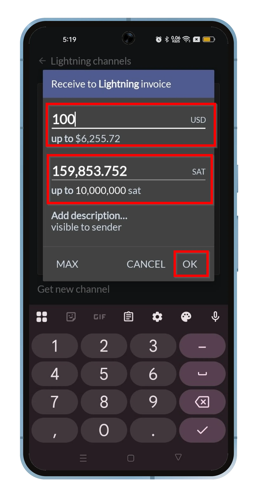

- An invoice will be generated in the form of a QR code. Select **Copy** to copy the invoice as shown below

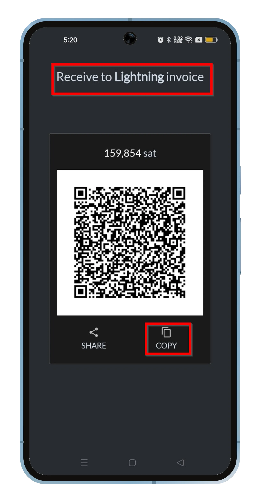

- Get the copied invoice over to your Host machine because we’ll use it to create a payment. The easiest way to do this is to paste the copied invoice in your email on your phone as a draft message, then log into the same email account on your PC (Host machine), open the drafted email and copy the invoice

**NB:** The invoice is a long string of characters, and trying to type it out would most likely lead to missing out one or two characters which will ultimately cause an error.

The email method I suggested above is the safest and easiest way to transfer file or data from your mobile device to your PC.

- Now, we have the invoice on your Host machine and can copy it. Let us pay the invoice with the command below:

**Linux:**

`curl -s -u "":"eclairapi" -X POST http://127.0.0.1:15601/payinvoice -d invoice=<LNBCRT_INVOICE>`

Replace <LNBCRT_INVOICE> with the invoice you generated from Valet, and make sure to keep Valet open or minimized while making the payment.

**Windows:**

`curl.exe -s -u :eclairapi -X POST http://127.0.0.1:15601/payinvoice -d invoice=<LNBCRT_INVOICE>`

- Now open Valet on your phone and look at the light-blue colored card, labeled **USD**, the balance on that card will increase, and you’ll also see an approved **Lightning Payment** transaction as shown below:

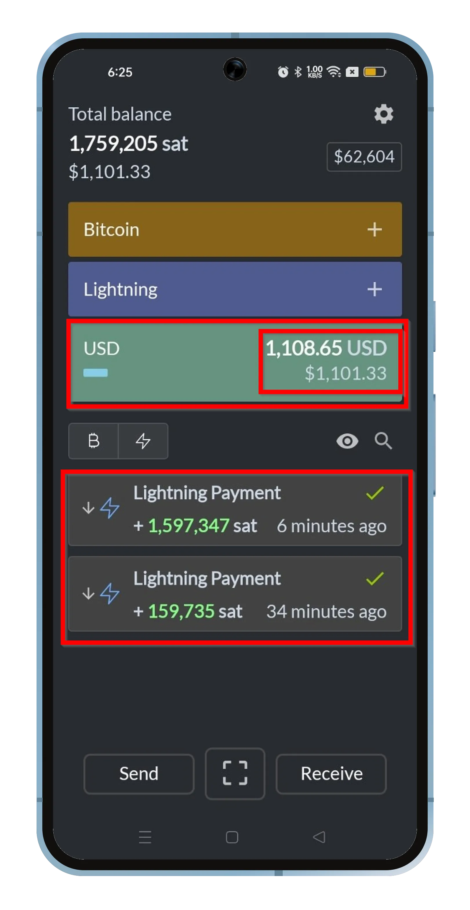

- Notice that the value is denominated in Dollars and not in Sats. This is exactly as a result of what Fiat channels was designed to do. They were designed to preserve the stable Fiat value of any Sats received on this channel. 

So, as soon as a user receives Sats on Fiat channel, the **Fiat value** as at when the sats were received are locked in, while the **Sats volume** fluctuates following Bitcoin’s price.

So, at any point, the user can send out of that channel, Sats worth their locked in Fiat balance. Let us verify this.

- On valet homepage, click on the **USD card**, on the next page, we’ll see a bigger card or box labeled **FIAT CHANNEL**, with an indication that it is a custodial solution as shown below:

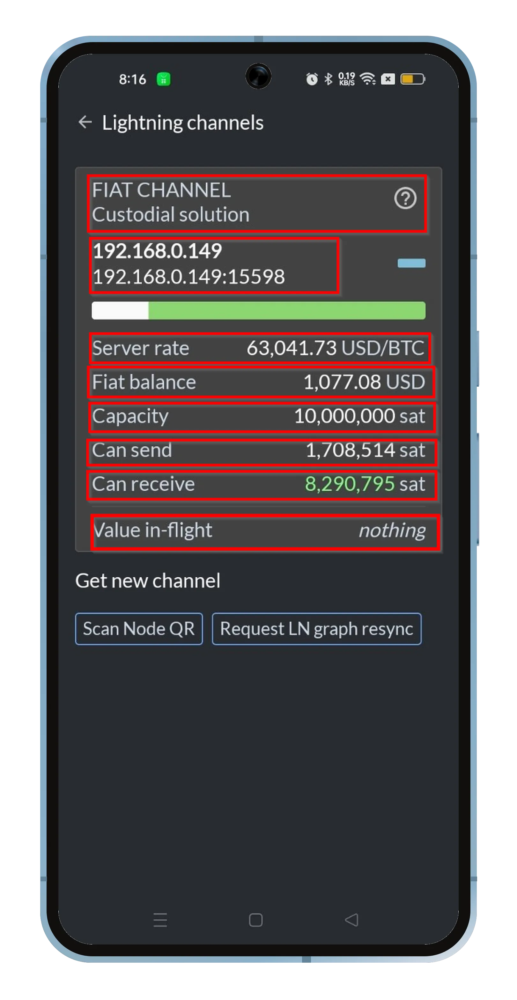

Now let us examine the fields on that box

1. **Title:** This is the first field named “FIAT CHANNEL”, which also indicates that this is a custodial solution

2. **Host IP / Port:** The field below the title boldly displays the IP address and port of the Host (This is the Host node's address and P2P port, the same <nodeId>@<HOST_IP>:15598 we scanned via QR to open the channel). It should look to this: **192.168.0.149:15598**

3. **Server Rate:** This is the current Bitcoin market price as offered by the host. It may be slightly lower than the prevalent market price because the Host may add a small margin to this.

4. **Fiat Balance:** This is your stable Fiat Value. Again, this value is locked in as soon as you receive Sats on your channel.

5. **Capacity:** This is the total capacity of this channel, designated in Sats. Again, the host determines, and it means that the channel can only manage that particular volume of sats (no matter what the Fiat value is)

6. **Can Send:** This field is equally designated in Sats. When you pay close attention to this field, you’ll notice that it fluctuates based on Bitcoin price because at each point, the value here represents the Sats worth of your locked USD or EUR Fiat balance.

7. **Can Receive:** This field is also designated in sats, and it also fluctuates, but it often reflects the difference between the channel capacity and the Sats value in the **Can Send** field.

8. **Value in Flight:** This field will always show “nothing”. You only get to see a value here when you’re sending or receiving Sats to the channel and for one reason or the other,the sats hasn’t left your channel, or hasn’t entered successfully.

### Sending Payments From Valet To Eclair Node2

Let us do a final demonstration to confirm that we can as well send out payments from Valet to normal Lightning nodes (e.g our second eclair node)

👉 Follow the steps below

- Generate a 100k Sats invoice from the second eclair node. Run command:

**Linux:**

`curl -s -u :eclairapi -X POST http://127.0.0.1:15601/createinvoice -d amountMsat=100000000 --data-urlencode "description=from valet" | jq -r .serialized`

**Windows:**

`curl.exe -s -u :eclairapi -X POST http://127.0.0.1:15601/createinvoice -d amountMsat=100000000 --data-urlencode "description=from valet" | jq -r .serialized`

- Copy the invoice, open Valet and on the homepage click on **Send**

- Paste the invoice and click **OK** as shown below

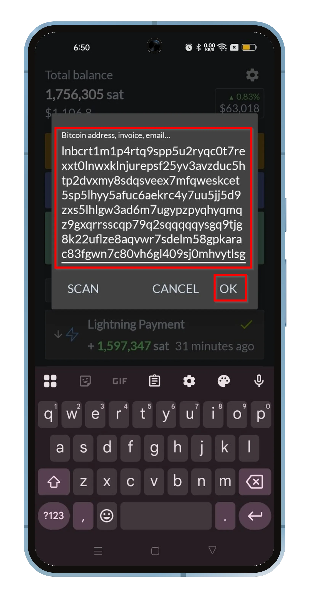

- Another window will pop up showing you the amount associated with the invoice (you can edit it if you want). Then click **OK** as shown below

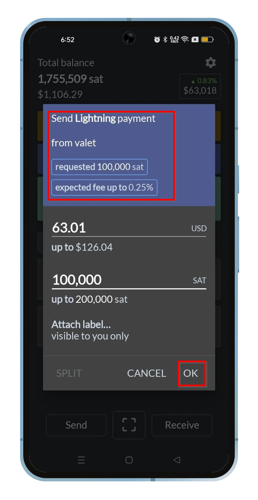

- “LN SYNC” Error pop up (as shown below)

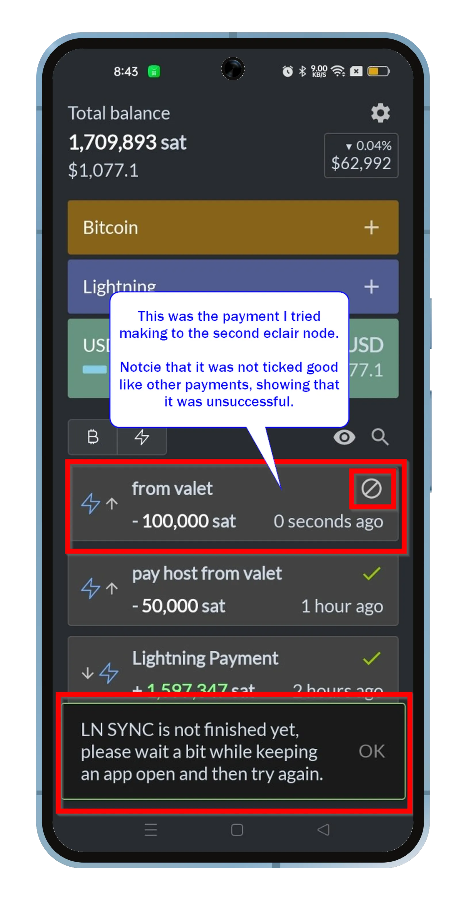

**WHY IS THE ERROR?** 🤔

The error is happening as a result of a fundamental limitation of the regtest Valet build. "LN SYNC is not finished yet" means Valet hasn't synced the **Lightning network graph (channel gossip)**.

This happens for two reasons working together:

1. The regtest Valet builds ships with no LN sync nodes (syncNodes is empty), so it has no gossip source to build a routing graph from.

2. Our second eclair node is not a direct channel peer of Valet, so reaching it requires that graph.

So, with no graph and no direct channel to the destination, Valet can't find a route, hence the error. (In layman's terms: it has no map of how to reach nodes it isn't directly connected to.)

However, if you instead opened a direct channel from Valet to the second eclair node, sending would work even on regtest, because paying a direct peer is a single hop that doesn't need the routing graph. The graph is only needed to reach nodes you're not directly connected to.

TestNet4, Signet, and mainnet all define real sync nodes, so the graph syncs and routing works there. The empty-sync-nodes limitation is genuinely **regtest-only.**

### Summary

> We have been able to test the Hosted / Fiat channel stack in a local regtest setup, consolidating the fact that the logic works and the infrastructure is real.

With this illustrations, anyone can now spin up an eclair node and run the Hosted/ Fiat channels plugins on it, and become a Host for anyone to connect to the.

It is important to note that the difference between a **Fiat channel** and a normal **Hosted channel** is the Fiat value lock-in that happens on Fiat channels. **The stability of such Fiat values MUST be enforced by the Host through a Hedging mechanism**.

The protocol provides the framework to achieve this, but in the Host backend, a Host must hedge every client's Bitcoin / Fiat exposure to ensure that at all time, he’s able to fulfil the promise of stability to the client.  
Hosts can source or develop hedging mechanisms by themselves for this purpose.

On the other hand, normal Hosted channels do not require any hedging mechanism, hence, anyone can simply run a node, and serve as a Host.

This technology is particularly invaluable to Bitcoin and Lightning network adoption, as it ensures easy, cost effective onboarding on the Lightning network, making it attractive for users who may not have the Liquidity to outrightly open normal Lightning channels.

Standard Sats, the small three-man team currently maintaining this project, is actively researching on ways to mitigate the custodial challenges of the Hosted channel technology. They’re exploring an interconnected Hosted channels Host network which would be known as **CABINETTED HOSTS**

The Concept of *Cabinetted Hosts* seeks to explore a network where Host nodes are interconnected, helping to checkmate each other from performing an *exit scam* on the clients connected to them.

This research is in progress, and the team will be glad to welcome anyone who want to contribute to this project in any capacity, please feel free to join the Telegram community here (add link)

## Adapting This Stack To Testnet / Mainnet

> This section documents what changes when you move the host stack off **regtest** The results are expected to be identical, however the setup (especially configurations) changes. 

In all the steps, we’ll mostly refer to testnet (identical with mainnet except for the default bitcoin ports which are different.), highlighting what needs to be changed or removed in the different configuration files.

So far, our regtest stack proves that the logic works, and that the infrastructure is functional, so by moving over to Testnet, our goal is to prove the stack in real-world conditions (without still risking any economic value). 

With Testnet, we’ll be able to verify public reachability, real node funding timing and transaction confirmation, live price feed, wallet connection over the internet and several other things.

### File → `.env`

**Regtest version:**

```  
DB_USER=hc_user  
DB_PASSWORD=hc_password  
DB_NAME=hc  
NBITCOIN_NETWORK=regtest  
```

**Testnet/Mainnet version:**

```  
DB_USER=<strong_unique_username>  
DB_PASSWORD=<strong_random_secret>  
DB_NAME=hc  
NBITCOIN_NETWORK=testnet        # mainnet  
```

**Implication:**

- **NBITCOIN_NETWORK:** This field tells bitcoind the network we are operating on. So, changing it from regtest to tesnet/mainnet moves the whole stack off the local sandbox onto a **real, open network**. Bitcoind starts syncing the real chain (testnet and mainnet blockchains each run into hundreds of GB in size), and you no longer manually mine your own blocks.

- **`DB_USER` / `DB_PASSWORD`:** This field sets real login credentials for Postgres. For regtest which is largely local development mode, default passwords are fine; however, on an internet-reachable host, a weak password is an attack path to your channel data.

**NOTE:** This database login change in the `.env` file must also be changed exactly in other relevant files like the `config/fc.conf` and `config/hc.conf`files, else the eclair plugins can't log into Postgres and hence an error.

- **`DB_NAME`:** This field stays unchanged as `hc`.

### File → `docker-compose.yaml`

- **Change 1** =  bitcoind healthcheck

**Location on file:** = line 33 (⚠️ critical)  
**Regtest version:**

```  
test: ["CMD-SHELL", "bitcoin-cli -regtest -rpcuser=bitcoin -rpcpassword=bitcoin getblockchaininfo 2>/dev/null | grep -q '\"initialblockdownload\": *false'"]  
```

**Testnet/Mainnet version:**

```  
test: ["CMD-SHELL", "bitcoin-cli -testnet -rpcuser=<strong_rpc_user> -rpcpassword=<strong_rpc_secret> getblockchaininfo 2>/dev/null | grep -q '\"initialblockdownload\": *false'"]  
```

**Implication:** The flag is hardcoded `-regtest`, so if we don't change it, `bitcoin-cli` call fails forever, and **eclair (which depends on `service_healthy` status of bitcoind to start) never starts. On testnet/mainnet "healthy" status now means "fully synced," so eclair correctly waits for the whole IBD.

- **Change 2** = bitcoind args (Remove the regtest fee hack)

**Location on file** = lines 24–25  
**Regtest version:**

```  
        # Regtest has no mempool-based fee estimation; provide a fallback  
        fallbackfee=0.0001  
```

**Testnet/Mainnet version:**

We completely delete both lines

**Implication:** `fallbackfee` exists only because regtest has no fee market. On a synced testnet/mainnet, node real fee estimation works; so,leaving a hardcoded fallback can misprice transactions.

- **Change 3** = bitcoind args (tighten RPC exposure + real creds)

**Location on file** =  lines 15–17, and line 26  
**Regtest version:**

```  
        rpcallowip=0.0.0.0/0  
        rpcuser=bitcoin  
        rpcpassword=bitcoin  
        ...  
        whitelist=0.0.0.0/0  
```

**Testnet/Mainnet version:**

```  
        rpcallowip=172.20.0.0/16  
        rpcuser=<strong_rpc_user>  
        rpcpassword=<strong_rpc_secret>  
        ...  
        whitelist=172.20.0.0/16  
```

**Implication:**For an isolated local network like regtest, "Allow from anywhere" is fine, but dangerous on an internet-reachable host running on regtest/mainnet. So, restricting to the Docker subnet still lets eclair/electrs reach bitcoind while refusing outsiders.  
So we should replace the `bitcoin:bitcoin` default `rpcuser:rpcpassword credentials with stronger credentials.

**NOTE:** Whatever credentials we use here for the rpcuser/rpcpass should be used in their respective fields in the healthcheck (Change 1) above. This is also applicable in the eclair `JAVA_OPTS` (Change 5), eclair2, the generator, and `electrs.toml` file. In fact, the credentials are applied anywhere there’s rpcuser/rpcpassword requirement

**NOTE:** `deprecatedrpc=warnings` (in line 19) stays only if we are keeping electrs - that is if we are running our own electrum server.

- **Change 4** = eclair (remove the binance DNS hack)

**Location on file:** lines 62–63  
**Regtest version:**

```  
    extra_hosts:  
      - "api.binance.com:54.240.186.123"  
```

**Testnet/Mainnet version:** You may keep this as a temporary workaround for testnet, but should be removed for production (mainnet.)   
This was used as a temporary workaround to bypass a DNS-blocked issue for reaching Binance to fetch Bitcoin prices. This was a country-specific related issue, so if your country bans access to exchanges like Binance, you should leave this at least for testnet.

**Implication:** This hardcoded IP was a local convenience for the fiat-channel price feed. It will go stale, and a broken/incorrect price feed means fiat channels **misprice** BTC. For mainnet, replace it with a reliable always-on BTC↔fiat source (proper DNS / VPN / alternate exchange / your own oracle).

- **Change 5** = eclair `JAVA_OPTS` 

**Location on file:** lines 73–86  
**Regtest version:**

```  
        -Dakka.loglevel=DEBUG  
        -Declair.chain=regtest  
        -Declair.server.port=15598  
        -Declair.bitcoind.host=bitcoind  
        -Declair.bitcoind.rpcport=18443  
        -Declair.bitcoind.rpcuser=bitcoin  
        -Declair.bitcoind.rpcpassword=bitcoin  
        ...  
        -Declair.api.port=15599  
        -Declair.api.password=eclairapi  
```

**Testnet/Mainnet version:**

```  
        -Dakka.loglevel=INFO  
        -Declair.chain=testnet  
        -Declair.server.port=15598  
        -Declair.server.public-ips.0=<your-public-ip-or-onion>  
        -Declair.bitcoind.host=bitcoind  
        -Declair.bitcoind.rpcport=18332          # mainnet: 8332  
        -Declair.bitcoind.rpcuser=<strong_rpc_user>  
        -Declair.bitcoind.rpcpassword=<strong_rpc_secret>  
        ...  
        -Declair.api.port=15599  
        -Declair.api.password=<strong_api_secret>  
```

**Implication (per component):**

→ **`chain` (regtest - testnet):** points eclair at the real chain; must match bitcoind.

→ **`rpcport` (18443 - 18332):** bitcoind's default RPC port differs per network (regtest uses 18443,testnet 18332, and mainnet uses 8332).

→ **`rpcuser`/`rpcpassword`:** must match the new bitcoind creds (Change 3 above).

→ **`api.password` (`eclairapi` - secret):** this password controls the node and hence can move funds. So it must be updated everywhere you call `curl -u :eclairapi …`.

→ **`public-ips` (added):** the node must advertise a reachable address so internet clients can find it. The client URI becomes `<nodeId>@<public-host-or-onion>:15598`.

→ **loglevel (DEBUG - INFO):** DEBUG floods disk and leaks detail in production.

- **Change 6** = `eclair2` service

**Location on file:** lines 99–13  
**Regtest version:** the entire `eclair2:` block.  
**Testnet/Mainnet version:** Delete the whole service, and its `eclair2_data` volume on line 204*  
**Implication:** eclair2 is a second eclair node that is being used only as the external "payer" used to prove the receive flow functionality. It is not part of an operational host, hence it can be removed. But if you require an extra node for testing, you may leave it (mostly for testnet), but then you will change `-Declair.chain=regtest` to `testnet` and its `-Declair.api.password`.

- **Change 7** = `generator` service (Remove)

**Location on file:** lines 179–192  
**Regtest version:** the entire `generator:` block.  
**Testnet/Mainnet version:** Delete the whole service  
**Implication:** It mines blocks on a loop, and this is a concept only useful on regtest. On testnet/mainnet blocks come from the network.

- **Change 8** = stop publishing admin/DB ports publicly

**Location on file:** lines 88–89, 142, 170  
**Regtest version:**

```  
  eclair:    ports: - "15599:15599"  
  postgres:  ports: - "5432:5432"  
  pgadmin:   ports: - "5050:80"  
```

**Testnet/Mainnet version:**

```  
  eclair:    ports: - "127.0.0.1:15599:15599"  
  postgres:  ports: - "127.0.0.1:5432:5432"  
  pgadmin:   ports: - "127.0.0.1:5050:80"   # or remove pgadmin entirely  
```

**Implication:** Lightning P2P (`15598` in line 88) must stay public so that clients can connect. But the eclair **API** (`15599`), Postgres (`5432`), and pgadmin (`5050`) are admin surfaces, so exposing them publicly is a direct compromise risk. They should be bound to localhost (reach via SSH tunnel/VPN). Consider removing `pgadmin` altogether in production (mainnet).

### File → `config/electrs.toml`

> On testnet/mainnet, **public Electrum servers exist**, so the host doesn't need to run electrs, and clients can use a public one.  
For testnet or a production (mainnet) host you can delete this file, and also delete it’s reference point in the `docker-compose.yaml` file (at lines 39–54). However if you’re hosting and using your own electrum server (for privacy), apply the changes below:

**Regtest version:**

```  
network = "regtest"  
  daemon_rpc_addr = "bitcoind:18443"  
  daemon_p2p_addr = "bitcoind:18444"  
  auth = "bitcoin:bitcoin"  
```

**Testnet/Mainnet version:**

```  
network = "testnet"               
  daemon_rpc_addr = "bitcoind:18332"         # mainnet: 8332  
  daemon_p2p_addr = "bitcoind:18333"         # mainnet: 8333  
  auth = "<strong_rpc_user>:<strong_rpc_secret>"  
```

**Implication:** electrs must point at the correct network, the matching bitcoind ports, and the new RPC creds. On mainnet, indexing the full chain is heavy (lots of disk + long initial index), so only self-host if you specifically need it.

### File → `config/fc.conf`

- **Change 1** = DB credentials

Location on file:** lines 17 and 19  
**Regtest version:**

```  
      user = "hc_user"  
      password = "hc_password"  
```

**Testnet/Mainnet version:**

```  
      user = "<strong_unique_username>"  
      password = "<strong_random_secret>"  
```

**Implication:** The credentials must match what you have in the `.env`file exactly, else the fiat-channel plugin can't open its Postgres DB.

- **Change 2** = channel economics (Review)

**Location on file:** lines 29, 31 and 33  
**Regtest version:**

```  
      feeProportionalMillionths = 5000  
      cltvDeltaBlocks = 144  
      channelCapacityMsat = 10000000000 // 0.1 BTC  
```

**Testnet/Mainnet version:** You can keep this value **or** set to your real per-client values, however, capacity must stay ≥ 100,000,000 msat or the client may reject the channel

```  
      channelCapacityMsat = <your_choice_capacity_msat>  
```

**Implication:** On regtest these were just plumbing, but on mainnet `channelCapacityMsat` is the actual bitcoin you commit to back each client channel. So this is a real custody/liquidity decision.  
On the other hand, `cltvDeltaBlocks` should equal eclair's `expiry-delta-blocks`.

- **Change 3** = branding

**Location on file:** lines 47 and 57 (if you’re enabling)  
**Regtest version:**

```  
      logo = "satm.png"  
      enabled = false  
```

**Testnet/Mainnet version** (if enabling):

```  
      logo = "zap.png"       # the file actually mounted is zap.png  
      enabled = true  
```

**Implication:** The mounted file is `zap.png`, but the config says `satm.png`; enabling branding without fixing this fails to load the logo. Leave disabled if unused.

### File → `config/hc.conf`

- **Change 1** = DB credentials

**Location on file:** lines 14 and 16  
**Regtest version:**

```  
      user = "hc_user"  
      password = "hc_password"  
```

**Testnet/Mainnet version:**

```  
      user = "<strong_unique_username>"  
      password = "<strong_random_secret>"  
```

**Implication:** Same rule as in fc.conf. The credentials must match what is in the  `.env` file.

- **Change 2** = plain-hosted-channel capacity

**Location on file:** line 30  
**Regtest version:**

```  
      channelCapacityMsat = 500000  
```

**Testnet/Mainnet version:**

```  
      channelCapacityMsat = <your_real_capacity_msat>  
```  
**Implication:** `500000` msat (500 sat) was fine for local tests but is a tiny real limit. On mainnet this is the actual capacity offered for plain hosted channels. It should be set to a real and reasonable operational value.

- **Change 3** = branding (only if enabling)

**Location on file:** lines 55 and 65

Same as in fc.conf: `logo = "zap.png"` and `enabled = true`.

- **Change 4** = remove the test-only DB blocks

**Location on file:** lines 83–121  
**Regtest version:** the `aliceRelationalDb { … }` and `bobRelationalDb { … }` blocks (localhost, `postgres/postgres`).  
**Testnet/Mainnet version:** Delete both blocks  
**Implication:** They exist only for the plugin's internal testing and ship default credentials. Unused in normal operation; remove them for a clean production config.

### File → `config/alarmbot.conf`

> This is usually useful for Fiat channels and it is an alarmbot for Telegram and hedging alerting. Otherwise leave as-is (disabled).

**Regtest version:**

```  
    botApiKey = ""  
    chatId = ""  
    hedgeServiceUri = "http://192.168.2.6:10001/api"  
    hedgeNotify = false  
```

**Testnet/Mainnet version (if enabling):**

```  
    botApiKey = "<your_telegram_bot_api_key>"  
    chatId = "<your_telegram_chat_id>"  
    hedgeServiceUri = "<your_real_hedge_service_uri>"  
    hedgeNotify = true  
```

**Implication:** Current values are empty/stale (`192.168.2.6` is a dead LAN address). Fill these with your actual creds for production monitoring; otherwise leave disabled;  the stack still runs fine without it.

## Client Side — Valet

- **Build/flavor:** The mainnet branch on Valet GitHub (link the branch) repository bakes in all four chain flavors (mainnet, tnet4, tnet3, regtest) via gradle productFlavors. So, you just pick one by running the matching assemble<Flavor><BuildType> task, same workflow as the regtest build, just a different task:

    - Regtest (what we built): You run `./gradlew assembleRegtestDebug`  
    - Testnet4: You run `./gradlew assembleTnet4Debug`  
    - Testnet3: You run `./gradlew assembleTnet3Debug`  
    - Mainnet: You run `./gradlew assembleMainnetRelease` (or you could simply install the already built version of mainnet here)

- **Electrum server:** drop the custom `… :50001` step. On testnet/mainnet Valet uses a **public** Electrum server.

- **Node URI:** Clients will now reach your node over the internet, so the QR carries your **public address**: `<nodeId>@<public-host-or-onion>:15598`.

- **Sending works:** Unlike in regtest where we had empty `syncNodes`, the testnet/mainnet builds ship **real LN sync nodes**, so the routing graph syncs and Valet can **send** to any node, not just direct peers.

## Big Reminder!!

Credentials must be consistent since several secrets/ login values repeat across different files. So whenever a change is made to a credential, ensure that it is replicated across every relevant file where it is referenced.

Below is a table summary of important credentials and files where they are referenced.

| SECRETE | EVERY PLACE IT APPEARS |
| :---- | :---- |
| Bitcoind rpcuser / rpcpassword | Docker-compose.yaml, eclair2 and config/electrs.toml |
| DB user/ pass | .env, config/fc.conf, and config/hc.conf |
| eclair API password | docker-compose.yaml, eclair2, all curl -u :eclairapi….. commands |

## Conclusion and Thanks

If you have read to this point, you are now well equipped to run the Hosted / Fiat Channel stack and start providing Host services to users.

Remember, Fiat channels require a **hedging mechanism** in order to ensure that the stable value promise to the client is always satisfied. The recommended ratio for hedging is 1:1, which suggests that for every client's Fiat value exposure, the host must have a hedge position of the equivalent Fiat amount in Bitcoin. Hosts are encouraged to develop their own hedging algorithms, however, Standard Sats already has a hedging mechanism that may be proprietary and might require a payment to use it.

The Hosted channel protocol stack and the Valet Bitcoin wallet are both open sourced projects licensed under the Apache 2.0 license. The Standard Sats team are very happy to welcome thought experts, developers and interested persons to contribute to this project, as this is progressively being developed. 

You may join the Standard Sats community on telegram here. Feel free to check out the project with the links below:

Hosted Channel RFC:  
Fiat Channels RFC  
Valet Bitcoin Wallet:  
IMMORTAN Library: 

Thank you and “may the Bitcoin be with you!!”
