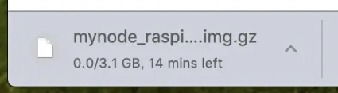
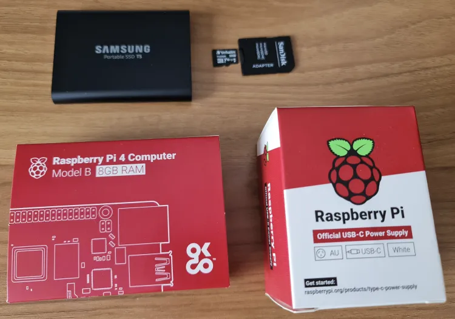
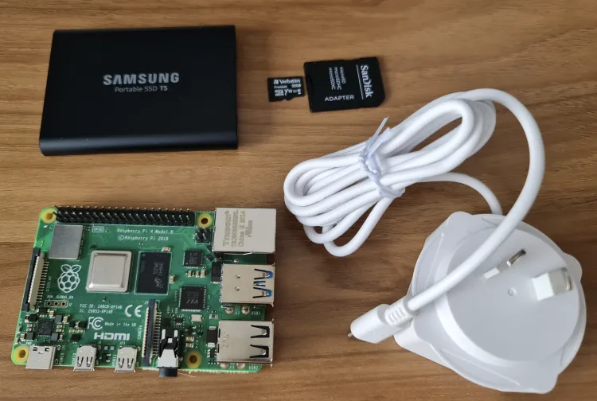
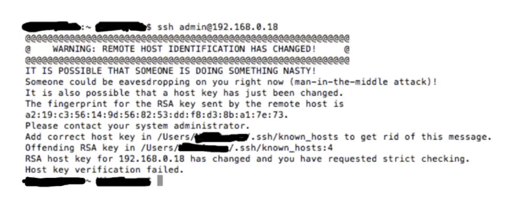

https://mynodebtc.com/

BitcoinとLightningノードを実行する最も簡単で強力な方法！私たちは最高のオープンソースソフトウェアと私たちのインターフェース、管理、サポートを組み合わせて、BitcoinとLightningを簡単に、プライベートに、安全に使用できるようにします。

## ノードセットアップの種類

さまざまなノードセットアップがあります。MyNodeは優れています。それには多くのアプリが付属しており、プレミアムバージョンに支払いをするとさらに多くのアプリが利用できます。それ以外では、それらのアプリをすべて自分でダウンロードするのは非常に面倒です。MyNodeは、これから見るように、かなり簡単にします。

代替案であり類似したオプションにRaspiBlitzがあります。GUIはそれほど良くなく、アプリはMyNodeに付属するアプリと多くが重複していますが、RaspiBlitzは無料のオープンソースソフトウェア（FOSS）であり、MyNodeはそうではありません。もう一つの違いは、MyNodeがDockerコンテナ内で実行されることです。私はDockerを扱うことが難しく、トラブルシューティングが困難だと感じています。これは、エラーやバグに遭遇した場合にのみ問題となります。開発者はプレミアムユーザーに対してサポートを提供し、Telegramチャットグループもあります。

RaspiBlitzは、DockerなしでLinuxに複数のプログラムがインストールされています。Bitcoin Coreを搭載した別のLinuxマシンに外部ハードドライブを簡単に接続でき、必要に応じてすぐに使用できます。

別のオプションは、オペレーティングシステムにBitcoin CoreとElectrum Serverのバリエーション（いくつかあります）を単にインストールすることです。Linux（Raspberry Pi）、Mac、Windows用のガイドがあります。

## 買い物リスト

- Raspberry Pi 4、メモリ4Gbまたは8Gb（4Gbで十分です）

- 公式Raspberry Pi電源（非常に重要！汎用品を購入しないでください、本当に）

- Pi用のケース。FLIRCケースは素晴らしいです。ケース全体がヒートシンクであり、ファンは不要で、騒音が発生することがありません

- 16 GbのmicroSDカード（1枚必要ですが、いくつかあると便利です）

- メモリーカードリーダー（ほとんどのコンピューターにはmicroSDカード用のスロットがありません）。

- 外付けSSD 1Tbハードドライブ。
  注：SSDは重要です。安価だからといってポータブル外付けハードドライブを使用しないでください

- 自宅のルーターに接続するためのイーサネットケーブル

- モニターは必要ありません

## MyNodeイメージのダウンロード

MyNodeウェブサイトへ移動 リンク


<今すぐダウンロード>をクリック

Raspberry Pi 4バージョンをダウンロード：


大きなファイルです：



SHA 256ハッシュをダウンロード


MacまたはLinuxでターミナルを開くか、Windowsでコマンドプロンプトを開きます。タイプ：

```bash
shasum -a 256 DOWNLOADEDFILENAME # <--- Mac/Linux
certUtil -hashfile DOWNLOADEDFILENAME SHA256 # <--- Windows
```

コンピューターは20秒ほど考えます。その後、出力されたハッシュファイルが前のステップでウェブサイトからダウンロードしたものと同一であるかを確認します。同一であれば、進むことができます。
SDカードにフラッシュ

## Balena Etcherをダウンロードしてインストールします。リンク

これのデジタル署名を見つけることができませんでした。方法を知っている方は教えてください。そうすれば、この記事を更新します。

Etcherは使い方が自己説明的です。micro SDカードを挿入し、Raspberry Piソフトウェア（.imgファイル）をSDカードにフラッシュします。


一度完了すると、ドライブはもう読み取り可能ではありません。オペレーティングシステムからエラーが出ることがあり、ドライブはデスクトップから消えるはずです。カードを抜いてください。

## Piを設定し、SDカードを挿入する

パーツ（ケースは表示されていません）：




イーサネットケーブルとハードドライブのUSBコネクター（まだ電源は接続しない）を接続します。中央の青色のUSBポートには接続しないでください。それらはUSB 3です。MyNodeは、ドライブがUSB 3に対応していても、USB 2ポートの使用を推奨しています。


micro SDカードはここに入ります：


最後に、電源を接続します：


## PiのIPアドレスを見つける

MyNodeを使用する場合、モニターは必要ありません。しかし、自宅のネットワークに別のコンピューターが必要です。もしPiがイーサネットに接続されておらず、WiFiに頼りたい場合、IPを見つけるには高度なコンピュータースキルが必要です。申し訳ありませんが、お手伝いできません。イーサネット接続が必要です。（問題は、WiFiに接続してパスワードを入力するためにモニターとオペレーティングシステムへのアクセスが必要になることです）。

ルーターをチェックし、接続されているすべてのデバイスのIPのリストを確認します。

私はブラウザに192.168.0.1と入力しました（私のルーターに付属の指示）、ログインし、IP 192.168.0.18で「MyNode」というデバイスを見ることができました。これらのIPアドレスはインターネットに公開されているわけではなく（まずルーターを通過します）、自宅のネットワーク上のデバイスの識別子に過ぎません。

IPを見つけることは重要です。

> 更新：MacやLinuxマシンのターミナルを使用して、「arp -a」コマンドで自宅のネットワークにイーサネット接続されているすべてのデバイスのIPアドレスを見つけることができます。出力はルーターが表示するものほどきれいではありませんが、必要な情報はすべてそこにあります。どれがPiか明らかでない場合は、試行錯誤を行ってください。

## PiにSSHでログインする

SSHコマンドでリモートからデバイスにログインするオプションがありますが、必須ではありません（RaspiBlitz Nodeの場合は必須です）。とはいえ、非常に便利なので、方法をお見せします。

MacまたはLinuxコンピューターを開き（Windowsの場合は、SSHツールのputtyをダウンロードしてください）次のように入力します：

```bash
ssh admin@192.168.0.18
```

自分のIPアドレスを使用してください。MyNodeデバイスのユーザー名はデフォルトで「admin」です。パスワードはデフォルトで「bolt」です。

以前にPiを使用し、micro SDカードを入れ替えた場合、このエラーが表示されます：



「known_hosts」ファイルがある場所に移動して削除する必要があります。安全に削除できます。エラーメッセージにパスが表示されます。私の場合は /Users/MyUserName/.ssh/ でした。

sshの前の「.」を忘れないでください。これは隠しディレクトリであることを示します。

その後、もう一度sshコマンドを試してください。

今回はこの出力が表示されます：


削除したファイルが削除され、新しいフィンガープリントを追加しています。yesと入力して<enter>を押します。

パスワードの入力を求められます。それは「bolt」です。
MyNode Piにモニターなしでターミナルアクセスができるようになり、すべてがスムーズにロードされたことを確認できました。

## ウェブブラウザ経由でのアクセス

ブラウザを開きます。自宅のネットワーク上のコンピュータである必要があり、外部からは行えません。方法はありますが、難しいです。私はテストしていません。

ブラウザのアドレスウィンドウにIPアドレスを入力します。すると、これが表示されます：

パスワード「bolt」を入力してください - 後で変更してください。

すると、これが表示されます：

ドライブのフォーマットを選択します

ここで待ちます。

いずれ、製品キーを入力するか、無料の「コミュニティエディション」を使用するかを尋ねられます — プレミアムエディションを紹介します。可能であればプレミアムバージョンの購入をお勧めします、非常に価値があります。

ダウンロードされるブロックの進行状況が表示されます。数日かかります：

ダウンロード中に機械を切っても大丈夫です。設定に行って、機械の電源を切るボタンを見つけてください。コードを引っ張ってはいけません、インストールやハードドライブが破損する可能性があります。

早めに、「設定」に行ってquicksyncを無効にしてください。初期ブロックのダウンロードが最初から始まります。

ガイドの作成を進めたかったので、こちらは事前に準備した別のMyNodeです。ブロックチェーンが同期され、いくつかの「アプリ」が有効にされ同期されたときのページの見た目です：

Electrumサーバーも同期する必要があるので、Bitcoin Blockchainが同期されたら、そのプロセスを開始するボタンをクリックしてください - 1日または2日かかります。他のすべては、有効にするを選択すると数分で有効になります。クリックして探索できます。何も壊れることはありません。もし何かが壊れたら（私の場合は安価な部品のせいだと思いますが）、再フラッシュしてダウンロードを再開する必要があります。MyNodeに問題があるのは、「再フラッシュ」が必要になると、ブロックチェーンの同期を最初からやり直さなければならないことです。これを回避する技術的な方法はありますが、簡単ではありません。

RaspiBlitzも試したい場合は、追加のSSD外付けハードドライブと、フラッシュ用の別のマイクロSDカードが必要です。それ以外は、同じ機材ですが、明らかにMyNodeとRaspiBlitzを同時に実行することはできません。それをやりたいなら、別のRaspberry Piを買う時です。

ノードが稼働しているので、何もせずに放置しないでください。私の記事（とビデオ）に従って、ElectrumデスクトップウォレットをElectrumサーバーおよびBitcoin Coreに接続する方法を確認してください。