名前: My Node
説明: BitcoinのMyNodeをセットアップします

# MacまたはWindowsにBitcoin Coreをインストールする

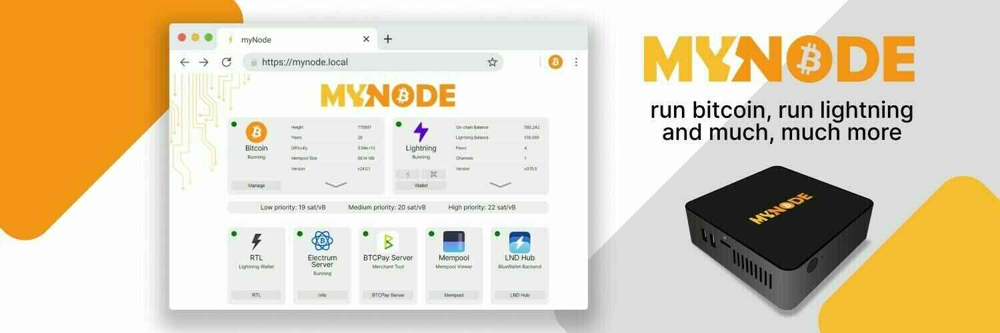

https://mynodebtc.com/

BitcoinとLightningノードを実行するための最も簡単で強力な方法です！私たちは最高のオープンソースソフトウェアを私たちのインターフェース、管理、サポートと組み合わせて、BitcoinとLightningを簡単に、プライベートに、安全に使用できるようにしています。

## ノードのセットアップの種類

さまざまなノードのセットアップがあります。MyNodeは優れています。それには多くのアプリが付属しており、プレミアムバージョンを購入すればさらに多くのアプリが利用できます。自分でそれらのアプリをすべてダウンロードするのは非常に手間がかかります。MyNodeは非常に簡単になります。

代替となる類似のオプションはRaspiBlitzです。GUIはあまり素晴らしくありませんし、アプリもMyNodeに付属しているアプリと多く重複していますが、Raspiblitzは無料のオープンソースソフトウェア（FOSS）であり、MyNodeはそうではありません。別の違いは、MyNodeがDockerコンテナで実行されることです。私はDockerが難しく、トラブルシューティングが難しいと感じています。これはエラーやバグに遭遇した場合にのみ問題となります。開発者はプレミアムユーザーに対してヘルプを提供しており、Telegramのチャットグループもあります。

RaspiBlitzはLinuxに複数のプログラムをインストールしただけのもので、Dockerは使用していません。外部ハードドライブはBitcoin Coreを搭載した別のLinuxマシンに簡単に接続できます。

別のオプションは、単にBitcoin CoreとElectrum Serverのバラエティ（いくつかあります）をオペレーティングシステムにインストールすることです。Linux（Raspberry Pi）、Mac、Windows向けのガイドがあります。

## ショッピングリスト

- Raspberry Pi 4、4GBメモリまたは8GB（4GBで十分です）

- 公式のRaspberry Pi電源（非常に重要です！ジェネリックなものは使わないでください）

- Raspberry Pi用のケース。FLIRCケースは素晴らしいです。ケース全体がヒートシンクであり、ファンは必要ありません（騒音が発生する可能性があります）

- 16GBのマイクロSDカード（1つ必要ですが、数枚あると便利です）

- メモリーカードリーダー（ほとんどのコンピュータにはマイクロSDカード用のスロットがありません）。

- 外部SSD 1TBハードドライブ。
  注意：SSDは重要です。ポータブルな外部ハードドライブは使用しないでください（安価ですが）。

- イーサネットケーブル（自宅のルーターに接続するため）

- モニターは必要ありません

## MyNodeイメージのダウンロード

MyNodeのウェブサイトリンクに移動します

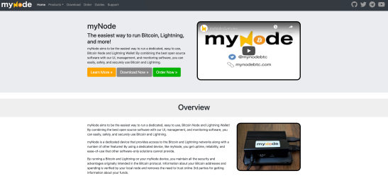

<Download Now>をクリックします

Raspberry Pi 4のバージョンをダウンロードします：

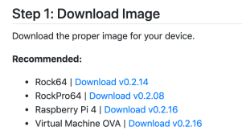

ファイルは大きいです：

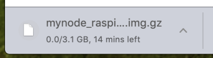

SHA 256ハッシュをダウンロードします


MacまたはLinuxのターミナル、またはWindowsのコマンドプロンプトを開きます。次のコマンドを入力します：

```bash
shasum -a 256 DOWNLOADEDFILENAME # <--- Mac/Linux
certUtil -hashfile DOWNLOADEDFILENAME SHA256 # <--- Windows
```

コンピューターは20秒ほど考えます。その後、出力ハッシュファイルが前のステップでウェブサイトからダウンロードしたものと一致するかどうかを確認します。同じであれば、続行できます。
SDカードに書き込む

## Balena Etcherをダウンロードしてインストールします。リンク

私はこれのデジタル署名を見つけることができませんでした。わかる方がいれば、教えていただければ幸いです。

Etcherの使用方法は自己説明的です。マイクロSDカードを挿入し、Raspberry Piソフトウェア（.imgファイル）をSDカードに書き込みます。


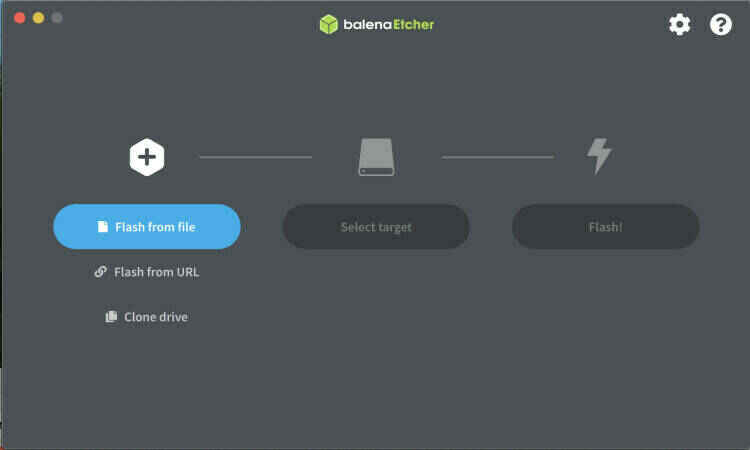
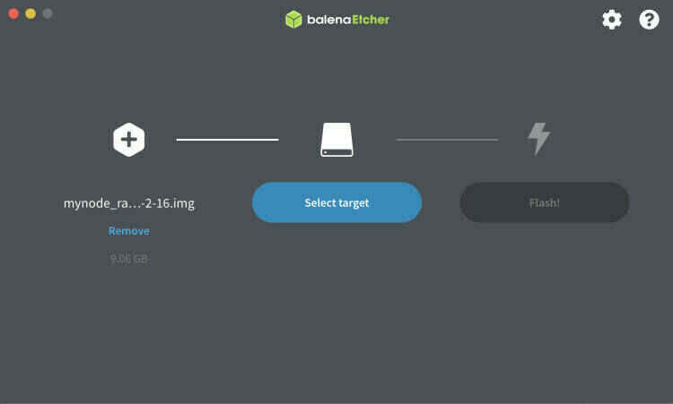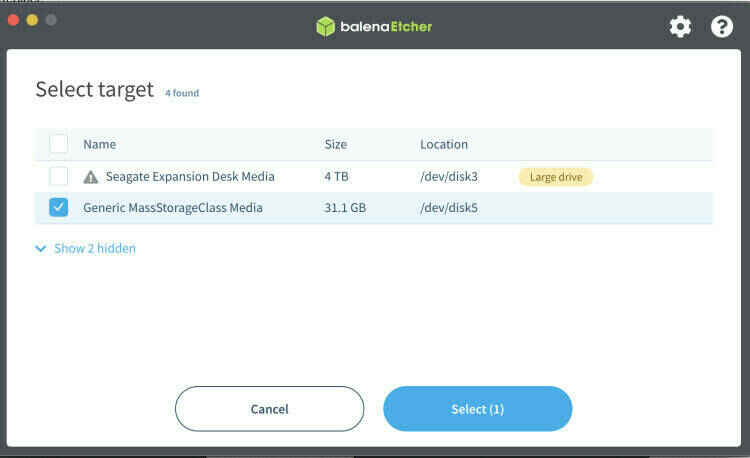
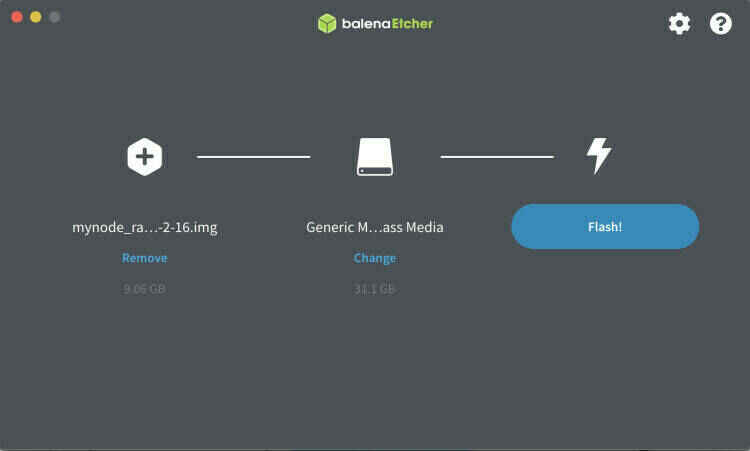
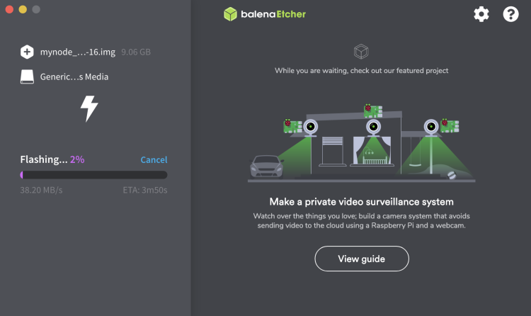
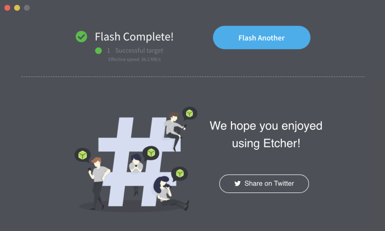

完了したら、ドライブは読み取り不可になります。オペレーティングシステムからエラーが発生する場合があり、ドライブはデスクトップから消えるはずです。カードを抜きます。

## PiのセットアップとSDカードの挿入

パーツ（ケースは表示されていません）：

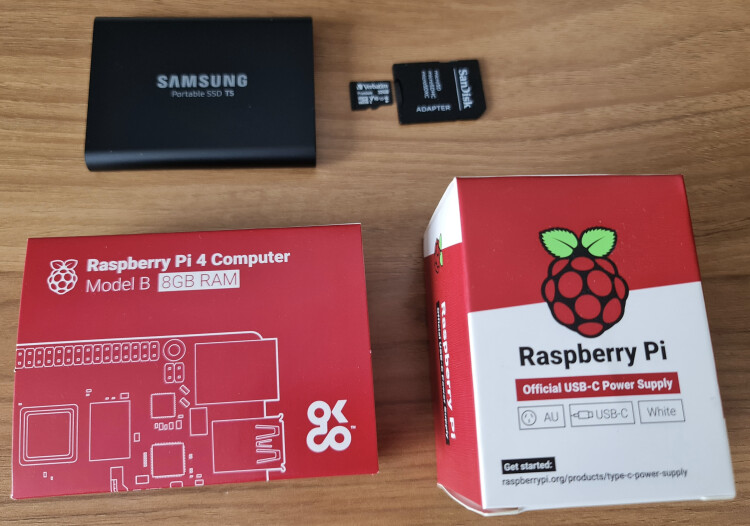
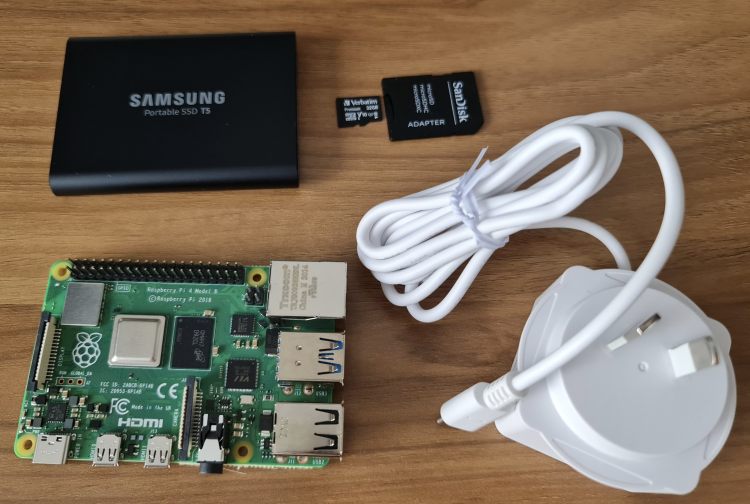

イーサネットケーブルとハードドライブのUSBコネクタ（まだ電源は入れないでください）を接続します。中央の青色のUSBポートに接続しないでください。それらはUSB 3です。MyNodeは、ドライブがUSB 3に対応している場合でも、USB 2ポートを使用することを推奨しています。

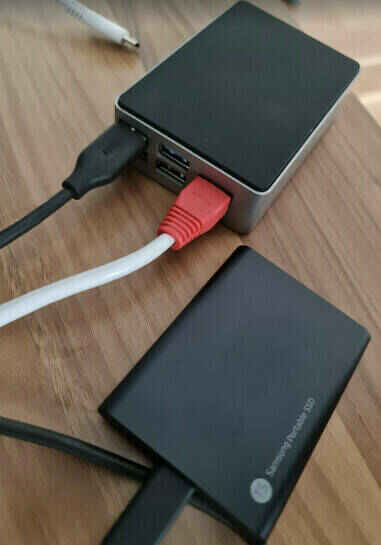

マイクロSDカードはここに挿入します：

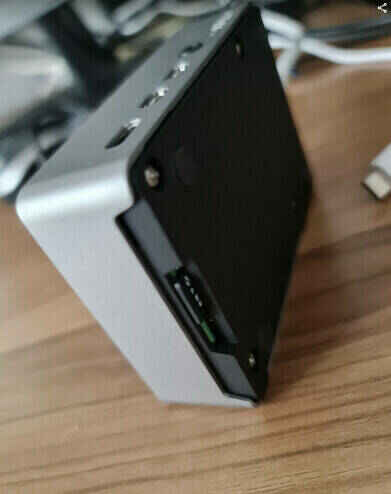

最後に、電源を接続します：

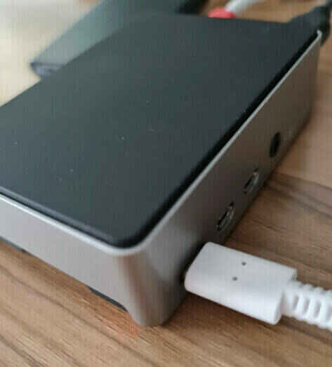

## PiのIPアドレスを見つける

MyNodeではモニターは必要ありません。ただし、ホームネットワーク上の別のコンピュータが必要です。Piがイーサネットで接続されていない場合でWiFiに頼りたい場合、IPを見つけるには高度なコンピュータスキルが必要です。申し訳ありませんが、お手伝いできません。イーサネット接続が必要です（問題は、WiFiに接続してパスワードを入力するためにモニターとオペレーティングシステムへのアクセスが必要なことから発生します）。

ルーターを確認して、すべての接続されたデバイスのIPのリストを取得します。

私はブラウザに192.168.0.1と入力し（私のルーターに付属している手順）、ログインし、IPが192.168.0.18のデバイス「MyNode」を見ることができました。これらのIPアドレスはインターネットに公開されていません（最初にルーターを経由します）、それらはただのホームネットワーク上のデバイスの識別子です。

IPを見つけることは重要です。

> 更新：MacまたはLinuxマシンのターミナルを使用して、コマンド「arp -a」を使用してホームネットワーク上のすべてのイーサネット接続デバイスのIPアドレスを見つけることができます。出力はルーターが表示するものほど見栄えはしませんが、必要な情報はすべてそこにあります。Piがどれか明らかでない場合は、試行錯誤してください。

## PiにSSHで接続する

SSHコマンドを使用してリモートでデバイスにログインするオプションがありますが、必須ではありません（RaspiBlitz Nodeの場合は必須です）。非常に便利なので、どのように行うかをお見せします。

MacまたはLinuxコンピュータを開きます（Windowsの場合はSSHツールであるputtyをダウンロードしてください）。

```bash
ssh admin@192.168.0.18
```

自分のIPアドレスを使用してください。MyNodeデバイスのユーザー名はデフォルトで「admin」です。パスワードはデフォルトで「bolt」です。

以前にPiを使用してマイクロSDカードを入れ替えた場合、次のエラーが表示されます：

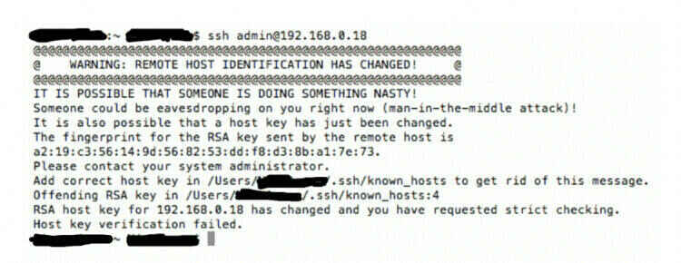

する必要があるのは、「known_hosts」というファイルがある場所に移動して削除することです。安全です。エラーメッセージにパスが表示されます。私の場合は/Users/MyUserName/.ssh/でした。

sshの前に「.」を忘れないでください。これは、隠しディレクトリであることを示しています。

その後、sshコマンドを再試行してください。

今回は、次の出力が表示されます：

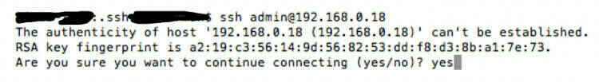

削除したファイルが削除され、新しい指紋が追加されます。yesと入力して<enter>を押します。

パスワードを入力するように求められます。デフォルトでは「bolt」です。
今、モニターなしでMyNode Piにターミナルアクセスができ、すべてがスムーズにロードされていることを確認できました。
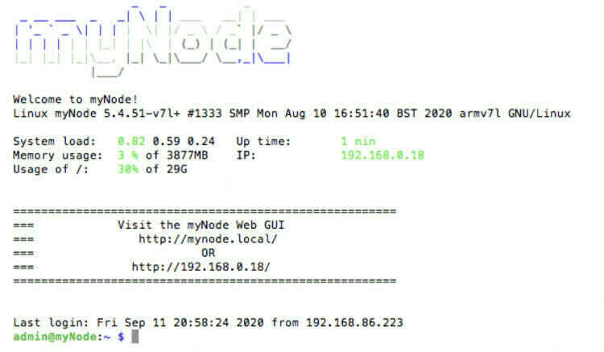

## ウェブブラウザ経由でのアクセス

ブラウザを開きます。自宅のネットワーク上のコンピュータである必要があります。外部からはできません。方法はありますが、難しいです。私はテストしていません。

ブラウザのアドレスウィンドウにIPアドレスを入力します。以下のようになります：

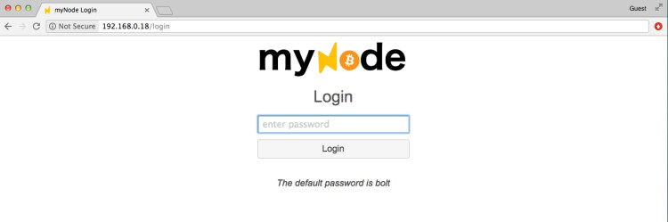

パスワード「bolt」を入力します。後で変更してください。

その後、以下のようになります：

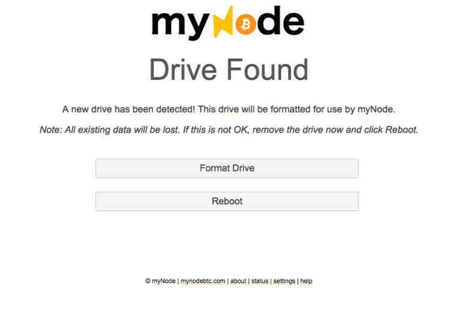

ドライブのフォーマットを選択します。

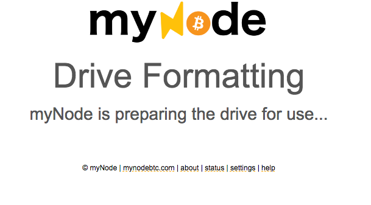

それでは待ちましょう。

いずれかの時点で、製品キーを入力するか、無料の「コミュニティエディション」を使用するかを尋ねられます。私はプレミアムエディションを表示します。できるだけプレミアムバージョンを購入することをお勧めします。非常に価値があります。

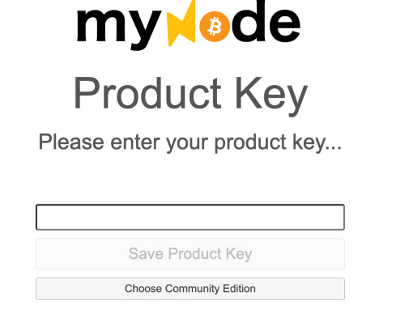

ブロックのダウンロードの進捗状況が表示されます。数日かかります：


ダウンロード中にマシンの電源を切っても安全です。設定に移動し、マシンの電源を切るボタンを見つけてください。ただコードを引っ張らないでください。インストールまたはハードドライブを破損する可能性があります。

初めに、「設定」に移動して、quick syncを無効にしてください。初期ブロックのダウンロードが最初から始まります。

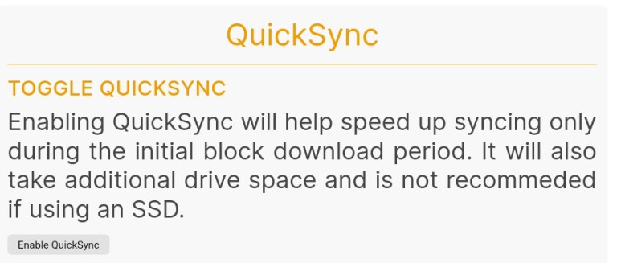

ガイドの作成を進めたかったので、ここに以前に準備した別のMyNodeがあります。これは、ブロックチェーンが同期され、いくつかの「アプリ」が有効になり、同期されたときのページの見た目です：

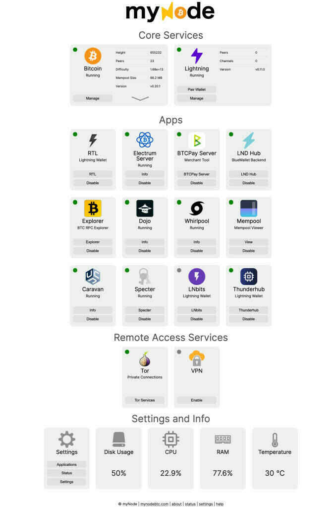

Electrum Serverも同期する必要があることに注意してください。Bitcoin Blockchainが同期されたら、そのプロセスを開始するボタンをクリックしてください。1日か2日かかります。それ以外のすべては、有効にすることを選択した後数分で有効になります。クリックして試してみることができます。何も壊れません。何かが壊れた場合（私にはこれが起こりましたが、おそらく安いパーツのせいです）、再フラッシュして再度ダウンロードを開始する必要があります。MyNodeの問題は、「再フラッシュ」が必要な場合、ブロックチェーンの同期を最初からやり直さなければならないことです。これには技術的な方法がありますが、簡単ではありません。

RaspiBlitzなど別のノードを試したい場合は、追加のSSD外付けハードドライブと別のマイクロSDカードが必要です。それ以外は同じ装置ですが、当然ながらMyNodeとRaspiBlitzを同時に実行することはできません。それを行う場合は、別のRaspberry Piを購入する時間です。

ノードが稼働しているので、ただ放置して何もしないでください。ElectrumデスクトップウォレットをElectrum ServerとBitcoin Coreに接続する方法については、私の記事（およびビデオ）を参照してください。