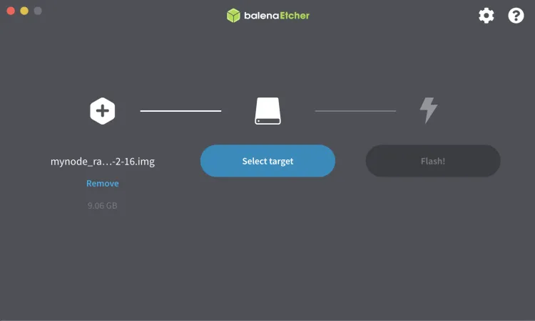
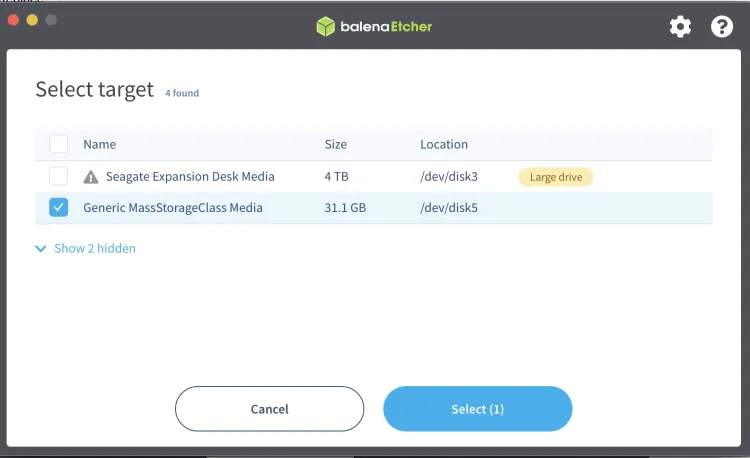

https://mynodebtc.com/

A maneira mais fácil e poderosa de executar um nó Bitcoin e Lightning! Combinamos o melhor software de código aberto com nossa interface, gerenciamento e suporte para que você possa usar Bitcoin e Lightning de forma fácil, privada e segura.

## Tipos de configurações de nó

Existem várias configurações de nó. O MyNode é excelente. Existem muitos aplicativos que vêm com ele e ainda mais se você pagar pela versão premium. Caso contrário, é muito tedioso baixar todos esses aplicativos por conta própria. O MyNode torna isso bastante fácil, como você verá.

Uma opção alternativa e semelhante é o RaspiBlitz. A GUI não é tão boa e os aplicativos se sobrepõem muito aos aplicativos que vêm com o MyNode, mas o Raspiblitz é um software de código aberto gratuito (FOSS) e o MyNode não é exatamente. Outra diferença é que o MyNode é executado em um contêiner Docker. Acho o Docker intimidante e difícil de solucionar problemas. Isso só é um problema se você encontrar erros ou bugs. O desenvolvedor oferece ajuda para usuários premium e também há um grupo de bate-papo no Telegram.

O RaspiBlitz é apenas vários programas instalados no Linux, sem o Docker. O disco rígido externo pode ser facilmente conectado a outra máquina Linux com o Bitcoin Core e pronto, caso você precise.

Outra opção é simplesmente instalar o Bitcoin Core e uma variedade de servidor Electrum (existem vários) em um sistema operacional. Tenho guias para Linux (Raspberry Pi), Mac e Windows.

## Lista de compras

- Raspberry Pi 4, 4 GB de memória ou 8 GB (4 GB é suficiente)

- Fonte de alimentação oficial do Raspberry Pi (Muito importante! Não compre genérico, sério)

- Uma caixa para o Pi. A caixa FLIRC é incrível. A caixa inteira é um dissipador de calor e você não precisa de um ventilador, que pode ser barulhento

- Cartão microSD de 16 GB (você precisa de um, mas alguns são úteis)

- Um leitor de cartão de memória (a maioria dos computadores não possui uma entrada para cartão microSD).

- Disco rígido externo SSD de 1 TB.  
  Observação: o SSD é crucial. Não use um disco rígido externo portátil, mesmo que seja mais barato

- Um cabo Ethernet (para conectar ao roteador de sua casa)

- Você não precisa de um monitor

## Baixar a Imagem do MyNode

Acesse o link do site do MyNode


Clique em <Download Now>

Baixe a versão para Raspberry Pi 4:


É um arquivo grande:


Baixe os hashes SHA 256


Abra o terminal no Mac ou Linux ou Prompt de Comando no Windows. Digite:

```
Mac/Linux: “shasum -a 256 NOME_DO_ARQUIVO_BAIXADO”
Windows: “certUtil -hashfile NOME_DO_ARQUIVO_BAIXADO SHA256”
```

O computador pensa por cerca de 20 segundos. Em seguida, verifique se o hash de saída corresponde ao baixado no site na etapa anterior. Se for idêntico, você pode prosseguir.
Grave o cartão SD

## Baixar e instalar o Balena Etcher. Link

Não consegui encontrar a assinatura digital para isso. Se você souber como, por favor me avise e eu atualizarei este artigo.
O Etcher é autoexplicativo de usar. Insira seu cartão micro SD e grave o software Raspberry Pi (.img file) no cartão SD.






Uma vez feito isso, o drive não é mais legível. Você pode receber um erro do sistema operacional e o drive deve desaparecer da área de trabalho. Retire o cartão.

## Configure o Pi e insira o cartão SD

As peças (case não mostrado):


Conecte o cabo Ethernet e o conector USB do disco rígido (ainda não ligue a energia). Evite conectar nas portas USB de cor azul no centro. Elas são USB 3. A MyNode recomenda que você use a porta USB 2, mesmo que o drive seja compatível com USB 3.


O cartão micro SD vai aqui:


Por fim, conecte a energia:


## Encontre o endereço IP do Pi

Você nunca precisa de um monitor com o MyNode. No entanto, você precisa de outro computador na rede doméstica. Se o seu Pi não estiver conectado por Ethernet e você quiser usar o WiFi, encontrar o IP requer habilidades avançadas em informática. Não posso ajudar, desculpe. Você precisa de uma conexão Ethernet. (O problema vem da necessidade de acesso a um monitor e ao sistema operacional para se conectar ao WiFi e inserir uma senha).

Verifique o seu roteador para obter uma lista de todos os IPs dos dispositivos conectados.

Digitei 192.168.0.1 no navegador (instruções que vieram com o meu roteador), fiz login e consegui ver um dispositivo "MyNode" com o IP 192.168.0.18. Observe que esses endereços IP não são visíveis publicamente na internet (eles passam primeiro pelo roteador), eles são apenas identificadores para dispositivos em sua rede doméstica.

Encontrar o IP é crucial.

> ATUALIZAÇÃO: você pode usar o terminal em um Mac ou Linux para encontrar o endereço IP de todos os dispositivos conectados por Ethernet na rede doméstica usando o comando "arp -a". A saída não é tão bonita quanto o que o roteador exibirá, mas todas as informações necessárias estão lá. Se não estiver óbvio qual é o Pi, faça tentativa e erro.

## Acesse o Pi via SSH

Você tem a opção de fazer login no dispositivo remotamente por meio do comando SSH, mas não é obrigatório (é se for um RaspiBlitz Node). Vou mostrar como fazer de qualquer maneira, pois é muito útil.

Abra um computador Mac ou Linux (para Windows, baixe o putty, uma ferramenta SSH) e digite:

```
ssh admin@192.168.0.18
```

Use seu próprio endereço IP. O nome de usuário para o dispositivo MyNode é "admin" por padrão. A senha é "bolt" por padrão.

Se você já usou seu Pi antes e trocou o cartão micro SD, você receberá este erro:


O que você precisa fazer é navegar até onde o arquivo "known_hosts" está e excluí-lo. É seguro fazer isso. A mensagem de erro mostra o caminho. Para mim, foi /Usuários/MeuNomeDeUsuário/.ssh/'
Não se esqueça do "." antes de ssh, isso indica que é um diretório oculto.
Em seguida, tente o comando ssh novamente.

Desta vez, você verá esta saída:


O arquivo que você excluiu foi excluído e você está adicionando uma nova impressão digital. Digite yes e <enter>.

Você será solicitado a inserir a senha. É "bolt".

Agora você tem acesso ao terminal do MyNode Pi, sem um monitor, e pode confirmar que tudo foi carregado corretamente.


## Acesso via navegador da web

Abra um navegador. Precisa ser um computador em sua rede doméstica, você não pode fazer isso de fora. Há uma maneira, mas é difícil. Eu não testei.

Digite o endereço IP na janela de endereço do navegador. Isso acontecerá:


Digite a senha "bolt" - altere-a posteriormente.

Então isso acontecerá:


Escolha Formatar Unidade


Agora, esperamos.

Em algum momento, você será perguntado se deseja inserir sua chave de produto ou usar a "edição comunitária" gratuita - vou mostrar a edição Premium. Eu recomendo pagar pela versão premium se você puder pagar, vale muito a pena.


Em seguida, você verá o progresso dos blocos baixados. Leva dias:


É seguro desligar a máquina durante o download, se necessário. Vá para as configurações e encontre o botão para desligar a máquina. Não simplesmente puxe o cabo, você pode corromper a instalação ou o disco rígido.

Certifique-se, no início, vá para "Configurações" e desative o quicksync. Ele começará o download do bloco inicial desde o início.


Eu queria prosseguir com a criação do guia, então aqui está outro MyNode que preparei anteriormente. É assim que a página fica quando o blockchain está sincronizado e vários "apps" foram habilitados e sincronizados:


Observe que o Electrum Server também precisa ser sincronizado, portanto, assim que o Blockchain do Bitcoin estiver sincronizado, clique no botão para iniciar esse processo - leva um ou dois dias. Tudo o mais é habilitado em alguns minutos assim que você selecionar para habilitá-lo. Você pode clicar nas coisas e explorar. Você não vai quebrar nada. Se algo quebrar (isso aconteceu comigo, mas acho que foi porque eu tinha peças baratas), você terá que regravar e começar a baixar novamente. O problema que tenho com o MyNode é que, se você precisar "regravar", precisará começar a sincronização do blockchain novamente do zero. Existem maneiras técnicas de contornar isso, mas não é fácil.

Se você quiser experimentar outro nó também, digamos um RaspiBlitz, você precisará de um disco rígido externo SSD adicional e outro cartão micro SD para gravar. Caso contrário, é o mesmo equipamento, você simplesmente não pode executar o MyNode e o RaspiBlitz simultaneamente, obviamente. Se você quiser fazer isso, é hora de procurar outro Raspberry Pi.

Agora que você tem um nó em execução, use-o, não o deixe apenas parado sem fazer nada por você. Siga meu artigo (e vídeo) sobre como conectar sua carteira de desktop Electrum ao Electrum Server e Bitcoin Core aqui.
