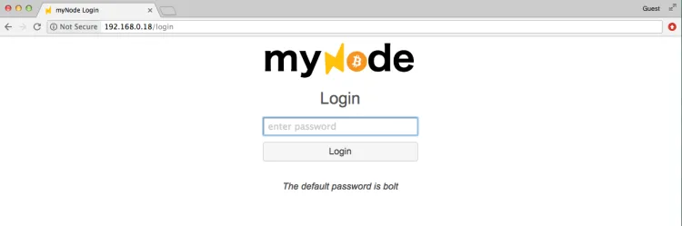
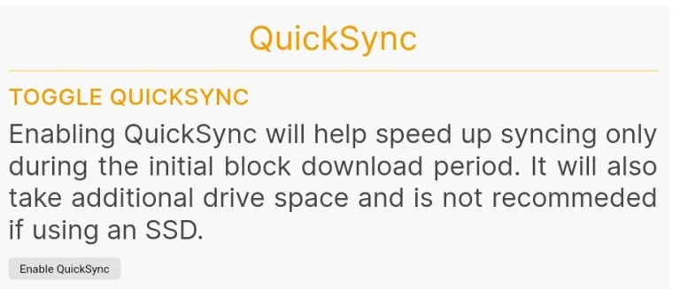
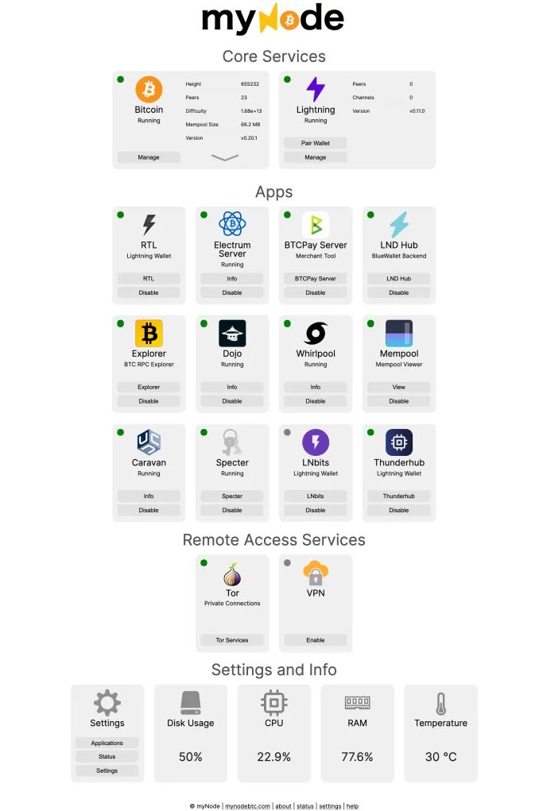

https://mynodebtc.com/

Самый простой и мощный способ запустить Bitcoin и Lightning ноду! Мы объединяем лучшее программное обеспечение с открытым исходным кодом с нашим интерфейсом, управлением и поддержкой, чтобы вы могли легко, конфиденциально и безопасно использовать Bitcoin и Lightning.

## Типы настроек нод

Существуют различные настройки нод. MyNode отлично подходит. С ним поставляется множество приложений, и еще больше, если вы платите за премиум-версию. В противном случае, скачивание всех этих приложений самостоятельно может быть очень утомительным. MyNode значительно упрощает этот процесс, как вы увидите.

Альтернативным и похожим вариантом является RaspiBlitz. Графический интерфейс не такой приятный, и приложения много пересекаются с приложениями, которые идут с MyNode, но Raspiblitz является бесплатным программным обеспечением с открытым исходным кодом (FOSS), а MyNode - нет. Еще одно отличие заключается в том, что MyNode работает в контейнере Docker. Docker кажется мне пугающим и сложным для устранения неполадок. Это становится проблемой только в случае возникновения ошибок или сбоев. Разработчик предлагает помощь для пользователей премиум-версии, также есть группа в Telegram.

RaspiBlitz - это просто несколько программ, установленных на Linux, без Docker. Внешний жесткий диск легко может быть подключен к другой машине Linux с Bitcoin Core, и вы можете начать работу, если это необходимо.

Еще один вариант - просто установить Bitcoin Core и один из вариантов Electrum Server (их несколько) на операционную систему. У меня есть руководства для Linux (Raspberry Pi), Mac и Windows.

## Список покупок

- Raspberry Pi 4, память 4Gb или 8Gb (4Gb вполне достаточно)

- Официальное питание для Raspberry Pi (Очень важно! Не покупайте неоригинальное, серьезно)

- Корпус для Pi. Корпус FLIRC прекрасен. Весь корпус является радиатором, и вам не нужен вентилятор, который может быть шумным

- Карта памяти microSD 16 Gb (вам нужна одна, но несколько будут удобны)

- Кардридер (в большинстве компьютеров нет слота для карты microSD).

- Внешний SSD на 1Tb.  
  Примечание: SSD критически важен. не используйте портативный внешний жесткий диск, даже если он дешевле

- Сетевой кабель (для подключения к домашнему роутеру)

- Монитор вам не нужен

## Скачивание образа MyNode

Перейдите на сайт MyNode Link


Нажмите <Download Now>

Скачайте версию для Raspberry Pi 4:


Это большой файл:


Скачайте хеши SHA 256


Откройте терминал на Mac или Linux или Командную строку для Windows. Введите:

```bash
shasum -a 256 DOWNLOADEDFILENAME # <--- Mac/Linux
certUtil -hashfile DOWNLOADEDFILENAME SHA256 # <--- Windows
```

Компьютер подумает около 20 секунд. Затем проверьте, что выходной хеш-файл совпадает с тем, который был скачан с сайта на предыдущем шаге. Если они идентичны, вы можете продолжить.
Запишите SD карту

## Скачайте и установите Balena Etcher. Link

Я не смог найти цифровую подпись для этого. Если вы знаете как, пожалуйста, дайте мне знать, и я обновлю эту статью.

Использование Etcher интуитивно понятно. Вставьте вашу карту micro SD и запишите программное обеспечение для Raspberry Pi (.img файл) на SD карту.


После завершения процесса диск становится недоступным для чтения. Может появиться ошибка от операционной системы, и диск должен исчезнуть с рабочего стола. Выньте карту.

## Настройка Pi и вставка SD-карты

Комплектующие (корпус не показан):


Подключите сетевой кабель и USB-коннектор жесткого диска (пока не подключайте питание). Избегайте подключения к синим USB-портам по центру. Это USB 3. MyNode рекомендует использовать порт USB 2, даже если диск может поддерживать USB 3.


SD-карта вставляется сюда:


Наконец, подключите питание:


## Нахождение IP-адреса Pi

С MyNode вам никогда не понадобится монитор. Однако вам понадобится другой компьютер в домашней сети. Если ваш Pi не подключен через Ethernet и вы хотите использовать WiFi, поиск IP требует высокого уровня компьютерных навыков. Извините, помочь не могу. Вам нужно подключение через Ethernet. (Проблема заключается в необходимости доступа к монитору и операционной системе для подключения к WiFi и ввода пароля).

Проверьте ваш маршрутизатор на предмет списка всех IP всех подключенных устройств.

Я ввел 192.168.0.1 в браузер (инструкции, которые шли с моим маршрутизатором), вошел в систему и смог увидеть устройство "MyNode" с IP 192.168.0.18. Обратите внимание, что эти IP-адреса не видны в интернете (они проходят через маршрутизатор), это просто идентификаторы устройств в вашей домашней сети.

Нахождение IP критически важно.

> ОБНОВЛЕНИЕ: вы можете использовать терминал на компьютере Mac или Linux, чтобы найти IP-адрес всех устройств, подключенных через Ethernet, в домашней сети с помощью команды “arp -a”. Вывод не такой красивый, как покажет маршрутизатор, но вся необходимая информация там. Если не очевидно, какой из них Pi, попробуйте методом проб и ошибок.

## SSH-подключение к Pi

У вас есть возможность удаленно войти в устройство с помощью команды SSH, но это не обязательно (если это RaspiBlitz Node). Я всё равно покажу вам, как это сделать, так как это очень удобно.

Откройте компьютер Mac или Linux (для Windows скачайте putty, инструмент SSH) и введите:

```bash
ssh admin@192.168.0.18
```

Используйте свой собственный IP-адрес. Имя пользователя для устройства MyNode по умолчанию — “admin”. Пароль по умолчанию — “bolt”.

Если вы ранее использовали свой Pi и меняли SD-карту, вы получите эту ошибку:


Вам нужно перейти к файлу “known_hosts” и удалить его. Это безопасно. Сообщение об ошибке покажет вам путь. Для меня это было /Users/MyUserName/.ssh/

Не забудьте про “.” перед ssh, это указывает, что это скрытая директория.

Затем попробуйте команду ssh снова.

На этот раз вы увидите следующий вывод:


Удаленный файл был удален, и вы добавляете новый отпечаток. Наберите yes и нажмите <enter>.

Вас попросят ввести пароль. Это “bolt”.
Теперь у вас есть доступ к терминалу MyNode Pi без монитора, и вы можете подтвердить, что все загрузилось без проблем.


## Доступ через веб-браузер

Откройте браузер. Это должен быть компьютер в вашей домашней сети, вы не можете сделать это извне. Есть способ, но это сложно. Я не тестировал это.

Введите IP-адрес в окно адреса браузера. Вот что произойдет:



Введите пароль “bolt” – измените его позже.

Затем произойдет следующее:


Выберите Форматировать Диск


Теперь мы ждем.

В какой-то момент вас спросят, хотите ли вы ввести свой продуктовый ключ или использовать бесплатную “коммьюнити версию” — я покажу Премиум версию. Я действительно рекомендую платить за премиум-версию, если вы можете себе это позволить, это того стоит.


Затем вы увидите прогресс загрузки блоков. Это займет дни:


Вы можете безопасно выключить машину во время загрузки, если вам нужно. Перейдите в настройки и найдите кнопку для выключения машины. Не выдергивайте шнур, вы можете повредить установку или жесткий диск.

Убедитесь, что сразу же перейдите в “Настройки” и отключите быструю синхронизацию. Это начнет начальную загрузку блоков сначала.



Я хотел продолжить создание руководства, поэтому вот другой MyNode, который я подготовил заранее. Вот как выглядит страница, когда блокчейн синхронизирован, и несколько “приложений” были включены и синхронизированы:



Обратите внимание, что Electrum Server также должен синхронизироваться, так что как только Bitcoin Blockchain синхронизируется, нажмите кнопку, чтобы начать этот процесс – это займет день или два. Все остальное включается за несколько минут после того, как вы выберете его активацию. Вы можете нажимать на вещи и исследовать. Ничего не сломается. Если что-то сломается (это случилось со мной, но я думаю из-за дешевых деталей), вам придется перезаписать и начать загрузку снова. Проблема с MyNode в том, что если вам нужно “перезаписать”, вам приходится начинать синхронизацию блокчейна сначала. Есть технические способы обойти это, но это не просто.

Если вы хотите попробовать другой узел, например, RaspiBlitz, вам понадобится дополнительный внешний жесткий диск SSD и еще одна карта micro SD для записи. В остальном это те же самые устройства, вы просто не можете одновременно запускать MyNode и RaspiBlitz, очевидно. Если вы хотите это сделать, пора искать другой Raspberry Pi.

Теперь, когда у вас есть работающий узел, используйте его, не позволяйте ему просто сидеть без дела. Следуйте моей статье (и видео) о том, как подключить ваш Electrum Desktop Wallet к Electrum Server и Bitcoin Core здесь.